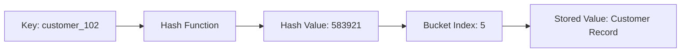
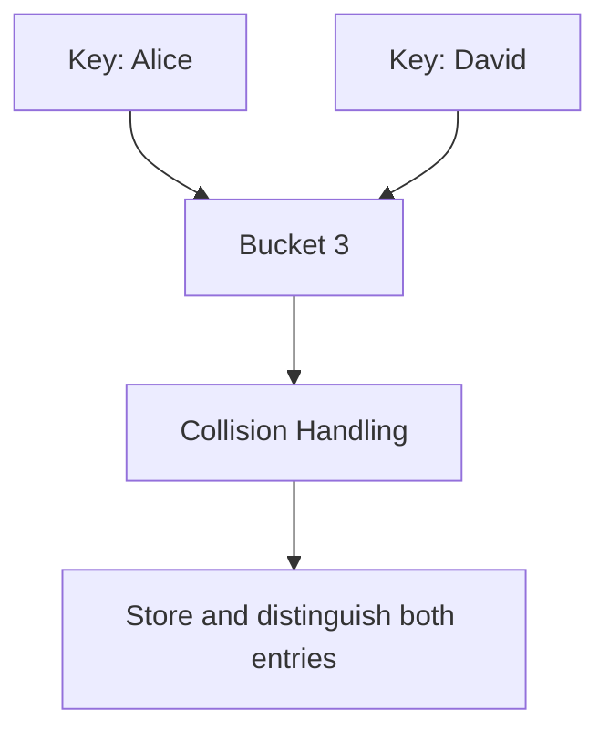
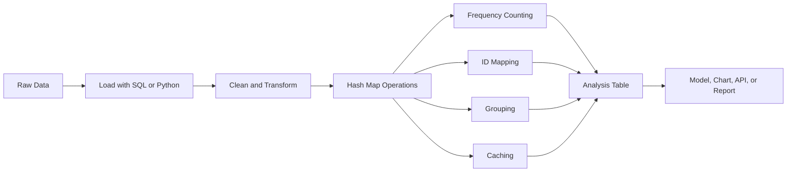
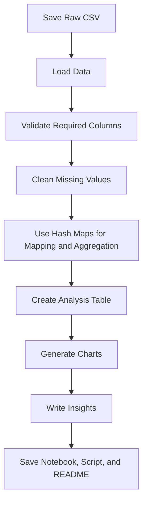

# 016 - Hash Map

**Course:** 02 - Coding and EDA
**Module:** Module 04 - Coding for Data Science
**Content Group:** Data Structures and Algorithms
**Roadmap Source:** Coding for Data Science / Data Structures and Algorithms
**Lesson Type:** Coding
**Order in Module:** 016
**Suggested Duration:** 20 minutes

---

## 1. Overview

A **Hash Map** is a data structure that stores information as **key-value pairs**.

Instead of finding an item by scanning through every element, a hash map uses a **hash function** to determine where the value associated with a key should be stored.

Hash maps are widely used in AI and Data Science for:

* Counting category frequencies
* Mapping labels to numerical IDs
* Caching expensive computations
* Looking up configuration values
* Grouping records
* Removing duplicates
* Joining data from different sources
* Storing model parameters and metadata

In Python, the built-in `dict` type is implemented using a hash-table-based structure.

---

## 2. Learning Objectives

After completing this lesson, you should be able to:

* Explain what a hash map is in your own words.
* Understand how keys, values, hash functions, and buckets work.
* Perform insertion, lookup, update, and deletion operations.
* Explain hash collisions and common collision-handling strategies.
* Analyze the time and space complexity of hash map operations.
* Use Python dictionaries in practical Data Science workflows.
* Apply hash maps to frequency counting, grouping, caching, and label encoding.
* Identify situations where a hash map is not the best data structure.

---

## 3. Core Concept

A hash map stores data in the following form:

```text
key -> value
```

Examples:

```text
"customer_id" -> 1052
"model_name"  -> "RandomForest"
"accuracy"    -> 0.91
```

A Python dictionary represents the same structure:

```python
model_info = {
    "model_name": "RandomForest",
    "accuracy": 0.91,
    "n_estimators": 200
}
```

Each key is unique and is associated with one value.

---

## 4. How a Hash Map Works

A hash map usually contains:

1. A **key**
2. A **value**
3. A **hash function**
4. An internal array of storage locations called **buckets**

The hash function converts a key into an integer. That integer is then used to determine the bucket where the value should be stored.



A simplified bucket calculation may look like this:

```text
bucket_index = hash(key) % number_of_buckets
```

For example:

```text
hash("customer_102") = 583921
number_of_buckets = 8

bucket_index = 583921 % 8
bucket_index = 1
```

The key-value pair is stored in bucket `1`.

> The exact implementation of Python dictionaries is more sophisticated than this simplified model.

---

## 5. Basic Hash Map Operations

### 5.1 Create a Hash Map

```python
student_scores = {
    "Alice": 85,
    "Bob": 91,
    "Charlie": 78
}
```

---

### 5.2 Insert a New Key-Value Pair

```python
student_scores["David"] = 88
```

Result:

```python
{
    "Alice": 85,
    "Bob": 91,
    "Charlie": 78,
    "David": 88
}
```

---

### 5.3 Look Up a Value

```python
score = student_scores["Bob"]
print(score)
```

Output:

```text
91
```

Using `.get()` is safer when the key may not exist:

```python
score = student_scores.get("Emma", 0)
print(score)
```

Output:

```text
0
```

---

### 5.4 Update a Value

```python
student_scores["Alice"] = 90
```

---

### 5.5 Delete a Key-Value Pair

```python
del student_scores["Charlie"]
```

A safer alternative is `.pop()`:

```python
removed_score = student_scores.pop("Charlie", None)
```

---

### 5.6 Check Whether a Key Exists

```python
if "Bob" in student_scores:
    print("Bob exists in the hash map.")
```

---

### 5.7 Iterate Through a Hash Map

Iterate through keys:

```python
for student in student_scores:
    print(student)
```

Iterate through values:

```python
for score in student_scores.values():
    print(score)
```

Iterate through both keys and values:

```python
for student, score in student_scores.items():
    print(student, score)
```

---

## 6. Hashable Keys

A Python dictionary key must be **hashable**.

A hashable object has a stable hash value during its lifetime.

Common hashable types include:

* `str`
* `int`
* `float`
* `bool`
* `tuple`, when all contained values are hashable
* `frozenset`

Example:

```python
coordinates = {
    (10.5, 20.3): "Sensor A",
    (11.2, 21.8): "Sensor B"
}
```

Mutable objects such as lists cannot be dictionary keys:

```python
invalid_map = {
    [1, 2, 3]: "value"
}
```

This produces:

```text
TypeError: unhashable type: 'list'
```

Use a tuple instead:

```python
valid_map = {
    (1, 2, 3): "value"
}
```

---

## 7. Hash Collisions

A **hash collision** occurs when two different keys are assigned to the same bucket.

For example:

```text
hash("Alice") % 8 = 3
hash("David") % 8 = 3
```

Both keys map to bucket `3`.



A correct hash map must store both key-value pairs and distinguish them using the original keys.

---

## 8. Collision-Handling Strategies

### 8.1 Separate Chaining

Each bucket stores multiple entries, often using a linked list or another collection.

```text
Bucket 0 -> []
Bucket 1 -> [("model_a", 0.91)]
Bucket 2 -> [("model_b", 0.87), ("model_c", 0.89)]
Bucket 3 -> []
```

Advantages:

* Simple to implement
* Can store multiple collided entries

Disadvantages:

* Additional memory is required
* Performance decreases if many keys share one bucket

---

### 8.2 Open Addressing

When a collision occurs, the hash map searches for another available bucket.

Common probing methods include:

* Linear probing
* Quadratic probing
* Double hashing

Example of linear probing:

```text
Target bucket: 3
Bucket 3 is occupied
Check bucket 4
Bucket 4 is available
Store the new entry in bucket 4
```

Python dictionaries use an optimized open-addressing strategy internally.

---

## 9. Load Factor and Resizing

The **load factor** measures how full a hash map is.

$$
\text{Load Factor} = \frac{\text{Number of Stored Entries}} {\text{Number of Buckets}}
$$

For example:

```text
Stored entries = 6
Buckets = 8

Load factor = 6 / 8 = 0.75
```

When the hash map becomes too full:

* Collisions become more frequent.
* Lookup performance may decrease.
* The internal storage may be resized.
* Existing entries may need to be rehashed.

Resizing takes time, but it helps preserve efficient average-case operations.

---

## 10. Time and Space Complexity

Let (n) be the number of entries in the hash map.

| Operation                   | Average Case | Worst Case |
| --------------------------- | -----------: | ---------: |
| Insert                      |       (O(1)) |     (O(n)) |
| Search                      |       (O(1)) |     (O(n)) |
| Update                      |       (O(1)) |     (O(n)) |
| Delete                      |       (O(1)) |     (O(n)) |
| Iterate through all entries |       (O(n)) |     (O(n)) |

The average-case performance is constant time because the hash function directly identifies a likely storage location.

The worst case can become (O(n)) when:

* Many keys collide.
* The hash distribution is poor.
* An attacker intentionally creates collision-heavy inputs.
* The table becomes excessively full.

### Space Complexity

A hash map generally requires:

$$
O(n)
$$

space, although its internal bucket array may use more memory than the number of stored entries.

---

## 11. Hash Map vs. Array

| Characteristic                 | Hash Map              | Array or List           |
| ------------------------------ | --------------------- | ----------------------- |
| Access method                  | Key                   | Numeric index           |
| Average lookup                 | (O(1))                | (O(1)) by index         |
| Search by value                | (O(n))                | (O(n))                  |
| Maintains sequential positions | No                    | Yes                     |
| Keys can be descriptive        | Yes                   | No                      |
| Memory overhead                | Higher                | Lower                   |
| Best use case                  | Fast key-based lookup | Ordered sequential data |

Example:

```python
# List
temperatures = [28.5, 29.1, 27.8]

print(temperatures[1])
```

```python
# Hash map
temperatures = {
    "Monday": 28.5,
    "Tuesday": 29.1,
    "Wednesday": 27.8
}

print(temperatures["Tuesday"])
```

Use a list when the position matters.

Use a hash map when a meaningful key identifies each value.

---

## 12. Hash Map in the Data Science Workflow



Hash maps frequently appear in preprocessing, feature engineering, model evaluation, and application deployment.

---

## 13. Practical Data Science Applications

### 13.1 Frequency Counting

Suppose we have a list of customer regions:

```python
regions = [
    "North",
    "South",
    "North",
    "East",
    "South",
    "North"
]
```

We can count their frequencies using a dictionary:

```python
region_counts = {}

for region in regions:
    if region not in region_counts:
        region_counts[region] = 0

    region_counts[region] += 1

print(region_counts)
```

Output:

```python
{
    "North": 3,
    "South": 2,
    "East": 1
}
```

A shorter implementation uses `.get()`:

```python
region_counts = {}

for region in regions:
    region_counts[region] = region_counts.get(region, 0) + 1
```

Python also provides `Counter`:

```python
from collections import Counter

region_counts = Counter(regions)

print(region_counts)
```

---

### 13.2 Label Encoding

Machine Learning models usually require numerical input.

A hash map can convert category labels into integer IDs:

```python
label_to_id = {
    "cat": 0,
    "dog": 1,
    "bird": 2
}

labels = ["dog", "cat", "bird", "dog"]

encoded_labels = [label_to_id[label] for label in labels]

print(encoded_labels)
```

Output:

```text
[1, 0, 2, 1]
```

The reverse mapping can decode model predictions:

```python
id_to_label = {
    0: "cat",
    1: "dog",
    2: "bird"
}

predictions = [1, 2, 0]

decoded_predictions = [
    id_to_label[prediction]
    for prediction in predictions
]

print(decoded_predictions)
```

Output:

```text
['dog', 'bird', 'cat']
```

---

### 13.3 Building a Mapping from Two Columns

Suppose a dataset contains product IDs and product names:

```python
product_ids = [101, 102, 103]
product_names = ["Laptop", "Keyboard", "Monitor"]

product_map = dict(zip(product_ids, product_names))

print(product_map)
```

Output:

```python
{
    101: "Laptop",
    102: "Keyboard",
    103: "Monitor"
}
```

---

### 13.4 Grouping Records

```python
sales = [
    {"region": "North", "revenue": 100},
    {"region": "South", "revenue": 150},
    {"region": "North", "revenue": 120},
    {"region": "East", "revenue": 90}
]
```

Group revenue values by region:

```python
revenue_by_region = {}

for record in sales:
    region = record["region"]
    revenue = record["revenue"]

    if region not in revenue_by_region:
        revenue_by_region[region] = []

    revenue_by_region[region].append(revenue)

print(revenue_by_region)
```

Output:

```python
{
    "North": [100, 120],
    "South": [150],
    "East": [90]
}
```

Using `defaultdict`:

```python
from collections import defaultdict

revenue_by_region = defaultdict(list)

for record in sales:
    revenue_by_region[record["region"]].append(
        record["revenue"]
    )
```

---

### 13.5 Aggregating Values

Calculate total revenue for each region:

```python
total_revenue = {}

for record in sales:
    region = record["region"]
    revenue = record["revenue"]

    total_revenue[region] = (
        total_revenue.get(region, 0) + revenue
    )

print(total_revenue)
```

Output:

```python
{
    "North": 220,
    "South": 150,
    "East": 90
}
```

---

### 13.6 Detecting Duplicates

```python
customer_ids = [101, 102, 103, 101, 104, 102]

seen = {}
duplicates = []

for customer_id in customer_ids:
    if customer_id in seen:
        duplicates.append(customer_id)
    else:
        seen[customer_id] = True

print(duplicates)
```

Output:

```text
[101, 102]
```

A set is usually simpler when only membership matters:

```python
seen = set()
duplicates = set()

for customer_id in customer_ids:
    if customer_id in seen:
        duplicates.add(customer_id)
    else:
        seen.add(customer_id)
```

---

### 13.7 Caching Expensive Computations

Suppose a function performs an expensive calculation:

```python
cache = {}

def expensive_feature(value: int) -> int:
    if value in cache:
        return cache[value]

    result = value ** 3
    cache[value] = result

    return result
```

Usage:

```python
print(expensive_feature(10))
print(expensive_feature(10))
```

The second call retrieves the result from the cache instead of recalculating it.

This technique is called **memoization**.

Python also provides built-in caching:

```python
from functools import lru_cache

@lru_cache(maxsize=128)
def expensive_feature(value: int) -> int:
    return value ** 3
```

---

### 13.8 Storing Experiment Results

```python
experiment_results = {
    "logistic_regression": {
        "accuracy": 0.84,
        "f1_score": 0.81
    },
    "random_forest": {
        "accuracy": 0.89,
        "f1_score": 0.87
    },
    "xgboost": {
        "accuracy": 0.91,
        "f1_score": 0.90
    }
}
```

Access a metric:

```python
accuracy = experiment_results["xgboost"]["accuracy"]

print(accuracy)
```

---

### 13.9 Configuration Management

```python
training_config = {
    "learning_rate": 0.001,
    "batch_size": 32,
    "epochs": 20,
    "optimizer": "adam",
    "random_seed": 42
}
```

Use the configuration:

```python
batch_size = training_config["batch_size"]
epochs = training_config["epochs"]
```

This approach makes experiments easier to reproduce.

---

## 14. Pandas and Hash Maps

Pandas frequently uses dictionary-like structures.

### 14.1 Create a DataFrame from a Dictionary

```python
import pandas as pd

data = {
    "customer_id": [101, 102, 103],
    "region": ["North", "South", "East"],
    "revenue": [1200, 950, 1100]
}

df = pd.DataFrame(data)

print(df)
```

---

### 14.2 Rename Columns

```python
column_mapping = {
    "customer_id": "id",
    "revenue": "total_revenue"
}

df = df.rename(columns=column_mapping)
```

---

### 14.3 Map Categories

```python
region_codes = {
    "North": 0,
    "South": 1,
    "East": 2
}

df["region_code"] = df["region"].map(region_codes)
```

---

### 14.4 Replace Values

```python
status_mapping = {
    "Y": "Active",
    "N": "Inactive"
}

df["status"] = df["status"].replace(status_mapping)
```

---

### 14.5 Convert a DataFrame to Records

```python
records = df.to_dict(orient="records")
```

Example output:

```python
[
    {
        "id": 101,
        "region": "North",
        "total_revenue": 1200
    },
    {
        "id": 102,
        "region": "South",
        "total_revenue": 950
    }
]
```

---

## 15. Hash Map and Database Joins

A hash map can support a simplified join between two datasets.

### Customer Table

```python
customers = [
    {"customer_id": 1, "name": "Alice"},
    {"customer_id": 2, "name": "Bob"},
    {"customer_id": 3, "name": "Charlie"}
]
```

### Order Table

```python
orders = [
    {"order_id": 1001, "customer_id": 2, "amount": 150},
    {"order_id": 1002, "customer_id": 1, "amount": 200}
]
```

Create a customer lookup table:

```python
customer_lookup = {
    customer["customer_id"]: customer["name"]
    for customer in customers
}
```

Join the customer name into each order:

```python
joined_orders = []

for order in orders:
    joined_order = {
        **order,
        "customer_name": customer_lookup.get(
            order["customer_id"],
            "Unknown"
        )
    }

    joined_orders.append(joined_order)

print(joined_orders)
```

Output:

```python
[
    {
        "order_id": 1001,
        "customer_id": 2,
        "amount": 150,
        "customer_name": "Bob"
    },
    {
        "order_id": 1002,
        "customer_id": 1,
        "amount": 200,
        "customer_name": "Alice"
    }
]
```

This is conceptually similar to a database **hash join**.

---

## 16. Practical Demo: Sales Data Analysis

Assume the following sales records:

```python
sales_records = [
    {
        "order_id": "O001",
        "region": "North",
        "product": "Laptop",
        "revenue": 1200
    },
    {
        "order_id": "O002",
        "region": "South",
        "product": "Monitor",
        "revenue": 450
    },
    {
        "order_id": "O003",
        "region": "North",
        "product": "Keyboard",
        "revenue": 100
    },
    {
        "order_id": "O004",
        "region": "East",
        "product": "Laptop",
        "revenue": 1300
    },
    {
        "order_id": "O005",
        "region": "South",
        "product": "Laptop",
        "revenue": 1250
    }
]
```

### Calculate Revenue by Region

```python
revenue_by_region = {}

for record in sales_records:
    region = record["region"]
    revenue = record["revenue"]

    revenue_by_region[region] = (
        revenue_by_region.get(region, 0) + revenue
    )

print(revenue_by_region)
```

Output:

```python
{
    "North": 1300,
    "South": 1700,
    "East": 1300
}
```

### Count Product Sales

```python
product_counts = {}

for record in sales_records:
    product = record["product"]

    product_counts[product] = (
        product_counts.get(product, 0) + 1
    )

print(product_counts)
```

Output:

```python
{
    "Laptop": 3,
    "Monitor": 1,
    "Keyboard": 1
}
```

### Find the Region with the Highest Revenue

```python
top_region = max(
    revenue_by_region,
    key=revenue_by_region.get
)

print(top_region)
```

Output:

```text
South
```

---

## 17. Building a Simple Hash Map

The following example demonstrates the basic idea behind a hash map using separate chaining.

```python
class SimpleHashMap:
    def __init__(self, capacity: int = 8) -> None:
        if capacity <= 0:
            raise ValueError("Capacity must be greater than zero.")

        self.capacity = capacity
        self.buckets: list[list[tuple[object, object]]] = [
            [] for _ in range(capacity)
        ]

    def _get_index(self, key: object) -> int:
        return hash(key) % self.capacity

    def set(self, key: object, value: object) -> None:
        index = self._get_index(key)
        bucket = self.buckets[index]

        for position, (stored_key, _) in enumerate(bucket):
            if stored_key == key:
                bucket[position] = (key, value)
                return

        bucket.append((key, value))

    def get(
        self,
        key: object,
        default: object = None
    ) -> object:
        index = self._get_index(key)
        bucket = self.buckets[index]

        for stored_key, stored_value in bucket:
            if stored_key == key:
                return stored_value

        return default

    def delete(self, key: object) -> bool:
        index = self._get_index(key)
        bucket = self.buckets[index]

        for position, (stored_key, _) in enumerate(bucket):
            if stored_key == key:
                del bucket[position]
                return True

        return False
```

Usage:

```python
model_scores = SimpleHashMap()

model_scores.set("logistic_regression", 0.84)
model_scores.set("random_forest", 0.89)
model_scores.set("xgboost", 0.91)

print(model_scores.get("random_forest"))
```

Output:

```text
0.89
```

Update an existing key:

```python
model_scores.set("random_forest", 0.90)
```

Delete a key:

```python
deleted = model_scores.delete("logistic_regression")

print(deleted)
```

> This implementation is educational. Use Python's built-in `dict` in production code unless you have a specialized requirement.

---

## 18. Common Dictionary Patterns

### Dictionary Comprehension

```python
squares = {
    number: number ** 2
    for number in range(1, 6)
}

print(squares)
```

Output:

```python
{
    1: 1,
    2: 4,
    3: 9,
    4: 16,
    5: 25
}
```

---

### Filter a Dictionary

```python
model_scores = {
    "model_a": 0.81,
    "model_b": 0.92,
    "model_c": 0.87
}

strong_models = {
    model: score
    for model, score in model_scores.items()
    if score >= 0.85
}
```

---

### Merge Dictionaries

```python
default_config = {
    "batch_size": 32,
    "epochs": 10
}

custom_config = {
    "epochs": 20,
    "learning_rate": 0.001
}

final_config = {
    **default_config,
    **custom_config
}

print(final_config)
```

Output:

```python
{
    "batch_size": 32,
    "epochs": 20,
    "learning_rate": 0.001
}
```

The value from the later dictionary replaces the earlier value when keys overlap.

---

### Use `setdefault`

```python
groups = {}

groups.setdefault("North", []).append(100)
groups.setdefault("North", []).append(200)
groups.setdefault("South", []).append(150)

print(groups)
```

Output:

```python
{
    "North": [100, 200],
    "South": [150]
}
```

---

## 19. When to Use a Hash Map

A hash map is a good choice when you need:

* Fast lookup by a meaningful key
* Fast membership checking
* Frequency counting
* Category-to-ID mappings
* Configuration storage
* Cached computation results
* Grouping or aggregation
* Fast access to records by ID
* Metadata associated with unique objects

Example:

```python
users_by_id = {
    101: {"name": "Alice", "plan": "premium"},
    102: {"name": "Bob", "plan": "free"}
}
```

Lookup:

```python
user = users_by_id[101]
```

---

## 20. When Not to Use a Hash Map

A hash map may not be the best choice when:

* You need index-based sequential access.
* You need sorted keys at all times.
* You need range queries.
* Duplicate keys must be preserved.
* Memory usage must be minimal.
* You primarily access elements by position.
* The data naturally forms a hierarchy or graph.

Possible alternatives include:

| Requirement                | Better Data Structure |
| -------------------------- | --------------------- |
| Sequential indexed values  | List or array         |
| Unique membership only     | Set                   |
| Priority-based retrieval   | Heap                  |
| Sorted range queries       | Balanced search tree  |
| Hierarchical relationships | Tree                  |
| Network relationships      | Graph                 |
| Tabular analysis           | Pandas DataFrame      |

---

## 21. Common Mistakes

### Mistake 1: Accessing a Missing Key Directly

```python
score = model_scores["unknown_model"]
```

This may raise:

```text
KeyError
```

Safer approach:

```python
score = model_scores.get("unknown_model")
```

---

### Mistake 2: Using a Mutable Object as a Key

```python
data = {
    [1, 2]: "invalid"
}
```

Use a tuple:

```python
data = {
    (1, 2): "valid"
}
```

---

### Mistake 3: Overwriting Existing Values Accidentally

```python
metrics = {
    "accuracy": 0.85
}

metrics["accuracy"] = 0.60
```

The previous value is replaced.

Validate before updating:

```python
if "accuracy" in metrics:
    print("The key already exists.")
```

---

### Mistake 4: Modifying a Dictionary While Iterating

Unsafe:

```python
for key in model_scores:
    if model_scores[key] < 0.80:
        del model_scores[key]
```

Safe:

```python
for key in list(model_scores):
    if model_scores[key] < 0.80:
        del model_scores[key]
```

A dictionary comprehension is often cleaner:

```python
model_scores = {
    model: score
    for model, score in model_scores.items()
    if score >= 0.80
}
```

---

### Mistake 5: Assuming Lookup Is Always (O(1))

Hash map operations are (O(1)) on average, not guaranteed in every case.

Poor hash distribution and many collisions can reduce performance.

---

### Mistake 6: Using Nested Dictionaries Without Validation

```python
accuracy = results["experiment"]["metrics"]["accuracy"]
```

This may fail when one of the keys is missing.

Safer approach:

```python
accuracy = (
    results
    .get("experiment", {})
    .get("metrics", {})
    .get("accuracy")
)
```

For complex schemas, consider:

* `dataclasses`
* Pydantic models
* Typed dictionaries
* Schema validation tools

---

### Mistake 7: Using Dictionaries for Large Tabular Computations

Dictionaries are useful for mappings, but large tabular operations are usually more efficient and readable with:

* Pandas
* Polars
* SQL
* NumPy

---

## 22. Reproducible Workflow Example



A reproducible project should preserve:

* The original raw data
* Cleaning rules
* Category mappings
* Configuration values
* Transformation code
* Analysis outputs
* Assumptions and limitations
* Instructions for rerunning the project

---

## 23. Practical Exercises

### Exercise 1: Frequency Counter

Given:

```python
labels = [
    "positive",
    "negative",
    "positive",
    "neutral",
    "negative",
    "positive"
]
```

Create a hash map that counts each label.

Expected result:

```python
{
    "positive": 3,
    "negative": 2,
    "neutral": 1
}
```

---

### Exercise 2: Product Lookup

Create a dictionary that maps product IDs to product names.

```python
product_ids = [101, 102, 103]
product_names = ["Laptop", "Monitor", "Keyboard"]
```

Then retrieve the product name for ID `102`.

---

### Exercise 3: Revenue Aggregation

Given:

```python
transactions = [
    {"category": "Food", "amount": 50},
    {"category": "Transport", "amount": 20},
    {"category": "Food", "amount": 30},
    {"category": "Entertainment", "amount": 40}
]
```

Calculate the total amount for each category.

Expected result:

```python
{
    "Food": 80,
    "Transport": 20,
    "Entertainment": 40
}
```

---

### Exercise 4: Label Encoder

Create two mappings:

```text
label -> integer ID
integer ID -> label
```

Use them to encode and decode:

```python
labels = ["cat", "dog", "bird", "dog"]
```

---

### Exercise 5: CSV Analysis

Choose a small CSV dataset and create a notebook that:

1. Loads the raw data.
2. Checks missing values and duplicates.
3. Uses a dictionary to map or standardize categories.
4. Counts records by category.
5. Aggregates one numerical metric.
6. Creates at least one table or chart.
7. Writes three insights.
8. Documents one caveat or assumption.

---

## 24. Mini Project

### Project: Sales Lookup and Aggregation System

Build a small Python project that analyzes sales data.

Your project should include:

```text
sales-hash-map-project/
├── data/
│   ├── raw/
│   │   └── sales.csv
│   └── processed/
│       └── sales_clean.csv
├── notebooks/
│   └── sales_analysis.ipynb
├── src/
│   ├── load_data.py
│   ├── clean_data.py
│   └── aggregate_sales.py
├── outputs/
│   ├── revenue_by_region.csv
│   └── product_sales_chart.png
├── README.md
└── requirements.txt
```

### Suggested Tasks

* Create a product ID-to-name lookup.
* Count orders by product.
* Calculate revenue by region.
* Identify duplicate order IDs.
* Standardize inconsistent category names.
* Cache repeated lookup operations.
* Export the aggregated results.
* Visualize the highest-revenue categories.

### Example Pipeline

```text
raw sales CSV
    -> validate columns
    -> clean values
    -> create lookup dictionaries
    -> aggregate revenue
    -> create analysis table
    -> generate chart
    -> write business insights
```

---

## 25. Completion Checklist

* [ ] I can explain a hash map in one or two minutes.
* [ ] I understand keys, values, buckets, and hash functions.
* [ ] I can insert, retrieve, update, and delete dictionary values.
* [ ] I understand what a hash collision is.
* [ ] I know the average and worst-case time complexities.
* [ ] I know which Python objects can be dictionary keys.
* [ ] I can use a dictionary for frequency counting.
* [ ] I can use a dictionary for category mapping.
* [ ] I can group or aggregate records using a dictionary.
* [ ] I can explain when a list, set, or DataFrame is more suitable.
* [ ] I have created a notebook, script, API, or portfolio note for this topic.
* [ ] I have documented at least one assumption, limitation, or open question.

---

## 26. Related Outcome

Use Python, SQL, data libraries, notebooks, and Git to build reproducible Data Science workflows.

Hash maps support this outcome by enabling efficient:

* Data lookup
* Category mapping
* Aggregation
* Configuration management
* Caching
* Record indexing
* Model result storage

---

## 27. Related Project

**Mini Project:** SQL and Python Data Analysis using a small sales database and a Pandas report.

Possible uses of hash maps in this project include:

* Mapping database IDs to readable names
* Standardizing product categories
* Counting orders by category
* Aggregating sales by region
* Storing chart configuration
* Caching repeated queries
* Converting analysis results into JSON for an API

---

## 28. Summary

A **Hash Map** stores data as key-value pairs and provides fast average-case insertion, lookup, update, and deletion.

In Python, hash maps are primarily represented by dictionaries.

For an AI or Data Scientist, hash maps are especially useful for:

* Frequency counting
* Label encoding
* Category normalization
* Grouping records
* Creating lookup tables
* Caching expensive computations
* Storing model configurations
* Organizing experiment metrics
* Joining data by identifiers

The main idea can be summarized as:

```text
key
  -> hash function
  -> bucket location
  -> associated value
```

To make this knowledge practical, turn it into a:

* Reproducible notebook
* Data-cleaning script
* Aggregation pipeline
* Model configuration system
* Experiment tracker
* API response
* Portfolio project

---

# Bài luyện tập

## Mục tiêu


## Đề bài


## Yêu cầu hoàn thành

- [ ] 
- [ ] 
- [ ] 

## Kết quả / lời giải


## Ghi chú
