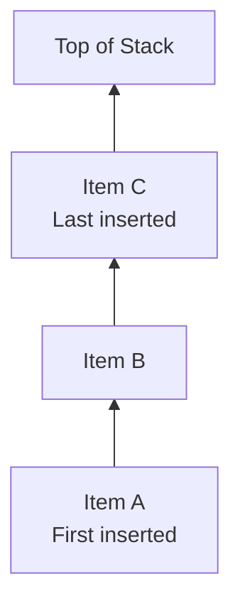
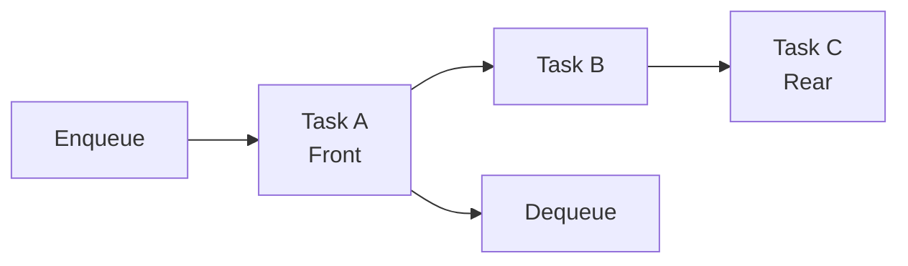
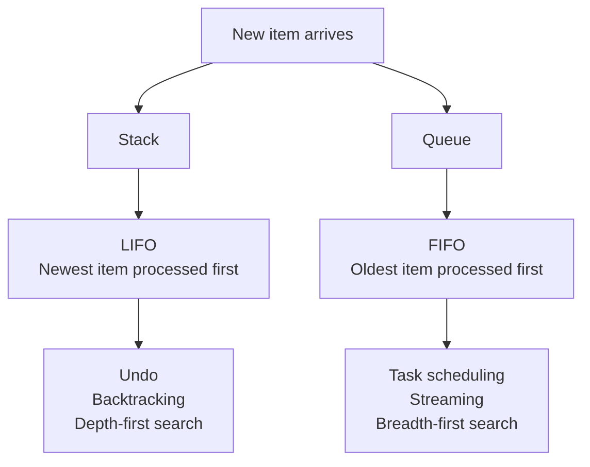
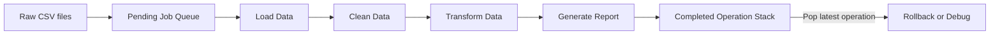
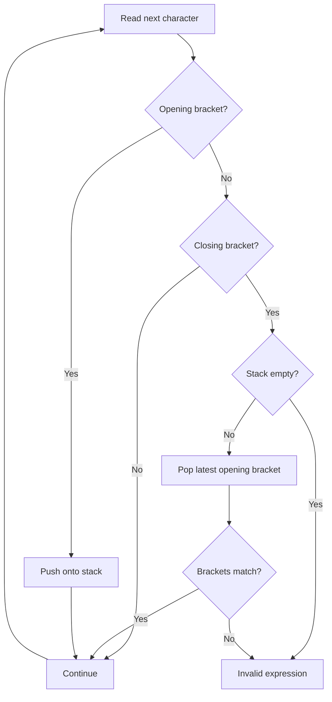
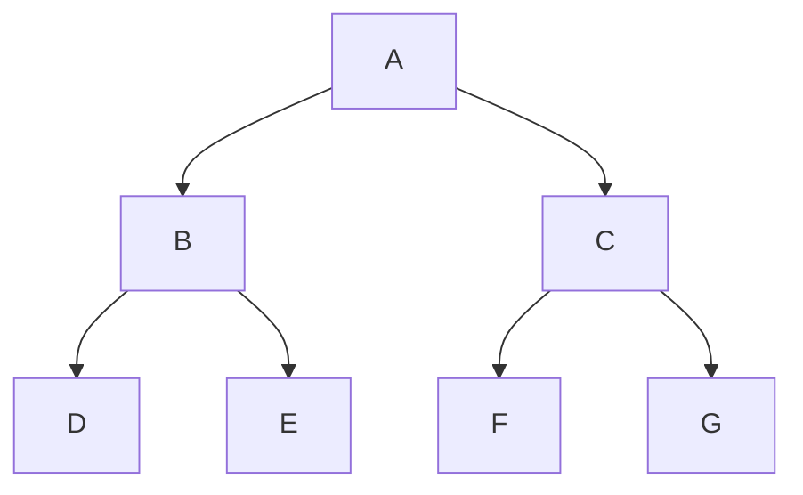
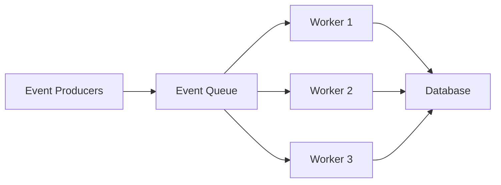
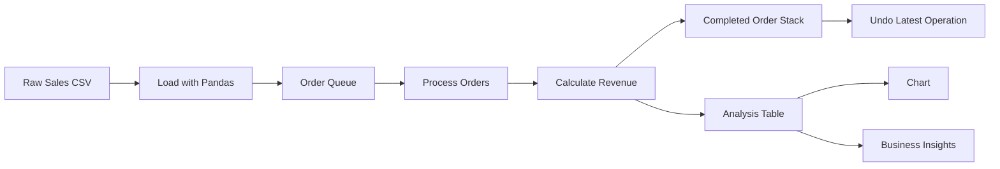
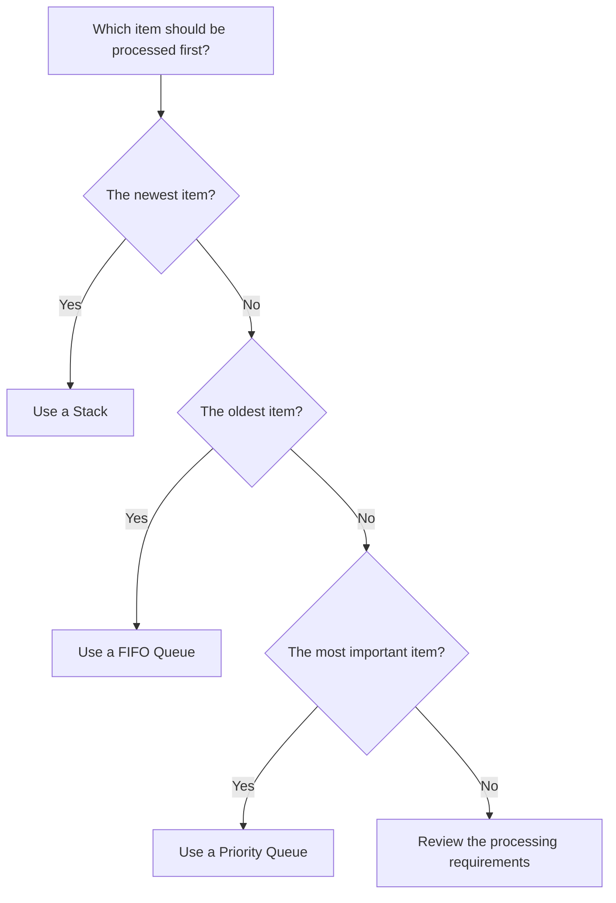

# 017 - Stack and Queue

**Course:** 02 - Coding and EDA
**Module:** Module 04 - Coding for Data Science
**Topic Group:** Data Structures and Algorithms
**Roadmap Source:** Coding for Data Science / Data Structures and Algorithms
**Lesson Type:** Coding
**Order in Module:** 017
**Suggested Duration:** 20 minutes

---

## 1. Overview

This lesson introduces **stacks** and **queues**, two fundamental data structures used to control the order in which data is stored and processed.

A **stack** follows the **Last In, First Out** principle, while a **queue** follows the **First In, First Out** principle.

These structures appear in many AI and Data Science workflows, including:

* Parsing nested data
* Traversing graphs and trees
* Managing data-processing jobs
* Building streaming pipelines
* Scheduling model-training tasks
* Implementing undo and rollback operations
* Processing requests in APIs and worker systems

Python lists can be used efficiently as stacks. For queues, the official Python documentation recommends `collections.deque` because removing elements from the beginning of a regular list requires shifting the remaining elements.

---

## 2. Learning Objectives

By the end of this lesson, you should be able to:

* Explain the difference between a stack and a queue.
* Describe the LIFO and FIFO processing principles.
* Implement a stack using a Python list.
* Implement a queue using `collections.deque`.
* Choose the correct data structure for a given problem.
* Recognize stack and queue applications in AI and Data Science.
* Analyze the time complexity of common stack and queue operations.
* Build a small reproducible data-processing example.

---

## 3. Core Concepts

### 3.1 Stack

A **stack** is a linear data structure that follows:

> **LIFO — Last In, First Out**

The most recently added element is the first element removed.

A stack is similar to a pile of plates:

* A new plate is placed on top.
* The top plate is removed first.
* Plates in the middle cannot be removed directly without moving the plates above them.

### Stack Diagram



Consider the following sequence:

```text
Push A
Push B
Push C
Pop
```

The item removed by `pop` is `C`.

```text
Top
 ↓
[C]  <- removed first
[B]
[A]
```

### Basic Stack Operations

| Operation | Description                           | Python operation     |
| --------- | ------------------------------------- | -------------------- |
| Push      | Add an item to the top                | `stack.append(item)` |
| Pop       | Remove and return the top item        | `stack.pop()`        |
| Peek      | Read the top item without removing it | `stack[-1]`          |
| Is empty  | Check whether the stack is empty      | `len(stack) == 0`    |
| Size      | Return the number of items            | `len(stack)`         |

### Implementing a Stack with a Python List

```python
stack: list[str] = []

# Push items onto the stack
stack.append("load_data")
stack.append("clean_data")
stack.append("normalize_data")

print(stack)
```

Output:

```text
['load_data', 'clean_data', 'normalize_data']
```

Remove the most recent operation:

```python
latest_operation = stack.pop()

print(f"Removed operation: {latest_operation}")
print(f"Remaining stack: {stack}")
```

Output:

```text
Removed operation: normalize_data
Remaining stack: ['load_data', 'clean_data']
```

Python lists support efficient stack operations with `append()` and `pop()` at the end of the list.

### Safe Stack Operations

Calling `pop()` on an empty stack raises an `IndexError`.

```python
stack: list[str] = []

if stack:
    item = stack.pop()
    print(item)
else:
    print("The stack is empty.")
```

### Stack Use Cases

Stacks are commonly used for:

* Undo and redo systems
* Function call management
* Expression evaluation
* Parentheses validation
* Depth-first search
* Backtracking algorithms
* Parsing nested JSON or XML
* Tracking transformation history
* Managing notebook operation history

---

### 3.2 Queue

A **queue** is a linear data structure that follows:

> **FIFO — First In, First Out**

The first element added is the first element removed.

A queue is similar to a line of customers:

* New customers join at the back.
* The customer at the front is served first.

### Queue Diagram



Consider the following sequence:

```text
Enqueue A
Enqueue B
Enqueue C
Dequeue
```

The item removed by `dequeue` is `A`.

```text
Front                     Rear
  ↓                         ↓
[A] -> [B] -> [C]
 |
 +---- removed first
```

### Basic Queue Operations

| Operation | Description                      | `deque` operation    |
| --------- | -------------------------------- | -------------------- |
| Enqueue   | Add an item to the rear          | `queue.append(item)` |
| Dequeue   | Remove the item at the front     | `queue.popleft()`    |
| Peek      | Read the front item              | `queue[0]`           |
| Is empty  | Check whether the queue is empty | `len(queue) == 0`    |
| Size      | Return the number of items       | `len(queue)`         |

### Implementing a Queue with `collections.deque`

```python
from collections import deque

task_queue: deque[str] = deque()

# Add tasks to the rear of the queue
task_queue.append("load_sales.csv")
task_queue.append("clean_missing_values")
task_queue.append("generate_report")

print(task_queue)
```

Output:

```text
deque(['load_sales.csv', 'clean_missing_values', 'generate_report'])
```

Process the first task:

```python
current_task = task_queue.popleft()

print(f"Processing: {current_task}")
print(f"Remaining tasks: {task_queue}")
```

Output:

```text
Processing: load_sales.csv
Remaining tasks: deque(['clean_missing_values', 'generate_report'])
```

A `deque`, pronounced “deck,” is a double-ended queue. It supports appending and removing elements from either end with approximately constant-time performance.

### Safe Queue Operations

Calling `popleft()` on an empty deque raises an `IndexError`.

```python
from collections import deque

task_queue: deque[str] = deque()

if task_queue:
    task = task_queue.popleft()
    print(task)
else:
    print("No tasks are waiting.")
```

### Queue Use Cases

Queues are commonly used for:

* Breadth-first search
* Data ingestion pipelines
* Message processing
* API request handling
* Batch-processing systems
* Producer-consumer workflows
* Model-training job scheduling
* Streaming event processing
* Background workers
* Notification systems

---

### 3.3 Stack versus Queue



| Feature                  | Stack              | Queue                    |
| ------------------------ | ------------------ | ------------------------ |
| Processing order         | Last In, First Out | First In, First Out      |
| Abbreviation             | LIFO               | FIFO                     |
| Addition position        | Top                | Rear                     |
| Removal position         | Top                | Front                    |
| Main insertion operation | Push               | Enqueue                  |
| Main removal operation   | Pop                | Dequeue                  |
| Common Python structure  | `list`             | `collections.deque`      |
| Typical algorithm        | Depth-first search | Breadth-first search     |
| Example                  | Undo history       | Task-processing pipeline |

---

### 3.4 Time Complexity

The following table describes the expected performance of common Python implementations.

| Data structure     | Operation                  |  Expected complexity |
| ------------------ | -------------------------- | -------------------: |
| List-based stack   | `append()`                 |     `O(1)` amortized |
| List-based stack   | `pop()`                    |               `O(1)` |
| List used as queue | `pop(0)`                   |               `O(n)` |
| `deque` queue      | `append()`                 | Approximately `O(1)` |
| `deque` queue      | `popleft()`                | Approximately `O(1)` |
| Stack or queue     | Access by arbitrary search |               `O(n)` |

Using `list.pop(0)` is inefficient for large queues because all remaining elements must be shifted. Python's documentation recommends `collections.deque` for fast additions and removals from both ends.

---

### 3.5 Common Queue Variants

#### FIFO Queue

The oldest item is processed first.

```text
A -> B -> C

Processing order: A, B, C
```

#### LIFO Queue

The newest item is processed first. It behaves like a stack.

```text
A -> B -> C

Processing order: C, B, A
```

#### Priority Queue

Items are processed according to priority rather than arrival time.

```text
Task A: priority 3
Task B: priority 1
Task C: priority 2

Processing order: Task B, Task C, Task A
```

Python provides `heapq` for heap-based priority queue algorithms. In a min-heap, the smallest item is stored at the root and is returned first.

Example:

```python
import heapq

tasks: list[tuple[int, str]] = []

heapq.heappush(tasks, (3, "Generate dashboard"))
heapq.heappush(tasks, (1, "Fix failed data pipeline"))
heapq.heappush(tasks, (2, "Train baseline model"))

while tasks:
    priority, task = heapq.heappop(tasks)
    print(priority, task)
```

Output:

```text
1 Fix failed data pipeline
2 Train baseline model
3 Generate dashboard
```

#### Double-Ended Queue

A double-ended queue allows insertion and removal from both ends.

```python
from collections import deque

events = deque(["event_1", "event_2"])

events.append("event_3")
events.appendleft("urgent_event")

print(events)
```

Output:

```text
deque(['urgent_event', 'event_1', 'event_2', 'event_3'])
```

#### Thread-Safe Queue

Python's `queue` module provides synchronized queue classes for safely exchanging tasks between multiple threads.

The module includes:

* `queue.Queue` for FIFO processing
* `queue.LifoQueue` for LIFO processing
* `queue.PriorityQueue` for priority-based processing
* `queue.SimpleQueue` for a simpler unbounded FIFO queue

The module is designed for multi-producer and multi-consumer threaded programs and includes the required locking behavior.

```python
from queue import Queue

job_queue: Queue[str] = Queue(maxsize=100)

job_queue.put("process_file_001.csv")
job_queue.put("process_file_002.csv")

job = job_queue.get()

try:
    print(f"Processing {job}")
finally:
    job_queue.task_done()
```

---

## 4. Examples and Demonstration

### 4.1 Stack Example: Undoing Data Transformations

Suppose a Data Scientist applies several transformations to a dataset. A stack can record the transformations so that the latest operation can be undone first.

```python
transformation_stack: list[str] = []

transformation_stack.append("remove_duplicates")
transformation_stack.append("fill_missing_values")
transformation_stack.append("standardize_numeric_columns")

print("Transformation history:")
print(transformation_stack)

last_transformation = transformation_stack.pop()

print(f"\nUndo: {last_transformation}")
print(f"Remaining history: {transformation_stack}")
```

Output:

```text
Transformation history:
['remove_duplicates', 'fill_missing_values', 'standardize_numeric_columns']

Undo: standardize_numeric_columns
Remaining history: ['remove_duplicates', 'fill_missing_values']
```

The latest transformation is undone first because the stack follows LIFO ordering.

---

### 4.2 Queue Example: Processing Data Files

Suppose a directory contains several CSV files waiting to be processed. A queue ensures that the files are handled in their arrival order.

```python
from collections import deque

file_queue = deque(
    [
        "sales_january.csv",
        "sales_february.csv",
        "sales_march.csv",
    ]
)

while file_queue:
    current_file = file_queue.popleft()
    print(f"Processing {current_file}")
```

Output:

```text
Processing sales_january.csv
Processing sales_february.csv
Processing sales_march.csv
```

This is FIFO processing:

```text
sales_january.csv
        ↓
sales_february.csv
        ↓
sales_march.csv
```

---

### 4.3 Data Pipeline Example

A queue can represent pending data jobs, while a stack can record completed jobs for rollback or debugging.



Python example:

```python
from collections import deque

pending_jobs = deque(
    [
        "load_raw_data",
        "remove_duplicates",
        "fill_missing_values",
        "calculate_revenue",
        "generate_report",
    ]
)

completed_jobs: list[str] = []

while pending_jobs:
    job = pending_jobs.popleft()

    print(f"Running: {job}")

    # Simulate successful execution
    completed_jobs.append(job)

print("\nCompleted jobs:")
print(completed_jobs)
```

Output:

```text
Running: load_raw_data
Running: remove_duplicates
Running: fill_missing_values
Running: calculate_revenue
Running: generate_report

Completed jobs:
['load_raw_data', 'remove_duplicates', 'fill_missing_values', 'calculate_revenue', 'generate_report']
```

Undo the most recent completed operation:

```python
if completed_jobs:
    rolled_back_job = completed_jobs.pop()
    print(f"Rolling back: {rolled_back_job}")
```

Output:

```text
Rolling back: generate_report
```

---

### 4.4 Parentheses Validation with a Stack

Stacks can be used to verify whether brackets in an expression are balanced.

```python
def has_balanced_brackets(expression: str) -> bool:
    opening_brackets = {"(", "[", "{"}
    matching_brackets = {
        ")": "(",
        "]": "[",
        "}": "{",
    }

    stack: list[str] = []

    for character in expression:
        if character in opening_brackets:
            stack.append(character)

        elif character in matching_brackets:
            if not stack:
                return False

            latest_opening = stack.pop()

            if latest_opening != matching_brackets[character]:
                return False

    return len(stack) == 0


expressions = [
    "(revenue + cost)",
    "([a + b] * c)",
    "([a + b)",
]

for expression in expressions:
    print(expression, has_balanced_brackets(expression))
```

Output:

```text
(revenue + cost) True
([a + b] * c) True
([a + b) False
```

Processing flow:



---

## 5. Applications in AI and Data Science

### 5.1 Data Processing Pipelines

A queue can store datasets or tasks waiting to be processed.

```text
Raw files
   ↓
Processing queue
   ↓
Cleaning workers
   ↓
Feature engineering
   ↓
Analysis table
```

Examples include:

* CSV files waiting for ingestion
* Images waiting for preprocessing
* Documents waiting for OCR
* Text chunks waiting for embedding
* Model requests waiting for inference

---

### 5.2 Machine Learning Job Scheduling

Training experiments can be placed in a queue.

```python
from collections import deque

experiment_queue = deque(
    [
        {"model": "logistic_regression", "learning_rate": 0.01},
        {"model": "random_forest", "n_estimators": 100},
        {"model": "xgboost", "max_depth": 6},
    ]
)

while experiment_queue:
    experiment = experiment_queue.popleft()
    print(f"Running experiment: {experiment}")
```

This design ensures experiments are processed in a predictable order.

---

### 5.3 Graph and Tree Traversal

Stacks and queues produce different traversal strategies.

| Algorithm            | Data structure | Behavior                                  |
| -------------------- | -------------- | ----------------------------------------- |
| Depth-first search   | Stack          | Explores one path deeply before returning |
| Breadth-first search | Queue          | Explores nodes level by level             |



Possible traversal orders:

```text
Depth-first search:
A -> B -> D -> E -> C -> F -> G

Breadth-first search:
A -> B -> C -> D -> E -> F -> G
```

These algorithms are useful for:

* Knowledge graphs
* Recommendation systems
* Dependency graphs
* Search systems
* Decision trees
* Social network analysis
* Graph-based Retrieval-Augmented Generation

---

### 5.4 Streaming Systems

A queue can buffer events between producers and consumers.



Examples include:

* Kafka messages
* API requests
* Sensor events
* User activity logs
* Model inference requests
* Document-processing jobs

A queue separates the rate at which data is produced from the rate at which it can be processed.

---

### 5.5 Sliding Windows

A bounded `deque` can retain only the most recent observations.

```python
from collections import deque

recent_predictions: deque[float] = deque(maxlen=5)

for prediction in [0.72, 0.81, 0.76, 0.90, 0.84, 0.88]:
    recent_predictions.append(prediction)
    print(list(recent_predictions))
```

Output:

```text
[0.72]
[0.72, 0.81]
[0.72, 0.81, 0.76]
[0.72, 0.81, 0.76, 0.9]
[0.72, 0.81, 0.76, 0.9, 0.84]
[0.81, 0.76, 0.9, 0.84, 0.88]
```

When a bounded deque becomes full, adding a new item automatically removes an item from the opposite end. This is useful for tracking recent activity and fixed-size windows.

Possible applications include:

* Rolling averages
* Recent model predictions
* Real-time anomaly detection
* Monitoring recent API latency
* Tracking the latest sensor readings
* Maintaining conversation context

---

## 6. Practical Exercise

### Exercise: Build a Small Sales Processing System

Create a notebook that uses both a queue and a stack.

### Dataset

Create a file named `sales.csv`:

```csv
order_id,product,quantity,price
1001,Keyboard,2,25.0
1002,Mouse,3,15.0
1003,Monitor,1,200.0
1004,Keyboard,1,25.0
1005,Mouse,2,15.0
```

### Requirements

1. Load the CSV file with Pandas.
2. Place each row into a processing queue.
3. Process each order in FIFO order.
4. Calculate revenue for each order.
5. Store completed order IDs in a stack.
6. Pop the latest completed order to simulate an undo operation.
7. Produce at least three insights.
8. Save the cleaned dataset as `sales_processed.csv`.

### Starter Code

```python
from collections import deque

import pandas as pd


def calculate_revenue(quantity: int, price: float) -> float:
    return quantity * price


sales = pd.read_csv("sales.csv")

order_queue = deque(sales.to_dict(orient="records"))
completed_order_stack: list[dict] = []
processed_orders: list[dict] = []

while order_queue:
    order = order_queue.popleft()

    order["revenue"] = calculate_revenue(
        quantity=int(order["quantity"]),
        price=float(order["price"]),
    )

    processed_orders.append(order)
    completed_order_stack.append(order)

processed_df = pd.DataFrame(processed_orders)

print(processed_df)
```

Simulate an undo operation:

```python
if completed_order_stack:
    latest_order = completed_order_stack.pop()

    print("Undo latest completed order:")
    print(latest_order)
```

Create a summary:

```python
product_summary = (
    processed_df.groupby("product", as_index=False)
    .agg(
        total_quantity=("quantity", "sum"),
        total_revenue=("revenue", "sum"),
    )
    .sort_values("total_revenue", ascending=False)
)

print(product_summary)
```

Save the result:

```python
processed_df.to_csv(
    "sales_processed.csv",
    index=False,
)
```

### Expected Insights

Possible insights include:

* Which product generated the highest revenue?
* Which product had the highest sales quantity?
* What was the average order value?
* Which order was processed first?
* Which order would be undone first?
* How many orders remained in the queue after each step?

---

## 7. Common Mistakes

### 7.1 Using `pop(0)` for a Large Queue

Avoid:

```python
queue = ["task_1", "task_2", "task_3"]

first_task = queue.pop(0)
```

Removing the first list element requires the remaining elements to be moved.

Prefer:

```python
from collections import deque

queue = deque(["task_1", "task_2", "task_3"])

first_task = queue.popleft()
```

---

### 7.2 Removing Items from an Empty Structure

Incorrect:

```python
stack = []
item = stack.pop()
```

Safer:

```python
stack = []

if stack:
    item = stack.pop()
else:
    print("The stack is empty.")
```

---

### 7.3 Confusing LIFO and FIFO

Remember:

```text
Stack -> LIFO -> newest item first
Queue -> FIFO -> oldest item first
```

A useful memory aid is:

```text
Stack of plates -> take the top plate first
Waiting line    -> serve the first person first
```

---

### 7.4 Using a Normal Queue for Priority Tasks

A FIFO queue does not automatically move urgent tasks to the front.

Use:

* `heapq`
* `queue.PriorityQueue`

when tasks must be processed by priority.

---

### 7.5 Using `deque` as a Complete Threading Solution

Although individual deque append and pop operations are thread-safe in CPython, complex producer-consumer workflows usually require task coordination, blocking operations and completion tracking.

For threaded worker systems, prefer the classes in Python's `queue` module.

---

### 7.6 Forgetting `task_done()`

When using `queue.Queue`, every successfully retrieved task should eventually receive a corresponding `task_done()` call.

```python
from queue import Queue

jobs: Queue[str] = Queue()
jobs.put("train_model")

job = jobs.get()

try:
    print(f"Processing {job}")
finally:
    jobs.task_done()
```

Calling `join()` blocks until every queued task has been retrieved and marked as complete.

---

### 7.7 Ignoring Memory Limits

An unbounded queue may continue growing if producers create data faster than consumers process it.

Possible solutions include:

* Use a bounded queue.
* Configure `maxsize`.
* Apply backpressure.
* Reject or delay new tasks.
* Scale the number of workers.
* Monitor queue length and processing latency.

---

## 8. Completion Checklist

* [ ] I can explain LIFO and FIFO in my own words.
* [ ] I can describe the difference between a stack and a queue.
* [ ] I can implement a stack using a Python list.
* [ ] I can implement a queue using `collections.deque`.
* [ ] I understand why `list.pop(0)` is inefficient for large queues.
* [ ] I can safely handle an empty stack or queue.
* [ ] I understand the difference between FIFO, LIFO and priority queues.
* [ ] I can identify a stack or queue inside a data workflow.
* [ ] I completed a notebook or Python script using both structures.
* [ ] I recorded at least one caveat, assumption or follow-up question.
* [ ] I can explain when to use `queue.Queue` instead of `deque`.
* [ ] I saved my example and instructions in a reproducible format.

---

## 9. Related Outcome and Project

### Related Outcome

Use Python, SQL, data libraries, notebooks and Git to build reproducible data workflows.

### Related Project

**Mini Project: SQL and Python Sales Analysis**

Build a small sales-processing system that includes:

1. A CSV or SQL sales dataset
2. A queue of pending data-processing tasks
3. A stack containing completed transformation steps
4. Pandas data cleaning
5. Revenue calculations
6. A product-level summary table
7. At least one chart
8. Three written business insights
9. Exported analysis results
10. A README explaining how to run the project

### Suggested Project Structure

```text
sales-stack-queue-project/
├── data/
│   ├── raw/
│   │   └── sales.csv
│   └── processed/
│       └── sales_processed.csv
├── notebooks/
│   └── stack_queue_analysis.ipynb
├── src/
│   ├── queue_processor.py
│   └── transformation_history.py
├── reports/
│   ├── product_summary.csv
│   └── revenue_chart.png
├── tests/
│   └── test_queue_processor.py
├── README.md
└── requirements.txt
```

### Suggested Workflow



---

## 10. Summary

A **stack** and a **queue** both store ordered collections of elements, but they process those elements differently.

### Stack

```text
Last In, First Out
```

Use a stack when the newest item should be processed first.

Typical applications:

* Undo operations
* Backtracking
* Depth-first search
* Expression parsing
* Transformation history

Python implementation:

```python
stack: list[str] = []

stack.append("task")
latest_task = stack.pop()
```

### Queue

```text
First In, First Out
```

Use a queue when the oldest item should be processed first.

Typical applications:

* Data pipelines
* Task scheduling
* Breadth-first search
* Streaming systems
* Background workers

Python implementation:

```python
from collections import deque

queue = deque()

queue.append("task")
oldest_task = queue.popleft()
```

### Final Decision Guide



The most important idea is not simply memorizing the definitions. You should be able to recognize whether a real data workflow requires:

* LIFO processing
* FIFO processing
* Priority-based processing
* A bounded recent-history window
* A thread-safe producer-consumer queue

Turn this lesson into a notebook, script, data pipeline, API worker or portfolio project so that the concept becomes practical and reusable.

---

## References

* Python documentation: lists as stacks and queues.
* Python documentation: `collections.deque`.
* Python documentation: synchronized queue classes.
* Python documentation: heap and priority queue algorithms.

---

# Bài luyện tập

## Mục tiêu


## Đề bài


## Yêu cầu hoàn thành

- [ ] 
- [ ] 
- [ ] 

## Kết quả / lời giải


## Ghi chú
