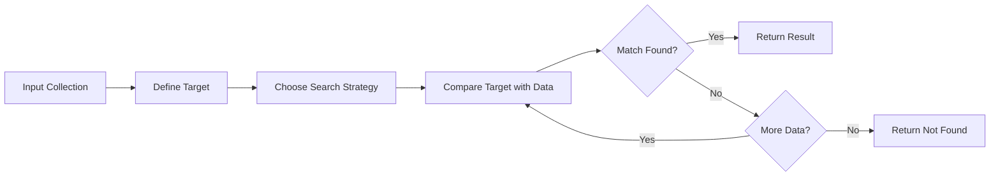
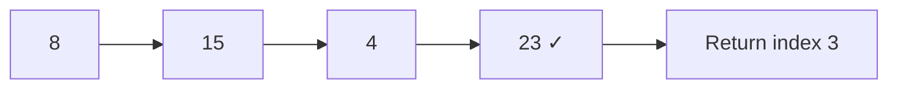
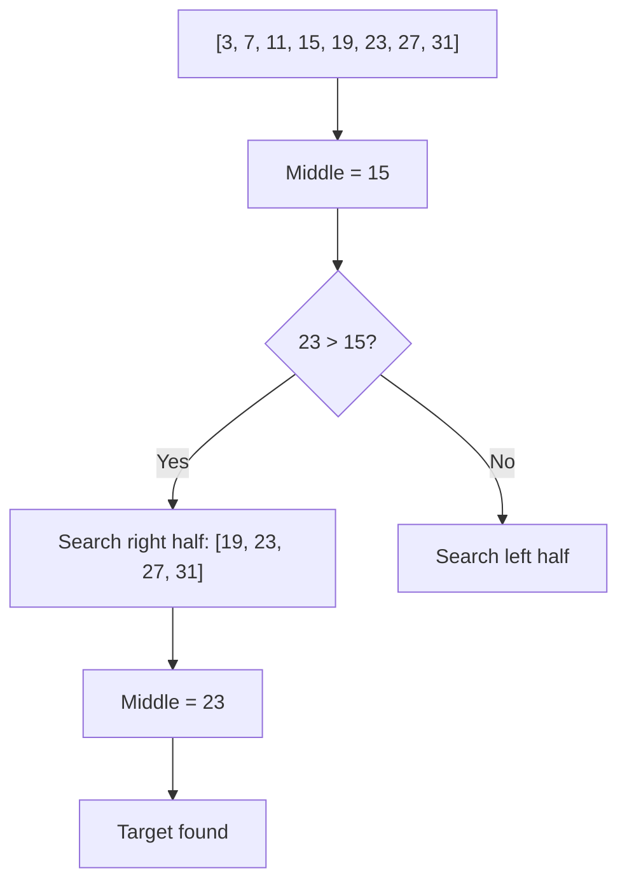
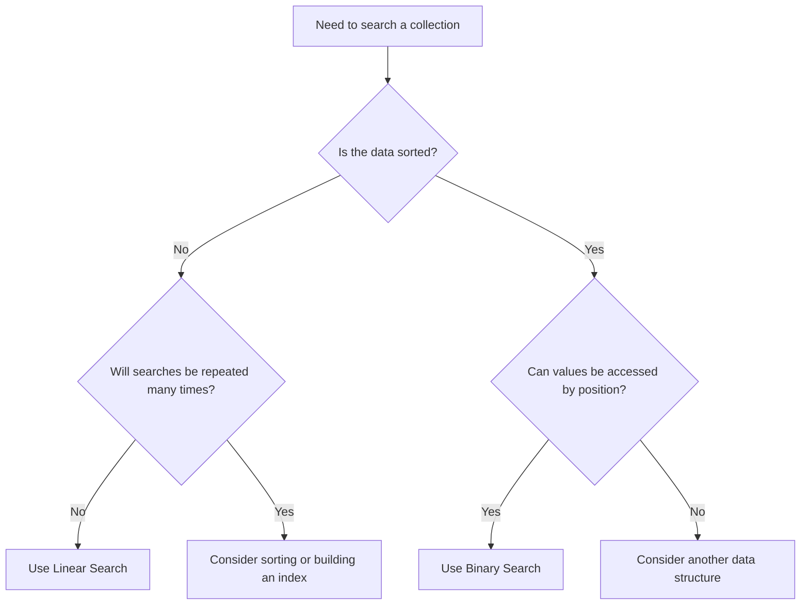
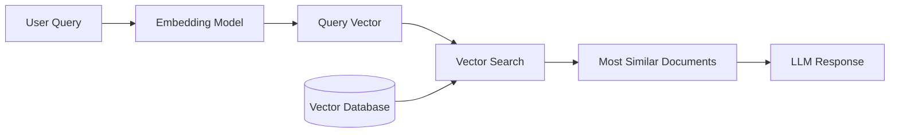
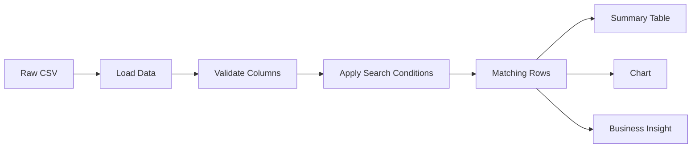

# 019 — Searching

**Course:** 02 — Coding and EDA
**Module:** Module 04 — Coding for Data Science
**Content Group:** Data Structures and Algorithms
**Roadmap Source:** Coding for Data Science / Data Structures and Algorithms
**Lesson Type:** Coding
**Order in Module:** 019
**Suggested Duration:** 20 minutes

---

## 1. Overview

This lesson introduces **searching algorithms** in the context of AI and data science.

Searching means finding a target value, record, pattern, or condition inside a collection of data. The collection may be:

* A Python list
* A NumPy array
* A Pandas DataFrame
* A database table
* A sorted sequence
* A graph or tree
* A vector database
* A document collection

Searching is used throughout the data workflow, from locating records during data cleaning to retrieving relevant documents in a Retrieval-Augmented Generation system.

By the end of this lesson, you should understand:

* How common searching algorithms work
* When to use linear search or binary search
* Why data ordering affects search performance
* How searching appears in real data science systems
* How to implement reusable search functions in Python

---

## 2. Learning Objectives

After completing this lesson, you should be able to:

* Explain searching in your own words.
* Implement linear search in Python.
* Implement binary search for sorted data.
* Compare the time complexity of different search methods.
* Choose an appropriate search strategy for a dataset.
* Apply searching to a small data analysis problem.
* Connect searching algorithms to databases, machine learning, and information retrieval.

---

## 3. What Is Searching?

A **searching algorithm** is a procedure used to locate a target element or determine whether that element exists in a collection.

A search algorithm usually receives:

1. A collection of values
2. A target value or condition
3. A rule for comparing the target with the collection

It returns one of the following:

* The position of the target
* The matching value
* One or more matching records
* `True` or `False`
* A special value such as `-1` when no match is found

### General Search Process



---

## 4. Why Searching Matters in Data Science

Searching is not limited to finding a number in a list. It appears in almost every stage of a data science workflow.

### Data Cleaning

Search for:

* Missing values
* Invalid categories
* Duplicate identifiers
* Outliers
* Incorrect formats

```python
invalid_rows = df[df["age"] < 0]
```

### Exploratory Data Analysis

Search for:

* Highest-revenue customers
* Products with unusual sales
* Specific time periods
* Records satisfying multiple conditions

```python
high_value_orders = df[df["sales"] > 10_000]
```

### Machine Learning

Search is used in:

* Nearest-neighbor algorithms
* Hyperparameter optimization
* Decision tree traversal
* Feature selection
* Model checkpoint lookup

### Information Retrieval

Search engines and Retrieval-Augmented Generation systems search for:

* Relevant documents
* Similar text chunks
* Matching keywords
* Semantically related embeddings

### Databases

A database searches for rows using:

* Sequential scans
* Hash indexes
* B-tree indexes
* Full-text indexes
* Vector indexes

```sql
SELECT *
FROM customers
WHERE customer_id = 1024;
```

---

## 5. Main Searching Algorithms

The two fundamental searching algorithms are:

1. **Linear Search**
2. **Binary Search**

Their usefulness depends on whether the data is sorted.

| Algorithm     | Data Requirement |   Average Time |   Worst-Case Time |                         Extra Space |
| ------------- | ---------------- | -------------: | ----------------: | ----------------------------------: |
| Linear Search | None             |         (O(n)) |            (O(n)) |                              (O(1)) |
| Binary Search | Sorted data      |    (O(\log n)) |       (O(\log n)) | (O(1)) for iterative implementation |
| Hash Lookup   | Hash table       | (O(1)) average | (O(n)) worst case |                              (O(n)) |

---

## 6. Linear Search

### Definition

**Linear search** examines elements one by one until it finds the target or reaches the end of the collection.

It works with both sorted and unsorted data.

### Process

Suppose we want to find `23` in this list:

```text
[8, 15, 4, 23, 42]
```

The algorithm checks:

```text
8  → not equal to 23
15 → not equal to 23
4  → not equal to 23
23 → target found
```

### Diagram



### Python Implementation

```python
from typing import Sequence, TypeVar

T = TypeVar("T")


def linear_search(values: Sequence[T], target: T) -> int:
    """
    Return the index of the first occurrence of target.

    Returns:
        The index of target, or -1 if target is not found.
    """
    for index, value in enumerate(values):
        if value == target:
            return index

    return -1


numbers = [8, 15, 4, 23, 42]
result = linear_search(numbers, 23)

print(result)
```

Output:

```text
3
```

### Searching for Multiple Matches

A dataset may contain the same value more than once.

```python
def find_all_indices(values: Sequence[T], target: T) -> list[int]:
    """Return all indices at which target appears."""
    return [
        index
        for index, value in enumerate(values)
        if value == target
    ]


labels = ["cat", "dog", "cat", "bird", "cat"]

print(find_all_indices(labels, "cat"))
```

Output:

```text
[0, 2, 4]
```

### Complexity

For a list containing (n) elements:

* Best case: (O(1))
* Average case: (O(n))
* Worst case: (O(n))

The worst case occurs when:

* The target is the final element.
* The target does not exist.

---

## 7. Binary Search

### Definition

**Binary search** repeatedly divides a sorted collection into two halves.

Instead of checking every element, it compares the target with the middle value and eliminates half of the remaining search space.

### Requirement

Binary search only works correctly when the data is sorted.

```text
Incorrect input: [20, 5, 13, 8, 2]

Correct input:   [2, 5, 8, 13, 20]
```

### Example

Find `23` in:

```text
[3, 7, 11, 15, 19, 23, 27, 31]
```

Process:

1. Check the middle value: `15`
2. `23 > 15`, so discard the left half.
3. Check the middle of the remaining values: `23`
4. Target found.



### Iterative Python Implementation

```python
from typing import Sequence


def binary_search(values: Sequence[int], target: int) -> int:
    """
    Search for target in a sorted sequence.

    Returns:
        The index of target, or -1 if target is not found.
    """
    left = 0
    right = len(values) - 1

    while left <= right:
        middle = (left + right) // 2
        middle_value = values[middle]

        if middle_value == target:
            return middle

        if middle_value < target:
            left = middle + 1
        else:
            right = middle - 1

    return -1


numbers = [3, 7, 11, 15, 19, 23, 27, 31]

print(binary_search(numbers, 23))
```

Output:

```text
5
```

### Recursive Implementation

```python
def recursive_binary_search(
    values: Sequence[int],
    target: int,
    left: int,
    right: int,
) -> int:
    """Recursively search for target in a sorted sequence."""
    if left > right:
        return -1

    middle = (left + right) // 2

    if values[middle] == target:
        return middle

    if values[middle] < target:
        return recursive_binary_search(
            values,
            target,
            middle + 1,
            right,
        )

    return recursive_binary_search(
        values,
        target,
        left,
        middle - 1,
    )


numbers = [3, 7, 11, 15, 19, 23, 27, 31]

result = recursive_binary_search(
    values=numbers,
    target=19,
    left=0,
    right=len(numbers) - 1,
)

print(result)
```

Output:

```text
4
```

### Complexity

At each step, binary search removes approximately half of the remaining values.

For (n) elements:

$$
T(n) = O(\log_2 n)
$$

Approximate maximum comparisons:

| Number of Elements | Linear Search | Binary Search |
| -----------------: | ------------: | ------------: |
|                 10 |            10 |             4 |
|                100 |           100 |             7 |
|              1,000 |         1,000 |            10 |
|          1,000,000 |     1,000,000 |            20 |

Binary search becomes especially valuable for large sorted datasets.

---

## 8. Linear Search vs. Binary Search

| Criterion                      | Linear Search | Binary Search       |
| ------------------------------ | ------------- | ------------------- |
| Requires sorted data           | No            | Yes                 |
| Implementation difficulty      | Simple        | Moderate            |
| Works with linked data         | Yes           | Usually inefficient |
| Search speed                   | (O(n))        | (O(\log n))         |
| Suitable for small datasets    | Yes           | Yes                 |
| Suitable for repeated searches | Sometimes     | Yes                 |
| Sorting cost required          | No            | Possibly            |

### Decision Guide



---

## 9. Python Built-in Search Operations

In real projects, you will often use Python's built-in operations instead of implementing search algorithms manually.

### Membership Search

```python
customer_ids = [101, 105, 110, 115]

if 110 in customer_ids:
    print("Customer found")
```

### Finding the First Index

```python
categories = ["food", "books", "clothing", "electronics"]

index = categories.index("clothing")

print(index)
```

Be careful: `list.index()` raises a `ValueError` when the value is missing.

```python
try:
    index = categories.index("sports")
except ValueError:
    index = -1
```

### Searching with a Condition

```python
sales = [120, 450, 90, 730, 260]

first_large_sale = next(
    (value for value in sales if value > 500),
    None,
)

print(first_large_sale)
```

Output:

```text
730
```

---

## 10. Searching with Sets and Dictionaries

Linear search is not always the best solution.

For frequent exact-match searches, a `set` or `dict` is often more efficient.

### Set Membership

```python
valid_categories = {
    "electronics",
    "books",
    "clothing",
    "food",
}

category = "books"

if category in valid_categories:
    print("Valid category")
```

Average membership lookup in a set is:

$$
O(1)
$$

### Dictionary Lookup

```python
customer_lookup = {
    101: "An",
    102: "Binh",
    103: "Chi",
}

customer_name = customer_lookup.get(102)

print(customer_name)
```

Output:

```text
Binh
```

### Choosing a Structure

| Requirement                    | Recommended Structure          |
| ------------------------------ | ------------------------------ |
| Preserve order and scan values | List                           |
| Fast exact membership checks   | Set                            |
| Map keys to values             | Dictionary                     |
| Search sorted numerical data   | Sorted list with binary search |
| Search rows by indexed field   | Database index                 |
| Search similar vectors         | Vector index                   |

---

## 11. Searching in Pandas

Pandas provides vectorized methods for searching and filtering tabular data.

### Example Dataset

```python
import pandas as pd

sales_data = pd.DataFrame(
    {
        "order_id": [1001, 1002, 1003, 1004, 1005],
        "product": [
            "Laptop",
            "Mouse",
            "Keyboard",
            "Monitor",
            "Laptop",
        ],
        "region": [
            "North",
            "South",
            "North",
            "West",
            "South",
        ],
        "sales": [1200, 40, 80, 350, 1350],
    }
)

print(sales_data)
```

### Exact-Match Search

```python
laptop_orders = sales_data[
    sales_data["product"] == "Laptop"
]

print(laptop_orders)
```

### Search with Multiple Conditions

```python
selected_orders = sales_data[
    (sales_data["product"] == "Laptop")
    & (sales_data["sales"] > 1_000)
]

print(selected_orders)
```

### Membership Search

```python
selected_regions = ["North", "West"]

regional_orders = sales_data[
    sales_data["region"].isin(selected_regions)
]

print(regional_orders)
```

### Text Search

```python
matching_products = sales_data[
    sales_data["product"].str.contains(
        "key",
        case=False,
        na=False,
    )
]

print(matching_products)
```

### Search for Missing Values

```python
missing_rows = sales_data[
    sales_data.isna().any(axis=1)
]
```

---

## 12. Searching in NumPy

NumPy supports fast vectorized search operations.

```python
import numpy as np

values = np.array([12, 25, 8, 31, 25, 42])

indices = np.where(values == 25)

print(indices[0])
```

Output:

```text
[1 4]
```

### Search Using a Condition

```python
large_value_indices = np.where(values > 30)

print(large_value_indices[0])
```

Output:

```text
[3 5]
```

### Searching Sorted Arrays

NumPy provides `searchsorted()` to find the position where a value should be inserted while preserving sorted order.

```python
sorted_values = np.array([10, 20, 30, 40, 50])

position = np.searchsorted(sorted_values, 35)

print(position)
```

Output:

```text
3
```

The value `35` should be inserted at index `3`.

---

## 13. Searching in SQL

SQL searches rows using the `WHERE` clause.

### Exact Search

```sql
SELECT *
FROM sales
WHERE order_id = 1004;
```

### Range Search

```sql
SELECT *
FROM sales
WHERE sales_amount BETWEEN 500 AND 2000;
```

### Multiple Conditions

```sql
SELECT *
FROM sales
WHERE region = 'North'
  AND sales_amount > 1000;
```

### Text Search

```sql
SELECT *
FROM products
WHERE product_name LIKE '%laptop%';
```

### Searching with an Index

Without an index, a database may examine many rows.

```sql
CREATE INDEX idx_sales_order_id
ON sales(order_id);
```

An index allows the database to locate matching rows more efficiently.

Conceptually:

```text
Without index:
Row 1 -> Row 2 -> Row 3 -> ... -> Matching row

With index:
Index lookup -> Matching row location -> Matching row
```

---

## 14. Search in AI Systems

### k-Nearest Neighbors

The k-Nearest Neighbors algorithm searches for the (k) closest data points to a query point.

```text
New sample
    |
    v
Calculate distance to stored samples
    |
    v
Find the nearest samples
    |
    v
Predict class or value
```

### Vector Search

Modern AI applications convert text, images, or audio into vectors called **embeddings**.

The system searches for vectors that are most similar to a query vector.

Common similarity measures include:

* Cosine similarity
* Euclidean distance
* Dot product



### Retrieval-Augmented Generation

A typical RAG pipeline uses search before generating an answer.

```text
User question
    ↓
Create query embedding
    ↓
Search vector database
    ↓
Retrieve relevant chunks
    ↓
Add chunks to the prompt
    ↓
Generate a grounded response
```

---

## 15. Practical Demo: Searching Sales Data

The following example combines CSV loading, filtering, reusable functions, and reporting.

```python
from pathlib import Path

import pandas as pd


def load_sales_data(file_path: str | Path) -> pd.DataFrame:
    """Load and validate sales data from a CSV file."""
    path = Path(file_path)

    if not path.exists():
        raise FileNotFoundError(f"File not found: {path}")

    data = pd.read_csv(path)

    required_columns = {
        "order_id",
        "product",
        "region",
        "sales",
    }

    missing_columns = required_columns - set(data.columns)

    if missing_columns:
        raise ValueError(
            f"Missing required columns: {sorted(missing_columns)}"
        )

    return data


def search_orders(
    data: pd.DataFrame,
    product: str | None = None,
    region: str | None = None,
    minimum_sales: float | None = None,
) -> pd.DataFrame:
    """Return orders matching the provided search conditions."""
    result = data.copy()

    if product is not None:
        result = result[
            result["product"].str.casefold()
            == product.casefold()
        ]

    if region is not None:
        result = result[
            result["region"].str.casefold()
            == region.casefold()
        ]

    if minimum_sales is not None:
        result = result[
            result["sales"] >= minimum_sales
        ]

    return result


sales = load_sales_data("sales.csv")

matching_orders = search_orders(
    data=sales,
    product="Laptop",
    minimum_sales=1_000,
)

print(matching_orders)
```

### Workflow



---

## 16. Choosing the Right Search Strategy

Use **linear search** when:

* The collection is small.
* The data is unsorted.
* Only one or two searches are required.
* The search condition is complex.
* Simplicity is more important than performance.

Use **binary search** when:

* The data is sorted.
* The collection is large.
* Many searches will be performed.
* Random access by index is available.

Use a **set or dictionary** when:

* Exact-match lookup is required.
* Fast membership checking is important.
* Additional memory usage is acceptable.

Use a **database index** when:

* The data is stored in a database.
* Queries repeatedly filter by the same columns.
* Fast lookup is required at scale.

Use a **vector index** when:

* The task involves semantic similarity.
* Exact keywords are insufficient.
* The data consists of embeddings.

---

## 17. Common Mistakes

### 17.1 Applying Binary Search to Unsorted Data

Incorrect:

```python
values = [30, 10, 50, 20, 40]

binary_search(values, 20)
```

Binary search assumes that values are ordered.

Correct:

```python
values = sorted([30, 10, 50, 20, 40])

binary_search(values, 20)
```

---

### 17.2 Returning the Wrong Value

A search function should clearly document whether it returns:

* An index
* A value
* A Boolean
* A collection of matches

Avoid ambiguous functions.

```python
def contains_value(values: list[int], target: int) -> bool:
    return target in values
```

---

### 17.3 Ignoring Duplicate Values

A basic search may return only the first occurrence.

```python
values = [5, 8, 5, 12, 5]
```

Decide whether you need:

* The first match
* The final match
* Every match
* The number of matches

---

### 17.4 Confusing Search Time with Sorting Time

Binary search is fast, but the data may need to be sorted first.

Sorting usually costs:

$$
O(n \log n)
$$

For a single search, sorting first may be more expensive than using linear search.

For many repeated searches, sorting may be worthwhile.

---

### 17.5 Using Manual Loops for DataFrame Filtering

Less effective:

```python
matching_rows = []

for _, row in df.iterrows():
    if row["sales"] > 1000:
        matching_rows.append(row)
```

Preferred:

```python
matching_rows = df[df["sales"] > 1000]
```

Vectorized Pandas operations are usually clearer and faster.

---

### 17.6 Failing to Handle Missing Results

Unsafe:

```python
index = values.index(target)
```

Safer:

```python
try:
    index = values.index(target)
except ValueError:
    index = -1
```

---

### 17.7 Performing Case-Sensitive Text Search Accidentally

```python
query = "laptop"

matches = df[
    df["product"].str.casefold() == query.casefold()
]
```

Normalize text when capitalization should not affect the result.

---

## 18. Practice Exercises

### Exercise 1: Linear Search

Write a function that searches for a customer ID in a list.

```python
customer_ids = [1001, 1005, 1010, 1020, 1050]
target_id = 1020
```

The function should return the index or `-1`.

---

### Exercise 2: Binary Search

Create a sorted list of product prices and use binary search to find a target price.

```python
prices = [10, 15, 20, 35, 50, 75, 100]
target_price = 50
```

---

### Exercise 3: Find All Matches

Write a function that returns every index containing the value `"failed"`.

```python
statuses = [
    "success",
    "failed",
    "success",
    "failed",
    "pending",
]
```

Expected result:

```text
[1, 3]
```

---

### Exercise 4: Pandas Search

Using a sales CSV file:

1. Find all orders from one region.
2. Find all orders with sales above a selected threshold.
3. Find products whose names contain a keyword.
4. Count how many matching rows were found.
5. Calculate the total sales of the matching rows.

---

### Exercise 5: Search Performance

Create a list containing one million integers.

Compare the execution time of:

* Linear search
* Binary search
* Set membership

Example structure:

```python
from time import perf_counter

values = list(range(1_000_000))
target = 999_999

start = perf_counter()

# Run search here.

elapsed = perf_counter() - start

print(f"Elapsed time: {elapsed:.6f} seconds")
```

Record the results and explain why the execution times differ.

---

## 19. Mini Project

### Sales Record Search Tool

Build a small notebook or Python application that allows a user to search a sales dataset.

The search tool should support:

* Order ID search
* Product name search
* Region filtering
* Minimum and maximum sales filters
* Date range filtering
* Sorting the results
* Exporting matching rows to CSV

### Suggested Workflow

```text
sales.csv
    ↓
Load and validate data
    ↓
Clean missing or invalid values
    ↓
Accept search conditions
    ↓
Apply filters
    ↓
Display matching records
    ↓
Calculate summary metrics
    ↓
Export results
```

### Suggested Metrics

Calculate:

* Number of matching orders
* Total sales
* Average order value
* Highest-value order
* Most frequent product

### Portfolio Deliverables

Your project may include:

* `search_sales.ipynb`
* `search_sales.py`
* `sales.csv`
* `search_results.csv`
* `README.md`
* One chart summarizing the filtered results

---

## 20. Completion Checklist

* [ ] I can explain searching in one or two minutes.
* [ ] I can implement linear search.
* [ ] I can implement binary search.
* [ ] I understand why binary search requires sorted data.
* [ ] I can compare (O(n)) and (O(\log n)).
* [ ] I know when to use a list, set, dictionary, or index.
* [ ] I can search and filter rows in Pandas.
* [ ] I can connect searching to SQL, machine learning, or RAG.
* [ ] I have completed at least one practical search exercise.
* [ ] I have documented at least one assumption, limitation, or follow-up question.

---

## 21. Related Outcome

Use Python, SQL, data libraries, notebooks, and Git to build reproducible data workflows.

Searching contributes to this outcome by helping you:

* Retrieve relevant records
* Validate datasets
* Filter analysis tables
* Build reusable query functions
* Improve lookup performance
* Design data APIs
* Implement retrieval systems

---

## 22. Related Project

**Mini Project:** SQL and Python Data Analysis using a small sales database and a Pandas report.

Searching can be used to:

* Retrieve orders by identifier
* Filter transactions by region
* Search for products by keyword
* Find high-value customers
* Locate unusual records
* Build interactive report filters

---

## 23. Summary

Searching is a fundamental skill in programming, data science, and AI engineering.

The key ideas are:

* **Linear search** works with unsorted data and has (O(n)) time complexity.
* **Binary search** requires sorted data and has (O(\log n)) time complexity.
* **Sets and dictionaries** provide fast average-case exact lookup.
* **Pandas and SQL** provide high-level tools for searching tabular data.
* **Vector search** retrieves semantically similar information in modern AI systems.
* The best search strategy depends on data size, ordering, query type, and the number of repeated searches.

Turn this lesson into a practical artifact such as:

* A Jupyter notebook
* A reusable Python function
* A SQL query collection
* A filtered data report
* A search API
* A vector retrieval demo
* A documented portfolio project

---

# Bài luyện tập

## Mục tiêu


## Đề bài


## Yêu cầu hoàn thành

- [ ] 
- [ ] 
- [ ] 

## Kết quả / lời giải


## Ghi chú
