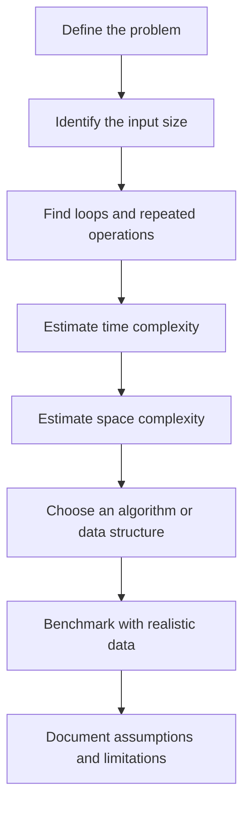

# 020 - Big O Notation

**Course:** 02 - Coding and EDA
**Module:** Module 04 - Coding for Data Science
**Content Group:** Data Structures and Algorithms
**Roadmap Source:** Coding for Data Science / Data Structures and Algorithms
**Lesson Type:** Coding
**Order in Module:** 020
**Suggested Duration:** 20 minutes

---

## 1. Summary

This lesson explains **Big O Notation** in the context of AI and Data Science.

Big O Notation describes how the runtime or memory usage of an algorithm grows as the input size increases.

For example, an algorithm that processes every row in a dataset once usually has a time complexity of:

$$
O(n)
$$

Here, `n` represents the number of rows.

After this lesson, you should be able to:

* Estimate how an algorithm scales with larger datasets.
* Compare different algorithmic approaches.
* Identify inefficient loops and data operations.
* Select suitable data structures and algorithms.
* Explain the performance limitations of a notebook, pipeline, model, or API.

---

## 2. Learning Objectives

By the end of this lesson, you should be able to:

* Explain Big O Notation in your own words.
* Distinguish between time complexity and space complexity.
* Recognize common complexity classes.
* Analyze simple Python algorithms.
* Compare two solutions based on scalability.
* Connect Big O Notation to practical AI and Data Science workflows.

---

## 3. Why Big O Matters in Data Science

A solution that works for 100 rows may become unusable for 10 million rows.

Big O Notation helps answer questions such as:

* How does runtime change when the dataset becomes larger?
* Will this algorithm work with millions of records?
* Why is a nested loop slower than a dictionary lookup?
* Why does model training take longer when the dataset grows?
* Which data structure should be used for fast searching?
* How much additional memory does an algorithm require?

### Example

Suppose an algorithm takes one second to process 1,000 rows.

Its behavior may change significantly depending on its complexity:

| Complexity   | Growth when the input becomes 10 times larger |
| ------------ | --------------------------------------------: |
| $O(1)$       |                         No significant change |
| $O(\log n)$  |                                Small increase |
| $O(n)$       |                 Approximately 10 times slower |
| $O(n\log n)$ |            Slightly more than 10 times slower |
| $O(n^2)$     |                Approximately 100 times slower |
| $O(2^n)$     |                     Often becomes impractical |

> Big O does not predict the exact runtime. It describes the growth rate of an algorithm.

---

## 4. Core Concepts

### 4.1 Input Size

Big O complexity is expressed using the input size, commonly written as `n`.

Depending on the problem, `n` may represent:

* Number of rows in a dataset.
* Number of features.
* Number of users.
* Number of files.
* Number of graph nodes.
* Number of training samples.
* Number of items in an array.

For a matrix or two separate datasets, multiple variables may be used:

$$
O(nm)
$$

Where:

* `n` is the number of rows.
* `m` is the number of columns or items in another dataset.

---

### 4.2 Time Complexity

**Time complexity** describes how the number of operations grows as the input size increases.

It does not normally measure runtime in seconds because actual runtime depends on:

* Hardware.
* Programming language.
* Compiler or interpreter.
* Available memory.
* Operating system.
* Implementation details.

Instead, time complexity estimates the number of important operations performed by an algorithm.

---

### 4.3 Space Complexity

**Space complexity** describes how much additional memory an algorithm requires as its input grows.

```python
def copy_values(values):
    copied_values = []

    for value in values:
        copied_values.append(value)

    return copied_values
```

The function creates a new list containing `n` values.

Therefore:

* Time complexity: $O(n)$
* Additional space complexity: $O(n)$

An algorithm may trade memory for speed or speed for memory.

---

### 4.4 Dominant Terms

Big O focuses on the dominant term when the input becomes large.

Consider:

$$
T(n) = 3n^2 + 5n + 10
$$

When `n` becomes large, the $n^2$ term dominates the other terms.

Therefore:

$$
T(n) = O(n^2)
$$

Big O usually ignores:

* Constant coefficients.
* Lower-order terms.
* Small implementation differences.

For example:

$$
O(2n) = O(n)
$$

And:

$$
O(n^2+n) = O(n^2)
$$

---

## 5. Common Complexity Classes

| Complexity   | Name         | Typical example            |
| ------------ | ------------ | -------------------------- |
| $O(1)$       | Constant     | Accessing an array element |
| $O(\log n)$  | Logarithmic  | Binary search              |
| $O(n)$       | Linear       | Scanning every row         |
| $O(n\log n)$ | Linearithmic | Efficient sorting          |
| $O(n^2)$     | Quadratic    | Comparing every pair       |
| $O(n^3)$     | Cubic        | Three nested loops         |
| $O(2^n)$     | Exponential  | Testing every subset       |
| $O(n!)$      | Factorial    | Testing every ordering     |

### General scalability

```text
More scalable
    │
    ├── O(1)
    ├── O(log n)
    ├── O(n)
    ├── O(n log n)
    ├── O(n²)
    ├── O(2ⁿ)
    └── O(n!)
    │
Less scalable
```

---

## 6. Constant Time — O(1)

An operation has constant complexity when its number of steps does not depend on the input size.

```python
def get_first_value(values):
    return values[0]
```

Whether the list contains 10 values or 10 million values, accessing the first element requires approximately the same number of operations.

* Time complexity: $O(1)$
* Space complexity: $O(1)$

### Data Science examples

* Accessing a NumPy array element by index.
* Looking up a dictionary value by key on average.
* Reading a cached model configuration.
* Returning a previously calculated metric.

---

## 7. Logarithmic Time — O(log n)

An algorithm has logarithmic complexity when it repeatedly reduces the search space.

Binary search removes approximately half of the remaining values during each step.

```python
def binary_search(values, target):
    left = 0
    right = len(values) - 1

    while left <= right:
        middle = (left + right) // 2

        if values[middle] == target:
            return middle

        if values[middle] < target:
            left = middle + 1
        else:
            right = middle - 1

    return -1
```

* Time complexity: $O(\log n)$
* Space complexity: $O(1)$ for the iterative implementation.
* Requirement: the input must be sorted.

### Binary search process

```text
Sorted data:

[1, 3, 5, 7, 9, 11, 13, 15]

Target: 13

Step 1:
[1, 3, 5, 7] | [9, 11, 13, 15]
                         ↑
                  Search this half

Step 2:
[9, 11] | [13, 15]
             ↑
       Search this half

Step 3:
[13]
  ↑
Found
```

---

## 8. Linear Time — O(n)

An algorithm has linear complexity when it processes every input item once.

```python
def calculate_total(values):
    total = 0

    for value in values:
        total += value

    return total
```

For `n` values, the loop performs approximately `n` operations.

* Time complexity: $O(n)$
* Space complexity: $O(1)$

### Data Science examples

* Calculating the sum of a column.
* Checking every row for missing values.
* Applying a transformation to every record.
* Reading a CSV file.
* Generating one prediction for each sample.

---

## 9. Linearithmic Time — O(n log n)

Many efficient sorting algorithms have an average time complexity of:

$$
O(n\log n)
$$

Examples include:

* Merge sort.
* Heap sort.
* Timsort.
* Quicksort in its average case.

```python
sorted_values = sorted(values)
```

Python's built-in sorting implementation is highly optimized and generally scales much better than manually written quadratic sorting algorithms.

### Data Science examples

* Sorting transactions by timestamp.
* Ranking model predictions.
* Ordering records before aggregation.
* Preparing data for binary search.
* Sorting nearest-neighbor distances.

---

## 10. Quadratic Time — O(n²)

An algorithm often has quadratic complexity when it contains two nested loops over the same input.

```python
def find_all_pairs(values):
    pairs = []

    for first_value in values:
        for second_value in values:
            pairs.append((first_value, second_value))

    return pairs
```

If the input contains `n` items, approximately $n \times n$ pairs are generated.

* Time complexity: $O(n^2)$
* Space complexity: $O(n^2)$

### Pairwise comparison

```text
              Compared item
           A    B    C    D
        ┌────────────────────
    A   │  ✓    ✓    ✓    ✓
    B   │  ✓    ✓    ✓    ✓
    C   │  ✓    ✓    ✓    ✓
    D   │  ✓    ✓    ✓    ✓

Total operations: n × n
```

### Data Science examples

* Computing distances between every pair of data points.
* Creating a full similarity matrix.
* Comparing every customer with every other customer.
* Naive duplicate detection.
* Some clustering and graph operations.

For large datasets, quadratic algorithms can become expensive very quickly.

---

## 11. Exponential and Factorial Complexity

### 11.1 Exponential Complexity — O(2ⁿ)

Exponential algorithms often evaluate every possible subset.

A set with `n` elements has:

$$
2^n
$$

possible subsets.

```python
from itertools import combinations


def generate_all_subsets(values):
    subsets = []

    for subset_size in range(len(values) + 1):
        subsets.extend(combinations(values, subset_size))

    return subsets
```

### Examples

* Exhaustive feature selection.
* Brute-force combinatorial optimization.
* Testing every possible group of features.
* Evaluating every possible combination of conditions.

---

### 11.2 Factorial Complexity — O(n!)

Factorial algorithms examine every possible ordering.

A collection of `n` items has:

$$
n!
$$

possible permutations.

Examples include:

* Brute-force route optimization.
* Testing every possible task order.
* Testing every possible exam schedule.
* Exhaustive traveling salesperson solutions.

For 10 items:

$$
10! = 3,628,800
$$

For 20 items:

$$
20! \approx 2.43 \times 10^{18}
$$

Optimization problems with factorial complexity often require:

* Dynamic programming.
* Heuristics.
* Approximation algorithms.
* Constraint programming.
* Branch and bound.
* Genetic algorithms.

---

## 12. Analyzing Python Code

### 12.1 Sequential Operations

```python
def process_values(values):
    total = sum(values)       # O(n)
    maximum = max(values)     # O(n)
    minimum = min(values)     # O(n)

    return total, maximum, minimum
```

The complexities are added:

$$
O(n)+O(n)+O(n)=O(3n)
$$

Big O ignores the constant:

$$
O(3n)=O(n)
$$

Therefore, the total time complexity is $O(n)$.

---

### 12.2 Nested Operations

```python
def compare_values(values):
    for first_value in values:
        for second_value in values:
            print(first_value, second_value)
```

The outer loop runs `n` times.

For each outer iteration, the inner loop also runs `n` times.

$$
n \times n = n^2
$$

Therefore:

$$
O(n^2)
$$

---

### 12.3 Different Input Sizes

```python
def compare_datasets(dataset_a, dataset_b):
    for row_a in dataset_a:
        for row_b in dataset_b:
            compare(row_a, row_b)
```

Let:

* `n` be the size of `dataset_a`.
* `m` be the size of `dataset_b`.

The complexity is:

$$
O(nm)
$$

It should not automatically be simplified to $O(n^2)$ because the datasets may have different sizes.

---

### 12.4 Consecutive Operations

```python
def process_values(values):
    for value in values:
        print(value)

    for value in values:
        print(value * 2)
```

Each loop has a complexity of $O(n)$.

Therefore:

$$
O(n)+O(n)=O(2n)=O(n)
$$

---

## 13. Best, Average, and Worst Cases

Some algorithms behave differently depending on their input.

Consider linear search:

```python
def linear_search(values, target):
    for index, value in enumerate(values):
        if value == target:
            return index

    return -1
```

### Best case

The target is the first item:

$$
O(1)
$$

### Average case

The algorithm checks approximately half of the items:

$$
O(n)
$$

### Worst case

The target is the final item or does not exist:

$$
O(n)
$$

Big O is commonly used to describe the worst-case upper bound, but the case being discussed should be stated clearly.

---

## 14. Data Structure Complexity

Choosing the correct data structure can significantly improve performance.

| Operation           |             List |            Dictionary |            Set |
| ------------------- | ---------------: | --------------------: | -------------: |
| Access by index     |           $O(1)$ |        Not applicable | Not applicable |
| Search by value     |           $O(n)$ | $O(1)$ average by key | $O(1)$ average |
| Insert at end       | $O(1)$ amortized |        $O(1)$ average | $O(1)$ average |
| Insert at beginning |           $O(n)$ |        Not applicable | Not applicable |
| Delete by value     |           $O(n)$ | $O(1)$ average by key | $O(1)$ average |

> Dictionary and set operations usually have constant average complexity, but collisions and implementation details can affect their worst-case behavior.

---

## 15. List Search vs Set Search

Suppose you need to determine whether each customer ID exists in a collection of valid IDs.

### List-based approach

```python
valid_ids = [101, 102, 103, 104, 105]


def filter_valid_customers(customer_ids):
    result = []

    for customer_id in customer_ids:
        if customer_id in valid_ids:
            result.append(customer_id)

    return result
```

Searching a list has a complexity of $O(m)$, where `m` is the number of valid IDs.

If there are `n` customer IDs, the total complexity is:

$$
O(nm)
$$

If both collections have approximately the same size:

$$
O(n^2)
$$

### Set-based approach

```python
valid_ids = {101, 102, 103, 104, 105}


def filter_valid_customers(customer_ids):
    result = []

    for customer_id in customer_ids:
        if customer_id in valid_ids:
            result.append(customer_id)

    return result
```

Set membership lookup is $O(1)$ on average.

The total complexity becomes:

$$
O(n)
$$

### Comparison diagram

```text
List-based lookup

Customer ID
    │
    ▼
Scan the list of valid IDs
    │
    ▼
O(n × m)


Set-based lookup

Customer ID
    │
    ▼
Perform a hash lookup
    │
    ▼
O(n)
```

---

## 16. Big O in AI and Data Science

### 16.1 Data Loading

Reading a dataset with `n` rows is usually at least:

$$
O(n)
$$

Every row normally needs to be read from storage.

```python
import pandas as pd

dataframe = pd.read_csv("sales.csv")
```

Runtime is also affected by:

* File size.
* Disk speed.
* Number of columns.
* Data types.
* Compression.
* Parsing complexity.

---

### 16.2 Data Cleaning

Processing every row once is commonly $O(n)$.

```python
dataframe["price"] = (
    dataframe["price"]
    .str.replace("$", "", regex=False)
    .astype(float)
)
```

Applying a Python function row by row may also be $O(n)$ but can have a much larger constant cost.

```python
dataframe["normalized_name"] = dataframe["name"].apply(normalize_name)
```

Both operations may have the same Big O complexity, but vectorized operations are usually faster in practice.

---

### 16.3 Sorting

Sorting `n` rows is commonly:

$$
O(n\log n)
$$

```python
sorted_dataframe = dataframe.sort_values("revenue")
```

Sorting very large datasets may require significant:

* CPU time.
* Memory.
* Temporary disk space.
* Distributed computation.

---

### 16.4 Grouping and Aggregation

A grouping operation usually requires scanning the dataset.

```python
summary = dataframe.groupby("category")["revenue"].sum()
```

A simplified estimate may be:

$$
O(n)
$$

or:

$$
O(n\log n)
$$

The actual behavior depends on whether the implementation uses hashing or sorting.

---

### 16.5 Database Joins

The complexity of a database join depends on the selected algorithm.

| Join strategy    | Approximate complexity |
| ---------------- | ---------------------- |
| Nested-loop join | $O(nm)$                |
| Hash join        | $O(n+m)$ average       |
| Sort-merge join  | $O(n\log n+m\log m)$   |

Indexes, memory, query planning, and data distribution strongly affect actual performance.

---

### 16.6 Machine Learning Training

Training complexity depends on the model.

#### Linear regression with iterative optimization

For `n` samples, `d` features, and `k` iterations:

$$
O(knd)
$$

#### K-Nearest Neighbors prediction

A naive prediction compares a new sample with every training sample:

$$
O(nd)
$$

#### Decision tree training

A simplified estimate is often:

$$
O(nd\log n)
$$

#### Neural networks

Training complexity depends on:

* Number of samples.
* Number of parameters.
* Number of layers.
* Batch size.
* Number of epochs.
* Forward-pass cost.
* Backpropagation cost.

Big O describes scaling, while hardware acceleration and parallel processing affect actual runtime.

---

### 16.7 Pairwise Distance Matrices

A full distance matrix between `n` data points requires approximately:

$$
O(n^2)
$$

distance calculations.

```python
from sklearn.metrics import pairwise_distances

distance_matrix = pairwise_distances(features)
```

It also requires approximately:

$$
O(n^2)
$$

memory.

For 100,000 samples, the matrix contains:

$$
100,000^2 = 10,000,000,000
$$

distance values.

Possible alternatives include:

* Sampling.
* Mini-batch algorithms.
* Approximate nearest neighbors.
* Sparse representations.
* Dimensionality reduction.
* Distributed computation.

---

## 17. Big O vs Real Runtime

Two algorithms with the same Big O complexity may have different actual runtimes.

```python
def total_with_loop(values):
    total = 0

    for value in values:
        total += value

    return total
```

```python
def total_with_builtin(values):
    return sum(values)
```

Both functions have:

$$
O(n)
$$

However, the built-in implementation may be faster because it is optimized at a lower level.

Actual performance is affected by:

* Constant factors.
* Memory access.
* CPU cache behavior.
* Vectorization.
* Parallelism.
* Programming language.
* Network latency.
* Disk input and output.
* GPU acceleration.

Use Big O for scalability analysis and benchmarks for real performance measurements.

---

## 18. Practical Benchmark

Python's `timeit` module can be used to measure runtime.

```python
import random
import timeit


values = [
    random.randint(1, 1_000_000)
    for _ in range(100_000)
]

target = values[-1]

list_runtime = timeit.timeit(
    stmt="target in values",
    globals={
        "target": target,
        "values": values,
    },
    number=1_000,
)

value_set = set(values)

set_runtime = timeit.timeit(
    stmt="target in value_set",
    globals={
        "target": target,
        "value_set": value_set,
    },
    number=1_000,
)

print(f"List lookup: {list_runtime:.6f} seconds")
print(f"Set lookup:  {set_runtime:.6f} seconds")
```

### Interpretation

* List lookup has $O(n)$ average behavior.
* Set lookup has $O(1)$ average behavior.
* Building the set initially requires $O(n)$ time and space.
* A set is especially useful when many membership checks are required.

---

## 19. Complexity Analysis Workflow



If Mermaid is not supported, the workflow can be displayed as plain text:

```text
Define the problem
        │
        ▼
Identify the input size
        │
        ▼
Find loops and repeated operations
        │
        ▼
Estimate time complexity
        │
        ▼
Estimate space complexity
        │
        ▼
Choose a better algorithm or data structure
        │
        ▼
Benchmark with realistic data
        │
        ▼
Document assumptions and limitations
```

---

## 20. Worked Example: Duplicate Detection

### Problem

Find duplicate customer IDs in a dataset.

### Naive solution

```python
def find_duplicates_naive(customer_ids):
    duplicates = []

    for current_index in range(len(customer_ids)):
        for comparison_index in range(
            current_index + 1,
            len(customer_ids),
        ):
            if (
                customer_ids[current_index]
                == customer_ids[comparison_index]
            ):
                duplicates.append(
                    customer_ids[current_index]
                )

    return duplicates
```

Time complexity:

$$
O(n^2)
$$

### Improved solution

```python
def find_duplicates(customer_ids):
    seen = set()
    duplicates = set()

    for customer_id in customer_ids:
        if customer_id in seen:
            duplicates.add(customer_id)
        else:
            seen.add(customer_id)

    return list(duplicates)
```

Time complexity:

$$
O(n)
$$

Additional space complexity:

$$
O(n)
$$

### Trade-off

```text
Naive approach
    ├── Low additional memory
    └── Quadratic runtime: O(n²)

Hash-set approach
    ├── Linear additional memory: O(n)
    └── Linear runtime: O(n)
```

The improved solution uses more memory but reduces runtime.

---

## 21. Practical Exercise

Use a small CSV dataset:

```csv
customer_id,product,category,revenue
101,Laptop,Electronics,1200
102,Mouse,Electronics,40
103,Desk,Furniture,300
101,Keyboard,Electronics,90
104,Chair,Furniture,150
102,Monitor,Electronics,250
```

### Tasks

1. Load the CSV file with Pandas.
2. Find duplicate customer IDs using nested loops.
3. Implement another solution using a set.
4. Write the time complexity of each solution.
5. Benchmark both solutions using larger synthetic datasets.
6. Plot input size against runtime.
7. Explain when the performance difference becomes significant.
8. Record the memory trade-off of the set-based solution.

### Starter code

```python
import random
import time

import pandas as pd


def find_duplicates_naive(values):
    duplicates = set()

    for first_index in range(len(values)):
        for second_index in range(
            first_index + 1,
            len(values),
        ):
            if values[first_index] == values[second_index]:
                duplicates.add(values[first_index])

    return duplicates


def find_duplicates_with_set(values):
    seen = set()
    duplicates = set()

    for value in values:
        if value in seen:
            duplicates.add(value)
        else:
            seen.add(value)

    return duplicates


def measure_runtime(function, values):
    start_time = time.perf_counter()
    function(values)
    end_time = time.perf_counter()

    return end_time - start_time


results = []

for input_size in [100, 500, 1_000, 2_000]:
    values = [
        random.randint(1, input_size // 2)
        for _ in range(input_size)
    ]

    results.append(
        {
            "input_size": input_size,
            "naive_runtime": measure_runtime(
                find_duplicates_naive,
                values,
            ),
            "set_runtime": measure_runtime(
                find_duplicates_with_set,
                values,
            ),
        }
    )

results_dataframe = pd.DataFrame(results)

print(results_dataframe)
```

### Runtime chart

```python
import matplotlib.pyplot as plt


plt.plot(
    results_dataframe["input_size"],
    results_dataframe["naive_runtime"],
    marker="o",
    label="Nested loops",
)

plt.plot(
    results_dataframe["input_size"],
    results_dataframe["set_runtime"],
    marker="o",
    label="Set-based",
)

plt.xlabel("Input size")
plt.ylabel("Runtime in seconds")
plt.title("Duplicate Detection Runtime")
plt.legend()
plt.show()
```

---

## 22. Common Mistakes

### Mistake 1: Treating Big O as exact runtime

Big O describes growth, not the exact number of seconds.

---

### Mistake 2: Ignoring hidden nested operations

```python
for value in values:
    if value in another_list:
        process(value)
```

The outer loop has $O(n)$ complexity, but searching `another_list` may require $O(m)$ time.

The total complexity may therefore be:

$$
O(nm)
$$

---

### Mistake 3: Ignoring space complexity

A faster algorithm may require a large dictionary, set, cache, or matrix.

---

### Mistake 4: Keeping constants in the final result

Constants are removed in Big O notation:

$$
O(5n)=O(n)
$$

However, constants may still affect practical runtime.

---

### Mistake 5: Assuming dictionary operations are always O(1)

Dictionary operations are usually $O(1)$ on average, but their worst-case behavior may be different.

---

### Mistake 6: Optimizing too early

Small datasets may not require complex optimization.

A better process is:

1. Write correct code.
2. Measure performance.
3. Identify the bottleneck.
4. Optimize the relevant operation.
5. Measure the result again.

---

### Mistake 7: Ignoring library implementations

Pandas, NumPy, databases, and machine-learning libraries may use optimized algorithms internally.

Read the documentation and benchmark representative data instead of estimating complexity only from function names.

---

## 23. Completion Checklist

* [ ] I can explain Big O Notation in one or two minutes.
* [ ] I understand the difference between time and space complexity.
* [ ] I can recognize $O(1)$, $O(\log n)$, $O(n)$, $O(n\log n)$, and $O(n^2)$.
* [ ] I can analyze simple loops and nested loops.
* [ ] I understand why constants and lower-order terms are omitted.
* [ ] I can compare list lookup with set or dictionary lookup.
* [ ] I can identify a quadratic operation in a data workflow.
* [ ] I can benchmark two Python implementations.
* [ ] I have documented at least one performance assumption or limitation.
* [ ] I have created a notebook, script, chart, or portfolio note for this lesson.

---

## 24. Related Outcome

Use Python, SQL, data libraries, notebooks, and Git to build reproducible and scalable data workflows.

Big O Notation supports this outcome by helping you:

* Select efficient algorithms.
* Choose suitable data structures.
* Detect performance bottlenecks.
* Estimate whether an operation can scale.
* Explain technical trade-offs.
* Design more reliable pipelines and APIs.

---

## 25. Related Project

### Mini Project: Algorithm Complexity Benchmark

Build a notebook that compares:

* Linear search and binary search.
* List membership and set membership.
* Nested-loop duplicate detection and hash-based duplicate detection.
* Manual sorting and Python's built-in sorting.
* Pairwise calculations on different dataset sizes.

The notebook should contain:

1. A clear problem statement.
2. Multiple input sizes.
3. Runtime measurements.
4. A runtime chart.
5. Time-complexity analysis.
6. Space-complexity analysis.
7. Practical recommendations.
8. A short README explaining how to run the experiment.

### Example portfolio conclusion

> The hash-based duplicate detection algorithm scaled approximately linearly, while the nested-loop implementation showed quadratic growth. For datasets larger than a few thousand records, the set-based implementation was significantly more practical, although it required additional memory.

---

## 26. Summary

**Big O Notation** describes how the runtime or memory usage of an algorithm grows as its input becomes larger.

The most important complexity classes are:

$$
O(1),\quad
O(\log n),\quad
O(n),\quad
O(n\log n),\quad
O(n^2),\quad
O(2^n),\quad
O(n!)
$$

In AI and Data Science, Big O helps evaluate:

* Data loading.
* Data cleaning.
* Searching.
* Sorting.
* Database joins.
* Pairwise calculations.
* Model training.
* Prediction latency.
* Memory requirements.

Big O should be used together with real benchmarks.

```text
Complexity analysis
        +
Realistic benchmarks
        +
Memory measurements
        +
Documented trade-offs
        =
Scalable data solution
```

Turn this lesson into a notebook, benchmark, chart, optimized transformation, API experiment, or portfolio note so that the concept becomes practical and measurable.

---

# Bài luyện tập

## Mục tiêu


## Đề bài


## Yêu cầu hoàn thành

- [ ] 
- [ ] 
- [ ] 

## Kết quả / lời giải


## Ghi chú
