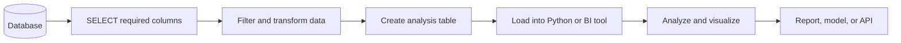

# 022 - SELECT

**Course:** 02 - Coding and EDA
**Module:** Module 04 - Coding for Data Science
**Content Group:** SQL
**Roadmap Source:** Coding for Data Science / SQL
**Lesson Type:** Coding
**Order in Module:** 022
**Suggested Duration:** 20 minutes

---

## 1. Overview

The `SELECT` statement is the foundation of SQL data retrieval. It is used to choose columns, create calculated fields, rename output columns, remove duplicate rows, and inspect data stored in relational databases.

For an AI Engineer or Data Scientist, `SELECT` is commonly used to:

* Inspect raw datasets.
* Retrieve features for machine learning.
* Build analysis tables.
* Calculate business metrics.
* Validate data quality.
* Prepare data for dashboards, notebooks, and reports.

A typical SQL analysis begins with a simple `SELECT` query and gradually adds filtering, aggregation, joins, and transformations.

---

## 2. Learning Objectives

After completing this lesson, you should be able to:

* Explain the purpose of the `SELECT` statement.
* Retrieve one or more columns from a database table.
* Return all columns using `*`.
* Rename columns with aliases.
* Create calculated columns.
* Remove duplicate results with `DISTINCT`.
* Limit the number of returned rows.
* Apply `SELECT` in an AI and data science workflow.
* Write readable and reproducible SQL queries.

---

## 3. Core Concepts

### 3.1 Basic `SELECT` Syntax

The basic structure of a query is:

```sql
SELECT column_name
FROM table_name;
```

Example:

```sql
SELECT customer_name
FROM customers;
```

This query returns the `customer_name` column from the `customers` table.

---

### 3.2 Selecting Multiple Columns

Separate column names with commas.

```sql
SELECT
    customer_id,
    customer_name,
    city
FROM customers;
```

The result contains only the requested columns.

| customer_id | customer_name | city             |
| ----------: | ------------- | ---------------- |
|         101 | Alice         | Hanoi            |
|         102 | Bob           | Da Nang          |
|         103 | Carol         | Ho Chi Minh City |

Selecting only necessary columns is usually better than selecting the entire table because it:

* Reduces the amount of transferred data.
* Makes the query easier to understand.
* Produces cleaner analysis outputs.
* Can improve performance on large datasets.

---

### 3.3 Selecting All Columns

Use the asterisk `*` to return every column.

```sql
SELECT *
FROM customers;
```

This is useful when exploring a small or unfamiliar table.

However, avoid using `SELECT *` in production pipelines because:

* The table may contain unnecessary columns.
* New columns may unexpectedly change the query output.
* Large columns can increase memory and network usage.
* The expected schema becomes less explicit.

A more reproducible query lists the required columns directly:

```sql
SELECT
    customer_id,
    customer_name,
    city,
    registration_date
FROM customers;
```

---

### 3.4 Column Aliases

An alias gives a column a temporary name in the query result.

```sql
SELECT
    customer_name AS name,
    registration_date AS joined_at
FROM customers;
```

Result:

| name  | joined_at  |
| ----- | ---------- |
| Alice | 2026-01-12 |
| Bob   | 2026-02-03 |

Aliases are especially useful when:

* A column name is too long.
* A calculated column needs a meaningful name.
* Output names must match a dashboard or API schema.
* A query combines columns from multiple tables.

The `AS` keyword is optional in many SQL databases:

```sql
SELECT customer_name name
FROM customers;
```

Using `AS` is usually clearer.

---

### 3.5 Calculated Columns

A `SELECT` query can calculate new values without modifying the original table.

Suppose the `sales` table contains:

| product_name | quantity | unit_price |
| ------------ | -------: | ---------: |
| Keyboard     |        2 |      30.00 |
| Mouse        |        3 |      15.00 |

Calculate the revenue for each row:

```sql
SELECT
    product_name,
    quantity,
    unit_price,
    quantity * unit_price AS revenue
FROM sales;
```

Result:

| product_name | quantity | unit_price | revenue |
| ------------ | -------: | ---------: | ------: |
| Keyboard     |        2 |      30.00 |   60.00 |
| Mouse        |        3 |      15.00 |   45.00 |

Calculated columns can use:

* Arithmetic operators.
* String functions.
* Date functions.
* Conditional expressions.
* Database functions.

Another example:

```sql
SELECT
    employee_name,
    monthly_salary,
    monthly_salary * 12 AS annual_salary
FROM employees;
```

The calculation exists only in the query result. It does not permanently change the table.

---

### 3.6 Arithmetic Operators

Common arithmetic operators include:

| Operator | Meaning        | Example               |
| -------- | -------------- | --------------------- |
| `+`      | Addition       | `price + tax`         |
| `-`      | Subtraction    | `revenue - cost`      |
| `*`      | Multiplication | `quantity * price`    |
| `/`      | Division       | `revenue / customers` |
| `%`      | Modulo         | `value % 2`           |

Example:

```sql
SELECT
    product_name,
    revenue,
    cost,
    revenue - cost AS profit
FROM product_performance;
```

Be careful when dividing by zero:

```sql
SELECT
    campaign_name,
    conversions,
    clicks,
    conversions * 1.0 / NULLIF(clicks, 0) AS conversion_rate
FROM campaigns;
```

`NULLIF(clicks, 0)` returns `NULL` when `clicks` is zero, preventing a division-by-zero error.

---

### 3.7 Removing Duplicates with `DISTINCT`

Use `DISTINCT` to return unique values.

```sql
SELECT DISTINCT city
FROM customers;
```

Possible result:

| city             |
| ---------------- |
| Hanoi            |
| Da Nang          |
| Ho Chi Minh City |

Without `DISTINCT`, a city appears once for every customer in that city.

You can also apply `DISTINCT` to multiple columns:

```sql
SELECT DISTINCT
    city,
    customer_segment
FROM customers;
```

In this case, SQL returns unique combinations of `city` and `customer_segment`.

> `DISTINCT` applies to the complete selected row, not to one column independently.

---

### 3.8 Returning Constant Values

A `SELECT` statement can return constant values even without reading a table.

```sql
SELECT
    'Data Science' AS learning_path,
    2026 AS year;
```

Result:

| learning_path | year |
| ------------- | ---: |
| Data Science  | 2026 |

This can be useful for:

* Testing database connections.
* Adding metadata to query results.
* Creating labels for exported datasets.

---

### 3.9 Limiting Returned Rows

When exploring a large table, return only a small sample.

In PostgreSQL, MySQL, SQLite, and many analytics databases:

```sql
SELECT *
FROM sales
LIMIT 10;
```

In SQL Server:

```sql
SELECT TOP 10 *
FROM sales;
```

Limiting rows helps:

* Inspect the table structure.
* Avoid loading millions of records.
* Test a query before running it on the full dataset.
* Reduce notebook memory usage.

Unless combined with `ORDER BY`, the returned rows are not guaranteed to follow a meaningful order.

---

## 4. How `SELECT` Fits into a Data Workflow



In a typical project:

1. Data is stored in a relational database.
2. `SELECT` retrieves the necessary columns.
3. SQL transforms the data into an analysis-friendly format.
4. The result is loaded into Python, a notebook, or a dashboard.
5. The prepared data supports metrics, charts, and machine learning models.

---

## 5. SQL Query Structure

A complete query may contain several clauses:

```sql
SELECT
    column_1,
    column_2
FROM table_name
WHERE condition
GROUP BY column_1, column_2
HAVING aggregate_condition
ORDER BY column_1
LIMIT 10;
```

Although `SELECT` is written first, SQL normally processes the clauses in a different logical order.


This order explains why an alias created in `SELECT` may not be available inside `WHERE`.

For example, the following query may not work in many databases:

```sql
SELECT
    quantity * unit_price AS revenue
FROM sales
WHERE revenue > 100;
```

A safer version repeats the expression:

```sql
SELECT
    quantity * unit_price AS revenue
FROM sales
WHERE quantity * unit_price > 100;
```

Alternatively, use a subquery or Common Table Expression when the calculation is complex.

---

## 6. Practical Example: Sales Database

Assume the `sales` table contains:

| sale_id | sale_date  | product_name | category    | quantity | unit_price |
| ------: | ---------- | ------------ | ----------- | -------: | ---------: |
|       1 | 2026-06-01 | Laptop       | Electronics |        1 |       1200 |
|       2 | 2026-06-01 | Mouse        | Accessories |        3 |         25 |
|       3 | 2026-06-02 | Keyboard     | Accessories |        2 |         45 |
|       4 | 2026-06-03 | Monitor      | Electronics |        2 |        300 |

### Query 1: Inspect the Table

```sql
SELECT *
FROM sales
LIMIT 5;
```

---

### Query 2: Select Relevant Columns

```sql
SELECT
    sale_date,
    product_name,
    quantity,
    unit_price
FROM sales;
```

---

### Query 3: Calculate Revenue

```sql
SELECT
    sale_id,
    product_name,
    quantity,
    unit_price,
    quantity * unit_price AS revenue
FROM sales;
```

Expected result:

| sale_id | product_name | quantity | unit_price | revenue |
| ------: | ------------ | -------: | ---------: | ------: |
|       1 | Laptop       |        1 |       1200 |    1200 |
|       2 | Mouse        |        3 |         25 |      75 |
|       3 | Keyboard     |        2 |         45 |      90 |
|       4 | Monitor      |        2 |        300 |     600 |

---

### Query 4: Find Unique Product Categories

```sql
SELECT DISTINCT category
FROM sales;
```

Expected result:

| category    |
| ----------- |
| Electronics |
| Accessories |

---

### Query 5: Produce Report-Friendly Names

```sql
SELECT
    sale_date AS order_date,
    product_name AS product,
    quantity AS units_sold,
    quantity * unit_price AS total_revenue
FROM sales;
```

---

## 7. Using `SELECT` with Python

A SQL query can be loaded directly into a Pandas DataFrame.

```python
import sqlite3
import pandas as pd

connection = sqlite3.connect("sales.db")

query = """
SELECT
    sale_date,
    product_name,
    category,
    quantity,
    unit_price,
    quantity * unit_price AS revenue
FROM sales
"""

sales_df = pd.read_sql_query(query, connection)

print(sales_df.head())

connection.close()
```

The resulting DataFrame can then be used for:

* Exploratory data analysis.
* Data visualization.
* Feature engineering.
* Statistical analysis.
* Machine learning.
* Report generation.

Example summary:

```python
category_revenue = (
    sales_df.groupby("category", as_index=False)["revenue"]
    .sum()
    .sort_values("revenue", ascending=False)
)

print(category_revenue)
```

---

## 8. Reproducible Query Style

A readable query places each selected column on a separate line.

Recommended:

```sql
SELECT
    customer_id,
    customer_name,
    city,
    registration_date
FROM customers;
```

Less readable:

```sql
SELECT customer_id, customer_name, city, registration_date FROM customers;
```

For calculated columns, use meaningful aliases:

```sql
SELECT
    product_name,
    quantity * unit_price AS gross_revenue
FROM sales;
```

Avoid unclear aliases:

```sql
SELECT
    product_name,
    quantity * unit_price AS x
FROM sales;
```

Useful formatting practices include:

* Write SQL keywords consistently.
* Use one selected expression per line.
* Use descriptive aliases.
* Add comments for business rules.
* Avoid unnecessary `SELECT *`.
* Save important queries in `.sql` files.
* Track query changes with Git.

Example with comments:

```sql
-- Build a product-level sales dataset for the monthly report.
SELECT
    sale_id,
    sale_date,
    product_name,
    category,
    quantity,
    unit_price,
    quantity * unit_price AS gross_revenue
FROM sales;
```

---

## 9. Common Mistakes

### 9.1 Forgetting Commas

Incorrect:

```sql
SELECT
    customer_id
    customer_name
FROM customers;
```

Correct:

```sql
SELECT
    customer_id,
    customer_name
FROM customers;
```

---

### 9.2 Misspelling Column Names

Incorrect:

```sql
SELECT costumer_name
FROM customers;
```

Correct:

```sql
SELECT customer_name
FROM customers;
```

Inspect the table schema when a column name is unclear.

---

### 9.3 Using `SELECT *` Everywhere

```sql
SELECT *
FROM large_event_table;
```

Possible problems:

* Unnecessary columns are loaded.
* Query execution becomes more expensive.
* Downstream schemas become unstable.
* Sensitive data may be retrieved unintentionally.

Prefer:

```sql
SELECT
    event_time,
    user_id,
    event_type
FROM large_event_table;
```

---

### 9.4 Assuming Row Order

This query does not guarantee a specific row order:

```sql
SELECT
    product_name,
    unit_price
FROM products;
```

A deterministic order requires `ORDER BY`:

```sql
SELECT
    product_name,
    unit_price
FROM products
ORDER BY unit_price DESC;
```

---

### 9.5 Forgetting About `NULL`

Arithmetic operations involving `NULL` normally return `NULL`.

```sql
SELECT
    product_name,
    quantity * unit_price AS revenue
FROM sales;
```

If `quantity` or `unit_price` is `NULL`, the calculated revenue is also `NULL`.

A possible solution is `COALESCE`:

```sql
SELECT
    product_name,
    COALESCE(quantity, 0) * COALESCE(unit_price, 0) AS revenue
FROM sales;
```

Whether missing values should become zero depends on the business meaning of the data.

---

### 9.6 Using Unclear Calculations

Less readable:

```sql
SELECT
    price * quantity - price * quantity * discount
FROM sales;
```

More readable:

```sql
SELECT
    price * quantity AS gross_revenue,
    price * quantity * discount AS discount_amount,
    price * quantity * (1 - discount) AS net_revenue
FROM sales;
```

---

## 10. Practical Exercise

Use a small sales database containing at least these columns:

```text
sale_id
sale_date
customer_id
product_name
category
quantity
unit_price
discount
```

Complete the following tasks.

### Task 1: Inspect the Dataset

Return the first 10 rows.

```sql
SELECT *
FROM sales
LIMIT 10;
```

---

### Task 2: Select Important Columns

Return:

* Sale date.
* Product name.
* Quantity.
* Unit price.

```sql
SELECT
    sale_date,
    product_name,
    quantity,
    unit_price
FROM sales;
```

---

### Task 3: Calculate Gross Revenue

```sql
SELECT
    product_name,
    quantity,
    unit_price,
    quantity * unit_price AS gross_revenue
FROM sales;
```

---

### Task 4: Calculate Net Revenue

Assume `discount` is stored as a decimal between `0` and `1`.

```sql
SELECT
    product_name,
    quantity * unit_price AS gross_revenue,
    discount,
    quantity * unit_price * (1 - discount) AS net_revenue
FROM sales;
```

---

### Task 5: List Unique Categories

```sql
SELECT DISTINCT category
FROM sales;
```

---

### Task 6: Create a Python Report

Load the query result into Pandas and produce:

1. A table of revenue by category.
2. A chart of the highest-revenue products.
3. Three written insights based on the results.

---

## 11. Mini Challenge

Create a query that returns:

* Sale ID.
* Product name.
* Category.
* Quantity.
* Unit price.
* Gross revenue.
* Discount amount.
* Net revenue.

Example solution:

```sql
SELECT
    sale_id,
    product_name,
    category,
    quantity,
    unit_price,
    quantity * unit_price AS gross_revenue,
    quantity * unit_price * discount AS discount_amount,
    quantity * unit_price * (1 - discount) AS net_revenue
FROM sales;
```

### Reflection Questions

* What happens when `discount` is `NULL`?
* Should a missing discount mean zero discount?
* Could `quantity` contain negative values for returned products?
* Are monetary values stored with sufficient decimal precision?
* Does the dataset contain duplicate sales records?

---

## 12. Completion Checklist

* [ ] I can explain the purpose of `SELECT` in one or two minutes.
* [ ] I can select one column from a table.
* [ ] I can select multiple columns.
* [ ] I understand when `SELECT *` should be avoided.
* [ ] I can rename a column with `AS`.
* [ ] I can create a calculated column.
* [ ] I can return unique values with `DISTINCT`.
* [ ] I can limit the number of returned rows.
* [ ] I can load a SQL query result into Pandas.
* [ ] I have documented at least one assumption or data-quality concern.
* [ ] I have saved my query so that the analysis can be reproduced.

---

## 13. Related Outcome

Use Python, SQL, data libraries, notebooks, and Git to build reproducible data workflows.

---

## 14. Related Project

### Mini Project: SQL and Python Sales Analysis

Build a small sales analysis workflow:


Suggested deliverables:

```text
sql-sales-analysis/
├── data/
│   └── sales.db
├── queries/
│   └── sales_analysis.sql
├── notebooks/
│   └── sales_report.ipynb
├── reports/
│   └── sales_summary.md
└── README.md
```

The project should include:

* Explicitly selected columns.
* At least two calculated fields.
* A list of unique categories.
* A Pandas analysis table.
* At least one chart.
* Three data-driven insights.
* A README explaining how to run the analysis.

---

## 15. Summary

The `SELECT` statement is the starting point for retrieving and transforming relational data.

The most important patterns are:

```sql
-- Select one column
SELECT column_name
FROM table_name;
```

```sql
-- Select multiple columns
SELECT
    column_1,
    column_2
FROM table_name;
```

```sql
-- Rename a column
SELECT
    column_name AS new_name
FROM table_name;
```

```sql
-- Create a calculated column
SELECT
    quantity * unit_price AS revenue
FROM sales;
```

```sql
-- Return unique values
SELECT DISTINCT category
FROM sales;
```

```sql
-- Inspect a limited number of rows
SELECT *
FROM sales
LIMIT 10;
```

A well-written `SELECT` query should be explicit, readable, reproducible, and focused on the data required for the analysis. In an AI and data science workflow, it is often the first step between raw database records and a notebook, dashboard, model, experiment, or production API.

---

# Bài luyện tập

## Mục tiêu


## Đề bài


## Yêu cầu hoàn thành

- [ ] 
- [ ] 
- [ ] 

## Kết quả / lời giải


## Ghi chú
