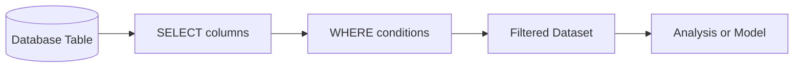
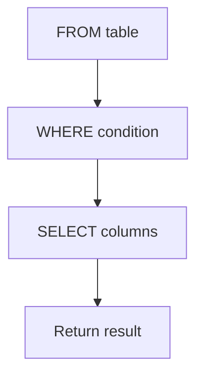
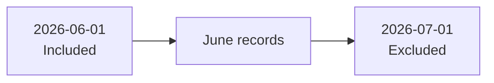
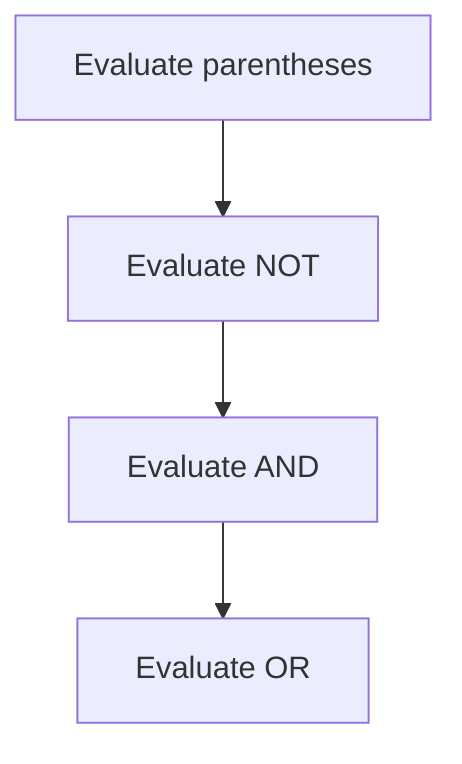
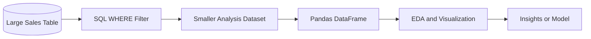
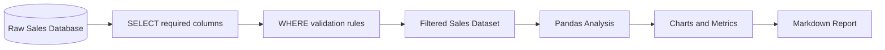

# 023 - WHERE

**Course:** 02 - Coding and EDA
**Module:** Module 04 - Coding for Data Science
**Content Group:** SQL
**Roadmap Source:** Coding for Data Science / SQL
**Lesson Type:** Coding
**Order in Module:** 023
**Suggested Duration:** 20 minutes

---

## 1. Overview

The `WHERE` clause is used to filter rows in a SQL query.

Instead of returning every record from a table, `WHERE` keeps only the rows that satisfy a specified condition.

For example:

```sql
SELECT
    product_name,
    unit_price
FROM products
WHERE unit_price > 100;
```

This query returns only products whose price is greater than `100`.

For an AI Engineer or Data Scientist, `WHERE` is commonly used to:

* Select data from a specific date range.
* Remove invalid or irrelevant records.
* Retrieve data for a target customer segment.
* Filter training or evaluation datasets.
* Investigate anomalies and data-quality problems.
* Build analysis tables for reports and dashboards.
* Reduce the amount of data loaded into Python.

A typical data workflow uses `WHERE` immediately after identifying the source table.



---

## 2. Learning Objectives

After completing this lesson, you should be able to:

* Explain the purpose of the `WHERE` clause.
* Filter numeric, text, date, and Boolean values.
* Use comparison operators in SQL conditions.
* Combine conditions with `AND`, `OR`, and `NOT`.
* Filter ranges with `BETWEEN`.
* Filter lists of values with `IN`.
* Search text patterns with `LIKE`.
* handle missing values with `IS NULL` and `IS NOT NULL`.
* Understand how operator precedence affects a condition.
* Use `WHERE` in a reproducible data workflow.
* Apply filtering before loading data into Pandas.

---

## 3. Basic Syntax

The general syntax is:

```sql
SELECT
    column_1,
    column_2
FROM table_name
WHERE condition;
```

Example:

```sql
SELECT
    customer_id,
    customer_name,
    city
FROM customers
WHERE city = 'Hanoi';
```

This query returns only customers located in Hanoi.

### Logical Query Order

Although `SELECT` is written before `WHERE`, SQL logically reads the table first and then applies the filter.



The simplified logical processing order is:

1. `FROM`
2. `WHERE`
3. `SELECT`
4. `ORDER BY`
5. `LIMIT`

---

## 4. Comparison Operators

Comparison operators are used to compare a column with a value or expression.

| Operator | Meaning                  | Example                 |
| -------- | ------------------------ | ----------------------- |
| `=`      | Equal to                 | `city = 'Hanoi'`        |
| `<>`     | Not equal to             | `status <> 'cancelled'` |
| `!=`     | Not equal to             | `status != 'cancelled'` |
| `>`      | Greater than             | `price > 100`           |
| `<`      | Less than                | `price < 100`           |
| `>=`     | Greater than or equal to | `score >= 80`           |
| `<=`     | Less than or equal to    | `score <= 80`           |

> `<>` is the standard SQL operator for “not equal.” Many databases also support `!=`.

---

## 5. Filtering Numeric Values

Suppose the `products` table contains:

| product_id | product_name | category    | unit_price | stock_quantity |
| ---------: | ------------ | ----------- | ---------: | -------------: |
|          1 | Laptop       | Electronics |       1200 |             10 |
|          2 | Mouse        | Accessories |         25 |            150 |
|          3 | Keyboard     | Accessories |         45 |             80 |
|          4 | Monitor      | Electronics |        300 |             25 |
|          5 | Webcam       | Accessories |         90 |              0 |

### Greater Than

```sql
SELECT
    product_name,
    unit_price
FROM products
WHERE unit_price > 100;
```

Result:

| product_name | unit_price |
| ------------ | ---------: |
| Laptop       |       1200 |
| Monitor      |        300 |

### Greater Than or Equal To

```sql
SELECT
    product_name,
    stock_quantity
FROM products
WHERE stock_quantity >= 80;
```

### Equal To

```sql
SELECT
    product_name,
    stock_quantity
FROM products
WHERE stock_quantity = 0;
```

This can be used to find products that are out of stock.

### Not Equal To

```sql
SELECT
    product_name,
    category
FROM products
WHERE category <> 'Electronics';
```

---

## 6. Filtering Text Values

Text values must normally be enclosed in single quotation marks.

```sql
SELECT
    customer_id,
    customer_name,
    city
FROM customers
WHERE city = 'Da Nang';
```

Incorrect:

```sql
SELECT *
FROM customers
WHERE city = Da Nang;
```

Correct:

```sql
SELECT *
FROM customers
WHERE city = 'Da Nang';
```

### Case Sensitivity

Text comparison behavior depends on the database and column collation.

For example, these values may or may not be treated as equal:

```text
Hanoi
hanoi
HANOI
```

A portable approach is to normalize the text:

```sql
SELECT
    customer_id,
    customer_name,
    city
FROM customers
WHERE LOWER(city) = 'hanoi';
```

However, applying a function such as `LOWER()` to a filtered column may reduce index efficiency on large tables.

---

## 7. Filtering Date Values

Dates are commonly written using the ISO format:

```text
YYYY-MM-DD
```

Example:

```sql
SELECT
    sale_id,
    sale_date,
    product_name
FROM sales
WHERE sale_date = '2026-06-01';
```

### Records After a Date

```sql
SELECT
    sale_id,
    sale_date,
    product_name
FROM sales
WHERE sale_date >= '2026-06-01';
```

### Records Before a Date

```sql
SELECT
    sale_id,
    sale_date,
    product_name
FROM sales
WHERE sale_date < '2026-07-01';
```

### Recommended Date-Range Pattern

To retrieve all records from June 2026:

```sql
SELECT
    sale_id,
    sale_date,
    product_name
FROM sales
WHERE sale_date >= '2026-06-01'
  AND sale_date < '2026-07-01';
```

This half-open interval is often safer than:

```sql
WHERE sale_date BETWEEN '2026-06-01' AND '2026-06-30';
```

The half-open pattern also works correctly when `sale_date` contains timestamps.



---

## 8. Combining Conditions with `AND`

`AND` requires every condition to be true.

```sql
SELECT
    product_name,
    category,
    unit_price
FROM products
WHERE category = 'Electronics'
  AND unit_price > 500;
```

A row is returned only when:

* The category is `Electronics`.
* The price is greater than `500`.

### Truth Table for `AND`

| Condition A | Condition B | A `AND` B |
| ----------- | ----------- | --------- |
| True        | True        | True      |
| True        | False       | False     |
| False       | True        | False     |
| False       | False       | False     |

Example: find completed orders with a value of at least `1000`.

```sql
SELECT
    order_id,
    order_status,
    total_amount
FROM orders
WHERE order_status = 'completed'
  AND total_amount >= 1000;
```

---

## 9. Combining Conditions with `OR`

`OR` requires at least one condition to be true.

```sql
SELECT
    customer_name,
    city
FROM customers
WHERE city = 'Hanoi'
   OR city = 'Da Nang';
```

This query returns customers from either city.

### Truth Table for `OR`

| Condition A | Condition B | A `OR` B |
| ----------- | ----------- | -------- |
| True        | True        | True     |
| True        | False       | True     |
| False       | True        | True     |
| False       | False       | False    |

Example:

```sql
SELECT
    product_name,
    category
FROM products
WHERE category = 'Electronics'
   OR category = 'Accessories';
```

When comparing one column with several possible values, `IN` is usually easier to read.

---

## 10. Excluding Records with `NOT`

`NOT` reverses a condition.

```sql
SELECT
    order_id,
    order_status
FROM orders
WHERE NOT order_status = 'cancelled';
```

A clearer version is:

```sql
SELECT
    order_id,
    order_status
FROM orders
WHERE order_status <> 'cancelled';
```

`NOT` is especially useful with `IN`, `BETWEEN`, and `LIKE`.

```sql
SELECT
    customer_name,
    city
FROM customers
WHERE city NOT IN ('Hanoi', 'Da Nang');
```

---

## 11. Operator Precedence

SQL evaluates `AND` before `OR`.

Consider this query:

```sql
SELECT *
FROM products
WHERE category = 'Electronics'
   OR category = 'Accessories'
  AND unit_price > 100;
```

SQL interprets it as:

```sql
SELECT *
FROM products
WHERE category = 'Electronics'
   OR (
        category = 'Accessories'
        AND unit_price > 100
      );
```

It does not interpret it as:

```sql
SELECT *
FROM products
WHERE (
        category = 'Electronics'
        OR category = 'Accessories'
      )
  AND unit_price > 100;
```

Use parentheses whenever several logical operators are combined.

Recommended:

```sql
SELECT
    product_name,
    category,
    unit_price
FROM products
WHERE (
        category = 'Electronics'
        OR category = 'Accessories'
      )
  AND unit_price > 100;
```



---

## 12. Filtering Ranges with `BETWEEN`

`BETWEEN` checks whether a value is inside an inclusive range.

```sql
SELECT
    product_name,
    unit_price
FROM products
WHERE unit_price BETWEEN 100 AND 500;
```

This is equivalent to:

```sql
SELECT
    product_name,
    unit_price
FROM products
WHERE unit_price >= 100
  AND unit_price <= 500;
```

Both boundary values are included.

### Using `NOT BETWEEN`

```sql
SELECT
    product_name,
    unit_price
FROM products
WHERE unit_price NOT BETWEEN 100 AND 500;
```

### Date Example

```sql
SELECT
    sale_id,
    sale_date
FROM sales
WHERE sale_date BETWEEN '2026-06-01' AND '2026-06-30';
```

For timestamp columns, prefer an explicit half-open range:

```sql
SELECT
    sale_id,
    sale_date
FROM sales
WHERE sale_date >= '2026-06-01'
  AND sale_date < '2026-07-01';
```

---

## 13. Filtering Lists with `IN`

`IN` checks whether a value appears in a list.

```sql
SELECT
    customer_name,
    city
FROM customers
WHERE city IN (
    'Hanoi',
    'Da Nang',
    'Ho Chi Minh City'
);
```

This is equivalent to:

```sql
SELECT
    customer_name,
    city
FROM customers
WHERE city = 'Hanoi'
   OR city = 'Da Nang'
   OR city = 'Ho Chi Minh City';
```

`IN` is shorter and easier to maintain.

### Using `NOT IN`

```sql
SELECT
    product_name,
    category
FROM products
WHERE category NOT IN (
    'Discontinued',
    'Internal'
);
```

### Important `NULL` Caveat

`NOT IN` can produce unexpected results when the list or subquery contains `NULL`.

For example:

```sql
SELECT *
FROM customers
WHERE customer_id NOT IN (
    SELECT customer_id
    FROM blocked_customers
);
```

If the subquery returns a `NULL`, the result may contain no rows.

For subqueries, `NOT EXISTS` is often safer:

```sql
SELECT
    c.customer_id,
    c.customer_name
FROM customers AS c
WHERE NOT EXISTS (
    SELECT 1
    FROM blocked_customers AS b
    WHERE b.customer_id = c.customer_id
);
```

---

## 14. Searching Text with `LIKE`

`LIKE` searches for text patterns.

Two common wildcards are:

| Wildcard | Meaning                 |
| -------- | ----------------------- |
| `%`      | Zero or more characters |
| `_`      | Exactly one character   |

### Starts With

```sql
SELECT
    customer_name
FROM customers
WHERE customer_name LIKE 'A%';
```

Possible matches:

```text
Alice
Anna
Alex
```

### Ends With

```sql
SELECT
    customer_name
FROM customers
WHERE customer_name LIKE '%son';
```

Possible matches:

```text
Jackson
Wilson
Anderson
```

### Contains

```sql
SELECT
    product_name
FROM products
WHERE product_name LIKE '%phone%';
```

Possible matches:

```text
Smartphone
Phone Case
Headphone
```

### Exactly One Character

```sql
SELECT
    product_code
FROM products
WHERE product_code LIKE 'A_1';
```

Possible matches:

```text
AA1
AB1
AX1
```

### Excluding a Pattern

```sql
SELECT
    email
FROM customers
WHERE email NOT LIKE '%@example.com';
```

### Case-Insensitive Search

PostgreSQL supports `ILIKE`:

```sql
SELECT
    product_name
FROM products
WHERE product_name ILIKE '%laptop%';
```

A more portable approach is:

```sql
SELECT
    product_name
FROM products
WHERE LOWER(product_name) LIKE '%laptop%';
```

---

## 15. Handling Missing Values

SQL uses `NULL` to represent a missing or unknown value.

Do not compare `NULL` using `=`.

Incorrect:

```sql
SELECT *
FROM customers
WHERE phone_number = NULL;
```

Correct:

```sql
SELECT *
FROM customers
WHERE phone_number IS NULL;
```

### Finding Non-Missing Values

```sql
SELECT *
FROM customers
WHERE phone_number IS NOT NULL;
```

### Why `= NULL` Does Not Work

A comparison with `NULL` produces an unknown result rather than `TRUE`.

```text
phone_number = NULL
```

SQL cannot confirm that an unknown value equals another unknown value.

Use:

```text
IS NULL
```

or:

```text
IS NOT NULL
```

---

## 16. Filtering Boolean Values

Suppose a table contains an `is_active` column.

Some databases support:

```sql
SELECT
    customer_id,
    customer_name
FROM customers
WHERE is_active = TRUE;
```

Other databases may store Boolean values as `1` and `0`:

```sql
SELECT
    customer_id,
    customer_name
FROM customers
WHERE is_active = 1;
```

The exact syntax depends on the database system and schema.

---

## 17. Filtering Calculated Values

A condition may contain arithmetic expressions.

```sql
SELECT
    product_name,
    quantity,
    unit_price,
    quantity * unit_price AS revenue
FROM sales
WHERE quantity * unit_price > 500;
```

The alias `revenue` is normally not available inside `WHERE` because `WHERE` is logically processed before `SELECT`.

This may fail:

```sql
SELECT
    product_name,
    quantity * unit_price AS revenue
FROM sales
WHERE revenue > 500;
```

Use the full expression:

```sql
SELECT
    product_name,
    quantity * unit_price AS revenue
FROM sales
WHERE quantity * unit_price > 500;
```

For more complex logic, use a Common Table Expression:

```sql
WITH sales_revenue AS (
    SELECT
        sale_id,
        product_name,
        quantity * unit_price AS revenue
    FROM sales
)

SELECT
    sale_id,
    product_name,
    revenue
FROM sales_revenue
WHERE revenue > 500;
```

---

## 18. Practical Example: Sales Database

Assume the `sales` table contains:

| sale_id | sale_date  | customer_id | product_name | category    | quantity | unit_price | discount | status    |
| ------: | ---------- | ----------: | ------------ | ----------- | -------: | ---------: | -------: | --------- |
|       1 | 2026-06-01 |         101 | Laptop       | Electronics |        1 |       1200 |     0.10 | completed |
|       2 | 2026-06-01 |         102 | Mouse        | Accessories |        3 |         25 |     0.00 | completed |
|       3 | 2026-06-02 |         103 | Keyboard     | Accessories |        2 |         45 |     0.05 | pending   |
|       4 | 2026-06-03 |         101 | Monitor      | Electronics |        2 |        300 |     0.15 | completed |
|       5 | 2026-06-04 |         104 | Webcam       | Accessories |        1 |         90 |     NULL | cancelled |

### Query 1: Completed Sales

```sql
SELECT
    sale_id,
    sale_date,
    product_name,
    status
FROM sales
WHERE status = 'completed';
```

### Query 2: High-Value Sales

```sql
SELECT
    sale_id,
    product_name,
    quantity,
    unit_price,
    quantity * unit_price AS gross_revenue
FROM sales
WHERE quantity * unit_price >= 500;
```

### Query 3: Electronics Sales in June 2026

```sql
SELECT
    sale_id,
    sale_date,
    product_name,
    category
FROM sales
WHERE category = 'Electronics'
  AND sale_date >= '2026-06-01'
  AND sale_date < '2026-07-01';
```

### Query 4: Selected Product Categories

```sql
SELECT
    sale_id,
    product_name,
    category
FROM sales
WHERE category IN (
    'Electronics',
    'Accessories'
);
```

### Query 5: Missing Discounts

```sql
SELECT
    sale_id,
    product_name,
    discount
FROM sales
WHERE discount IS NULL;
```

### Query 6: Completed, High-Value Orders

```sql
SELECT
    sale_id,
    product_name,
    quantity * unit_price AS gross_revenue,
    status
FROM sales
WHERE status = 'completed'
  AND quantity * unit_price >= 500;
```

---

## 19. `WHERE` in a Data Science Workflow

Filtering data in SQL before loading it into Python can reduce:

* Query execution time.
* Network transfer.
* Memory usage.
* Notebook processing time.
* The risk of analyzing irrelevant data.



Example using SQLite and Pandas:

```python
import sqlite3

import pandas as pd

connection = sqlite3.connect("sales.db")

query = """
SELECT
    sale_id,
    sale_date,
    customer_id,
    product_name,
    category,
    quantity,
    unit_price,
    quantity * unit_price AS gross_revenue
FROM sales
WHERE status = 'completed'
  AND sale_date >= '2026-06-01'
  AND sale_date < '2026-07-01'
"""

sales_df = pd.read_sql_query(query, connection)

print(sales_df.head())
print(sales_df.shape)

connection.close()
```

Filtering directly in SQL is usually more efficient than loading the full table and filtering later:

```python
# Less efficient for a large database table
all_sales_df = pd.read_sql_query(
    "SELECT * FROM sales",
    connection,
)

completed_sales_df = all_sales_df[
    all_sales_df["status"] == "completed"
]
```

A better approach is:

```python
completed_sales_df = pd.read_sql_query(
    """
    SELECT
        sale_id,
        sale_date,
        product_name,
        quantity,
        unit_price
    FROM sales
    WHERE status = 'completed'
    """,
    connection,
)
```

---

## 20. Data Cleaning with `WHERE`

The `WHERE` clause can exclude clearly invalid records.

Example:

```sql
SELECT
    sale_id,
    quantity,
    unit_price
FROM sales
WHERE quantity > 0
  AND unit_price >= 0;
```

Filter records with missing identifiers:

```sql
SELECT
    customer_id,
    customer_name
FROM customers
WHERE customer_id IS NOT NULL;
```

Filter realistic model inputs:

```sql
SELECT
    user_id,
    age,
    monthly_income
FROM customer_features
WHERE age BETWEEN 18 AND 100
  AND monthly_income >= 0;
```

However, filtering invalid records should not silently hide data-quality problems.

A reproducible workflow should document:

* Which records were excluded.
* Why they were excluded.
* How many rows were removed.
* Whether the original raw data was preserved.

---

## 21. Common Mistakes

### 21.1 Using `=` Instead of `IS NULL`

Incorrect:

```sql
SELECT *
FROM customers
WHERE phone_number = NULL;
```

Correct:

```sql
SELECT *
FROM customers
WHERE phone_number IS NULL;
```

---

### 21.2 Forgetting Quotes Around Text

Incorrect:

```sql
SELECT *
FROM orders
WHERE status = completed;
```

Correct:

```sql
SELECT *
FROM orders
WHERE status = 'completed';
```

---

### 21.3 Confusing `AND` and `OR`

This query returns every electronics product, including inexpensive ones:

```sql
SELECT *
FROM products
WHERE category = 'Electronics'
   OR category = 'Accessories'
  AND unit_price > 100;
```

Use parentheses to express the intended logic:

```sql
SELECT *
FROM products
WHERE (
        category = 'Electronics'
        OR category = 'Accessories'
      )
  AND unit_price > 100;
```

---

### 21.4 Using `LIKE` Without Wildcards

This query behaves similarly to an equality comparison:

```sql
SELECT *
FROM customers
WHERE customer_name LIKE 'Alice';
```

To search for names beginning with Alice:

```sql
SELECT *
FROM customers
WHERE customer_name LIKE 'Alice%';
```

---

### 21.5 Using the Wrong Date Boundary

This condition may miss timestamps later on June 30:

```sql
WHERE created_at <= '2026-06-30';
```

A safer monthly range is:

```sql
WHERE created_at >= '2026-06-01'
  AND created_at < '2026-07-01';
```

---

### 21.6 Filtering an Alias in `WHERE`

This may fail:

```sql
SELECT
    quantity * unit_price AS revenue
FROM sales
WHERE revenue > 500;
```

Use:

```sql
SELECT
    quantity * unit_price AS revenue
FROM sales
WHERE quantity * unit_price > 500;
```

---

### 21.7 Ignoring `NULL` in Negative Conditions

This condition does not normally include rows where `status` is `NULL`:

```sql
WHERE status <> 'cancelled';
```

To include missing statuses:

```sql
WHERE status <> 'cancelled'
   OR status IS NULL;
```

---

### 21.8 Filtering After Loading Too Much Data

Less efficient:

```sql
SELECT *
FROM large_event_table;
```

Then filtering millions of rows in Python can waste memory and time.

Prefer:

```sql
SELECT
    event_time,
    user_id,
    event_type
FROM large_event_table
WHERE event_time >= '2026-07-01'
  AND event_type = 'purchase';
```

---

## 22. Readable and Reproducible Query Style

Recommended formatting:

```sql
SELECT
    sale_id,
    sale_date,
    product_name,
    quantity,
    unit_price
FROM sales
WHERE status = 'completed'
  AND sale_date >= '2026-06-01'
  AND sale_date < '2026-07-01'
  AND quantity > 0;
```

Less readable:

```sql
SELECT sale_id,sale_date,product_name,quantity,unit_price FROM sales WHERE status='completed' AND sale_date>='2026-06-01' AND sale_date<'2026-07-01' AND quantity>0;
```

Useful practices include:

* Put each condition on a separate line.
* Align `AND` and `OR` operators.
* Use parentheses for mixed conditions.
* Use ISO date formats.
* Add comments for business rules.
* Avoid hard-coded values when parameters are available.
* Save important queries in `.sql` files.
* Track query changes with Git.
* Record how many rows were included and excluded.

Example:

```sql
-- Select valid completed sales for the June 2026 report.
SELECT
    sale_id,
    sale_date,
    customer_id,
    product_name,
    quantity,
    unit_price
FROM sales
WHERE status = 'completed'
  AND sale_date >= '2026-06-01'
  AND sale_date < '2026-07-01'
  AND quantity > 0
  AND unit_price >= 0;
```

---

## 23. Parameterized Queries

Avoid building SQL conditions by concatenating untrusted values.

Unsafe example:

```python
customer_id = input("Customer ID: ")

query = f"""
SELECT *
FROM customers
WHERE customer_id = {customer_id}
"""
```

This can create SQL injection vulnerabilities.

Use query parameters instead:

```python
import sqlite3

customer_id = 101

connection = sqlite3.connect("sales.db")

query = """
SELECT
    customer_id,
    customer_name,
    city
FROM customers
WHERE customer_id = ?
"""

customer_df = pd.read_sql_query(
    query,
    connection,
    params=(customer_id,),
)

connection.close()
```

Parameterized queries improve:

* Security.
* Correct handling of quotes.
* Query readability.
* Reusability.

The parameter syntax varies between database drivers.

---

## 24. Practical Exercise

Use a small sales database containing at least these columns:

```text
sale_id
sale_date
customer_id
product_name
category
quantity
unit_price
discount
status
```

### Task 1: Filter Completed Sales

Return only completed sales.

```sql
SELECT
    sale_id,
    sale_date,
    product_name,
    status
FROM sales
WHERE status = 'completed';
```

### Task 2: Filter Expensive Products

Return products with a unit price greater than `100`.

```sql
SELECT
    product_name,
    unit_price
FROM sales
WHERE unit_price > 100;
```

### Task 3: Filter a Date Range

Return sales from June 2026.

```sql
SELECT
    sale_id,
    sale_date,
    product_name
FROM sales
WHERE sale_date >= '2026-06-01'
  AND sale_date < '2026-07-01';
```

### Task 4: Filter Several Categories

Return sales from the `Electronics` and `Accessories` categories.

```sql
SELECT
    sale_id,
    product_name,
    category
FROM sales
WHERE category IN (
    'Electronics',
    'Accessories'
);
```

### Task 5: Find Missing Discounts

```sql
SELECT
    sale_id,
    product_name,
    discount
FROM sales
WHERE discount IS NULL;
```

### Task 6: Find High-Value Completed Sales

```sql
SELECT
    sale_id,
    product_name,
    status,
    quantity * unit_price AS gross_revenue
FROM sales
WHERE status = 'completed'
  AND quantity * unit_price >= 500;
```

### Task 7: Search Product Names

Return product names containing the word `phone`.

```sql
SELECT
    product_name
FROM sales
WHERE LOWER(product_name) LIKE '%phone%';
```

---

## 25. Mini Challenge

Create a query that returns valid completed sales under these conditions:

* The sale occurred in June 2026.
* The status is `completed`.
* The quantity is greater than zero.
* The unit price is not negative.
* The category is either `Electronics` or `Accessories`.
* The gross revenue is at least `100`.
* The customer ID is not missing.

Example solution:

```sql
SELECT
    sale_id,
    sale_date,
    customer_id,
    product_name,
    category,
    quantity,
    unit_price,
    quantity * unit_price AS gross_revenue
FROM sales
WHERE sale_date >= '2026-06-01'
  AND sale_date < '2026-07-01'
  AND status = 'completed'
  AND quantity > 0
  AND unit_price >= 0
  AND category IN (
        'Electronics',
        'Accessories'
      )
  AND quantity * unit_price >= 100
  AND customer_id IS NOT NULL;
```

### Reflection Questions

* Should cancelled sales be permanently removed or only excluded from this report?
* Should a missing discount be interpreted as zero?
* Can negative quantities represent product returns?
* Should text matching be case-sensitive?
* Could timezone differences change the date filter?
* How many rows are excluded by each condition?
* Are the filter rules business requirements or data-cleaning assumptions?

---

## 26. Completion Checklist

* [ ] I can explain the purpose of `WHERE` in one or two minutes.
* [ ] I can filter numeric values.
* [ ] I can filter text values.
* [ ] I can filter dates and timestamps.
* [ ] I can combine conditions with `AND`.
* [ ] I can combine alternatives with `OR`.
* [ ] I understand why parentheses are important.
* [ ] I can filter ranges with `BETWEEN`.
* [ ] I can filter a list of values with `IN`.
* [ ] I can search text patterns with `LIKE`.
* [ ] I can handle missing values with `IS NULL`.
* [ ] I understand that aliases are normally unavailable in `WHERE`.
* [ ] I can use a parameterized SQL query.
* [ ] I can load a filtered query result into Pandas.
* [ ] I have documented at least one filtering assumption or caveat.

---

## 27. Related Outcome

Use Python, SQL, data libraries, notebooks, and Git to build reproducible data workflows.

---

## 28. Related Project

### Mini Project: SQL and Python Sales Analysis

Build a filtered sales analysis workflow.



Suggested project structure:

```text
sql-sales-analysis/
├── data/
│   └── sales.db
├── queries/
│   ├── completed_sales.sql
│   ├── monthly_sales.sql
│   └── invalid_records.sql
├── notebooks/
│   └── sales_report.ipynb
├── reports/
│   └── sales_summary.md
└── README.md
```

Suggested deliverables:

* One query for completed sales.
* One query for a monthly date range.
* One query for invalid or missing values.
* One parameterized query.
* A Pandas analysis table.
* At least one chart.
* Three written insights.
* A count of rows before and after filtering.
* A README documenting the filtering rules.

---

## 29. Summary

The `WHERE` clause filters table rows before they are returned by a query.

### Basic Filter

```sql
SELECT
    column_name
FROM table_name
WHERE condition;
```

### Numeric Filter

```sql
SELECT *
FROM products
WHERE unit_price > 100;
```

### Text Filter

```sql
SELECT *
FROM customers
WHERE city = 'Hanoi';
```

### Multiple Conditions

```sql
SELECT *
FROM sales
WHERE status = 'completed'
  AND quantity > 0;
```

### List Filter

```sql
SELECT *
FROM customers
WHERE city IN (
    'Hanoi',
    'Da Nang'
);
```

### Range Filter

```sql
SELECT *
FROM products
WHERE unit_price BETWEEN 100 AND 500;
```

### Pattern Matching

```sql
SELECT *
FROM products
WHERE product_name LIKE '%phone%';
```

### Missing Values

```sql
SELECT *
FROM customers
WHERE phone_number IS NULL;
```

### Date Range

```sql
SELECT *
FROM sales
WHERE sale_date >= '2026-06-01'
  AND sale_date < '2026-07-01';
```

A well-designed `WHERE` clause should be:

* Correct.
* Explicit.
* Readable.
* Efficient.
* Reproducible.
* Documented with clear assumptions.

In an AI and data science workflow, `WHERE` is the main bridge between a large raw database table and a focused dataset for analysis, visualization, experimentation, machine learning, dashboards, or production APIs.

---

# Bài luyện tập

## Mục tiêu


## Đề bài


## Yêu cầu hoàn thành

- [ ] 
- [ ] 
- [ ] 

## Kết quả / lời giải


## Ghi chú
