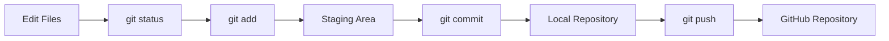
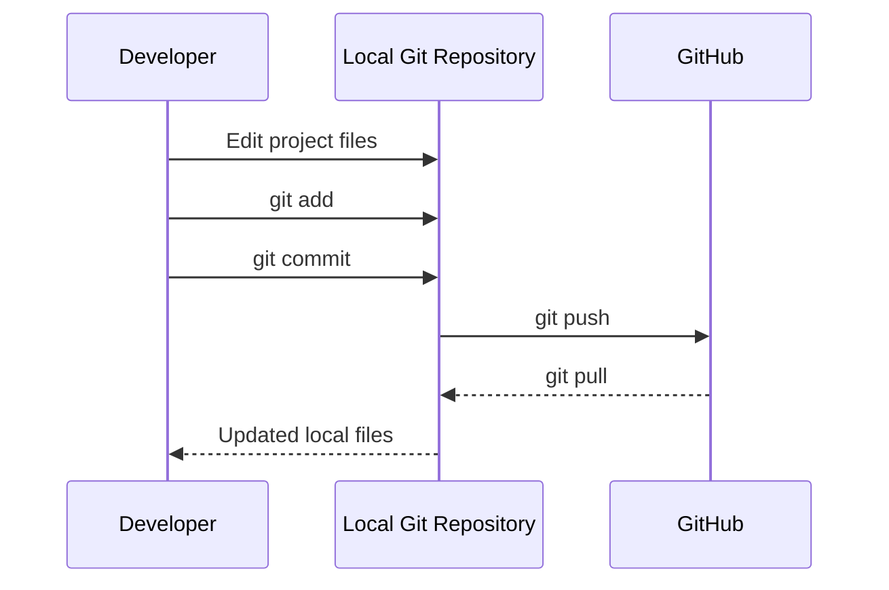
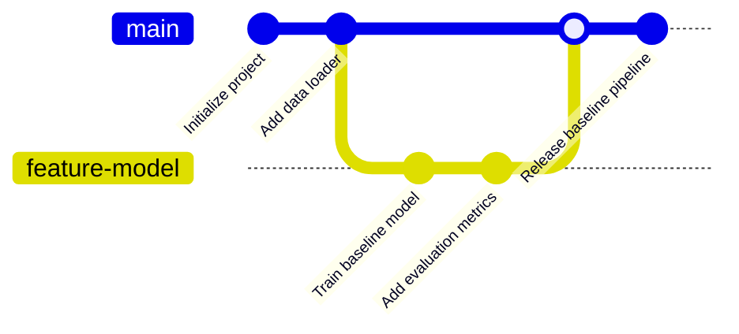
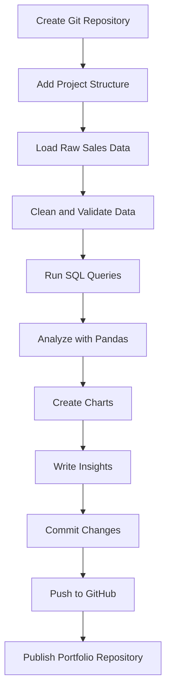

# 029 - Git / GitHub

**Course:** 02 - Coding and EDA
**Module:** Module 04 - Coding for Data Science
**Content Group:** Workflow
**Roadmap Source:** Coding for Data Science / Workflow
**Lesson Type:** Coding
**Order in Module:** 029
**Suggested Duration:** 20 minutes

---

## 1. Summary

This lesson explains **Git and GitHub** in the context of AI engineering and data science.

Git helps you record changes to source code, notebooks, configuration files, SQL queries, and documentation. GitHub provides an online platform for storing Git repositories, collaborating with teammates, reviewing code, tracking issues, and presenting portfolio projects.

After this lesson, you should understand how Git and GitHub support:

* Reproducible data analysis
* Team collaboration
* Experiment tracking
* Model and pipeline development
* Code review
* Project documentation
* Deployment workflows
* AI and data science portfolios

A well-managed Git repository makes it possible to answer important questions such as:

* Which code version produced this result?
* What changed between two experiments?
* Who modified this data pipeline?
* Can another person reproduce the analysis?
* Which model version is currently deployed?
* How can we safely test a new feature?

---

## 2. Learning Objectives

By the end of this lesson, you should be able to:

* Explain the difference between Git and GitHub.
* Create and initialize a Git repository.
* Track file changes using Git.
* Create meaningful commits.
* Create and switch between branches.
* Connect a local repository to GitHub.
* Push and pull changes.
* Resolve simple merge conflicts.
* Write a useful `.gitignore` file.
* Organize a reproducible AI or data science repository.
* Use GitHub to present a portfolio project.

---

## 3. Git and GitHub

### 3.1 What Is Git?

**Git** is a distributed version control system.

It records the history of changes made to files in a project. Each developer has a complete copy of the repository and its history on their local machine.

Git can be used without GitHub.

Common Git operations include:

* Creating a repository
* Tracking files
* Recording commits
* Creating branches
* Comparing versions
* Merging changes
* Restoring previous versions

### 3.2 What Is GitHub?

**GitHub** is an online platform that hosts Git repositories.

It adds collaboration and project-management features such as:

* Remote repository hosting
* Pull requests
* Code review
* Issues
* Project boards
* GitHub Actions
* Releases
* Repository documentation
* Access control
* Team collaboration

### 3.3 Git vs. GitHub

| Feature                   | Git                    | GitHub                        |
| ------------------------- | ---------------------- | ----------------------------- |
| Type                      | Version control system | Repository hosting platform   |
| Location                  | Local machine          | Online service                |
| Main purpose              | Track file changes     | Store, share, and collaborate |
| Internet required         | No                     | Usually yes                   |
| Branch support            | Yes                    | Yes                           |
| Pull requests             | No                     | Yes                           |
| Issues and project boards | No                     | Yes                           |
| CI/CD workflows           | No                     | Yes, through GitHub Actions   |

A simple way to remember the difference is:

> Git manages versions. GitHub manages collaboration around those versions.

---

## 4. Why Git Matters in AI and Data Science

An AI or data science project usually contains more than one notebook.

A typical project may include:

```text
raw data
    |
    v
data-cleaning scripts
    |
    v
feature engineering
    |
    v
model training
    |
    v
model evaluation
    |
    v
API or dashboard
    |
    v
deployment
```

Each stage may change over time.

Without version control, developers often create files such as:

```text
analysis.ipynb
analysis_final.ipynb
analysis_final_v2.ipynb
analysis_final_v2_fixed.ipynb
analysis_final_really_fixed.ipynb
```

Git replaces this manual versioning process with a structured change history.

### Benefits for AI and Data Science

Git helps teams:

* Record changes to preprocessing logic.
* Compare feature engineering strategies.
* Review model-training code.
* Restore a previous working version.
* Collaborate without overwriting each other's work.
* Connect code changes to experiment results.
* Document assumptions and limitations.
* Maintain deployment configurations.
* Build a credible technical portfolio.

---

## 5. Core Git Concepts

### 5.1 Repository

A **repository**, or repo, is a project directory managed by Git.

It contains:

* Project files
* Commit history
* Branch information
* Git configuration

The hidden `.git` directory stores Git's internal data.

### 5.2 Working Directory

The working directory contains the files you are currently editing.

For example:

```text
sales-analysis/
├── data/
├── notebooks/
├── src/
├── README.md
└── requirements.txt
```

### 5.3 Staging Area

The staging area contains changes that will be included in the next commit.

You add changes to the staging area with:

```bash
git add filename
```

### 5.4 Commit

A **commit** is a saved snapshot of staged changes.

Each commit contains:

* A unique identifier
* The author's information
* A timestamp
* A commit message
* A reference to the previous commit
* The recorded file changes

Example:

```bash
git commit -m "Add sales data cleaning pipeline"
```

### 5.5 Branch

A branch is an independent line of development.

Branches allow developers to test changes without directly modifying the stable version of the project.

Common branch names include:

```text
main
develop
feature/customer-segmentation
feature/model-api
fix/missing-value-bug
experiment/random-forest
```

### 5.6 Remote Repository

A remote repository is a copy of the project stored on another server, such as GitHub.

The default remote is commonly named:

```text
origin
```

---

## 6. Basic Git Workflow



The basic Git workflow is:

```text
edit files
    ->
check changes
    ->
stage selected changes
    ->
create a commit
    ->
push the commit to GitHub
```

---

## 7. Essential Git Commands

### 7.1 Check the Installed Version

```bash
git --version
```

Example output:

```text
git version 2.45.0
```

### 7.2 Configure Your Identity

Git attaches an author name and email address to each commit.

```bash
git config --global user.name "Your Name"
git config --global user.email "your-email@example.com"
```

Check the configuration:

```bash
git config --global --list
```

### 7.3 Initialize a Repository

Move into the project directory:

```bash
cd sales-analysis
```

Initialize Git:

```bash
git init
```

### 7.4 Check Repository Status

```bash
git status
```

This command shows:

* Untracked files
* Modified files
* Staged files
* Current branch
* Repository status

### 7.5 Add Files to the Staging Area

Add one file:

```bash
git add README.md
```

Add multiple files:

```bash
git add src/clean_data.py notebooks/analysis.ipynb
```

Add all current changes:

```bash
git add .
```

Use `git add .` carefully because it may stage files that should not be committed.

### 7.6 Create a Commit

```bash
git commit -m "Add initial sales analysis"
```

A good commit message should describe the purpose of the change.

Good examples:

```text
Add customer revenue aggregation query
Fix missing-value handling in sales pipeline
Document model evaluation procedure
Refactor feature engineering into reusable functions
```

Weak examples:

```text
update
fix
changes
final
new version
```

### 7.7 View Commit History

```bash
git log
```

Compact format:

```bash
git log --oneline
```

Example:

```text
4d8f120 Add monthly revenue chart
91c2f01 Clean invalid sales records
7fa903b Initialize project structure
```

### 7.8 View File Differences

Show unstaged changes:

```bash
git diff
```

Show staged changes:

```bash
git diff --staged
```

### 7.9 Create a Branch

```bash
git branch feature/sales-dashboard
```

Create and switch to the branch:

```bash
git switch -c feature/sales-dashboard
```

Older Git versions may use:

```bash
git checkout -b feature/sales-dashboard
```

### 7.10 List Branches

```bash
git branch
```

The active branch is marked with `*`.

```text
  feature/sales-dashboard
* main
```

### 7.11 Switch Branches

```bash
git switch main
```

### 7.12 Merge a Branch

First, switch to the target branch:

```bash
git switch main
```

Then merge the feature branch:

```bash
git merge feature/sales-dashboard
```

### 7.13 Connect to GitHub

Add a GitHub repository as the remote:

```bash
git remote add origin https://github.com/username/sales-analysis.git
```

Check the remote:

```bash
git remote -v
```

### 7.14 Push Changes to GitHub

For the first push:

```bash
git push -u origin main
```

For later pushes:

```bash
git push
```

### 7.15 Pull Changes from GitHub

```bash
git pull origin main
```

A pull operation usually performs:

```text
git fetch + git merge
```

### 7.16 Clone an Existing Repository

```bash
git clone https://github.com/username/sales-analysis.git
```

Then enter the project:

```bash
cd sales-analysis
```

---

## 8. Local and Remote Workflow



A common workflow is:

```bash
git pull
git switch -c feature/new-analysis
```

After making changes:

```bash
git status
git add .
git commit -m "Add customer retention analysis"
git push -u origin feature/new-analysis
```

The developer can then open a pull request on GitHub.

---

## 9. Branching Workflow

A safe team workflow separates stable code from experimental work.



### Recommended Branch Types

| Branch           | Purpose                         |
| ---------------- | ------------------------------- |
| `main`           | Stable or production-ready code |
| `develop`        | Integrated development work     |
| `feature/...`    | New feature                     |
| `fix/...`        | Bug fix                         |
| `experiment/...` | Model or analysis experiment    |
| `docs/...`       | Documentation changes           |

Example:

```bash
git switch -c experiment/xgboost-baseline
```

After completing the experiment:

```bash
git add .
git commit -m "Evaluate XGBoost baseline model"
git push -u origin experiment/xgboost-baseline
```

---

## 10. Pull Requests

A **pull request**, or PR, proposes merging changes from one branch into another.

A typical pull request contains:

* A summary of the changes
* The motivation for the changes
* Testing instructions
* Screenshots, charts, or metrics
* Known limitations
* Links to related issues

Example pull request description:

```markdown
## Summary

Add a customer churn baseline using logistic regression.

## Changes

- Add feature preprocessing pipeline
- Add train-validation split
- Add precision, recall, F1, and ROC-AUC metrics
- Add confusion matrix visualization

## Results

- Validation ROC-AUC: 0.84
- Validation F1-score: 0.71

## Limitations

The dataset is imbalanced, and no threshold optimization has been applied.
```

Pull requests are useful because they allow teammates to review:

* Code quality
* Data assumptions
* Model evaluation
* Security concerns
* Reproducibility
* Documentation

---

## 11. Merge Conflicts

A merge conflict occurs when Git cannot automatically combine changes.

For example, two developers modify the same line:

```python
TEST_SIZE = 0.20
```

One branch changes it to:

```python
TEST_SIZE = 0.25
```

Another branch changes it to:

```python
TEST_SIZE = 0.30
```

Git may display:

```text
<<<<<<< HEAD
TEST_SIZE = 0.25
=======
TEST_SIZE = 0.30
>>>>>>> experiment/new-split
```

To resolve the conflict:

1. Read both versions.
2. Decide which value is correct.
3. Remove the conflict markers.
4. Test the result.
5. Stage the resolved file.
6. Create a commit.

Example:

```python
TEST_SIZE = 0.25
```

Then run:

```bash
git add src/config.py
git commit -m "Resolve train-test split conflict"
```

Do not resolve conflicts by randomly deleting one side. Understand the purpose of both changes first.

---

## 12. Using `.gitignore`

A `.gitignore` file tells Git which files or directories should not be tracked.

AI and data science projects often produce:

* Large datasets
* Virtual environments
* Model checkpoints
* Cache files
* Temporary notebook files
* Secrets
* API keys
* Local database files

Example `.gitignore`:

```gitignore
# Python cache
__pycache__/
*.py[cod]

# Virtual environments
.venv/
venv/
env/

# Jupyter Notebook checkpoints
.ipynb_checkpoints/

# Environment variables and secrets
.env
.env.*
secrets.json

# Data files
data/raw/
data/private/
*.csv
*.parquet

# Model artifacts
models/
checkpoints/
*.pkl
*.joblib
*.pt
*.pth
*.onnx

# Logs and temporary files
logs/
*.log
tmp/
.cache/

# Operating system files
.DS_Store
Thumbs.db

# IDE settings
.vscode/
.idea/
```

Never commit sensitive information such as:

```text
API keys
database passwords
private tokens
cloud credentials
personal data
private SSH keys
```

Removing a secret from the latest commit does not necessarily remove it from the full Git history.

---

## 13. Managing Data and Model Files

Git is designed mainly for source code and text files. It is not ideal for very large datasets or model checkpoints.

Avoid committing:

```text
5 GB CSV datasets
large image collections
trained model checkpoints
database dumps
private customer records
```

Instead, consider using:

* Cloud object storage
* Dataset download scripts
* Git Large File Storage
* Data Version Control
* Model registries
* Artifact stores
* Database snapshots
* External dataset links

A repository should explain how to obtain the required data.

Example:

```markdown
## Dataset

The raw dataset is not stored in this repository.

Download it from the official source and save it as:

data/raw/sales.csv
```

---

## 14. Versioning Jupyter Notebooks

Jupyter notebooks are useful for exploration, but they can be difficult to review because notebook files contain:

* Source code
* Markdown
* Outputs
* Charts
* Execution metadata

Recommended practices include:

* Clear unnecessary outputs before committing.
* Restart the kernel and run all cells from top to bottom.
* Keep notebooks focused on analysis and communication.
* Move reusable logic into Python modules.
* Use meaningful notebook names.
* Avoid creating many manual versions.
* Document assumptions and data sources.
* Ensure execution order is correct.

Weak structure:

```text
notebook_final.ipynb
notebook_final_2.ipynb
notebook_final_fixed.ipynb
```

Better structure:

```text
notebooks/
├── 01_data_exploration.ipynb
├── 02_feature_engineering.ipynb
├── 03_model_training.ipynb
└── 04_model_evaluation.ipynb
```

Reusable code should be moved into modules:

```text
src/
├── data_loader.py
├── preprocessing.py
├── features.py
├── train.py
└── evaluate.py
```

---

## 15. Recommended Data Science Repository Structure

```text
sales-analysis/
├── data/
│   ├── raw/
│   ├── interim/
│   └── processed/
├── notebooks/
│   ├── 01_exploration.ipynb
│   └── 02_sales_report.ipynb
├── sql/
│   ├── create_tables.sql
│   └── monthly_sales.sql
├── src/
│   ├── load_data.py
│   ├── clean_data.py
│   ├── analyze.py
│   └── visualize.py
├── reports/
│   └── figures/
├── tests/
│   └── test_clean_data.py
├── .gitignore
├── README.md
├── requirements.txt
└── main.py
```

This structure separates:

* Raw data
* Processed data
* Exploration notebooks
* Reusable code
* SQL queries
* Tests
* Reports
* Documentation

---

## 16. Writing a Good README

A README should help another person understand and run the project.

A useful README usually includes:

```markdown
# Project Name

## Overview

Explain the problem and project objective.

## Dataset

Describe the data source, features, target, and limitations.

## Project Structure

Explain the important directories and files.

## Installation

Show how to create the environment and install dependencies.

## Usage

Show how to run the analysis, pipeline, notebook, or API.

## Results

Present important metrics, charts, or findings.

## Assumptions

List important assumptions and data-quality issues.

## Limitations

Explain what the project does not solve.

## Future Improvements

Describe possible next steps.
```

Example installation instructions:

```bash
git clone https://github.com/username/sales-analysis.git
cd sales-analysis
python -m venv .venv
```

Activate the environment:

```bash
# Windows
.venv\Scripts\activate
```

```bash
# macOS or Linux
source .venv/bin/activate
```

Install dependencies:

```bash
pip install -r requirements.txt
```

Run the pipeline:

```bash
python main.py
```

---

## 17. Practical Demo

### Step 1: Create the Project

```bash
mkdir sales-analysis
cd sales-analysis
```

Create the basic directories:

```bash
mkdir data notebooks src sql reports
```

Create initial files:

```bash
touch README.md requirements.txt .gitignore
```

On Windows PowerShell, you can use:

```powershell
New-Item README.md
New-Item requirements.txt
New-Item .gitignore
```

### Step 2: Initialize Git

```bash
git init
```

### Step 3: Add a README

```markdown
# Sales Analysis

A small SQL and Python project for cleaning sales data, calculating business metrics, and generating a Pandas report.
```

### Step 4: Check the Repository

```bash
git status
```

### Step 5: Create the First Commit

```bash
git add README.md .gitignore requirements.txt
git commit -m "Initialize sales analysis project"
```

### Step 6: Create a Feature Branch

```bash
git switch -c feature/data-cleaning
```

### Step 7: Add a Cleaning Script

Create `src/clean_data.py`:

```python
from pathlib import Path

import pandas as pd


def clean_sales_data(input_path: Path, output_path: Path) -> pd.DataFrame:
    """Load, clean, and save a sales dataset."""

    df = pd.read_csv(input_path)

    df.columns = (
        df.columns
        .str.strip()
        .str.lower()
        .str.replace(" ", "_")
    )

    df["order_date"] = pd.to_datetime(
        df["order_date"],
        errors="coerce",
    )

    df["quantity"] = pd.to_numeric(
        df["quantity"],
        errors="coerce",
    )

    df["unit_price"] = pd.to_numeric(
        df["unit_price"],
        errors="coerce",
    )

    df = df.dropna(
        subset=["order_date", "quantity", "unit_price"]
    )

    df = df[
        (df["quantity"] > 0)
        & (df["unit_price"] >= 0)
    ]

    df["revenue"] = df["quantity"] * df["unit_price"]

    output_path.parent.mkdir(parents=True, exist_ok=True)
    df.to_csv(output_path, index=False)

    return df


if __name__ == "__main__":
    clean_sales_data(
        input_path=Path("data/raw/sales.csv"),
        output_path=Path("data/processed/sales_clean.csv"),
    )
```

### Step 8: Review the Changes

```bash
git status
git diff
```

### Step 9: Commit the Feature

```bash
git add src/clean_data.py
git commit -m "Add reproducible sales cleaning pipeline"
```

### Step 10: Merge the Feature

```bash
git switch main
git merge feature/data-cleaning
```

### Step 11: Push to GitHub

```bash
git remote add origin https://github.com/username/sales-analysis.git
git push -u origin main
```

---

## 18. Git Workflow for an ML Experiment

Suppose you want to compare logistic regression and random forest models.

Create a separate experiment branch:

```bash
git switch -c experiment/random-forest
```

Implement the model and record the experiment configuration:

```yaml
model: random_forest
random_state: 42
n_estimators: 300
max_depth: 12
test_size: 0.2
target: churn
```

Run the experiment and document the results:

```markdown
## Random Forest Experiment

- Accuracy: 0.86
- Precision: 0.78
- Recall: 0.69
- F1-score: 0.73
- ROC-AUC: 0.88

### Observation

The random forest improved ROC-AUC but had lower interpretability than logistic regression.
```

Commit the code and documentation together:

```bash
git add src/train.py configs/random_forest.yaml reports/random_forest.md
git commit -m "Evaluate random forest churn model"
```

This creates a connection between:

```text
code version
    +
configuration
    +
evaluation results
    +
documented conclusion
```

However, Git alone is not a complete experiment-tracking system. For larger projects, it may be combined with tools such as:

* MLflow
* Weights & Biases
* DVC
* Model registries
* Cloud artifact stores

---

## 19. Common Mistakes

### 19.1 Creating Manual File Versions

Bad:

```text
analysis_final_v3_fixed.ipynb
```

Better:

```text
analysis.ipynb
```

Use Git commits to record versions.

### 19.2 Writing Unclear Commit Messages

Bad:

```bash
git commit -m "update"
```

Better:

```bash
git commit -m "Fix duplicate customer records before aggregation"
```

### 19.3 Committing Secrets

Bad:

```python
API_KEY = "private-api-key"
```

Better:

```python
import os

API_KEY = os.environ["API_KEY"]
```

Store the real value in a local `.env` file and exclude it with `.gitignore`.

### 19.4 Committing Large Data Files

Large datasets and model artifacts can make a repository slow and difficult to clone.

Store them separately and document how to obtain them.

### 19.5 Committing Broken Notebooks

A notebook may appear correct even though the cells were executed in the wrong order.

Before committing:

```text
restart kernel
    ->
run all cells
    ->
verify outputs
    ->
save notebook
    ->
commit
```

### 19.6 Making Very Large Commits

A large commit that mixes data cleaning, model training, documentation, and deployment changes is difficult to review.

Prefer smaller, focused commits.

### 19.7 Working Directly on `main`

Direct changes to `main` can introduce unstable code.

Use a branch:

```bash
git switch -c feature/new-metric
```

### 19.8 Pulling Without Checking Local Changes

Before pulling:

```bash
git status
```

Commit or temporarily store unfinished work before integrating remote changes.

---

## 20. Practical Exercise

Create a GitHub repository for a small SQL and Python sales-analysis project.

### Requirements

1. Select a small CSV dataset.
2. Create a structured project repository.
3. Add a `.gitignore` file.
4. Write a README.
5. Create a notebook for exploratory analysis.
6. Create a Python script for data cleaning.
7. Add at least one SQL query.
8. Create three data insights.
9. Include at least one chart or summary table.
10. Use a feature branch for the analysis.
11. Create at least three meaningful commits.
12. Push the repository to GitHub.

### Suggested Commit History

```text
Initialize project structure and documentation
Add reproducible sales cleaning pipeline
Add monthly revenue analysis and visualizations
```

### Suggested Insights

Examples include:

* Monthly revenue trend
* Best-selling product category
* Revenue by region
* Average order value
* Repeat customer rate
* Products with declining sales
* Highest-value customers

---

## 21. Portfolio Artifact

A strong GitHub portfolio repository should demonstrate both technical and communication skills.

Include:

* A clear project objective
* A reproducible project structure
* Clean code
* Meaningful commit history
* SQL and Python usage
* Data-quality checks
* Charts with written interpretations
* Assumptions and limitations
* Setup instructions
* Example outputs
* Business or research recommendations

A portfolio project should answer:

```text
What problem was solved?
What data was used?
How was the data cleaned?
What methods were applied?
What results were produced?
What limitations remain?
How can another person reproduce the work?
```

---

## 22. Completion Checklist

* [ ] I can explain the difference between Git and GitHub.
* [ ] I can initialize a Git repository.
* [ ] I can use `git status`, `git add`, and `git commit`.
* [ ] I can create and switch branches.
* [ ] I can merge a feature branch.
* [ ] I can connect a local repository to GitHub.
* [ ] I can push and pull changes.
* [ ] I understand the purpose of a pull request.
* [ ] I can resolve a simple merge conflict.
* [ ] I have created a useful `.gitignore` file.
* [ ] I know why secrets should never be committed.
* [ ] I understand why large datasets should not normally be stored directly in Git.
* [ ] I have written instructions for reproducing my analysis.
* [ ] I have recorded at least one assumption, caveat, or open question.
* [ ] I have published a notebook, query, chart, model, API, or project note on GitHub.

---

## 23. Related Outcome

Use Python, SQL, data libraries, notebooks, and Git to build reproducible data workflows.

Git and GitHub provide the versioning and collaboration layer that connects:

```text
dataset
    ->
SQL queries
    ->
Python pipeline
    ->
notebook
    ->
model experiment
    ->
report
    ->
API
    ->
deployment
```

---

## 24. Related Project

### Mini Project: SQL and Python Sales Analysis

Build a small sales-analysis project using:

* A CSV file or SQLite database
* SQL queries
* Pandas
* Matplotlib
* A Jupyter Notebook
* Reusable Python scripts
* Git
* GitHub

Suggested workflow:



Suggested deliverables:

```text
README.md
requirements.txt
.gitignore
data-cleaning script
SQL queries
analysis notebook
three insights
one or more charts
assumptions and limitations
reproducibility instructions
```

---

## 25. Summary

**Git** is a version control system that records changes to project files.

**GitHub** is a platform for hosting Git repositories and supporting collaboration through branches, pull requests, issues, reviews, releases, and automation.

In AI and data science, Git and GitHub help transform an isolated notebook into a reproducible project containing:

* Versioned source code
* Documented experiments
* Reusable pipelines
* Reviewable SQL queries
* Model configurations
* Evaluation reports
* APIs and deployment files
* Portfolio-ready documentation

The essential workflow is:

```text
edit
    ->
review
    ->
stage
    ->
commit
    ->
branch
    ->
push
    ->
pull request
    ->
review
    ->
merge
```

Do not use Git only as an online storage folder. Use it to create a meaningful history of how your data product, experiment, or analysis evolved.
