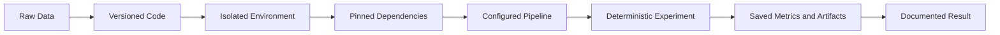

# 031 - Reproducible Environment

**Course:** 02 - Coding and EDA
**Module:** Module 04 - Coding for Data Science
**Content Group:** Workflow
**Roadmap Source:** Coding for Data Science / Workflow
**Lesson Type:** Coding
**Order in Module:** 031
**Suggested Duration:** 20 minutes

---

## 1. Summary

A **reproducible environment** is a computing setup that allows another person—or your future self—to run the same code with the same dependencies, configuration, and data assumptions.

In AI and Data Science, code may behave differently across computers because of differences in:

* Python versions
* Library versions
* Operating systems
* Environment variables
* File paths
* Random seeds
* Hardware
* External services
* Dataset versions

A reproducible environment reduces these differences by explicitly recording and controlling the software and configuration required by a project.

A typical reproducible project includes:

* A virtual environment
* A dependency file
* A clear directory structure
* Version-controlled source code
* Configuration files
* Data documentation
* Random seed management
* Instructions in a `README.md`
* Optional containerization with Docker

The main goal is simple:

> A project should run consistently without depending on undocumented settings from the original developer's computer.

---

## 2. Learning Objectives

After completing this lesson, you should be able to:

* Explain what a reproducible environment is.
* Describe why reproducibility matters in AI and Data Science.
* Create and activate a Python virtual environment.
* Record project dependencies in a dependency file.
* Install the same dependencies on another machine.
* Distinguish between `requirements.txt`, `environment.yml`, and `pyproject.toml`.
* Organize a small data project using a reproducible folder structure.
* Control random behavior using random seeds.
* Document the steps required to run an analysis.
* Identify common sources of non-reproducible results.

---

## 3. Why Reproducibility Matters

A data analysis is not fully useful when it only works on one computer.

Consider the following situation:

1. A Data Scientist trains a model on a laptop.
2. The model achieves an accuracy of 92%.
3. Another team member downloads the project.
4. The code fails because a required library is missing.
5. After installing the latest library version, the model produces different results.
6. The deployment server uses another Python version and fails again.

The problem is not necessarily the model code. The problem may be the environment around the code.

A reproducible environment helps answer questions such as:

* Which Python version was used?
* Which package versions were installed?
* Which dataset version was analyzed?
* Which commands should be executed?
* Which configuration values are required?
* Which random seed produced the experiment?
* Can the project run outside the original developer's machine?

---

## 4. Core Concept

A reproducible result depends on more than source code.

```text
Reproducible Result
        |
        +-- Source code
        +-- Dependency versions
        +-- Runtime version
        +-- Data version
        +-- Configuration
        +-- Random seeds
        +-- Execution instructions
        +-- Hardware assumptions
```

A useful way to describe reproducibility is:

```text
Reproducibility =
    Code
    + Environment
    + Data
    + Configuration
    + Execution Process
```

If one of these components is missing, reproducing the result becomes more difficult.

---

## 5. Reproducible Workflow



A practical workflow may look like this:

```text
raw data
   |
   v
create virtual environment
   |
   v
install pinned dependencies
   |
   v
run cleaning script
   |
   v
generate analysis table
   |
   v
train model or create charts
   |
   v
save metrics and artifacts
   |
   v
document how to reproduce the result
```

---

## 6. Virtual Environments

A **virtual environment** is an isolated Python installation for a specific project.

Without a virtual environment, packages are often installed globally. Different projects may then require conflicting versions of the same package.

For example:

```text
Project A requires pandas 1.x
Project B requires pandas 2.x
```

Installing both projects into the same global environment may create conflicts.

A virtual environment gives each project its own package space.

```text
Computer
├── Project A
│   └── Environment A
│       ├── Python
│       ├── pandas 1.x
│       └── scikit-learn
│
└── Project B
    └── Environment B
        ├── Python
        ├── pandas 2.x
        └── PyTorch
```

---

## 7. Creating a Python Virtual Environment

### 7.1 Create the environment

Run the following command inside the project directory:

```bash
python -m venv .venv
```

This creates a directory named `.venv`.

### 7.2 Activate the environment on Windows

Using Command Prompt:

```bash
.venv\Scripts\activate
```

Using PowerShell:

```powershell
.venv\Scripts\Activate.ps1
```

### 7.3 Activate the environment on macOS or Linux

```bash
source .venv/bin/activate
```

### 7.4 Confirm the active Python executable

On Windows:

```bash
where python
```

On macOS or Linux:

```bash
which python
```

The displayed path should point to the `.venv` directory.

### 7.5 Deactivate the environment

```bash
deactivate
```

---

## 8. Installing Dependencies

After activating the environment, install the packages required by the project.

```bash
python -m pip install pandas matplotlib scikit-learn jupyter
```

Using `python -m pip` is generally safer than calling `pip` directly because it connects the package installer to the currently active Python interpreter.

Check installed packages:

```bash
python -m pip list
```

Check a specific package:

```bash
python -m pip show pandas
```

---

## 9. Recording Dependencies with `requirements.txt`

A `requirements.txt` file records the Python packages required by a project.

Create it from the current environment:

```bash
python -m pip freeze > requirements.txt
```

Example:

```text
jupyter==1.1.1
matplotlib==3.10.3
numpy==2.2.6
pandas==2.2.3
scikit-learn==1.6.1
```

Install the recorded dependencies on another machine:

```bash
python -m pip install -r requirements.txt
```

### Why pin versions?

The following dependency is not pinned:

```text
pandas
```

It allows the package manager to install a newer version in the future.

The following dependency is pinned:

```text
pandas==2.2.3
```

It requests a specific version, making the environment more predictable.

---

## 10. Dependency Specification Options

Different tools can be used to describe a Python environment.

| File                         | Common Tool                      | Typical Use                                        |
| ---------------------------- | -------------------------------- | -------------------------------------------------- |
| `requirements.txt`           | `pip`                            | Simple Python projects                             |
| `environment.yml`            | Conda                            | Python and non-Python dependencies                 |
| `pyproject.toml`             | Poetry, Hatch, PDM, modern `pip` | Packaged or structured Python projects             |
| `uv.lock`                    | `uv`                             | Fast dependency resolution and locked environments |
| `Pipfile` and `Pipfile.lock` | Pipenv                           | Application dependency management                  |

For a small Data Science project, `requirements.txt` is often sufficient.

For a project that requires system-level libraries, CUDA versions, or non-Python packages, Conda or Docker may be more appropriate.

---

## 11. Using Conda

Conda can manage Python versions and packages that are not distributed only through Python Package Index.

Create an environment:

```bash
conda create --name sales-analysis python=3.12
```

Activate it:

```bash
conda activate sales-analysis
```

Install packages:

```bash
conda install pandas matplotlib scikit-learn jupyter
```

Export the environment:

```bash
conda env export > environment.yml
```

Create the environment on another machine:

```bash
conda env create -f environment.yml
```

Example `environment.yml`:

```yaml
name: sales-analysis

dependencies:
  - python=3.12
  - pandas
  - matplotlib
  - scikit-learn
  - jupyter
```

---

## 12. Recommended Project Structure

A consistent directory structure makes a project easier to understand and reproduce.

```text
sales-analysis/
├── data/
│   ├── raw/
│   │   └── sales.csv
│   └── processed/
│       └── cleaned_sales.csv
│
├── notebooks/
│   └── 01_sales_analysis.ipynb
│
├── src/
│   ├── __init__.py
│   ├── clean_data.py
│   └── analyze_sales.py
│
├── reports/
│   ├── figures/
│   └── sales_summary.md
│
├── tests/
│   └── test_clean_data.py
│
├── .env.example
├── .gitignore
├── requirements.txt
├── README.md
└── run_pipeline.py
```

### Directory responsibilities

| Directory or File  | Purpose                              |
| ------------------ | ------------------------------------ |
| `data/raw/`        | Original, unchanged data             |
| `data/processed/`  | Cleaned or transformed data          |
| `notebooks/`       | Exploration and presentation         |
| `src/`             | Reusable Python modules              |
| `reports/`         | Charts, tables, and written findings |
| `tests/`           | Automated tests                      |
| `.env.example`     | Required environment-variable names  |
| `requirements.txt` | Python dependencies                  |
| `README.md`        | Setup and execution instructions     |
| `run_pipeline.py`  | Main pipeline entry point            |

---

## 13. Separate Raw and Processed Data

Raw data should normally remain unchanged.

```text
data/raw/sales.csv
```

The cleaning process should create a new file:

```text
data/processed/cleaned_sales.csv
```

This approach provides traceability:

```text
Raw Data
   |
   v
Cleaning Script
   |
   v
Processed Data
   |
   v
Analysis or Model
```

Avoid manually editing the source CSV in a spreadsheet application because those changes may not be recorded or repeatable.

Instead, express cleaning steps as code:

```python
import pandas as pd


def clean_sales_data(input_path: str, output_path: str) -> pd.DataFrame:
    """Load, clean, save, and return a sales dataset."""
    df = pd.read_csv(input_path)

    df.columns = df.columns.str.strip().str.lower()
    df = df.drop_duplicates()

    df["order_date"] = pd.to_datetime(
        df["order_date"],
        errors="coerce",
    )

    df["revenue"] = (
        pd.to_numeric(df["quantity"], errors="coerce")
        * pd.to_numeric(df["unit_price"], errors="coerce")
    )

    df = df.dropna(
        subset=["order_date", "quantity", "unit_price", "revenue"]
    )

    df.to_csv(output_path, index=False)

    return df
```

---

## 14. Configuration Management

Values that may change between environments should not be scattered throughout the code.

Bad example:

```python
data_path = "C:/Users/Khanh/Desktop/project/data/sales.csv"
```

This path may only work on one computer.

A better solution is to use project-relative paths:

```python
from pathlib import Path


PROJECT_ROOT = Path(__file__).resolve().parent
DATA_PATH = PROJECT_ROOT / "data" / "raw" / "sales.csv"
```

For configurable values, use environment variables.

Example `.env` file:

```text
DATA_PATH=data/raw/sales.csv
MODEL_PATH=models/sales_model.joblib
RANDOM_SEED=42
```

Example Python code:

```python
import os

from dotenv import load_dotenv


load_dotenv()

data_path = os.getenv("DATA_PATH", "data/raw/sales.csv")
random_seed = int(os.getenv("RANDOM_SEED", "42"))
```

Do not commit secrets such as passwords, private keys, or API tokens.

Use a `.env.example` file instead:

```text
DATABASE_URL=
OPENAI_API_KEY=
RANDOM_SEED=42
```

---

## 15. Controlling Randomness

Many Data Science operations contain randomness, including:

* Train-test splitting
* Weight initialization
* Data shuffling
* Sampling
* Hyperparameter search
* Neural-network training

Without a fixed seed, results may change between runs.

### NumPy seed

```python
import numpy as np


RANDOM_SEED = 42
np.random.seed(RANDOM_SEED)
```

### Python seed

```python
import random


RANDOM_SEED = 42
random.seed(RANDOM_SEED)
```

### Scikit-learn seed

```python
from sklearn.model_selection import train_test_split


X_train, X_test, y_train, y_test = train_test_split(
    X,
    y,
    test_size=0.2,
    random_state=42,
)
```

### PyTorch seed

```python
import random

import numpy as np
import torch


RANDOM_SEED = 42

random.seed(RANDOM_SEED)
np.random.seed(RANDOM_SEED)
torch.manual_seed(RANDOM_SEED)

if torch.cuda.is_available():
    torch.cuda.manual_seed_all(RANDOM_SEED)
```

A fixed seed improves repeatability, but it does not always guarantee identical results across different hardware, operating systems, or library versions.

---

## 16. From Notebook to Reproducible Pipeline

Notebooks are useful for exploration, but they may become difficult to reproduce when cells are executed in an inconsistent order.

An unreliable notebook may have this execution pattern:

```text
Cell 1 -> Cell 5 -> Cell 3 -> Cell 8
```

The final output may depend on variables created by an earlier manual execution.

A more reliable notebook should run from top to bottom:

```text
Imports
   |
   v
Configuration
   |
   v
Data Loading
   |
   v
Validation
   |
   v
Cleaning
   |
   v
Analysis
   |
   v
Visualization
   |
   v
Conclusion
```

Reusable logic should be moved into functions or modules.

Instead of keeping all cleaning logic in a notebook:

```python
df = pd.read_csv("../data/raw/sales.csv")
df = df.drop_duplicates()
df["revenue"] = df["quantity"] * df["unit_price"]
```

Move it into a source module:

```python
from src.clean_data import clean_sales_data


df = clean_sales_data(
    input_path="data/raw/sales.csv",
    output_path="data/processed/cleaned_sales.csv",
)
```

This function can then be reused by:

* A notebook
* A command-line script
* An API
* A scheduled pipeline
* An automated test
* A deployment service

---

## 17. Reproducible Pipeline Example

Create a file named `run_pipeline.py`:

```python
from pathlib import Path

import pandas as pd


PROJECT_ROOT = Path(__file__).resolve().parent
RAW_DATA_PATH = PROJECT_ROOT / "data" / "raw" / "sales.csv"
PROCESSED_DATA_PATH = (
    PROJECT_ROOT / "data" / "processed" / "cleaned_sales.csv"
)
REPORT_PATH = PROJECT_ROOT / "reports" / "sales_summary.csv"


def load_data(path: Path) -> pd.DataFrame:
    """Load the raw sales dataset."""
    if not path.exists():
        raise FileNotFoundError(f"Dataset not found: {path}")

    return pd.read_csv(path)


def clean_data(df: pd.DataFrame) -> pd.DataFrame:
    """Clean and validate the sales dataset."""
    required_columns = {
        "order_date",
        "product",
        "quantity",
        "unit_price",
    }

    missing_columns = required_columns.difference(df.columns)

    if missing_columns:
        raise ValueError(
            f"Missing required columns: {sorted(missing_columns)}"
        )

    cleaned = df.copy()
    cleaned = cleaned.drop_duplicates()

    cleaned["order_date"] = pd.to_datetime(
        cleaned["order_date"],
        errors="coerce",
    )

    cleaned["quantity"] = pd.to_numeric(
        cleaned["quantity"],
        errors="coerce",
    )

    cleaned["unit_price"] = pd.to_numeric(
        cleaned["unit_price"],
        errors="coerce",
    )

    cleaned = cleaned.dropna(
        subset=["order_date", "product", "quantity", "unit_price"]
    )

    cleaned = cleaned[
        (cleaned["quantity"] > 0)
        & (cleaned["unit_price"] >= 0)
    ]

    cleaned["revenue"] = (
        cleaned["quantity"] * cleaned["unit_price"]
    )

    return cleaned


def create_summary(df: pd.DataFrame) -> pd.DataFrame:
    """Create a revenue summary by product."""
    return (
        df.groupby("product", as_index=False)
        .agg(
            total_quantity=("quantity", "sum"),
            total_revenue=("revenue", "sum"),
            order_count=("product", "size"),
        )
        .sort_values("total_revenue", ascending=False)
    )


def save_dataframe(df: pd.DataFrame, path: Path) -> None:
    """Save a DataFrame and create the parent directory when required."""
    path.parent.mkdir(parents=True, exist_ok=True)
    df.to_csv(path, index=False)


def main() -> None:
    """Run the complete data pipeline."""
    raw_df = load_data(RAW_DATA_PATH)
    cleaned_df = clean_data(raw_df)
    summary_df = create_summary(cleaned_df)

    save_dataframe(cleaned_df, PROCESSED_DATA_PATH)
    save_dataframe(summary_df, REPORT_PATH)

    print("Pipeline completed successfully.")
    print(f"Raw rows: {len(raw_df)}")
    print(f"Cleaned rows: {len(cleaned_df)}")
    print(f"Processed data: {PROCESSED_DATA_PATH}")
    print(f"Summary report: {REPORT_PATH}")


if __name__ == "__main__":
    main()
```

Run the pipeline:

```bash
python run_pipeline.py
```

The same command should generate the same output structure each time, assuming the inputs and environment remain unchanged.

---

## 18. Writing a Reproducible README

A `README.md` should explain how another person can set up and run the project.

Example:

````markdown
# Sales Analysis

This project cleans a sales dataset and produces a product-level revenue report.

## Requirements

- Python 3.12
- Git

## Setup

Create a virtual environment:

```bash
python -m venv .venv
```

Activate it on Windows:

```bash
.venv\Scripts\activate
```

Activate it on macOS or Linux:

```bash
source .venv/bin/activate
```

Install dependencies:

```bash
python -m pip install -r requirements.txt
```

## Run the Pipeline

```bash
python run_pipeline.py
```

## Run the Notebook

```bash
jupyter notebook notebooks/01_sales_analysis.ipynb
```

## Outputs

The pipeline generates:

- `data/processed/cleaned_sales.csv`
- `reports/sales_summary.csv`

## Assumptions

- Quantity must be greater than zero.
- Unit price cannot be negative.
- Rows with invalid dates are removed.
````

A useful README should describe:

* What the project does
* Required software
* Environment setup
* Installation commands
* Input data
* Execution commands
* Expected outputs
* Assumptions
* Known limitations

---

## 19. Git and Environment Files

Source code and environment definitions should be version-controlled with Git.

Files commonly committed:

```text
README.md
requirements.txt
environment.yml
pyproject.toml
src/
notebooks/
tests/
.env.example
```

Files commonly excluded:

```text
.venv/
__pycache__/
.env
.ipynb_checkpoints/
*.pyc
```

Example `.gitignore`:

```gitignore
# Virtual environment
.venv/
venv/

# Python cache
__pycache__/
*.py[cod]

# Jupyter
.ipynb_checkpoints/

# Local secrets
.env

# Test and tool cache
.pytest_cache/
.mypy_cache/

# Operating-system files
.DS_Store
Thumbs.db
```

Large datasets and trained models may also need to be excluded from ordinary Git history.

They can instead be managed using:

* Cloud object storage
* Dataset registries
* Model registries
* Git Large File Storage
* Data Version Control
* Artifact storage systems

---

## 20. Docker for Stronger Reproducibility

A virtual environment isolates Python packages, but it does not fully control:

* Operating-system libraries
* System commands
* Runtime configuration
* Base image dependencies

Docker packages the application and its runtime environment into a container image.

Example `Dockerfile`:

```dockerfile
FROM python:3.12-slim

WORKDIR /app

COPY requirements.txt .

RUN python -m pip install \
    --no-cache-dir \
    -r requirements.txt

COPY . .

CMD ["python", "run_pipeline.py"]
```

Build the image:

```bash
docker build -t sales-analysis .
```

Run the container:

```bash
docker run --rm sales-analysis
```

Mount a local data directory:

```bash
docker run \
  --rm \
  -v "$(pwd)/data:/app/data" \
  sales-analysis
```

Docker is especially useful when:

* Deploying a model API
* Running code in CI/CD
* Sharing projects across operating systems
* Requiring system-level dependencies
* Reproducing production environments

---

## 21. Levels of Reproducibility

Reproducibility can be considered at several levels.

| Level                      | Controlled Elements                      | Example                              |
| -------------------------- | ---------------------------------------- | ------------------------------------ |
| Code reproducibility       | Source code and execution order          | Git repository                       |
| Package reproducibility    | Library versions                         | `requirements.txt`                   |
| Runtime reproducibility    | Python and system environment            | Conda or Docker                      |
| Data reproducibility       | Dataset version and transformations      | Raw-data archive and cleaning script |
| Experiment reproducibility | Seeds, parameters, metrics               | Experiment configuration             |
| Deployment reproducibility | Infrastructure and service configuration | Docker and CI/CD                     |

A project does not need every tool from the beginning. Start with the level appropriate for the project.

For a small learning project, a strong minimum is:

```text
Git
+ virtual environment
+ pinned dependencies
+ fixed random seed
+ documented data source
+ reproducible scripts
+ README instructions
```

---

## 22. Reproducible Experiments

Machine-learning experiments should record more than the final metric.

A useful experiment record includes:

```yaml
experiment_name: random_forest_baseline
dataset_version: sales-v1
python_version: "3.12"
random_seed: 42

model:
  name: RandomForestClassifier
  n_estimators: 200
  max_depth: 12

training:
  test_size: 0.2

metrics:
  accuracy: 0.91
  precision: 0.89
  recall: 0.87
```

The result should be connected to:

* The code version
* The dataset version
* The dependency environment
* The configuration
* The generated artifacts

```text
Git Commit
    +
Dataset Version
    +
Environment Version
    +
Experiment Configuration
    =
Traceable Experiment
```

---

## 23. Data Validation

A reproducible pipeline should fail clearly when the input data does not satisfy expected conditions.

Example:

```python
import pandas as pd


def validate_sales_data(df: pd.DataFrame) -> None:
    required_columns = {
        "order_date",
        "product",
        "quantity",
        "unit_price",
    }

    missing_columns = required_columns - set(df.columns)

    if missing_columns:
        raise ValueError(
            f"Missing required columns: {sorted(missing_columns)}"
        )

    if df.empty:
        raise ValueError("The input dataset is empty.")

    if (df["quantity"] <= 0).any():
        raise ValueError(
            "The quantity column contains non-positive values."
        )

    if (df["unit_price"] < 0).any():
        raise ValueError(
            "The unit_price column contains negative values."
        )
```

Validation prevents the pipeline from silently producing misleading results from unexpected input data.

---

## 24. Practical Demo: Small Sales Analysis

Assume the following CSV file:

```csv
order_date,product,quantity,unit_price
2026-01-05,Laptop,2,1200
2026-01-06,Mouse,10,25
2026-01-07,Keyboard,5,80
2026-01-08,Laptop,1,1200
2026-01-09,Mouse,8,25
```

Create a script named `sales_report.py`:

```python
from pathlib import Path

import pandas as pd


INPUT_PATH = Path("data/raw/sales.csv")
OUTPUT_PATH = Path("reports/product_revenue.csv")


def build_sales_report(
    input_path: Path,
    output_path: Path,
) -> pd.DataFrame:
    """Create and save a revenue report by product."""
    df = pd.read_csv(input_path)

    df["revenue"] = (
        df["quantity"] * df["unit_price"]
    )

    report = (
        df.groupby("product", as_index=False)
        .agg(
            total_quantity=("quantity", "sum"),
            total_revenue=("revenue", "sum"),
        )
        .sort_values("total_revenue", ascending=False)
    )

    output_path.parent.mkdir(
        parents=True,
        exist_ok=True,
    )

    report.to_csv(output_path, index=False)

    return report


def main() -> None:
    report = build_sales_report(
        input_path=INPUT_PATH,
        output_path=OUTPUT_PATH,
    )

    print(report.to_string(index=False))


if __name__ == "__main__":
    main()
```

Run it:

```bash
python sales_report.py
```

Expected output:

```text
 product  total_quantity  total_revenue
  Laptop               3           3600
   Mouse              18            450
Keyboard               5            400
```

The analysis can be reproduced because:

* The input file path is defined.
* The transformation is written as code.
* The output path is defined.
* Dependencies can be recorded.
* The script has a clear entry point.
* The same commands can be documented in a README.

---

## 25. Common Mistakes

### 25.1 Installing packages globally

Problem:

```bash
pip install pandas
```

The package may be installed into an unintended Python environment.

Better:

```bash
python -m venv .venv
source .venv/bin/activate
python -m pip install pandas
```

---

### 25.2 Not recording dependency versions

Problem:

```text
pandas
numpy
scikit-learn
```

A future installation may use incompatible package versions.

Better:

```text
pandas==2.2.3
numpy==2.2.6
scikit-learn==1.6.1
```

---

### 25.3 Committing the virtual environment

Problem:

```text
git add .venv/
```

A virtual environment may contain thousands of large, platform-specific files.

Better:

```gitignore
.venv/
```

Commit the dependency definition instead:

```text
requirements.txt
```

---

### 25.4 Using absolute local paths

Problem:

```python
path = "C:/Users/Khanh/Desktop/sales.csv"
```

Better:

```python
from pathlib import Path


path = Path("data/raw/sales.csv")
```

---

### 25.5 Manually modifying the raw dataset

Manual edits cannot be reliably reviewed or repeated.

Better:

```text
raw dataset
    |
    v
cleaning script
    |
    v
processed dataset
```

---

### 25.6 Relying on notebook execution history

A notebook may work only because cells were executed in a particular manual order.

Better practice:

1. Restart the kernel.
2. Clear outputs when appropriate.
3. Run all cells from top to bottom.
4. Move reusable logic into Python modules.
5. Verify that the notebook completes without manual intervention.

---

### 25.7 Ignoring random seeds

Problem:

```python
train_test_split(X, y, test_size=0.2)
```

Better:

```python
train_test_split(
    X,
    y,
    test_size=0.2,
    random_state=42,
)
```

---

### 25.8 Storing secrets in source code

Problem:

```python
API_KEY = "secret-value"
```

Better:

```python
import os


API_KEY = os.getenv("API_KEY")
```

Store only the variable name in `.env.example`.

---

### 25.9 Saving only charts without data or interpretation

A chart alone may not explain:

* Which data created it
* Which transformation was used
* Which metric was calculated
* Which assumptions were applied
* Which recommendation follows from the result

Every visualization should be connected to reproducible code and a written insight.

---

## 26. Practical Exercise

Create a reproducible analysis project using a small CSV dataset.

### Required tasks

1. Create the project structure:

```text
reproducible-analysis/
├── data/
│   ├── raw/
│   └── processed/
├── notebooks/
├── src/
├── reports/
├── .gitignore
├── README.md
└── requirements.txt
```

2. Create and activate a virtual environment.

3. Install:

```text
pandas
matplotlib
jupyter
```

4. Save the dependency versions.

5. Place the original CSV file in `data/raw/`.

6. Write a cleaning function that:

   * Removes duplicate rows
   * Converts data types
   * Handles missing values
   * Creates at least one derived column

7. Save the cleaned dataset in `data/processed/`.

8. Create three insights using:

   * A summary table
   * A chart
   * A written interpretation

9. Add at least one validation check.

10. Write a `README.md` explaining how to run the project.

11. Restart the environment and verify that the project works using only the documented commands.

---

## 27. Suggested Analysis Questions

For a sales dataset, answer questions such as:

* Which product generated the highest revenue?
* Which month had the most orders?
* What was the average order value?
* Which category had the highest sales growth?
* Are there missing, invalid, or duplicate records?

For each question, include:

```text
Question
   |
   v
Transformation
   |
   v
Metric or Chart
   |
   v
Insight
   |
   v
Recommendation
```

Example:

```text
Question:
Which product generated the highest revenue?

Metric:
Revenue = Quantity × Unit Price

Insight:
Laptop sales generated the highest total revenue.

Recommendation:
Prioritize laptop inventory and examine whether the result is driven
by high demand, high unit price, or both.
```

---

## 28. Completion Checklist

* [ ] I can explain a reproducible environment in one or two minutes.
* [ ] I can create and activate a Python virtual environment.
* [ ] I can install project dependencies inside the environment.
* [ ] I can export dependency versions to `requirements.txt`.
* [ ] I can rebuild an environment from a dependency file.
* [ ] I separate raw data from processed data.
* [ ] I avoid machine-specific absolute paths.
* [ ] I control random operations with explicit seeds.
* [ ] I store reusable logic in functions or Python modules.
* [ ] I can run my notebook from top to bottom without manual fixes.
* [ ] I have documented the setup and execution commands.
* [ ] I have recorded at least one assumption or limitation.
* [ ] Another person can run the project using only the repository instructions.

---

## 29. Related Outcome

Use Python, SQL, data libraries, notebooks, and Git to build reproducible data workflows.

A successful workflow should make it possible to move from:

```text
Exploratory Notebook
        |
        v
Reusable Python Functions
        |
        v
Data Pipeline
        |
        v
Automated Experiment
        |
        v
API or Deployment Service
```

---

## 30. Related Project

### Mini Project: SQL and Python Sales Analysis

Build a small sales-analysis project containing:

* A SQLite or PostgreSQL sales database
* SQL queries for extracting sales data
* Pandas for cleaning and aggregation
* Matplotlib for visualizations
* A reproducible Python environment
* A version-controlled Git repository
* A dependency file
* A documented execution process
* A final Markdown or HTML report

Suggested workflow:

```text
Sales Database
      |
      v
SQL Query
      |
      v
Pandas DataFrame
      |
      v
Data Validation
      |
      v
Cleaning and Transformation
      |
      v
Metrics and Charts
      |
      v
Business Insights
      |
      v
Reproducible Report
```

Suggested portfolio artifacts:

```text
sales-analysis/
├── sql/
│   └── sales_summary.sql
├── src/
│   ├── database.py
│   ├── clean_data.py
│   └── generate_report.py
├── notebooks/
│   └── sales_eda.ipynb
├── reports/
│   ├── figures/
│   └── final_report.md
├── requirements.txt
├── Dockerfile
└── README.md
```

---

## 31. Key Takeaways

* Reproducibility requires more than saving a notebook.
* A virtual environment isolates project dependencies.
* Dependency versions should be recorded explicitly.
* Raw data should remain unchanged.
* Data-cleaning operations should be written as code.
* Random seeds should be controlled where possible.
* Configuration should be separated from business logic.
* Secrets should not be stored in source code.
* Notebooks should run from top to bottom.
* Reusable logic should be moved into scripts and functions.
* A README should explain exactly how to rebuild and run the project.
* Docker provides stronger environment isolation when system dependencies matter.

---

## 32. Final Summary

A **reproducible environment** is the foundation of a reliable AI and Data Science workflow.

It ensures that code, dependencies, configuration, data transformations, experiments, and outputs can be reconstructed in a consistent way.

A practical minimum setup includes:

```text
Virtual Environment
        +
Pinned Dependencies
        +
Version-Controlled Code
        +
Documented Data
        +
Fixed Random Seeds
        +
Clear README
        =
Reproducible Data Project
```

Do not let an analysis exist only as a collection of manually executed notebook cells. Transform it into a structured and documented project that another person can install, run, verify, and extend.

---

# Bài luyện tập

## Mục tiêu


## Đề bài


## Yêu cầu hoàn thành

- [ ] 
- [ ] 
- [ ] 

## Kết quả / lời giải


## Ghi chú
