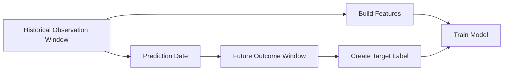
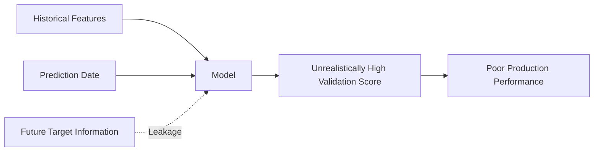
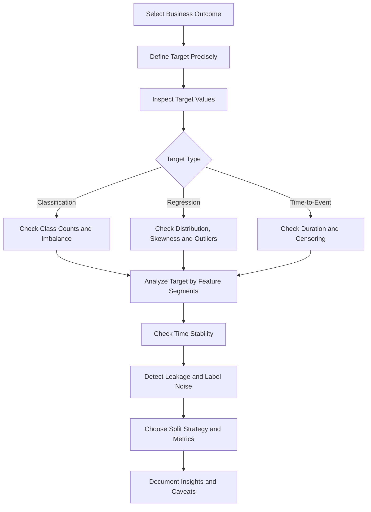
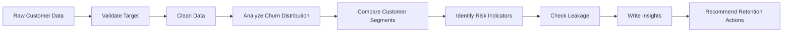

# 004 - Target Variable

**Course:** 02 - Coding and EDA
**Module:** Module 05 - Exploratory Data Analysis
**Content Group:** Data Understanding
**Roadmap Source:** Exploratory Data Analysis / Data Understanding
**Lesson Type:** Exploratory Data Analysis
**Order in Module:** 004
**Suggested Duration:** 20 minutes

---

## 1. Summary

This lesson explains the **Target Variable** in the context of AI and Data Science.

The target variable is the outcome that a machine learning model attempts to predict. Understanding it correctly is one of the most important steps before data cleaning, feature engineering, model training, and evaluation.

After this lesson, you should understand:

* What a target variable represents.
* How the target connects a business problem to a modeling problem.
* How to identify the target column in a dataset.
* How to analyze the target during Exploratory Data Analysis.
* How target quality affects experiments, metrics, and deployment.
* How to detect common problems such as class imbalance, label leakage, missing labels, and unclear target definitions.

---

## 2. Learning Objectives

By the end of this lesson, you should be able to:

* Explain the target variable in your own words.
* Identify the target variable in a supervised learning dataset.
* Distinguish between classification, regression, and time-to-event targets.
* Analyze the distribution and quality of a target variable.
* Select evaluation metrics that match the target and business objective.
* Detect target leakage and label-quality problems.
* Apply target analysis to a dataset, notebook, model, experiment, dashboard, or deployment artifact.

---

## 3. What Is a Target Variable?

A **target variable** is the value that a supervised machine learning model attempts to predict.

It is also commonly called:

* Label
* Response variable
* Dependent variable
* Outcome variable
* Ground truth
* Prediction target

A supervised dataset can be represented as:

```text
Input features X + Target y -> Machine learning model
```

Mathematically:

```text
y_hat = f(X)
```

Where:

* `X` represents the input features.
* `y` represents the true target value.
* `f` represents the model.
* `y_hat` represents the model's prediction.

For example, in a customer churn dataset:

```text
X = customer age, contract type, monthly charge, support calls
y = whether the customer leaves the company
```

---

## 4. Target Variable in the Machine Learning Workflow

The target variable connects the original business question to the technical machine learning task.


Example:

```text
Business question:
Which customers are likely to cancel their subscriptions?

Target definition:
Customer cancels within the next 30 days.

Dataset target:
churned_within_30_days

Modeling task:
Binary classification
```

A poorly defined target creates a poorly defined model, even when the algorithm is technically correct.

---

## 5. Features and Target

A supervised dataset usually contains two main components:

| Component  | Meaning                               | Example                    |
| ---------- | ------------------------------------- | -------------------------- |
| Features   | Information used to make predictions  | Age, income, contract type |
| Target     | Outcome the model attempts to predict | Churn                      |
| Prediction | Model-estimated target value          | Churn probability of 0.82  |

Example dataset:

| customer_id | tenure_months | monthly_charge | support_calls | churn |
| ----------- | ------------: | -------------: | ------------: | ----: |
| C001        |            24 |          35.00 |             1 |     0 |
| C002        |             2 |          89.00 |             7 |     1 |
| C003        |            15 |          55.00 |             2 |     0 |
| C004        |             1 |          99.00 |             5 |     1 |

In this dataset:

```text
Features:
- tenure_months
- monthly_charge
- support_calls

Target:
- churn
```

The `customer_id` column is normally an identifier, not a useful predictive feature.

---

## 6. Types of Target Variables

The target type determines the machine learning problem, model family, evaluation metrics, and prediction format.

### 6.1 Binary Classification Target

A binary target contains two possible classes.

Examples:

```text
churn = 0 or 1
fraud = no or yes
loan_default = false or true
disease_detected = negative or positive
```

Typical prediction:

```text
Probability of churn = 0.82
Predicted class = churn
```

Common metrics:

* Accuracy
* Precision
* Recall
* F1-score
* ROC-AUC
* PR-AUC
* Log loss

---

### 6.2 Multiclass Classification Target

A multiclass target contains more than two mutually exclusive classes.

Examples:

```text
ticket_category = billing, technical, account, cancellation
image_label = cat, dog, bird
sentiment = negative, neutral, positive
```

Each observation normally belongs to exactly one class.

Common metrics:

* Accuracy
* Macro F1-score
* Weighted F1-score
* Multiclass log loss
* Confusion matrix

---

### 6.3 Multilabel Classification Target

In multilabel classification, one observation may have multiple target labels.

Example:

```text
Movie genres:
[action, science fiction, adventure]
```

Another example:

```text
Customer interests:
[technology, gaming, photography]
```

This differs from multiclass classification because multiple labels may be correct at the same time.

Common metrics:

* Hamming loss
* Micro F1-score
* Macro F1-score
* Precision at K
* Recall at K

---

### 6.4 Continuous Regression Target

A regression target is a numerical value.

Examples:

```text
house_price = 250000
delivery_time_minutes = 42.5
monthly_revenue = 15200.75
temperature = 31.2
```

Common metrics:

* Mean Absolute Error
* Mean Squared Error
* Root Mean Squared Error
* R-squared
* Mean Absolute Percentage Error

---

### 6.5 Count Target

A count target represents the number of occurrences of an event.

Examples:

```text
number_of_purchases = 5
support_tickets_next_month = 3
daily_hospital_visits = 147
```

Count values are usually:

```text
0, 1, 2, 3, ...
```

Count targets may require specialized models such as:

* Poisson regression
* Negative binomial regression
* Zero-inflated models

---

### 6.6 Ordinal Target

An ordinal target contains categories with a meaningful order.

Examples:

```text
customer_satisfaction:
very dissatisfied < dissatisfied < neutral < satisfied < very satisfied
```

```text
credit_risk:
low < medium < high
```

The distance between categories is not necessarily equal.

For example, the difference between `low` and `medium` may not be equivalent to the difference between `medium` and `high`.

---

### 6.7 Time-to-Event Target

A time-to-event target measures how long it takes before an event occurs.

Examples:

```text
Time until customer churn
Time until equipment failure
Time until patient relapse
```

These problems often contain **censored observations**, where the event has not occurred by the end of the observation period.

Typical methods include:

* Survival analysis
* Cox proportional hazards models
* Survival forests
* Neural survival models

---

## 7. Target Definition

Before analyzing a target column, define exactly what the target means.

A complete target definition should answer the following questions:

| Question                              | Example                                   |
| ------------------------------------- | ----------------------------------------- |
| What event are we predicting?         | Customer cancellation                     |
| What is the prediction window?        | Within the next 30 days                   |
| What is the observation point?        | End of the current billing cycle          |
| Which population is included?         | Active subscription customers             |
| How is the label created?             | Cancellation record in the billing system |
| When does the label become available? | After the 30-day outcome window           |
| Which cases are excluded?             | Test accounts and internal employees      |

A weak target definition:

```text
Predict churn.
```

A stronger target definition:

```text
Predict whether an active paying customer will cancel all subscriptions
within 30 days after the observation date.
```

---

## 8. Observation Window and Prediction Window

Time-aware target design is especially important in real-world machine learning systems.



Example:

```text
Observation window:
January 1 to March 31

Prediction date:
April 1

Prediction window:
April 1 to April 30

Target:
Did the customer churn during April?
```

Features must only use information available before or at the prediction date.

Using information from the future creates target leakage.

---

## 9. Target Variable and Business Objective

The target must represent the real decision that the organization needs to make.

Example business objective:

```text
Reduce customer churn by contacting high-risk customers.
```

Possible target definitions:

| Target                                      | Limitation                              |
| ------------------------------------------- | --------------------------------------- |
| Customer has ever churned                   | Does not focus on future behavior       |
| Customer churns this year                   | Prediction window may be too long       |
| Customer churns within 30 days              | More actionable for retention campaigns |
| Customer cancels after receiving a discount | May create treatment-related bias       |

The best target is not always the easiest column to predict.

It should be:

* Relevant to the business decision.
* Available for historical training data.
* Measurable consistently.
* Available after a reasonable outcome period.
* Actionable at prediction time.

---

## 10. Target Variable EDA

Target analysis should normally be one of the first steps in Exploratory Data Analysis.

A useful workflow is:

```text
Identify target
    ->
Validate target meaning
    ->
Check target data type
    ->
Check missing values
    ->
Inspect distribution
    ->
Check class balance or skewness
    ->
Check relationships with features
    ->
Check time consistency
    ->
Check leakage
    ->
Document findings
```

---

## 11. Basic Target Inspection with Pandas

```python
import pandas as pd

df = pd.read_csv("customer_churn.csv")

target_column = "churn"

print(df[target_column].head())
print(df[target_column].dtype)
print(df[target_column].isna().sum())
print(df[target_column].value_counts(dropna=False))
```

This inspection helps answer:

* Does the target column exist?
* What is its data type?
* Does it contain missing values?
* How many unique values does it contain?
* Are labels represented consistently?

---

## 12. Target Distribution for Classification

For a classification target:

```python
target_counts = df["churn"].value_counts(dropna=False)
target_percentages = df["churn"].value_counts(
    normalize=True,
    dropna=False
).mul(100)

target_summary = pd.DataFrame({
    "count": target_counts,
    "percentage": target_percentages
})

print(target_summary)
```

Example output:

| churn | count | percentage |
| ----: | ----: | ---------: |
|     0 | 7,350 |      73.5% |
|     1 | 2,650 |      26.5% |

Interpretation:

```text
The dataset contains more non-churned customers than churned customers.
The target is moderately imbalanced, so accuracy alone may be misleading.
```

---

## 13. Target Distribution for Regression

For a continuous target:

```python
print(df["house_price"].describe())
```

Useful statistics include:

* Count
* Mean
* Standard deviation
* Minimum
* Quartiles
* Maximum

A histogram can reveal skewness and extreme values:

```python
import matplotlib.pyplot as plt

df["house_price"].hist(bins=30)

plt.xlabel("House Price")
plt.ylabel("Number of Properties")
plt.title("Distribution of House Prices")
plt.show()
```

Questions to investigate:

* Is the target heavily skewed?
* Are there impossible values?
* Are there extreme outliers?
* Is the target truncated or capped?
* Should a transformation be considered?

---

## 14. Target Imbalance

A classification target is imbalanced when one class appears much more frequently than another.

Example:

| Class     |  Count | Percentage |
| --------- | -----: | ---------: |
| Not fraud | 99,500 |      99.5% |
| Fraud     |    500 |       0.5% |

A model that always predicts `not fraud` would achieve:

```text
Accuracy = 99.5%
```

However, the model would detect no fraudulent transactions.

Therefore, accuracy is not sufficient for strongly imbalanced targets.

Better metrics may include:

* Precision
* Recall
* F1-score
* PR-AUC
* Recall at a fixed precision
* Precision at K
* Expected business cost

---

## 15. Confusion Matrix

For binary classification:

|                 | Predicted Negative | Predicted Positive |
| --------------- | -----------------: | -----------------: |
| Actual Negative |      True Negative |     False Positive |
| Actual Positive |     False Negative |      True Positive |

Important metrics include:

```text
Precision = TP / (TP + FP)
```

```text
Recall = TP / (TP + FN)
```

```text
F1 = 2 * Precision * Recall / (Precision + Recall)
```

Where:

* `TP` = True Positive
* `FP` = False Positive
* `FN` = False Negative
* `TN` = True Negative

Metric selection should depend on the business cost of each error type.

---

## 16. Example: Business Cost of Prediction Errors

Consider a fraud detection system.

### False positive

```text
A legitimate transaction is blocked.
```

Possible cost:

* Customer frustration
* Lost transaction revenue
* Increased support workload

### False negative

```text
A fraudulent transaction is approved.
```

Possible cost:

* Financial loss
* Chargeback fees
* Security risk
* Regulatory consequences

The correct metric depends on which error is more expensive.

---

## 17. Missing Target Values

Rows with missing target values cannot normally be used directly for supervised model training.

```python
missing_target_count = df["churn"].isna().sum()
missing_target_rate = df["churn"].isna().mean()

print("Missing target count:", missing_target_count)
print("Missing target rate:", missing_target_rate)
```

Possible reasons for missing labels include:

* The outcome has not occurred yet.
* The observation period is incomplete.
* Data was not recorded.
* Multiple data sources failed to join.
* The target is not applicable to some observations.
* The label is delayed.

Do not automatically drop missing targets without understanding why they are missing.

Missing target values may reveal a systematic data collection problem.

---

## 18. Label Noise

**Label noise** occurs when target values are incorrect, inconsistent, or uncertain.

Examples:

* A customer is labeled as churned even though the account was reactivated immediately.
* A medical diagnosis is entered incorrectly.
* Human reviewers disagree on image labels.
* Fraud cases are discovered months after the original transaction.
* Support tickets are assigned to inconsistent categories.

Label noise can reduce model performance even when features and algorithms are strong.

Questions to ask:

* Who created the label?
* Was the label created automatically or manually?
* Can the label be independently verified?
* How often are labels corrected?
* Are different labelers consistent?
* Is there a delay between the event and label availability?

---

## 19. Target Leakage

**Target leakage** occurs when the model uses information that would not be available at prediction time or information that directly reveals the target.

Example target:

```text
loan_default = whether the customer fails to repay the loan
```

Potential leakage columns:

```text
collection_status
days_after_default
default_resolution_date
account_closed_due_to_default
```

These columns may only become available after the target event occurs.

### Leakage Diagram



A common symptom of leakage is an unexpectedly high validation score.

For example:

```text
Validation accuracy = 99.9%
```

This may indicate:

* A feature directly contains the answer.
* Future information was included.
* Duplicate records exist across train and validation sets.
* Preprocessing was performed before data splitting.
* The target was accidentally included in the feature matrix.

---

## 20. Direct and Indirect Leakage

### 20.1 Direct Leakage

A feature directly reveals the target.

Example:

```text
Target: churn
Feature: churn_reason
```

The churn reason is normally known only after the customer has churned.

### 20.2 Indirect Leakage

A feature is strongly connected to the target because of the data collection process.

Example:

```text
Target: hospital mortality
Feature: discharge_status
```

Discharge status may be recorded after the outcome has already occurred.

Indirect leakage is more difficult to detect because the feature name may appear valid.

---

## 21. Target Leakage Checklist

Before modeling, ask:

* Was this feature available at prediction time?
* Was this feature created after the target event?
* Does this feature contain a transformed version of the target?
* Was preprocessing fitted on the complete dataset?
* Were target statistics calculated before the train-test split?
* Do duplicate entities appear in both training and test datasets?
* Does the validation period occur after the training period?
* Does any identifier encode the target indirectly?

---

## 22. Target Encoding Consistency

Classification labels should be represented consistently.

Problematic labels:

```text
Yes
YES
yes
Y
1
True
```

These may represent the same class but appear as different values.

Example normalization:

```python
label_mapping = {
    "Yes": 1,
    "YES": 1,
    "yes": 1,
    "Y": 1,
    "No": 0,
    "NO": 0,
    "no": 0,
    "N": 0
}

df["churn"] = df["churn"].map(label_mapping)
```

After transformation:

```python
print(df["churn"].value_counts(dropna=False))
```

Always verify whether unmapped values became missing.

---

## 23. Target Cardinality

Target cardinality is the number of unique target values.

```python
target_cardinality = df["target"].nunique(dropna=False)

print("Target cardinality:", target_cardinality)
```

Interpretation examples:

|                  Cardinality | Possible Task             |
| ---------------------------: | ------------------------- |
|                            2 | Binary classification     |
|                         3-20 | Multiclass classification |
|       Many repeated integers | Count prediction          |
| Many unique numerical values | Regression                |
|      Multiple labels per row | Multilabel classification |

High cardinality does not automatically mean regression.

For example, a postal code may contain many numerical values but still be categorical.

---

## 24. Target Skewness

Regression targets are often skewed.

Example:

```text
Most customers spend between $10 and $100.
A small number spend more than $10,000.
```

A heavily right-skewed target may affect model behavior and evaluation.

A logarithmic transformation may sometimes help:

```python
import numpy as np

df["log_revenue"] = np.log1p(df["revenue"])
```

Transformation:

```text
log_target = log(1 + target)
```

The model prediction can later be converted back:

```python
predicted_revenue = np.expm1(predicted_log_revenue)
```

A transformation should only be used when it matches the model assumptions and business interpretation.

---

## 25. Target Outliers

Outliers in a target variable may represent:

* Genuine rare events
* Data-entry errors
* Measurement errors
* Currency conversion mistakes
* Unit inconsistencies
* Duplicate aggregation
* Exceptional business cases

Example:

```python
q1 = df["house_price"].quantile(0.25)
q3 = df["house_price"].quantile(0.75)

iqr = q3 - q1

lower_bound = q1 - 1.5 * iqr
upper_bound = q3 + 1.5 * iqr

target_outliers = df[
    (df["house_price"] < lower_bound)
    | (df["house_price"] > upper_bound)
]

print(target_outliers)
```

An outlier rule is a diagnostic tool, not an automatic deletion rule.

---

## 26. Relationship Between Features and Target

After understanding the target distribution, analyze how important features relate to it.

### Numerical Feature Versus Classification Target

```python
df.groupby("churn")["monthly_charge"].describe()
```

Possible insight:

```text
Churned customers have a higher median monthly charge than retained customers.
```

### Categorical Feature Versus Classification Target

```python
churn_by_contract = pd.crosstab(
    df["contract_type"],
    df["churn"],
    normalize="index"
)

print(churn_by_contract)
```

Possible insight:

```text
Month-to-month customers have a substantially higher churn rate than annual-contract customers.
```

---

## 27. Target Rate

For a binary target encoded as `0` and `1`, the mean is equal to the positive-class rate.

```python
churn_rate = df["churn"].mean()

print(f"Churn rate: {churn_rate:.2%}")
```

Because:

```text
Mean of binary target = Number of positive cases / Total number of cases
```

Example:

```text
churn = [0, 1, 0, 1, 1]

mean = 3 / 5 = 0.60
```

Therefore:

```text
Churn rate = 60%
```

---

## 28. Target Rate by Segment

```python
segment_churn = (
    df.groupby("contract_type")["churn"]
    .agg(["count", "mean"])
    .rename(columns={"mean": "churn_rate"})
    .sort_values("churn_rate", ascending=False)
)

print(segment_churn)
```

Example output:

| contract_type  | count | churn_rate |
| -------------- | ----: | ---------: |
| Month-to-month | 4,500 |       0.43 |
| One-year       | 2,100 |       0.12 |
| Two-year       | 1,400 |       0.04 |

Possible insight:

```text
Month-to-month customers are the highest-risk segment and may be the best
initial audience for retention experiments.
```

---

## 29. Time-Based Target Analysis

Target behavior may change over time.

```python
df["observation_date"] = pd.to_datetime(df["observation_date"])

monthly_target_rate = (
    df.groupby(df["observation_date"].dt.to_period("M"))["churn"]
    .mean()
)

print(monthly_target_rate)
```

Questions to investigate:

* Is the target rate stable?
* Did a product launch change the target distribution?
* Did a policy change affect label creation?
* Does seasonality exist?
* Is the latest period different from historical periods?
* Is there evidence of concept drift?

---

## 30. Dataset Shift and Target Drift

**Target drift** occurs when the distribution of the target changes over time.

Example:

```text
Historical churn rate: 12%
Current churn rate: 24%
```

Possible causes:

* Pricing changes
* Competitor activity
* Economic conditions
* Product quality problems
* Customer population changes
* Label-definition changes

Target drift can reduce production model performance, even when the model was initially valid.

---

## 31. Train-Test Split and the Target

The target should guide the splitting strategy.

### Random Split

Suitable when:

* Observations are independent.
* Time order is not important.
* There are no repeated entities across splits.

```python
from sklearn.model_selection import train_test_split

X = df.drop(columns=["churn"])
y = df["churn"]

X_train, X_test, y_train, y_test = train_test_split(
    X,
    y,
    test_size=0.2,
    random_state=42,
    stratify=y
)
```

The `stratify=y` argument helps preserve the target-class proportion.

---

### Time-Based Split

Suitable when predicting future outcomes.

```text
Training data:
January to September

Validation data:
October

Test data:
November to December
```

This better represents production behavior than randomly mixing past and future records.

---

### Group-Based Split

Suitable when multiple rows belong to the same entity.

Examples:

* Multiple visits from the same patient
* Multiple transactions from the same customer
* Multiple images from the same person
* Multiple sessions from the same device

The same entity should not appear in both training and test sets.

---

## 32. Baseline Model from the Target

A baseline uses the target distribution without complex modeling.

### Classification Baseline

Predict the majority class for every record.

```python
majority_class = y_train.mode()[0]
baseline_predictions = [majority_class] * len(y_test)
```

### Regression Baseline

Predict the training-target mean or median.

```python
baseline_value = y_train.median()
baseline_predictions = [baseline_value] * len(y_test)
```

A machine learning model should outperform an appropriate baseline.

---

## 33. Target and Metric Selection

The target type and business objective determine the evaluation metric.

| Target Type               | Common Metrics                            |
| ------------------------- | ----------------------------------------- |
| Binary classification     | Precision, recall, F1, ROC-AUC, PR-AUC    |
| Multiclass classification | Accuracy, macro F1, weighted F1           |
| Multilabel classification | Micro F1, Hamming loss, precision at K    |
| Regression                | MAE, RMSE, R-squared                      |
| Count prediction          | Poisson deviance, MAE                     |
| Ranking                   | NDCG, MAP, precision at K                 |
| Survival prediction       | Concordance index, integrated Brier score |

Metric selection should also consider the business cost of prediction errors.

---

## 34. Threshold Selection

A classification model often returns a probability rather than a final class.

Example:

```text
Predicted churn probability = 0.72
```

A threshold converts probability into a class:

```text
If probability >= threshold:
    predict churn
else:
    predict no churn
```

The default threshold is often `0.5`, but it may not be optimal.

```python
threshold = 0.35

predicted_class = (
    predicted_probability >= threshold
).astype(int)
```

A lower threshold usually:

* Increases recall.
* Produces more positive predictions.
* May reduce precision.

A higher threshold usually:

* Increases precision.
* Produces fewer positive predictions.
* May reduce recall.

---

## 35. Target Availability in Production

A target may be available for model training but delayed in production.

Example:

```text
Prediction:
Will a customer churn within 90 days?

Target availability:
The true answer is only known after 90 days.
```

This affects:

* Model monitoring
* Retraining frequency
* Experiment evaluation
* Feedback loops
* Dashboard design

The system may need to monitor proxy metrics before the true target becomes available.

---

## 36. Proxy Targets

Sometimes the real business outcome is difficult to measure, so a proxy target is used.

Example:

```text
Real objective:
Improve long-term customer satisfaction.

Proxy target:
Customer clicks the recommendation.
```

The proxy is easier to measure but may not fully represent the real objective.

Risks include:

* Optimizing clicks instead of satisfaction.
* Encouraging short-term behavior.
* Creating unintended incentives.
* Increasing engagement while reducing trust.

Always document the difference between the proxy target and the real business goal.

---

## 37. Target Leakage from Aggregation

Suppose the target is:

```text
Will the customer churn in April?
```

A feature is calculated as:

```text
Total customer activity from January through April
```

This feature contains activity from the prediction window and may reveal churn behavior.

The correct feature should use only data available before April:

```text
Total customer activity from January through March
```

---

## 38. Target Leakage from Preprocessing

Incorrect process:

```text
1. Calculate feature statistics on the entire dataset.
2. Encode categories using the entire dataset.
3. Split into training and test data.
```

Correct process:

```text
1. Split data into training and test sets.
2. Fit preprocessing only on the training data.
3. Apply the fitted preprocessing to validation and test data.
```

This applies to:

* Scaling
* Imputation
* Feature selection
* Target encoding
* Dimensionality reduction
* Oversampling

---

## 39. Target Encoding as a Feature Transformation

The term **target encoding** may also refer to a categorical feature transformation.

For a category `c`:

```text
Encoded value of c = Average target value for rows in category c
```

Example:

| City             | Churn Rate | Encoded Value |
| ---------------- | ---------: | ------------: |
| Hanoi            |       0.12 |          0.12 |
| Da Nang          |       0.18 |          0.18 |
| Ho Chi Minh City |       0.25 |          0.25 |

However, calculating these values on the complete dataset causes leakage.

Target encoding should use:

* Training data only
* Cross-validation folds
* Smoothing
* Regularization
* Careful handling of unseen categories

---

## 40. Target Variable Documentation

A useful target specification may look like this:

```yaml
target_name: churn_within_30_days
task_type: binary_classification

positive_class:
  value: 1
  definition: Customer cancels all active subscriptions within 30 days

negative_class:
  value: 0
  definition: Customer remains active for the full 30-day outcome window

observation_date:
  definition: Last day of the current billing cycle

prediction_window:
  start: observation_date + 1 day
  end: observation_date + 30 days

excluded_cases:
  - internal_test_accounts
  - suspended_accounts
  - customers_without_complete_outcome_window

label_source:
  table: subscription_events
  field: cancellation_timestamp

known_limitations:
  - delayed cancellation records
  - temporary suspensions may be misclassified
```

This documentation improves reproducibility and communication.

---

## 41. End-to-End Target Analysis Example

### Step 1: Load the Dataset

```python
import pandas as pd

df = pd.read_csv("customer_churn.csv")
```

### Step 2: Identify the Target

```python
target = "churn"
```

### Step 3: Inspect the Target

```python
print(df[target].dtype)
print(df[target].unique())
print(df[target].isna().sum())
print(df[target].value_counts(dropna=False))
```

### Step 4: Calculate the Target Rate

```python
churn_rate = df[target].mean()

print(f"Overall churn rate: {churn_rate:.2%}")
```

### Step 5: Analyze Target by Segment

```python
contract_summary = (
    df.groupby("contract_type")[target]
    .agg(customer_count="count", churn_rate="mean")
    .sort_values("churn_rate", ascending=False)
)

print(contract_summary)
```

### Step 6: Analyze a Numerical Feature

```python
charge_summary = (
    df.groupby(target)["monthly_charge"]
    .agg(["count", "mean", "median", "std"])
)

print(charge_summary)
```

### Step 7: Document Insights

```text
Insight 1:
Month-to-month customers have the highest churn rate.

Insight 2:
Churned customers have a higher median monthly charge.

Insight 3:
Customers with frequent support calls are more likely to churn.

Caveat:
The analysis shows association, not causation.

Recommendation:
Evaluate a retention intervention for high-risk month-to-month customers.
```

---

## 42. Target Analysis Diagram



---

## 43. Practical Exercise

Use a small customer churn CSV dataset and create a reproducible notebook.

### Required Tasks

1. Load and inspect the dataset.
2. Identify the target variable.
3. Write a precise definition of the positive and negative classes.
4. Check the target data type.
5. Count missing target values.
6. Calculate the target-class distribution.
7. Calculate the overall churn rate.
8. Analyze churn by at least two categorical features.
9. Analyze churn against at least two numerical features.
10. Check whether the target rate changes over time.
11. Identify at least one possible leakage feature.
12. Write three insights supported by charts or tables.
13. Record at least one caveat or assumption.
14. Recommend one next analytical or business action.

---

## 44. Suggested Notebook Structure

```text
01. Business question
02. Target definition
03. Dataset loading
04. Schema inspection
05. Target data-quality checks
06. Target distribution
07. Target imbalance analysis
08. Target versus numerical features
09. Target versus categorical features
10. Time-based target analysis
11. Leakage investigation
12. Insights
13. Caveats
14. Recommendations
```

---

## 45. Suggested Portfolio Artifacts

This lesson can be converted into one or more portfolio artifacts:

* Target-analysis notebook
* Churn EDA report
* Data-quality dashboard
* Target-definition YAML file
* Leakage-checking utility
* Model evaluation report
* Class-imbalance experiment
* Threshold-selection analysis
* Target-monitoring dashboard
* Data dictionary containing label definitions

---

## 46. Common Mistakes

### Mistake 1: Choosing a Convenient Column Instead of the Correct Outcome

A column may be easy to access but may not represent the real business objective.

### Mistake 2: Using an Unclear Target Definition

Terms such as `active`, `churned`, `fraudulent`, or `successful` may have multiple meanings.

### Mistake 3: Ignoring Class Imbalance

High accuracy may hide poor minority-class detection.

### Mistake 4: Using Future Information

Features created after the prediction date cause leakage.

### Mistake 5: Dropping Missing Labels Without Investigation

Missing labels may reflect incomplete outcomes or systematic collection problems.

### Mistake 6: Treating Correlation as Causation

A feature associated with the target is not necessarily causing the outcome.

### Mistake 7: Using the Wrong Split Strategy

Random splitting may be invalid for time-series or repeated-entity data.

### Mistake 8: Selecting Metrics Without Business Context

Accuracy may not reflect the true cost of prediction errors.

### Mistake 9: Ignoring Label Noise

Incorrect target values limit the maximum achievable model quality.

### Mistake 10: Building Charts Without Writing Insights

Every important chart should support an interpretation, caveat, or recommendation.

---

## 47. Completion Checklist

* [ ] I can explain the **Target Variable** in one or two minutes.
* [ ] I can identify the target column in a supervised dataset.
* [ ] I can distinguish classification, regression, ordinal, count, and time-to-event targets.
* [ ] I can write a precise target definition.
* [ ] I understand observation windows and prediction windows.
* [ ] I can inspect missing values and inconsistent target labels.
* [ ] I can analyze class imbalance or regression-target skewness.
* [ ] I can calculate the target rate for a binary outcome.
* [ ] I can analyze the target across customer or data segments.
* [ ] I can identify possible target leakage.
* [ ] I can select an appropriate train-test splitting strategy.
* [ ] I can choose evaluation metrics that match the business objective.
* [ ] I have created a notebook, query, chart, model, API, or practical note for this lesson.
* [ ] I have documented at least one caveat, assumption, or follow-up question.

---

## 48. Related Outcome

Understand, clean, visualize, and explain datasets using business-oriented insights.

---

## 49. Related Project

### Mini Project: Customer Churn EDA

Create a customer churn analysis project containing:

* A documented target definition
* Data-quality checks
* Target distribution analysis
* Class-imbalance analysis
* Churn rate by customer segment
* Numerical and categorical feature comparisons
* Leakage investigation
* Time-based churn analysis
* Three evidence-based insights
* Business recommendations
* Caveats and assumptions
* A reproducible notebook
* A short insight report

Example project workflow:



---

## 50. Key Takeaways

* The target variable is the outcome that a supervised model attempts to predict.
* The target connects the business question to the machine learning task.
* A precise target definition is more important than simply selecting a dataset column.
* Target analysis should include missing values, class balance, skewness, outliers, time stability, and label quality.
* Features must only contain information available at prediction time.
* Target leakage can create excellent validation results but poor production performance.
* The correct evaluation metric depends on the target type and the business cost of prediction errors.
* A useful EDA output should contain evidence, interpretation, caveats, and actionable recommendations.

---

## 51. Final Summary

The **Target Variable** is a foundational concept in the AI and Data Scientist roadmap.

Before training a model, you should be able to answer:

```text
What exactly are we predicting?
Why does this outcome matter?
When is the prediction made?
When does the outcome become known?
How was the label created?
Is the target complete and reliable?
Is the target balanced or skewed?
Could any feature reveal the target?
Which metric represents business success?
```

Turn this lesson into a practical artifact such as a notebook, SQL analysis, chart, experiment, model, monitoring dashboard, API, Docker service, or portfolio report so that the knowledge is connected to a real data workflow.

---

# Bài luyện tập

## Mục tiêu


## Đề bài


## Yêu cầu hoàn thành

- [ ] 
- [ ] 
- [ ] 

## Kết quả / lời giải


## Ghi chú
