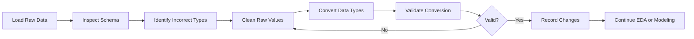
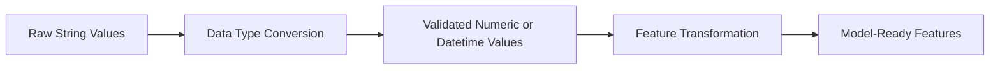

# 011 - Data Type Conversion

**Course:** 02 - Coding and EDA
**Module:** Module 05 - Exploratory Data Analysis
**Content Group:** Data Cleaning
**Roadmap Source:** Exploratory Data Analysis / Data Cleaning
**Lesson Type:** Exploratory Data Analysis
**Order in Module:** 011
**Suggested Duration:** 20 minutes

---

## 1. Overview

This lesson explains **Data Type Conversion** in the context of AI and data science.

Data type conversion is the process of changing a column or value from one data type to another. For example:

* Converting text into numeric values
* Converting strings into dates
* Converting numeric codes into categories
* Converting continuous values into Boolean flags
* Converting object columns into optimized categorical columns

Correct data types are essential because they determine:

* Which calculations can be performed
* Which charts can be created
* Which validation rules can be applied
* How machine learning models interpret features
* How efficiently a dataset is stored and processed

After completing this lesson, you should understand how to inspect, convert, validate, and document data types in a reproducible data-cleaning workflow.

---

## 2. Learning Objectives

By the end of this lesson, you should be able to:

* Explain data type conversion in your own words.
* Identify incorrect or inconsistent data types in a dataset.
* Convert text columns into numeric, date, Boolean, or categorical types.
* Handle invalid values during conversion.
* Validate a column after conversion.
* Explain how data types affect EDA and machine learning.
* Build a small, reproducible data type conversion notebook.

---

## 3. Why Data Types Matter

A value may look correct to a human while still being stored incorrectly by a computer.

For example, the following values may all be stored as strings:

```text
"1200"
"2026-07-11"
"True"
"Premium"
```

However, they represent different concepts:

| Raw value      | Intended meaning | Recommended data type |
| -------------- | ---------------- | --------------------- |
| `"1200"`       | Revenue          | Numeric               |
| `"2026-07-11"` | Transaction date | Datetime              |
| `"True"`       | Active status    | Boolean               |
| `"Premium"`    | Customer segment | Category              |

If these values remain as generic strings, many analytical operations may fail or produce misleading results.

### Example

Suppose revenue is stored as text:

```python
revenue = ["100", "20", "3"]
```

Sorting the values as strings may produce:

```text
100, 20, 3
```

Sorting them as numbers produces:

```text
3, 20, 100
```

The values appear similar, but their behavior is completely different.

---

## 4. Common Data Types

The most common data types used in exploratory data analysis are shown below.

| Data type        | Description                                                           | Example                       |
| ---------------- | --------------------------------------------------------------------- | ----------------------------- |
| Integer          | Whole numbers                                                         | `12`, `250`, `-4`             |
| Float            | Decimal numbers                                                       | `10.5`, `0.75`                |
| String           | Text values                                                           | `"Hanoi"`, `"Premium"`        |
| Boolean          | Logical values                                                        | `True`, `False`               |
| Datetime         | Dates and timestamps                                                  | `2026-07-11`                  |
| Category         | Repeated labels from a limited set                                    | `"Low"`, `"Medium"`, `"High"` |
| Object           | General-purpose pandas type, often containing strings or mixed values | `"100"`, `"unknown"`          |
| Nullable integer | Integer values that can contain missing data                          | `10`, `20`, `<NA>`            |

---

## 5. Data Type Conversion Workflow

A reliable conversion workflow should include inspection, cleaning, conversion, validation, and documentation.



A practical pipeline can be summarized as:

```text
raw data
    -> schema inspection
    -> value normalization
    -> type conversion
    -> invalid-value handling
    -> validation
    -> analysis-ready dataset
```

---

## 6. Inspecting Data Types in pandas

Consider the following customer dataset:

```python
import pandas as pd

df = pd.DataFrame(
    {
        "customer_id": ["1001", "1002", "1003"],
        "age": ["24", "35", "unknown"],
        "monthly_spend": ["120.50", "$85.00", "$210.30"],
        "signup_date": ["2026-01-10", "2026/02/15", "invalid"],
        "is_active": ["yes", "no", "yes"],
        "plan": ["Basic", "Premium", "Basic"],
    }
)
```

Inspect the dataset:

```python
print(df.head())
print(df.dtypes)
print(df.info())
```

Possible output:

```text
customer_id     object
age             object
monthly_spend   object
signup_date     object
is_active       object
plan            object
```

Although every column is stored as `object`, the columns represent several different concepts.

A more appropriate schema would be:

| Column          | Current type | Recommended type |
| --------------- | ------------ | ---------------- |
| `customer_id`   | Object       | String           |
| `age`           | Object       | Nullable integer |
| `monthly_spend` | Object       | Float            |
| `signup_date`   | Object       | Datetime         |
| `is_active`     | Object       | Boolean          |
| `plan`          | Object       | Category         |

---

## 7. Numeric Conversion

### 7.1 Basic Numeric Conversion

Use `pd.to_numeric()` to convert strings into numbers.

```python
df["age"] = pd.to_numeric(df["age"], errors="coerce")
```

The invalid value `"unknown"` becomes `NaN`.

```text
24
35
NaN
```

The `errors` parameter controls how invalid values are handled.

| Option            | Behavior                                                              |
| ----------------- | --------------------------------------------------------------------- |
| `errors="raise"`  | Stop and raise an error                                               |
| `errors="coerce"` | Replace invalid values with `NaN`                                     |
| `errors="ignore"` | Keep the original values; deprecated or discouraged in many workflows |

For data-cleaning workflows, `errors="coerce"` is often useful because invalid values become visible as missing data.

---

### 7.2 Converting Currency Values

Currency columns often contain symbols, commas, or spaces.

Example values:

```text
"$1,200.50"
"$85.00"
" 210.30 "
```

Clean the values before conversion:

```python
df["monthly_spend"] = (
    df["monthly_spend"]
    .str.replace("$", "", regex=False)
    .str.replace(",", "", regex=False)
    .str.strip()
)

df["monthly_spend"] = pd.to_numeric(
    df["monthly_spend"],
    errors="coerce",
)
```

Result:

```text
120.50
85.00
210.30
```

---

### 7.3 Integer Conversion with Missing Values

A standard NumPy integer column cannot contain `NaN`.

This may fail:

```python
df["age"] = df["age"].astype(int)
```

Instead, use pandas' nullable integer type:

```python
df["age"] = pd.to_numeric(
    df["age"],
    errors="coerce",
).astype("Int64")
```

Result:

```text
24
35
<NA>
```

---

## 8. Datetime Conversion

Dates frequently appear in inconsistent formats:

```text
2026-01-10
2026/02/15
11-07-2026
July 11, 2026
invalid
```

Use `pd.to_datetime()`:

```python
df["signup_date"] = pd.to_datetime(
    df["signup_date"],
    errors="coerce",
)
```

Invalid values become `NaT`, which means **Not a Time**.

### Explicit Date Format

When the format is known, specify it explicitly:

```python
df["signup_date"] = pd.to_datetime(
    df["signup_date"],
    format="%Y-%m-%d",
    errors="coerce",
)
```

Common datetime format codes:

| Code | Meaning              | Example |
| ---- | -------------------- | ------- |
| `%Y` | Four-digit year      | `2026`  |
| `%m` | Two-digit month      | `07`    |
| `%d` | Two-digit day        | `11`    |
| `%H` | Hour, 24-hour format | `21`    |
| `%M` | Minute               | `30`    |
| `%S` | Second               | `45`    |

Example:

```python
timestamp = pd.to_datetime(
    "2026-07-11 20:30:00",
    format="%Y-%m-%d %H:%M:%S",
)
```

---

## 9. Boolean Conversion

Boolean columns may contain many representations:

```text
yes / no
true / false
1 / 0
active / inactive
Y / N
```

A direct conversion with `astype(bool)` is often dangerous.

For example:

```python
bool("no")
```

returns:

```text
True
```

This happens because every non-empty string is considered truthy in Python.

Use explicit mapping instead:

```python
boolean_map = {
    "yes": True,
    "no": False,
}

df["is_active"] = (
    df["is_active"]
    .str.strip()
    .str.lower()
    .map(boolean_map)
    .astype("boolean")
)
```

The nullable Boolean type supports:

```text
True
False
<NA>
```

A more flexible mapping may include several representations:

```python
boolean_map = {
    "yes": True,
    "y": True,
    "true": True,
    "1": True,
    "active": True,
    "no": False,
    "n": False,
    "false": False,
    "0": False,
    "inactive": False,
}
```

---

## 10. Categorical Conversion

Categorical types are useful for columns with a limited number of repeated labels.

Examples:

* Customer plan
* Product category
* Country
* Risk level
* Churn status
* Device type

Convert a column using:

```python
df["plan"] = df["plan"].astype("category")
```

Benefits may include:

* Reduced memory usage
* Clearer schema
* Faster group-based operations
* Easier category validation

Inspect category values:

```python
print(df["plan"].cat.categories)
```

Possible output:

```text
Index(["Basic", "Premium"], dtype="object")
```

---

### Ordered Categories

Some categories have a meaningful order.

Example:

```text
Low < Medium < High
```

Define an ordered categorical type:

```python
risk_type = pd.CategoricalDtype(
    categories=["Low", "Medium", "High"],
    ordered=True,
)

df["risk_level"] = df["risk_level"].astype(risk_type)
```

Now comparisons and sorting respect the defined order.

---

## 11. String Conversion

Identifiers should often remain strings even when they contain only digits.

Examples:

* Customer ID
* Phone number
* Postal code
* Product code
* Account number

Consider the value:

```text
00125
```

If converted to an integer, it becomes:

```text
125
```

The leading zeros are lost.

Use the pandas string type:

```python
df["customer_id"] = df["customer_id"].astype("string")
```

The pandas `string` type is usually preferable to the generic `object` type because it handles missing values more consistently.

---

## 12. Converting Multiple Columns

You can convert several columns at once with `astype()`:

```python
df = df.astype(
    {
        "customer_id": "string",
        "plan": "category",
    }
)
```

However, `astype()` usually requires values to already be valid.

For messy columns, use specialized conversion functions first:

```python
df["age"] = pd.to_numeric(
    df["age"],
    errors="coerce",
).astype("Int64")

df["signup_date"] = pd.to_datetime(
    df["signup_date"],
    errors="coerce",
)
```

---

## 13. Complete Cleaning Example

```python
import pandas as pd

df = pd.DataFrame(
    {
        "customer_id": ["001", "002", "003", "004"],
        "age": ["24", "35", "unknown", "42"],
        "monthly_spend": ["$120.50", "$85.00", "$210.30", "invalid"],
        "signup_date": [
            "2026-01-10",
            "2026-02-15",
            "invalid",
            "2026-04-20",
        ],
        "is_active": ["yes", "no", "yes", "unknown"],
        "plan": ["Basic", "Premium", "Basic", "Enterprise"],
    }
)

# Preserve identifiers as strings.
df["customer_id"] = df["customer_id"].astype("string")

# Convert age to a nullable integer.
df["age"] = pd.to_numeric(
    df["age"],
    errors="coerce",
).astype("Int64")

# Remove currency symbols and convert to float.
df["monthly_spend"] = (
    df["monthly_spend"]
    .str.replace("$", "", regex=False)
    .str.replace(",", "", regex=False)
    .str.strip()
)

df["monthly_spend"] = pd.to_numeric(
    df["monthly_spend"],
    errors="coerce",
)

# Convert dates.
df["signup_date"] = pd.to_datetime(
    df["signup_date"],
    errors="coerce",
)

# Convert Boolean values through explicit mapping.
boolean_map = {
    "yes": True,
    "no": False,
}

df["is_active"] = (
    df["is_active"]
    .str.strip()
    .str.lower()
    .map(boolean_map)
    .astype("boolean")
)

# Convert repeated labels to categories.
df["plan"] = df["plan"].astype("category")

print(df)
print(df.dtypes)
```

Expected data types:

```text
customer_id             string
age                      Int64
monthly_spend          float64
signup_date     datetime64[ns]
is_active              boolean
plan                  category
```

---

## 14. Validating a Conversion

Conversion is not complete until the result has been validated.

### 14.1 Check Data Types

```python
print(df.dtypes)
```

### 14.2 Count Missing Values Created by Conversion

```python
print(df.isna().sum())
```

### 14.3 Inspect Failed Numeric Conversions

Keep the original values before conversion:

```python
raw_age = df["age"].copy()

converted_age = pd.to_numeric(
    raw_age,
    errors="coerce",
)

failed_age_values = raw_age[
    converted_age.isna() & raw_age.notna()
]

print(failed_age_values)
```

### 14.4 Validate Numeric Ranges

```python
invalid_age_mask = df["age"].notna() & ~df["age"].between(0, 120)

print(df.loc[invalid_age_mask, ["customer_id", "age"]])
```

### 14.5 Validate Allowed Categories

```python
allowed_plans = {
    "Basic",
    "Premium",
    "Enterprise",
}

invalid_plan_mask = ~df["plan"].isin(allowed_plans)

print(df.loc[invalid_plan_mask, ["customer_id", "plan"]])
```

### 14.6 Validate Date Ranges

```python
minimum_date = pd.Timestamp("2020-01-01")
maximum_date = pd.Timestamp.today().normalize()

invalid_date_mask = (
    df["signup_date"].notna()
    & ~df["signup_date"].between(minimum_date, maximum_date)
)

print(df.loc[invalid_date_mask, ["customer_id", "signup_date"]])
```

---

## 15. Measuring Conversion Quality

A conversion success rate can be calculated as:

$$
\text{Conversion Success Rate} = \frac{\text{Number of successfully converted non-null values}} {\text{Number of original non-null values}} \times 100
$$

In Python:

```python
raw_values = df["raw_age"]

converted_values = pd.to_numeric(
    raw_values,
    errors="coerce",
)

original_non_null = raw_values.notna().sum()
successful = converted_values.notna().sum()

success_rate = successful / original_non_null * 100

print(f"Conversion success rate: {success_rate:.2f}%")
```

A low conversion success rate may indicate:

* Unexpected formatting
* Mixed measurement units
* Typographical errors
* Placeholder values
* Incorrect delimiters
* Multiple date formats
* Corrupted source data

---

## 16. Data Type Conversion and Machine Learning

Data types influence how machine learning pipelines process features.

| Data type  | Typical model treatment                          |
| ---------- | ------------------------------------------------ |
| Numeric    | Scaling, normalization, direct model input       |
| Category   | One-hot encoding, ordinal encoding, embeddings   |
| Datetime   | Extract year, month, day, hour, duration         |
| Boolean    | Convert to `0` and `1` when required             |
| Text       | Tokenization, vectorization, embeddings          |
| Identifier | Usually excluded from training unless meaningful |

### Example

A signup date should usually not be passed directly into a model as raw text.

Instead, derive useful features:

```python
reference_date = pd.Timestamp("2026-07-11")

df["signup_year"] = df["signup_date"].dt.year
df["signup_month"] = df["signup_date"].dt.month
df["signup_day_of_week"] = df["signup_date"].dt.dayofweek

df["customer_tenure_days"] = (
    reference_date - df["signup_date"]
).dt.days
```

---

## 17. Business-Oriented Example

Suppose a company wants to answer:

> Do customers with higher monthly spending have a higher churn rate?

Before analysis, verify that:

* `monthly_spend` is numeric.
* `churned` is Boolean or categorical.
* Missing and invalid spending values are documented.
* Currency symbols and separators have been removed.
* Negative spending values are investigated.
* Customer IDs remain strings.

Then the analysis can be performed:

```python
churn_summary = (
    df.groupby("churned", observed=True)["monthly_spend"]
    .agg(["count", "mean", "median"])
)

print(churn_summary)
```

Without correct conversion, the mean and median may fail or produce incorrect results.

---

## 18. Common Conversion Patterns

### String to Integer

```python
df["quantity"] = pd.to_numeric(
    df["quantity"],
    errors="coerce",
).astype("Int64")
```

### String to Float

```python
df["price"] = pd.to_numeric(
    df["price"],
    errors="coerce",
)
```

### String to Datetime

```python
df["created_at"] = pd.to_datetime(
    df["created_at"],
    errors="coerce",
)
```

### String to Boolean

```python
df["is_verified"] = (
    df["is_verified"]
    .str.lower()
    .map({"yes": True, "no": False})
    .astype("boolean")
)
```

### String to Category

```python
df["segment"] = df["segment"].astype("category")
```

### Numeric Code to Category

```python
status_map = {
    0: "Inactive",
    1: "Active",
    2: "Suspended",
}

df["status"] = (
    df["status_code"]
    .map(status_map)
    .astype("category")
)
```

### Category to Numeric Code

```python
priority_map = {
    "Low": 1,
    "Medium": 2,
    "High": 3,
}

df["priority_score"] = df["priority"].map(priority_map)
```

---

## 19. Type Conversion Versus Feature Transformation

Data type conversion and feature transformation are related but different.

### Data Type Conversion

Changes how a value is represented.

```text
"120.5" -> 120.5
```

### Feature Transformation

Changes the value itself or creates a new representation.

```text
120.5 -> log(120.5)
```

Examples of transformation include:

* Standardization
* Normalization
* Log transformation
* Binning
* One-hot encoding
* Date feature extraction

A good workflow usually performs type conversion before feature transformation.



---

## 20. Reproducible Conversion Functions

Repeated cleaning logic should be placed in reusable functions.

```python
import pandas as pd


def clean_currency(series: pd.Series) -> pd.Series:
    """Convert currency-formatted strings into numeric values."""
    cleaned = (
        series.astype("string")
        .str.replace("$", "", regex=False)
        .str.replace(",", "", regex=False)
        .str.strip()
    )

    return pd.to_numeric(cleaned, errors="coerce")


def parse_boolean(series: pd.Series) -> pd.Series:
    """Convert common Boolean text representations."""
    mapping = {
        "yes": True,
        "y": True,
        "true": True,
        "1": True,
        "no": False,
        "n": False,
        "false": False,
        "0": False,
    }

    normalized = (
        series.astype("string")
        .str.strip()
        .str.lower()
    )

    return normalized.map(mapping).astype("boolean")
```

Usage:

```python
df["monthly_spend"] = clean_currency(df["monthly_spend"])
df["is_active"] = parse_boolean(df["is_active"])
```

This approach makes the workflow:

* Easier to test
* Easier to reuse
* Easier to review
* Easier to maintain
* Easier to reproduce

---

## 21. Schema Validation

A cleaned dataset should have an expected schema.

```python
expected_types = {
    "customer_id": "string",
    "age": "Int64",
    "monthly_spend": "float64",
    "signup_date": "datetime64[ns]",
    "is_active": "boolean",
    "plan": "category",
}
```

Validate the schema:

```python
for column, expected_type in expected_types.items():
    actual_type = str(df[column].dtype)

    assert actual_type == expected_type, (
        f"{column}: expected {expected_type}, "
        f"but received {actual_type}"
    )
```

For production systems, schema-validation libraries may also be used to define:

* Required columns
* Expected data types
* Allowed categories
* Numeric ranges
* Missing-value rules
* Unique-key constraints

---

## 22. Conversion Audit Table

A conversion audit table helps document what changed.

| Column          | Original type | Target type | Cleaning rule           | Invalid values |
| --------------- | ------------- | ----------- | ----------------------- | -------------- |
| `age`           | Object        | Int64       | Convert numeric strings | `"unknown"`    |
| `monthly_spend` | Object        | Float       | Remove `$` and commas   | `"invalid"`    |
| `signup_date`   | Object        | Datetime    | Parse ISO date          | `"invalid"`    |
| `is_active`     | Object        | Boolean     | Map yes/no              | `"unknown"`    |
| `plan`          | Object        | Category    | Convert repeated labels | None           |

This audit table can be stored in:

* A notebook
* A data-cleaning report
* A project README
* A data dictionary
* A pipeline changelog
* A model card

---

## 23. Practical Exercise

Use a small CSV dataset containing customer information.

Suggested columns:

```text
customer_id
age
monthly_spend
signup_date
is_active
plan
churned
```

### Tasks

1. Load the CSV file into pandas.
2. Inspect the dataset with:

```python
df.head()
df.info()
df.dtypes
df.isna().sum()
```

3. Identify columns with incorrect data types.
4. Convert:

   * Customer ID to string
   * Age to nullable integer
   * Monthly spending to float
   * Signup date to datetime
   * Active status to Boolean
   * Plan to category
5. Count values that became missing after conversion.
6. Investigate invalid original values.
7. Validate numeric ranges and allowed categories.
8. Create a conversion audit table.
9. Save the cleaned dataset.
10. Write three insights supported by a chart or summary table.

---

## 24. Example Analysis After Conversion

### Monthly Spending by Plan

```python
spend_by_plan = (
    df.groupby("plan", observed=True)["monthly_spend"]
    .agg(
        customer_count="count",
        average_spend="mean",
        median_spend="median",
    )
    .sort_values("average_spend", ascending=False)
)

print(spend_by_plan)
```

### Customer Signups by Month

```python
monthly_signups = (
    df.dropna(subset=["signup_date"])
    .assign(
        signup_month=lambda data: (
            data["signup_date"].dt.to_period("M")
        )
    )
    .groupby("signup_month")
    .size()
)

print(monthly_signups)
```

### Active Customer Rate

```python
active_rate = df["is_active"].mean() * 100

print(f"Active customer rate: {active_rate:.2f}%")
```

---

## 25. Common Mistakes

### Mistake 1: Using `astype(int)` on Dirty Data

```python
df["age"] = df["age"].astype(int)
```

This fails when values contain:

```text
unknown
N/A
empty strings
decimal values
```

Better approach:

```python
df["age"] = pd.to_numeric(
    df["age"],
    errors="coerce",
).astype("Int64")
```

---

### Mistake 2: Converting Identifiers to Numbers

```python
df["customer_id"] = df["customer_id"].astype(int)
```

This may remove leading zeros and create false mathematical meaning.

Better approach:

```python
df["customer_id"] = df["customer_id"].astype("string")
```

---

### Mistake 3: Using `astype(bool)` on Strings

```python
df["is_active"] = df["is_active"].astype(bool)
```

Both `"yes"` and `"no"` become `True` because they are non-empty strings.

Better approach:

```python
df["is_active"] = (
    df["is_active"]
    .str.lower()
    .map({"yes": True, "no": False})
    .astype("boolean")
)
```

---

### Mistake 4: Ignoring Invalid Values

Using `errors="coerce"` without inspecting the resulting missing values can silently remove information.

Always compare values before and after conversion.

```python
invalid_count = converted.isna().sum() - original.isna().sum()
```

---

### Mistake 5: Parsing Ambiguous Dates Without a Rule

The value:

```text
03/04/2026
```

may mean:

* March 4, 2026
* April 3, 2026

The expected date format must be confirmed from the data source or business context.

---

### Mistake 6: Overwriting Raw Data

Do not destroy the only copy of the original values before validation.

Prefer:

```python
df["age_raw"] = df["age"]

df["age"] = pd.to_numeric(
    df["age_raw"],
    errors="coerce",
)
```

Alternatively, preserve the raw dataset separately:

```python
raw_df = pd.read_csv("customers.csv")
clean_df = raw_df.copy()
```

---

### Mistake 7: Mixing Cleaning and Business Logic

Currency cleaning, date parsing, category mapping, and business rules should be separated into clear steps.

Avoid long, undocumented transformations that are difficult to audit.

---

### Mistake 8: Converting Categories Without Standardization

The following values may represent the same category:

```text
Premium
premium
PREMIUM
 Premium
```

Normalize before converting:

```python
df["plan"] = (
    df["plan"]
    .str.strip()
    .str.title()
    .astype("category")
)
```

---

## 26. Best Practices

* Preserve the raw dataset.
* Inspect the schema before conversion.
* Normalize strings before mapping values.
* Use `pd.to_numeric()` for messy numeric columns.
* Use `pd.to_datetime()` for date columns.
* Use nullable pandas types when missing values are possible.
* Keep identifiers as strings.
* Use explicit mappings for Boolean and ordinal values.
* Count conversion failures.
* Validate ranges and categories after conversion.
* Record assumptions and cleaning rules.
* Put repeated conversion logic into functions.
* Test schema expectations before modeling.
* Save the cleaned dataset separately from the raw dataset.

---

## 27. Completion Checklist

* [ ] I can explain **Data Type Conversion** in one or two minutes.
* [ ] I can inspect column data types using pandas.
* [ ] I can convert strings into numeric values safely.
* [ ] I can parse date and timestamp columns.
* [ ] I can convert text representations into Boolean values.
* [ ] I can distinguish identifiers from numeric measurements.
* [ ] I can use nullable integer and Boolean types.
* [ ] I can identify values that failed during conversion.
* [ ] I can validate ranges and categories after conversion.
* [ ] I have created a reproducible notebook or script.
* [ ] I have documented at least one caveat or assumption.
* [ ] I have written at least three business-oriented insights.

---

## 28. Related Outcome

Understand, clean, visualize, and explain datasets using business-oriented insights.

---

## 29. Related Project

### Mini Project: Customer Churn EDA

Build an exploratory data analysis project that includes:

* Raw customer dataset inspection
* Data type conversion
* Missing-value handling
* Duplicate detection
* Outlier analysis
* Churn-rate analysis
* Customer-segment comparison
* Spending-distribution charts
* Feature relationship analysis
* Data-quality summary
* Conversion audit table
* Business recommendations

Suggested project structure:

```text
customer-churn-eda/
├── data/
│   ├── raw/
│   │   └── customers.csv
│   └── processed/
│       └── customers_cleaned.csv
├── notebooks/
│   └── 01_customer_churn_eda.ipynb
├── src/
│   └── cleaning.py
├── reports/
│   └── data_type_conversion_audit.csv
├── README.md
└── requirements.txt
```

---

## 30. Summary

**Data Type Conversion** is a fundamental step in data cleaning and exploratory data analysis.

It ensures that values are stored and interpreted according to their real meaning. Correct data types make calculations, charts, validation rules, feature engineering, and machine learning pipelines more reliable.

A strong conversion workflow should follow this sequence:

```text
inspect
    -> normalize
    -> convert
    -> detect failures
    -> validate
    -> document
    -> analyze
```

Do not treat conversion as a simple technical operation. Every conversion contains assumptions about what the data represents.

Transform this lesson into a practical artifact such as:

* A pandas notebook
* A reusable cleaning script
* A schema-validation module
* A conversion audit report
* A data dictionary
* A portfolio case study
