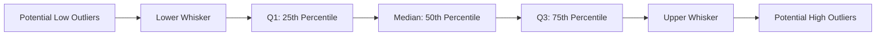
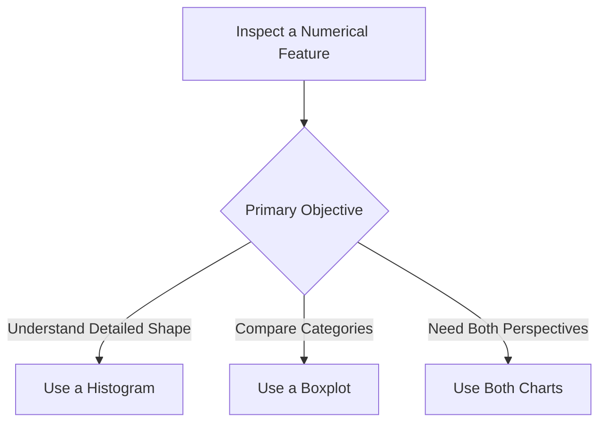
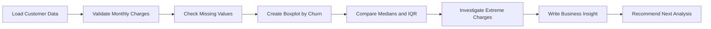
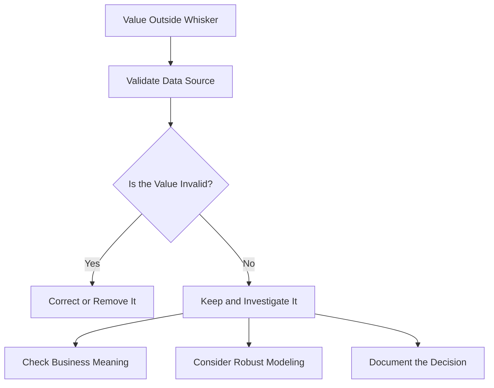
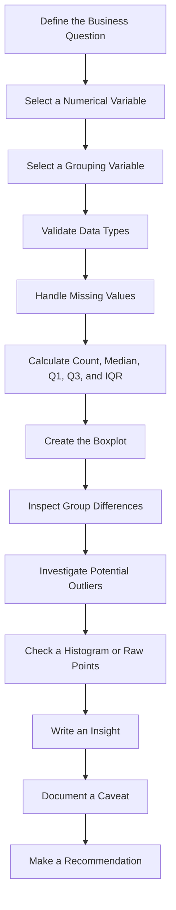

# 014 - Boxplot

**Course:** 02 - Coding and EDA
**Module:** Module 05 - Exploratory Data Analysis
**Content Group:** Visualization
**Roadmap Source:** Exploratory Data Analysis / Visualization
**Lesson Type:** Exploratory Data Analysis
**Order in Module:** 014
**Suggested Duration:** 20 minutes

---

## 1. Summary

A **boxplot**, also called a **box-and-whisker plot**, is a statistical chart used to summarize the distribution of a numerical variable.

A boxplot helps answer questions such as:

* What is the typical value of the variable?
* How widely are the values distributed?
* Is the distribution symmetric or skewed?
* Are there potential outliers?
* How do distributions differ across groups?

In AI and Data Science, boxplots are commonly used during Exploratory Data Analysis to:

* Inspect numerical feature distributions
* Compare categories or customer segments
* Detect unusual observations
* Identify possible data-quality problems
* Compare model performance across experiments
* Monitor feature distributions in production

A boxplot does not show every detail of the distribution. However, it provides a compact summary of the center, spread, and potential outliers.

---

## 2. Learning Objectives

After completing this lesson, you should be able to:

* Explain a boxplot in your own words.
* Identify the median, quartiles, interquartile range, whiskers, and outliers.
* Calculate the main boxplot statistics.
* Create boxplots using Python.
* Compare numerical distributions across groups.
* Interpret boxplots in a business context.
* Recognize the limitations of boxplots.
* Convert a chart into an insight, caveat, and recommendation.

---

## 3. Main Concept

A boxplot summarizes a numerical distribution using several important values:

1. First quartile
2. Median
3. Third quartile
4. Lower whisker
5. Upper whisker
6. Potential outliers

The box contains the middle 50% of the observations.

```text
Potential                                               Potential
outliers                                                 outliers
   o        Lower whisker   Q1      Median      Q3   Upper whisker       o
   |              |---------|=========|==========|---------|              |
                              <------ IQR ------->
```

The central box represents the values between the first quartile and the third quartile.

---

## 4. Boxplot Anatomy



### 4.1 First Quartile

The first quartile, `Q1`, is the value below which approximately 25% of the observations fall.

It is also called the 25th percentile.

### 4.2 Median

The median, `Q2`, is the middle value of an ordered dataset.

Approximately:

* 50% of the observations are below the median.
* 50% of the observations are above the median.

The median is represented by a line inside the box.

### 4.3 Third Quartile

The third quartile, `Q3`, is the value below which approximately 75% of the observations fall.

It is also called the 75th percentile.

### 4.4 Interquartile Range

The **interquartile range**, abbreviated as `IQR`, measures the spread of the middle 50% of the data.

$$
IQR = Q_3 - Q_1
$$

A large IQR indicates greater variability.

A small IQR indicates that the middle 50% of observations are more concentrated.

---

## 5. Whiskers and Potential Outliers

A common boxplot convention uses the `1.5 × IQR` rule.

### Lower Fence

$$
\text{Lower Fence} = Q_1 - 1.5 \times IQR
$$

### Upper Fence

$$
\text{Upper Fence} = Q_3 + 1.5 \times IQR
$$

A value is considered a potential low outlier when:

$$
x < Q_1 - 1.5 \times IQR
$$

A value is considered a potential high outlier when:

$$
x > Q_3 + 1.5 \times IQR
$$

The whiskers usually extend to:

* The smallest observed value greater than or equal to the lower fence
* The largest observed value less than or equal to the upper fence

Values outside the whiskers are displayed as individual points.

> A value outside the whiskers is not automatically an error. It is only a potentially unusual observation that should be investigated.

---

## 6. Five-Number Summary

A boxplot is closely related to the five-number summary:

1. Minimum
2. First quartile
3. Median
4. Third quartile
5. Maximum

However, in a standard boxplot, the whiskers may not reach the true minimum and maximum when outliers exist.

| Statistic | Meaning                 |
| --------- | ----------------------- |
| Minimum   | Smallest observed value |
| Q1        | 25th percentile         |
| Median    | 50th percentile         |
| Q3        | 75th percentile         |
| Maximum   | Largest observed value  |

When outliers are present, the boxplot usually displays:

* The smallest non-outlier value as the lower whisker
* The largest non-outlier value as the upper whisker
* Extreme observations as separate points

---

## 7. Manual Example

Consider the following ordered dataset:

```text
10, 12, 13, 15, 16, 18, 20, 22, 24, 45
```

Suppose the quartiles are:

$$
Q_1 = 13
$$

$$
Q_2 = 17
$$

$$
Q_3 = 22
$$

Calculate the interquartile range:

$$
IQR = Q_3 - Q_1
$$

$$
IQR = 22 - 13
$$

$$
IQR = 9
$$

Calculate the lower fence:

$$
\text{Lower Fence} = Q_1 - 1.5 \times IQR
$$

$$
\text{Lower Fence} = 13 - 1.5 \times 9
$$

$$
\text{Lower Fence} = -0.5
$$

Calculate the upper fence:

$$
\text{Upper Fence} = Q_3 + 1.5 \times IQR
$$

$$
\text{Upper Fence} = 22 + 1.5 \times 9
$$

$$
\text{Upper Fence} = 35.5
$$

Because:

$$
45 > 35.5
$$

the value `45` is displayed as a potential outlier.

This does not automatically mean that `45` should be removed. It may be:

* A valid extreme value
* A data-entry error
* A different customer segment
* A rare event
* A measurement problem

---

## 8. What a Boxplot Reveals

A boxplot provides information about several characteristics of a numerical distribution.

### 8.1 Central Tendency

The median line shows the central value of the distribution.

A higher median means that the typical value is larger.

### 8.2 Variability

The length of the box along the numerical axis represents the IQR.

A larger box indicates greater variation in the middle 50% of observations.

A smaller box indicates that the middle observations are more concentrated.

### 8.3 Skewness

The median position and whisker lengths can suggest whether the distribution is symmetric or skewed.

#### Approximately Symmetric Distribution

```text
|----------[----------|----------]----------|
                       Median
```

Typical characteristics:

* The median is near the center of the box.
* The whiskers have similar lengths.
* Outliers are balanced or limited.

#### Right-Skewed Distribution

```text
|------[----|----------]------------------------|
            Median
```

Typical characteristics:

* The upper whisker is longer.
* The median may be closer to `Q1`.
* High-value outliers may be present.
* The distribution has a longer right tail.

#### Left-Skewed Distribution

```text
|------------------------[----------|----]------|
                                      Median
```

Typical characteristics:

* The lower whisker is longer.
* The median may be closer to `Q3`.
* Low-value outliers may be present.
* The distribution has a longer left tail.

### 8.4 Potential Outliers

Points outside the whiskers may represent:

* Data-entry errors
* Sensor failures
* Fraudulent transactions
* Rare customer behavior
* Valid extreme events
* Unit-conversion problems
* A different population or subgroup

---

## 9. Boxplot in the EDA Workflow

```mermaid
flowchart LR
    A["Business Question"] --> B["Inspect Dataset Schema"]
    B --> C["Check Data Quality"]
    C --> D["Select Numerical Features"]
    D --> E["Calculate Summary Statistics"]
    E --> F["Create Boxplots"]
    F --> G["Compare Groups"]
    G --> H["Investigate Outliers"]
    H --> I["Write Insights"]
    I --> J["Make Recommendations"]
```



A boxplot should be connected to a real analytical question.

Examples:

* Do churned customers have higher monthly charges?
* Which department has the greatest salary variability?
* Are delivery times different across regions?
* Which sensor produces unusually large measurements?
* Does one experimental group contain more extreme outcomes?
* Are production feature values different from training values?

---

## 10. Creating a Basic Boxplot with Matplotlib

```python
import matplotlib.pyplot as plt
import pandas as pd

df = pd.DataFrame(
    {
        "monthly_charges": [
            20,
            25,
            28,
            30,
            32,
            35,
            40,
            45,
            50,
            55,
            60,
            65,
            70,
            75,
            150,
        ]
    }
)

plt.figure(figsize=(8, 4))

plt.boxplot(
    df["monthly_charges"],
    vert=False,
)

plt.title("Distribution of Monthly Charges")
plt.xlabel("Monthly Charges")
plt.show()
```

This chart helps identify:

* The median monthly charge
* The middle 50% of customer charges
* The overall spread
* Potential high-value outliers

---

## 11. Creating a Boxplot with Pandas

Pandas provides a convenient interface for creating boxplots.

```python
import matplotlib.pyplot as plt
import pandas as pd

df = pd.DataFrame(
    {
        "monthly_charges": [
            20,
            25,
            28,
            30,
            32,
            35,
            40,
            45,
            50,
            55,
            60,
            65,
            70,
            75,
            150,
        ]
    }
)

df.boxplot(
    column="monthly_charges",
    vert=False,
)

plt.title("Monthly Charges Boxplot")
plt.xlabel("Monthly Charges")
plt.show()
```

---

## 12. Creating a Boxplot with Seaborn

```python
import matplotlib.pyplot as plt
import pandas as pd
import seaborn as sns

df = pd.DataFrame(
    {
        "monthly_charges": [
            20,
            25,
            28,
            30,
            32,
            35,
            40,
            45,
            50,
            55,
            60,
            65,
            70,
            75,
            150,
        ]
    }
)

plt.figure(figsize=(8, 4))

sns.boxplot(
    data=df,
    x="monthly_charges",
)

plt.title("Distribution of Monthly Charges")
plt.xlabel("Monthly Charges")
plt.show()
```

Seaborn is especially convenient when comparing numerical variables across categories.

---

## 13. Comparing Groups

Boxplots are especially useful when comparing the same numerical variable across multiple groups.

For example, a customer churn dataset may contain:

* `monthly_charges`
* `churn`

A grouped boxplot can show whether monthly charges differ between customers who churned and customers who stayed.

```python
import matplotlib.pyplot as plt
import pandas as pd
import seaborn as sns

df = pd.DataFrame(
    {
        "churn": [
            "No",
            "No",
            "No",
            "No",
            "No",
            "Yes",
            "Yes",
            "Yes",
            "Yes",
            "Yes",
        ],
        "monthly_charges": [
            25,
            35,
            40,
            45,
            50,
            55,
            65,
            75,
            90,
            120,
        ],
    }
)

plt.figure(figsize=(8, 5))

sns.boxplot(
    data=df,
    x="churn",
    y="monthly_charges",
)

plt.title("Monthly Charges by Churn Status")
plt.xlabel("Churn Status")
plt.ylabel("Monthly Charges")
plt.show()
```

A possible interpretation is:

> Customers who churned have a higher median monthly charge and greater charge variability than customers who stayed.

This observation does not prove that high charges cause churn. It only identifies an association that should be investigated further.

---

## 14. Horizontal and Vertical Boxplots

### Vertical Boxplot

```python
sns.boxplot(
    data=df,
    x="churn",
    y="monthly_charges",
)
```

Use a vertical boxplot when:

* Category labels are short.
* There are only a few categories.
* The numerical scale is easy to read vertically.

### Horizontal Boxplot

```python
sns.boxplot(
    data=df,
    x="monthly_charges",
    y="churn",
)
```

Use a horizontal boxplot when:

* Category labels are long.
* There are many categories.
* Numerical values are easier to compare horizontally.

---

## 15. Adding Individual Data Points

A boxplot hides the exact observations. Adding a strip plot shows the underlying values.

```python
import matplotlib.pyplot as plt
import seaborn as sns

plt.figure(figsize=(8, 5))

sns.boxplot(
    data=df,
    x="churn",
    y="monthly_charges",
)

sns.stripplot(
    data=df,
    x="churn",
    y="monthly_charges",
    alpha=0.6,
)

plt.title("Monthly Charges by Churn Status")
plt.xlabel("Churn Status")
plt.ylabel("Monthly Charges")
plt.show()
```

This combination is useful for small datasets because it shows:

* The statistical summary
* Individual observations
* Repeated values
* Clusters
* Gaps
* Approximate sample size

---

## 16. Calculating Boxplot Statistics with Python

```python
series = df["monthly_charges"]

q1 = series.quantile(0.25)
median = series.median()
q3 = series.quantile(0.75)

iqr = q3 - q1

lower_fence = q1 - 1.5 * iqr
upper_fence = q3 + 1.5 * iqr

print(f"Q1: {q1}")
print(f"Median: {median}")
print(f"Q3: {q3}")
print(f"IQR: {iqr}")
print(f"Lower fence: {lower_fence}")
print(f"Upper fence: {upper_fence}")
```

Potential outliers can be selected with:

```python
outliers = df[
    (df["monthly_charges"] < lower_fence)
    | (df["monthly_charges"] > upper_fence)
]

print(outliers)
```

---

## 17. Comparing Boxplot Statistics by Group

```python
summary = (
    df.groupby("churn")["monthly_charges"]
    .agg(
        count="count",
        minimum="min",
        q1=lambda x: x.quantile(0.25),
        median="median",
        q3=lambda x: x.quantile(0.75),
        maximum="max",
        mean="mean",
        standard_deviation="std",
    )
)

summary["iqr"] = summary["q3"] - summary["q1"]

print(summary)
```

Example summary table:

| Churn | Count | Q1 | Median | Q3 | IQR |
| ----- | ----: | -: | -----: | -: | --: |
| No    |     5 | 35 |     40 | 45 |  10 |
| Yes   |     5 | 65 |     75 | 90 |  25 |

Possible interpretation:

> The churn group has a higher median monthly charge and a wider interquartile range. This suggests both higher typical charges and greater variability among churned customers.

---

## 18. Boxplot Versus Histogram

A boxplot and a histogram describe distributions differently.

| Property                          | Boxplot   | Histogram      |
| --------------------------------- | --------- | -------------- |
| Shows median                      | Yes       | Not directly   |
| Shows quartiles                   | Yes       | No             |
| Shows potential outliers          | Yes       | Sometimes      |
| Shows detailed distribution shape | Limited   | Yes            |
| Shows multiple peaks              | No        | Yes            |
| Good for comparing groups         | Excellent | More difficult |
| Sensitive to bin size             | No        | Yes            |
| Compact visualization             | Yes       | Moderate       |

### Use a Boxplot When

* Comparing distributions across categories
* Detecting potential outliers
* Summarizing center and spread
* Displaying many groups compactly

### Use a Histogram When

* Examining the detailed distribution shape
* Identifying multiple peaks
* Detecting gaps or clusters
* Understanding frequency concentration

A strong EDA often uses both.



---

## 19. Boxplot Versus Violin Plot

A violin plot combines a boxplot-like statistical summary with a density estimate.

| Property               | Boxplot         | Violin Plot       |
| ---------------------- | --------------- | ----------------- |
| Easy to interpret      | High            | Medium            |
| Shows quartiles        | Yes             | Usually           |
| Shows density shape    | No              | Yes               |
| Good for small samples | With raw points | Can be misleading |
| Good for many groups   | Yes             | Yes               |
| Compact                | Yes             | Moderate          |

Use a violin plot when distribution shape is important.

However, make sure that each group contains enough observations to estimate density reliably.

---

## 20. Business Example: Customer Churn

Suppose a telecommunications company wants to understand whether monthly charges are associated with churn.

### Business Question

> Are customers with higher monthly charges more likely to churn?

### Analysis Workflow



### Example Code

```python
import matplotlib.pyplot as plt
import pandas as pd
import seaborn as sns

df = pd.read_csv("customer_churn.csv")

analysis_df = df[
    [
        "customer_id",
        "churn",
        "monthly_charges",
    ]
].dropna()

plt.figure(figsize=(8, 5))

sns.boxplot(
    data=analysis_df,
    x="churn",
    y="monthly_charges",
)

plt.title("Monthly Charges by Churn Status")
plt.xlabel("Churn Status")
plt.ylabel("Monthly Charges")
plt.show()
```

### Example Insight

> Churned customers have a higher median monthly charge than retained customers. The churn group also contains more high-charge observations.

### Caveat

> The chart shows association, not causation. Contract type, tenure, service quality, and support history may explain part of the difference.

### Recommendation

> Compare churn rates across monthly-charge bands while controlling for tenure and contract type. Consider testing targeted retention offers for high-charge customers.

---

## 21. Boxplots and Machine Learning

Boxplots can support several stages of a machine-learning workflow.

### 21.1 Data Validation

A boxplot can reveal:

* Impossible negative values
* Unexpectedly large measurements
* Unit-conversion problems
* Sensor malfunctions
* Incorrect decimal placement
* Changes in data collection

### 21.2 Feature Engineering

A strongly right-skewed numerical feature may benefit from a logarithmic transformation.

$$
x_{\text{new}} = \log(1 + x)
$$

Python example:

```python
import numpy as np

df["log_monthly_charges"] = np.log1p(
    df["monthly_charges"]
)
```

Before applying a transformation, consider:

* Whether zero values are possible
* Whether negative values exist
* Whether the transformation is meaningful in the business context
* Whether the model actually requires transformed inputs

### 21.3 Outlier Treatment

Possible strategies include:

* Correcting confirmed errors
* Removing invalid observations
* Capping extreme values
* Applying robust transformations
* Creating an outlier indicator
* Using robust statistical methods
* Keeping valid extreme cases unchanged

### 21.4 Model Diagnostics

Boxplots can compare:

* Prediction errors across segments
* Model scores across validation folds
* Residuals across time periods
* Inference latency across environments
* Feature distributions before and after deployment
* Performance across demographic or regional groups

---

## 22. Boxplots for Model Evaluation

Suppose two models are evaluated across five cross-validation folds.

```python
import matplotlib.pyplot as plt
import pandas as pd
import seaborn as sns

scores = pd.DataFrame(
    {
        "model": [
            "Logistic Regression",
            "Logistic Regression",
            "Logistic Regression",
            "Logistic Regression",
            "Logistic Regression",
            "Random Forest",
            "Random Forest",
            "Random Forest",
            "Random Forest",
            "Random Forest",
        ],
        "f1_score": [
            0.74,
            0.76,
            0.75,
            0.73,
            0.77,
            0.78,
            0.82,
            0.80,
            0.75,
            0.84,
        ],
    }
)

plt.figure(figsize=(9, 5))

sns.boxplot(
    data=scores,
    x="model",
    y="f1_score",
)

sns.stripplot(
    data=scores,
    x="model",
    y="f1_score",
    alpha=0.7,
)

plt.title("F1 Score Across Cross-Validation Folds")
plt.xlabel("Model")
plt.ylabel("F1 Score")
plt.show()
```

Possible interpretation:

> Random Forest has a higher median F1 score, but its performance varies more across folds. Logistic Regression has a lower median score but appears more stable.

This analysis considers both:

* Average performance
* Performance stability

---

## 23. Boxplots for Data Drift

Boxplots can compare a feature between training data and production data.

```python
import matplotlib.pyplot as plt
import pandas as pd
import seaborn as sns

training = pd.DataFrame(
    {
        "source": "Training",
        "transaction_amount": [
            20,
            25,
            30,
            35,
            40,
            45,
            50,
        ],
    }
)

production = pd.DataFrame(
    {
        "source": "Production",
        "transaction_amount": [
            30,
            35,
            45,
            55,
            70,
            90,
            120,
        ],
    }
)

combined = pd.concat(
    [training, production],
    ignore_index=True,
)

plt.figure(figsize=(8, 5))

sns.boxplot(
    data=combined,
    x="source",
    y="transaction_amount",
)

plt.title("Training vs. Production Distribution")
plt.xlabel("Data Source")
plt.ylabel("Transaction Amount")
plt.show()
```

A change in the following properties may indicate data drift:

* Median
* IQR
* Whisker length
* Number of outliers
* Overall value range

A boxplot is useful for visual monitoring, but formal drift metrics may also be required.

Examples include:

* Population Stability Index
* Kolmogorov-Smirnov test
* Wasserstein distance
* Jensen-Shannon divergence

---

## 24. Common Interpretation Patterns

### Pattern 1: Similar Median, Different Spread

```text
Group A: |------[----|----]------|

Group B: |--[----------|----------]--|
```

Interpretation:

> The groups have similar typical values, but Group B has greater variability.

### Pattern 2: Different Median, Similar Spread

```text
Group A: |------[----|----]------|

Group B:                 |------[----|----]------|
```

Interpretation:

> Group B has consistently higher values than Group A.

### Pattern 3: Many High Outliers

```text
|------[----|------]------|        o    o    o
```

Interpretation:

> Most values are concentrated within a moderate range, but several unusually high observations exist.

### Pattern 4: Strong Right Skew

```text
|----[----|--------]--------------------|      o
```

Interpretation:

> Most observations are relatively small, with a long tail toward larger values.

### Pattern 5: Strong Overlap

```text
Group A: |--------[------|------]--------|

Group B:     |--------[------|------]--------|
```

Interpretation:

> The groups may differ slightly, but their distributions overlap substantially.

---

## 25. Limitations of Boxplots

A boxplot is useful, but it does not show every property of a distribution.

### 25.1 It Does Not Show the Full Distribution Shape

Different distributions can produce similar boxplots.

For example:

* A normal distribution
* A bimodal distribution
* A uniform distribution

may have similar quartiles but very different shapes.

### 25.2 It Can Hide Sample Size

Two boxplots may look similar even when:

* One group contains 10 observations.
* Another group contains 10,000 observations.

Check group counts before comparing distributions.

```python
print(df["churn"].value_counts())
```

### 25.3 Outliers Are Not Automatically Invalid

The `1.5 × IQR` rule is a visualization convention.

It is not a universal rule for removing data.

### 25.4 Small Samples Can Be Misleading

Quartiles and whiskers may be unstable when the sample size is very small.

Add individual data points when possible.

### 25.5 Boxplots Hide Multiple Peaks

A boxplot cannot clearly show whether a distribution contains multiple clusters or peaks.

Use a histogram, density plot, or violin plot for more detail.

### 25.6 Plotting Libraries May Use Different Conventions

Different tools may calculate quartiles or whiskers differently.

Check the library documentation when exact statistical definitions matter.

---

## 26. Common Mistakes

### Mistake 1: Automatically Removing Every Outlier

Incorrect workflow:

```text
Value outside whisker
        |
        v
Delete the value
```

Better workflow:



### Mistake 2: Ignoring Sample Size

A boxplot should not be interpreted without checking the number of observations in each group.

```python
group_counts = df["churn"].value_counts()

print(group_counts)
```

### Mistake 3: Using a Boxplot for a Categorical Variable Alone

A standard boxplot requires a numerical variable.

Incorrect:

```python
sns.boxplot(
    data=df,
    y="city",
)
```

Correct:

```python
sns.boxplot(
    data=df,
    x="city",
    y="monthly_charges",
)
```

### Mistake 4: Ignoring Units

Weak axis label:

```text
Value
```

Better axis label:

```text
Monthly Charges (USD)
```

Units are essential for business interpretation.

### Mistake 5: Reporting Only the Chart

Weak conclusion:

> Here is the boxplot.

Better conclusion:

> Churned customers have a higher median monthly charge. However, the churn group also contains customers with shorter tenure, so the relationship should be examined while controlling for tenure.

### Mistake 6: Assuming Association Means Causation

A difference between two boxplots does not prove that one variable causes another.

The chart may be affected by:

* Confounding variables
* Selection bias
* Different sample sizes
* Data-quality problems
* Hidden customer segments

---

## 27. Recommended Analysis Pattern



Reusable EDA workflow:

```text
Business question
        ->
Data validation
        ->
Summary statistics
        ->
Boxplot
        ->
Distribution comparison
        ->
Outlier investigation
        ->
Insight
        ->
Caveat
        ->
Recommendation
```

---

## 28. Practical Exercise

Use a small customer churn CSV dataset.

### Task 1: Load the Dataset

```python
import pandas as pd

df = pd.read_csv("customer_churn.csv")

print(df.head())
```

### Task 2: Inspect the Dataset

```python
print(df.info())
print(df.describe())
print(df.isna().sum())
```

### Task 3: Select Variables

Choose:

* One numerical feature, such as `monthly_charges`
* One categorical feature, such as `churn`

### Task 4: Validate the Numerical Feature

```python
df["monthly_charges"] = pd.to_numeric(
    df["monthly_charges"],
    errors="coerce",
)

print(df["monthly_charges"].describe())
```

### Task 5: Remove or Investigate Missing Values

```python
analysis_df = df[
    [
        "churn",
        "monthly_charges",
    ]
].dropna()

print(analysis_df.isna().sum())
```

### Task 6: Create a Boxplot

```python
import matplotlib.pyplot as plt
import seaborn as sns

plt.figure(figsize=(8, 5))

sns.boxplot(
    data=analysis_df,
    x="churn",
    y="monthly_charges",
)

plt.title("Monthly Charges by Churn Status")
plt.xlabel("Churn Status")
plt.ylabel("Monthly Charges")
plt.show()
```

### Task 7: Add Raw Data Points

```python
plt.figure(figsize=(8, 5))

sns.boxplot(
    data=analysis_df,
    x="churn",
    y="monthly_charges",
)

sns.stripplot(
    data=analysis_df,
    x="churn",
    y="monthly_charges",
    alpha=0.3,
)

plt.title("Monthly Charges by Churn Status")
plt.xlabel("Churn Status")
plt.ylabel("Monthly Charges")
plt.show()
```

### Task 8: Calculate Group Statistics

```python
group_summary = (
    analysis_df.groupby("churn")["monthly_charges"]
    .agg(
        count="count",
        minimum="min",
        q1=lambda x: x.quantile(0.25),
        median="median",
        q3=lambda x: x.quantile(0.75),
        maximum="max",
        mean="mean",
        standard_deviation="std",
    )
)

group_summary["iqr"] = (
    group_summary["q3"] - group_summary["q1"]
)

print(group_summary)
```

### Task 9: Detect Potential Outliers

```python
q1 = analysis_df["monthly_charges"].quantile(0.25)
q3 = analysis_df["monthly_charges"].quantile(0.75)

iqr = q3 - q1

lower_fence = q1 - 1.5 * iqr
upper_fence = q3 + 1.5 * iqr

potential_outliers = analysis_df[
    (analysis_df["monthly_charges"] < lower_fence)
    | (analysis_df["monthly_charges"] > upper_fence)
]

print(potential_outliers)
```

### Task 10: Write Three Insights

For each insight, include:

1. Observation
2. Supporting evidence
3. Business interpretation
4. Caveat
5. Recommendation

Example:

> Churned customers have a higher median monthly charge than retained customers. This suggests that pricing may be associated with churn risk. However, the difference may also be related to contract type or service bundle. The next analysis should compare churn rates within similar contract and tenure groups.

---

## 29. Mini-Project Connection

### Project

**Customer Churn EDA with Data Cleaning, Churn Analysis, Related Features, and an Insight Report**

### Suggested Boxplots

Create boxplots for:

* Monthly charges by churn status
* Total charges by churn status
* Tenure by churn status
* Monthly charges by contract type
* Support calls by churn status
* Monthly charges by payment method
* Customer satisfaction score by churn status

### Suggested Questions

* Do churned customers have higher monthly charges?
* Is customer tenure lower among churned customers?
* Which contract type has the greatest price variability?
* Are there suspicious total-charge values?
* Do high-value customers behave differently?
* Which customer group contains the most extreme values?

### Suggested Portfolio Artifacts

The project can produce:

* A reproducible Jupyter Notebook
* A cleaned CSV file
* A data-quality report
* Boxplots and histograms
* Outlier investigation notes
* A business insight summary
* A Markdown report
* A PDF report
* A dashboard section

---

## 30. Example Insight Template

Use the following structure when writing insights.

### Observation

Describe what the boxplot shows.

> Customers who churned have a higher median monthly charge.

### Evidence

Include a statistic or chart-based comparison.

> The churn group has a median monthly charge of 75, compared with 40 for retained customers.

### Interpretation

Explain the possible business meaning.

> Customers paying higher monthly fees may be more sensitive to price or service quality.

### Caveat

Explain what the chart does not prove.

> The relationship may be influenced by contract type, customer tenure, or service bundle.

### Recommendation

Propose the next analytical or business action.

> Compare churn rates within similar tenure and contract groups, then test retention offers for high-charge customers.

---

## 31. Completion Checklist

* [ ] I can explain a boxplot in one or two minutes.
* [ ] I can identify `Q1`, the median, `Q3`, the IQR, whiskers, and potential outliers.
* [ ] I understand the `1.5 × IQR` convention.
* [ ] I can calculate the lower and upper fences.
* [ ] I can create a boxplot with Matplotlib, Pandas, or Seaborn.
* [ ] I can compare numerical distributions across categories.
* [ ] I do not automatically remove every value outside the whiskers.
* [ ] I check sample sizes before comparing groups.
* [ ] I use a histogram or raw data points when distribution shape matters.
* [ ] I have created at least one reproducible notebook.
* [ ] I have written at least one insight, caveat, and recommendation.
* [ ] I understand how boxplots relate to feature analysis, model evaluation, and data drift.

---

## 32. Related Outcome

Understand, clean, visualize, and explain datasets using business-oriented insights.

---

## 33. Related Project

**Mini Project:** Customer Churn EDA with data cleaning, churn analysis, related-feature analysis, visualizations, and an insight report.

---

## 34. Summary

A **boxplot** is a compact statistical visualization used to understand:

* Central tendency
* Variability
* Skewness
* Potential outliers
* Differences between groups

The main components of a boxplot are:

* First quartile
* Median
* Third quartile
* Interquartile range
* Lower whisker
* Upper whisker
* Potential outliers

The interquartile range is calculated as:

$$
IQR = Q_3 - Q_1
$$

The lower fence is:

$$
\text{Lower Fence} = Q_1 - 1.5 \times IQR
$$

The upper fence is:

$$
\text{Upper Fence} = Q_3 + 1.5 \times IQR
$$

Boxplots are especially useful for comparing numerical variables across groups.

However, they should not be interpreted alone. A strong analysis combines:

* Business context
* Data validation
* Summary statistics
* Boxplots
* Histograms
* Raw observations
* Outlier investigation
* Actionable recommendations

```text
Business question
        ->
Validate the data
        ->
Calculate quartiles
        ->
Create the boxplot
        ->
Compare distributions
        ->
Investigate unusual values
        ->
Write an insight and caveat
        ->
Recommend the next action
```

A boxplot is not only a chart. It is a tool for converting a numerical distribution into a testable question, a modeling decision, or a business recommendation.
