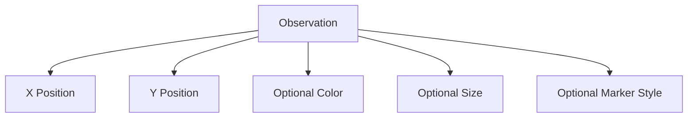
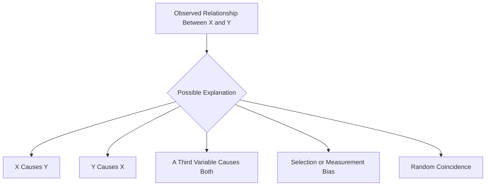
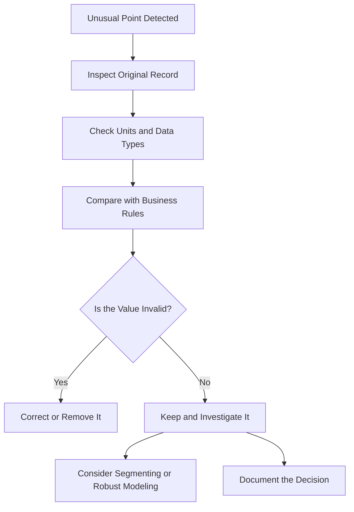
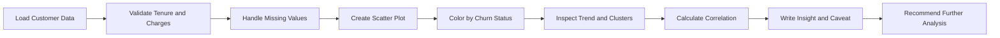
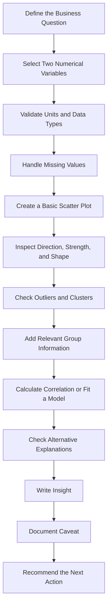

# 015 - Scatter Plot

**Course:** 02 - Coding and EDA
**Module:** Module 05 - Exploratory Data Analysis
**Content Group:** Visualization
**Roadmap Source:** Exploratory Data Analysis / Visualization
**Lesson Type:** Exploratory Data Analysis
**Order in Module:** 015
**Suggested Duration:** 20 minutes

---

## 1. Summary

A **scatter plot** is a visualization used to examine the relationship between two numerical variables.

Each observation is represented by a point:

* The horizontal position represents the value of the first variable.
* The vertical position represents the value of the second variable.

Scatter plots help answer questions such as:

* Do two numerical variables move together?
* Is the relationship positive or negative?
* Is the relationship linear or nonlinear?
* Are there clusters, gaps, or unusual observations?
* Does the relationship differ across customer groups?
* Is there evidence of heteroscedasticity?
* Could one variable help predict another?

In AI and Data Science, scatter plots are commonly used during Exploratory Data Analysis, feature selection, regression analysis, model diagnostics, experiment analysis, and production monitoring.

---

## 2. Learning Objectives

After completing this lesson, you should be able to:

* Explain a scatter plot in your own words.
* Create scatter plots with Matplotlib and Seaborn.
* Identify positive, negative, weak, strong, linear, and nonlinear relationships.
* Detect clusters, outliers, and changing variability.
* Add color, marker size, and style to represent additional variables.
* Add a regression line to visualize a trend.
* Distinguish correlation from causation.
* Write an insight, caveat, and actionable recommendation from a scatter plot.

---

## 3. Main Concept

A scatter plot places one numerical variable on the horizontal axis and another numerical variable on the vertical axis.

Each data point has the form:

$$
(x_i, y_i)
$$

where:

* (x_i) is the value of the first variable for observation (i).
* (y_i) is the value of the second variable for observation (i).

For example, in a customer dataset:

* (x): customer tenure
* (y): total charges

Each point represents one customer.

```text
Total Charges
    ^
    |                         •
    |                    •
    |               •  •
    |          •  •
    |      •
    |  •
    +--------------------------------> Customer Tenure
```

The overall pattern of points helps describe the relationship between the variables.

---

## 4. Scatter Plot in the EDA Workflow


A scatter plot should begin with a clear analytical question.

Examples:

* Does customer tenure increase with total charges?
* Is advertising spending associated with sales?
* Does house size relate to house price?
* Is model confidence associated with prediction accuracy?
* Does API response time increase with request size?
* Are prediction errors larger for high-value observations?

---

## 5. Basic Scatter Plot Structure

A scatter plot contains:

* An `x`-axis for one numerical variable
* A `y`-axis for another numerical variable
* One point for each observation
* Optional color for a categorical or numerical variable
* Optional point size for another numerical variable
* Optional marker style for a category
* Optional trend line



---

## 6. Direction of a Relationship

### 6.1 Positive Relationship

A positive relationship means that larger values of (x) tend to be associated with larger values of (y).

```text
Y
^
|                         •
|                    •
|                •
|           •
|       •
|   •
+--------------------------------> X
```

Examples:

* More advertising spending and higher sales
* Longer customer tenure and higher total charges
* Larger house area and higher house price

A positive relationship does not necessarily mean that one variable causes the other.

---

### 6.2 Negative Relationship

A negative relationship means that larger values of (x) tend to be associated with smaller values of (y).

```text
Y
^
|   •
|       •
|           •
|                •
|                    •
|                         •
+--------------------------------> X
```

Examples:

* Higher product price and lower purchase quantity
* Greater distance from a city center and lower property price
* More model complexity and lower training error

---

### 6.3 No Clear Relationship

A scatter plot may show no obvious pattern.

```text
Y
^
|       •        •
|  •         •
|          •         •
|     •          •
|              •
| •       •
+--------------------------------> X
```

This may mean:

* The variables are weakly related.
* The relationship is hidden by noise.
* The relationship is nonlinear.
* Important grouping variables are missing.
* Data quality is poor.

---

## 7. Strength of a Relationship

### Strong Relationship

Points are concentrated around a clear pattern.

```text
Y
^
|                         •
|                     •
|                 •
|             •
|         •
|     •
+--------------------------------> X
```

### Weak Relationship

Points follow a general direction but are widely dispersed.

```text
Y
^
|                  •      •
|            •
|                       •
|      •          •
|  •          •
|         •
+--------------------------------> X
```

The visual strength of a relationship depends on:

* Point concentration
* Measurement noise
* Sample size
* Outliers
* Hidden groups
* Axis range
* Whether the relationship is linear

---

## 8. Linear and Nonlinear Relationships

### 8.1 Linear Relationship

A linear relationship can be approximately represented by a straight line.

$$
y = \beta_0 + \beta_1 x + \varepsilon
$$

where:

* (\beta_0) is the intercept.
* (\beta_1) is the slope.
* (\varepsilon) represents unexplained variation.

```text
Y
^
|                         •
|                    •
|               •
|          •
|     •
| •
+--------------------------------> X
```

---

### 8.2 Nonlinear Relationship

A nonlinear relationship cannot be described adequately by one straight line.

```text
Y
^
| •                         •
|    •                   •
|       •             •
|          •       •
|             •
+--------------------------------> X
```

Examples include:

* U-shaped relationships
* Exponential growth
* Diminishing returns
* Threshold effects
* Seasonal patterns

A low linear correlation does not prove that no relationship exists.

---

## 9. Pearson Correlation

The Pearson correlation coefficient measures the strength and direction of a linear relationship between two numerical variables.

$$
r =
\frac{
\sum_{i=1}^{n}(x_i-\bar{x})(y_i-\bar{y})
}{
\sqrt{
\sum_{i=1}^{n}(x_i-\bar{x})^2
}
\sqrt{
\sum_{i=1}^{n}(y_i-\bar{y})^2
}
}
$$

The value of (r) is between (-1) and (1):

$$
-1 \leq r \leq 1
$$

General interpretation:

|    Correlation | Typical interpretation              |
| -------------: | ----------------------------------- |
|  (r \approx 1) | Strong positive linear relationship |
|  (r \approx 0) | Weak or no linear relationship      |
| (r \approx -1) | Strong negative linear relationship |

A rough interpretation guide is:

| Absolute correlation | Possible description |
| -------------------: | -------------------- |
|            0.00–0.19 | Very weak            |
|            0.20–0.39 | Weak                 |
|            0.40–0.59 | Moderate             |
|            0.60–0.79 | Strong               |
|            0.80–1.00 | Very strong          |

These boundaries are only guidelines. The business context and sample size must also be considered.

---

## 10. Correlation Is Not Causation

A scatter plot may show that two variables are associated, but it does not prove that one causes the other.

Possible explanations include:

* (X) influences (Y).
* (Y) influences (X).
* A third variable influences both.
* The pattern occurs by chance.
* The data contains selection bias.
* The relationship is created by aggregation.



Example:

> Ice cream sales and drowning incidents may both increase during hot weather. This does not mean that ice cream causes drowning. Temperature is a possible confounding variable.

---

## 11. Creating a Basic Scatter Plot with Matplotlib

```python
import matplotlib.pyplot as plt
import pandas as pd

df = pd.DataFrame(
    {
        "tenure_months": [1, 3, 6, 10, 14, 20, 25, 32, 40, 48],
        "total_charges": [25, 80, 140, 250, 360, 520, 680, 850, 1100, 1400],
    }
)

plt.figure(figsize=(8, 5))

plt.scatter(
    df["tenure_months"],
    df["total_charges"],
)

plt.title("Customer Tenure vs. Total Charges")
plt.xlabel("Tenure (Months)")
plt.ylabel("Total Charges (USD)")
plt.show()
```

Possible interpretation:

> Customers with longer tenure tend to have higher total charges.

This result is expected because total charges accumulate over time.

---

## 12. Creating a Scatter Plot with Pandas

```python
import matplotlib.pyplot as plt
import pandas as pd

df.plot.scatter(
    x="tenure_months",
    y="total_charges",
    figsize=(8, 5),
)

plt.title("Customer Tenure vs. Total Charges")
plt.xlabel("Tenure (Months)")
plt.ylabel("Total Charges (USD)")
plt.show()
```

The Pandas interface is convenient for quick exploratory analysis.

---

## 13. Creating a Scatter Plot with Seaborn

```python
import matplotlib.pyplot as plt
import seaborn as sns

plt.figure(figsize=(8, 5))

sns.scatterplot(
    data=df,
    x="tenure_months",
    y="total_charges",
)

plt.title("Customer Tenure vs. Total Charges")
plt.xlabel("Tenure (Months)")
plt.ylabel("Total Charges (USD)")
plt.show()
```

Seaborn is useful when adding categories, colors, marker styles, or additional variables.

---

## 14. Adding a Categorical Variable with Color

Color can represent a category such as churn status.

```python
import matplotlib.pyplot as plt
import pandas as pd
import seaborn as sns

df = pd.DataFrame(
    {
        "tenure_months": [1, 3, 6, 10, 14, 20, 25, 32, 40, 48],
        "total_charges": [25, 80, 140, 250, 360, 520, 680, 850, 1100, 1400],
        "churn": ["Yes", "Yes", "Yes", "No", "Yes", "No", "No", "No", "No", "No"],
    }
)

plt.figure(figsize=(8, 5))

sns.scatterplot(
    data=df,
    x="tenure_months",
    y="total_charges",
    hue="churn",
)

plt.title("Tenure vs. Total Charges by Churn Status")
plt.xlabel("Tenure (Months)")
plt.ylabel("Total Charges (USD)")
plt.show()
```

Possible insight:

> Churned customers appear more concentrated among customers with shorter tenure.

Caveat:

> The dataset is small, so the apparent grouping may not represent the full customer population.

---

## 15. Adding Point Size

Point size can represent a third numerical variable.

For example:

* Horizontal axis: tenure
* Vertical axis: total charges
* Point size: monthly charges

```python
df["monthly_charges"] = [
    25,
    27,
    30,
    35,
    40,
    45,
    50,
    55,
    60,
    65,
]

plt.figure(figsize=(8, 5))

sns.scatterplot(
    data=df,
    x="tenure_months",
    y="total_charges",
    size="monthly_charges",
    sizes=(40, 300),
)

plt.title("Tenure, Total Charges, and Monthly Charges")
plt.xlabel("Tenure (Months)")
plt.ylabel("Total Charges (USD)")
plt.show()
```

This type of visualization is sometimes called a **bubble chart**.

Avoid using point size when small differences must be compared precisely because humans do not estimate area very accurately.

---

## 16. Adding Marker Style

Marker style can represent another categorical variable.

```python
df["contract_type"] = [
    "Month-to-month",
    "Month-to-month",
    "Month-to-month",
    "One year",
    "Month-to-month",
    "One year",
    "One year",
    "Two year",
    "Two year",
    "Two year",
]

plt.figure(figsize=(9, 6))

sns.scatterplot(
    data=df,
    x="tenure_months",
    y="total_charges",
    hue="churn",
    style="contract_type",
    size="monthly_charges",
    sizes=(40, 250),
)

plt.title("Customer Charge Relationships")
plt.xlabel("Tenure (Months)")
plt.ylabel("Total Charges (USD)")
plt.show()
```

Do not add too many visual encodings at once. Too many colors, sizes, and shapes can make a chart difficult to understand.

---

## 17. Adding a Regression Line

A regression line summarizes the average linear trend between two variables.

```python
import matplotlib.pyplot as plt
import seaborn as sns

plt.figure(figsize=(8, 5))

sns.regplot(
    data=df,
    x="tenure_months",
    y="total_charges",
)

plt.title("Tenure vs. Total Charges with Regression Line")
plt.xlabel("Tenure (Months)")
plt.ylabel("Total Charges (USD)")
plt.show()
```

The fitted linear relationship can be written as:

$$
\hat{y} = \hat{\beta}_0 + \hat{\beta}_1 x
$$

where:

* (\hat{y}) is the predicted value.
* (\hat{\beta}_0) is the estimated intercept.
* (\hat{\beta}_1) is the estimated slope.

The line shows the general trend, but individual observations can still be far from the line.

---

## 18. Calculating Correlation with Pandas

```python
correlation = df[
    [
        "tenure_months",
        "total_charges",
        "monthly_charges",
    ]
].corr()

print(correlation)
```

To calculate the correlation between two specific variables:

```python
correlation_value = df[
    "tenure_months"
].corr(
    df["total_charges"]
)

print(f"Correlation: {correlation_value:.3f}")
```

The correlation value should be interpreted together with the scatter plot.

A high correlation can be affected by outliers, while a low correlation can hide a nonlinear relationship.

---

## 19. Outliers in Scatter Plots

An outlier is an observation that is far from the general pattern.

```text
Y
^
|                             •  Outlier
|
|                   •
|              •
|         •
|    •
+--------------------------------> X
```

An unusual point may represent:

* A data-entry error
* A sensor failure
* A rare but valid observation
* Fraudulent behavior
* A separate population
* An important business case

Never remove an outlier only because it looks unusual.

Use the following process:



---

## 20. Clusters

A scatter plot may contain groups of observations.

```text
Y
^
|     • • •                 • •
|    • • •                • • •
|     • •                  • •
|
|              • • •
|             • • •
+--------------------------------> X
```

Clusters may represent:

* Customer segments
* Product categories
* Geographic regions
* Different operating conditions
* Different classes in a machine-learning problem

A clustering algorithm may help investigate these groups.

Examples include:

* K-Means
* DBSCAN
* Hierarchical clustering
* Gaussian Mixture Models

A visible cluster does not automatically mean that the groups are statistically meaningful.

---

## 21. Heteroscedasticity

Heteroscedasticity occurs when the variability of (y) changes as (x) changes.

```text
Y
^
|                       •      •
|                  •   •
|             •   •
|        •  •
|    • •
|  •
+--------------------------------> X
```

The point cloud may appear narrow at one end and wide at the other.

Heteroscedasticity can matter because standard linear regression assumes constant error variance.

The residual variance assumption is:

$$
\text{Var}(\varepsilon_i \mid X_i) = \sigma^2
$$

Under heteroscedasticity:

$$
\text{Var}(\varepsilon_i \mid X_i) \neq \sigma^2
$$

Possible responses include:

* Transforming the target variable
* Using robust standard errors
* Applying weighted least squares
* Using a different model
* Segmenting the data
* Investigating missing explanatory variables

---

## 22. Overplotting

Overplotting occurs when many points overlap, making the scatter plot difficult to interpret.

```text
Y
^
|       ███████
|      █████████
|       ███████
|         ███
+--------------------------------> X
```

### Solution 1: Add Transparency

```python
plt.figure(figsize=(8, 5))

sns.scatterplot(
    data=df,
    x="tenure_months",
    y="total_charges",
    alpha=0.5,
)

plt.show()
```

### Solution 2: Reduce Marker Size

```python
sns.scatterplot(
    data=df,
    x="tenure_months",
    y="total_charges",
    s=30,
)
```

### Solution 3: Add Jitter

Jitter adds a small amount of random displacement.

It is especially useful when values are discrete.

```python
import numpy as np

jittered_tenure = (
    df["tenure_months"]
    + np.random.normal(
        loc=0,
        scale=0.2,
        size=len(df),
    )
)

plt.scatter(
    jittered_tenure,
    df["total_charges"],
    alpha=0.6,
)

plt.xlabel("Tenure with Jitter")
plt.ylabel("Total Charges")
plt.show()
```

### Solution 4: Use a Hexbin Plot

```python
plt.figure(figsize=(8, 5))

plt.hexbin(
    df["tenure_months"],
    df["total_charges"],
    gridsize=20,
    mincnt=1,
)

plt.title("Density of Customer Observations")
plt.xlabel("Tenure (Months)")
plt.ylabel("Total Charges (USD)")
plt.show()
```

For very large datasets, hexbin plots or density plots are often more readable than individual points.

---

## 23. Logarithmic Scales

When a variable has a very wide range, a logarithmic scale may improve readability.

```python
plt.figure(figsize=(8, 5))

sns.scatterplot(
    data=df,
    x="tenure_months",
    y="total_charges",
)

plt.yscale("log")

plt.title("Tenure vs. Total Charges on a Log Scale")
plt.xlabel("Tenure (Months)")
plt.ylabel("Total Charges - Log Scale")
plt.show()
```

A common transformation is:

$$
x_{\text{new}} = \log(1+x)
$$

Python example:

```python
import numpy as np

df["log_total_charges"] = np.log1p(
    df["total_charges"]
)
```

Use logarithmic transformations carefully when:

* Zero values exist
* Negative values exist
* The business interpretation depends on the original scale

---

## 24. Scatter Plot Matrix

A scatter plot matrix compares multiple numerical variables.

```python
import matplotlib.pyplot as plt
import seaborn as sns

selected_columns = [
    "tenure_months",
    "monthly_charges",
    "total_charges",
]

sns.pairplot(
    df[selected_columns]
)

plt.show()
```

A scatter plot matrix can help identify:

* Strong relationships
* Redundant features
* Nonlinear patterns
* Outliers
* Clusters
* Skewed distributions

Avoid using too many variables because the number of plots increases quickly.

For (p) variables, a full scatter plot matrix contains approximately:

$$
p^2
$$

panels.

---

## 25. Business Example: Customer Churn

### Business Question

> How are tenure and total charges related, and does the relationship differ by churn status?

### Analysis Workflow



### Example Code

```python
import matplotlib.pyplot as plt
import pandas as pd
import seaborn as sns

df = pd.read_csv("customer_churn.csv")

analysis_df = df[
    [
        "customer_id",
        "tenure",
        "monthly_charges",
        "total_charges",
        "churn",
    ]
].copy()

analysis_df["tenure"] = pd.to_numeric(
    analysis_df["tenure"],
    errors="coerce",
)

analysis_df["total_charges"] = pd.to_numeric(
    analysis_df["total_charges"],
    errors="coerce",
)

analysis_df = analysis_df.dropna(
    subset=[
        "tenure",
        "total_charges",
        "churn",
    ]
)

plt.figure(figsize=(9, 6))

sns.scatterplot(
    data=analysis_df,
    x="tenure",
    y="total_charges",
    hue="churn",
    alpha=0.7,
)

plt.title("Tenure vs. Total Charges by Churn Status")
plt.xlabel("Tenure (Months)")
plt.ylabel("Total Charges (USD)")
plt.show()
```

### Example Insight

> Total charges increase with customer tenure, which is expected because charges accumulate over time. Churned customers appear more concentrated in the low-tenure region.

### Caveat

> The relationship between tenure and total charges is partly mechanical. Total charges depend directly on both tenure and monthly charges.

### Recommendation

> Analyze churn separately across tenure bands and compare monthly charges, contract types, and support interactions within each band.

---

## 26. Derived Relationship in Customer Data

In many subscription datasets, total charges can be approximated as:

$$
\text{Total Charges}
\approx
\text{Monthly Charges}
\times
\text{Tenure}
$$

This means that the relationship between total charges and tenure is partly defined by how the variables are constructed.

A strong correlation does not necessarily provide a new business insight.

Before interpreting a relationship, ask:

* Is one variable derived from the other?
* Do the variables contain overlapping information?
* Could using both variables cause multicollinearity?
* Could one feature leak information about the target?

---

## 27. Scatter Plots in Machine Learning

Scatter plots can support several stages of the machine-learning workflow.

### 27.1 Feature Analysis

Scatter plots can reveal:

* Linear relationships
* Nonlinear relationships
* Redundant variables
* Feature interactions
* Outliers
* Clusters

### 27.2 Regression Diagnostics

Plot predicted values against actual values.

```python
plt.figure(figsize=(7, 7))

plt.scatter(
    y_true,
    y_pred,
    alpha=0.6,
)

minimum = min(y_true.min(), y_pred.min())
maximum = max(y_true.max(), y_pred.max())

plt.plot(
    [minimum, maximum],
    [minimum, maximum],
)

plt.title("Actual vs. Predicted Values")
plt.xlabel("Actual Values")
plt.ylabel("Predicted Values")
plt.show()
```

An ideal prediction satisfies:

$$
\hat{y}_i = y_i
$$

Therefore, ideal points lie near the line:

$$
y = x
$$

---

### 27.3 Residual Analysis

A residual is the difference between an observed value and its prediction.

$$
e_i = y_i - \hat{y}_i
$$

Create a residual plot:

```python
residuals = y_true - y_pred

plt.figure(figsize=(8, 5))

plt.scatter(
    y_pred,
    residuals,
    alpha=0.6,
)

plt.axhline(
    y=0,
)

plt.title("Residual Plot")
plt.xlabel("Predicted Values")
plt.ylabel("Residuals")
plt.show()
```

A good residual plot usually shows:

* Points distributed around zero
* No clear curve
* Approximately constant spread
* Few extreme observations

Patterns may indicate:

* Missing nonlinear terms
* Heteroscedasticity
* Outliers
* Data leakage
* Model bias

---

### 27.4 Classification Analysis

Scatter plots can visualize two numerical features with color representing the target class.

```python
sns.scatterplot(
    data=df,
    x="feature_1",
    y="feature_2",
    hue="target",
)

plt.title("Feature Space by Target Class")
plt.show()
```

This can help assess:

* Class separation
* Class overlap
* Possible decision boundaries
* Mislabelled observations
* Minority clusters

A two-dimensional scatter plot cannot fully represent relationships in a high-dimensional feature space.

---

## 28. Scatter Plots for Experiments

Scatter plots can visualize relationships between experiment metrics.

Examples:

* Exposure frequency versus conversion rate
* Model latency versus accuracy
* Discount size versus order value
* User engagement versus retention
* Experiment effect versus sample size

A scatter plot can help identify trade-offs.

```text
Model Accuracy
^
|                • Model C
|       • Model B
|  • Model A
|
+--------------------------------> Inference Latency
```

A model with higher accuracy may also have greater latency.

The best model depends on deployment constraints, not only predictive performance.

---

## 29. Scatter Plots for Production Monitoring

Scatter plots can support monitoring of:

* Request size versus API latency
* CPU usage versus throughput
* Model confidence versus prediction error
* Traffic volume versus failure rate
* Feature values versus prediction scores
* Data age versus model performance

Example:

```python
sns.scatterplot(
    data=monitoring_df,
    x="request_size_kb",
    y="latency_ms",
    hue="environment",
    alpha=0.5,
)

plt.title("Request Size vs. API Latency")
plt.xlabel("Request Size (KB)")
plt.ylabel("Latency (ms)")
plt.show()
```

Possible insight:

> API latency increases with request size, but the production environment contains a separate group of high-latency requests that should be investigated.

---

## 30. Common Interpretation Patterns

### Pattern 1: Strong Positive Linear Relationship

```text
Y
^
|                         •
|                    •
|               •
|          •
|     •
| •
+--------------------------------> X
```

Interpretation:

> Larger values of (X) are strongly associated with larger values of (Y).

---

### Pattern 2: Strong Negative Linear Relationship

```text
Y
^
| •
|     •
|          •
|               •
|                    •
|                         •
+--------------------------------> X
```

Interpretation:

> Larger values of (X) are strongly associated with smaller values of (Y).

---

### Pattern 3: Nonlinear Relationship

```text
Y
^
| •                         •
|    •                   •
|       •             •
|          •       •
|             •
+--------------------------------> X
```

Interpretation:

> The variables are related, but a straight-line model may not describe the relationship well.

---

### Pattern 4: Separate Clusters

```text
Y
^
|   • • •                  • • •
|    • •                  • •
|
|             • • •
|            • • •
+--------------------------------> X
```

Interpretation:

> The dataset may contain multiple subgroups or operating conditions.

---

### Pattern 5: Funnel Shape

```text
Y
^
|                       •       •
|                  •  •
|             •  •
|        • •
|    •
+--------------------------------> X
```

Interpretation:

> The variability of (Y) increases with (X), suggesting possible heteroscedasticity.

---

### Pattern 6: One Influential Outlier

```text
Y
^
|                               •
|
|
| • • • • • • •
+--------------------------------> X
```

Interpretation:

> One unusual observation may strongly affect the correlation or fitted regression line.

---

## 31. Common Mistakes

### Mistake 1: Assuming Correlation Means Causation

Incorrect conclusion:

> Advertising spending causes higher sales because the scatter plot slopes upward.

Better conclusion:

> Advertising spending and sales are positively associated. A controlled experiment or causal analysis is needed to estimate the causal effect.

---

### Mistake 2: Using Categorical Variables on Both Axes

A standard scatter plot requires two numerical axes.

Incorrect:

```python
sns.scatterplot(
    data=df,
    x="contract_type",
    y="payment_method",
)
```

Better options include:

* Count plot
* Grouped bar chart
* Heatmap
* Mosaic plot

---

### Mistake 3: Ignoring Overplotting

When many observations overlap, the visible points may not represent the true density.

Possible solutions:

* Use transparency
* Reduce marker size
* Add jitter
* Sample observations
* Use a hexbin plot
* Use a density plot

---

### Mistake 4: Adding Too Many Visual Dimensions

Using color, size, shape, labels, and animation at the same time can make a chart unreadable.

Prefer one or two additional encodings.

---

### Mistake 5: Hiding Outliers by Changing the Axis Range

Changing the axis limits can remove important observations from view.

Always document intentional filtering or axis truncation.

---

### Mistake 6: Interpreting a Nonlinear Pattern with Pearson Correlation Alone

Pearson correlation measures linear association.

A U-shaped relationship may have:

$$
r \approx 0
$$

even when the variables are strongly related.

---

### Mistake 7: Ignoring Derived Variables

A high relationship may be expected if one variable is calculated from another.

Example:

$$
\text{Total Charges}
\approx
\text{Monthly Charges}
\times
\text{Tenure}
$$

---

### Mistake 8: Reporting Only the Chart

Weak conclusion:

> The scatter plot shows tenure and total charges.

Better conclusion:

> Total charges increase with tenure, while churned customers are concentrated among low-tenure observations. Because total charges accumulate over time, monthly charges and contract type should be examined before interpreting this as a churn driver.

---

## 32. Recommended Analysis Pattern



Reusable workflow:

```text
Business question
        ->
Validate variables
        ->
Create scatter plot
        ->
Inspect direction and shape
        ->
Check clusters and outliers
        ->
Calculate supporting statistics
        ->
Write insight
        ->
Document caveat
        ->
Recommend an action
```

---

## 33. Practical Exercise

Use a customer churn CSV dataset.

### Task 1: Load the Dataset

```python
import pandas as pd

df = pd.read_csv("customer_churn.csv")

print(df.head())
```

### Task 2: Inspect the Dataset

```python
print(df.info())
print(df.describe())
print(df.isna().sum())
```

### Task 3: Select Variables

Choose:

* `tenure`
* `monthly_charges`
* `total_charges`
* `churn`

### Task 4: Convert Numerical Columns

```python
numeric_columns = [
    "tenure",
    "monthly_charges",
    "total_charges",
]

for column in numeric_columns:
    df[column] = pd.to_numeric(
        df[column],
        errors="coerce",
    )
```

### Task 5: Handle Missing Values

```python
analysis_df = df[
    [
        "tenure",
        "monthly_charges",
        "total_charges",
        "churn",
    ]
].dropna()

print(analysis_df.isna().sum())
```

### Task 6: Create a Basic Scatter Plot

```python
import matplotlib.pyplot as plt
import seaborn as sns

plt.figure(figsize=(8, 5))

sns.scatterplot(
    data=analysis_df,
    x="tenure",
    y="total_charges",
    alpha=0.6,
)

plt.title("Tenure vs. Total Charges")
plt.xlabel("Tenure (Months)")
plt.ylabel("Total Charges (USD)")
plt.show()
```

### Task 7: Add Churn Status

```python
plt.figure(figsize=(9, 6))

sns.scatterplot(
    data=analysis_df,
    x="tenure",
    y="total_charges",
    hue="churn",
    alpha=0.7,
)

plt.title("Tenure vs. Total Charges by Churn Status")
plt.xlabel("Tenure (Months)")
plt.ylabel("Total Charges (USD)")
plt.show()
```

### Task 8: Add Monthly Charges as Point Size

```python
plt.figure(figsize=(9, 6))

sns.scatterplot(
    data=analysis_df,
    x="tenure",
    y="total_charges",
    hue="churn",
    size="monthly_charges",
    sizes=(20, 250),
    alpha=0.7,
)

plt.title("Customer Charge Relationships")
plt.xlabel("Tenure (Months)")
plt.ylabel("Total Charges (USD)")
plt.show()
```

### Task 9: Calculate Correlations

```python
correlation_matrix = analysis_df[
    [
        "tenure",
        "monthly_charges",
        "total_charges",
    ]
].corr()

print(correlation_matrix)
```

### Task 10: Create a Regression Plot

```python
plt.figure(figsize=(8, 5))

sns.regplot(
    data=analysis_df,
    x="tenure",
    y="total_charges",
    scatter_kws={
        "alpha": 0.4,
    },
)

plt.title("Tenure vs. Total Charges with Trend Line")
plt.xlabel("Tenure (Months)")
plt.ylabel("Total Charges (USD)")
plt.show()
```

### Task 11: Investigate Unusual Observations

```python
unusual_customers = analysis_df[
    (analysis_df["tenure"] < 6)
    & (analysis_df["total_charges"] > 1000)
]

print(unusual_customers)
```

Do not assume that these observations are invalid. Check:

* Units
* Billing periods
* Data-entry errors
* Customer plans
* One-time charges
* Migration history

### Task 12: Write Three Insights

For each insight, include:

1. Observation
2. Supporting evidence
3. Business interpretation
4. Caveat
5. Recommendation

Example:

> Total charges increase strongly with tenure, which is expected because charges accumulate over time. Churned customers appear more concentrated at shorter tenure levels. However, total charges are partly derived from tenure and monthly charges, so the next analysis should compare churn within similar tenure and contract groups.

---

## 34. Mini-Project Connection

### Project

**Customer Churn EDA with Data Cleaning, Churn Analysis, Related Features, and an Insight Report**

### Suggested Scatter Plots

Create scatter plots for:

* Tenure versus total charges
* Monthly charges versus total charges
* Tenure versus monthly charges
* Support calls versus monthly charges
* Satisfaction score versus tenure
* Usage level versus monthly charges
* Prediction probability versus tenure
* Actual churn risk versus predicted churn risk

### Suggested Questions

* Do longer-tenure customers accumulate higher charges?
* Are high monthly charges associated with churn?
* Are there distinct customer groups?
* Do churned customers occupy a specific region of the feature space?
* Are there unusual high-charge, low-tenure customers?
* Does model performance differ across customer segments?

### Suggested Portfolio Artifacts

The project can produce:

* A reproducible Jupyter Notebook
* A cleaned CSV file
* A data-quality report
* Scatter plots and correlation tables
* Outlier investigation notes
* A customer segmentation hypothesis
* A business insight report
* A dashboard section
* A model-diagnostic notebook

---

## 35. Example Insight Template

### Observation

Describe the visible relationship.

> Total charges increase as customer tenure increases.

### Evidence

Include a visual or numerical measurement.

> The scatter plot shows a strong positive trend, and the Pearson correlation is 0.83.

### Interpretation

Explain the possible business meaning.

> Customers with longer relationships accumulate more total charges.

### Caveat

Explain what the chart does not prove.

> Total charges are partly calculated from tenure and monthly charges, so the relationship is expected and does not prove that tenure directly improves customer value.

### Recommendation

Suggest the next action.

> Compare monthly revenue, churn probability, and support costs across tenure groups to measure customer value more accurately.

---

## 36. Completion Checklist

* [ ] I can explain a scatter plot in one or two minutes.
* [ ] I can identify positive, negative, weak, and strong relationships.
* [ ] I can recognize linear and nonlinear patterns.
* [ ] I understand that correlation does not imply causation.
* [ ] I can create a scatter plot with Matplotlib, Pandas, or Seaborn.
* [ ] I can add color, point size, and marker style.
* [ ] I can add a regression line.
* [ ] I can calculate and interpret Pearson correlation.
* [ ] I can detect outliers, clusters, and overplotting.
* [ ] I can recognize possible heteroscedasticity.
* [ ] I can use scatter plots for model diagnostics.
* [ ] I have created at least one reproducible notebook.
* [ ] I have written at least one insight, caveat, and recommendation.

---

## 37. Related Outcome

Understand, clean, visualize, and explain datasets using business-oriented insights.

---

## 38. Related Project

**Mini Project:** Customer Churn EDA with data cleaning, churn analysis, related-feature analysis, visualizations, and an insight report.

---

## 39. Summary

A **scatter plot** is a visualization used to examine the relationship between two numerical variables.

Each point represents one observation:

$$
(x_i, y_i)
$$

Scatter plots can reveal:

* Direction
* Strength
* Linear relationships
* Nonlinear relationships
* Clusters
* Outliers
* Changing variability
* Differences between groups

The Pearson correlation coefficient summarizes linear association:

$$
-1 \leq r \leq 1
$$

However, correlation does not prove causation, and a low correlation does not prove that no relationship exists.

A strong scatter-plot analysis combines:

* A clear business question
* Data validation
* A well-labelled chart
* Correlation or trend analysis
* Outlier investigation
* Consideration of hidden variables
* An insight
* A caveat
* An actionable recommendation

```text
Business question
        ->
Validate data
        ->
Create scatter plot
        ->
Inspect direction and shape
        ->
Check clusters and outliers
        ->
Calculate supporting statistics
        ->
Write insight and caveat
        ->
Recommend the next action
```

A scatter plot is not only a chart. It is a tool for discovering relationships, testing modeling assumptions, finding unusual observations, and turning numerical patterns into analytical questions.
