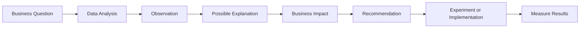
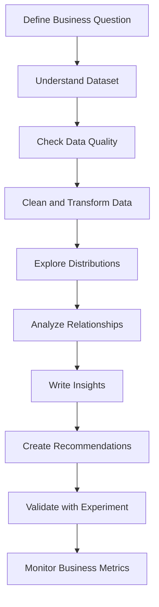
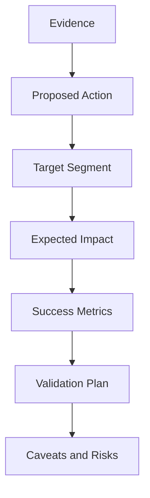
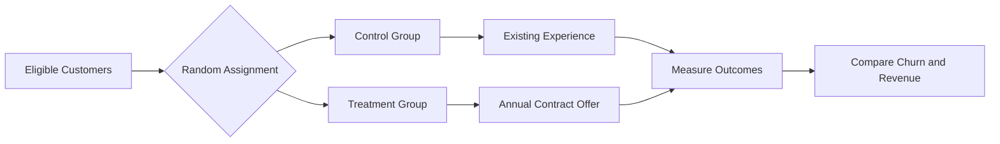
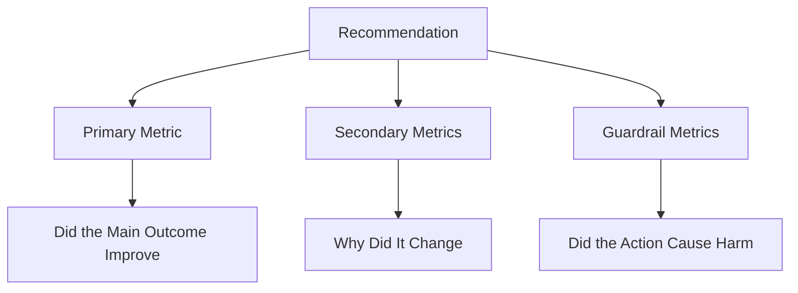

# 021 - Business Recommendation

**Course:** 02 - Coding and EDA
**Module:** Module 05 - Exploratory Data Analysis
**Content Group:** Insight Reporting
**Roadmap Source:** Exploratory Data Analysis / Insight Reporting
**Lesson Type:** Exploratory Data Analysis
**Lesson Order:** 021
**Suggested Duration:** 20 minutes

---

## 1. Overview

A **Business Recommendation** is an evidence-based suggestion that explains what an organization should do after analyzing data.

Exploratory Data Analysis does not end when charts, statistics, or correlations are produced. The final purpose of EDA is to convert analytical findings into decisions that can improve a business outcome.

A strong recommendation connects:

* a business question;
* an observation from the data;
* a possible explanation;
* the expected business impact;
* a specific action;
* a measurable success metric.

A useful recommendation should answer the following question:

> Based on the available evidence, what should the business do next?

---

## 2. Learning Objectives

After completing this lesson, you should be able to:

* Explain **Business Recommendation** in your own words.
* Identify its role in the AI and Data Science workflow.
* Convert analytical findings into practical business actions.
* Distinguish between an observation, an insight, and a recommendation.
* Support recommendations with metrics, charts, tables, or experiments.
* Document assumptions, limitations, risks, and expected outcomes.
* Apply the concept to a dataset, notebook, dashboard, experiment, or portfolio project.

---

## 3. What Is a Business Recommendation?

A business recommendation is a proposed action supported by data and connected to a business objective.

It should not simply describe what happened. It should explain what action should be considered and why that action may improve an important outcome.

For example:

* **Observation:** Customers on monthly contracts have a higher churn rate.
* **Insight:** Short-term contracts may reduce customer commitment.
* **Recommendation:** Offer a discount or additional benefit to customers who switch from monthly to annual contracts.
* **Success metric:** Measure the change in churn rate and annual-contract adoption rate.

A recommendation must be:

* **Specific:** It identifies a clear action.
* **Evidence-based:** It is supported by data.
* **Relevant:** It addresses an important business problem.
* **Feasible:** The organization can realistically implement it.
* **Measurable:** Its impact can be evaluated.
* **Risk-aware:** It acknowledges limitations and possible side effects.

---

## 4. Observation, Insight, and Recommendation

These concepts are related, but they are not identical.

| Level          | Main Question                | Example                                                                     |
| -------------- | ---------------------------- | --------------------------------------------------------------------------- |
| Observation    | What happened?               | Monthly-contract customers have a churn rate of 42%.                        |
| Explanation    | Why might it have happened?  | These customers have lower switching costs and weaker commitment.           |
| Impact         | Why does it matter?          | High churn increases acquisition costs and reduces customer lifetime value. |
| Recommendation | What should the business do? | Test an annual-contract incentive for high-risk monthly customers.          |

The complete reasoning process can be represented as:



A recommendation without supporting evidence is only an opinion.

An observation without a recommendation may be informative, but it may not help decision-makers take action.

---

## 5. Role in the Data Science Workflow

Business recommendations appear near the end of an analysis cycle, but they depend on every earlier step.



A typical EDA workflow is:

```text
business question
-> dataset schema
-> quality checks
-> distributions
-> relationships
-> observations
-> explanations
-> business impact
-> recommendations
-> validation
```

Each step contributes to recommendation quality.

For example:

* Incorrect data types can produce misleading statistics.
* Missing values can create biased customer segments.
* Confounding variables can produce false explanations.
* Small sample sizes can make recommendations unreliable.
* Correlation may be incorrectly interpreted as causation.

Therefore, recommendations should always include appropriate caveats.

---

## 6. Structure of a Strong Recommendation

A practical recommendation can follow this structure:

```text
Because [evidence],
we recommend [specific action]
for [target group or process]
to improve [business objective].

The action should be evaluated using [success metrics]
over [time period or experiment duration].

Important limitations include [assumptions or caveats].
```

### Example

```text
Because customers with more than three support tickets have a churn
rate approximately twice the dataset average, we recommend creating
a proactive retention workflow for customers who submit their third
ticket within a 30-day period.

The workflow should be tested using a randomized experiment and
evaluated with churn rate, customer satisfaction, retention rate,
and support cost per customer.

This recommendation assumes that repeated support interactions are
identified before the customer has already decided to leave.
```

---

## 7. Recommendation Framework

A useful framework is:

1. **Evidence**
2. **Action**
3. **Target**
4. **Expected impact**
5. **Validation**
6. **Caveat**

| Component       | Question                                                 |
| --------------- | -------------------------------------------------------- |
| Evidence        | What data supports the recommendation?                   |
| Action          | What should the business do?                             |
| Target          | Which customer, product, region, or process is affected? |
| Expected impact | Which outcome should improve?                            |
| Validation      | How will the organization test the recommendation?       |
| Caveat          | What uncertainty or limitation should be considered?     |



---

## 8. Example: Customer Churn Analysis

Assume an EDA project produces the following results:

| Customer group    | Churn rate |
| ----------------- | ---------: |
| Monthly contract  |        42% |
| One-year contract |        11% |
| Two-year contract |         4% |
| Dataset average   |        26% |

Additional analysis shows that monthly-contract customers with high support usage have the highest churn rate.

### Observation

Customers with monthly contracts churn more frequently than customers with long-term contracts.

### Possible Explanation

Monthly contracts create fewer barriers to cancellation. Customers experiencing repeated service problems can leave immediately without waiting for a contract period to end.

### Business Impact

High churn can:

* reduce recurring revenue;
* increase customer acquisition costs;
* lower customer lifetime value;
* increase pressure on sales and marketing teams.

### Recommendation

Offer a targeted annual-contract incentive to monthly customers who have:

* used the service for at least three months;
* submitted multiple support tickets;
* shown declining product usage;
* not already requested cancellation.

### Validation Plan

Run an A/B test:

* **Control group:** Existing customer experience.
* **Treatment group:** Annual-contract offer with a defined incentive.
* **Primary metric:** Churn rate.
* **Secondary metrics:** Offer acceptance, revenue, customer satisfaction, and support cost.



---

## 9. Prioritizing Recommendations

An analysis may produce many possible recommendations. They should not all be treated equally.

A simple prioritization method evaluates:

* expected business impact;
* implementation effort;
* confidence in the evidence;
* implementation risk;
* time required to observe results.

A basic priority score can be defined as:

```text
Priority Score = Expected Impact x Confidence / Effort
```

This is not a universal business formula. It is a practical ranking method.

| Recommendation                        | Impact | Confidence | Effort | Priority |
| ------------------------------------- | -----: | ---------: | -----: | -------: |
| Targeted retention email              |      4 |          4 |      2 |      8.0 |
| Redesign full onboarding              |      5 |          3 |      5 |      3.0 |
| Improve third support-ticket response |      4 |          5 |      2 |     10.0 |

The highest score does not automatically mean the recommendation should be implemented. Legal, ethical, operational, and strategic considerations must also be reviewed.

---

## 10. Actionability Levels

Recommendations can have different levels of actionability.

### Weak Recommendation

> The company should improve customer retention.

This is too broad. It does not explain:

* which customers should be targeted;
* which action should be taken;
* why the action is appropriate;
* how success should be measured.

### Better Recommendation

> The company should contact customers with high support-ticket counts.

This identifies a target group but still lacks details.

### Strong Recommendation

> Create a proactive support workflow for monthly-contract customers immediately after their third support ticket within 30 days. Test the workflow against the current process and measure 60-day churn, satisfaction, and support resolution time.

This version defines:

* the target segment;
* the trigger;
* the action;
* the comparison method;
* the success metrics.

---

## 11. Correlation Is Not Causation

EDA commonly identifies associations, but an association does not prove that one variable causes another.

For example:

> Customers who contact support frequently have a high churn rate.

This does not necessarily mean support contact causes churn.

Possible alternative explanations include:

* customers already have serious product problems;
* dissatisfied customers contact support more frequently;
* complex customers need more assistance;
* certain customer segments use both the product and support differently.

A careful recommendation should use language such as:

* “is associated with”;
* “may indicate”;
* “suggests”;
* “should be tested”;
* “requires further validation.”

Avoid unsupported causal claims such as:

* “Support tickets cause churn.”
* “Discounts will definitely increase retention.”
* “This feature guarantees higher revenue.”

---

## 12. Metrics for Evaluating Recommendations

Each recommendation should be connected to one or more measurable outcomes.

### Primary Metrics

Primary metrics measure the main objective.

Examples:

* churn rate;
* conversion rate;
* customer retention;
* monthly recurring revenue;
* average order value;
* defect rate;
* delivery time.

### Secondary Metrics

Secondary metrics explain how or why the result changed.

Examples:

* feature usage;
* email open rate;
* support ticket volume;
* offer acceptance rate;
* session frequency.

### Guardrail Metrics

Guardrail metrics detect harmful side effects.

Examples:

* refund rate;
* complaint rate;
* unsubscribe rate;
* customer satisfaction;
* system latency;
* operational cost.



---

## 13. Common Mistakes

### 13.1 Repeating the Observation

Weak:

> Churn is high among monthly customers. Therefore, the company should focus on monthly customers.

The action is not specific enough.

### 13.2 Giving Generic Advice

Weak:

> Improve customer experience.

This does not define what should change.

### 13.3 Ignoring Business Cost

A recommendation may improve a metric but cost more than the value it creates.

### 13.4 Treating Correlation as Causation

A relationship discovered during EDA should usually be validated before large-scale implementation.

### 13.5 Ignoring Target Segments

A recommendation applied to every customer may be inefficient or harmful.

### 13.6 Missing Success Metrics

Without metrics, the business cannot determine whether the recommendation worked.

### 13.7 Hiding Uncertainty

Recommendations should state data limitations, assumptions, and confidence levels.

### 13.8 Producing Non-Reproducible Analysis

Manual data edits and undocumented transformations make recommendations difficult to verify.

### 13.9 Showing Charts Without Interpretation

A chart is evidence, not a complete business conclusion.

### 13.10 Recommending Too Many Actions

Decision-makers need prioritized actions, not an unranked list of every possible idea.

---

## 14. Practical Exercise

Use a small CSV dataset, such as a customer churn, sales, marketing, or e-commerce dataset.

### Tasks

1. Define one business question.
2. Inspect the dataset schema.
3. Check missing values, duplicates, data types, and outliers.
4. Create at least three relevant charts or summary tables.
5. Write three observations supported by numbers.
6. Convert each observation into an explanation and business impact.
7. Create at least two actionable recommendations.
8. Define a success metric for each recommendation.
9. Add at least one caveat or assumption.
10. Prioritize the recommendations by impact, confidence, and effort.

### Suggested Output Table

| Evidence                         | Explanation                | Impact          | Recommendation                 | Metric           | Caveat                        |
| -------------------------------- | -------------------------- | --------------- | ------------------------------ | ---------------- | ----------------------------- |
| Monthly users churn at 42%       | Low contractual commitment | Revenue loss    | Test annual-plan incentive     | Churn rate       | Selection bias may exist      |
| High ticket users churn at 51%   | Repeated service problems  | Lower retention | Add proactive support trigger  | 60-day retention | Ticket count may be a symptom |
| New users churn during month one | Weak onboarding            | Low activation  | Redesign first-week onboarding | Activation rate  | Cohorts may differ            |

---

## 15. Portfolio Artifact

A strong portfolio artifact for this lesson may include:

```text
customer-churn-recommendation/
|
|-- data/
|   |-- raw/
|   `-- processed/
|
|-- notebooks/
|   `-- churn_eda.ipynb
|
|-- reports/
|   `-- business_recommendations.md
|
|-- figures/
|   |-- churn_by_contract.png
|   `-- churn_by_support_tickets.png
|
|-- src/
|   `-- preprocessing.py
|
|-- README.md
`-- requirements.txt
```

The final report should include:

* the business problem;
* the dataset and scope;
* data quality findings;
* important observations;
* explanations and caveats;
* prioritized recommendations;
* proposed experiments;
* evaluation metrics.

---

## 16. Completion Checklist

* [ ] I can explain **Business Recommendation** in one or two minutes.
* [ ] I can distinguish an observation from a recommendation.
* [ ] My recommendation is supported by data.
* [ ] I identified a specific action.
* [ ] I defined the target customer, product, or process.
* [ ] I connected the action to a business objective.
* [ ] I defined primary and guardrail metrics.
* [ ] I documented assumptions and limitations.
* [ ] I avoided treating correlation as causation.
* [ ] I included a validation or experiment plan.
* [ ] My analysis is reproducible.
* [ ] I created a notebook, report, dashboard, query, API, or portfolio artifact.

---

## 17. Related Outcome

Understand, clean, visualize, and explain datasets using business-oriented insights and actionable recommendations.

---

## 18. Related Project

### Mini Project: Customer Churn EDA and Recommendation Report

The project should include:

* data cleaning;
* churn distribution analysis;
* customer segmentation;
* feature relationship analysis;
* three evidence-based insights;
* two or more prioritized recommendations;
* caveats and assumptions;
* an A/B testing or validation proposal.

Possible final deliverables:

* Jupyter Notebook;
* executive summary;
* recommendation table;
* dashboard;
* experiment plan;
* portfolio README.

---

## 19. Summary

A **Business Recommendation** converts analytical evidence into a practical decision.

The complete process is:

```text
Business Question
-> Data
-> Analysis
-> Observation
-> Explanation
-> Impact
-> Recommendation
-> Validation
-> Measurement
```

A high-quality recommendation should be:

* supported by evidence;
* connected to a business objective;
* specific and feasible;
* targeted to the correct segment;
* measurable through defined metrics;
* transparent about uncertainty;
* validated before large-scale implementation.

The value of EDA is not only discovering patterns. Its greater value comes from helping people make better, safer, and more measurable decisions.

---

# Bài luyện tập

## Mục tiêu


## Đề bài


## Yêu cầu hoàn thành

- [ ] 
- [ ] 
- [ ] 

## Kết quả / lời giải


## Ghi chú
