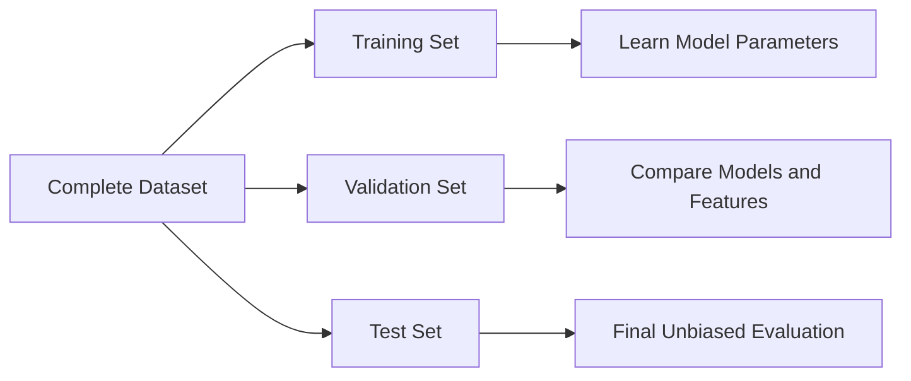
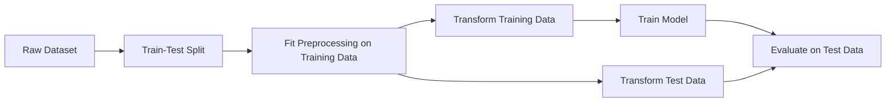
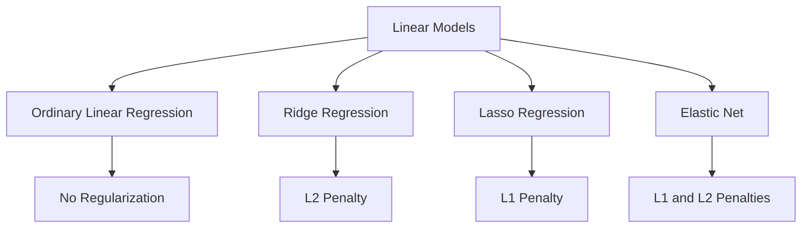
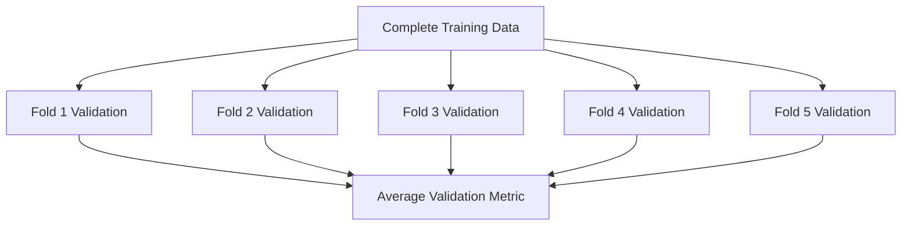

# 002 - Linear Regression

**Course:** 03 - Machine Learning and Deep Learning
**Module:** Module 06 - Machine Learning
**Content Group:** Supervised Learning
**Roadmap Source:** Machine Learning / Supervised Learning
**Lesson Type:** Machine Learning
**Order in Module:** 002
**Suggested Duration:** 26 minutes

---

## 1. Summary

This lesson explains **Linear Regression** in the context of AI and Data Science.

Linear Regression is a supervised learning algorithm used to predict a **continuous numerical value**. It estimates the relationship between one or more input features and a numerical target variable by fitting a linear equation to the observed data.

Typical applications include:

* Predicting house prices
* Estimating sales revenue
* Forecasting product demand
* Predicting delivery time
* Estimating energy consumption
* Measuring the effect of business variables

After completing this lesson, you should understand how Linear Regression works, how it is trained, how to evaluate it, and how to apply it in a practical machine learning workflow.

---

## 2. Learning Objectives

By the end of this lesson, you should be able to:

* Explain Linear Regression in your own words.
* Identify regression problems in real-world datasets.
* Understand the mathematical equation behind Linear Regression.
* Distinguish between simple and multiple Linear Regression.
* Train a Linear Regression model using Python and scikit-learn.
* Evaluate regression performance using appropriate metrics.
* Interpret coefficients and predictions.
* Recognize the main assumptions of Linear Regression.
* Detect common problems such as data leakage, outliers, and multicollinearity.
* Compare Linear Regression with a baseline and more complex models.

---

## 3. What Is Linear Regression?

Linear Regression models the relationship between:

* One or more input features, usually represented by (X)
* A continuous target variable, usually represented by (y)

The model assumes that the target can be approximated as a linear combination of the input features.

For one feature, the model is:

$$
\hat{y} = b_0 + b_1x
$$

Where:

* (\hat{y}) is the predicted value.
* (x) is the input feature.
* (b_0) is the intercept.
* (b_1) is the coefficient or slope.

The model finds the line that best fits the observed data.

```text
Target value
    ^
    |
    |                         *
    |                    * 
    |                *       Predicted regression line
    |           *  /
    |        *   /
    |     *    /
    |  *     /
    +---------------------------------> Input feature
```

---

## 4. Simple Linear Regression

Simple Linear Regression uses exactly one input feature.

For example, suppose we want to predict house price from house size.

The model can be written as:

$$
\widehat{\text{price}} = b_0 + b_1 \times \text{size}
$$

Example:

$$
\widehat{\text{price}} = 50{,}000 + 200 \times \text{size}
$$

For a house with an area of (1{,}000) square feet:

$$
\widehat{\text{price}} = 50{,}000 + 200 \times 1{,}000
$$

$$
\widehat{\text{price}} = 250{,}000
$$

In this example:

* The intercept is (50{,}000).
* The coefficient for size is (200).
* Every additional square foot increases the predicted price by (200), assuming the relationship remains linear.

---

## 5. Multiple Linear Regression

Multiple Linear Regression uses two or more input features.

The general equation is:

$$
\hat{y} = b_0 + b_1x_1 + b_2x_2 + \cdots + b_px_p
$$

Where:

* (x_1, x_2, \ldots, x_p) are input features.
* (b_1, b_2, \ldots, b_p) are feature coefficients.
* (b_0) is the intercept.

For a house-price prediction problem:

$$
\widehat{\text{price}} = b_0 + b_1(\text{size}) + b_2(\text{bedrooms}) + b_3(\text{age}) + b_4(\text{distance})
$$

A fitted model might produce:

$$
\widehat{\text{price}} = 80{,}000 + 180(\text{size}) + 15{,}000(\text{bedrooms}) - 2{,}500(\text{age}) - 10{,}000(\text{distance})
$$

Interpretation:

* Larger houses are predicted to have higher prices.
* More bedrooms are associated with higher prices.
* Older houses are associated with lower prices.
* Greater distance from the city center is associated with lower prices.

Each coefficient is interpreted while holding the other features constant.

---

## 6. Linear Regression Workflow

```mermaid
flowchart LR
    A[Define the Business Problem] --> B[Collect Data]
    B --> C[Explore and Clean Data]
    C --> D[Select Features and Target]
    D --> E[Split Train and Test Data]
    E --> F[Create Baseline]
    F --> G[Train Linear Regression]
    G --> H[Generate Predictions]
    H --> I[Evaluate Metrics]
    I --> J[Analyze Residuals]
    J --> K[Improve Features or Model]
    K --> L[Deploy or Report Results]
```



Linear Regression is only one part of the complete machine learning workflow.

A high-quality workflow includes:

1. Defining the prediction problem
2. Understanding the dataset
3. Preventing data leakage
4. Creating a simple baseline
5. Training the model
6. Evaluating predictions
7. Analyzing errors
8. Communicating business impact

---

## 7. Training Data Structure

A supervised regression dataset contains:

| Feature 1 | Feature 2 | Feature 3 | Target |
| --------: | --------: | --------: | -----: |
|      1200 |         3 |        10 | 250000 |
|      1800 |         4 |         5 | 390000 |
|       950 |         2 |        20 | 180000 |
|      2200 |         4 |         3 | 480000 |

The input feature matrix is represented as:

$$
X =
\begin{bmatrix}
x_{11} & x_{12} & \cdots & x_{1p} \
x_{21} & x_{22} & \cdots & x_{2p} \
\vdots & \vdots & \ddots & \vdots \
x_{n1} & x_{n2} & \cdots & x_{np}
\end{bmatrix}
$$

The target vector is:

$$
y =
\begin{bmatrix}
y_1 \
y_2 \
\vdots \
y_n
\end{bmatrix}
$$

Where:

* (n) is the number of observations.
* (p) is the number of features.

---

## 8. Predictions and Residuals

For each observation, the model produces a prediction:

$$
\hat{y}_i
$$

The residual is the difference between the actual and predicted values:

$$
e_i = y_i - \hat{y}_i
$$

Where:

* (y_i) is the actual value.
* (\hat{y}_i) is the predicted value.
* (e_i) is the residual.

Example:

| Actual Value | Predicted Value | Residual |
| -----------: | --------------: | -------: |
|       300000 |          290000 |    10000 |
|       250000 |          270000 |   -20000 |
|       420000 |          415000 |     5000 |

A positive residual means the model predicted too low.

A negative residual means the model predicted too high.

---

## 9. How Linear Regression Learns

Linear Regression usually learns its coefficients by minimizing the sum of squared residuals.

The objective function is:

$$
\text{SSE} = \sum_{i=1}^{n} \left( y_i - \hat{y}_i \right)^2
$$

Substituting the prediction equation:

$$
\text{SSE} = \sum_{i=1}^{n} \left[ y_i - \left( b_0 + b_1x_{i1} + \cdots + b_px_{ip} \right) \right]^2
$$

The model searches for coefficients that minimize this value:

$$
\underset{b_0,b_1,\ldots,b_p}{\text{minimize}}
\quad
\sum_{i=1}^{n}
\left(
y_i - \hat{y}_i
\right)^2
$$

Squaring the residuals has two important effects:

* Positive and negative errors cannot cancel each other out.
* Large errors receive a stronger penalty.

---

## 10. Ordinary Least Squares

The standard training method for Linear Regression is called **Ordinary Least Squares**, or OLS.

In matrix notation, the model is:

$$
\hat{y} = X\beta
$$

Where:

* (X) is the feature matrix.
* (\beta) is the vector of coefficients.
* (\hat{y}) is the vector of predictions.

Under suitable mathematical conditions, the estimated coefficients can be calculated using:

$$
\hat{\beta} = \left( X^TX \right)^{-1} X^Ty
$$

In practice, machine learning libraries use numerically stable algorithms instead of directly calculating the matrix inverse.

You normally do not need to implement this equation manually.

---

## 11. Baseline Model

Before training Linear Regression, create a simple baseline.

For regression problems, a common baseline predicts the mean target value for every observation:

$$
\hat{y}_{\text{baseline}} = \frac{1}{n} \sum_{i=1}^{n} y_i
$$

Example:

```python
from sklearn.dummy import DummyRegressor

baseline = DummyRegressor(strategy="mean")
baseline.fit(X_train, y_train)

baseline_predictions = baseline.predict(X_test)
```

The Linear Regression model should perform meaningfully better than this baseline.

Without a baseline, a model score is difficult to interpret.

---

## 12. Train, Validation, and Test Sets

The data should be divided into separate subsets.



Typical proportions are:

* 70% training
* 15% validation
* 15% test

For smaller projects, a simpler split is common:

* 80% training
* 20% test

Example:

```python
from sklearn.model_selection import train_test_split

X_train, X_test, y_train, y_test = train_test_split(
    X,
    y,
    test_size=0.2,
    random_state=42
)
```

The test set should not influence model selection or feature engineering.

---

## 13. Python Example

### 13.1 Import Libraries

```python
import pandas as pd

from sklearn.linear_model import LinearRegression
from sklearn.metrics import (
    mean_absolute_error,
    mean_squared_error,
    r2_score,
)
from sklearn.model_selection import train_test_split
```

### 13.2 Create a Small Dataset

```python
data = pd.DataFrame(
    {
        "size_sqft": [800, 1000, 1200, 1500, 1800, 2100, 2400, 2800],
        "bedrooms": [2, 2, 3, 3, 4, 4, 4, 5],
        "house_age": [20, 15, 12, 10, 8, 5, 4, 2],
        "price": [
            160000,
            190000,
            240000,
            285000,
            350000,
            410000,
            465000,
            540000,
        ],
    }
)
```

### 13.3 Select Features and Target

```python
X = data[["size_sqft", "bedrooms", "house_age"]]
y = data["price"]
```

### 13.4 Split the Dataset

```python
X_train, X_test, y_train, y_test = train_test_split(
    X,
    y,
    test_size=0.25,
    random_state=42,
)
```

### 13.5 Train the Model

```python
model = LinearRegression()
model.fit(X_train, y_train)
```

### 13.6 Generate Predictions

```python
predictions = model.predict(X_test)
```

### 13.7 Evaluate the Model

```python
mae = mean_absolute_error(y_test, predictions)
mse = mean_squared_error(y_test, predictions)
rmse = mse ** 0.5
r2 = r2_score(y_test, predictions)

print(f"MAE: {mae:,.2f}")
print(f"MSE: {mse:,.2f}")
print(f"RMSE: {rmse:,.2f}")
print(f"R²: {r2:.4f}")
```

### 13.8 Inspect the Coefficients

```python
coefficient_table = pd.DataFrame(
    {
        "feature": X.columns,
        "coefficient": model.coef_,
    }
)

print("Intercept:", model.intercept_)
print(coefficient_table)
```

---

## 14. Regression Evaluation Metrics

### 14.1 Mean Absolute Error

Mean Absolute Error measures the average absolute difference between actual and predicted values.

$$
\text{MAE} = \frac{1}{n} \sum_{i=1}^{n} \left| y_i - \hat{y}_i \right|
$$

Example interpretation:

```text
MAE = 20,000
```

The model is wrong by approximately (20{,}000) target units on average.

Advantages:

* Easy to understand
* Uses the original target unit
* Less sensitive to extreme errors than MSE

---

### 14.2 Mean Squared Error

Mean Squared Error calculates the average squared residual.

$$
\text{MSE} = \frac{1}{n} \sum_{i=1}^{n} \left( y_i - \hat{y}_i \right)^2
$$

Advantages:

* Strongly penalizes large errors
* Commonly used as a training objective
* Mathematically convenient

Disadvantage:

* Expressed in squared target units
* Can be difficult to explain to stakeholders

---

### 14.3 Root Mean Squared Error

Root Mean Squared Error is the square root of MSE.

$$
\text{RMSE} = \sqrt{ \frac{1}{n} \sum_{i=1}^{n} \left( y_i - \hat{y}_i \right)^2 }
$$

Advantages:

* Uses the same unit as the target
* Penalizes large errors more strongly than MAE

RMSE is useful when large prediction errors are especially costly.

---

### 14.4 Coefficient of Determination

The coefficient of determination is usually written as (R^2).

$$
R^2 = 1 - \frac{ \sum_{i=1}^{n} \left( y_i - \hat{y}_i \right)^2 }{ \sum_{i=1}^{n} \left( y_i - \bar{y} \right)^2 }
$$

Where:

$$
\bar{y} = \frac{1}{n} \sum_{i=1}^{n} y_i
$$

Interpretation:

* (R^2 = 1): perfect predictions
* (R^2 = 0): no improvement over predicting the mean
* (R^2 < 0): worse than the mean baseline

An (R^2) value of (0.80) means that the model explains approximately 80% of the observed variation in the target within the evaluated dataset.

A high (R^2) does not automatically mean that the model is useful, causal, or free from leakage.

---

## 15. Choosing the Right Metric

| Business Situation                                      | Recommended Metric         |
| ------------------------------------------------------- | -------------------------- |
| All errors have similar cost                            | MAE                        |
| Large errors are especially harmful                     | RMSE                       |
| Need variance explanation                               | (R^2)                      |
| Comparing models across target scales                   | Normalized metric          |
| Target contains many extreme values                     | MAE or robust alternatives |
| Underprediction and overprediction have different costs | Custom asymmetric metric   |

Metric selection must reflect the business objective.

For example:

* A house-price platform may use MAE because the result is easy to explain.
* An energy provider may prefer RMSE because large forecast errors are expensive.
* A delivery system may use a custom metric that penalizes late estimates more heavily.

---

## 16. Interpreting Coefficients

Suppose the fitted model is:

$$
\widehat{\text{price}} = 50{,}000 + 180(\text{size}) + 12{,}000(\text{bedrooms}) - 2{,}000(\text{age})
$$

Interpretation:

* **Intercept:** The predicted price is (50{,}000) when all features are zero.
* **Size coefficient:** One additional unit of size increases the predicted price by (180), holding the other variables constant.
* **Bedroom coefficient:** One additional bedroom increases the predicted price by (12{,}000), holding the other variables constant.
* **Age coefficient:** One additional year of age decreases the predicted price by (2{,}000), holding the other variables constant.

The phrase **holding other variables constant** is essential.

A coefficient represents an association within the fitted model. It does not automatically prove causation.

---

## 17. Important Assumptions

Linear Regression performs best when several assumptions are reasonably satisfied.

### 17.1 Linearity

The relationship between the features and the expected target value should be approximately linear.

```text
Good linear relationship:

y
^           *
|        *
|      *
|   *
| *
+--------------> x
```

```text
Nonlinear relationship:

y
^       *   *
|    *       *
|  *           *
| *             *
+------------------> x
```

A curved relationship may require:

* Polynomial features
* Feature transformations
* Tree-based models
* Neural networks
* Other nonlinear methods

---

### 17.2 Independence of Errors

Residuals should not strongly depend on one another.

This assumption is especially important for:

* Time-series data
* Repeated measurements
* Geographical data
* Customer-level grouped observations

Random train-test splitting may be inappropriate when observations are temporally or structurally dependent.

---

### 17.3 Constant Error Variance

The residual variance should be approximately constant across prediction levels.

This property is called **homoscedasticity**.

```text
Approximately constant variance:

Residual
   ^
   |  *   *  *    *
 0 +----*----*----*----> Prediction
   | *    *    *    *
```

```text
Increasing variance:

Residual
   ^
   |          *       *
   |      *       *
 0 +---*----------------> Prediction
   |  *    *       *
   |             *
```

When residual variance changes systematically, the data may have **heteroscedasticity**.

Possible responses include:

* Transforming the target
* Engineering better features
* Using weighted regression
* Using robust standard errors
* Selecting another model

---

### 17.4 Low Multicollinearity

Features should not contain extreme linear redundancy.

For example:

* House size in square feet
* House size in square meters

These features contain almost the same information.

High multicollinearity can make coefficient estimates unstable and difficult to interpret.

Possible solutions include:

* Removing redundant features
* Combining related features
* Applying regularization
* Using domain knowledge
* Inspecting correlation and variance inflation factors

---

### 17.5 Limited Influence of Extreme Outliers

Linear Regression is sensitive to extreme observations because it minimizes squared errors.

One extreme point can significantly change the fitted line.

```text
Without extreme outlier:

y
^              *
|          *
|      *
|  *
+------------------> x
```

```text
With influential outlier:

y
^                       *
|              *
|          *
|      *
|  *                               X
+------------------------------------> x
```

Possible responses include:

* Verify whether the observation is valid.
* Correct data-entry errors.
* Apply transformations.
* Use robust regression.
* Compare results with and without the observation.
* Keep valid extreme cases when they represent the real production population.

Do not remove outliers only because they reduce the model score.

---

## 18. Residual Analysis

Residual analysis helps determine how and where the model fails.

Create a residual table:

```python
results = X_test.copy()
results["actual"] = y_test
results["predicted"] = predictions
results["residual"] = results["actual"] - results["predicted"]

print(results)
```

Plot residuals against predictions:

```python
import matplotlib.pyplot as plt

plt.scatter(predictions, y_test - predictions)
plt.axhline(0, linestyle="--")
plt.xlabel("Predicted Value")
plt.ylabel("Residual")
plt.title("Residual Plot")
plt.show()
```

A useful residual plot should show observations scattered around zero without a strong pattern.

Patterns may reveal:

| Residual Pattern          | Possible Problem                  |
| ------------------------- | --------------------------------- |
| Curved pattern            | Nonlinear relationship            |
| Funnel shape              | Heteroscedasticity                |
| Separate clusters         | Missing group or category feature |
| Large isolated points     | Outliers                          |
| Pattern over time         | Temporal dependence               |
| Mostly positive residuals | Systematic underprediction        |
| Mostly negative residuals | Systematic overprediction         |

---

## 19. Categorical Features

Linear Regression requires numerical input.

Categorical variables usually need encoding.

Example feature:

```text
location = urban, suburban, rural
```

One-hot encoding creates binary columns:

| location_urban | location_suburban | location_rural |
| -------------: | ----------------: | -------------: |
|              1 |                 0 |              0 |
|              0 |                 1 |              0 |
|              0 |                 0 |              1 |

Use a preprocessing pipeline:

```python
from sklearn.compose import ColumnTransformer
from sklearn.pipeline import Pipeline
from sklearn.preprocessing import OneHotEncoder
from sklearn.linear_model import LinearRegression

numeric_features = ["size_sqft", "bedrooms", "house_age"]
categorical_features = ["location"]

preprocessor = ColumnTransformer(
    transformers=[
        ("numeric", "passthrough", numeric_features),
        (
            "categorical",
            OneHotEncoder(handle_unknown="ignore"),
            categorical_features,
        ),
    ]
)

pipeline = Pipeline(
    steps=[
        ("preprocessor", preprocessor),
        ("model", LinearRegression()),
    ]
)

pipeline.fit(X_train, y_train)
predictions = pipeline.predict(X_test)
```

Using a pipeline prevents inconsistent preprocessing between training and inference.

---

## 20. Feature Scaling

Standard Linear Regression does not always require feature scaling for predictive performance.

However, scaling becomes important when:

* Coefficients need to be compared across features.
* Regularization is used.
* Gradient-based optimization is used.
* Feature magnitudes differ greatly.
* Numerical stability becomes a concern.

Standardization is:

$$
z = \frac{x - \mu}{\sigma}
$$

Where:

* (x) is the original feature value.
* (\mu) is the training-set mean.
* (\sigma) is the training-set standard deviation.

Example:

```python
from sklearn.pipeline import Pipeline
from sklearn.preprocessing import StandardScaler
from sklearn.linear_model import LinearRegression

model_pipeline = Pipeline(
    steps=[
        ("scaler", StandardScaler()),
        ("model", LinearRegression()),
    ]
)

model_pipeline.fit(X_train, y_train)
```

The scaler must be fitted only on training data.

---

## 21. Feature Transformations

Linear Regression is linear in its coefficients, but transformed input features can model certain nonlinear relationships.

### 21.1 Polynomial Feature

Add a squared feature:

$$
\hat{y} = b_0 + b_1x + b_2x^2
$$

Python example:

```python
from sklearn.preprocessing import PolynomialFeatures
from sklearn.pipeline import Pipeline
from sklearn.linear_model import LinearRegression

polynomial_model = Pipeline(
    steps=[
        ("polynomial_features", PolynomialFeatures(degree=2)),
        ("linear_regression", LinearRegression()),
    ]
)

polynomial_model.fit(X_train, y_train)
```

---

### 21.2 Log Transformation

For a highly skewed positive target:

$$
y_{\text{log}} = \log(1 + y)
$$

Python example:

```python
import numpy as np

y_train_log = np.log1p(y_train)

model.fit(X_train, y_train_log)

log_predictions = model.predict(X_test)
predictions = np.expm1(log_predictions)
```

Transformations should be selected based on data characteristics and business interpretation.

---

## 22. Interaction Features

An interaction feature allows the effect of one variable to depend on another variable.

For example:

$$
\hat{y} = b_0 + b_1(\text{size}) + b_2(\text{location}) + b_3(\text{size} \times \text{location})
$$

The interaction term can capture situations where house size has a different price effect in different locations.

Example:

```python
data["size_location_interaction"] = (
    data["size_sqft"] * data["urban_indicator"]
)
```

Interactions should be motivated by domain knowledge or validated through experiments.

---

## 23. Data Leakage

Data leakage occurs when the training process receives information that would not be available at prediction time.

Examples:

* Using the final sale price to derive a feature for predicting sale price
* Scaling the complete dataset before splitting it
* Filling missing values using test-set statistics
* Using future information to predict past outcomes
* Including post-outcome fields
* Creating target-based encodings before cross-validation

Incorrect workflow:

```text
Complete data
    |
    v
Fit preprocessing on all data
    |
    v
Train-test split
```

Correct workflow:



Pipelines are one of the best tools for reducing leakage risk.

---

## 24. Underfitting and Overfitting

### Underfitting

A model underfits when it is too simple to capture important patterns.

Signs:

* High training error
* High validation error
* Strong residual patterns
* Poor performance compared with more flexible models

Possible solutions:

* Add useful features
* Add interaction terms
* Add polynomial transformations
* Improve data quality
* Use a more flexible model

### Overfitting

A model overfits when it learns training-specific noise.

Signs:

* Very low training error
* Much higher validation or test error
* Unstable coefficients
* Poor performance on new data

Possible solutions:

* Reduce unnecessary features
* Use cross-validation
* Apply regularization
* Increase training data
* Simplify feature engineering

---

## 25. Regularized Linear Models

Linear Regression can become unstable when there are many correlated or weak features.

Regularization adds a penalty to the objective function.

### Ridge Regression

Ridge Regression uses an (L_2) penalty:

$$
\underset{\beta}{\text{minimize}}
\quad
\sum_{i=1}^{n}
\left(
y_i - \hat{y}_i
\right)^2
+
\lambda
\sum_{j=1}^{p}
\beta_j^2
$$

Ridge Regression:

* Shrinks coefficients toward zero
* Handles correlated features better
* Usually keeps all features

### Lasso Regression

Lasso Regression uses an (L_1) penalty:

$$
\underset{\beta}{\text{minimize}}
\quad
\sum_{i=1}^{n}
\left(
y_i - \hat{y}_i
\right)^2
+
\lambda
\sum_{j=1}^{p}
|\beta_j|
$$

Lasso Regression:

* Shrinks coefficients
* Can set some coefficients exactly to zero
* Can perform a form of feature selection

### Elastic Net

Elastic Net combines (L_1) and (L_2) penalties.



---

## 26. Cross-Validation

A single train-test split may produce an unstable estimate.

Cross-validation evaluates the model across multiple data partitions.



Python example:

```python
from sklearn.model_selection import cross_val_score
from sklearn.linear_model import LinearRegression

model = LinearRegression()

negative_mae_scores = cross_val_score(
    model,
    X,
    y,
    cv=5,
    scoring="neg_mean_absolute_error",
)

mae_scores = -negative_mae_scores

print("Fold MAE values:", mae_scores)
print("Average MAE:", mae_scores.mean())
print("MAE standard deviation:", mae_scores.std())
```

For time-series data, use time-aware validation instead of random folds.

---

## 27. Complete Pipeline Example

```python
import pandas as pd

from sklearn.compose import ColumnTransformer
from sklearn.dummy import DummyRegressor
from sklearn.impute import SimpleImputer
from sklearn.linear_model import LinearRegression
from sklearn.metrics import (
    mean_absolute_error,
    mean_squared_error,
    r2_score,
)
from sklearn.model_selection import train_test_split
from sklearn.pipeline import Pipeline
from sklearn.preprocessing import OneHotEncoder, StandardScaler

# Load data.
data = pd.read_csv("house_prices.csv")

# Define features and target.
feature_columns = [
    "size_sqft",
    "bedrooms",
    "house_age",
    "location",
]

target_column = "price"

X = data[feature_columns]
y = data[target_column]

# Split before fitting preprocessing steps.
X_train, X_test, y_train, y_test = train_test_split(
    X,
    y,
    test_size=0.2,
    random_state=42,
)

numeric_features = [
    "size_sqft",
    "bedrooms",
    "house_age",
]

categorical_features = [
    "location",
]

numeric_pipeline = Pipeline(
    steps=[
        ("imputer", SimpleImputer(strategy="median")),
        ("scaler", StandardScaler()),
    ]
)

categorical_pipeline = Pipeline(
    steps=[
        ("imputer", SimpleImputer(strategy="most_frequent")),
        (
            "encoder",
            OneHotEncoder(
                handle_unknown="ignore",
            ),
        ),
    ]
)

preprocessor = ColumnTransformer(
    transformers=[
        (
            "numeric",
            numeric_pipeline,
            numeric_features,
        ),
        (
            "categorical",
            categorical_pipeline,
            categorical_features,
        ),
    ]
)

linear_regression_pipeline = Pipeline(
    steps=[
        ("preprocessor", preprocessor),
        ("model", LinearRegression()),
    ]
)

# Train baseline.
baseline = DummyRegressor(strategy="mean")
baseline.fit(X_train, y_train)
baseline_predictions = baseline.predict(X_test)

# Train Linear Regression.
linear_regression_pipeline.fit(X_train, y_train)
model_predictions = linear_regression_pipeline.predict(X_test)

# Evaluate baseline.
baseline_mae = mean_absolute_error(
    y_test,
    baseline_predictions,
)

# Evaluate model.
model_mae = mean_absolute_error(
    y_test,
    model_predictions,
)

model_mse = mean_squared_error(
    y_test,
    model_predictions,
)

model_rmse = model_mse ** 0.5

model_r2 = r2_score(
    y_test,
    model_predictions,
)

print(f"Baseline MAE: {baseline_mae:,.2f}")
print(f"Linear Regression MAE: {model_mae:,.2f}")
print(f"Linear Regression RMSE: {model_rmse:,.2f}")
print(f"Linear Regression R²: {model_r2:.4f}")
```

---

## 28. Model Comparison

Linear Regression should be compared with both a baseline and alternative models.

| Model             | Main Strength                       | Main Limitation                          |
| ----------------- | ----------------------------------- | ---------------------------------------- |
| Mean baseline     | Very simple reference               | Does not use features                    |
| Linear Regression | Interpretable and fast              | Assumes linear relationships             |
| Ridge Regression  | Stable with correlated features     | Requires regularization tuning           |
| Lasso Regression  | Can remove weak features            | Can be unstable with correlated features |
| Random Forest     | Captures nonlinear patterns         | Less interpretable                       |
| Gradient Boosting | Often strong predictive performance | More complex to tune                     |
| XGBoost           | Powerful for tabular data           | Higher complexity and deployment cost    |

A more complex model should only be preferred when it provides meaningful improvement.

---

## 29. Business Interpretation

A model is useful only when it supports a real decision.

Suppose the model predicts house prices with:

```text
MAE = $18,000
```

This result should be interpreted in context:

* Is an average error of (18{,}000) acceptable?
* Are errors larger for expensive houses?
* Does the model systematically undervalue certain neighborhoods?
* Will predictions be used as suggestions or automatic decisions?
* What is the cost of an incorrect prediction?
* How often must the model be retrained?
* Does the production population match the training data?

A technically strong metric does not guarantee business value.

---

## 30. Error Analysis

Do not stop after calculating one metric.

Create an error-analysis table:

| Segment  | Number of Cases |   MAE | Mean Residual |
| -------- | --------------: | ----: | ------------: |
| Urban    |             500 | 15000 |         -2000 |
| Suburban |             400 | 17000 |          1000 |
| Rural    |             100 | 28000 |          9000 |

This table shows that the model performs poorly for rural houses and tends to underpredict them.

Useful error-analysis dimensions include:

* Region
* Product category
* Price range
* Customer segment
* Time period
* Data source
* Missing-value pattern
* Prediction-confidence range

Example:

```python
results = X_test.copy()
results["actual"] = y_test
results["predicted"] = model_predictions
results["absolute_error"] = (
    results["actual"] - results["predicted"]
).abs()

segment_error = (
    results.groupby("location")["absolute_error"]
    .agg(["count", "mean", "median", "max"])
    .sort_values("mean", ascending=False)
)

print(segment_error)
```

---

## 31. Common Mistakes

### 31.1 Data Leakage

The model receives information that would not exist at prediction time.

### 31.2 Using the Wrong Metric

The evaluation metric does not represent the real business cost.

### 31.3 No Baseline

The model is evaluated without a simple reference.

### 31.4 Ignoring Outliers

A few extreme observations distort the fitted coefficients.

### 31.5 Ignoring Nonlinearity

A straight-line model is used even when the relationship is strongly curved.

### 31.6 Interpreting Association as Causation

A coefficient is treated as proof that one feature causes the target to change.

### 31.7 Fitting Preprocessing on All Data

Imputation, scaling, or encoding is fitted before the train-test split.

### 31.8 Ignoring Multicollinearity

Strongly correlated features produce unstable coefficients.

### 31.9 Using Test Data Repeatedly

The test set becomes part of model selection and no longer provides an unbiased estimate.

### 31.10 Reporting Only One Global Metric

Large errors in important subgroups remain hidden.

### 31.11 Extrapolating Too Far

The model predicts values far outside the range observed during training.

### 31.12 Adding Complex Models Without Justification

A complicated model is used even though it provides little practical improvement over Linear Regression.

---

## 32. When to Use Linear Regression

Linear Regression is a good choice when:

* The target is continuous.
* The relationship is approximately linear.
* Interpretability is important.
* Training speed matters.
* The dataset is small or medium-sized.
* A transparent baseline is needed.
* The model will be communicated to nontechnical stakeholders.
* The feature count is manageable.
* Extrapolation is necessary and assumptions can be justified.

---

## 33. When Linear Regression May Not Be Suitable

Linear Regression may be unsuitable when:

* The target is categorical.
* Relationships are strongly nonlinear.
* Complex feature interactions dominate.
* There are many influential outliers.
* Residual variance changes dramatically.
* Data contains strong temporal dependence.
* The model must learn complex image, audio, or text patterns.
* The target distribution requires a specialized statistical model.
* Predictive performance is much more important than interpretability.

Possible alternatives include:

* Logistic Regression
* Decision Trees
* Random Forest
* Gradient Boosting
* XGBoost
* Generalized Linear Models
* Robust Regression
* Neural Networks

---

## 34. Mini Project: House Price Prediction

### Project Goal

Build a model that predicts house prices from property characteristics.

### Suggested Features

* House area
* Number of bedrooms
* Number of bathrooms
* House age
* Location
* Distance from city center
* Property type
* Parking availability
* Renovation status

### Target

```text
sale_price
```

### Required Models

1. Mean baseline
2. Linear Regression
3. Ridge Regression
4. Random Forest
5. XGBoost or another gradient-boosting model

### Required Metrics

* MAE
* RMSE
* (R^2)

### Required Analysis

* Target distribution
* Missing-value analysis
* Feature distributions
* Correlation analysis
* Residual plot
* Actual-versus-predicted plot
* Error analysis by location
* Error analysis by price range
* Model comparison table

### Suggested Project Structure

```text
house-price-project/
├── data/
│   ├── raw/
│   └── processed/
├── notebooks/
│   ├── 01_eda.ipynb
│   ├── 02_linear_regression.ipynb
│   └── 03_model_comparison.ipynb
├── src/
│   ├── preprocessing.py
│   ├── train.py
│   ├── evaluate.py
│   └── predict.py
├── models/
├── reports/
│   ├── figures/
│   └── model_report.md
├── app/
│   └── api.py
├── requirements.txt
├── Dockerfile
└── README.md
```

---

## 35. Practical Exercises

### Exercise 1: Train a Baseline

Train a `DummyRegressor` that predicts the mean target value.

Record:

* Baseline MAE
* Baseline RMSE
* Baseline (R^2)

### Exercise 2: Train Linear Regression

Train Linear Regression using at least three numerical features.

Compare its test metrics with the baseline.

### Exercise 3: Add a Categorical Feature

Add a feature such as location or house type.

Encode it with `OneHotEncoder`.

Measure whether performance improves.

### Exercise 4: Inspect Coefficients

Create a table containing:

* Feature name
* Coefficient
* Coefficient sign
* Business interpretation

### Exercise 5: Residual Analysis

Create:

* Residual-versus-prediction plot
* Actual-versus-predicted plot
* Largest-error table
* Error summary by one business segment

### Exercise 6: Compare Models

Compare:

* Mean baseline
* Linear Regression
* Ridge Regression
* Random Forest

Use the same train-test split and the same evaluation metrics.

### Exercise 7: Document the Next Experiment

Write down:

* One observed model weakness
* One feature to add
* One assumption to test
* One business question to clarify
* One production risk

---

## 36. Example Experiment Log

| Experiment | Features         | Model             | Validation MAE | Test MAE | Notes                         |
| ---------- | ---------------- | ----------------- | -------------: | -------: | ----------------------------- |
| E01        | None             | Mean baseline     |          52000 |    54000 | Reference                     |
| E02        | Size             | Linear Regression |          32000 |    34000 | Strong improvement            |
| E03        | Size, rooms, age | Linear Regression |          25000 |    27000 | Age improves result           |
| E04        | Add location     | Linear Regression |          19000 |    21000 | Important categorical feature |
| E05        | Same features    | Ridge Regression  |          18500 |    20500 | More stable coefficients      |
| E06        | Same features    | Random Forest     |          17000 |    19500 | Better but less interpretable |

An experiment log makes model development reproducible and easier to communicate.

---

## 37. Completion Checklist

* [ ] I can explain Linear Regression in one or two minutes.
* [ ] I understand the difference between a feature and a target.
* [ ] I can write the simple Linear Regression equation.
* [ ] I can explain intercepts and coefficients.
* [ ] I understand the meaning of a residual.
* [ ] I can explain why squared errors are minimized.
* [ ] I can train Linear Regression using scikit-learn.
* [ ] I can calculate MAE, MSE, RMSE, and (R^2).
* [ ] I can compare the model with a baseline.
* [ ] I know how to prevent preprocessing leakage.
* [ ] I can identify nonlinearity in residual plots.
* [ ] I understand the effect of outliers.
* [ ] I understand multicollinearity.
* [ ] I can interpret coefficients without claiming causation.
* [ ] I can perform error analysis across business segments.
* [ ] I have created a notebook, model, chart, API, or portfolio note.
* [ ] I have recorded at least one caveat or assumption.
* [ ] I have proposed at least one next experiment.

---

## 38. Related Outcome

Train, compare, and evaluate supervised and unsupervised machine learning models using thoughtful feature engineering, suitable metrics, reproducible experiments, and business-aware error analysis.

---

## 39. Related Project

**Mini Project: House Price Prediction**

Build an end-to-end machine learning project that includes:

* Exploratory data analysis
* Data cleaning
* Feature engineering
* Baseline modeling
* Linear Regression
* Ridge or Lasso Regression
* Random Forest
* XGBoost
* Model comparison
* Residual analysis
* REST API deployment
* Docker packaging
* Portfolio documentation

---

## 40. Key Takeaways

* Linear Regression predicts a continuous numerical target.
* The model represents the target as a linear combination of features.
* Training usually minimizes the sum of squared residuals.
* Coefficients describe conditional associations, not automatic causal effects.
* MAE, RMSE, and (R^2) provide different views of model performance.
* A model must be compared with a simple baseline.
* Data must be split before fitting preprocessing steps.
* Residual analysis can reveal nonlinearity, outliers, and changing error variance.
* Linear Regression is interpretable, efficient, and valuable as a baseline.
* A model is useful only when its errors are acceptable for the business decision.

---

## 41. Final Summary

**Linear Regression** is one of the most important foundational algorithms in Machine Learning.

It provides a clear introduction to:

* Supervised learning
* Numerical prediction
* Loss functions
* Model fitting
* Feature coefficients
* Regression metrics
* Residual analysis
* Data leakage prevention
* Baseline comparison
* Model interpretation

Do not treat Linear Regression as only a mathematical formula. Turn it into a practical artifact such as:

* A Jupyter notebook
* A reusable training pipeline
* A model-comparison report
* A residual-analysis dashboard
* A prediction API
* A Docker service
* A complete portfolio project

The goal is not only to achieve a high score. The goal is to build a model that is reproducible, interpretable, reliable, and useful for a real decision.
