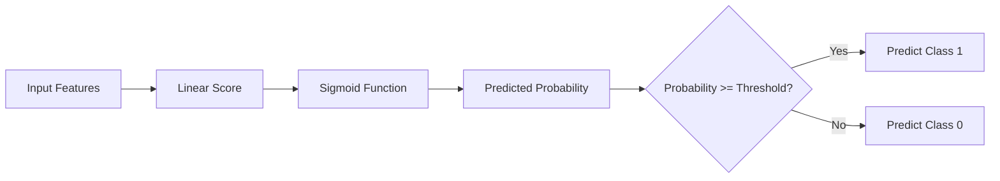
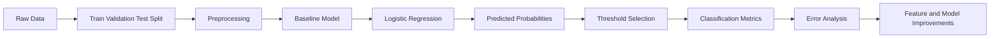
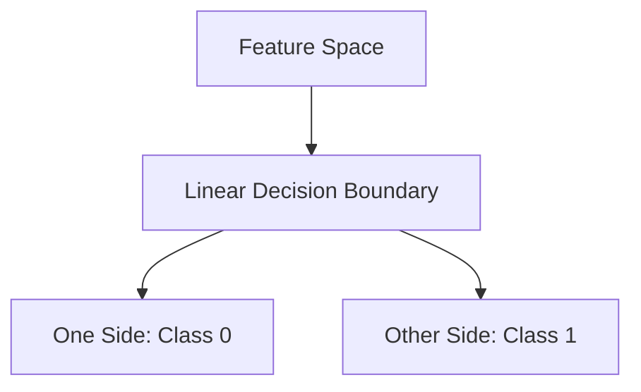
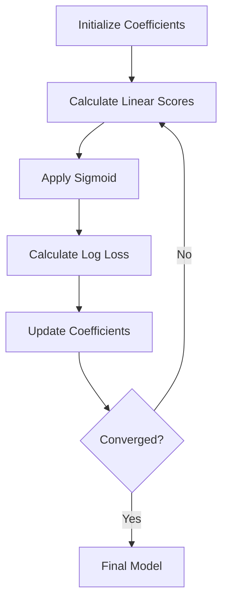
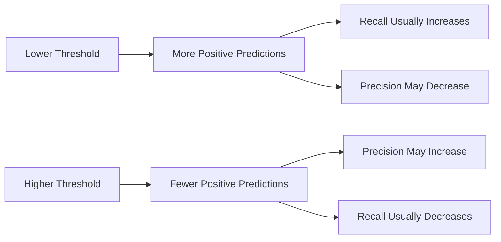

# 003 - Logistic Regression

**Course:** 03 - Machine Learning and Deep Learning
**Module:** Module 06 - Machine Learning
**Content Group:** Supervised Learning
**Roadmap Source:** Machine Learning / Supervised Learning
**Lesson Type:** Machine Learning
**Order in Module:** 003
**Suggested Duration:** 26 minutes

---

## 1. Overview

This lesson explains **Logistic Regression** in the context of AI and Data Science.

Despite its name, Logistic Regression is mainly used for **classification**, not for predicting continuous numerical values. It estimates the probability that an observation belongs to a particular class.

Typical use cases include:

* Predicting whether a customer will churn.
* Detecting whether an email is spam.
* Predicting whether a transaction is fraudulent.
* Determining whether a patient is at high risk.
* Predicting whether a user will click an advertisement.
* Classifying a loan application as approved or rejected.

After completing this lesson, you should understand:

* What Logistic Regression predicts.
* How it converts a linear score into a probability.
* How probabilities are converted into class labels.
* How to train and evaluate the model.
* How to interpret model coefficients.
* When Logistic Regression is an appropriate baseline.
* How to avoid common problems such as data leakage and class imbalance.

---

## 2. Learning Objectives

By the end of this lesson, you should be able to:

* Explain Logistic Regression in your own words.
* Distinguish Logistic Regression from Linear Regression.
* Understand the sigmoid function.
* Interpret predicted probabilities and decision thresholds.
* Explain the concept of log-odds.
* Train a Logistic Regression model with Scikit-learn.
* Evaluate the model using appropriate classification metrics.
* Interpret model coefficients.
* Compare Logistic Regression with a simple baseline.
* Identify data leakage, class imbalance, and overfitting risks.
* Apply Logistic Regression to a real classification dataset.

---

## 3. Main Concept

### 3.1 What Is Logistic Regression?

Logistic Regression is a supervised learning algorithm used to estimate the probability of a categorical outcome.

For binary classification, the target usually has two possible values:

```text
0 = negative class
1 = positive class
```

Examples:

| Problem           | Class 0    | Class 1    |
| ----------------- | ---------- | ---------- |
| Customer churn    | Stays      | Leaves     |
| Email filtering   | Not spam   | Spam       |
| Fraud detection   | Legitimate | Fraudulent |
| Loan approval     | Rejected   | Approved   |
| Medical screening | Low risk   | High risk  |

The model first calculates a linear score:

```text
z = b0 + b1*x1 + b2*x2 + ... + bn*xn
```

Where:

* `z` is the linear score.
* `b0` is the intercept.
* `b1, b2, ..., bn` are model coefficients.
* `x1, x2, ..., xn` are input features.

The linear score can take any value from negative infinity to positive infinity. However, a probability must be between `0` and `1`.

Logistic Regression solves this problem by applying the **sigmoid function**.

---

### 3.2 The Sigmoid Function

The sigmoid function converts the linear score into a probability:

```text
sigmoid(z) = 1 / (1 + exp(-z))
```

The predicted probability is:

```text
P(y = 1 | x) = 1 / (1 + exp(-z))
```

The output is always between `0` and `1`.

| Linear score `z` | Predicted probability |
| ---------------: | --------------------: |
|    Very negative |            Close to 0 |
|                0 |                   0.5 |
|    Very positive |            Close to 1 |

For example:

```text
z = 0
P(y = 1 | x) = 1 / (1 + exp(0))
P(y = 1 | x) = 0.5
```

Another example:

```text
z = 2
P(y = 1 | x) = 1 / (1 + exp(-2))
P(y = 1 | x) ≈ 0.881
```

The model therefore estimates an approximately `88.1%` probability of belonging to the positive class.

---

### 3.3 Logistic Regression Workflow



A more complete machine learning workflow is:



---

### 3.4 From Probability to Class Label

Logistic Regression produces a probability, not directly a class label.

A threshold converts the probability into a prediction.

Using the default threshold of `0.5`:

```text
If P(y = 1 | x) >= 0.5:
    predict class 1
Otherwise:
    predict class 0
```

Example:

| Predicted probability | Threshold | Predicted class |
| --------------------: | --------: | --------------: |
|                  0.91 |      0.50 |               1 |
|                  0.67 |      0.50 |               1 |
|                  0.49 |      0.50 |               0 |
|                  0.12 |      0.50 |               0 |

The threshold does not always need to be `0.5`.

For fraud detection or disease screening, missing a positive case may be expensive. A lower threshold may therefore be appropriate.

```text
Lower threshold:
More positive predictions
Higher recall
Potentially more false positives

Higher threshold:
Fewer positive predictions
Higher precision
Potentially more false negatives
```

---

### 3.5 Decision Boundary

For a model with two features:

```text
z = b0 + b1*x1 + b2*x2
```

At the default probability threshold of `0.5`:

```text
sigmoid(z) = 0.5
```

This occurs when:

```text
z = 0
```

Therefore, the decision boundary is:

```text
b0 + b1*x1 + b2*x2 = 0
```

Logistic Regression creates a **linear decision boundary** in the original feature space.



If the true relationship is strongly nonlinear, Logistic Regression may require:

* Polynomial features.
* Interaction features.
* Feature transformations.
* A more flexible model such as a decision tree or neural network.

---

## 4. Log-Odds and Coefficient Interpretation

### 4.1 Odds

Suppose the probability of an event is `p`.

The odds are:

```text
odds = p / (1 - p)
```

Example:

```text
p = 0.8
odds = 0.8 / 0.2
odds = 4
```

This means the event is four times as likely to happen as not to happen.

---

### 4.2 Log-Odds

Logistic Regression models the logarithm of the odds:

```text
log(p / (1 - p)) = b0 + b1*x1 + b2*x2 + ... + bn*xn
```

This quantity is called the **logit** or **log-odds**.

The model is linear in log-odds, even though the predicted probability follows an S-shaped curve.

---

### 4.3 Interpreting Coefficients

Consider the model:

```text
log(p / (1 - p)) = b0 + b1*x1
```

A one-unit increase in `x1` changes the log-odds by `b1`.

The corresponding odds multiplier is:

```text
odds ratio = exp(b1)
```

Interpretation:

* If `b1 > 0`, increasing `x1` increases the probability of class `1`.
* If `b1 < 0`, increasing `x1` decreases the probability of class `1`.
* If `b1 = 0`, `x1` has no linear effect on the log-odds.

Example:

```text
b1 = 0.7
exp(0.7) ≈ 2.01
```

A one-unit increase in the feature multiplies the odds of class `1` by approximately `2.01`, assuming other features remain constant.

Another example:

```text
b1 = -0.4
exp(-0.4) ≈ 0.67
```

A one-unit increase multiplies the odds by approximately `0.67`, which represents a decrease in the odds.

> Coefficient magnitude should not be compared directly across features with very different scales. Standardization makes coefficient comparison more meaningful.

---

## 5. How the Model Learns

### 5.1 Why Mean Squared Error Is Usually Not Used

Linear Regression normally minimizes Mean Squared Error. Logistic Regression instead uses **log loss**, also called **binary cross-entropy**.

For one observation:

```text
loss = -[y*log(p) + (1-y)*log(1-p)]
```

Where:

* `y` is the true class, either `0` or `1`.
* `p` is the predicted probability of class `1`.

For the full dataset:

```text
log_loss = -(1/n) * sum(
    y_i*log(p_i) + (1-y_i)*log(1-p_i)
)
```

The loss strongly penalizes confident but incorrect predictions.

Example:

```text
True class: 1
Predicted probability: 0.99
Result: very small loss
```

```text
True class: 1
Predicted probability: 0.01
Result: very large loss
```

---

### 5.2 Optimization Process

The training process adjusts the coefficients to minimize log loss.



Optimization methods may include:

* Gradient descent.
* Stochastic gradient descent.
* Limited-memory BFGS.
* Newton-based methods.
* Coordinate descent.

Scikit-learn handles the optimization process internally.

---

## 6. Logistic Regression vs. Linear Regression

| Aspect             | Linear Regression   | Logistic Regression          |
| ------------------ | ------------------- | ---------------------------- |
| Main task          | Regression          | Classification               |
| Target             | Continuous number   | Categorical class            |
| Output             | Any real number     | Probability from 0 to 1      |
| Main function      | Linear equation     | Linear equation plus sigmoid |
| Typical loss       | Mean Squared Error  | Log loss                     |
| Example            | Predict house price | Predict customer churn       |
| Decision threshold | Not required        | Required for class labels    |

Linear Regression may produce invalid probability values such as:

```text
-0.4
1.7
```

Logistic Regression prevents this by mapping its output into the range `[0, 1]`.

---

## 7. Binary and Multiclass Classification

### 7.1 Binary Logistic Regression

Binary Logistic Regression handles two classes:

```text
0 or 1
```

Examples:

* Spam or not spam.
* Fraud or legitimate.
* Churn or stay.
* Pass or fail.

---

### 7.2 Multiclass Logistic Regression

Logistic Regression can also support more than two classes.

Example:

```text
Class 0 = Setosa
Class 1 = Versicolor
Class 2 = Virginica
```

Two common strategies are:

#### One-vs-Rest

Train one classifier for each class:

```text
Class A vs. all other classes
Class B vs. all other classes
Class C vs. all other classes
```

#### Multinomial Logistic Regression

Estimate the probabilities of all classes together using the softmax function.

The class probabilities sum to `1`:

```text
P(class 1) + P(class 2) + ... + P(class K) = 1
```

---

## 8. Practical Example: Customer Churn

Suppose a telecommunications company wants to predict whether a customer will leave.

### Features

```text
tenure_months
monthly_charge
support_tickets
contract_type
payment_method
internet_service
```

### Target

```text
churn = 0: customer stays
churn = 1: customer leaves
```

A trained model might produce:

```text
Predicted churn probability = 0.82
```

Using a threshold of `0.5`:

```text
0.82 >= 0.5
Prediction = customer will churn
```

The business may use the prediction to:

* Offer a retention discount.
* Prioritize customer support.
* Recommend a better subscription plan.
* Contact high-risk customers.
* Estimate future revenue loss.

However, the model should not be evaluated only by accuracy. The business must consider:

* Cost of contacting customers who would not churn.
* Cost of failing to identify customers who will churn.
* Available retention budget.
* Expected value of each retained customer.

---

## 9. Python Demo

### 9.1 Import Libraries

```python
import numpy as np
import pandas as pd

from sklearn.datasets import load_breast_cancer
from sklearn.linear_model import LogisticRegression
from sklearn.metrics import (
    accuracy_score,
    classification_report,
    confusion_matrix,
    precision_score,
    recall_score,
    f1_score,
    roc_auc_score,
)
from sklearn.model_selection import train_test_split
from sklearn.pipeline import Pipeline
from sklearn.preprocessing import StandardScaler
```

---

### 9.2 Load the Dataset

```python
data = load_breast_cancer()

X = pd.DataFrame(
    data.data,
    columns=data.feature_names,
)

y = pd.Series(
    data.target,
    name="target",
)

print(X.shape)
print(y.value_counts())
```

---

### 9.3 Split the Dataset

The dataset should be split before fitting preprocessing steps.

```python
X_train, X_test, y_train, y_test = train_test_split(
    X,
    y,
    test_size=0.20,
    random_state=42,
    stratify=y,
)
```

The `stratify=y` argument helps preserve the target-class proportions in both sets.

---

### 9.4 Build a Pipeline

```python
model = Pipeline(
    steps=[
        ("scaler", StandardScaler()),
        (
            "classifier",
            LogisticRegression(
                max_iter=1000,
                random_state=42,
            ),
        ),
    ]
)
```

Using a pipeline ensures that:

* The scaler learns only from the training data.
* The same transformation is applied to test data.
* Preprocessing and prediction remain consistent.
* Data leakage becomes less likely.

---

### 9.5 Train the Model

```python
model.fit(X_train, y_train)
```

---

### 9.6 Generate Predictions

```python
y_pred = model.predict(X_test)

y_probability = model.predict_proba(X_test)[:, 1]
```

`predict()` returns class labels.

`predict_proba()` returns probabilities.

For binary classification:

```text
Column 0 = probability of class 0
Column 1 = probability of class 1
```

---

### 9.7 Evaluate the Model

```python
print("Accuracy:", accuracy_score(y_test, y_pred))
print("Precision:", precision_score(y_test, y_pred))
print("Recall:", recall_score(y_test, y_pred))
print("F1-score:", f1_score(y_test, y_pred))
print("ROC-AUC:", roc_auc_score(y_test, y_probability))

print("\nConfusion matrix:")
print(confusion_matrix(y_test, y_pred))

print("\nClassification report:")
print(classification_report(y_test, y_pred))
```

---

## 10. Classification Metrics

### 10.1 Confusion Matrix

A confusion matrix compares actual and predicted classes.

|                 | Predicted Negative | Predicted Positive |
| --------------- | -----------------: | -----------------: |
| Actual Negative |      True Negative |     False Positive |
| Actual Positive |     False Negative |      True Positive |

Definitions:

```text
TP = True Positive
TN = True Negative
FP = False Positive
FN = False Negative
```

---

### 10.2 Accuracy

```text
accuracy = (TP + TN) / (TP + TN + FP + FN)
```

Accuracy measures the proportion of correct predictions.

It may be misleading for imbalanced datasets.

Example:

```text
99% legitimate transactions
1% fraudulent transactions
```

A model that always predicts “legitimate” receives `99%` accuracy but detects no fraud.

---

### 10.3 Precision

```text
precision = TP / (TP + FP)
```

Precision answers:

> Of all observations predicted as positive, how many were actually positive?

Use precision when false positives are expensive.

Examples:

* Blocking legitimate financial transactions.
* Sending costly retention offers.
* Flagging normal content as harmful.

---

### 10.4 Recall

```text
recall = TP / (TP + FN)
```

Recall answers:

> Of all actual positive observations, how many did the model identify?

Use recall when false negatives are expensive.

Examples:

* Missing fraudulent transactions.
* Missing dangerous medical conditions.
* Failing to detect security threats.

---

### 10.5 F1-Score

```text
F1 = 2 * precision * recall / (precision + recall)
```

The F1-score balances precision and recall.

It is useful when:

* Classes are imbalanced.
* Both false positives and false negatives matter.
* A single summary metric is needed.

---

### 10.6 ROC-AUC

ROC-AUC measures how well the model ranks positive observations above negative observations across many thresholds.

Interpretation:

|   ROC-AUC | General interpretation    |
| --------: | ------------------------- |
|       0.5 | Similar to random ranking |
|   0.6–0.7 | Weak                      |
|   0.7–0.8 | Acceptable                |
|   0.8–0.9 | Strong                    |
| Above 0.9 | Very strong               |

These ranges are only rough guidelines. The required performance depends on the business problem.

---

### 10.7 Precision-Recall AUC

Precision-Recall AUC is often more informative than ROC-AUC when the positive class is rare.

Examples:

* Fraud detection.
* Defect detection.
* Rare disease screening.
* Security incident detection.

---

## 11. Threshold Tuning

The default threshold is often `0.5`, but it should be selected based on business costs.

```python
custom_threshold = 0.30

y_pred_custom = (
    y_probability >= custom_threshold
).astype(int)

print("Precision:", precision_score(y_test, y_pred_custom))
print("Recall:", recall_score(y_test, y_pred_custom))
print("F1-score:", f1_score(y_test, y_pred_custom))
```

Expected trade-off:



Threshold selection should be performed on a validation set, not directly on the final test set.

---

## 12. Baseline Comparison

A model should be compared with a simple baseline.

Possible baselines include:

* Predicting the majority class.
* Predicting based on a simple business rule.
* Using a single strong feature.
* Using a dummy classifier.

Example:

```python
from sklearn.dummy import DummyClassifier

baseline = DummyClassifier(
    strategy="most_frequent",
)

baseline.fit(X_train, y_train)

baseline_pred = baseline.predict(X_test)

print(
    "Baseline accuracy:",
    accuracy_score(y_test, baseline_pred),
)
```

A useful model should provide meaningful improvement over the baseline.

---

## 13. Regularization

Regularization prevents coefficients from becoming unnecessarily large and helps reduce overfitting.

The most common types are:

### L2 Regularization

L2 adds a penalty based on squared coefficient values:

```text
penalty = b1^2 + b2^2 + ... + bn^2
```

Characteristics:

* Shrinks coefficients toward zero.
* Usually keeps all features.
* Is the common default for Logistic Regression.

---

### L1 Regularization

L1 adds a penalty based on absolute coefficient values:

```text
penalty = |b1| + |b2| + ... + |bn|
```

Characteristics:

* Can make some coefficients exactly zero.
* Can perform a form of feature selection.
* May be useful when there are many irrelevant features.

---

### Regularization Strength

In Scikit-learn, the parameter `C` controls inverse regularization strength:

```text
Smaller C = stronger regularization
Larger C = weaker regularization
```

Example:

```python
model = LogisticRegression(
    C=0.1,
    penalty="l2",
    max_iter=1000,
)
```

The value of `C` should normally be selected through cross-validation.

---

## 14. Handling Categorical Features

Logistic Regression requires numerical input.

Categorical variables should be encoded.

Example pipeline:

```python
from sklearn.compose import ColumnTransformer
from sklearn.preprocessing import OneHotEncoder

numeric_features = [
    "age",
    "monthly_charge",
    "tenure_months",
]

categorical_features = [
    "contract_type",
    "payment_method",
]

preprocessor = ColumnTransformer(
    transformers=[
        (
            "numeric",
            StandardScaler(),
            numeric_features,
        ),
        (
            "categorical",
            OneHotEncoder(
                handle_unknown="ignore",
            ),
            categorical_features,
        ),
    ]
)

model = Pipeline(
    steps=[
        ("preprocessor", preprocessor),
        (
            "classifier",
            LogisticRegression(
                max_iter=1000,
            ),
        ),
    ]
)
```

`handle_unknown="ignore"` prevents errors when new categories appear during inference.

---

## 15. Handling Class Imbalance

Suppose the target distribution is:

```text
Class 0: 98%
Class 1: 2%
```

Possible strategies include:

* Use stratified splitting.
* Evaluate precision, recall, F1-score, and PR-AUC.
* Adjust the decision threshold.
* Use class weights.
* Resample the training data.
* Collect more positive examples.
* Use business-specific cost functions.

Example with class weights:

```python
model = LogisticRegression(
    class_weight="balanced",
    max_iter=1000,
)
```

`class_weight="balanced"` increases the relative importance of minority-class observations.

It should not be used automatically. Compare its effects on validation metrics and business outcomes.

---

## 16. Assumptions and Limitations

Logistic Regression works best when several conditions are reasonably satisfied.

### 16.1 Independent Observations

Observations should generally be independent.

Repeated measurements from the same person or device may violate this assumption.

---

### 16.2 Linear Relationship with Log-Odds

Logistic Regression assumes that numerical features have an approximately linear relationship with the log-odds of the positive class.

It does not require a linear relationship between features and probabilities.

Possible solutions for nonlinear relationships:

* Polynomial features.
* Binning.
* Splines.
* Logarithmic transformations.
* Interaction terms.
* Nonlinear models.

---

### 16.3 Limited Multicollinearity

Highly correlated features can make coefficients unstable and difficult to interpret.

Possible solutions:

* Remove redundant features.
* Combine correlated variables.
* Apply dimensionality reduction.
* Use regularization.
* Inspect correlation matrices or variance inflation factors.

---

### 16.4 Sufficient Sample Size

The dataset should contain enough examples from each class.

Very small datasets may produce:

* Unstable coefficients.
* Poor probability estimates.
* High variance.
* Unreliable evaluation metrics.

---

### 16.5 Sensitivity to Outliers

Extreme feature values can strongly affect the decision boundary.

Possible actions:

* Inspect distributions.
* Correct data errors.
* Apply robust transformations.
* Cap extreme values when justified.
* Standardize features.

---

## 17. Data Leakage

Data leakage occurs when information unavailable at prediction time enters model training.

Examples:

* Scaling the full dataset before splitting.
* Using future customer activity to predict past churn.
* Including a field created after the target event.
* Selecting features using the test set.
* Tuning the threshold directly on the final test set.
* Oversampling before splitting the data.
* Using duplicate users in both train and test sets.

Incorrect workflow:

```text
Full dataset
    -> preprocessing
    -> train-test split
    -> model
```

Safer workflow:

```text
Full dataset
    -> train-test split
    -> fit preprocessing on training data
    -> transform validation and test data
    -> train model
    -> final evaluation
```

Using a Scikit-learn pipeline helps enforce this process.

---

## 18. Error Analysis

Metrics summarize performance, but they do not explain individual failures.

After evaluation, inspect:

* False positives.
* False negatives.
* Errors by customer segment.
* Errors by location.
* Errors by product type.
* Errors by time period.
* Errors around the decision threshold.
* Cases with missing or unusual feature values.

Example error table:

| Customer | Actual | Probability | Prediction | Error type       |
| -------- | -----: | ----------: | ---------: | ---------------- |
| A        |      1 |        0.22 |          0 | False negative   |
| B        |      0 |        0.84 |          1 | False positive   |
| C        |      1 |        0.51 |          1 | Correct positive |

Questions to investigate:

* Are false negatives concentrated in a particular group?
* Does the model fail on new customers?
* Are some features unavailable at prediction time?
* Is the target definition reliable?
* Would another threshold better match business costs?
* Are there important interactions between features?
* Has the data distribution changed over time?

---

## 19. Probability Calibration

A model may classify observations correctly but still produce inaccurate probabilities.

For example, among observations assigned a probability near `0.8`, approximately `80%` should actually belong to the positive class.

Calibration matters when probabilities are used for:

* Risk scoring.
* Budget allocation.
* Customer prioritization.
* Financial decisions.
* Medical decisions.
* Expected-value calculations.

Calibration can be evaluated with:

* Calibration curves.
* Brier score.
* Reliability diagrams.

Possible calibration methods include:

* Platt scaling.
* Isotonic regression.

Calibration should be learned using validation data rather than the final test set.

---

## 20. When to Use Logistic Regression

Logistic Regression is a strong choice when:

* The target is categorical.
* A simple and interpretable baseline is needed.
* The decision boundary is approximately linear.
* Training speed matters.
* The dataset is small or medium-sized.
* Feature effects need to be explained.
* Predicted probabilities are required.
* The input is high-dimensional and sparse, such as text features.

It is often a strong baseline for:

* Customer churn.
* Credit risk.
* Marketing response.
* Spam detection.
* Medical screening.
* Sentiment classification.
* Fraud detection.

---

## 21. When Logistic Regression May Not Be Enough

Consider another model when:

* Relationships are highly nonlinear.
* There are complex feature interactions.
* Image, audio, or raw text representations are used directly.
* The decision boundary is very irregular.
* Performance matters more than interpretability.
* The dataset contains complex hierarchical or sequential structures.

Possible alternatives:

* Decision Tree.
* Random Forest.
* Gradient Boosting.
* XGBoost.
* Support Vector Machine.
* Neural Network.
* Generalized Additive Model.

Even when a more complex model is selected, Logistic Regression remains valuable as a baseline.

---

## 22. Deployment Example

A trained Logistic Regression model can be exposed through an API.

Example request:

```json
{
  "tenure_months": 8,
  "monthly_charge": 89.5,
  "support_tickets": 4,
  "contract_type": "monthly"
}
```

Example response:

```json
{
  "churn_probability": 0.82,
  "decision_threshold": 0.50,
  "predicted_class": 1,
  "prediction_label": "high_churn_risk"
}
```

A production service should also monitor:

* Input schema validity.
* Missing features.
* Unknown categories.
* Prediction latency.
* Class distribution.
* Probability distribution.
* Data drift.
* Model performance.
* Calibration drift.
* Threshold effectiveness.

---

## 23. Practical Exercise

### Exercise 1: Train a Baseline

Create a baseline classifier that always predicts the majority class.

Record:

* Accuracy.
* Precision.
* Recall.
* F1-score.
* Confusion matrix.

---

### Exercise 2: Train Logistic Regression

Train a Logistic Regression model using a preprocessing pipeline.

Compare it with the baseline.

---

### Exercise 3: Tune the Threshold

Evaluate the following thresholds:

```text
0.30
0.40
0.50
0.60
0.70
```

Create a comparison table:

| Threshold | Precision | Recall | F1-score | Predicted positives |
| --------: | --------: | -----: | -------: | ------------------: |
|      0.30 |           |        |          |                     |
|      0.40 |           |        |          |                     |
|      0.50 |           |        |          |                     |
|      0.60 |           |        |          |                     |
|      0.70 |           |        |          |                     |

Select a threshold based on the business cost of false positives and false negatives.

---

### Exercise 4: Inspect Coefficients

Extract the model coefficients and identify:

* Features that increase the probability of class `1`.
* Features that decrease the probability of class `1`.
* Features with very small effects.
* Features with unexpectedly large effects.

---

### Exercise 5: Perform Error Analysis

Inspect at least:

* Ten false positives.
* Ten false negatives.
* One subgroup with poor performance.

Write down:

* Possible reasons for the errors.
* Potential data-quality problems.
* New features that could help.
* Whether threshold adjustment may help.
* Whether a nonlinear model should be tested.

---

## 24. Common Mistakes

### Mistake 1: Treating Logistic Regression as a Regression Model

Despite its name, it is normally a classification algorithm.

---

### Mistake 2: Using Accuracy for an Imbalanced Dataset

High accuracy can hide complete failure on the minority class.

Use:

* Precision.
* Recall.
* F1-score.
* PR-AUC.
* Confusion matrix.

---

### Mistake 3: Scaling Before Splitting

This allows information from validation or test data to influence preprocessing.

Split first or use a pipeline.

---

### Mistake 4: Using the Test Set for Threshold Selection

The test set should be reserved for final evaluation.

Use a validation set or cross-validation to select the threshold.

---

### Mistake 5: Ignoring Feature Scale

Features with very different scales can affect optimization and coefficient interpretation.

Use standardization for numerical features when appropriate.

---

### Mistake 6: Interpreting Coefficients as Direct Probability Changes

A coefficient represents a change in log-odds, not a direct probability increase.

The probability change depends on the starting probability and all other features.

---

### Mistake 7: Ignoring Multicollinearity

Strongly correlated features can produce unstable coefficients.

Prediction may remain acceptable while interpretation becomes unreliable.

---

### Mistake 8: Using a Complex Model Without a Baseline

A complex model should demonstrate meaningful improvement over a simple baseline.

---

### Mistake 9: Ignoring Probability Calibration

Good classification performance does not guarantee reliable probability estimates.

---

### Mistake 10: Optimizing a Metric That Does Not Match the Business Goal

The best technical score may not produce the best business decision.

Always connect the evaluation metric to the cost of model errors.

---

## 25. Completion Checklist

* [ ] I can explain Logistic Regression in one or two minutes.
* [ ] I understand why it is used for classification.
* [ ] I can explain the sigmoid function.
* [ ] I understand how probabilities become class predictions.
* [ ] I can explain why the decision threshold may need adjustment.
* [ ] I understand log-odds and odds ratios.
* [ ] I can train Logistic Regression with Scikit-learn.
* [ ] I can use a pipeline to prevent preprocessing leakage.
* [ ] I can interpret a confusion matrix.
* [ ] I can calculate and explain precision, recall, and F1-score.
* [ ] I understand why accuracy may fail on imbalanced data.
* [ ] I can compare the model against a baseline.
* [ ] I can perform basic threshold tuning.
* [ ] I can inspect false positives and false negatives.
* [ ] I have documented at least one assumption or limitation.
* [ ] I have created a notebook, model, chart, API, or portfolio note for this lesson.

---

## 26. Related Outcome

Train, compare, and evaluate supervised and unsupervised machine learning models using thoughtful feature engineering, appropriate validation strategies, and business-relevant metrics.

---

## 27. Related Project

### Mini Project: Customer Churn Prediction

Build a classification project that includes:

1. Business problem definition.
2. Exploratory Data Analysis.
3. Missing-value handling.
4. Numerical feature scaling.
5. Categorical feature encoding.
6. Majority-class baseline.
7. Logistic Regression.
8. Random Forest comparison.
9. Gradient Boosting or XGBoost comparison.
10. Precision, recall, F1-score, ROC-AUC, and PR-AUC.
11. Threshold tuning.
12. Error analysis.
13. Coefficient or feature-importance analysis.
14. Model serialization.
15. Prediction API.
16. Docker deployment.
17. Monitoring recommendations.

Suggested portfolio artifacts:

```text
README.md
notebook.ipynb
train.py
evaluate.py
pipeline.py
model.joblib
app.py
requirements.txt
Dockerfile
metrics.json
error_analysis.csv
```

---

## 28. Summary

**Logistic Regression** is a supervised learning algorithm that predicts the probability of a categorical outcome.

Its main process is:

```text
features
-> linear score
-> sigmoid function
-> probability
-> decision threshold
-> class prediction
```

The most important ideas are:

* Logistic Regression is mainly a classification algorithm.
* The sigmoid function maps a linear score to a probability.
* The decision threshold converts probabilities into class labels.
* The model is trained by minimizing log loss.
* Coefficients describe changes in log-odds.
* Precision, recall, F1-score, and AUC may be more useful than accuracy.
* Threshold selection should reflect business costs.
* Pipelines help prevent data leakage.
* Error analysis is necessary to understand model weaknesses.
* A model is valuable only when it supports a real decision or business objective.

Turn this lesson into a practical artifact such as a notebook, classification report, threshold analysis, prediction API, Docker service, or portfolio project so that the knowledge becomes concrete and reusable.
