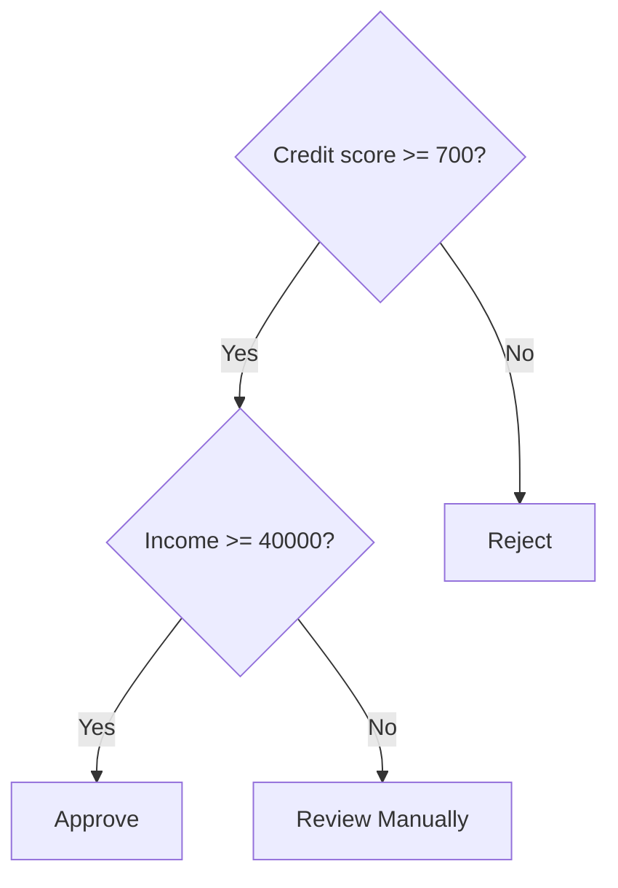
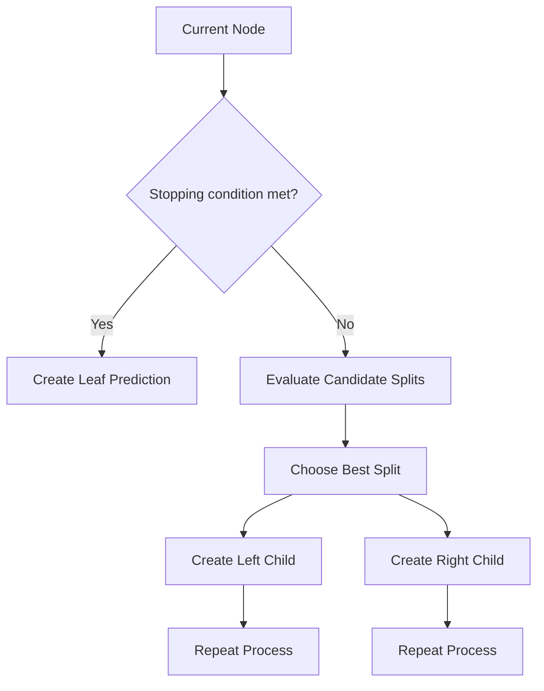
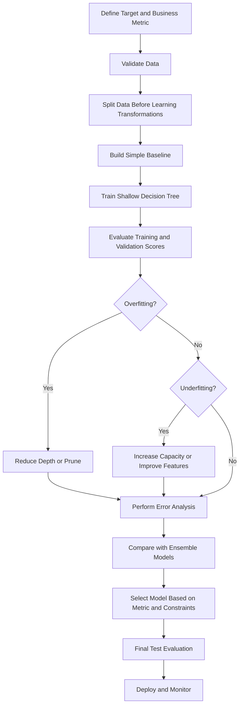
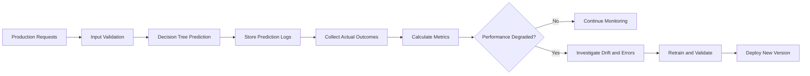

# 004 - Decision Tree

**Course:** 03 - Machine Learning and Deep Learning
**Module:** Module 06 - Machine Learning
**Content Group:** Supervised Learning
**Roadmap Source:** Machine Learning / Supervised Learning
**Lesson Type:** Machine Learning
**Order in Module:** 004
**Suggested Duration:** 26 minutes

---

## 1. Overview

A **Decision Tree** is a supervised machine learning model that makes predictions by repeatedly splitting data according to feature-based conditions.

The model behaves like a sequence of questions:

```text
Is age less than 30?
├── Yes: Is income greater than 50,000?
│   ├── Yes: Predict "Buy"
│   └── No: Predict "Not Buy"
└── No: Predict "Buy"
```

Decision Trees can be used for:

* **Classification**, such as predicting whether a customer will churn.
* **Regression**, such as predicting the price of a house.
* Understanding which features influence a prediction.
* Building interpretable baseline models.
* Discovering nonlinear relationships and feature interactions.

After this lesson, you should understand how Decision Trees split data, how they make predictions, how to control overfitting, and how to evaluate them correctly.

---

## 2. Learning Objectives

By the end of this lesson, you should be able to:

* Explain a Decision Tree in your own words.
* Distinguish between classification trees and regression trees.
* Identify the root node, internal nodes, branches, and leaf nodes.
* Explain how Gini impurity, entropy, and variance reduction are used.
* Train a Decision Tree with Scikit-learn.
* Control model complexity using hyperparameters.
* Detect overfitting by comparing training and validation performance.
* Interpret feature importance and decision rules.
* Apply a Decision Tree to a practical dataset.
* Compare a Decision Tree with an appropriate baseline.

---

## 3. Where Decision Trees Fit in the Machine Learning Workflow

A Decision Tree is normally trained after the data has been cleaned, divided into training and evaluation sets, and converted into usable features.


A high-performing model is not automatically useful. The model must also:

* Solve the correct business problem.
* Use features that are available at prediction time.
* Avoid data leakage.
* Meet latency and deployment requirements.
* Produce errors that the business can tolerate.

---

## 4. Decision Tree Intuition

A Decision Tree divides the feature space into smaller regions.

At each internal node, the algorithm chooses:

1. A feature.
2. A split threshold or category.
3. The split that produces the purest or most homogeneous child nodes.

For example, consider a loan approval model:



The model converts a complex prediction problem into a sequence of relatively simple rules.

---

## 5. Main Components of a Decision Tree

### 5.1 Root Node

The **root node** is the first decision in the tree.

It contains the complete training dataset before any split is made.

```text
Root node: Credit score >= 700?
```

---

### 5.2 Internal Node

An **internal node** applies a condition to divide observations into smaller groups.

```text
Income >= 40,000?
```

---

### 5.3 Branch

A **branch** represents the result of a condition.

```text
Yes branch
No branch
```

---

### 5.4 Leaf Node

A **leaf node** contains the final prediction.

For classification:

```text
Predicted class: Approved
```

For regression:

```text
Predicted house price: $280,000
```

---

### 5.5 Tree Depth

The **depth** of a tree is the maximum number of decisions between the root node and a leaf node.

A deeper tree can learn more detailed patterns, but it is also more likely to overfit.

---

## 6. Classification Tree

A classification tree predicts a discrete label.

Examples include:

* Spam or not spam.
* Fraudulent or legitimate transaction.
* Customer churn or customer retention.
* Disease present or disease absent.
* Product category A, B, or C.

At each split, the model tries to create child nodes that contain observations from as few classes as possible.

A completely pure node contains only one class.

```text
Pure node:
Class A: 100%
Class B: 0%
```

An impure node contains multiple classes.

```text
Impure node:
Class A: 55%
Class B: 45%
```

---

## 7. Regression Tree

A regression tree predicts a continuous numerical value.

Examples include:

* House price.
* Monthly revenue.
* Delivery time.
* Customer lifetime value.
* Energy consumption.

A regression tree divides observations into regions where target values are similar.

The prediction of a leaf is usually the average target value of the training observations in that leaf.

```text
Leaf target values: 220, 240, 250, 270

Leaf prediction:

(220 + 240 + 250 + 270) / 4 = 245
```

---

## 8. How a Decision Tree Chooses a Split

The tree tests many possible splits and selects the one that produces the largest improvement in node quality.

A simplified training procedure is:

```text
1. Start with all training observations at the root.
2. Evaluate candidate features and thresholds.
3. Calculate the impurity before and after each split.
4. Select the split with the largest impurity reduction.
5. Repeat the process for each child node.
6. Stop when a stopping condition is reached.
7. Assign a prediction to each leaf node.
```

Possible stopping conditions include:

* Maximum tree depth reached.
* Too few observations remain in a node.
* A node is already pure.
* No split produces a meaningful improvement.
* Maximum number of leaf nodes reached.

---

## 9. Classification Split Criteria

### 9.1 Gini Impurity

Gini impurity measures the probability that a randomly selected observation would be incorrectly labeled if its class were assigned according to the class distribution in the node.

```text
Gini = 1 - sum(p_k^2)
```

Where:

```text
p_k = proportion of observations belonging to class k
```

For a binary classification node containing 80% positive and 20% negative observations:

```text
Gini = 1 - (0.8^2 + 0.2^2)

Gini = 1 - (0.64 + 0.04)

Gini = 0.32
```

Important cases:

```text
Perfectly pure binary node:

Gini = 0

Maximum impurity for two balanced classes:

Gini = 0.5
```

Lower Gini impurity means the node is more homogeneous.

---

### 9.2 Entropy

Entropy measures uncertainty or disorder in a node.

```text
Entropy = -sum(p_k * log2(p_k))
```

For a binary node containing 50% positive and 50% negative observations:

```text
Entropy = -(0.5 * log2(0.5) + 0.5 * log2(0.5))

Entropy = 1
```

For a pure node:

```text
Entropy = 0
```

Higher entropy means greater uncertainty.

---

### 9.3 Information Gain

Information gain measures how much uncertainty is reduced by a split.

```text
Information Gain
    = Parent Impurity
    - Weighted Child Impurity
```

The weighted impurity of the child nodes is:

```text
Weighted Child Impurity
    = (n_left / n_parent) * Impurity_left
    + (n_right / n_parent) * Impurity_right
```

The algorithm prefers the split with the highest information gain.

---

### 9.4 Gini vs. Entropy

| Criterion     | Interpretation                 | Typical Behavior                   |
| ------------- | ------------------------------ | ---------------------------------- |
| Gini impurity | Measures class mixing          | Usually slightly faster            |
| Entropy       | Measures uncertainty           | Based on information theory        |
| Log loss      | Evaluates probabilistic purity | Similar split objective to entropy |

In many practical datasets, Gini impurity and entropy produce similar trees.

It is usually better to tune tree depth and minimum sample constraints than to spend too much time choosing between Gini and entropy.

---

## 10. Regression Split Criteria

Regression trees commonly use squared error or absolute error.

### 10.1 Mean Squared Error

```text
MSE = (1 / n) * sum((y_i - y_mean)^2)
```

The tree selects the split that produces the largest reduction in squared error.

```text
Variance Reduction
    = Parent Error
    - Weighted Child Error
```

---

### 10.2 Mean Absolute Error

```text
MAE = (1 / n) * sum(abs(y_i - prediction))
```

Mean absolute error is less sensitive to extreme target values than mean squared error.

However, training with absolute error may be slower.

---

## 11. Example of Evaluating a Split

Suppose a classification node contains 10 observations:

```text
Positive: 6
Negative: 4
```

The parent Gini impurity is:

```text
Gini_parent
    = 1 - (0.6^2 + 0.4^2)
    = 1 - (0.36 + 0.16)
    = 0.48
```

A candidate split creates these child nodes:

```text
Left child:
Positive: 4
Negative: 0
Total: 4

Right child:
Positive: 2
Negative: 4
Total: 6
```

The left child is pure:

```text
Gini_left = 0
```

The right child impurity is:

```text
Gini_right
    = 1 - ((2 / 6)^2 + (4 / 6)^2)
    = 1 - (0.1111 + 0.4444)
    = 0.4445
```

The weighted child impurity is:

```text
Weighted Gini
    = (4 / 10) * 0
    + (6 / 10) * 0.4445
    = 0.2667
```

The Gini reduction is:

```text
Gini Reduction
    = 0.48 - 0.2667
    = 0.2133
```

The algorithm compares this value with reductions from other candidate splits.

---

## 12. Recursive Partitioning

Decision Tree training is a recursive process.



The algorithm is generally **greedy**.

This means that it chooses the best split at the current node without testing every possible future tree structure.

As a result, a Decision Tree does not guarantee the globally optimal tree.

---

## 13. Decision Boundaries

Decision Trees create axis-aligned decision boundaries.

For two numerical features, a split may look like:

```text
Feature 1 <= 5.2
Feature 2 > 3.1
```

The feature space is divided into rectangular regions.

```text
Feature 2
   ^
   |
 5 | Region A | Region B
   |----------|---------
 3 | Region C | Region D
   |
   +--------------------> Feature 1
              5
```

This allows Decision Trees to model nonlinear patterns without manually creating polynomial features.

However, smooth diagonal or circular relationships may require many splits.

---

## 14. Important Hyperparameters

### 14.1 `max_depth`

Controls the maximum depth of the tree.

```python
DecisionTreeClassifier(max_depth=4)
```

Smaller values:

* Reduce complexity.
* Improve interpretability.
* Lower overfitting risk.
* May cause underfitting.

Larger values:

* Capture detailed patterns.
* Increase overfitting risk.
* Produce more complex rules.

---

### 14.2 `min_samples_split`

The minimum number of observations required to split an internal node.

```python
DecisionTreeClassifier(min_samples_split=20)
```

A larger value prevents the model from splitting very small groups.

---

### 14.3 `min_samples_leaf`

The minimum number of observations required in each leaf node.

```python
DecisionTreeClassifier(min_samples_leaf=10)
```

This often produces smoother and more stable predictions.

---

### 14.4 `max_leaf_nodes`

Limits the total number of leaf nodes.

```python
DecisionTreeClassifier(max_leaf_nodes=12)
```

This provides another way to control model complexity.

---

### 14.5 `max_features`

Controls how many features are considered when searching for the best split.

```python
DecisionTreeClassifier(max_features="sqrt")
```

Using fewer features can:

* Add randomness.
* Reduce correlation between trees in ensemble methods.
* Sometimes improve generalization.

---

### 14.6 `class_weight`

Adjusts the importance of classes in an imbalanced classification problem.

```python
DecisionTreeClassifier(class_weight="balanced")
```

This does not replace proper evaluation with precision, recall, F1-score, or PR-AUC.

---

### 14.7 `ccp_alpha`

Controls cost-complexity pruning.

```python
DecisionTreeClassifier(ccp_alpha=0.01)
```

A larger value removes more branches and creates a simpler tree.

---

## 15. Pre-Pruning and Post-Pruning

### 15.1 Pre-Pruning

Pre-pruning stops the tree from growing too large.

Common pre-pruning parameters include:

* `max_depth`
* `min_samples_split`
* `min_samples_leaf`
* `max_leaf_nodes`
* `min_impurity_decrease`

Example:

```python
DecisionTreeClassifier(
    max_depth=5,
    min_samples_split=20,
    min_samples_leaf=10
)
```

---

### 15.2 Post-Pruning

Post-pruning allows the tree to grow and then removes branches that do not provide enough value.

Cost-complexity pruning balances prediction error and tree size.

```text
Pruned Objective
    = Training Error
    + alpha * Number of Leaves
```

Where:

```text
alpha = penalty for model complexity
```

A larger `alpha` creates a smaller tree.

---

## 16. Overfitting in Decision Trees

An unrestricted Decision Tree can memorize training data.

Typical signs of overfitting include:

```text
Training accuracy:   100%
Validation accuracy: 78%
```

The model performs extremely well on training data but poorly on unseen data.

Common causes include:

* Unlimited depth.
* Leaves containing only one or two observations.
* No pruning.
* Noisy or irrelevant features.
* Small training dataset.
* Data leakage.

A better-controlled model may produce:

```text
Training accuracy:   89%
Validation accuracy: 85%
```

The second model has lower training performance but better generalization.

---

## 17. Underfitting in Decision Trees

A tree can also be too simple.

Example:

```text
Training accuracy:   68%
Validation accuracy: 67%
```

Possible causes include:

* `max_depth` is too small.
* `min_samples_leaf` is too large.
* Important features are missing.
* The input features do not contain enough predictive information.

The goal is not to maximize training performance. The goal is to find a model complexity that generalizes well.

---

## 18. Bias-Variance Trade-Off

Decision Trees illustrate the bias-variance trade-off clearly.

| Tree Type         |     Bias | Variance | Typical Risk |
| ----------------- | -------: | -------: | ------------ |
| Very shallow tree |     High |      Low | Underfitting |
| Medium-depth tree | Moderate | Moderate | Balanced     |
| Very deep tree    |      Low |     High | Overfitting  |

A single deep Decision Tree is highly sensitive to small changes in the training data.

This instability is one reason why ensemble methods such as Random Forest and Gradient Boosting are often more accurate.

---

## 19. Data Preparation

Decision Trees require less preprocessing than many other machine learning models.

### Usually unnecessary

Decision Trees normally do not require:

* Standardization.
* Min-max scaling.
* Normalization.
* Polynomial feature generation.

A split based on:

```text
age <= 30
```

does not depend on whether age is measured in years or standardized units.

---

### Still necessary

You must still handle:

* Missing values.
* Invalid values.
* Duplicate records.
* Categorical features.
* Data leakage.
* Train-validation-test splitting.
* Class imbalance.
* Incorrect target labels.

---

### Categorical Features

Standard Scikit-learn Decision Trees require categorical variables to be converted into numerical features.

Common approaches include:

* One-hot encoding.
* Ordinal encoding when an actual order exists.
* Target encoding with careful cross-validation.
* Using tree libraries with native categorical support.

Do not use arbitrary integer encoding for unordered categories unless the model supports categorical features correctly.

For example:

```text
red = 1
blue = 2
green = 3
```

may incorrectly imply:

```text
green > blue > red
```

---

## 20. Train a Classification Tree

The following example uses the breast cancer dataset included with Scikit-learn.

```python
from sklearn.datasets import load_breast_cancer
from sklearn.metrics import (
    accuracy_score,
    classification_report,
    confusion_matrix,
)
from sklearn.model_selection import train_test_split
from sklearn.tree import DecisionTreeClassifier

# Load data
dataset = load_breast_cancer()
X = dataset.data
y = dataset.target

# Split data
X_train, X_test, y_train, y_test = train_test_split(
    X,
    y,
    test_size=0.20,
    random_state=42,
    stratify=y,
)

# Create and train the model
model = DecisionTreeClassifier(
    criterion="gini",
    max_depth=4,
    min_samples_leaf=5,
    random_state=42,
)

model.fit(X_train, y_train)

# Make predictions
y_pred = model.predict(X_test)

# Evaluate the model
print("Accuracy:", accuracy_score(y_test, y_pred))
print("Confusion matrix:")
print(confusion_matrix(y_test, y_pred))
print("Classification report:")
print(classification_report(y_test, y_pred))
```

The `stratify=y` argument helps preserve the class distribution in both the training and test sets.

---

## 21. Train a Regression Tree

The following example uses the California housing dataset.

```python
from sklearn.datasets import fetch_california_housing
from sklearn.metrics import mean_absolute_error, mean_squared_error, r2_score
from sklearn.model_selection import train_test_split
from sklearn.tree import DecisionTreeRegressor

# Load data
dataset = fetch_california_housing()
X = dataset.data
y = dataset.target

# Split data
X_train, X_test, y_train, y_test = train_test_split(
    X,
    y,
    test_size=0.20,
    random_state=42,
)

# Create and train the model
model = DecisionTreeRegressor(
    max_depth=6,
    min_samples_leaf=10,
    random_state=42,
)

model.fit(X_train, y_train)

# Make predictions
y_pred = model.predict(X_test)

# Evaluate the model
mae = mean_absolute_error(y_test, y_pred)
rmse = mean_squared_error(y_test, y_pred) ** 0.5
r2 = r2_score(y_test, y_pred)

print("MAE:", mae)
print("RMSE:", rmse)
print("R-squared:", r2)
```

---

## 22. Compare Training and Test Performance

Always compare performance across training and unseen data.

```python
from sklearn.metrics import accuracy_score

train_pred = model.predict(X_train)
test_pred = model.predict(X_test)

train_accuracy = accuracy_score(y_train, train_pred)
test_accuracy = accuracy_score(y_test, test_pred)

print("Training accuracy:", train_accuracy)
print("Test accuracy:", test_accuracy)
print("Generalization gap:", train_accuracy - test_accuracy)
```

A large gap may indicate overfitting.

For regression:

```python
from sklearn.metrics import mean_squared_error

train_pred = model.predict(X_train)
test_pred = model.predict(X_test)

train_rmse = mean_squared_error(y_train, train_pred) ** 0.5
test_rmse = mean_squared_error(y_test, test_pred) ** 0.5

print("Training RMSE:", train_rmse)
print("Test RMSE:", test_rmse)
```

---

## 23. Visualize the Tree

```python
import matplotlib.pyplot as plt
from sklearn.tree import plot_tree

plt.figure(figsize=(20, 10))

plot_tree(
    model,
    feature_names=dataset.feature_names,
    filled=True,
    rounded=True,
    max_depth=3,
)

plt.title("Decision Tree")
plt.show()
```

For a classification tree, you can also provide class names:

```python
plot_tree(
    model,
    feature_names=dataset.feature_names,
    class_names=dataset.target_names,
    filled=True,
    rounded=True,
)
```

Large trees are difficult to interpret visually. Limit the depth during visualization or export the rules as text.

---

## 24. Export Decision Rules as Text

```python
from sklearn.tree import export_text

rules = export_text(
    model,
    feature_names=list(dataset.feature_names),
)

print(rules)
```

Example output:

```text
|--- mean radius <= 15.05
|   |--- worst concave points <= 0.14
|   |   |--- class: benign
|   |--- worst concave points > 0.14
|   |   |--- class: malignant
|--- mean radius > 15.05
|   |--- class: malignant
```

Text-based rules are useful for:

* Documentation.
* Model review.
* Business validation.
* Detecting suspicious feature usage.
* Comparing behavior before and after retraining.

---

## 25. Feature Importance

A trained Decision Tree can provide impurity-based feature importance values.

```python
import pandas as pd

importance_table = pd.DataFrame(
    {
        "feature": dataset.feature_names,
        "importance": model.feature_importances_,
    }
).sort_values("importance", ascending=False)

print(importance_table.head(10))
```

The values sum to approximately 1:

```text
sum(feature_importances_) = 1
```

A higher value means that the feature contributed more impurity reduction across the tree.

However, impurity-based importance has limitations:

* It may favor continuous features.
* It may favor features with many possible split points.
* Correlated features may divide importance between them.
* Importance does not indicate whether the feature increases or decreases the prediction.
* Importance does not prove causality.

Permutation importance is often a better validation tool.

---

## 26. Permutation Importance

Permutation importance measures how much model performance decreases when one feature is randomly shuffled.

```python
from sklearn.inspection import permutation_importance

result = permutation_importance(
    model,
    X_test,
    y_test,
    n_repeats=10,
    random_state=42,
)

permutation_table = pd.DataFrame(
    {
        "feature": dataset.feature_names,
        "importance_mean": result.importances_mean,
        "importance_std": result.importances_std,
    }
).sort_values("importance_mean", ascending=False)

print(permutation_table.head(10))
```

Permutation importance should be calculated on validation or test data, not only on training data.

---

## 27. Hyperparameter Tuning

Use cross-validation to compare multiple configurations.

```python
from sklearn.model_selection import GridSearchCV
from sklearn.tree import DecisionTreeClassifier

parameter_grid = {
    "criterion": ["gini", "entropy"],
    "max_depth": [2, 3, 4, 5, 6, None],
    "min_samples_split": [2, 10, 20],
    "min_samples_leaf": [1, 5, 10],
}

search = GridSearchCV(
    estimator=DecisionTreeClassifier(random_state=42),
    param_grid=parameter_grid,
    scoring="f1",
    cv=5,
    n_jobs=-1,
)

search.fit(X_train, y_train)

print("Best parameters:", search.best_params_)
print("Best cross-validation score:", search.best_score_)

best_model = search.best_estimator_
```

Choose the scoring metric based on the business objective.

Examples:

| Business Problem        | Possible Primary Metric          |
| ----------------------- | -------------------------------- |
| Balanced classification | Accuracy                         |
| Detect rare fraud       | Recall, precision, PR-AUC        |
| Avoid false approvals   | Precision or false-positive rate |
| General classification  | F1-score or ROC-AUC              |
| House price prediction  | MAE or RMSE                      |
| Revenue prediction      | MAE, RMSE, or weighted error     |

---

## 28. Cross-Validation Example

```python
from sklearn.model_selection import cross_val_score
from sklearn.tree import DecisionTreeClassifier

model = DecisionTreeClassifier(
    max_depth=4,
    min_samples_leaf=5,
    random_state=42,
)

scores = cross_val_score(
    model,
    X_train,
    y_train,
    cv=5,
    scoring="f1",
)

print("Fold scores:", scores)
print("Mean F1-score:", scores.mean())
print("Standard deviation:", scores.std())
```

A large standard deviation may indicate that model performance is unstable across data splits.

---

## 29. Cost-Complexity Pruning Example

```python
import numpy as np
from sklearn.metrics import accuracy_score
from sklearn.tree import DecisionTreeClassifier

base_tree = DecisionTreeClassifier(random_state=42)
pruning_path = base_tree.cost_complexity_pruning_path(X_train, y_train)

alphas = pruning_path.ccp_alphas

results = []

for alpha in alphas:
    tree = DecisionTreeClassifier(
        random_state=42,
        ccp_alpha=alpha,
    )

    tree.fit(X_train, y_train)

    train_accuracy = accuracy_score(y_train, tree.predict(X_train))
    test_accuracy = accuracy_score(y_test, tree.predict(X_test))

    results.append(
        {
            "ccp_alpha": alpha,
            "train_accuracy": train_accuracy,
            "test_accuracy": test_accuracy,
            "number_of_nodes": tree.tree_.node_count,
            "depth": tree.tree_.max_depth,
        }
    )

best_result = max(results, key=lambda item: item["test_accuracy"])
print(best_result)
```

In a real project, select the pruning value using validation data or cross-validation rather than the final test set.

---

## 30. Baseline Comparison

A Decision Tree should be compared with a simple baseline.

For classification, a baseline may always predict the majority class.

```python
from sklearn.dummy import DummyClassifier
from sklearn.metrics import accuracy_score

baseline = DummyClassifier(strategy="most_frequent")
baseline.fit(X_train, y_train)

baseline_pred = baseline.predict(X_test)

print(
    "Baseline accuracy:",
    accuracy_score(y_test, baseline_pred),
)
```

For regression, a baseline may always predict the training mean or median.

```python
from sklearn.dummy import DummyRegressor
from sklearn.metrics import mean_absolute_error

baseline = DummyRegressor(strategy="median")
baseline.fit(X_train, y_train)

baseline_pred = baseline.predict(X_test)

print(
    "Baseline MAE:",
    mean_absolute_error(y_test, baseline_pred),
)
```

A complex model is not useful if it does not meaningfully outperform a simple baseline.

---

## 31. Error Analysis

A metric summarizes performance, but error analysis explains where the model fails.

For classification, inspect false positives and false negatives.

```python
import pandas as pd

analysis = pd.DataFrame(X_test, columns=dataset.feature_names)
analysis["actual"] = y_test
analysis["predicted"] = y_pred
analysis["correct"] = analysis["actual"] == analysis["predicted"]

errors = analysis[analysis["correct"] == False]

print(errors.head())
```

Questions to investigate:

* Are errors concentrated in one class?
* Are errors associated with missing or noisy features?
* Are certain customer groups affected more than others?
* Are examples near decision thresholds more difficult?
* Is the target label reliable?
* Does the model use a feature that will not be available in production?
* Do errors have different business costs?

For regression:

```python
analysis["residual"] = analysis["actual"] - analysis["predicted"]
analysis["absolute_error"] = analysis["residual"].abs()

largest_errors = analysis.sort_values(
    "absolute_error",
    ascending=False,
)

print(largest_errors.head(20))
```

---

## 32. Data Leakage

Data leakage occurs when the model uses information that would not be available at prediction time.

Examples include:

* Using final loan status to predict loan approval.
* Using a post-treatment variable to predict treatment need.
* Calculating preprocessing statistics from the full dataset.
* Including future transactions when predicting current churn.
* Using an ID that indirectly encodes the target.
* Performing target encoding before the train-test split.

A Decision Tree can exploit leakage very aggressively because it can create highly specific rules.

Suspicious symptoms include:

```text
Training accuracy: 100%
Validation accuracy: 99.8%
```

Unexpectedly high performance should be investigated rather than immediately celebrated.

---

## 33. Decision Tree Advantages

Decision Trees offer several important benefits:

* Easy to explain.
* Easy to visualize when small.
* Support classification and regression.
* Capture nonlinear relationships.
* Capture feature interactions automatically.
* Require little feature scaling.
* Can model threshold-based business rules.
* Work with numerical and encoded categorical features.
* Provide feature importance estimates.
* Produce fast predictions.
* Useful as baseline models.

---

## 34. Decision Tree Limitations

Important limitations include:

* High risk of overfitting.
* Small data changes can produce different trees.
* Greedy training may not find the globally best tree.
* Deep trees are difficult to interpret.
* Axis-aligned splits may inefficiently represent smooth boundaries.
* Regression trees produce piecewise-constant predictions.
* Impurity-based importance can be misleading.
* Probability estimates may be poorly calibrated.
* Single trees often have lower predictive accuracy than ensemble models.

---

## 35. Decision Tree vs. Linear and Logistic Regression

| Property                           | Decision Tree                 | Linear Regression | Logistic Regression            |
| ---------------------------------- | ----------------------------- | ----------------- | ------------------------------ |
| Main task                          | Classification and regression | Regression        | Classification                 |
| Relationship                       | Nonlinear                     | Linear            | Linear decision boundary       |
| Feature scaling needed             | Usually no                    | Often helpful     | Often helpful                  |
| Handles interactions automatically | Yes                           | No                | No                             |
| Interpretation                     | Rules and branches            | Coefficients      | Coefficients and odds          |
| Overfitting risk                   | High for deep trees           | Moderate          | Moderate                       |
| Smooth predictions                 | No                            | Yes               | Yes                            |
| Extrapolation                      | Poor                          | Possible          | Not applicable in the same way |

A Decision Tree may outperform a linear model when the relationship depends on thresholds and interactions.

A linear or logistic model may be preferable when:

* The relationship is approximately linear.
* Stable coefficients are important.
* Smooth predictions are required.
* Extrapolation is needed.
* Statistical inference is a major objective.

---

## 36. Decision Tree vs. Random Forest

A Random Forest combines many Decision Trees.

| Property               | Decision Tree   | Random Forest |
| ---------------------- | --------------- | ------------- |
| Number of trees        | One             | Many          |
| Interpretability       | High when small | Lower         |
| Stability              | Low             | Higher        |
| Variance               | High            | Lower         |
| Accuracy               | Good baseline   | Often better  |
| Training cost          | Low             | Higher        |
| Prediction cost        | Low             | Higher        |
| Overfitting resistance | Limited         | Stronger      |

A Decision Tree is often useful for interpretation, while a Random Forest is often preferred for predictive performance.

---

## 37. Decision Tree vs. Gradient Boosting

Gradient Boosting models build trees sequentially, where each new tree attempts to correct previous errors.

| Property                   | Decision Tree     | Gradient Boosting                    |
| -------------------------- | ----------------- | ------------------------------------ |
| Trees                      | One               | Many sequential trees                |
| Interpretability           | Higher            | Lower                                |
| Predictive performance     | Moderate          | Often high                           |
| Hyperparameter sensitivity | Moderate          | Higher                               |
| Training speed             | Fast              | Slower                               |
| Overfitting control        | Pruning and depth | Learning rate, depth, regularization |

Examples of gradient boosting libraries include:

* XGBoost
* LightGBM
* CatBoost
* Scikit-learn HistGradientBoosting

---

## 38. Practical Decision Tree Pipeline



---

## 39. End-to-End Classification Pipeline

The following example combines preprocessing and model training in one pipeline.

```python
import pandas as pd

from sklearn.compose import ColumnTransformer
from sklearn.impute import SimpleImputer
from sklearn.metrics import classification_report
from sklearn.model_selection import train_test_split
from sklearn.pipeline import Pipeline
from sklearn.preprocessing import OneHotEncoder
from sklearn.tree import DecisionTreeClassifier

# Example dataframe
df = pd.DataFrame(
    {
        "age": [22, 35, 47, 29, 51, 41],
        "income": [25000, 52000, 83000, 41000, 92000, 68000],
        "city": ["A", "B", "A", "C", "B", "C"],
        "churn": [1, 0, 0, 1, 0, 1],
    }
)

X = df.drop(columns="churn")
y = df["churn"]

numeric_features = ["age", "income"]
categorical_features = ["city"]

numeric_pipeline = Pipeline(
    steps=[
        ("imputer", SimpleImputer(strategy="median")),
    ]
)

categorical_pipeline = Pipeline(
    steps=[
        (
            "imputer",
            SimpleImputer(strategy="most_frequent"),
        ),
        (
            "encoder",
            OneHotEncoder(
                handle_unknown="ignore",
            ),
        ),
    ]
)

preprocessor = ColumnTransformer(
    transformers=[
        (
            "numeric",
            numeric_pipeline,
            numeric_features,
        ),
        (
            "categorical",
            categorical_pipeline,
            categorical_features,
        ),
    ]
)

pipeline = Pipeline(
    steps=[
        ("preprocessor", preprocessor),
        (
            "model",
            DecisionTreeClassifier(
                max_depth=3,
                min_samples_leaf=2,
                random_state=42,
            ),
        ),
    ]
)

X_train, X_test, y_train, y_test = train_test_split(
    X,
    y,
    test_size=0.33,
    random_state=42,
    stratify=y,
)

pipeline.fit(X_train, y_train)

predictions = pipeline.predict(X_test)

print(classification_report(y_test, predictions))
```

Using a pipeline helps ensure that preprocessing is learned only from training data during cross-validation.

---

## 40. Model Deployment Example

A trained Decision Tree can be exposed through an API.

```python
from typing import Literal

import joblib
import pandas as pd
from fastapi import FastAPI
from pydantic import BaseModel, Field

app = FastAPI(title="Churn Decision Tree API")

model = joblib.load("decision_tree_pipeline.joblib")


class CustomerInput(BaseModel):
    age: int = Field(ge=0, le=120)
    income: float = Field(ge=0)
    city: Literal["A", "B", "C"]


@app.post("/predict")
def predict_churn(customer: CustomerInput) -> dict:
    input_frame = pd.DataFrame([customer.model_dump()])

    predicted_class = int(model.predict(input_frame)[0])
    predicted_probability = float(
        model.predict_proba(input_frame)[0, 1]
    )

    return {
        "churn_prediction": predicted_class,
        "churn_probability": predicted_probability,
    }
```

Save the trained pipeline with:

```python
import joblib

joblib.dump(
    pipeline,
    "decision_tree_pipeline.joblib",
)
```

Production validation should also check:

* Required fields.
* Allowed categories.
* Numerical ranges.
* Missing values.
* Model version.
* Input schema version.
* Logging and monitoring requirements.

---

## 41. Production Monitoring

After deployment, monitor both technical and machine learning behavior.

### Technical monitoring

* API latency.
* Error rate.
* Request volume.
* CPU and memory usage.
* Model loading failures.

### Data monitoring

* Missing-value rate.
* Feature distribution changes.
* New categorical values.
* Out-of-range inputs.
* Data schema changes.

### Model monitoring

* Prediction distribution.
* Accuracy when labels become available.
* Precision and recall.
* Error by customer segment.
* Calibration.
* Feature drift.
* Concept drift.



---

## 42. Common Mistakes

### Mistake 1: Training an unrestricted tree

```python
DecisionTreeClassifier()
```

Without constraints, the model may create extremely specific leaves and memorize the training data.

---

### Mistake 2: Evaluating only training performance

```text
Training accuracy: 100%
```

This result does not show whether the model generalizes.

---

### Mistake 3: Using accuracy for a highly imbalanced target

A model can achieve 99% accuracy by predicting the majority class when only 1% of observations are positive.

Use metrics such as:

* Precision.
* Recall.
* F1-score.
* PR-AUC.
* Cost-weighted error.

---

### Mistake 4: Tuning on the test set

The test set should be used only for final unbiased evaluation.

Use training data and validation data or cross-validation for model selection.

---

### Mistake 5: Ignoring data leakage

A Decision Tree can quickly exploit leaked features and produce unrealistically high scores.

---

### Mistake 6: Treating feature importance as causality

A feature may be predictive without causing the outcome.

---

### Mistake 7: Arbitrarily encoding unordered categories

Encoding city names as 1, 2, and 3 may create a false order.

---

### Mistake 8: Assuming a visible tree is automatically explainable

A tree with hundreds of nodes is technically visualizable but not practically interpretable.

---

### Mistake 9: Ignoring probability quality

Decision Tree probabilities are often based on the class proportions inside leaves.

Small leaves can produce extreme and unreliable probabilities.

---

### Mistake 10: Using a complex model without a baseline

Always compare with:

* Majority-class prediction.
* Mean or median prediction.
* Linear Regression.
* Logistic Regression.
* A shallow Decision Tree.

---

## 43. Practical Exercise

### Task

Build a Decision Tree model for a supervised learning problem.

Possible datasets:

* Titanic survival classification.
* Customer churn classification.
* Loan default classification.
* Breast cancer classification.
* House price regression.
* California housing regression.

### Required Steps

1. Define the target variable.
2. Identify numerical and categorical features.
3. Check missing values and class balance.
4. Split the data into training and test sets.
5. Train a baseline model.
6. Train an unrestricted Decision Tree.
7. Train a controlled Decision Tree.
8. Compare training and test performance.
9. Tune at least three hyperparameters.
10. Visualize the first three levels of the tree.
11. Inspect feature importance.
12. Analyze incorrect predictions.
13. Document at least one limitation.
14. Recommend the next experiment.

---

## 44. Suggested Experiment Table

| Experiment | Max Depth | Min Samples Leaf | Training Score | Validation Score | Notes              |
| ---------- | --------: | ---------------: | -------------: | ---------------: | ------------------ |
| Baseline   |       N/A |              N/A |           0.70 |             0.69 | Majority class     |
| Tree A     |      None |                1 |           1.00 |             0.78 | Severe overfitting |
| Tree B     |         4 |                5 |           0.88 |             0.85 | Better balance     |
| Tree C     |         3 |               10 |           0.84 |             0.83 | Simpler and stable |
| Tree D     |         6 |                5 |           0.92 |             0.84 | Slight overfitting |

The exact values will depend on the dataset.

---

## 45. Error Analysis Template

```markdown
## Error Analysis

### False Positives

- Number of false positives:
- Common feature patterns:
- Business cost:
- Possible explanation:

### False Negatives

- Number of false negatives:
- Common feature patterns:
- Business cost:
- Possible explanation:

### Data Quality Findings

- Missing or invalid values:
- Suspicious features:
- Possible label errors:
- Possible leakage:

### Next Experiment

- Feature to add:
- Hyperparameter to change:
- Metric to monitor:
- Expected result:
```

---

## 46. House Price Mini-Project Connection

Decision Trees can be included in the house price prediction project as a nonlinear baseline.

Suggested model comparison:

```text
Mean or Median Baseline
        |
        v
Linear Regression
        |
        v
Decision Tree Regressor
        |
        v
Random Forest Regressor
        |
        v
XGBoost or Gradient Boosting
```

Recommended metrics:

* MAE for interpretable average error.
* RMSE to penalize large errors.
* R-squared for explained variance.
* Segment-level error by location or price range.

Possible features:

* Floor area.
* Number of bedrooms.
* Number of bathrooms.
* Property age.
* Location.
* Distance to city center.
* Property type.
* Neighborhood median price.
* Renovation status.

Important caution:

```text
Do not calculate neighborhood target statistics using the complete dataset.
```

Target-based features must be created inside the training and cross-validation process to prevent leakage.

---

## 47. Portfolio Artifact

A strong portfolio notebook may contain:

```text
1. Business problem
2. Dataset description
3. Data quality checks
4. Exploratory data analysis
5. Baseline model
6. Decision Tree model
7. Hyperparameter tuning
8. Tree visualization
9. Feature importance
10. Error analysis
11. Comparison with other models
12. Business recommendation
13. Limitations
14. Deployment example
```

Possible deliverables include:

* Jupyter Notebook.
* Markdown model report.
* Streamlit application.
* FastAPI prediction endpoint.
* Dockerized model service.
* Experiment tracking table.
* Model card.
* GitHub repository with reproducible instructions.

---

## 48. Completion Checklist

* [ ] I can explain a Decision Tree in one or two minutes.
* [ ] I understand root nodes, internal nodes, branches, and leaves.
* [ ] I can distinguish classification trees from regression trees.
* [ ] I understand Gini impurity and entropy conceptually.
* [ ] I understand how regression trees reduce prediction error.
* [ ] I can train a Decision Tree using Scikit-learn.
* [ ] I can compare training, validation, and test performance.
* [ ] I can identify overfitting and underfitting.
* [ ] I can tune `max_depth`, `min_samples_split`, and `min_samples_leaf`.
* [ ] I can visualize or export decision rules.
* [ ] I understand the limitations of feature importance.
* [ ] I have compared the model with a simple baseline.
* [ ] I have performed error analysis.
* [ ] I have documented at least one assumption or caveat.
* [ ] I have created a notebook, model, API, chart, or portfolio note.

---

## 49. Key Takeaways

1. A Decision Tree predicts an outcome through a sequence of feature-based rules.
2. Classification trees reduce class impurity.
3. Regression trees reduce variation or prediction error.
4. Deep trees can memorize the training data.
5. Pruning and complexity constraints improve generalization.
6. Decision Trees do not normally require feature scaling.
7. A small tree can be highly interpretable.
8. A single tree is unstable compared with ensemble methods.
9. Model evaluation must use unseen data and business-relevant metrics.
10. Error analysis is necessary to understand model weaknesses.
11. Feature importance measures predictive contribution, not causality.
12. Every Decision Tree should be compared with a simple baseline.

---

## 50. Summary

A **Decision Tree** is an interpretable supervised learning model for classification and regression. It recursively divides data using feature-based conditions and creates a prediction at each leaf node.

Its main strength is the ability to represent nonlinear relationships, thresholds, and interactions using understandable rules. Its main weakness is instability and overfitting when the tree is allowed to grow without constraints.

A complete Decision Tree workflow should include:

```text
business question
    -> data validation
    -> train-validation-test split
    -> baseline
    -> Decision Tree
    -> hyperparameter tuning
    -> metric evaluation
    -> error analysis
    -> interpretation
    -> deployment
    -> monitoring
```

Turn this lesson into a practical artifact such as a notebook, model comparison report, API, Streamlit application, Docker service, or portfolio project.
