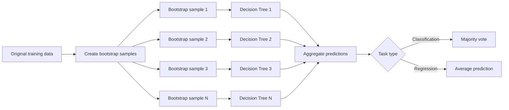
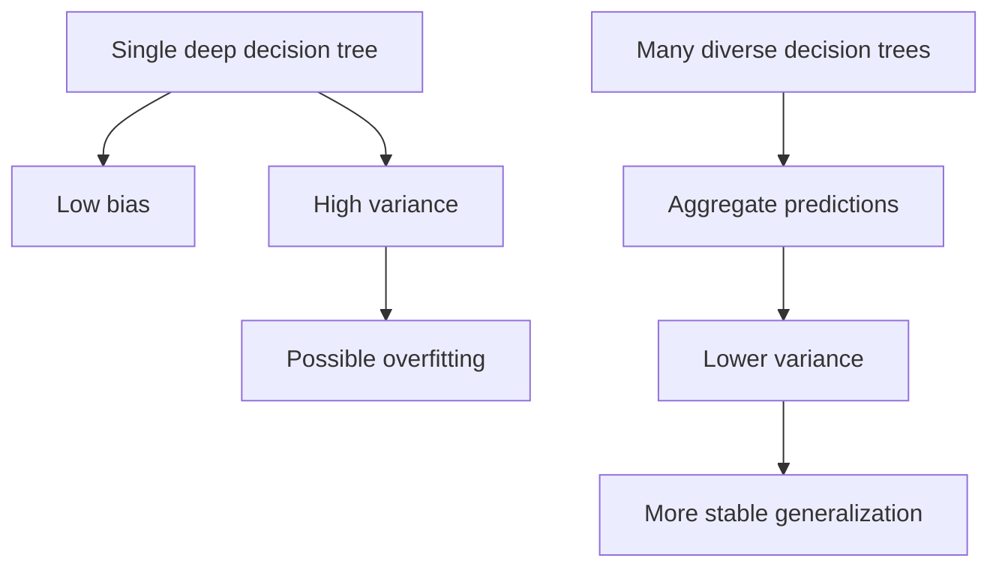
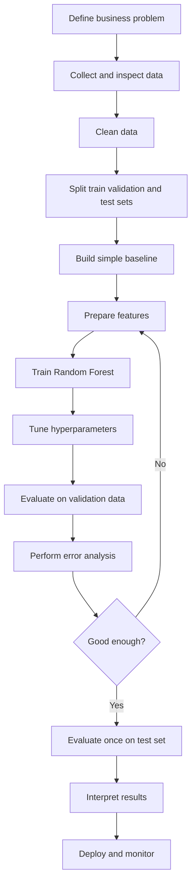
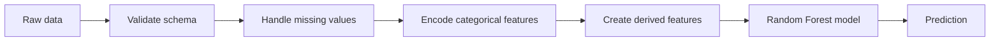
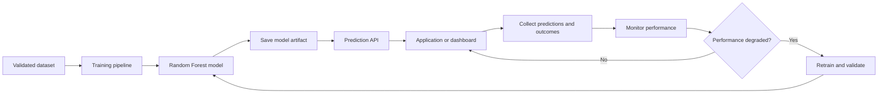

# 005 — Random Forest

**Course:** 03 — Machine Learning and Deep Learning
**Module:** Module 06 — Machine Learning
**Content Group:** Supervised Learning
**Roadmap Source:** Machine Learning / Supervised Learning
**Lesson Type:** Machine Learning
**Order in Module:** 005
**Suggested Duration:** 26 minutes

---

## 1. Overview

**Random Forest** is a supervised machine learning algorithm that combines many decision trees to produce a more accurate and stable prediction.

Instead of depending on a single decision tree, Random Forest trains multiple trees using:

1. Different bootstrap samples of the training data.
2. Random subsets of features at each split.
3. Aggregation of predictions from all trees.

Random Forest can be used for both:

* **Classification**, such as predicting whether a customer will churn.
* **Regression**, such as predicting the price of a house.

After this lesson, you should understand:

* How Random Forest works.
* Why it is usually more reliable than a single decision tree.
* How to train and evaluate a Random Forest model.
* Which hyperparameters control its behavior.
* When Random Forest is an appropriate model.
* How to turn the model into a notebook, experiment, API, or portfolio project.

---

## 2. Learning Objectives

By the end of this lesson, you should be able to:

* Explain Random Forest in your own words.
* Describe the role of bootstrap sampling and random feature selection.
* Distinguish between Random Forest classification and regression.
* Train a Random Forest model with Scikit-learn.
* Compare Random Forest against a simple baseline.
* Evaluate the model using appropriate metrics.
* Identify overfitting, data leakage, and class imbalance.
* Interpret feature importance carefully.
* Perform basic error analysis.
* Connect model performance to a business objective.

---

## 3. What Is Random Forest?

Random Forest is an **ensemble learning method** based on decision trees.

An ensemble combines predictions from multiple models. The central idea is:

> A collection of diverse models can often make better predictions than one individual model.

A single decision tree may fit the training data too closely. This makes it unstable: a small change in the data can produce a very different tree.

Random Forest reduces this instability by averaging predictions from many different trees.

### Classification

For classification, each tree predicts a class. The forest selects the class with the most votes.

```text
Tree 1 -> Churn
Tree 2 -> No Churn
Tree 3 -> Churn
Tree 4 -> Churn
Tree 5 -> No Churn

Final prediction -> Churn
```

### Regression

For regression, each tree predicts a numeric value. The forest calculates the average prediction.

```text
Tree 1 -> 240,000
Tree 2 -> 255,000
Tree 3 -> 248,000
Tree 4 -> 252,000

Final prediction:

(240,000 + 255,000 + 248,000 + 252,000) / 4
= 248,750
```

---

## 4. Random Forest Workflow



---

## 5. How Random Forest Works

Random Forest introduces randomness in two important places.

### 5.1 Bootstrap Sampling

Each decision tree is trained on a random sample of the training data.

The sample is created **with replacement**, which means:

* One observation may appear more than once.
* Some observations may not appear in a particular sample.
* Each tree receives a slightly different dataset.

Example:

```text
Original rows:

A, B, C, D, E

Possible bootstrap sample:

A, C, C, D, E
```

In this sample:

* Row `C` appears twice.
* Row `B` is not selected.

This method is called **bootstrap aggregating**, or **bagging**.

---

### 5.2 Random Feature Selection

A normal decision tree evaluates all available features when selecting a split.

A Random Forest tree evaluates only a random subset of features at each split.

Suppose the dataset contains:

```text
age
income
location
account_age
monthly_usage
support_calls
```

At one node, a tree may evaluate only:

```text
income
monthly_usage
support_calls
```

At another node, it may evaluate:

```text
age
location
account_age
```

This prevents all trees from repeatedly choosing the same dominant feature.

As a result, the trees become more diverse.

---

### 5.3 Prediction Aggregation

After all trees have been trained, Random Forest combines their predictions.

For classification:

```text
Final class = most frequently predicted class
```

For regression:

```text
Final value = average of all tree predictions
```

A simplified regression formula is:

```text
Random Forest prediction =
(sum of predictions from all trees) / number of trees
```

---

## 6. Why Random Forest Works

Random Forest is effective because it combines many models that make somewhat different errors.

A deep decision tree usually has:

* Low bias.
* High variance.
* A high risk of overfitting.

A Random Forest averages many trees, reducing variance while preserving much of their predictive power.



Random Forest works best when:

* Individual trees perform reasonably well.
* Trees are not perfectly correlated.
* Each tree makes different errors.

---

## 7. Random Forest vs. Decision Tree

| Characteristic     | Decision Tree        | Random Forest         |
| ------------------ | -------------------- | --------------------- |
| Number of trees    | One                  | Many                  |
| Training data      | Full training set    | Bootstrap samples     |
| Features per split | Usually all features | Random feature subset |
| Interpretability   | High                 | Lower                 |
| Variance           | High                 | Lower                 |
| Overfitting risk   | Relatively high      | Usually lower         |
| Training speed     | Faster               | Slower                |
| Prediction speed   | Faster               | Slower                |
| Performance        | Good baseline        | Often stronger        |
| Parallel training  | Not applicable       | Usually possible      |

A decision tree is easier to explain visually. Random Forest usually provides better predictive stability.

---

## 8. Classification and Regression

### 8.1 Random Forest Classification

Use `RandomForestClassifier` when the target is categorical.

Examples:

* Fraud or legitimate transaction.
* Churn or no churn.
* Spam or not spam.
* Disease category.
* Product class.
* Loan approval status.

Common evaluation metrics include:

* Accuracy.
* Precision.
* Recall.
* F1-score.
* ROC-AUC.
* PR-AUC.
* Log loss.

---

### 8.2 Random Forest Regression

Use `RandomForestRegressor` when the target is numeric.

Examples:

* House price.
* Customer lifetime value.
* Energy consumption.
* Delivery time.
* Product demand.
* Insurance claim amount.

Common evaluation metrics include:

* MAE.
* MSE.
* RMSE.
* R-squared.
* MAPE, when appropriate.

---

## 9. End-to-End Machine Learning Workflow



A strong model is not just a model with a high score. It must answer a meaningful business question.

---

## 10. Important Hyperparameters

### 10.1 `n_estimators`

The number of trees in the forest.

```python
n_estimators=300
```

More trees usually:

* Improve stability.
* Reduce prediction variance.
* Increase training time.
* Increase memory usage.

After a certain point, adding more trees may provide only small improvements.

---

### 10.2 `max_depth`

The maximum depth of each tree.

```python
max_depth=12
```

A smaller depth:

* Makes trees simpler.
* Reduces overfitting.
* May increase bias.

A larger depth:

* Allows more complex patterns.
* Can improve training performance.
* May increase overfitting.

---

### 10.3 `max_features`

The number of features considered at each split.

Common values include:

```python
max_features="sqrt"
max_features="log2"
max_features=0.5
```

Smaller values create more diverse trees but may make individual trees weaker.

---

### 10.4 `min_samples_split`

The minimum number of samples required to split an internal node.

```python
min_samples_split=10
```

Increasing this value usually creates simpler trees.

---

### 10.5 `min_samples_leaf`

The minimum number of samples required in each leaf node.

```python
min_samples_leaf=4
```

Larger leaf sizes can:

* Reduce overfitting.
* Produce smoother predictions.
* Improve model stability.

---

### 10.6 `bootstrap`

Controls whether each tree uses bootstrap sampling.

```python
bootstrap=True
```

Bootstrap sampling is part of the standard Random Forest algorithm.

---

### 10.7 `class_weight`

Useful for imbalanced classification problems.

```python
class_weight="balanced"
```

This gives more importance to minority-class observations.

However, it does not replace proper evaluation with metrics such as recall, F1-score, PR-AUC, or a confusion matrix.

---

### 10.8 `random_state`

Controls randomness for reproducibility.

```python
random_state=42
```

Using the same value helps reproduce the same model during experiments.

---

### 10.9 `n_jobs`

Controls the number of CPU cores used.

```python
n_jobs=-1
```

The value `-1` uses all available CPU cores.

---

## 11. Classification Example

The following example trains a Random Forest classifier on the breast cancer dataset included with Scikit-learn.

```python
from sklearn.datasets import load_breast_cancer
from sklearn.ensemble import RandomForestClassifier
from sklearn.metrics import (
    accuracy_score,
    classification_report,
    confusion_matrix,
    roc_auc_score,
)
from sklearn.model_selection import train_test_split

# Load the dataset
dataset = load_breast_cancer()

X = dataset.data
y = dataset.target

# Split the data before model training
X_train, X_test, y_train, y_test = train_test_split(
    X,
    y,
    test_size=0.20,
    random_state=42,
    stratify=y,
)

# Create the model
model = RandomForestClassifier(
    n_estimators=300,
    max_depth=None,
    min_samples_leaf=2,
    max_features="sqrt",
    class_weight="balanced",
    random_state=42,
    n_jobs=-1,
)

# Train the model
model.fit(X_train, y_train)

# Generate predictions
y_pred = model.predict(X_test)
y_probability = model.predict_proba(X_test)[:, 1]

# Evaluate the model
accuracy = accuracy_score(y_test, y_pred)
roc_auc = roc_auc_score(y_test, y_probability)

print(f"Accuracy: {accuracy:.4f}")
print(f"ROC-AUC: {roc_auc:.4f}")

print("\nConfusion matrix:")
print(confusion_matrix(y_test, y_pred))

print("\nClassification report:")
print(
    classification_report(
        y_test,
        y_pred,
        target_names=dataset.target_names,
    )
)
```

---

## 12. Regression Example

```python
from sklearn.datasets import fetch_california_housing
from sklearn.ensemble import RandomForestRegressor
from sklearn.metrics import mean_absolute_error, mean_squared_error, r2_score
from sklearn.model_selection import train_test_split

# Load the dataset
dataset = fetch_california_housing()

X = dataset.data
y = dataset.target

# Split the data
X_train, X_test, y_train, y_test = train_test_split(
    X,
    y,
    test_size=0.20,
    random_state=42,
)

# Create the model
model = RandomForestRegressor(
    n_estimators=300,
    max_depth=18,
    min_samples_leaf=2,
    max_features=0.8,
    random_state=42,
    n_jobs=-1,
)

# Train the model
model.fit(X_train, y_train)

# Generate predictions
y_pred = model.predict(X_test)

# Calculate metrics
mae = mean_absolute_error(y_test, y_pred)
rmse = mean_squared_error(
    y_test,
    y_pred,
) ** 0.5
r2 = r2_score(y_test, y_pred)

print(f"MAE: {mae:.4f}")
print(f"RMSE: {rmse:.4f}")
print(f"R-squared: {r2:.4f}")
```

---

## 13. Comparing Random Forest with a Baseline

A model should always be compared against a baseline.

For classification, possible baselines include:

* Predicting the majority class.
* Logistic Regression.
* A shallow Decision Tree.

For regression, possible baselines include:

* Predicting the mean target value.
* Predicting the median target value.
* Linear Regression.
* A shallow Decision Tree.

Example classification comparison:

```python
from sklearn.dummy import DummyClassifier
from sklearn.metrics import f1_score

baseline = DummyClassifier(
    strategy="most_frequent",
)

baseline.fit(X_train, y_train)
baseline_pred = baseline.predict(X_test)

baseline_f1 = f1_score(y_test, baseline_pred)
forest_f1 = f1_score(y_test, y_pred)

print(f"Baseline F1-score: {baseline_f1:.4f}")
print(f"Random Forest F1-score: {forest_f1:.4f}")
```

A complex model is useful only when it provides a meaningful improvement over a simpler approach.

---

## 14. Cross-Validation

A single train-test split may produce an unstable estimate.

Cross-validation evaluates the model across multiple data partitions.

```python
from sklearn.model_selection import cross_validate

scoring = {
    "accuracy": "accuracy",
    "f1": "f1",
    "roc_auc": "roc_auc",
}

cv_results = cross_validate(
    estimator=model,
    X=X,
    y=y,
    cv=5,
    scoring=scoring,
    n_jobs=-1,
)

for metric_name in scoring:
    scores = cv_results[f"test_{metric_name}"]

    print(
        f"{metric_name}: "
        f"{scores.mean():.4f} "
        f"+/- {scores.std():.4f}"
    )
```

Cross-validation provides:

* Mean validation performance.
* Variation across folds.
* A more reliable comparison between models.

For time-series data, do not use standard random cross-validation. Use a time-aware split.

---

## 15. Hyperparameter Tuning

### Randomized Search Example

```python
from scipy.stats import randint
from sklearn.ensemble import RandomForestClassifier
from sklearn.model_selection import RandomizedSearchCV

model = RandomForestClassifier(
    random_state=42,
    n_jobs=-1,
)

parameter_distributions = {
    "n_estimators": randint(100, 800),
    "max_depth": [None, 5, 10, 15, 20, 30],
    "min_samples_split": randint(2, 20),
    "min_samples_leaf": randint(1, 10),
    "max_features": ["sqrt", "log2", 0.5, 0.8],
    "class_weight": [None, "balanced"],
}

search = RandomizedSearchCV(
    estimator=model,
    param_distributions=parameter_distributions,
    n_iter=40,
    scoring="f1",
    cv=5,
    random_state=42,
    n_jobs=-1,
    verbose=1,
)

search.fit(X_train, y_train)

print("Best parameters:")
print(search.best_params_)

print(f"Best cross-validation score: {search.best_score_:.4f}")
```

Choose the scoring metric based on the business objective.

Do not automatically optimize accuracy when the classes are imbalanced.

---

## 16. Out-of-Bag Evaluation

Because each tree uses a bootstrap sample, some training observations are not selected for that tree.

These observations are called **out-of-bag samples**.

They can be used to estimate model performance without creating another validation set.

```python
from sklearn.ensemble import RandomForestClassifier

model = RandomForestClassifier(
    n_estimators=300,
    bootstrap=True,
    oob_score=True,
    random_state=42,
    n_jobs=-1,
)

model.fit(X_train, y_train)

print(f"Out-of-bag score: {model.oob_score_:.4f}")
```

Out-of-bag evaluation is useful for quick experimentation, but a final test set should still be preserved.

---

## 17. Feature Importance

Random Forest can estimate how much each feature contributes to reducing impurity across the trees.

```python
import pandas as pd

feature_importance = pd.Series(
    model.feature_importances_,
    index=dataset.feature_names,
)

feature_importance = feature_importance.sort_values(
    ascending=False,
)

print(feature_importance.head(10))
```

### Visualizing Feature Importance

```python
import matplotlib.pyplot as plt

top_features = feature_importance.head(10).sort_values()

top_features.plot(
    kind="barh",
    figsize=(8, 5),
)

plt.title("Top Random Forest Feature Importances")
plt.xlabel("Importance")
plt.ylabel("Feature")
plt.tight_layout()
plt.show()
```

### Important Caveats

Built-in impurity-based importance may be misleading when:

* A feature has many unique values.
* Features are strongly correlated.
* Continuous and categorical features are compared directly.
* A feature acts as an identifier.
* Leakage features are present.

Feature importance does not prove causality.

---

## 18. Permutation Importance

Permutation importance measures how much model performance decreases when one feature is randomly shuffled.

```python
from sklearn.inspection import permutation_importance

result = permutation_importance(
    estimator=model,
    X=X_test,
    y=y_test,
    scoring="roc_auc",
    n_repeats=10,
    random_state=42,
    n_jobs=-1,
)

permutation_scores = pd.Series(
    result.importances_mean,
    index=dataset.feature_names,
)

permutation_scores = permutation_scores.sort_values(
    ascending=False,
)

print(permutation_scores.head(10))
```

Permutation importance is often more informative than impurity-based importance, but correlated features may still divide importance between themselves.

---

## 19. Error Analysis

A model score does not explain where the model fails.

Error analysis should inspect:

* False positives.
* False negatives.
* Large regression errors.
* Performance across user groups.
* Performance across time periods.
* Performance across geographic regions.
* Performance on rare cases.
* Performance under missing or noisy data.

### Classification Error Table

```python
import pandas as pd

errors = pd.DataFrame({
    "actual": y_test,
    "predicted": y_pred,
    "probability": y_probability,
})

errors = errors[
    errors["actual"] != errors["predicted"]
]

print(errors.head())
```

### Regression Error Table

```python
errors = pd.DataFrame({
    "actual": y_test,
    "predicted": y_pred,
})

errors["absolute_error"] = (
    errors["actual"] - errors["predicted"]
).abs()

errors = errors.sort_values(
    by="absolute_error",
    ascending=False,
)

print(errors.head(10))
```

Error analysis should lead to concrete next steps, such as:

* Collecting additional data.
* Fixing incorrect labels.
* Creating new features.
* Handling missing values differently.
* Adjusting the decision threshold.
* Tuning model complexity.
* Using a different evaluation metric.

---

## 20. Data Preprocessing

Random Forest usually requires less preprocessing than linear models or neural networks.

It normally does not require:

* Feature standardization.
* Min-max scaling.
* Normalization of numeric columns.

However, it still requires correct handling of:

* Missing values.
* Categorical variables.
* Datetime fields.
* Text columns.
* Identifiers.
* Leakage features.
* Duplicate observations.
* High-cardinality categories.

A production pipeline may look like this:



---

## 21. Avoiding Data Leakage

Data leakage occurs when the model receives information that would not be available when making a real prediction.

Examples include:

* Using future information to predict the past.
* Fitting preprocessing on the entire dataset.
* Including a post-outcome variable.
* Including an identifier strongly connected to the target.
* Creating aggregates that contain test-set information.
* Splitting repeated observations from the same entity across train and test sets.

Incorrect workflow:

```text
Full dataset
    -> preprocess all rows
    -> split into train and test
```

Safer workflow:

```text
Full dataset
    -> split into train and test
    -> fit preprocessing on training data
    -> transform training and test data separately
```

Using a Scikit-learn pipeline helps prevent leakage.

---

## 22. Pipeline Example

```python
from sklearn.compose import ColumnTransformer
from sklearn.ensemble import RandomForestClassifier
from sklearn.impute import SimpleImputer
from sklearn.pipeline import Pipeline
from sklearn.preprocessing import OneHotEncoder

numeric_features = [
    "age",
    "monthly_income",
    "account_age",
]

categorical_features = [
    "country",
    "subscription_type",
]

numeric_pipeline = Pipeline(
    steps=[
        (
            "imputer",
            SimpleImputer(strategy="median"),
        ),
    ]
)

categorical_pipeline = Pipeline(
    steps=[
        (
            "imputer",
            SimpleImputer(strategy="most_frequent"),
        ),
        (
            "encoder",
            OneHotEncoder(
                handle_unknown="ignore",
            ),
        ),
    ]
)

preprocessor = ColumnTransformer(
    transformers=[
        (
            "numeric",
            numeric_pipeline,
            numeric_features,
        ),
        (
            "categorical",
            categorical_pipeline,
            categorical_features,
        ),
    ]
)

pipeline = Pipeline(
    steps=[
        (
            "preprocessor",
            preprocessor,
        ),
        (
            "model",
            RandomForestClassifier(
                n_estimators=300,
                class_weight="balanced",
                random_state=42,
                n_jobs=-1,
            ),
        ),
    ]
)

pipeline.fit(X_train, y_train)
y_pred = pipeline.predict(X_test)
```

---

## 23. Strengths of Random Forest

Random Forest offers several advantages:

* Works for classification and regression.
* Captures nonlinear relationships.
* Captures feature interactions automatically.
* Usually requires little feature scaling.
* Is less sensitive to outliers than some linear models.
* Often performs well with limited tuning.
* Reduces the variance of individual decision trees.
* Supports multiclass classification.
* Can estimate feature importance.
* Can use out-of-bag evaluation.
* Can train trees in parallel.
* Provides a strong baseline for tabular datasets.

---

## 24. Limitations of Random Forest

Random Forest also has important limitations:

* It is less interpretable than a single decision tree.
* Large forests can consume significant memory.
* Training can be slow on very large datasets.
* Prediction can be slower than linear models.
* It may not extrapolate well in regression.
* Built-in feature importance can be biased.
* High-cardinality categorical features may create many encoded columns.
* It may perform poorly on extremely sparse, high-dimensional data.
* It does not naturally model time order.
* It may require probability calibration.
* It does not prove causal relationships.

---

## 25. Random Forest Regression and Extrapolation

Tree-based models generally predict using target values found in their training leaves.

As a result, Random Forest regression usually does not predict far beyond the observed training target range.

Example:

```text
Training target range:

100 to 500

Random Forest predictions will usually remain near:

100 to 500
```

This may be a problem when predicting:

* Future growth beyond historical levels.
* Prices in unseen market conditions.
* Demand after a major structural change.

For extrapolation-heavy problems, consider models that explicitly represent trends.

---

## 26. Model Probability Calibration

Random Forest classification can output probabilities:

```python
probabilities = model.predict_proba(X_test)[:, 1]
```

However, a predicted probability of `0.80` does not always mean that approximately 80% of similar cases will be positive.

Probability calibration should be checked when probabilities drive decisions.

```python
from sklearn.calibration import CalibratedClassifierCV

base_model = RandomForestClassifier(
    n_estimators=300,
    random_state=42,
    n_jobs=-1,
)

calibrated_model = CalibratedClassifierCV(
    estimator=base_model,
    method="isotonic",
    cv=5,
)

calibrated_model.fit(X_train, y_train)
```

Calibration is especially important in:

* Credit risk.
* Medical screening.
* Fraud detection.
* Customer retention.
* Resource allocation.

---

## 27. Choosing a Classification Threshold

The default classification threshold is usually `0.5`.

```python
probability = model.predict_proba(X_test)[:, 1]

custom_prediction = (
    probability >= 0.35
).astype(int)
```

A lower threshold may:

* Increase recall.
* Detect more positive cases.
* Increase false positives.

A higher threshold may:

* Increase precision.
* Reduce false positives.
* Miss more positive cases.

The threshold should reflect the business cost of each type of error.

---

## 28. Common Mistakes

### 28.1 Data Leakage

The training process uses information from the validation or test set.

**Solution:** Split the data before fitting preprocessors, feature transformations, and models.

---

### 28.2 Using Accuracy for Imbalanced Data

A model can achieve high accuracy by predicting only the majority class.

**Solution:** Inspect precision, recall, F1-score, PR-AUC, ROC-AUC, and the confusion matrix.

---

### 28.3 No Baseline

A complex model is trained without comparison to a simple approach.

**Solution:** Start with a dummy model, linear model, or shallow tree.

---

### 28.4 Unlimited Tree Complexity

Trees grow deeply with tiny leaf nodes.

**Solution:** Tune `max_depth`, `min_samples_split`, and `min_samples_leaf`.

---

### 28.5 Tuning on the Test Set

The test set is repeatedly used to choose hyperparameters.

**Solution:** Use training and validation data for development. Use the test set once for final evaluation.

---

### 28.6 Trusting Feature Importance Blindly

High importance is interpreted as causal importance.

**Solution:** Use permutation importance, domain knowledge, error analysis, and causal methods when causality matters.

---

### 28.7 Ignoring Business Costs

The model metric improves, but the model does not create meaningful value.

**Solution:** Connect model errors to real operational costs and benefits.

---

### 28.8 Randomly Splitting Time-Dependent Data

Future records may leak into the training set.

**Solution:** Use chronological splits or time-series cross-validation.

---

### 28.9 Ignoring Group Leakage

Records from the same customer, patient, device, or location appear in both train and test sets.

**Solution:** Use group-aware splitting.

---

### 28.10 Reporting Only One Metric

One score hides important failure modes.

**Solution:** Report several complementary metrics and include error analysis.

---

## 29. When to Use Random Forest

Random Forest is a good choice when:

* The dataset is primarily tabular.
* Nonlinear relationships are expected.
* Feature interactions are important.
* You need a strong model with moderate tuning.
* A single decision tree overfits.
* The dataset contains both numeric and encoded categorical features.
* Training and inference resources are sufficient.
* Predictive performance is more important than complete interpretability.

---

## 30. When Another Model May Be Better

Consider another model when:

* You need a simple, highly interpretable relationship.
* The data is extremely high-dimensional and sparse.
* You need very low-latency inference.
* You need strong extrapolation.
* The dataset is naturally sequential or temporal.
* The input is primarily text, image, audio, or video.
* The dataset is very large and gradient boosting is more efficient.
* You need a directly interpretable mathematical formula.

Possible alternatives include:

* Linear Regression.
* Logistic Regression.
* Decision Tree.
* XGBoost.
* LightGBM.
* CatBoost.
* Support Vector Machine.
* Neural Network.
* Time-series models.

---

## 31. Business-Oriented Example

Suppose a company wants to predict customer churn.

### Business Question

> Which active customers are likely to cancel their subscriptions during the next 30 days?

### Possible Features

* Account age.
* Monthly usage.
* Number of support tickets.
* Payment failures.
* Subscription type.
* Recent activity.
* Number of plan changes.
* Customer satisfaction score.

### Target

```text
1 = customer churned
0 = customer remained active
```

### Model Output

```text
Customer A -> churn probability: 0.82
Customer B -> churn probability: 0.64
Customer C -> churn probability: 0.15
```

### Business Action

Customers above a selected probability threshold may receive:

* A retention offer.
* A support call.
* A personalized recommendation.
* A payment reminder.

The model should be evaluated using business outcomes such as:

* Churn prevented.
* Cost per retained customer.
* Revenue saved.
* Number of unnecessary interventions.
* Retention campaign capacity.

---

## 32. Practical Exercise

Use a dataset such as:

* Titanic survival.
* Customer churn.
* Loan default.
* Credit risk.
* Employee attrition.
* House prices.
* Used-car prices.
* Medical diagnosis.

Complete the following tasks:

1. Define the business or analytical question.
2. Identify the target variable.
3. Separate features from the target.
4. Create train, validation, and test sets.
5. Build a simple baseline.
6. Train a Decision Tree.
7. Train a Random Forest.
8. Select appropriate metrics.
9. Compare validation performance.
10. Tune at least three hyperparameters.
11. Evaluate the final model on the test set.
12. Inspect feature importance.
13. Perform error analysis.
14. Record assumptions and limitations.
15. Recommend one next experiment.

---

## 33. Suggested Experiment Table

| Experiment | Model               | Main Parameters    | Validation Metric | Test Metric | Notes                  |
| ---------- | ------------------- | ------------------ | ----------------: | ----------: | ---------------------- |
| 1          | Dummy baseline      | Majority class     |           0.42 F1 |           — | Minimum benchmark      |
| 2          | Logistic Regression | Default            |           0.71 F1 |           — | Interpretable baseline |
| 3          | Decision Tree       | `max_depth=8`      |           0.74 F1 |           — | Some overfitting       |
| 4          | Random Forest       | `n_estimators=300` |           0.81 F1 |           — | Strong improvement     |
| 5          | Tuned Random Forest | Search result      |           0.84 F1 |     0.82 F1 | Final candidate        |

Do not calculate the test metric for every experiment. The test set should be reserved for the final candidate.

---

## 34. Portfolio Artifact

A strong Random Forest portfolio project may include:

```text
project/
├── README.md
├── requirements.txt
├── data/
│   └── data_dictionary.md
├── notebooks/
│   ├── 01_eda.ipynb
│   ├── 02_feature_engineering.ipynb
│   ├── 03_model_comparison.ipynb
│   └── 04_error_analysis.ipynb
├── src/
│   ├── preprocessing.py
│   ├── train.py
│   ├── evaluate.py
│   └── predict.py
├── models/
│   └── random_forest.joblib
├── reports/
│   ├── metrics.json
│   ├── feature_importance.png
│   └── error_analysis.md
├── tests/
│   └── test_pipeline.py
└── app/
    └── api.py
```

Your README should explain:

* The problem.
* The dataset.
* The target variable.
* The evaluation metric.
* The baseline.
* The final model.
* The main results.
* The important errors.
* The business recommendation.
* The limitations.
* How to run the project.

---

## 35. Deployment Workflow



Production monitoring may include:

* Input data drift.
* Prediction drift.
* Missing-value rates.
* Class distribution.
* Latency.
* Error rate.
* Model performance after labels become available.
* Performance across important groups.
* Business impact.

---

## 36. Completion Checklist

* [ ] I can explain Random Forest in one or two minutes.
* [ ] I understand bootstrap sampling.
* [ ] I understand random feature selection.
* [ ] I can explain why the trees should be diverse.
* [ ] I know the difference between classification and regression forests.
* [ ] I trained a simple baseline.
* [ ] I trained a Random Forest model.
* [ ] I selected a metric that matches the problem.
* [ ] I avoided leakage between training and test data.
* [ ] I used validation data or cross-validation for tuning.
* [ ] I evaluated the final model on an untouched test set.
* [ ] I inspected model errors.
* [ ] I interpreted feature importance carefully.
* [ ] I documented at least one assumption or limitation.
* [ ] I identified one useful next experiment.
* [ ] I created a notebook, chart, model, API, or portfolio note.

---

## 37. Related Outcome

Train, compare, and evaluate supervised and unsupervised machine learning models using thoughtful feature engineering, suitable metrics, reproducible experiments, and meaningful error analysis.

---

## 38. Related Project

### Mini Project: House Price Prediction

Build and compare:

1. Mean-value baseline.
2. Linear Regression.
3. Decision Tree Regressor.
4. Random Forest Regressor.
5. XGBoost, LightGBM, or another boosting model.

Suggested workflow:

```text
Business question
    -> exploratory data analysis
    -> train-test split
    -> missing-value handling
    -> feature engineering
    -> baseline model
    -> Linear Regression
    -> Random Forest
    -> boosting model
    -> metric comparison
    -> residual analysis
    -> final recommendation
```

Suggested metrics:

* MAE.
* RMSE.
* R-squared.

Suggested analysis:

* Predicted price versus actual price.
* Distribution of residuals.
* Largest prediction errors.
* Performance by price range.
* Feature importance.
* Model latency and artifact size.

---

## 39. Summary

Random Forest is an ensemble learning algorithm that combines many randomized decision trees.

Its main ideas are:

* Train trees on different bootstrap samples.
* Evaluate random subsets of features at each split.
* Combine predictions through majority voting or averaging.
* Reduce the variance and instability of individual decision trees.

Random Forest is a strong general-purpose model for tabular classification and regression. However, it must still be developed carefully.

A reliable workflow should include:

```text
business question
    -> data split
    -> preprocessing
    -> baseline
    -> Random Forest
    -> validation
    -> hyperparameter tuning
    -> error analysis
    -> final test
    -> deployment
    -> monitoring
```

The objective is not only to achieve a high model score. The objective is to build a reliable system that solves a meaningful problem, avoids leakage, handles errors responsibly, and creates measurable value.

---

# Bài luyện tập

## Mục tiêu


## Đề bài


## Yêu cầu hoàn thành

- [ ] 
- [ ] 
- [ ] 

## Kết quả / lời giải


## Ghi chú
