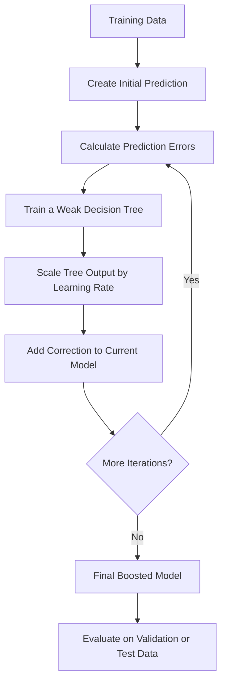
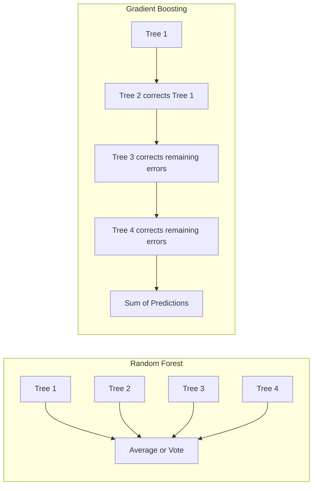
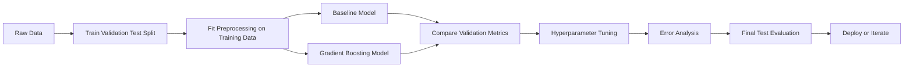
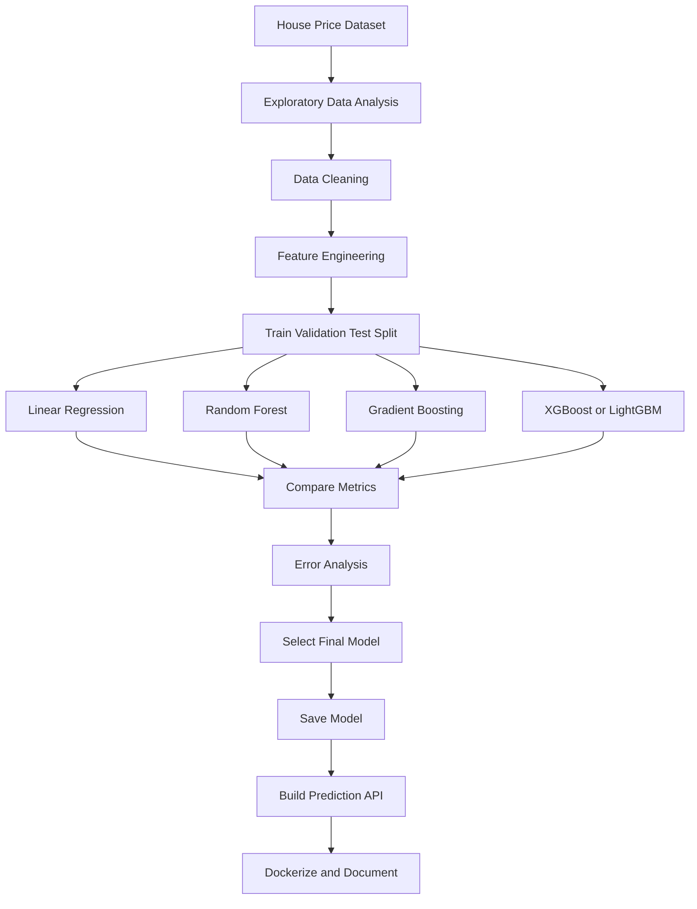

# 006 - Gradient Boosting

**Course:** 03 - Machine Learning and Deep Learning
**Module:** Module 06 - Machine Learning
**Content Group:** Supervised Learning
**Roadmap Source:** Machine Learning / Supervised Learning
**Lesson Type:** Machine Learning
**Order in Module:** 006
**Suggested Duration:** 26 minutes

---

## 1. Overview

This lesson explains **Gradient Boosting** in the context of AI and Data Science.

Gradient Boosting is an ensemble learning method that builds a strong predictive model by combining many weak models, usually shallow decision trees. Unlike Random Forest, which trains trees independently, Gradient Boosting trains models sequentially. Each new model attempts to correct the errors made by the previous models.

After completing this lesson, you should understand:

* How Gradient Boosting works.
* Why models are trained sequentially.
* How Gradient Boosting handles regression and classification.
* How learning rate, tree depth, and the number of estimators affect performance.
* How to evaluate Gradient Boosting without introducing data leakage.
* When to use implementations such as XGBoost, LightGBM, and CatBoost.

---

## 2. Learning Objectives

By the end of this lesson, you should be able to:

* Explain Gradient Boosting in your own words.
* Describe the difference between boosting and bagging.
* Explain how each new learner corrects previous prediction errors.
* Train a Gradient Boosting model for regression or classification.
* Compare Gradient Boosting with a simple baseline and another tree-based model.
* Tune important hyperparameters.
* Evaluate the model using suitable validation and test metrics.
* Identify overfitting, data leakage, and incorrect evaluation procedures.
* Turn the lesson into a notebook, experiment, model API, or portfolio artifact.

---

## 3. Main Concept

Gradient Boosting combines multiple weak learners into one strong learner.

A weak learner is a model that performs only slightly better than a simple or random prediction. In Gradient Boosting, shallow decision trees are commonly used as weak learners.

The models are trained one after another:

1. Train an initial model.
2. Calculate its prediction errors.
3. Train a new tree to reduce those errors.
4. Add the new tree to the existing model.
5. Repeat the process for a fixed number of iterations.

The final prediction is the sum of the predictions from all learners.

```text
Final prediction
    =
Initial prediction
    + Tree 1 correction
    + Tree 2 correction
    + Tree 3 correction
    + ...
```

---

## 4. Intuition

Suppose a model predicts house prices.

The first tree may learn a simple rule based on house size. However, it may underestimate expensive houses and overestimate cheaper houses.

The second tree is trained to correct those errors.

The third tree then focuses on the errors that remain after the first two trees.

This process continues until:

* The maximum number of trees is reached.
* The remaining errors become sufficiently small.
* Early stopping detects that validation performance is no longer improving.

```text
Model 1:
Predicts the main pattern.

Model 2:
Corrects errors made by Model 1.

Model 3:
Corrects errors remaining after Models 1 and 2.

Final model:
Combines all corrections.
```

---

## 5. Gradient Boosting Workflow



---

## 6. Mathematical Idea

### 6.1 Additive Model

Gradient Boosting creates an additive model.

A simplified representation is:

```text
F_M(x) = F_0(x) + learning_rate * h_1(x)
                  + learning_rate * h_2(x)
                  + ...
                  + learning_rate * h_M(x)
```

Where:

* `F_M(x)` is the final prediction.
* `F_0(x)` is the initial prediction.
* `h_m(x)` is the weak learner trained at iteration `m`.
* `M` is the total number of weak learners.
* `learning_rate` controls the contribution of each learner.

---

### 6.2 Initial Prediction for Regression

For squared-error regression, the initial prediction is often the mean of the target values.

```text
F_0(x) = mean(y)
```

For example, suppose the training house prices are:

```text
100, 150, 200, 250, 300
```

The initial prediction is:

```text
F_0(x) = 200
```

Every sample initially receives a predicted value of `200`.

---

### 6.3 Residuals

For squared-error regression, the residual is:

```text
residual_i = actual_i - predicted_i
```

Example:

```text
Actual value:     250
Predicted value:  200
Residual:          50
```

A new decision tree is trained to predict these residuals.

The updated prediction becomes:

```text
new_prediction
    =
old_prediction
    + learning_rate * predicted_residual
```

---

### 6.4 Why It Is Called Gradient Boosting

Gradient Boosting is not limited to directly predicting residuals.

More generally, each new learner follows the negative gradient of the loss function.

```text
pseudo_residual
    =
negative gradient of loss
    with respect to current prediction
```

The negative gradient indicates the direction in which the prediction should move to reduce the loss.

For squared-error loss, the negative gradient is equivalent to the residual:

```text
negative_gradient = actual - predicted
```

For other loss functions, the pseudo-residual may take a different form.

---

## 7. Simplified Regression Example

Suppose the actual target values are:

```text
y = [10, 20, 30]
```

### Step 1: Initial Prediction

The initial prediction is the mean:

```text
initial_prediction = (10 + 20 + 30) / 3
initial_prediction = 20
```

Initial predictions:

```text
[20, 20, 20]
```

### Step 2: Calculate Residuals

```text
residuals = actual - prediction
```

```text
10 - 20 = -10
20 - 20 =   0
30 - 20 =  10
```

Residuals:

```text
[-10, 0, 10]
```

### Step 3: Train a Weak Tree

The weak tree learns to predict the residuals.

Assume it predicts:

```text
[-8, 0, 8]
```

### Step 4: Apply the Learning Rate

Assume:

```text
learning_rate = 0.1
```

Corrections:

```text
0.1 * [-8, 0, 8] = [-0.8, 0, 0.8]
```

### Step 5: Update the Predictions

```text
new_predictions
    =
old_predictions + corrections
```

```text
[20, 20, 20] + [-0.8, 0, 0.8]
    =
[19.2, 20, 20.8]
```

The predictions moved slightly toward the actual values.

The process repeats with another weak learner.

---

## 8. Gradient Boosting for Classification

Gradient Boosting can also solve classification problems.

Instead of directly predicting class labels, the model usually builds an additive score. This score is converted into a probability.

For binary classification, the logistic sigmoid function is commonly used:

```text
probability
    =
1 / (1 + exp(-score))
```

The predicted class may then be determined using a threshold:

```text
if probability >= 0.5:
    predicted_class = 1
else:
    predicted_class = 0
```

During training, each new tree attempts to reduce a classification loss such as log loss.

---

## 9. Weak Learners

Gradient Boosting commonly uses shallow decision trees.

These trees are often called:

* Decision stumps when their maximum depth is `1`.
* Weak learners when they have limited predictive power.
* Base learners because they are the individual models inside the ensemble.

A shallow tree may capture only a small pattern, but many shallow trees can produce a powerful model.

```text
Weak Tree 1  \
Weak Tree 2   \
Weak Tree 3    > Combined Strong Model
Weak Tree 4   /
Weak Tree 5  /
```

Using extremely deep trees can make Gradient Boosting:

* Slower.
* More difficult to tune.
* More likely to overfit.
* Less dependent on the boosting process.

---

## 10. Important Hyperparameters

### 10.1 Number of Estimators

The number of estimators defines how many weak learners are added.

```python
n_estimators=200
```

A small value may cause underfitting.

A very large value may:

* Increase training time.
* Increase model size.
* Cause overfitting when regularization is insufficient.

---

### 10.2 Learning Rate

The learning rate controls how much each new tree contributes.

```python
learning_rate=0.05
```

A smaller learning rate usually requires more trees.

A larger learning rate allows faster learning but may overshoot useful corrections or overfit.

```text
Small learning rate:
- Smaller updates
- More trees required
- Often more stable

Large learning rate:
- Larger updates
- Fewer trees required
- Higher overfitting risk
```

The learning rate and number of estimators should be tuned together.

---

### 10.3 Maximum Tree Depth

The maximum depth controls the complexity of each weak learner.

```python
max_depth=3
```

Shallow trees:

* Learn simpler patterns.
* Usually generalize better.
* Are common in boosting models.

Deep trees:

* Capture complex feature interactions.
* Increase computational cost.
* May overfit more easily.

---

### 10.4 Minimum Samples per Leaf

This parameter controls the minimum number of training samples required in a leaf node.

```python
min_samples_leaf=10
```

Larger values make the trees more conservative and can reduce overfitting.

---

### 10.5 Subsample

The subsample value specifies the fraction of training samples used for each tree.

```python
subsample=0.8
```

When the value is below `1.0`, the method is sometimes called stochastic Gradient Boosting.

Benefits may include:

* Lower variance.
* Better generalization.
* Additional randomness.
* Reduced overfitting.

---

### 10.6 Loss Function

The loss function defines what the model attempts to minimize.

Common regression losses include:

```text
Squared error
Absolute error
Huber loss
Quantile loss
```

Common classification losses include:

```text
Log loss
Exponential loss
```

The correct loss should reflect the prediction problem and business objective.

---

## 11. Bias-Variance Trade-Off

Gradient Boosting usually reduces bias by adding learners sequentially.

However, model variance can increase when:

* Too many trees are added.
* Trees are too deep.
* The learning rate is too high.
* The training dataset is small or noisy.
* Validation is not used correctly.

Regularization techniques include:

* Lower learning rate.
* Smaller tree depth.
* Fewer estimators.
* Subsampling.
* Minimum leaf-size constraints.
* Early stopping.
* L1 or L2 regularization in advanced implementations.

---

## 12. Gradient Boosting vs Random Forest

| Aspect                         | Gradient Boosting               | Random Forest                     |
| ------------------------------ | ------------------------------- | --------------------------------- |
| Ensemble strategy              | Boosting                        | Bagging                           |
| Tree training                  | Sequential                      | Independent and parallel          |
| Main objective                 | Correct previous errors         | Reduce variance through averaging |
| Typical tree depth             | Shallow                         | Often deeper                      |
| Sensitivity to hyperparameters | Higher                          | Lower                             |
| Training speed                 | Often slower                    | Often faster                      |
| Parallelization                | More difficult                  | Easier                            |
| Overfitting risk               | Higher when poorly tuned        | Usually more resistant            |
| Predictive performance         | Often excellent on tabular data | Strong and reliable baseline      |
| Missing-value support          | Depends on implementation       | Depends on implementation         |

### Conceptual Difference



---

## 13. Popular Gradient Boosting Implementations

### 13.1 Scikit-Learn Gradient Boosting

Scikit-learn provides:

* `GradientBoostingRegressor`
* `GradientBoostingClassifier`
* `HistGradientBoostingRegressor`
* `HistGradientBoostingClassifier`

The classic implementation is useful for learning and smaller datasets.

Histogram-based implementations are usually faster for larger tabular datasets.

---

### 13.2 XGBoost

XGBoost is an optimized Gradient Boosting library.

Important capabilities include:

* Regularization.
* Missing-value handling.
* Parallel tree construction.
* Row and column sampling.
* Early stopping.
* CPU and GPU support.
* Efficient sparse-data processing.

---

### 13.3 LightGBM

LightGBM is designed for efficient training on large datasets.

Important characteristics include:

* Histogram-based training.
* Leaf-wise tree growth.
* Fast training.
* Low memory usage.
* Native categorical feature support in many workflows.

Leaf-wise growth can produce high performance but may overfit small datasets when not carefully constrained.

---

### 13.4 CatBoost

CatBoost is particularly useful when datasets contain many categorical variables.

Important capabilities include:

* Native categorical feature processing.
* Reduced need for manual one-hot encoding.
* Ordered boosting techniques.
* Strong default configurations.
* Good performance on mixed tabular data.

---

## 14. Basic Regression Example

```python
from sklearn.datasets import fetch_california_housing
from sklearn.ensemble import GradientBoostingRegressor
from sklearn.metrics import mean_absolute_error, mean_squared_error, r2_score
from sklearn.model_selection import train_test_split

# Load the dataset
dataset = fetch_california_housing()
X = dataset.data
y = dataset.target

# Split the data
X_train, X_test, y_train, y_test = train_test_split(
    X,
    y,
    test_size=0.2,
    random_state=42
)

# Create the model
model = GradientBoostingRegressor(
    n_estimators=200,
    learning_rate=0.05,
    max_depth=3,
    random_state=42
)

# Train the model
model.fit(X_train, y_train)

# Generate predictions
predictions = model.predict(X_test)

# Evaluate the model
mae = mean_absolute_error(y_test, predictions)
mse = mean_squared_error(y_test, predictions)
rmse = mse ** 0.5
r2 = r2_score(y_test, predictions)

print(f"MAE:  {mae:.4f}")
print(f"RMSE: {rmse:.4f}")
print(f"R²:   {r2:.4f}")
```

---

## 15. Basic Classification Example

```python
from sklearn.datasets import load_breast_cancer
from sklearn.ensemble import GradientBoostingClassifier
from sklearn.metrics import (
    accuracy_score,
    classification_report,
    confusion_matrix,
    roc_auc_score,
)
from sklearn.model_selection import train_test_split

# Load the dataset
dataset = load_breast_cancer()
X = dataset.data
y = dataset.target

# Create a stratified train-test split
X_train, X_test, y_train, y_test = train_test_split(
    X,
    y,
    test_size=0.2,
    stratify=y,
    random_state=42
)

# Create the model
model = GradientBoostingClassifier(
    n_estimators=150,
    learning_rate=0.05,
    max_depth=3,
    random_state=42
)

# Train the model
model.fit(X_train, y_train)

# Generate predictions
predicted_classes = model.predict(X_test)
predicted_probabilities = model.predict_proba(X_test)[:, 1]

# Evaluate the model
accuracy = accuracy_score(y_test, predicted_classes)
roc_auc = roc_auc_score(y_test, predicted_probabilities)

print(f"Accuracy: {accuracy:.4f}")
print(f"ROC-AUC:  {roc_auc:.4f}")
print("\nConfusion Matrix:")
print(confusion_matrix(y_test, predicted_classes))
print("\nClassification Report:")
print(classification_report(y_test, predicted_classes))
```

---

## 16. Baseline Comparison

A complex model should always be compared with a simple baseline.

For regression, useful baselines include:

* Mean prediction.
* Median prediction.
* Linear Regression.
* Decision Tree Regressor.

For classification, useful baselines include:

* Majority-class prediction.
* Logistic Regression.
* Decision Tree Classifier.
* Random Forest Classifier.

Example regression comparison:

```python
from sklearn.dummy import DummyRegressor
from sklearn.metrics import mean_absolute_error

baseline = DummyRegressor(strategy="mean")
baseline.fit(X_train, y_train)

baseline_predictions = baseline.predict(X_test)
model_predictions = model.predict(X_test)

baseline_mae = mean_absolute_error(y_test, baseline_predictions)
model_mae = mean_absolute_error(y_test, model_predictions)

print(f"Baseline MAE: {baseline_mae:.4f}")
print(f"Boosting MAE: {model_mae:.4f}")
```

The Gradient Boosting model is useful only when it improves the relevant business metric enough to justify its additional complexity.

---

## 17. Model Evaluation Workflow

```text
data
  -> train-validation-test split
  -> preprocessing
  -> baseline model
  -> Gradient Boosting model
  -> hyperparameter tuning
  -> validation metric
  -> error analysis
  -> final test evaluation
  -> deployment decision
```



---

## 18. Choosing the Correct Metric

### Regression Metrics

| Metric        | Useful When                                                  |
| ------------- | ------------------------------------------------------------ |
| MAE           | Errors should have a linear and interpretable penalty        |
| MSE           | Large errors should receive a stronger penalty               |
| RMSE          | You want an error measure in the target's original unit      |
| R-squared     | You want to measure explained variance                       |
| MAPE          | Percentage error is meaningful and targets are not near zero |
| Quantile loss | You need prediction intervals or asymmetric estimates        |

### Classification Metrics

| Metric    | Useful When                           |
| --------- | ------------------------------------- |
| Accuracy  | Classes are reasonably balanced       |
| Precision | False positives are costly            |
| Recall    | False negatives are costly            |
| F1-score  | Precision and recall must be balanced |
| ROC-AUC   | Ranking performance matters           |
| PR-AUC    | The positive class is rare            |
| Log loss  | Probability quality matters           |

The evaluation metric should represent the real cost of errors.

---

## 19. Hyperparameter Tuning Example

```python
from sklearn.ensemble import GradientBoostingRegressor
from sklearn.model_selection import GridSearchCV

model = GradientBoostingRegressor(random_state=42)

parameter_grid = {
    "n_estimators": [100, 200, 300],
    "learning_rate": [0.01, 0.05, 0.1],
    "max_depth": [2, 3, 4],
    "min_samples_leaf": [1, 5, 10],
    "subsample": [0.8, 1.0],
}

search = GridSearchCV(
    estimator=model,
    param_grid=parameter_grid,
    scoring="neg_mean_absolute_error",
    cv=5,
    n_jobs=-1,
)

search.fit(X_train, y_train)

print("Best parameters:")
print(search.best_params_)

print("Best cross-validation MAE:")
print(-search.best_score_)
```

A full grid can become expensive. For larger search spaces, consider:

* Randomized search.
* Bayesian optimization.
* Optuna.
* Early stopping.
* Successive halving.

---

## 20. Early Stopping

Early stopping ends training when validation performance stops improving.

It helps:

* Reduce overfitting.
* Save training time.
* Select a suitable number of trees.

Example with histogram-based Gradient Boosting:

```python
from sklearn.ensemble import HistGradientBoostingRegressor

model = HistGradientBoostingRegressor(
    learning_rate=0.05,
    max_iter=500,
    max_leaf_nodes=31,
    early_stopping=True,
    validation_fraction=0.1,
    n_iter_no_change=20,
    random_state=42,
)

model.fit(X_train, y_train)
```

---

## 21. Feature Importance

Tree-based Gradient Boosting models can provide feature-importance values.

```python
import pandas as pd

importance_table = pd.DataFrame({
    "feature": dataset.feature_names,
    "importance": model.feature_importances_,
})

importance_table = importance_table.sort_values(
    by="importance",
    ascending=False
)

print(importance_table)
```

However, impurity-based feature importance has limitations:

* It may favor continuous or high-cardinality features.
* Correlated features can divide importance between themselves.
* It does not show whether a feature increases or decreases a prediction.
* It does not prove causality.

More reliable interpretation tools include:

* Permutation importance.
* Partial dependence plots.
* SHAP values.
* Individual conditional expectation plots.

---

## 22. Data Preprocessing

Gradient Boosting models usually require less preprocessing than linear models.

They often do not require:

* Feature scaling.
* Standardization.
* Normalization.
* Polynomial feature generation.

However, you may still need to handle:

* Missing values.
* Categorical variables.
* Invalid values.
* Extreme outliers.
* Date and time features.
* Text variables.
* Data leakage.
* High-cardinality identifiers.

The exact preprocessing requirements depend on the implementation.

For example:

* Classic scikit-learn Gradient Boosting does not directly accept missing values.
* Histogram-based Gradient Boosting can handle missing values.
* CatBoost can process categorical variables directly.
* XGBoost and LightGBM can handle missing values internally.

---

## 23. Data Leakage

Data leakage occurs when training uses information that would not be available when the model makes real predictions.

Common examples include:

* Preprocessing the entire dataset before splitting.
* Using future information to predict the past.
* Including post-outcome variables.
* Performing feature selection on the complete dataset.
* Tuning hyperparameters using the final test set.
* Using target-derived aggregate features without proper folds.

Incorrect workflow:

```text
full dataset
  -> preprocessing
  -> train-test split
```

Correct workflow:

```text
full dataset
  -> train-test split
  -> fit preprocessing on training data only
  -> transform validation and test data
```

A pipeline helps reduce leakage:

```python
from sklearn.compose import ColumnTransformer
from sklearn.impute import SimpleImputer
from sklearn.pipeline import Pipeline
from sklearn.preprocessing import OneHotEncoder
from sklearn.ensemble import GradientBoostingRegressor

numeric_pipeline = Pipeline(
    steps=[
        ("imputer", SimpleImputer(strategy="median")),
    ]
)

categorical_pipeline = Pipeline(
    steps=[
        ("imputer", SimpleImputer(strategy="most_frequent")),
        (
            "encoder",
            OneHotEncoder(
                handle_unknown="ignore",
                sparse_output=False,
            ),
        ),
    ]
)

preprocessor = ColumnTransformer(
    transformers=[
        ("numeric", numeric_pipeline, numeric_columns),
        ("categorical", categorical_pipeline, categorical_columns),
    ]
)

model_pipeline = Pipeline(
    steps=[
        ("preprocessor", preprocessor),
        (
            "model",
            GradientBoostingRegressor(
                n_estimators=200,
                learning_rate=0.05,
                max_depth=3,
                random_state=42,
            ),
        ),
    ]
)

model_pipeline.fit(X_train, y_train)
```

---

## 24. Error Analysis

A model score alone does not explain model behavior.

After evaluation, investigate:

* Which samples have the largest prediction errors?
* Does performance vary by customer, location, category, or time period?
* Are errors larger for rare cases?
* Are specific classes frequently confused?
* Are predictions poorly calibrated?
* Are important variables missing?
* Is the model learning an unwanted proxy?
* Does the model fail under distribution shift?

Regression error table:

```python
import pandas as pd

error_analysis = pd.DataFrame({
    "actual": y_test,
    "predicted": predictions,
})

error_analysis["absolute_error"] = (
    error_analysis["actual"] - error_analysis["predicted"]
).abs()

largest_errors = error_analysis.sort_values(
    by="absolute_error",
    ascending=False
)

print(largest_errors.head(20))
```

Error analysis should lead to an action, such as:

* Correcting data-quality issues.
* Engineering new features.
* Collecting more data.
* Changing the loss function.
* Adjusting the decision threshold.
* Training separate models for different segments.
* Reconsidering the business target.

---

## 25. Advantages

Gradient Boosting offers several benefits:

* Excellent performance on structured and tabular data.
* Supports nonlinear relationships.
* Captures feature interactions automatically.
* Requires little feature scaling.
* Works for regression and classification.
* Supports many loss functions.
* Can model complex decision boundaries.
* Often performs strongly in machine-learning competitions.
* Provides feature-importance and interpretation options.

---

## 26. Limitations

Gradient Boosting also has limitations:

* Training is sequential and can be slow.
* Hyperparameter tuning can be difficult.
* Poor settings can cause overfitting.
* Models are less interpretable than a single decision tree.
* Large ensembles can require significant memory.
* Prediction latency can increase with the number of trees.
* Performance may degrade under distribution shift.
* Standard implementations may require manual handling of categorical variables.
* Feature importance can be misleading without careful interpretation.

---

## 27. When to Use Gradient Boosting

Gradient Boosting is a strong choice when:

* The dataset is tabular.
* Relationships are nonlinear.
* Feature interactions are important.
* Predictive accuracy is a priority.
* A simple baseline is not sufficiently accurate.
* The dataset is small or medium-sized.
* You can afford model tuning and validation.
* You need strong performance without building a neural network.

Typical applications include:

* House price prediction.
* Credit-risk scoring.
* Customer churn prediction.
* Fraud detection.
* Demand forecasting.
* Insurance claim prediction.
* Medical risk classification.
* Customer conversion prediction.
* Ranking and recommendation systems.

---

## 28. When Not to Use It

Gradient Boosting may not be the best first choice when:

* The relationship is simple and linear.
* Interpretability is the highest priority.
* Training or prediction latency must be extremely low.
* The dataset contains raw images, audio, or long text.
* The number of features is extremely large and sparse.
* The dataset changes too quickly to support frequent retraining.
* A simple baseline already meets the business requirement.

Possible alternatives include:

* Linear Regression.
* Logistic Regression.
* Random Forest.
* Generalized linear models.
* Neural networks.
* Specialized image, audio, or language models.

---

## 29. Practical Exercise

### Objective

Build a house-price prediction model and compare:

1. Mean baseline.
2. Linear Regression.
3. Random Forest.
4. Gradient Boosting.
5. XGBoost or another advanced boosting implementation.

### Suggested Steps

1. Load a house-price dataset.
2. Inspect the target distribution.
3. Identify numerical and categorical features.
4. Split the dataset into training, validation, and test sets.
5. Build a preprocessing pipeline.
6. Train a simple baseline.
7. Train Linear Regression.
8. Train Random Forest.
9. Train Gradient Boosting.
10. Compare MAE, RMSE, and R-squared.
11. Tune the learning rate and number of estimators.
12. Analyze the largest prediction errors.
13. Calculate permutation importance or SHAP values.
14. Document one model risk or limitation.
15. Save the best model and expose it through a small API.

---

## 30. Experiment Tracking Table

| Experiment | Model             | Learning Rate | Estimators | Max Depth | Validation MAE | Test MAE | Notes                  |
| ---------- | ----------------- | ------------: | ---------: | --------: | -------------: | -------: | ---------------------- |
| E01        | Mean baseline     |           N/A |        N/A |       N/A |           0.00 |     0.00 | Initial baseline       |
| E02        | Linear Regression |           N/A |        N/A |       N/A |           0.00 |     0.00 | Linear benchmark       |
| E03        | Random Forest     |           N/A |        300 |        12 |           0.00 |     0.00 | Bagging model          |
| E04        | Gradient Boosting |          0.10 |        100 |         3 |           0.00 |     0.00 | Initial boosting model |
| E05        | Gradient Boosting |          0.05 |        300 |         3 |           0.00 |     0.00 | Lower learning rate    |
| E06        | XGBoost           |          0.05 |        500 |         5 |           0.00 |     0.00 | Regularized boosting   |

Replace the placeholder metrics with actual experimental results.

---

## 31. Common Mistakes

### Mistake 1: Data Leakage

Preprocessing or feature engineering is performed using information from the validation or test set.

**Solution:** Fit every data-dependent transformation using the training data only.

---

### Mistake 2: Choosing the Wrong Metric

The model is optimized for accuracy even though false negatives have a much higher business cost.

**Solution:** Select metrics according to the real decision and error costs.

---

### Mistake 3: No Baseline

A complex boosting model is trained without comparing it with a simple model.

**Solution:** Always include a dummy model or simple statistical baseline.

---

### Mistake 4: Learning Rate Is Too High

Large updates may make training unstable and increase overfitting.

**Solution:** Lower the learning rate and increase the number of estimators.

---

### Mistake 5: Trees Are Too Deep

Deep trees may memorize training patterns.

**Solution:** Begin with a small depth such as `2`, `3`, or `4`.

---

### Mistake 6: Too Many Estimators

Training continues after validation performance stops improving.

**Solution:** Use validation curves or early stopping.

---

### Mistake 7: Tuning on the Test Set

Repeatedly checking the test score turns the test set into part of the training process.

**Solution:** Use the validation set for tuning and evaluate the test set only after the model is finalized.

---

### Mistake 8: Treating Feature Importance as Causality

A feature with high importance is assumed to cause the target.

**Solution:** Treat importance as evidence of predictive contribution, not causal effect.

---

### Mistake 9: Ignoring Probability Calibration

A classifier may rank samples well while producing unreliable probabilities.

**Solution:** Evaluate calibration curves, Brier score, or calibration methods when probabilities support business decisions.

---

### Mistake 10: Ignoring Deployment Cost

A model is selected only because it has the best offline score.

**Solution:** Also evaluate latency, memory usage, explainability, monitoring needs, and maintenance cost.

---

## 32. Completion Checklist

* [ ] I can explain Gradient Boosting in one or two minutes.
* [ ] I understand why learners are trained sequentially.
* [ ] I understand how residuals or negative gradients are used.
* [ ] I can explain the role of the learning rate.
* [ ] I can explain the relationship between learning rate and number of estimators.
* [ ] I can distinguish Gradient Boosting from Random Forest.
* [ ] I trained a baseline and at least one Gradient Boosting model.
* [ ] I evaluated the model using a validation or cross-validation procedure.
* [ ] I selected metrics based on the business problem.
* [ ] I checked for data leakage.
* [ ] I performed error analysis.
* [ ] I documented at least one assumption, caveat, or model risk.
* [ ] I created a notebook, chart, model, API, or portfolio note for this lesson.

---

## 33. Related Outcome

Train, compare, and evaluate supervised and unsupervised machine-learning models using thoughtful feature engineering, appropriate metrics, reliable validation, and systematic error analysis.

---

## 34. Related Project

### Mini Project: House Price Prediction

Build a complete machine-learning workflow containing:

* Exploratory data analysis.
* Missing-value handling.
* Categorical-variable encoding.
* Feature engineering.
* Linear Regression baseline.
* Random Forest model.
* Gradient Boosting model.
* XGBoost, LightGBM, or CatBoost model.
* Hyperparameter tuning.
* MAE and RMSE comparison.
* Error analysis.
* Feature interpretation.
* Model serialization.
* REST API deployment.
* Docker configuration.
* Portfolio documentation.

Suggested project workflow:



---

## 35. Summary

**Gradient Boosting** is an ensemble method that builds a strong model by adding weak learners sequentially.

Each new learner attempts to reduce the errors produced by the current ensemble. The learning rate controls the size of each correction, while the number and complexity of trees determine the overall model capacity.

Gradient Boosting often performs extremely well on tabular datasets, but it must be trained carefully. A reliable workflow should include:

* A simple baseline.
* Correct train-validation-test separation.
* Appropriate metrics.
* Hyperparameter tuning.
* Early stopping.
* Data-leakage prevention.
* Error analysis.
* Model interpretation.
* Deployment and monitoring considerations.

Turn this lesson into a practical artifact such as a notebook, experiment report, prediction API, Docker service, or portfolio project so that the knowledge becomes measurable and reusable.

---

# Bài luyện tập

## Mục tiêu


## Đề bài


## Yêu cầu hoàn thành

- [ ] 
- [ ] 
- [ ] 

## Kết quả / lời giải


## Ghi chú
