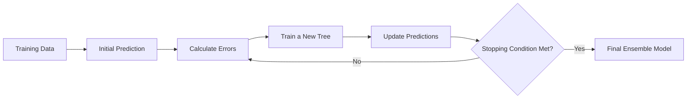
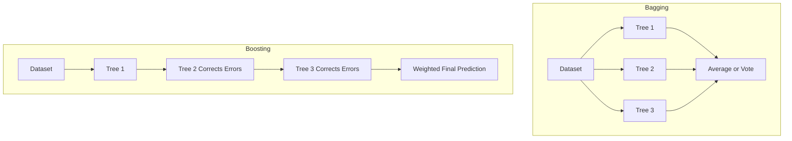

# 007 - XGBoost and LightGBM

**Course:** 03 - Machine Learning and Deep Learning
**Module:** Module 06 - Machine Learning
**Content Group:** Supervised Learning
**Roadmap Source:** Machine Learning / Supervised Learning
**Lesson Type:** Machine Learning
**Lesson Order:** 007
**Suggested Duration:** 26 minutes

---

## 1. Summary

This lesson introduces **XGBoost** and **LightGBM**, two powerful gradient boosting frameworks widely used for supervised machine learning on structured and tabular data.

Both algorithms build an ensemble of decision trees sequentially. Each new tree attempts to correct the errors made by the previous trees.

After completing this lesson, you should understand:

* How gradient-boosted decision trees work.
* How XGBoost and LightGBM improve standard gradient boosting.
* The main differences between XGBoost and LightGBM.
* How to train and evaluate these models.
* How to tune important hyperparameters.
* How to prevent overfitting and data leakage.
* When these models are appropriate for a business problem.

---

## 2. Learning Objectives

By the end of this lesson, you should be able to:

* Explain XGBoost and LightGBM in your own words.
* Describe how boosting differs from bagging.
* Identify the role of these models in a machine learning workflow.
* Train XGBoost and LightGBM models on a tabular dataset.
* Compare them with a simple baseline model.
* Select evaluation metrics that match the business objective.
* Interpret feature importance and model errors.
* Identify common problems such as overfitting and data leakage.
* Turn the experiment into a notebook, API, report, or portfolio artifact.

---

## 3. Main Concepts

### 3.1 What Is Gradient Boosting?

Gradient boosting is an ensemble learning method that combines many weak learners, usually shallow decision trees, into a strong predictive model.

Unlike Random Forest, which trains trees independently, gradient boosting trains trees **sequentially**.

Each new tree focuses on the errors made by the current ensemble.

```text
Final prediction =
Initial prediction
+ Tree 1 correction
+ Tree 2 correction
+ Tree 3 correction
+ ...
```

The general prediction process can be written as:

```text
F_m(x) = F_(m-1)(x) + learning_rate × tree_m(x)
```

Where:

* `F_m(x)` is the model after adding tree `m`.
* `F_(m-1)(x)` is the previous model.
* `tree_m(x)` is the new tree trained to reduce the remaining error.
* `learning_rate` controls how strongly each tree affects the final prediction.

---

### 3.2 Gradient Boosting Workflow



At each iteration:

1. The current model generates predictions.
2. The loss function measures prediction errors.
3. A new tree learns how to reduce those errors.
4. The new tree is added to the ensemble.
5. The process repeats until a stopping condition is reached.

---

## 4. XGBoost

### 4.1 What Is XGBoost?

**XGBoost**, or **Extreme Gradient Boosting**, is an optimized implementation of gradient-boosted decision trees.

It was designed to improve:

* Training speed.
* Model accuracy.
* Memory efficiency.
* Regularization.
* Missing-value handling.
* Parallel computation.

XGBoost is frequently used for:

* Classification.
* Regression.
* Ranking.
* Fraud detection.
* Customer churn prediction.
* Credit-risk prediction.
* Sales forecasting.
* House-price prediction.

---

### 4.2 Important XGBoost Features

#### Regularization

XGBoost supports L1 and L2 regularization to control model complexity.

```text
Objective =
Training loss
+ Complexity penalty
```

Regularization helps prevent trees from becoming unnecessarily complex.

#### Missing-Value Handling

XGBoost can automatically learn which branch missing values should follow during tree construction.

#### Tree Pruning

XGBoost grows trees and removes branches that do not provide enough improvement.

#### Row and Feature Sampling

The model can train each tree using only a subset of:

* Training rows.
* Input features.

This introduces randomness and can reduce overfitting.

#### Early Stopping

Training can stop when validation performance no longer improves.

---

## 5. LightGBM

### 5.1 What Is LightGBM?

**LightGBM**, or **Light Gradient Boosting Machine**, is a gradient boosting framework developed for efficient training on large datasets.

It is designed to provide:

* Faster training.
* Lower memory usage.
* Efficient handling of large datasets.
* Native categorical-feature support.
* High predictive performance.

LightGBM is particularly useful when a dataset contains:

* Many rows.
* Many features.
* Sparse features.
* High-cardinality categorical variables.

---

### 5.2 Leaf-Wise Tree Growth

A major difference between LightGBM and many other tree algorithms is how trees grow.

Traditional level-wise growth expands all nodes at the same depth.

```text
        Root
       /    \
     Node   Node
     / \     / \
```

LightGBM normally uses **leaf-wise growth**. It expands the leaf that produces the largest reduction in loss.

```text
        Root
       /    \
    Leaf    Node
           /    \
        Leaf    Node
```

Leaf-wise growth can reduce training loss quickly, but it may overfit when:

* The dataset is small.
* Trees are allowed to grow too deep.
* `num_leaves` is too large.
* Minimum leaf constraints are too weak.

---

### 5.3 Histogram-Based Learning

LightGBM groups continuous feature values into discrete bins.

Instead of evaluating every possible split value, it evaluates split candidates based on these bins.

```text
Continuous values
        |
        v
Histogram bins
        |
        v
Efficient split search
```

This reduces:

* Computation time.
* Memory usage.
* Training cost.

---

## 6. XGBoost vs. LightGBM

| Aspect               | XGBoost                          | LightGBM                                    |
| -------------------- | -------------------------------- | ------------------------------------------- |
| Tree growth          | Usually level-wise or depth-wise | Leaf-wise                                   |
| Training speed       | Fast                             | Often faster on large datasets              |
| Memory usage         | Moderate                         | Usually lower                               |
| Small datasets       | Often stable                     | May require stronger regularization         |
| Large datasets       | Effective                        | Especially efficient                        |
| Categorical features | Usually require preprocessing    | Native support available                    |
| Overfitting risk     | Moderate                         | Can be higher with unrestricted leaf growth |
| Ecosystem maturity   | Very mature                      | Mature and widely adopted                   |
| GPU support          | Available                        | Available                                   |
| Missing values       | Native handling                  | Native handling                             |

Neither algorithm is always better.

The correct choice should be based on:

* Validation performance.
* Training time.
* Inference latency.
* Dataset size.
* Memory constraints.
* Model stability.
* Deployment requirements.

---

## 7. Boosting vs. Bagging

Random Forest uses **bagging**, while XGBoost and LightGBM use **boosting**.

| Property             | Bagging            | Boosting                         |
| -------------------- | ------------------ | -------------------------------- |
| Example              | Random Forest      | XGBoost, LightGBM                |
| Tree training        | Independent        | Sequential                       |
| Main goal            | Reduce variance    | Reduce bias and prediction error |
| Parallelization      | Naturally parallel | More dependent on previous trees |
| Sensitivity to noise | Usually lower      | Can be higher                    |
| Typical tree depth   | Deep trees         | Shallow or moderately deep trees |



---

## 8. Position in the Machine Learning Workflow

XGBoost and LightGBM should not be trained before the data problem is clearly defined.


A strong workflow should include:

1. A clearly defined target.
2. A leakage-safe data split.
3. A simple baseline.
4. A gradient boosting model.
5. Validation and test metrics.
6. Error analysis.
7. Model interpretation.
8. Deployment and monitoring considerations.

---

## 9. Data Splitting and Leakage Prevention

### 9.1 Standard Random Split

A random split may be suitable when observations are independent.

```text
Dataset
├── Training set
├── Validation set
└── Test set
```

Typical proportions:

```text
Training:   70%
Validation: 15%
Test:       15%
```

---

### 9.2 Time-Based Split

For forecasting or time-dependent data, preserve chronological order.

```text
Past data       Recent data       Future-like data
Training   -->  Validation   -->   Test
```

Do not randomly shuffle future observations into the training set.

---

### 9.3 Group-Based Split

If multiple rows belong to the same user, patient, device, or company, keep each group in only one split.

Otherwise, the model may indirectly see information about test entities during training.

---

### 9.4 Common Leakage Sources

* Calculating preprocessing statistics using the entire dataset.
* Encoding categories before splitting the data.
* Using future information to predict past events.
* Including columns created after the target event.
* Allowing the same customer or entity to appear in both training and test sets.
* Selecting features based on test-set performance.
* Performing target encoding without cross-validation.

---

## 10. Selecting an Evaluation Metric

The best metric depends on the problem and the business cost of errors.

### 10.1 Regression Metrics

#### Mean Absolute Error

```text
MAE = average of absolute prediction errors
```

MAE is easy to interpret because it uses the same unit as the target.

#### Root Mean Squared Error

```text
RMSE = square root of average squared prediction errors
```

RMSE penalizes large errors more strongly than MAE.

#### R-squared

```text
R-squared = 1 - unexplained variance / total variance
```

R-squared measures how much target variance is explained by the model.

---

### 10.2 Classification Metrics

#### Accuracy

Useful when classes are reasonably balanced and error costs are similar.

#### Precision

Useful when false positives are expensive.

```text
Precision = true positives / predicted positives
```

#### Recall

Useful when false negatives are expensive.

```text
Recall = true positives / actual positives
```

#### F1 Score

Balances precision and recall.

```text
F1 = harmonic mean of precision and recall
```

#### ROC-AUC

Measures ranking quality across multiple classification thresholds.

#### PR-AUC

Often more informative than ROC-AUC when the positive class is rare.

---

## 11. Important Hyperparameters

### 11.1 Shared Hyperparameters

| Hyperparameter     | Purpose                                 |
| ------------------ | --------------------------------------- |
| `n_estimators`     | Number of boosting trees                |
| `learning_rate`    | Contribution of each tree               |
| `max_depth`        | Maximum tree depth                      |
| `subsample`        | Fraction of rows used for each tree     |
| `colsample_bytree` | Fraction of features used for each tree |
| `min_child_weight` | Minimum weight required in a child node |
| `reg_alpha`        | L1 regularization                       |
| `reg_lambda`       | L2 regularization                       |

---

### 11.2 Important LightGBM Hyperparameters

| Hyperparameter      | Purpose                                 |
| ------------------- | --------------------------------------- |
| `num_leaves`        | Maximum number of leaves in each tree   |
| `max_depth`         | Limits tree depth                       |
| `min_child_samples` | Minimum observations required in a leaf |
| `feature_fraction`  | Fraction of features used               |
| `bagging_fraction`  | Fraction of rows used                   |
| `bagging_freq`      | Frequency of row sampling               |
| `max_bin`           | Number of histogram bins                |

A useful relationship is:

```text
num_leaves should usually be controlled together with max_depth
```

Very large values of `num_leaves` can produce overly complex trees.

---

### 11.3 Learning Rate and Number of Trees

The learning rate and number of trees are closely related.

```text
Lower learning rate
        +
More trees
        =
Slower but often more stable learning
```

```text
Higher learning rate
        +
Fewer trees
        =
Faster but potentially unstable learning
```

A common strategy is:

1. Start with a moderate learning rate.
2. Enable early stopping.
3. Increase the maximum number of trees.
4. Allow validation performance to determine the final number of trees.

---

## 12. Training an XGBoost Regression Model

```python
from sklearn.metrics import mean_absolute_error, mean_squared_error
from sklearn.model_selection import train_test_split
from xgboost import XGBRegressor

# X contains input features.
# y contains the regression target.
X_train, X_test, y_train, y_test = train_test_split(
    X,
    y,
    test_size=0.2,
    random_state=42
)

model = XGBRegressor(
    n_estimators=500,
    learning_rate=0.05,
    max_depth=6,
    subsample=0.8,
    colsample_bytree=0.8,
    reg_alpha=0.0,
    reg_lambda=1.0,
    objective="reg:squarederror",
    random_state=42
)

model.fit(X_train, y_train)

predictions = model.predict(X_test)

mae = mean_absolute_error(y_test, predictions)
rmse = mean_squared_error(
    y_test,
    predictions
) ** 0.5

print(f"MAE: {mae:.4f}")
print(f"RMSE: {rmse:.4f}")
```

---

## 13. Training a LightGBM Regression Model

```python
from lightgbm import LGBMRegressor
from sklearn.metrics import mean_absolute_error, mean_squared_error
from sklearn.model_selection import train_test_split

X_train, X_test, y_train, y_test = train_test_split(
    X,
    y,
    test_size=0.2,
    random_state=42
)

model = LGBMRegressor(
    n_estimators=500,
    learning_rate=0.05,
    num_leaves=31,
    max_depth=-1,
    min_child_samples=20,
    subsample=0.8,
    colsample_bytree=0.8,
    reg_alpha=0.0,
    reg_lambda=1.0,
    random_state=42
)

model.fit(X_train, y_train)

predictions = model.predict(X_test)

mae = mean_absolute_error(y_test, predictions)
rmse = mean_squared_error(
    y_test,
    predictions
) ** 0.5

print(f"MAE: {mae:.4f}")
print(f"RMSE: {rmse:.4f}")
```

---

## 14. Classification Example

```python
from sklearn.metrics import classification_report, roc_auc_score
from xgboost import XGBClassifier

model = XGBClassifier(
    n_estimators=400,
    learning_rate=0.05,
    max_depth=5,
    subsample=0.8,
    colsample_bytree=0.8,
    eval_metric="logloss",
    random_state=42
)

model.fit(X_train, y_train)

predicted_classes = model.predict(X_test)
predicted_probabilities = model.predict_proba(X_test)[:, 1]

print(classification_report(y_test, predicted_classes))
print(
    "ROC-AUC:",
    roc_auc_score(y_test, predicted_probabilities)
)
```

For imbalanced classification, do not rely on accuracy alone.

Also inspect:

* Precision.
* Recall.
* F1 score.
* PR-AUC.
* Confusion matrix.
* Performance at the selected probability threshold.

---

## 15. Early Stopping

Early stopping prevents unnecessary trees from being added after validation performance stops improving.

Conceptually:

```text
Train a tree
    |
Evaluate validation loss
    |
Improved?
├── Yes: continue training
└── No for several rounds: stop
```

Example using XGBoost:

```python
model = XGBRegressor(
    n_estimators=3000,
    learning_rate=0.03,
    max_depth=6,
    subsample=0.8,
    colsample_bytree=0.8,
    early_stopping_rounds=50,
    random_state=42
)

model.fit(
    X_train,
    y_train,
    eval_set=[(X_validation, y_validation)],
    verbose=False
)
```

The test set must remain untouched until the final evaluation.

---

## 16. Baseline Comparison

A complex model should always be compared with a simple baseline.

Possible regression baselines:

* Mean prediction.
* Median prediction.
* Linear Regression.
* Decision Tree.
* Random Forest.

Possible classification baselines:

* Majority-class prediction.
* Logistic Regression.
* Decision Tree.
* Random Forest.

Example comparison table:

| Model             | Validation MAE | Test MAE |      Training Time |
| ----------------- | -------------: | -------: | -----------------: |
| Mean baseline     |         48,300 |   49,100 | Less than 1 second |
| Linear Regression |         32,700 |   33,500 |           1 second |
| Random Forest     |         25,600 |   26,200 |         18 seconds |
| XGBoost           |         22,900 |   23,400 |         11 seconds |
| LightGBM          |         22,500 |   23,100 |          4 seconds |

The exact values depend on the dataset.

A model should not be selected only because it has the highest score. Also consider:

* Stability.
* Interpretability.
* Memory usage.
* Inference latency.
* Maintenance cost.
* Business impact.

---

## 17. Feature Importance and Interpretation

Tree-based models can estimate which features contributed most to their predictions.

Common importance types include:

* Number of times a feature was used.
* Average gain produced by a feature.
* Number of observations affected by splits.
* Permutation importance.
* SHAP values.

### 17.1 Built-In Feature Importance

```python
import pandas as pd

importance = pd.Series(
    model.feature_importances_,
    index=X_train.columns
).sort_values(ascending=False)

print(importance.head(10))
```

Built-in importance is useful for exploration, but it should not automatically be interpreted as causality.

---

### 17.2 SHAP Interpretation

SHAP can explain:

* Which features are important globally.
* Why one prediction is high or low.
* Whether a feature increases or decreases a prediction.
* How feature effects vary across observations.

```text
Model prediction
=
Base prediction
+ Contribution from feature A
+ Contribution from feature B
+ Contribution from feature C
```

A feature may be predictive because it is correlated with the target, not because it causes the target.

---

## 18. Error Analysis

A single metric does not explain where the model fails.

Error analysis should investigate model performance across meaningful groups.

Examples:

* Cheap houses versus expensive houses.
* New customers versus long-term customers.
* Different regions.
* Different product categories.
* Majority and minority classes.
* Recent and historical periods.
* Rows with many missing values.

Example regression error table:

| Segment           | Row Count |    MAE | Observation                  |
| ----------------- | --------: | -----: | ---------------------------- |
| Low-price houses  |     1,240 | 12,300 | Strong performance           |
| Mid-price houses  |     2,810 | 19,700 | Acceptable performance       |
| High-price houses |       450 | 61,200 | Large underestimation errors |

Possible next actions:

* Transform a skewed target.
* Add location-based features.
* Add interaction features.
* Collect more examples for difficult segments.
* Tune regularization.
* Review suspicious labels.
* Train separate models for highly different segments.

---

## 19. Common Mistakes

### 19.1 Data Leakage

The model receives information that would not be available at prediction time.

**Prevention:**

* Split the data before fitting transformations.
* Use pipelines.
* Preserve temporal order.
* Validate feature availability at inference time.

---

### 19.2 Using the Wrong Metric

A high accuracy score may hide poor minority-class performance.

**Prevention:**

Connect the metric to the real cost of:

* False positives.
* False negatives.
* Large regression errors.
* Ranking errors.

---

### 19.3 No Baseline

A complex boosting model may provide only a small improvement over a simpler model.

**Prevention:**

Train at least one simple baseline before tuning.

---

### 19.4 Excessive Hyperparameter Tuning

Testing many configurations on the same validation set can overfit the validation process.

**Prevention:**

* Use cross-validation where appropriate.
* Keep a final untouched test set.
* Limit the search space.
* Track experiments systematically.

---

### 19.5 Trees That Are Too Complex

Deep trees or too many leaves can memorize training data.

**Prevention:**

* Reduce `max_depth`.
* Reduce `num_leaves`.
* Increase minimum leaf size.
* Increase regularization.
* Use row and feature sampling.
* Apply early stopping.

---

### 19.6 Ignoring Probability Calibration

A classifier may rank observations correctly while producing inaccurate probabilities.

**Prevention:**

Evaluate calibration when predicted probabilities are used for:

* Risk estimation.
* Resource allocation.
* Financial decisions.
* Medical prioritization.
* Threshold-based business actions.

---

### 19.7 Treating Feature Importance as Causality

A highly important feature is not necessarily a causal driver.

**Prevention:**

Use domain knowledge, controlled experiments, or causal inference methods before making causal claims.

---

## 20. Practical Exercise

### Task

Build a house-price prediction experiment using:

1. A mean or median baseline.
2. Linear Regression.
3. Random Forest.
4. XGBoost or LightGBM.

### Suggested Workflow

```text
Load data
    |
Inspect target and features
    |
Create train, validation, and test sets
    |
Build preprocessing pipeline
    |
Train baseline
    |
Train comparison models
    |
Evaluate metrics
    |
Analyze errors
    |
Interpret important features
    |
Document conclusions
```

### Required Outputs

Your notebook should contain:

* Dataset description.
* Target definition.
* Data-splitting strategy.
* Leakage checks.
* Baseline results.
* XGBoost or LightGBM results.
* Validation and test metrics.
* Hyperparameter configuration.
* Feature-importance chart.
* Error analysis.
* Business interpretation.
* Recommended next experiment.

---

## 21. Suggested Experiment Table

| Experiment | Model             | Main Change                  | Validation Metric | Notes                |
| ---------- | ----------------- | ---------------------------- | ----------------: | -------------------- |
| EXP-001    | Median baseline   | Initial baseline             |                 — | Reference            |
| EXP-002    | Linear Regression | Numeric and encoded features |                 — | Simple model         |
| EXP-003    | Random Forest     | Nonlinear baseline           |                 — | Bagging              |
| EXP-004    | XGBoost           | Default parameters           |                 — | First boosting model |
| EXP-005    | XGBoost           | Lower learning rate          |                 — | More trees           |
| EXP-006    | LightGBM          | Leaf-wise model              |                 — | Faster training      |
| EXP-007    | LightGBM          | Stronger regularization      |                 — | Reduce overfitting   |

Record both successful and unsuccessful experiments.

---

## 22. Model Selection Checklist

Before selecting the final model, answer these questions:

* Does it outperform the baseline?
* Is the improvement meaningful to the business?
* Is validation performance stable?
* Is test performance close to validation performance?
* Does it work well across important customer or data segments?
* Is prediction latency acceptable?
* Is memory usage acceptable?
* Can the model be explained sufficiently?
* Are all features available at inference time?
* Can the preprocessing pipeline be reproduced?
* Can performance be monitored after deployment?

---

## 23. Deployment Considerations

A trained model alone is not a production system.

A deployment artifact may include:

```text
Input data
    |
Validation
    |
Feature preprocessing
    |
XGBoost or LightGBM model
    |
Prediction
    |
Logging and monitoring
```

Important production checks include:

* Input schema validation.
* Missing-feature handling.
* Feature-order consistency.
* Model versioning.
* Preprocessing versioning.
* Prediction latency.
* Data drift.
* Feature drift.
* Performance degradation.
* Model rollback strategy.

Possible deployment formats:

* Python API with FastAPI.
* Batch prediction pipeline.
* Scheduled forecasting job.
* Docker service.
* Cloud model endpoint.
* Dashboard with prediction explanations.

---

## 24. Completion Checklist

* [ ] I can explain XGBoost and LightGBM in one or two minutes.
* [ ] I understand how boosting differs from bagging.
* [ ] I can describe the difference between level-wise and leaf-wise tree growth.
* [ ] I trained a simple baseline model.
* [ ] I trained at least one XGBoost or LightGBM model.
* [ ] I evaluated the model on validation and test data.
* [ ] I selected a metric that matches the business problem.
* [ ] I checked for data leakage.
* [ ] I used early stopping or another overfitting-control method.
* [ ] I performed error analysis.
* [ ] I inspected feature importance or SHAP explanations.
* [ ] I recorded at least one limitation or assumption.
* [ ] I identified the next feature or experiment to test.
* [ ] I created a notebook, model, API, chart, report, or portfolio artifact.

---

## 25. Related Outcome

Train, compare, and evaluate supervised and unsupervised machine learning models using thoughtful feature engineering, appropriate metrics, reproducible experiments, and business-oriented interpretation.

---

## 26. Related Project

### Mini Project: House Price Prediction

Create a complete machine learning workflow that includes:

* Exploratory Data Analysis.
* Missing-value handling.
* Categorical-variable encoding.
* Feature engineering.
* Linear Regression.
* Random Forest.
* XGBoost.
* LightGBM.
* Hyperparameter tuning.
* Error analysis.
* Feature interpretation.
* Model comparison.
* Optional FastAPI deployment.

Suggested final comparison:

```text
Baseline
    vs.
Linear Regression
    vs.
Random Forest
    vs.
XGBoost
    vs.
LightGBM
```

The final recommendation should explain not only which model achieved the best metric, but also why it is appropriate for the business and deployment environment.

---

## 27. Conclusion

**XGBoost and LightGBM** are among the strongest general-purpose algorithms for supervised learning on tabular data.

Their main advantages include:

* Strong predictive performance.
* Support for nonlinear relationships.
* Automatic modeling of feature interactions.
* Flexible regularization.
* Native missing-value handling.
* Efficient implementations.
* Useful model-interpretation tools.

However, a high model score is not sufficient.

A reliable machine learning solution must also include:

* A meaningful baseline.
* A leakage-safe evaluation strategy.
* A metric aligned with the business objective.
* Careful hyperparameter control.
* Error analysis.
* Model interpretation.
* Reproducible preprocessing.
* Deployment and monitoring plans.

Turn this lesson into a practical artifact such as a notebook, model comparison report, prediction API, Docker service, experiment log, or portfolio project so that the knowledge becomes reusable.

---

# Bài luyện tập

## Mục tiêu


## Đề bài


## Yêu cầu hoàn thành

- [ ] 
- [ ] 
- [ ] 

## Kết quả / lời giải


## Ghi chú
