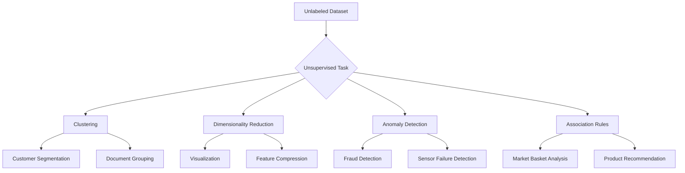
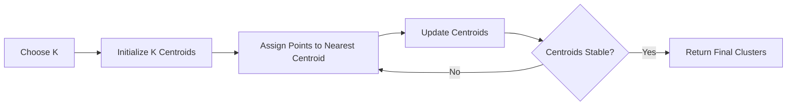
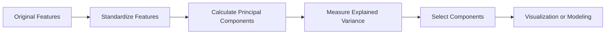
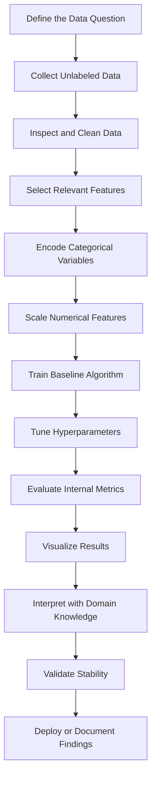

# 008 - Unsupervised Learning

**Course:** 03 - Machine Learning and Deep Learning
**Module:** Module 06 - Machine Learning
**Content Group:** Unsupervised Learning
**Roadmap Source:** Machine Learning / Unsupervised Learning
**Lesson Type:** Machine Learning
**Order in Module:** 008
**Suggested Duration:** 26 minutes

---

## 1. Summary

This lesson introduces **Unsupervised Learning** in the context of AI and Data Science.

Unlike supervised learning, unsupervised learning works with data that does not contain predefined target labels. Its purpose is to discover hidden structures, natural groups, unusual observations, or lower-dimensional representations of the data.

After completing this lesson, you should understand:

* What unsupervised learning is.
* How it differs from supervised learning.
* Which data questions it can answer.
* How clustering and dimensionality reduction work.
* How to evaluate results when no ground-truth labels are available.
* How to turn an unsupervised learning experiment into a notebook, visualization, API, or portfolio project.

---

## 2. Learning Objectives

By the end of this lesson, you should be able to:

* Explain unsupervised learning in your own words.
* Distinguish supervised learning from unsupervised learning.
* Identify problems suitable for clustering, dimensionality reduction, or anomaly detection.
* Prepare numerical and categorical features for unsupervised models.
* Apply at least one clustering algorithm to a dataset.
* Evaluate clustering quality using internal metrics and domain knowledge.
* Visualize clusters using PCA or another dimensionality-reduction method.
* Document assumptions, limitations, and possible business interpretations.

---

## 3. What Is Unsupervised Learning?

**Unsupervised learning** is a machine learning approach in which the model learns patterns from data without using predefined target labels.

A supervised dataset may look like this:

| Age | Income | Purchases | Customer Type |
| --: | -----: | --------: | ------------- |
|  24 | 30,000 |         4 | Low Value     |
|  35 | 70,000 |        18 | High Value    |
|  47 | 90,000 |        22 | High Value    |

The `Customer Type` column is the target label.

An unsupervised dataset may contain only the input features:

| Age | Income | Purchases |
| --: | -----: | --------: |
|  24 | 30,000 |         4 |
|  35 | 70,000 |        18 |
|  47 | 90,000 |        22 |

The model must discover useful structures without being told the correct customer categories.

### Basic Idea

```text
Unlabeled data
      |
      v
Unsupervised algorithm
      |
      v
Hidden structures or patterns
      |
      +--> Clusters
      +--> Lower-dimensional features
      +--> Anomalies
      +--> Associations
```

---

## 4. Supervised vs. Unsupervised Learning

| Aspect           | Supervised Learning        | Unsupervised Learning                       |
| ---------------- | -------------------------- | ------------------------------------------- |
| Target labels    | Available                  | Not available                               |
| Main goal        | Predict a known target     | Discover hidden patterns                    |
| Common tasks     | Classification, regression | Clustering, dimensionality reduction        |
| Example question | Will this customer leave?  | What customer groups exist?                 |
| Evaluation       | Accuracy, F1, RMSE, MAE    | Silhouette score, stability, interpretation |
| Typical output   | Predicted class or number  | Cluster, embedding, anomaly score           |

### Example

A supervised learning question:

> Can we predict whether a customer will cancel a subscription?

An unsupervised learning question:

> Are there natural groups of customers with similar behavior?

---

## 5. Main Types of Unsupervised Learning

The most common unsupervised learning tasks are:

1. Clustering
2. Dimensionality reduction
3. Anomaly detection
4. Association rule learning



---

## 6. Clustering

Clustering divides observations into groups so that:

* Observations inside the same cluster are relatively similar.
* Observations from different clusters are relatively different.

### Example

A company may cluster customers using:

* Age
* Income
* Purchase frequency
* Average order value
* Time since the last purchase

The result may reveal groups such as:

* Frequent high-value customers
* New low-spending customers
* Inactive customers
* Discount-sensitive customers

However, the algorithm does not automatically give meaningful names to the clusters. A data scientist must interpret them using statistics and domain knowledge.

---

## 7. Common Clustering Algorithms

### 7.1 K-Means Clustering

K-Means separates data into a predefined number of clusters.

The user selects the number of clusters, represented by `K`.

The algorithm repeatedly performs two main steps:

1. Assign each observation to the nearest cluster center.
2. Recalculate each cluster center using the assigned observations.



The optimization objective can be expressed as:

```text
Minimize the total squared distance between each point
and the centroid of its assigned cluster.
```

A simplified representation is:

```text
K-Means objective = Sum of squared distances to cluster centroids
```

#### Advantages

* Simple and fast.
* Easy to implement.
* Works well with compact and approximately spherical clusters.
* Scales to relatively large datasets.

#### Limitations

* The number of clusters must be selected in advance.
* Sensitive to feature scale.
* Sensitive to initialization and outliers.
* Performs poorly with irregularly shaped clusters.
* Assumes clusters can be represented by their means.

---

### 7.2 Hierarchical Clustering

Hierarchical clustering creates a hierarchy of clusters.

The most common version is **agglomerative clustering**:

1. Start with each observation as its own cluster.
2. Merge the two most similar clusters.
3. Continue until all observations belong to one large cluster.

The result can be visualized using a **dendrogram**.

```text
Customer A ----|
               |------ Cluster 1
Customer B ----|

Customer C -----------|
                      |------ Cluster 2
Customer D ----|      |
               |------|
Customer E ----|
```

#### Advantages

* Does not always require selecting the number of clusters before training.
* Produces a hierarchy that can be explored at different levels.
* Useful for smaller datasets and exploratory analysis.

#### Limitations

* Can be computationally expensive.
* Sensitive to the selected distance and linkage methods.
* Early merge decisions cannot normally be reversed.

---

### 7.3 DBSCAN

DBSCAN stands for:

**Density-Based Spatial Clustering of Applications with Noise**

It groups together observations located in dense regions and identifies isolated observations as noise.

Important parameters:

* `eps`: the maximum distance between neighboring points.
* `min_samples`: the minimum number of nearby points required to form a dense region.

#### Advantages

* Does not require specifying the number of clusters.
* Can detect irregularly shaped clusters.
* Can identify noise and outliers.
* Works well when clusters are separated by low-density areas.

#### Limitations

* Sensitive to `eps` and `min_samples`.
* Difficult to use when clusters have different densities.
* Distance becomes less meaningful in high-dimensional spaces.

---

## 8. Dimensionality Reduction

A dataset may contain hundreds or thousands of features.

Dimensionality reduction transforms the original features into a smaller set of features while preserving as much useful information as possible.

Common reasons for dimensionality reduction include:

* Visualizing high-dimensional data.
* Removing redundant information.
* Reducing training time.
* Reducing storage requirements.
* Decreasing noise.
* Handling multicollinearity.
* Preparing data for clustering.

---

## 9. Principal Component Analysis

**Principal Component Analysis**, or **PCA**, is one of the most common dimensionality-reduction techniques.

PCA creates new features called **principal components**.

These components:

* Are combinations of the original features.
* Are ordered by the amount of variance they explain.
* Are mathematically independent of one another.

```text
Original features:
x1, x2, x3, x4, x5

PCA transformation:
PC1, PC2, PC3

PC1 explains the largest amount of variance.
PC2 explains the second-largest amount of variance.
PC3 explains the third-largest amount of variance.
```

### PCA Workflow



### Explained Variance Ratio

The explained variance ratio tells us how much information each principal component preserves.

Example:

| Component            | Explained Variance |
| -------------------- | -----------------: |
| PC1                  |                52% |
| PC2                  |                27% |
| PC3                  |                12% |
| Remaining components |                 9% |

The first two components preserve:

```text
52% + 27% = 79% of the total variance
```

### PCA Limitations

* Principal components may be difficult to interpret.
* PCA mainly captures linear relationships.
* Feature scaling is usually required.
* High variance does not always mean high business importance.
* Important low-variance signals may be removed.

---

## 10. Anomaly Detection

Anomaly detection identifies observations that are significantly different from the majority of the data.

Examples include:

* Fraudulent transactions
* Unusual network activity
* Defective products
* Sensor failures
* Unexpected medical measurements
* Abnormal user behavior

Common anomaly-detection methods include:

* Isolation Forest
* Local Outlier Factor
* One-Class SVM
* Autoencoders
* DBSCAN noise detection

An anomaly is not automatically an error. It may represent:

* A data-quality problem
* A rare but valid case
* A security threat
* A new customer behavior
* A valuable business opportunity

---

## 11. Association Rule Learning

Association rule learning discovers relationships between items or events.

A common example is market basket analysis.

```text
Customers who buy bread and butter
often also buy milk.
```

A typical rule looks like:

```text
{bread, butter} -> {milk}
```

Important measures include:

### Support

How frequently an item combination appears in the dataset.

```text
Support = Transactions containing all items / Total transactions
```

### Confidence

How often the right-hand item appears when the left-hand items appear.

```text
Confidence = Support of all items / Support of left-hand items
```

### Lift

How much more likely the rule is compared with random occurrence.

```text
Lift greater than 1:
Positive association

Lift equal to 1:
No meaningful association

Lift less than 1:
Negative association
```

---

## 12. The Importance of Feature Scaling

Distance-based algorithms are strongly affected by feature scale.

Consider two features:

| Feature       |     Example Range |
| ------------- | ----------------: |
| Age           |          18 to 70 |
| Annual Income | 20,000 to 200,000 |

Without scaling, income may dominate the distance calculation because its numerical values are much larger.

Common scaling techniques include:

* StandardScaler
* MinMaxScaler
* RobustScaler

### Standardization

Standardization transforms features so that they approximately have:

```text
Mean = 0
Standard deviation = 1
```

For K-Means, PCA, hierarchical clustering, and DBSCAN, feature scaling is usually an essential preprocessing step.

---

## 13. General Unsupervised Learning Workflow



### Step 1: Define the Question

Examples:

* Are there natural customer segments?
* Which products are commonly purchased together?
* Which transactions look unusual?
* Can the dataset be represented using fewer features?

### Step 2: Prepare the Data

Common operations include:

* Handling missing values
* Removing duplicate records
* Correcting data types
* Encoding categorical variables
* Scaling numerical features
* Removing irrelevant identifiers
* Reviewing extreme values

### Step 3: Train a Baseline

A simple baseline may be:

* K-Means with `K = 3`
* PCA with two components
* Isolation Forest with default parameters

### Step 4: Compare Configurations

For clustering, compare:

* Different numbers of clusters
* Different feature sets
* Different scaling methods
* Different distance metrics
* Different random seeds
* Different clustering algorithms

### Step 5: Interpret the Results

A cluster ID such as `Cluster 0` has no automatic meaning.

You must inspect each cluster using:

* Feature averages
* Feature medians
* Category proportions
* Sample observations
* Business context
* Visualizations

---

## 14. How to Select the Number of Clusters

### 14.1 Elbow Method

The elbow method compares the number of clusters with cluster inertia.

Inertia measures the total squared distance between observations and their cluster centroids.

As `K` increases, inertia decreases.

The goal is to locate a point where increasing `K` produces only a small additional improvement.

```text
K = 1  -> Very high inertia
K = 2  -> Large improvement
K = 3  -> Large improvement
K = 4  -> Moderate improvement
K = 5  -> Small improvement
K = 6  -> Very small improvement
```

The elbow may appear near `K = 3` or `K = 4`.

However, the elbow is not always clear.

---

### 14.2 Silhouette Score

The silhouette score measures whether observations are:

* Close to other observations in the same cluster.
* Far from observations in neighboring clusters.

Its approximate range is:

```text
-1 to 1
```

Interpretation:

| Silhouette Score | General Interpretation                        |
| ---------------: | --------------------------------------------- |
|       Close to 1 | Well-separated clusters                       |
|       Close to 0 | Overlapping clusters                          |
|          Below 0 | Some observations may be assigned incorrectly |

A higher silhouette score is generally better, but it should not be the only decision criterion.

---

### 14.3 Domain Interpretability

The best statistical cluster count may not be the most useful business cluster count.

For example:

* Twelve clusters may produce a slightly higher score.
* Four clusters may be easier for the marketing team to understand and use.

Model selection should balance:

* Statistical quality
* Stability
* Interpretability
* Business usefulness
* Operational complexity

---

## 15. Practical Demo: Customer Segmentation

### Dataset Assumptions

Suppose the dataset contains:

```text
customer_id
age
annual_income
spending_score
purchase_frequency
```

The goal is to identify natural customer segments.

### Python Example

```python
import pandas as pd
import matplotlib.pyplot as plt

from sklearn.cluster import KMeans
from sklearn.decomposition import PCA
from sklearn.metrics import silhouette_score
from sklearn.preprocessing import StandardScaler

# Load data
df = pd.read_csv("customers.csv")

# Select useful features
features = [
    "age",
    "annual_income",
    "spending_score",
    "purchase_frequency",
]

X = df[features].copy()

# Handle missing values
X = X.fillna(X.median())

# Standardize features
scaler = StandardScaler()
X_scaled = scaler.fit_transform(X)

# Compare several values of K
results = []

for k in range(2, 8):
    model = KMeans(
        n_clusters=k,
        random_state=42,
        n_init=10,
    )

    labels = model.fit_predict(X_scaled)
    score = silhouette_score(X_scaled, labels)

    results.append(
        {
            "k": k,
            "inertia": model.inertia_,
            "silhouette_score": score,
        }
    )

results_df = pd.DataFrame(results)
print(results_df)
```

### Train the Selected Model

```python
final_model = KMeans(
    n_clusters=4,
    random_state=42,
    n_init=10,
)

df["cluster"] = final_model.fit_predict(X_scaled)
```

### Summarize the Clusters

```python
cluster_summary = (
    df.groupby("cluster")[features]
    .mean()
    .round(2)
)

print(cluster_summary)
```

Example output:

| Cluster |  Age | Annual Income | Spending Score | Purchase Frequency |
| ------: | ---: | ------------: | -------------: | -----------------: |
|       0 | 23.8 |        31,500 |           72.4 |                9.2 |
|       1 | 45.1 |        92,300 |           81.6 |               16.7 |
|       2 | 39.7 |        75,800 |           24.3 |                4.1 |
|       3 | 28.6 |        43,900 |           38.5 |                5.8 |

Possible interpretations:

| Cluster | Suggested Interpretation                 |
| ------: | ---------------------------------------- |
|       0 | Young, highly engaged customers          |
|       1 | High-value loyal customers               |
|       2 | High-income but low-engagement customers |
|       3 | Occasional budget-conscious customers    |

These names are hypotheses. They must be validated with business stakeholders and additional evidence.

---

## 16. Visualizing Clusters with PCA

When the dataset contains more than two features, PCA can reduce it to two dimensions for visualization.

```python
pca = PCA(n_components=2)
X_pca = pca.fit_transform(X_scaled)

plot_df = pd.DataFrame(
    {
        "PC1": X_pca[:, 0],
        "PC2": X_pca[:, 1],
        "cluster": df["cluster"],
    }
)

plt.figure(figsize=(8, 6))

for cluster_id in sorted(plot_df["cluster"].unique()):
    cluster_data = plot_df[plot_df["cluster"] == cluster_id]

    plt.scatter(
        cluster_data["PC1"],
        cluster_data["PC2"],
        label=f"Cluster {cluster_id}",
        alpha=0.7,
    )

plt.xlabel("Principal Component 1")
plt.ylabel("Principal Component 2")
plt.title("Customer Segments Visualized with PCA")
plt.legend()
plt.show()
```

Display the explained variance:

```python
print(pca.explained_variance_ratio_)
print(pca.explained_variance_ratio_.sum())
```

Important:

> A two-dimensional PCA chart is only a projection of the original feature space. Overlapping points in the chart do not necessarily mean that the clusters completely overlap in the original space.

---

## 17. Evaluating Unsupervised Models

Unsupervised learning is difficult to evaluate because the correct answer is often unknown.

Evaluation should combine several approaches.

### Internal Metrics

Metrics calculated using the dataset and predicted clusters:

* Silhouette score
* Inertia
* Davies-Bouldin index
* Calinski-Harabasz score

### External Metrics

Used when true labels are available only for evaluation:

* Adjusted Rand Index
* Normalized Mutual Information
* Homogeneity
* Completeness

### Stability Evaluation

A useful clustering result should not change dramatically after:

* Changing the random seed
* Sampling a slightly different subset
* Adding a small amount of noise
* Retraining the algorithm

### Domain Evaluation

Ask domain experts:

* Are the clusters understandable?
* Are they meaningfully different?
* Can they support a real decision?
* Can an action be assigned to each cluster?
* Are any clusters caused by data-quality issues?

---

## 18. Error Analysis for Unsupervised Learning

Error analysis is less direct than in supervised learning.

Instead of examining incorrect predictions, inspect:

* Observations near cluster boundaries
* Very small clusters
* Clusters dominated by one feature
* Unstable cluster assignments
* Unexpected outliers
* Features with excessive influence
* Clusters that cannot be interpreted
* Differences between algorithms

Example questions:

```text
Why was this customer assigned to Cluster 2?

Is the assignment caused mainly by annual income?

Does the customer move to another cluster after scaling?

Is the small cluster a meaningful niche or a data-quality problem?

Are the clusters stable across multiple random seeds?
```

---

## 19. Common Mistakes

### 19.1 Not Scaling Features

K-Means and PCA are sensitive to numerical scale.

A large-range feature may dominate all other features.

### 19.2 Including Identifier Columns

Columns such as these usually should not be clustering features:

```text
customer_id
transaction_id
record_number
phone_number
```

They identify observations but usually do not describe meaningful similarity.

### 19.3 Selecting K Using Only One Metric

The cluster count should not be selected using only inertia or silhouette score.

Also consider:

* Stability
* Interpretability
* Cluster size
* Domain relevance
* Business actionability

### 19.4 Treating Clusters as Ground Truth

Clusters are model-generated structures, not objective facts.

A different algorithm or feature set may produce different clusters.

### 19.5 Giving Clusters Meaning Too Quickly

A cluster with a high average income should not automatically be called “premium customers.”

You should inspect:

* Spending
* Engagement
* Retention
* Profitability
* Sample observations
* Data coverage

### 19.6 Ignoring Outliers

Outliers can strongly influence:

* Cluster centroids
* PCA directions
* Distance calculations
* Cluster sizes

Outliers should be inspected, not removed automatically.

### 19.7 Using Too Many Features

Irrelevant or highly correlated features can reduce cluster quality.

Feature selection should follow the problem definition.

### 19.8 Assuming Every Dataset Contains Clusters

Some datasets do not contain clear natural groups.

An algorithm can always generate cluster labels, but those labels may not represent meaningful structures.

### 19.9 Data Leakage

Leakage can still occur in unsupervised workflows.

For example, when building a production pipeline:

* The scaler should be fitted only on training data.
* PCA should be fitted only on training data.
* Future information should not be included in customer features.
* Features generated after the prediction date should not be used.

---

## 20. Practical Exercise

Use a dataset such as:

* Mall Customer Segmentation Data
* Online Retail Data
* Spotify Track Features
* Credit Card Transactions
* Wine Dataset
* Iris Dataset without using the species labels

### Required Tasks

1. Load and inspect the dataset.
2. Select meaningful features.
3. Handle missing values.
4. Scale numerical features.
5. Train K-Means with several values of `K`.
6. Calculate inertia and silhouette score.
7. Select a reasonable number of clusters.
8. Summarize each cluster.
9. Visualize clusters using PCA.
10. Train one additional clustering algorithm.
11. Compare the results.
12. Write at least three interpretations.
13. Document at least two limitations.

### Suggested Comparison Table

| Model         | Parameters | Number of Clusters | Silhouette Score | Notes                        |
| ------------- | ---------- | -----------------: | ---------------: | ---------------------------- |
| K-Means       | K = 4      |                  4 |             0.51 | Clear and balanced clusters  |
| Agglomerative | K = 4      |                  4 |             0.47 | Similar structure to K-Means |
| DBSCAN        | eps = 0.6  |       3 plus noise |             0.39 | Detects several outliers     |

---

## 21. Portfolio Artifact

Create a notebook named:

```text
customer-segmentation-unsupervised-learning.ipynb
```

Recommended notebook structure:

```text
1. Business Problem
2. Dataset Description
3. Exploratory Data Analysis
4. Data Cleaning
5. Feature Selection
6. Feature Scaling
7. K-Means Baseline
8. Selecting the Number of Clusters
9. Cluster Profiling
10. PCA Visualization
11. Alternative Clustering Model
12. Stability Analysis
13. Business Recommendations
14. Limitations
15. Next Steps
```

Possible portfolio outputs:

* Jupyter notebook
* Cluster profile dashboard
* Streamlit application
* Customer segmentation API
* Anomaly-detection service
* PCA visualization report
* Dockerized machine learning service

---

## 22. Business Recommendation Example

### Observation

Cluster 2 has high annual income but low spending scores and low purchase frequency.

### Explanation

These customers may have high purchasing power but low engagement with the company.

### Impact

The company may be missing revenue opportunities from financially valuable customers.

### Recommendation

Test a personalized re-engagement campaign with:

* Premium product recommendations
* Loyalty benefits
* Personalized communication
* Limited-time offers

### Validation

Run an A/B experiment and measure:

* Conversion rate
* Average order value
* Purchase frequency
* Campaign profit
* Customer retention

---

## 23. Completion Checklist

* [ ] I can explain unsupervised learning in one or two minutes.
* [ ] I understand the difference between supervised and unsupervised learning.
* [ ] I can describe clustering, dimensionality reduction, and anomaly detection.
* [ ] I understand why feature scaling is important.
* [ ] I can train a K-Means clustering model.
* [ ] I can use inertia and silhouette score.
* [ ] I can use PCA to visualize high-dimensional data.
* [ ] I can summarize and interpret clusters.
* [ ] I understand that clusters are not automatically meaningful.
* [ ] I have created a notebook, chart, experiment, model, API, or project note.
* [ ] I have documented at least one assumption or limitation.
* [ ] I have identified at least one next experiment.

---

## 24. Related Outcome

Train, compare, and evaluate supervised and unsupervised machine learning models using thoughtful feature engineering and appropriate evaluation methods.

---

## 25. Related Projects

### Primary Mini Project

**Customer Segmentation with Clustering**

Build a customer-segmentation system using:

* Exploratory data analysis
* Feature engineering
* Feature scaling
* K-Means
* Hierarchical clustering or DBSCAN
* PCA visualization
* Cluster profiling
* Business recommendations

### Connection to the House Price Project

Unsupervised learning can also support a house price prediction project.

Possible applications include:

* Clustering houses into property segments
* Detecting unusual property listings
* Using PCA to reduce correlated property features
* Creating cluster labels as additional features
* Comparing house groups before training regression models

The final house price prediction pipeline may combine:

```text
EDA
  |
  v
Feature Engineering
  |
  +--> Unsupervised Property Segmentation
  |
  v
Linear Regression
  |
  v
Random Forest
  |
  v
XGBoost
  |
  v
Model Comparison and Error Analysis
```

---

## 26. Key Takeaways

* Unsupervised learning discovers patterns without predefined labels.
* Clustering groups similar observations.
* Dimensionality reduction creates smaller representations of complex data.
* Anomaly detection identifies unusual observations.
* K-Means is simple and effective but requires a predefined number of clusters.
* DBSCAN can detect irregular clusters and noise.
* PCA is useful for compression and visualization.
* Scaling is essential for many distance-based algorithms.
* Internal metrics are useful but cannot replace domain interpretation.
* Cluster labels are hypotheses, not ground truth.
* A useful unsupervised model should be stable, interpretable, and actionable.

---

## 27. Conclusion

**Unsupervised Learning** is an important milestone in the AI and Data Scientist roadmap.

It allows data scientists to explore datasets that do not contain predefined targets and discover structures that may not be immediately visible.

The most important skill is not simply generating cluster labels. It is turning the discovered patterns into understandable and testable insights.

Convert this lesson into a practical artifact such as:

* A clustering notebook
* A PCA visualization
* A customer-segmentation dashboard
* An anomaly-detection API
* A Dockerized machine learning service
* A portfolio case study

The value of unsupervised learning comes from combining algorithms, careful evaluation, visualization, and domain knowledge.
