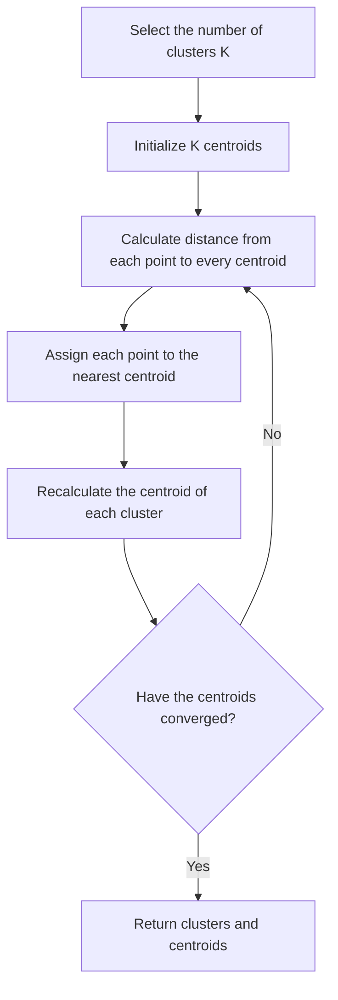
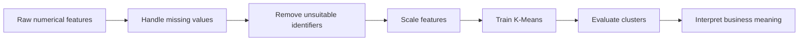
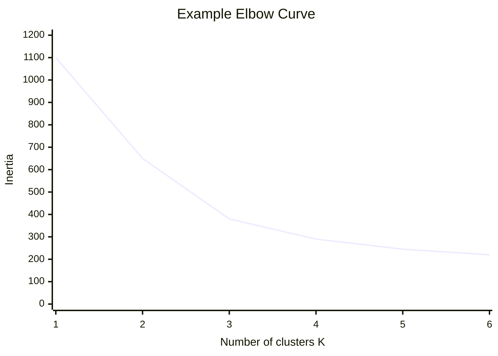
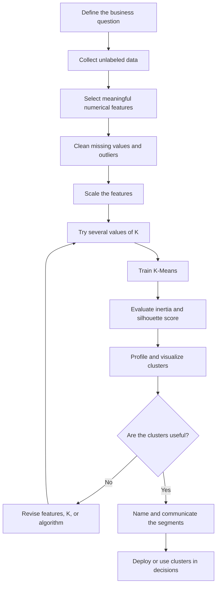
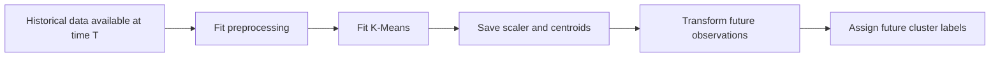

# 009 - K-Means Clustering

**Course:** 03 - Machine Learning and Deep Learning
**Module:** Module 06 - Machine Learning
**Content Group:** Unsupervised Learning
**Roadmap Source:** Machine Learning / Unsupervised Learning
**Lesson Type:** Machine Learning
**Order in Module:** 009
**Suggested Duration:** 26 minutes

---

## 1. Summary

This lesson introduces **K-Means**, one of the most widely used clustering algorithms in unsupervised machine learning.

K-Means divides unlabeled observations into a predefined number of groups called **clusters**. Observations in the same cluster should be similar to one another, while observations in different clusters should be relatively different.

After completing this lesson, you should understand:

* What problem K-Means solves
* How the K-Means algorithm works
* How centroids are updated
* Why feature scaling is important
* How to select the number of clusters
* How to evaluate clustering quality
* When K-Means works well
* When another clustering algorithm should be used

---

## 2. Learning Objectives

By the end of this lesson, you should be able to:

* Explain K-Means in your own words.
* Describe the iterative steps used by K-Means.
* Distinguish between a data point, cluster, centroid, and cluster label.
* Prepare numerical data for K-Means.
* Train a K-Means model with Scikit-learn.
* Select a reasonable value for `K`.
* Evaluate clusters using inertia and silhouette score.
* Interpret clusters in a business context.
* Identify the main assumptions and limitations of K-Means.
* Create a clustering notebook or portfolio artifact.

---

## 3. What Is K-Means?

K-Means is an **unsupervised learning algorithm** used to partition a dataset into `K` clusters.

Unlike supervised learning, the dataset does not contain a target label.

Given a collection of observations:

```text
X = {x1, x2, x3, ..., xn}
```

K-Means attempts to discover hidden groups based on the distances between observations.

For example, a customer dataset may contain:

| Customer | Annual Income | Spending Score |
| -------- | ------------: | -------------: |
| A        |            25 |             20 |
| B        |            28 |             25 |
| C        |            70 |             80 |
| D        |            75 |             85 |
| E        |            50 |             45 |

K-Means may discover groups such as:

* Low-income, low-spending customers
* Medium-income, medium-spending customers
* High-income, high-spending customers

These groups are not provided in advance. The algorithm discovers them from the feature space.

---

## 4. Core Terminology

### 4.1 Cluster

A **cluster** is a group of observations that are similar according to their feature values.

### 4.2 Centroid

A **centroid** is the center of a cluster.

For a cluster containing `m` observations, its centroid is the mean of those observations.

For a two-dimensional cluster:

```text
centroid_x = sum of x values / number of points

centroid_y = sum of y values / number of points
```

In mathematical notation:

$$
\mu_k = \frac{1}{|C_k|}\sum_{x_i \in C_k} x_i
$$

Where:

* `C_k` is cluster `k`
* `|C_k|` is the number of observations in cluster `k`
* `x_i` is an observation assigned to cluster `k`
* `mu_k` is the centroid of cluster `k`

### 4.3 K

`K` is the number of clusters that the algorithm should create.

For example:

```text
K = 3
```

means that the model must divide the observations into three clusters.

### 4.4 Cluster Label

After training, each observation receives a cluster identifier.

```text
Observation A -> Cluster 0
Observation B -> Cluster 0
Observation C -> Cluster 2
```

Cluster labels are arbitrary identifiers. Cluster `0` is not inherently better or more important than cluster `1`.

---

## 5. How K-Means Works

K-Means follows an iterative optimization process.



The main steps are:

1. Select the number of clusters `K`.
2. Initialize `K` centroid positions.
3. Calculate the distance from each observation to every centroid.
4. Assign each observation to its nearest centroid.
5. Recalculate each centroid using the mean of its assigned observations.
6. Repeat the assignment and update steps until convergence.

---

## 6. Step-by-Step Example

Suppose the dataset contains six two-dimensional observations:

```text
A = (1, 1)
B = (1, 2)
C = (2, 1)
D = (8, 8)
E = (8, 9)
F = (9, 8)
```

We select:

```text
K = 2
```

### Step 1: Initialize Two Centroids

Assume the initial centroids are:

```text
Centroid 1 = (1, 1)
Centroid 2 = (8, 8)
```

### Step 2: Assign Points to the Nearest Centroid

The algorithm calculates the distance between each observation and the two centroids.

The likely assignments are:

```text
Cluster 1: A, B, C
Cluster 2: D, E, F
```

### Step 3: Recalculate the Centroids

The new centroid for Cluster 1 is:

```text
x coordinate = (1 + 1 + 2) / 3 = 1.33
y coordinate = (1 + 2 + 1) / 3 = 1.33
```

Therefore:

```text
New Centroid 1 = (1.33, 1.33)
```

The new centroid for Cluster 2 is:

```text
x coordinate = (8 + 8 + 9) / 3 = 8.33
y coordinate = (8 + 9 + 8) / 3 = 8.33
```

Therefore:

```text
New Centroid 2 = (8.33, 8.33)
```

### Step 4: Repeat

The algorithm repeats the assignment and centroid update steps.

It stops when:

* Cluster assignments no longer change
* Centroids stop moving significantly
* The maximum number of iterations is reached

---

## 7. Distance Measurement

K-Means normally uses **Euclidean distance**.

For two observations:

```text
A = (x1, y1)
B = (x2, y2)
```

The Euclidean distance is:

$$
d(A,B) = \sqrt{(x_1-x_2)^2 + (y_1-y_2)^2}
$$

For `p` features:

$$
d(x_i,\mu_k) =
\sqrt{
\sum_{j=1}^{p}
(x_{ij}-\mu_{kj})^2
}
$$

Where:

* `x_i` is an observation
* `mu_k` is the centroid of cluster `k`
* `p` is the number of features

Each observation is assigned to the cluster with the nearest centroid.

---

## 8. K-Means Objective Function

K-Means attempts to minimize the total squared distance between observations and their assigned centroids.

This value is commonly called:

* Within-cluster sum of squares
* WCSS
* Sum of squared errors
* SSE
* Inertia

The objective function is:

$$
J =
\sum_{k=1}^{K}
\sum_{x_i \in C_k}
\lVert x_i-\mu_k \rVert^2
$$

Where:

* `K` is the number of clusters
* `C_k` is cluster `k`
* `x_i` is an observation assigned to cluster `k`
* `mu_k` is the centroid of cluster `k`
* `J` is the total within-cluster variation

A lower value means observations are closer to their assigned centroids.

However, inertia should not be used alone because it always decreases as `K` increases.

---

## 9. Why Feature Scaling Is Important

K-Means is distance-based. Features with larger numerical ranges can dominate the distance calculation.

Consider these two features:

```text
Age: 18 to 70
Annual income: 20,000 to 500,000
```

Without scaling, annual income will contribute much more to the Euclidean distance than age.

A common solution is standardization:

$$
z = \frac{x-\mu}{\sigma}
$$

Where:

* `x` is the original value
* `mu` is the feature mean
* `sigma` is the feature standard deviation
* `z` is the standardized value

After standardization, features are commonly centered around zero with a standard deviation close to one.



---

## 10. K-Means Initialization

The final clustering result can depend on the initial centroid positions.

Poor initial centroids may cause:

* Slow convergence
* Unstable cluster assignments
* Convergence to a poor local solution

### Random Initialization

Centroids are selected randomly.

This method may produce inconsistent results between training runs.

### K-Means++

K-Means++ selects initial centroids that are relatively far from one another.

It usually provides:

* Better initial centroid placement
* Faster convergence
* More stable results
* Lower probability of poor local solutions

Scikit-learn normally uses K-Means++ initialization.

```python
KMeans(
    n_clusters=3,
    init="k-means++",
    random_state=42
)
```

---

## 11. Selecting the Number of Clusters

K-Means requires the number of clusters to be selected before training.

There is no universally correct value of `K`. It should be chosen using:

* Domain knowledge
* Business requirements
* Elbow method
* Silhouette score
* Cluster stability
* Cluster interpretability

---

## 12. Elbow Method

The elbow method trains K-Means using several values of `K` and compares their inertia.

```text
K = 1 -> high inertia
K = 2 -> much lower inertia
K = 3 -> lower inertia
K = 4 -> slightly lower inertia
K = 5 -> only a small improvement
```

The selected value is often near the point where additional clusters produce diminishing improvements.



In this example, `K = 3` may be a reasonable choice because the rate of improvement becomes smaller after three clusters.

### Limitation

The elbow is not always clear. Some datasets produce a smooth curve without an obvious turning point.

---

## 13. Silhouette Score

The silhouette score measures how well each observation fits its own cluster compared with neighboring clusters.

For observation `i`:

$$
s(i) = \frac{b(i)-a(i)}{\max(a(i),b(i))}
$$

Where:

* `a(i)` is the average distance from observation `i` to observations in the same cluster
* `b(i)` is the lowest average distance from observation `i` to observations in another cluster

The silhouette score ranges from `-1` to `1`.

|        Score | Interpretation                                       |
| -----------: | ---------------------------------------------------- |
| Close to `1` | The observation is well matched to its cluster       |
| Close to `0` | The observation is near a cluster boundary           |
|    Below `0` | The observation may be assigned to the wrong cluster |

A higher average silhouette score generally indicates better-separated clusters.

However, the highest score is not automatically the best business solution. The clusters must also be meaningful and actionable.

---

## 14. Practical Python Example

### 14.1 Import Libraries

```python
import pandas as pd
import matplotlib.pyplot as plt

from sklearn.cluster import KMeans
from sklearn.metrics import silhouette_score
from sklearn.preprocessing import StandardScaler
```

### 14.2 Create a Sample Dataset

```python
data = pd.DataFrame(
    {
        "annual_income": [
            25, 28, 30, 35,
            55, 58, 60, 65,
            85, 88, 90, 95
        ],
        "spending_score": [
            20, 25, 18, 30,
            45, 50, 55, 48,
            78, 82, 85, 90
        ],
    }
)

print(data.head())
```

### 14.3 Select Features

```python
features = [
    "annual_income",
    "spending_score",
]

X = data[features]
```

### 14.4 Scale the Features

```python
scaler = StandardScaler()
X_scaled = scaler.fit_transform(X)
```

### 14.5 Train the K-Means Model

```python
model = KMeans(
    n_clusters=3,
    init="k-means++",
    n_init=10,
    random_state=42,
)

cluster_labels = model.fit_predict(X_scaled)

data["cluster"] = cluster_labels
```

### 14.6 Inspect the Results

```python
print(data)
```

Possible output:

```text
    annual_income  spending_score  cluster
0              25              20        1
1              28              25        1
2              30              18        1
3              35              30        1
4              55              45        2
5              58              50        2
6              60              55        2
7              65              48        2
8              85              78        0
9              88              82        0
10             90              85        0
11             95              90        0
```

The numerical cluster identifiers may differ between runs or implementations.

---

## 15. Visualizing the Clusters

```python
plt.figure(figsize=(8, 6))

plt.scatter(
    data["annual_income"],
    data["spending_score"],
    c=data["cluster"],
    s=80,
)

plt.xlabel("Annual Income")
plt.ylabel("Spending Score")
plt.title("Customer Segments Created by K-Means")
plt.show()
```

To visualize centroids in the original feature scale:

```python
centroids_scaled = model.cluster_centers_
centroids = scaler.inverse_transform(centroids_scaled)

plt.figure(figsize=(8, 6))

plt.scatter(
    data["annual_income"],
    data["spending_score"],
    c=data["cluster"],
    s=80,
)

plt.scatter(
    centroids[:, 0],
    centroids[:, 1],
    marker="X",
    s=250,
    label="Centroids",
)

plt.xlabel("Annual Income")
plt.ylabel("Spending Score")
plt.title("K-Means Clusters and Centroids")
plt.legend()
plt.show()
```

---

## 16. Finding K with the Elbow Method

```python
inertia_values = []
k_values = range(1, 9)

for k in k_values:
    model = KMeans(
        n_clusters=k,
        init="k-means++",
        n_init=10,
        random_state=42,
    )

    model.fit(X_scaled)
    inertia_values.append(model.inertia_)

plt.figure(figsize=(8, 5))
plt.plot(k_values, inertia_values, marker="o")
plt.xlabel("Number of Clusters K")
plt.ylabel("Inertia")
plt.title("Elbow Method")
plt.show()
```

Look for the point at which the curve begins to flatten.

---

## 17. Comparing Silhouette Scores

Silhouette score requires at least two clusters.

```python
results = []

for k in range(2, 9):
    model = KMeans(
        n_clusters=k,
        init="k-means++",
        n_init=10,
        random_state=42,
    )

    labels = model.fit_predict(X_scaled)
    score = silhouette_score(X_scaled, labels)

    results.append(
        {
            "k": k,
            "inertia": model.inertia_,
            "silhouette_score": score,
        }
    )

results_df = pd.DataFrame(results)
print(results_df)
```

The final selection should consider both:

```text
Statistical quality + business interpretability
```

---

## 18. Interpreting the Clusters

A clustering model only assigns numerical labels. A data scientist must interpret what those groups represent.

Calculate the average feature values for each cluster:

```python
cluster_summary = (
    data.groupby("cluster")[features]
    .agg(["mean", "median", "min", "max", "count"])
)

print(cluster_summary)
```

A simpler summary:

```python
cluster_profiles = (
    data.groupby("cluster")[features]
    .mean()
    .round(2)
)

print(cluster_profiles)
```

You may then create human-readable names:

| Cluster | Average Income | Average Spending | Suggested Name             |
| ------: | -------------: | ---------------: | -------------------------- |
|       0 |           High |             High | Premium customers          |
|       1 |            Low |              Low | Budget-conscious customers |
|       2 |         Medium |           Medium | Mainstream customers       |

These names are created after inspecting the cluster profiles. K-Means does not generate them automatically.

---

## 19. Using a Pipeline

A Scikit-learn pipeline helps keep preprocessing and modeling together.

```python
from sklearn.pipeline import Pipeline

pipeline = Pipeline(
    steps=[
        ("scaler", StandardScaler()),
        (
            "kmeans",
            KMeans(
                n_clusters=3,
                init="k-means++",
                n_init=10,
                random_state=42,
            ),
        ),
    ]
)

cluster_labels = pipeline.fit_predict(X)
```

Benefits include:

* Cleaner code
* Reproducible preprocessing
* Reduced risk of inconsistent transformations
* Easier deployment

---

## 20. K-Means Workflow



---

## 21. Business Applications

### 21.1 Customer Segmentation

Group customers based on:

* Purchase frequency
* Average order value
* Spending behavior
* Product preferences
* Engagement level

Possible actions include:

* Personalized promotions
* Loyalty campaigns
* Customer retention programs
* Product recommendations

### 21.2 Product Grouping

Group products based on:

* Price
* Sales volume
* Customer ratings
* Product attributes
* Purchase patterns

### 21.3 Geographic Segmentation

Group regions based on:

* Population
* Income
* Sales performance
* Customer demand
* Delivery behavior

### 21.4 Image Compression

K-Means can group similar pixel colors.

Each pixel is assigned to its nearest color centroid, reducing the number of colors in an image.

### 21.5 Document Exploration

Numerical document embeddings can be clustered to discover groups of semantically related documents.

However, the quality depends heavily on the embedding representation.

### 21.6 Anomaly Exploration

Observations far from every centroid may be potential anomalies.

However, K-Means is not primarily an anomaly detection algorithm.

---

## 22. Strengths of K-Means

K-Means is popular because it is:

* Simple to understand
* Easy to implement
* Computationally efficient
* Scalable to relatively large datasets
* Effective when clusters are compact and well separated
* Compatible with many visualization and profiling techniques
* Useful as an exploratory baseline

Its approximate computational complexity is often expressed as:

```text
O(n * K * i * d)
```

Where:

* `n` is the number of observations
* `K` is the number of clusters
* `i` is the number of iterations
* `d` is the number of features

---

## 23. Assumptions of K-Means

K-Means works best when:

* Features are numerical
* Features are on comparable scales
* Clusters are approximately spherical
* Clusters have similar density
* Clusters have similar sizes
* Euclidean distance represents meaningful similarity
* The selected value of `K` is reasonable
* Extreme outliers are limited

---

## 24. Limitations of K-Means

### 24.1 K Must Be Selected in Advance

The algorithm does not automatically determine the correct number of clusters.

### 24.2 Sensitivity to Feature Scale

Features with large ranges may dominate the distance calculation.

### 24.3 Sensitivity to Outliers

A single extreme observation can shift a centroid because centroids are means.

### 24.4 Sensitivity to Initialization

Different initial centroids may produce different results.

K-Means++ and multiple initializations help reduce this problem.

### 24.5 Preference for Spherical Clusters

K-Means may perform poorly with:

* Curved clusters
* Ring-shaped clusters
* Long narrow clusters
* Clusters with irregular shapes

### 24.6 Difficulty with Unequal Density

A dense cluster and a sparse cluster may be divided incorrectly.

### 24.7 Numerical Features Only

Raw categorical features cannot be directly processed using ordinary Euclidean K-Means.

One-hot encoding is possible, but Euclidean distance may not always represent categorical similarity appropriately.

### 24.8 Cluster Labels Have No Natural Meaning

The values `0`, `1`, and `2` are identifiers, not ordered categories.

---

## 25. Example of a Poor K-Means Dataset

Consider two moon-shaped groups:

```text
))))      ((((
```

The groups are curved rather than spherical.

K-Means creates partitions based on distance to centroids, so it may divide the shapes incorrectly.

For such data, alternatives may include:

* DBSCAN
* HDBSCAN
* Spectral clustering
* Agglomerative clustering

---

## 26. K-Means Compared with Other Clustering Algorithms

| Algorithm               |         Requires K? |       Handles Irregular Shapes? | Handles Noise? | Main Characteristic                 |
| ----------------------- | ------------------: | ------------------------------: | -------------: | ----------------------------------- |
| K-Means                 |                 Yes |                              No |             No | Fast centroid-based clustering      |
| Hierarchical clustering | Usually no at first |                       Sometimes |        Limited | Creates a cluster hierarchy         |
| DBSCAN                  |                  No |                             Yes |            Yes | Density-based clustering            |
| HDBSCAN                 |                  No |                             Yes |            Yes | Handles varying density better      |
| Gaussian mixture model  |                 Yes | Better for overlapping ellipses |        Limited | Produces probabilistic memberships  |
| K-Medoids               |                 Yes |              Similar limitation |    More robust | Uses actual observations as centers |

---

## 27. Data Splitting in Unsupervised Learning

K-Means does not use target labels, so the supervised learning pattern:

```text
train -> validation -> test
```

does not apply in exactly the same way.

However, splitting can still be useful when:

* Testing cluster stability
* Evaluating behavior on new observations
* Preventing preprocessing leakage
* Building a downstream supervised model
* Comparing segment consistency over time

A reasonable workflow is:

```text
Training data
    -> fit scaler
    -> fit K-Means
    -> learn centroids

New data
    -> apply the same scaler
    -> assign each observation to its nearest centroid
```

Do not fit preprocessing separately on production observations if consistent cluster definitions are required.

---

## 28. Avoiding Data Leakage

Even without target labels, leakage can still occur.

Examples include:

* Scaling all available data before creating an evaluation split
* Using future customer behavior to create historical customer segments
* Including features produced after the business decision date
* Selecting features using unavailable future information
* Recomputing cluster definitions differently in production

Correct temporal workflow:



---

## 29. Evaluating Cluster Stability

Good clusters should not change dramatically after small changes in the data or initialization.

Possible stability checks include:

* Train the model with multiple random seeds
* Compare cluster sizes across runs
* Compare centroid locations
* Resample the data and retrain
* Compare results across time periods
* Inspect whether business interpretations remain similar

A model with a good silhouette score but unstable clusters may not be suitable for production use.

---

## 30. Production Considerations

A deployed K-Means system should save:

* Selected feature names
* Missing-value handling rules
* Fitted scaler
* Fitted K-Means model
* Cluster profiles
* Human-readable cluster names
* Training data period
* Model version
* Evaluation metrics
* Assumptions and limitations

Example:

```python
import joblib

joblib.dump(pipeline, "customer_segmentation_pipeline.joblib")
```

Load the model:

```python
pipeline = joblib.load(
    "customer_segmentation_pipeline.joblib"
)

new_labels = pipeline.predict(new_customer_data)
```

---

## 31. Cluster Drift

Cluster definitions may become outdated when behavior changes.

Examples include:

* Customer spending patterns change
* New product categories are introduced
* Inflation changes monetary features
* A marketing campaign changes engagement behavior
* The user population changes

Useful monitoring signals include:

* Cluster size distribution
* Average distance to centroid
* Feature distribution shifts
* Changes in cluster profiles
* Percentage of observations unusually far from centroids

A clustering model may need periodic retraining.

---

## 32. Common Mistakes

### Mistake 1: Not Scaling Features

```text
Age range: 18 to 70
Revenue range: 1,000 to 1,000,000
```

Revenue dominates the distance calculation.

**Solution:** Standardize or normalize the features.

### Mistake 2: Treating Cluster Labels as Ground Truth

A cluster is a model-generated grouping, not an objectively correct class.

**Solution:** Validate the clusters using domain knowledge and business outcomes.

### Mistake 3: Selecting K Only from the Elbow Plot

The elbow may be unclear or may produce clusters that are not actionable.

**Solution:** Combine metrics, visual inspection, stability, and business meaning.

### Mistake 4: Including Identifier Columns

Columns such as:

```text
customer_id
transaction_id
phone_number
```

usually do not represent meaningful similarity.

**Solution:** Remove identifiers unless they encode a justified feature.

### Mistake 5: Ignoring Outliers

Extreme observations may shift centroids.

**Solution:** Inspect, transform, cap, remove, or separately model extreme values.

### Mistake 6: Using K-Means for Arbitrary Cluster Shapes

K-Means prefers compact, approximately spherical groups.

**Solution:** Consider DBSCAN, HDBSCAN, or spectral clustering.

### Mistake 7: Assuming More Clusters Are Always Better

Increasing `K` always reduces inertia.

**Solution:** Balance compactness, stability, interpretability, and operational usefulness.

### Mistake 8: Giving Meaning to Cluster Numbers

Cluster `2` is not automatically greater than cluster `1`.

**Solution:** Create descriptive cluster names after profiling.

### Mistake 9: Clustering Unrelated Features

Adding every available numerical column may reduce cluster quality.

**Solution:** Select features that reflect the similarity relevant to the business question.

### Mistake 10: Evaluating Only with a Single Metric

A mathematically strong clustering result may still be useless to stakeholders.

**Solution:** Combine statistical evaluation with business validation.

---

## 33. Practical Exercise

### Task

Create a customer segmentation notebook using a dataset containing:

* Customer age
* Annual income
* Spending score
* Purchase frequency

### Requirements

1. Load and inspect the dataset.
2. Check missing values.
3. Remove unsuitable identifiers.
4. Inspect outliers.
5. Select meaningful numerical features.
6. Scale the features.
7. Train K-Means for values of `K` from 2 to 10.
8. Plot the elbow curve.
9. Compare silhouette scores.
10. Select a final value of `K`.
11. Visualize the clusters.
12. Calculate cluster profiles.
13. Assign a descriptive name to each cluster.
14. Write at least one business recommendation for each cluster.
15. Document assumptions and limitations.

---

## 34. Suggested Notebook Structure

```text
01_business_question
02_data_loading
03_data_quality_checks
04_exploratory_data_analysis
05_feature_selection
06_feature_scaling
07_k_selection
08_model_training
09_cluster_evaluation
10_cluster_visualization
11_cluster_profiling
12_business_recommendations
13_limitations
14_next_steps
```

---

## 35. Portfolio Artifact

A strong K-Means portfolio project may include:

* A clean Jupyter notebook
* An exploratory data analysis section
* A preprocessing pipeline
* Elbow and silhouette analysis
* Cluster visualizations
* Cluster profile tables
* Business-friendly segment names
* Actionable recommendations
* Saved model artifacts
* A Streamlit dashboard
* A FastAPI prediction endpoint
* A Docker configuration
* A concise README

Example API input:

```json
{
  "age": 28,
  "annual_income": 65000,
  "spending_score": 72,
  "purchase_frequency": 14
}
```

Example API output:

```json
{
  "cluster_id": 2,
  "segment_name": "High-value active customer",
  "distance_to_centroid": 0.84,
  "model_version": "customer-kmeans-v1"
}
```

---

## 36. Completion Checklist

* [ ] I can explain K-Means in one or two minutes.
* [ ] I understand what `K`, a cluster, and a centroid represent.
* [ ] I can describe the assignment and centroid update steps.
* [ ] I understand the K-Means objective function.
* [ ] I know why feature scaling is important.
* [ ] I can train a K-Means model with Scikit-learn.
* [ ] I can use the elbow method.
* [ ] I can calculate and interpret silhouette score.
* [ ] I can profile and name clusters.
* [ ] I understand that cluster labels are arbitrary.
* [ ] I know the main assumptions of K-Means.
* [ ] I know when K-Means is not appropriate.
* [ ] I can connect the clusters to a business decision.
* [ ] I have created a notebook, visualization, model, API, or technical note.
* [ ] I have documented at least one limitation or next experiment.

---

## 37. Related Outcome

Train, compare, and evaluate supervised and unsupervised machine learning models using thoughtful feature engineering, appropriate metrics, and business-oriented interpretation.

---

## 38. Related Project

### Recommended Mini Project: Customer Segmentation

Build a customer segmentation system with:

* Exploratory data analysis
* Missing-value handling
* Outlier analysis
* Feature selection
* StandardScaler
* K-Means
* Elbow analysis
* Silhouette score
* Cluster visualization
* Cluster profiling
* Business recommendations
* Optional Streamlit or FastAPI deployment

The existing **House Price Prediction** project is more suitable for supervised regression algorithms such as:

* Linear Regression
* Random Forest
* Gradient Boosting
* XGBoost

It is not the most natural primary project for K-Means because house price prediction requires a labeled target variable.

K-Means could still support that project by clustering similar neighborhoods or property types as an additional feature-engineering experiment.

---

## 39. Final Summary

K-Means is a centroid-based unsupervised learning algorithm that divides numerical observations into `K` clusters.

Its core process is:

```text
Initialize centroids
    -> assign points to the nearest centroid
    -> update centroids
    -> repeat until convergence
```

A successful K-Means project requires more than calling `fit()`.

You must:

* Define a meaningful similarity question
* Select appropriate features
* Scale the data
* Inspect outliers
* Compare several values of `K`
* Evaluate compactness and separation
* Test cluster stability
* Profile the resulting groups
* Translate cluster IDs into meaningful business segments

The best clustering result is not simply the model with the lowest inertia. It is the solution that produces stable, understandable, and actionable groups.
