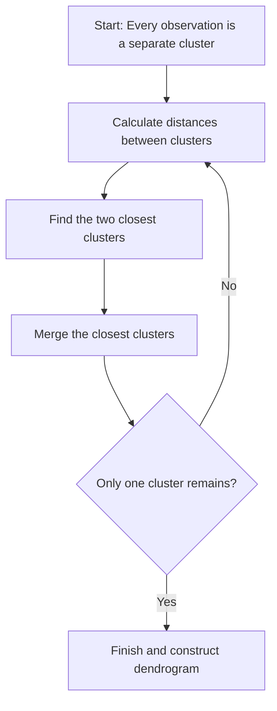
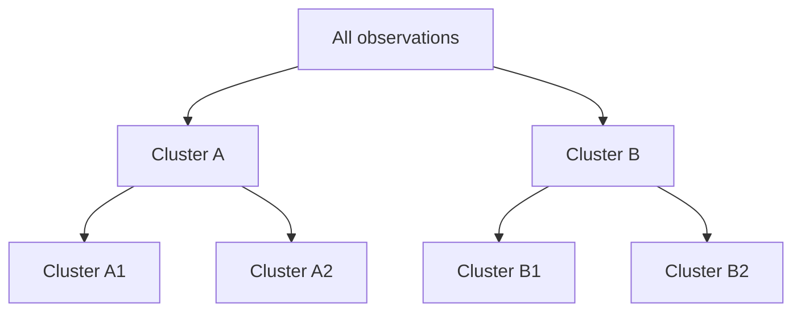
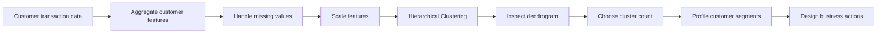

# 010 - Hierarchical Clustering

**Course:** 03 - Machine Learning and Deep Learning
**Module:** Module 06 - Machine Learning
**Content Group:** Unsupervised Learning
**Roadmap Source:** Machine Learning / Unsupervised Learning
**Lesson Type:** Machine Learning
**Order in Module:** 010
**Suggested Duration:** 26 minutes

---

## 1. Overview

This lesson introduces **Hierarchical Clustering** in the context of AI and Data Science.

Hierarchical Clustering is an unsupervised learning technique that organizes observations into a hierarchy of nested clusters. Instead of assigning data points directly to a fixed number of clusters, it progressively merges or divides clusters and represents the result as a tree-like diagram called a **dendrogram**.

After completing this lesson, you should understand:

* How Hierarchical Clustering groups similar observations.
* The difference between agglomerative and divisive clustering.
* How distance metrics and linkage methods affect the result.
* How to interpret a dendrogram.
* How to choose the number of clusters.
* When Hierarchical Clustering is more appropriate than K-Means.
* How to implement and evaluate the algorithm in Python.

---

## 2. Learning Objectives

By the end of this lesson, you should be able to:

* Explain Hierarchical Clustering in your own words.
* Distinguish between agglomerative and divisive clustering.
* Describe how distance metrics and linkage criteria work.
* Interpret a dendrogram and select a cluster cut-off.
* Apply Hierarchical Clustering to a real dataset.
* Compare Hierarchical Clustering with K-Means.
* Evaluate the quality and practical meaning of the resulting clusters.
* Identify common implementation mistakes such as missing feature scaling.

---

## 3. What Is Hierarchical Clustering?

**Hierarchical Clustering** is an unsupervised learning algorithm that builds a hierarchy of clusters based on the similarity between observations.

The final result is usually represented using a dendrogram.

A dendrogram shows:

* Individual observations at the bottom.
* Cluster merge operations as branches.
* The distance at which clusters are merged.
* Possible cluster solutions at different levels of the hierarchy.

Unlike K-Means, Hierarchical Clustering does not always require the number of clusters to be specified before training.

---

## 4. Main Types of Hierarchical Clustering

There are two main strategies:

1. Agglomerative Hierarchical Clustering
2. Divisive Hierarchical Clustering

### 4.1 Agglomerative Clustering

Agglomerative clustering follows a **bottom-up** approach.

Initially, every observation is treated as an individual cluster. The algorithm repeatedly merges the two most similar clusters until all observations belong to one large cluster.



For example:

```text
Step 1: {A} {B} {C} {D}
Step 2: {A, B} {C} {D}
Step 3: {A, B} {C, D}
Step 4: {A, B, C, D}
```

Agglomerative clustering is the most commonly used form of Hierarchical Clustering.

---

### 4.2 Divisive Clustering

Divisive clustering follows a **top-down** approach.

The algorithm starts with all observations in one cluster and repeatedly divides clusters into smaller groups.

```text
Step 1: {A, B, C, D}
Step 2: {A, B} {C, D}
Step 3: {A} {B} {C, D}
Step 4: {A} {B} {C} {D}
```

Divisive clustering is less common because repeatedly finding the best possible split can be computationally expensive.

---

## 5. Distance Metrics

Hierarchical Clustering requires a way to measure similarity or dissimilarity between observations.

### 5.1 Euclidean Distance

Euclidean distance measures the straight-line distance between two points.

For two observations (x) and (y) with (m) features:

$$
d(x,y) = \sqrt{\sum_{j=1}^{m}(x_j-y_j)^2}
$$

For two-dimensional points:

$$
d(x,y) = \sqrt{(x_1-y_1)^2 + (x_2-y_2)^2}
$$

Euclidean distance is commonly used for continuous numerical features.

---

### 5.2 Manhattan Distance

Manhattan distance calculates the sum of absolute differences:

$$
d(x,y) = \sum_{j=1}^{m}|x_j-y_j|
$$

It may be more suitable when:

* Features contain outliers.
* Movement can be interpreted along independent dimensions.
* Straight-line distance is not meaningful.

---

### 5.3 Cosine Distance

Cosine similarity measures the angle between two vectors:

$$
\text{cosine similarity}(x,y) = \frac{x \cdot y} {\lVert x \rVert \lVert y \rVert}
$$

Cosine distance can be defined as:

$$
d_{\text{cosine}}(x,y) = 1-\text{cosine similarity}(x,y)
$$

Cosine distance is useful for:

* Document clustering.
* Text embeddings.
* High-dimensional sparse data.
* User preference vectors.

---

### 5.4 Other Distance Metrics

Depending on the dataset, other metrics may be useful:

* Hamming distance for binary or categorical vectors.
* Jaccard distance for sets or binary attributes.
* Correlation distance for similar patterns.
* Gower distance for mixed numerical and categorical data.

The distance metric must match the meaning and structure of the data.

---

## 6. Why Feature Scaling Matters

Distance-based algorithms are highly sensitive to feature scales.

Consider two features:

```text
Age:           18 to 70
Annual income: 15,000 to 200,000
```

Without scaling, annual income will dominate the distance calculation because its numerical values are much larger.

A common solution is standardization:

$$
z = \frac{x-\mu}{\sigma}
$$

Where:

* (x) is the original value.
* (\mu) is the feature mean.
* (\sigma) is the feature standard deviation.
* (z) is the standardized value.

Typical preprocessing:

```python
from sklearn.preprocessing import StandardScaler

scaler = StandardScaler()
X_scaled = scaler.fit_transform(X)
```

Scaling should usually be performed before calculating distances.

---

## 7. Linkage Methods

A distance metric measures the distance between individual observations. A **linkage method** determines how the distance between two clusters is calculated.

Suppose clusters (A) and (B) contain multiple observations.

---

### 7.1 Single Linkage

Single linkage uses the minimum distance between any pair of observations from the two clusters.

$$
D(A,B) = \min_{x \in A,\ y \in B} d(x,y)
$$

Characteristics:

* Can detect irregular or elongated cluster shapes.
* May create a chaining effect.
* Sensitive to noise and bridge points.

```text
Cluster A: ● ● ●
                  shortest distance
Cluster B:           ● ● ●
```

---

### 7.2 Complete Linkage

Complete linkage uses the maximum distance between any pair of observations from the two clusters.

$$
D(A,B) = \max_{x \in A,\ y \in B} d(x,y)
$$

Characteristics:

* Produces compact clusters.
* Reduces the chaining problem.
* Can be sensitive to outliers.

---

### 7.3 Average Linkage

Average linkage calculates the average distance between all pairs of observations from the two clusters.

$$
D(A,B) = \frac{1}{|A||B|} \sum_{x \in A} \sum_{y \in B} d(x,y)
$$

Characteristics:

* Provides a compromise between single and complete linkage.
* Often produces balanced clusters.
* Less affected by extreme distances than complete linkage.

---

### 7.4 Centroid Linkage

Centroid linkage calculates the distance between cluster centroids.

The centroid of cluster (A) is:

$$
\mu_A = \frac{1}{|A|} \sum_{x \in A}x
$$

The distance between clusters is then:

$$
D(A,B) = d(\mu_A,\mu_B)
$$

A limitation is that centroid linkage can produce dendrogram inversions, where later merges appear at lower distances than earlier merges.

---

### 7.5 Ward Linkage

Ward linkage merges the pair of clusters that causes the smallest increase in total within-cluster variance.

For cluster (C), the within-cluster sum of squares is:

$$
WCSS(C) = \sum_{x \in C} \lVert x-\mu_C \rVert^2
$$

At each step, Ward linkage selects the merge that minimizes:

$$
\Delta(A,B) = WCSS(A \cup B)-WCSS(A)-WCSS(B)
$$

Characteristics:

* Produces compact, approximately spherical clusters.
* Often works well with standardized numerical data.
* Is conceptually similar to the objective used by K-Means.
* Normally requires Euclidean distance.

---

## 8. Linkage Method Comparison

| Linkage method | Cluster distance definition         | Main advantage              | Main limitation               |
| -------------- | ----------------------------------- | --------------------------- | ----------------------------- |
| Single         | Minimum pairwise distance           | Detects irregular shapes    | Chaining effect               |
| Complete       | Maximum pairwise distance           | Produces compact clusters   | Sensitive to outliers         |
| Average        | Mean pairwise distance              | Balanced behavior           | More computational work       |
| Centroid       | Distance between centroids          | Easy to interpret           | May create inversions         |
| Ward           | Increase in within-cluster variance | Compact and stable clusters | Best suited to Euclidean data |

There is no universally best linkage method. The correct choice depends on:

* Cluster geometry.
* Noise level.
* Presence of outliers.
* Feature representation.
* Business interpretation.

---

## 9. Agglomerative Clustering Algorithm

Given a dataset containing (n) observations:

1. Treat every observation as an individual cluster.
2. Calculate the distance between all cluster pairs.
3. Find the two closest clusters.
4. Merge them into a new cluster.
5. Recalculate the distances between the new cluster and the remaining clusters.
6. Repeat until only one cluster remains.
7. Use the dendrogram to select a final number of clusters.

```mermaid
flowchart LR
    A["Raw dataset"]
    B["Clean and select features"]
    C["Scale numerical features"]
    D["Calculate distance matrix"]
    E["Apply linkage method"]
    F["Build hierarchy"]
    G["Plot dendrogram"]
    H["Choose cut-off level"]
    I["Assign cluster labels"]
    J["Profile and validate clusters"]

    A --> B --> C --> D --> E --> F --> G --> H --> I --> J
```



---

## 10. Understanding a Dendrogram

A dendrogram is a tree diagram that visualizes hierarchical relationships between observations and clusters.

```text
Distance
  |
  |                     ┌──────────── Cluster 1 and Cluster 2
  |          ┌──────────┤
  |          |          └──────────── Cluster 2
  |     ┌────┤
  |     |    |          ┌──────────── Cluster 3
  |     |    └──────────┤
  |     |               └──────────── Cluster 4
  +------------------------------------------------ Observations
```

A dendrogram contains:

* **Leaves:** individual observations.
* **Branches:** merge operations.
* **Merge height:** distance between merged clusters.
* **Horizontal cut:** selected cluster solution.

A large vertical gap often indicates that substantially different clusters are being merged.

---

## 11. Choosing the Number of Clusters

Hierarchical Clustering builds the entire hierarchy first. The number of clusters can then be selected by cutting the dendrogram at a chosen height.

```text
Higher cut:
    fewer clusters

Lower cut:
    more clusters
```

For example, if a horizontal line intersects three main branches, the selected solution contains three clusters.



Possible selection methods include:

* Visual inspection of the dendrogram.
* Silhouette score.
* Calinski-Harabasz score.
* Davies-Bouldin score.
* Stability across samples.
* Domain knowledge.
* Business usefulness.

The dendrogram should support the decision, but it should not be the only source of evidence.

---

## 12. Silhouette Score

The silhouette score measures how similar an observation is to its own cluster compared with the nearest neighboring cluster.

For observation (i):

* (a(i)): average distance from (i) to observations in the same cluster.
* (b(i)): smallest average distance from (i) to observations in another cluster.

The silhouette value is:

$$
s(i) = \frac{b(i)-a(i)} {\max(a(i),b(i))}
$$

The overall silhouette score is the mean silhouette value across all observations.

Interpretation:

|      Score | Interpretation                             |
| ---------: | ------------------------------------------ |
| Close to 1 | Observation is well matched to its cluster |
| Close to 0 | Observation lies near a cluster boundary   |
|    Below 0 | Observation may belong to another cluster  |

A higher silhouette score generally indicates better-separated clusters, but business interpretability must still be considered.

---

## 13. Hierarchical Clustering vs. K-Means

| Characteristic                             | Hierarchical Clustering           | K-Means                              |
| ------------------------------------------ | --------------------------------- | ------------------------------------ |
| Number of clusters required before fitting | Not necessarily                   | Yes                                  |
| Output                                     | Cluster hierarchy and labels      | Cluster labels and centroids         |
| Main visualization                         | Dendrogram                        | Scatter plot or centroid plot        |
| Reassignment after merge                   | Normally no                       | Yes                                  |
| Cluster shape                              | Depends on linkage                | Usually spherical                    |
| Scaling requirement                        | Important                         | Important                            |
| Sensitivity to initialization              | No random centroid initialization | Can be sensitive                     |
| Large dataset performance                  | Often expensive                   | Usually more scalable                |
| Interpretability                           | Strong for small datasets         | Strong when centroids are meaningful |
| Outlier sensitivity                        | Depends on linkage                | Often sensitive                      |

Use Hierarchical Clustering when:

* The dataset is small or medium-sized.
* A hierarchy is meaningful.
* You do not know the correct number of clusters.
* You want to inspect relationships at multiple cluster levels.
* A dendrogram can help communicate the result.

Use K-Means when:

* The dataset is large.
* Fast iterative clustering is required.
* Clusters are expected to be compact and approximately spherical.
* Cluster centroids have useful interpretations.
* The number of clusters can be estimated in advance.

---

## 14. Python Demo with Synthetic Data

### 14.1 Import Libraries

```python
import matplotlib.pyplot as plt
import pandas as pd

from scipy.cluster.hierarchy import dendrogram, linkage
from sklearn.cluster import AgglomerativeClustering
from sklearn.datasets import make_blobs
from sklearn.metrics import silhouette_score
from sklearn.preprocessing import StandardScaler
```

---

### 14.2 Create a Dataset

```python
X, true_labels = make_blobs(
    n_samples=200,
    centers=4,
    cluster_std=1.1,
    random_state=42
)

df = pd.DataFrame(X, columns=["feature_1", "feature_2"])

print(df.head())
print(df.shape)
```

---

### 14.3 Scale the Features

```python
scaler = StandardScaler()
X_scaled = scaler.fit_transform(df)
```

---

### 14.4 Build a Dendrogram

```python
linkage_matrix = linkage(
    X_scaled,
    method="ward"
)

plt.figure(figsize=(12, 6))

dendrogram(
    linkage_matrix,
    truncate_mode="level",
    p=5
)

plt.title("Hierarchical Clustering Dendrogram")
plt.xlabel("Observations or Cluster Groups")
plt.ylabel("Merge Distance")
plt.show()
```

The dendrogram helps identify large jumps in merge distance and possible cluster cut-off levels.

---

### 14.5 Train an Agglomerative Clustering Model

```python
model = AgglomerativeClustering(
    n_clusters=4,
    linkage="ward"
)

cluster_labels = model.fit_predict(X_scaled)

df["cluster"] = cluster_labels

print(df.head())
print(df["cluster"].value_counts().sort_index())
```

---

### 14.6 Visualize the Clusters

```python
plt.figure(figsize=(8, 6))

for cluster_id in sorted(df["cluster"].unique()):
    cluster_data = df[df["cluster"] == cluster_id]

    plt.scatter(
        cluster_data["feature_1"],
        cluster_data["feature_2"],
        label=f"Cluster {cluster_id}",
        alpha=0.7
    )

plt.title("Agglomerative Hierarchical Clustering")
plt.xlabel("Feature 1")
plt.ylabel("Feature 2")
plt.legend()
plt.show()
```

---

### 14.7 Evaluate the Result

```python
score = silhouette_score(
    X_scaled,
    cluster_labels
)

print(f"Silhouette score: {score:.3f}")
```

Do not interpret the score alone. Also examine:

* Cluster sizes.
* Cluster separation.
* Feature distributions.
* Outliers.
* Stability.
* Business meaning.

---

## 15. Comparing Different Numbers of Clusters

```python
results = []

for n_clusters in range(2, 9):
    model = AgglomerativeClustering(
        n_clusters=n_clusters,
        linkage="ward"
    )

    labels = model.fit_predict(X_scaled)

    score = silhouette_score(
        X_scaled,
        labels
    )

    results.append({
        "n_clusters": n_clusters,
        "silhouette_score": score
    })

results_df = pd.DataFrame(results)

print(results_df)
```

Plot the results:

```python
plt.figure(figsize=(8, 5))

plt.plot(
    results_df["n_clusters"],
    results_df["silhouette_score"],
    marker="o"
)

plt.title("Silhouette Score by Number of Clusters")
plt.xlabel("Number of Clusters")
plt.ylabel("Silhouette Score")
plt.show()
```

The number of clusters with the highest silhouette score is a useful candidate, but the final selection should also make sense for the problem domain.

---

## 16. Comparing Linkage Methods

```python
linkage_methods = [
    "single",
    "complete",
    "average",
    "ward"
]

comparison = []

for method in linkage_methods:
    model = AgglomerativeClustering(
        n_clusters=4,
        linkage=method
    )

    labels = model.fit_predict(X_scaled)

    score = silhouette_score(
        X_scaled,
        labels
    )

    comparison.append({
        "linkage": method,
        "silhouette_score": score
    })

comparison_df = pd.DataFrame(comparison)

print(comparison_df.sort_values(
    "silhouette_score",
    ascending=False
))
```

The best linkage method should be selected based on both quantitative metrics and the structure of the clusters.

---

## 17. Example: Customer Segmentation

Suppose a company has the following customer features:

| Feature                    | Description                |
| -------------------------- | -------------------------- |
| `annual_income`            | Customer annual income     |
| `spending_score`           | Relative spending activity |
| `purchase_frequency`       | Number of purchases        |
| `average_order_value`      | Average value per order    |
| `days_since_last_purchase` | Customer recency           |

A possible workflow is:



Possible customer groups could include:

* High-value loyal customers.
* Frequent low-value customers.
* Inactive historical customers.
* New customers with growth potential.
* High-income customers with low engagement.

The cluster labels themselves have no meaning until the clusters are profiled.

Example profiling code:

```python
cluster_profile = (
    df.groupby("cluster")
    .mean(numeric_only=True)
    .round(2)
)

print(cluster_profile)
```

---

## 18. Cluster Profiling

After clustering, calculate descriptive statistics for each cluster.

Useful statistics include:

* Number of observations.
* Mean.
* Median.
* Standard deviation.
* Minimum and maximum.
* Category proportions.
* Revenue contribution.
* Retention rate.
* Churn rate.

Example:

```python
cluster_summary = (
    df.groupby("cluster")
    .agg(
        customer_count=("cluster", "size"),
        mean_feature_1=("feature_1", "mean"),
        mean_feature_2=("feature_2", "mean")
    )
    .round(2)
)

print(cluster_summary)
```

Good cluster descriptions are behavior-based.

Weak label:

```text
Cluster 2
```

Better label:

```text
High-value frequent customers
```

Business-ready label:

```text
Premium loyal customers suitable for retention rewards
```

---

## 19. Practical Workflow

A complete Hierarchical Clustering workflow can be organized as follows:

```text
Business question
    -> data collection
    -> data cleaning
    -> feature selection
    -> feature engineering
    -> feature scaling
    -> distance metric selection
    -> linkage method selection
    -> dendrogram inspection
    -> cluster count selection
    -> cluster assignment
    -> quantitative evaluation
    -> cluster profiling
    -> business interpretation
    -> deployment or reporting
```

The clustering algorithm is only one part of the workflow. Feature design and interpretation are often more important than the algorithm itself.

---

## 20. Computational Complexity

Traditional agglomerative clustering can require approximately:

$$
O(n^2)
$$

memory because it may store pairwise distances between observations.

Its execution time can vary depending on the implementation, but common implementations may require between:

$$
O(n^2 \log n)
$$

and:

$$
O(n^3)
$$

time in unfavorable cases.

This makes classical Hierarchical Clustering difficult to apply directly to very large datasets.

Possible strategies for large datasets include:

* Sampling representative observations.
* Reducing dimensions before clustering.
* Using approximate nearest-neighbor methods.
* Applying K-Means first and clustering the centroids.
* Using scalable clustering algorithms such as MiniBatch K-Means.
* Using BIRCH for large datasets.
* Applying connectivity constraints.

---

## 21. Advantages

Hierarchical Clustering provides several benefits:

* It does not always require a predefined number of clusters.
* It produces a hierarchy rather than only one flat partition.
* The dendrogram provides a useful visual interpretation.
* It supports different distance metrics.
* It supports different linkage strategies.
* It can reveal nested groups in the data.
* It is deterministic when the data and configuration are unchanged.
* It is useful for exploratory analysis.

---

## 22. Limitations

Important limitations include:

* It can be computationally expensive.
* It can require large amounts of memory.
* Early merge decisions are usually irreversible.
* Results are sensitive to feature scaling.
* Results depend heavily on distance and linkage choices.
* Outliers can distort the hierarchy.
* Dendrograms become difficult to interpret for large datasets.
* Some linkage methods create undesirable chaining behavior.
* Cluster validation remains subjective.
* Cluster labels do not automatically provide business meaning.

---

## 23. Common Mistakes

### 23.1 Not Scaling Features

Unscaled features with larger numerical ranges dominate the distance calculation.

**Solution:** Standardize or normalize relevant numerical features.

---

### 23.2 Selecting a Linkage Method Without Testing

Different linkage methods can produce substantially different clusters.

**Solution:** Compare multiple linkage methods using metrics, visualizations, stability, and domain interpretation.

---

### 23.3 Treating the Dendrogram as Absolute Truth

A dendrogram visualizes the hierarchy, but the correct cut-off is not always obvious.

**Solution:** Combine dendrogram inspection with validation metrics and domain knowledge.

---

### 23.4 Using Irrelevant Features

Including irrelevant or redundant features can create meaningless distances.

**Solution:** Select features that represent the behavior or structure being investigated.

---

### 23.5 Ignoring Outliers

Outliers may appear as isolated branches and can alter merge distances.

**Solution:** Detect and investigate outliers before clustering.

---

### 23.6 Applying Hierarchical Clustering to Extremely Large Data

The distance matrix may consume excessive memory.

**Solution:** Sample the data, reduce dimensions, or choose a more scalable algorithm.

---

### 23.7 Evaluating Clusters Only by a Metric

A high silhouette score does not guarantee useful customer, biological, document, or product segments.

**Solution:** Evaluate statistical separation, stability, interpretability, and practical usefulness.

---

### 23.8 Treating Cluster Labels as Ordered Values

Cluster labels such as `0`, `1`, and `2` are identifiers, not rankings.

Incorrect interpretation:

```text
Cluster 2 is better than Cluster 1.
```

Correct interpretation:

```text
Cluster 2 has higher average spending than Cluster 1.
```

---

## 24. Data Leakage Considerations

Hierarchical Clustering is unsupervised, but leakage can still occur.

Examples include:

* Using future customer behavior to build current customer segments.
* Using outcome variables during feature construction.
* Scaling the entire dataset before evaluating temporal stability.
* Selecting features based on information unavailable at inference time.

For time-dependent applications:

```text
Historical data
    -> fit preprocessing
    -> fit clustering method
    -> evaluate on later data
```

All features must be available at the time the cluster assignment is produced.

---

## 25. Error Analysis for Clustering

Clustering does not have classification errors in the traditional sense, but the result can still be analyzed.

Questions to investigate:

* Are some clusters extremely small?
* Are clusters highly imbalanced?
* Are many observations near cluster boundaries?
* Do clusters change significantly under small data changes?
* Are certain clusters created mainly by outliers?
* Do different linkage methods produce contradictory structures?
* Can domain experts explain the differences between clusters?
* Are cluster assignments useful for a downstream decision?

Example boundary analysis:

```python
from sklearn.metrics import silhouette_samples

sample_scores = silhouette_samples(
    X_scaled,
    cluster_labels
)

df["silhouette_value"] = sample_scores

uncertain_points = df[
    df["silhouette_value"] < 0.1
]

print(uncertain_points.head())
```

Observations with low or negative silhouette values deserve additional inspection.

---

## 26. Cluster Stability

A useful cluster solution should remain reasonably consistent when:

* A small number of observations are removed.
* A random sample is used.
* Minor noise is added.
* Features are slightly changed.
* A new period of data is evaluated.

A basic stability experiment can be performed by:

1. Sampling the dataset several times.
2. Running clustering on each sample.
3. Comparing cluster assignments or cluster profiles.
4. Checking whether similar groups repeatedly appear.

Common comparison metrics include:

* Adjusted Rand Index.
* Normalized Mutual Information.
* Jaccard similarity.
* Cluster centroid or medoid distance.
* Profile similarity.

A cluster solution that disappears under small changes may not represent a reliable structure.

---

## 27. Dimensionality Reduction

Hierarchical Clustering may struggle with high-dimensional data because distances become less informative.

Possible dimensionality-reduction techniques include:

* Principal Component Analysis.
* Truncated Singular Value Decomposition.
* Autoencoders.
* Feature selection.
* Domain-driven feature aggregation.

Example with PCA:

```python
from sklearn.decomposition import PCA

pca = PCA(n_components=2)

X_reduced = pca.fit_transform(X_scaled)

model = AgglomerativeClustering(
    n_clusters=4,
    linkage="ward"
)

labels = model.fit_predict(X_reduced)
```

PCA can be used for visualization, but clustering only on two components may discard important information. Compare the result with clustering on the full standardized feature space.

---

## 28. Portfolio Artifact

A strong portfolio project should include:

### Problem Definition

```text
Can customers be grouped into meaningful behavioral segments?
```

### Dataset

Include:

* Data source.
* Number of observations.
* Feature definitions.
* Missing-value handling.
* Outlier handling.

### Experiment

Compare:

* Single linkage.
* Complete linkage.
* Average linkage.
* Ward linkage.
* Different numbers of clusters.
* Hierarchical Clustering versus K-Means.

### Evaluation

Report:

* Silhouette score.
* Davies-Bouldin score.
* Cluster size distribution.
* Cluster profiles.
* Dendrogram.
* Two-dimensional visualization.
* Stability analysis.

### Final Deliverables

Possible artifacts:

* Jupyter Notebook.
* Cluster profile report.
* Interactive dashboard.
* Streamlit application.
* REST API for cluster assignment.
* Dockerized clustering service.
* Business recommendation document.

---

## 29. Practical Exercise

Use a customer segmentation dataset or another numerical dataset.

### Task 1: Explore the Data

* Inspect dataset dimensions.
* Identify numerical and categorical features.
* Check missing values.
* Inspect outliers.
* Visualize feature distributions.

### Task 2: Prepare Features

* Select meaningful clustering features.
* Encode categorical features when necessary.
* Standardize numerical features.
* Document every preprocessing decision.

### Task 3: Build the Hierarchy

* Calculate a linkage matrix.
* Plot a dendrogram.
* Identify at least two reasonable cut-off levels.

### Task 4: Compare Models

Train models using:

* Single linkage.
* Complete linkage.
* Average linkage.
* Ward linkage.

Test at least three possible cluster counts.

### Task 5: Evaluate the Clusters

For every configuration, record:

* Number of clusters.
* Linkage method.
* Silhouette score.
* Cluster sizes.
* Interpretation notes.

Suggested experiment table:

| Experiment | Linkage  | Number of clusters | Silhouette score | Interpretation |
| ---------- | -------- | -----------------: | ---------------: | -------------- |
| H1         | Single   |                  3 |              ... | ...            |
| H2         | Complete |                  3 |              ... | ...            |
| H3         | Average  |                  4 |              ... | ...            |
| H4         | Ward     |                  4 |              ... | ...            |

### Task 6: Profile the Clusters

Create a table containing:

* Cluster size.
* Average feature values.
* Median feature values.
* Important categorical proportions.
* Proposed cluster name.
* Recommended action.

### Task 7: Compare with K-Means

Train a K-Means model using the same features and number of clusters.

Compare:

* Silhouette score.
* Cluster balance.
* Interpretability.
* Stability.
* Runtime.
* Cluster geometry.

### Task 8: Write Recommendations

Write at least one recommendation for each cluster.

Example:

```text
Observation:
Cluster 2 has high purchase frequency but low average order value.

Explanation:
These customers buy regularly but mainly select inexpensive products.

Impact:
The segment contributes stable transaction volume but limited revenue per order.

Recommendation:
Offer bundle discounts or free-shipping thresholds to increase basket size.
```

---

## 30. Completion Checklist

* [ ] I can explain Hierarchical Clustering in one or two minutes.
* [ ] I understand the difference between agglomerative and divisive clustering.
* [ ] I can explain what a dendrogram represents.
* [ ] I understand why feature scaling is important.
* [ ] I can distinguish single, complete, average, centroid, and Ward linkage.
* [ ] I can select a reasonable number of clusters.
* [ ] I can calculate and interpret the silhouette score.
* [ ] I can compare Hierarchical Clustering with K-Means.
* [ ] I can profile clusters using descriptive statistics.
* [ ] I have tested more than one linkage method.
* [ ] I have documented at least one assumption or limitation.
* [ ] I have created a notebook, chart, model, report, API, or portfolio artifact.

---

## 31. Related Outcome

Train, compare, and evaluate supervised and unsupervised machine learning models using thoughtful feature engineering and appropriate evaluation methods.

Hierarchical Clustering contributes to this outcome by developing skills in:

* Unsupervised learning.
* Similarity measurement.
* Cluster validation.
* Exploratory data analysis.
* Feature scaling.
* Model comparison.
* Pattern discovery.
* Business interpretation.

---

## 32. Related Project

### Recommended Mini Project: Customer Segmentation

Build a customer segmentation system using:

* Exploratory Data Analysis.
* Missing-value treatment.
* Outlier analysis.
* Feature engineering.
* Feature scaling.
* Hierarchical Clustering.
* K-Means comparison.
* Dendrogram visualization.
* Cluster profiling.
* Business recommendations.

### Connection to the House Price Prediction Project

Hierarchical Clustering can also support a house price prediction project by:

* Grouping properties with similar characteristics.
* Discovering neighborhood or property segments.
* Detecting unusual properties.
* Creating cluster labels as additional features.
* Comparing prediction errors across property groups.

However, Hierarchical Clustering is not itself a house price prediction model because clustering does not directly predict a target value.

---

## 33. Summary

**Hierarchical Clustering** builds a hierarchy of nested groups based on observation similarity.

The main ideas are:

* Agglomerative clustering merges clusters from the bottom up.
* Divisive clustering splits clusters from the top down.
* Distance metrics define similarity between observations.
* Linkage methods define similarity between clusters.
* Dendrograms visualize the complete cluster hierarchy.
* Feature scaling strongly affects distance-based results.
* The number of clusters can be selected after constructing the hierarchy.
* Cluster quality requires both quantitative validation and domain interpretation.
* Hierarchical Clustering is informative for small and medium-sized datasets but may be expensive for large datasets.

A successful clustering project does more than generate labels. It converts discovered data structure into understandable groups, validates their stability, and connects them to useful decisions.

Turn this lesson into a practical artifact such as:

* A Jupyter Notebook.
* A dendrogram visualization.
* A cluster evaluation report.
* A customer segmentation dashboard.
* A Streamlit application.
* A clustering API.
* A Dockerized machine learning service.
* A portfolio case study.

---

# Bài luyện tập

## Mục tiêu


## Đề bài


## Yêu cầu hoàn thành

- [ ] 
- [ ] 
- [ ] 

## Kết quả / lời giải


## Ghi chú
