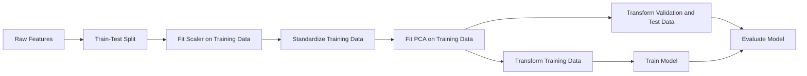
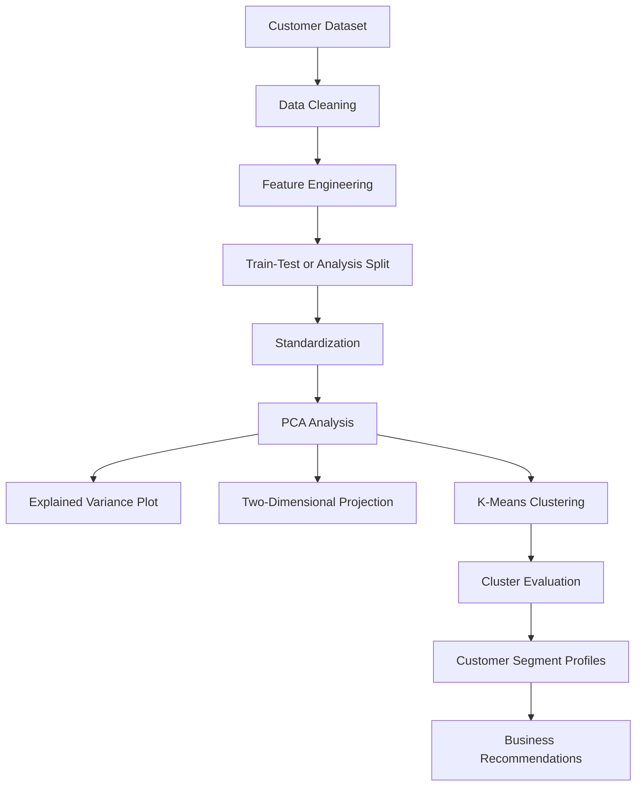

# 011 - Principal Component Analysis (PCA)

**Course:** 03 - Machine Learning and Deep Learning
**Module:** Module 06 - Machine Learning
**Content Group:** Unsupervised Learning
**Roadmap Source:** Machine Learning / Unsupervised Learning
**Lesson Type:** Machine Learning
**Order in Module:** 011
**Suggested Duration:** 26 minutes

---

## 1. Summary

This lesson explains **Principal Component Analysis (PCA)** in the context of AI and Data Science.

PCA is an **unsupervised dimensionality reduction technique** that transforms a dataset with many correlated features into a smaller set of new features called **principal components**.

These principal components:

* Preserve as much data variance as possible.
* Are linear combinations of the original features.
* Are mutually orthogonal.
* Can reduce noise and redundancy.
* Can make high-dimensional data easier to visualize and model.

After completing this lesson, you should understand:

* What PCA does.
* Why dimensionality reduction is useful.
* How PCA finds principal components.
* How to select the number of components.
* How PCA fits into a machine learning workflow.
* How to avoid common mistakes such as data leakage and missing feature scaling.

---

## 2. Learning Objectives

By the end of this lesson, you should be able to:

* Explain PCA using your own words.
* Identify when PCA is appropriate.
* Understand the meaning of principal components.
* Describe explained variance and explained variance ratio.
* Apply PCA using Scikit-learn.
* Select a suitable number of principal components.
* Visualize high-dimensional data in two or three dimensions.
* Use PCA inside a machine learning pipeline.
* Avoid data leakage when applying PCA.
* Evaluate whether PCA improves a model or experiment.

---

## 3. Why Dimensionality Reduction Is Needed

Real-world datasets may contain hundreds or thousands of features.

Examples include:

* Pixels in an image.
* Words in a document representation.
* Sensor measurements.
* Gene expression values.
* Customer behavior variables.
* Financial indicators.
* Embedding vectors.

High-dimensional data may cause several problems.

### 3.1 Increased Computational Cost

More features require:

* More memory.
* Longer training time.
* More complex models.
* More expensive inference.

### 3.2 Multicollinearity

Some features may contain similar information.

For example:

```text
height_cm
height_m
```

These two features are almost perfectly correlated.

Keeping both may introduce unnecessary redundancy.

### 3.3 Noise

Some dimensions may mostly contain noise rather than useful patterns.

Reducing dimensionality can sometimes remove low-variance noise.

### 3.4 Difficulty in Visualization

Humans can easily understand two-dimensional and three-dimensional plots, but not datasets with hundreds of dimensions.

PCA can project high-dimensional data into two or three dimensions.

### 3.5 The Curse of Dimensionality

As dimensionality increases, data points become increasingly sparse.

Distance-based algorithms may become less effective because distances between points become less distinguishable.

Algorithms affected by this problem include:

* K-Nearest Neighbors.
* K-Means.
* Hierarchical clustering.
* Density-based methods.
* Similarity search systems.

---

## 4. Main Concept

PCA finds new directions in the dataset that capture the greatest possible variance.

These directions are called **principal components**.

### First Principal Component

The first principal component is the direction along which the data has the maximum variance.

### Second Principal Component

The second principal component captures the maximum remaining variance while being perpendicular to the first component.

### Later Components

Each later component:

* Captures the maximum remaining variance.
* Is perpendicular to all previous components.
* Usually explains less variance than earlier components.

---

## 5. PCA Intuition

Imagine a two-dimensional dataset where the points form an elongated diagonal cloud.

```text
Feature 2
   ^
   |
   |                   *
   |                *
   |             *
   |          *
   |       *
   |    *
   | *
   +----------------------------> Feature 1
```

The original coordinate system uses:

* Feature 1.
* Feature 2.

However, most variation occurs along the diagonal direction.

PCA rotates the coordinate system so that:

* Principal Component 1 follows the longest direction of the data.
* Principal Component 2 follows the shorter perpendicular direction.

```text
Original features
       |
       |      Data cloud
       |        ///////
       |      ///////
       |    ///////
       +----------------

PCA coordinate system
                PC2
                 ^
                 |
          ///////|
        ///////  |
      ///////    |
  ---------------+------------> PC1
```

If PC1 captures nearly all the variation, PC2 may be removed with little information loss.

---

## 6. PCA Workflow



A safe PCA workflow is:

```text
Raw data
   ↓
Train-test split
   ↓
Fit scaler on training data
   ↓
Transform training and test data
   ↓
Fit PCA on scaled training data
   ↓
Transform training and test data
   ↓
Train model
   ↓
Evaluate against baseline
```

PCA must be fitted only on the training data.

---

## 7. Mathematical Foundation

Assume the dataset contains:

```text
n = number of samples
p = number of original features
X = data matrix with shape (n, p)
```

### 7.1 Center the Data

PCA begins by subtracting the mean of each feature.

```text
X_centered = X - feature_mean
```

For each value:

```text
centered_value = original_value - feature_mean
```

After centering, each feature has a mean close to zero.

### 7.2 Standardize the Data

When features use different scales, standardization is usually necessary.

```text
standardized_value = (value - mean) / standard_deviation
```

After standardization:

```text
feature mean ≈ 0
feature standard deviation ≈ 1
```

Without scaling, a feature measured in large units may dominate PCA.

For example:

```text
Annual income: 20,000 to 200,000
Age: 18 to 80
```

Income may dominate the variance simply because its numerical values are larger.

### 7.3 Compute the Covariance Matrix

The covariance matrix describes how features vary together.

```text
Covariance matrix = (1 / (n - 1)) × X_centeredᵀ × X_centered
```

Its shape is:

```text
p × p
```

For two features:

```text
Covariance matrix =
[
    variance(feature_1), covariance(feature_1, feature_2)
    covariance(feature_2, feature_1), variance(feature_2)
]
```

Interpretation:

```text
Positive covariance:
Both features tend to increase together.

Negative covariance:
One feature tends to increase when the other decreases.

Covariance near zero:
There is little linear relationship.
```

### 7.4 Find Eigenvectors and Eigenvalues

PCA decomposes the covariance matrix into:

* Eigenvectors.
* Eigenvalues.

An eigenvector represents a principal direction.

An eigenvalue represents the amount of variance captured by that direction.

```text
Covariance matrix × eigenvector
    =
eigenvalue × eigenvector
```

The eigenvectors are sorted by decreasing eigenvalue.

```text
Largest eigenvalue
    → Principal Component 1

Second-largest eigenvalue
    → Principal Component 2

Third-largest eigenvalue
    → Principal Component 3
```

### 7.5 Project the Data

After selecting the first `k` principal components:

```text
Z = X_centered × W
```

Where:

```text
X_centered = centered or standardized data
W          = matrix containing the selected principal directions
Z          = transformed lower-dimensional data
```

Shapes:

```text
X_centered: n × p
W:          p × k
Z:          n × k
```

When `k < p`, the dimensionality has been reduced.

---

## 8. Singular Value Decomposition

In practice, many PCA implementations use **Singular Value Decomposition**, abbreviated as SVD.

The centered data matrix can be decomposed as:

```text
X_centered = U × S × Vᵀ
```

Where:

```text
U = left singular vectors
S = singular values
V = principal directions
```

Scikit-learn generally uses SVD-based algorithms instead of explicitly calculating the covariance matrix.

This approach is often more numerically stable and efficient.

---

## 9. Explained Variance

The amount of variance captured by each principal component is called its **explained variance**.

Suppose PCA produces these eigenvalues:

```text
PC1 eigenvalue = 5.0
PC2 eigenvalue = 2.0
PC3 eigenvalue = 1.0
PC4 eigenvalue = 0.5
```

The total variance is:

```text
Total variance = 5.0 + 2.0 + 1.0 + 0.5
               = 8.5
```

The explained variance ratio of PC1 is:

```text
PC1 explained variance ratio = 5.0 / 8.5
                             ≈ 0.588
                             ≈ 58.8%
```

The explained variance ratio of each component is:

```text
explained_variance_ratio_i
    =
variance_explained_by_component_i / total_variance
```

Example:

| Component | Explained Variance Ratio | Cumulative Variance |
| --------- | -----------------------: | ------------------: |
| PC1       |                    58.8% |               58.8% |
| PC2       |                    23.5% |               82.3% |
| PC3       |                    11.8% |               94.1% |
| PC4       |                     5.9% |              100.0% |

Using the first three components preserves approximately 94.1% of the total variance.

---

## 10. Cumulative Explained Variance

Cumulative explained variance measures how much information is retained by the first `k` components.

```text
Cumulative variance at component k
    =
PC1 ratio + PC2 ratio + ... + PCk ratio
```

A common strategy is to select enough components to retain:

```text
90% of variance
95% of variance
99% of variance
```

However, there is no universal threshold.

The best number of components depends on:

* The dataset.
* The model.
* The business objective.
* The acceptable information loss.
* Computational constraints.
* Validation performance.

---

## 11. Selecting the Number of Components

### Method 1: Fixed Number

```python
PCA(n_components=2)
```

Useful for:

* Two-dimensional visualization.
* Simple demonstrations.
* Strict dimensionality requirements.

### Method 2: Explained Variance Threshold

```python
PCA(n_components=0.95)
```

This keeps the minimum number of components required to preserve at least 95% of the variance.

### Method 3: Scree Plot

A scree plot displays explained variance for each component.

Look for an **elbow point** where later components contribute only small amounts of additional variance.

```text
Explained
variance
   ^
   | *
   |  *
   |    *
   |      *
   |        *  *  *  *
   +----------------------> Component number
                ^
              elbow
```

### Method 4: Model Validation

Try several values and compare validation performance.

```text
k = 5
k = 10
k = 20
k = 50
```

The best value should be selected using validation data rather than test data.

---

## 12. PCA Algorithm

The conceptual PCA algorithm is:

```text
1. Split the dataset into training and test sets.
2. Calculate feature means from the training set.
3. Standardize the training set.
4. Apply the same scaler to validation and test sets.
5. Calculate the covariance structure of the training data.
6. Find principal directions.
7. Sort components by explained variance.
8. Select the first k components.
9. Project the data onto the selected components.
10. Train and evaluate the downstream model.
```

---

## 13. Simple NumPy Implementation

The following example demonstrates PCA from first principles.

```python
import numpy as np


def pca_from_scratch(
    X: np.ndarray,
    n_components: int,
) -> tuple[np.ndarray, np.ndarray, np.ndarray]:
    """
    Apply PCA to a numeric matrix.

    Parameters
    ----------
    X:
        Input matrix with shape (n_samples, n_features).
    n_components:
        Number of principal components to retain.

    Returns
    -------
    X_reduced:
        Transformed data.
    components:
        Selected principal directions.
    explained_variance_ratio:
        Variance ratio captured by selected components.
    """
    if X.ndim != 2:
        raise ValueError("X must be a two-dimensional matrix.")

    n_samples, n_features = X.shape

    if n_samples < 2:
        raise ValueError("PCA requires at least two samples.")

    if not 1 <= n_components <= n_features:
        raise ValueError(
            "n_components must be between 1 and the number of features."
        )

    # Step 1: Center the features.
    feature_means = np.mean(X, axis=0)
    X_centered = X - feature_means

    # Step 2: Calculate the covariance matrix.
    covariance_matrix = np.cov(X_centered, rowvar=False)

    # Step 3: Compute eigenvalues and eigenvectors.
    eigenvalues, eigenvectors = np.linalg.eigh(covariance_matrix)

    # Step 4: Sort from largest to smallest eigenvalue.
    sorted_indices = np.argsort(eigenvalues)[::-1]
    sorted_eigenvalues = eigenvalues[sorted_indices]
    sorted_eigenvectors = eigenvectors[:, sorted_indices]

    # Step 5: Select the top components.
    components = sorted_eigenvectors[:, :n_components]

    # Step 6: Project the centered data.
    X_reduced = X_centered @ components

    # Step 7: Calculate explained variance ratios.
    total_variance = np.sum(sorted_eigenvalues)
    explained_variance_ratio = (
        sorted_eigenvalues[:n_components] / total_variance
    )

    return X_reduced, components, explained_variance_ratio
```

Example usage:

```python
X = np.array(
    [
        [2.5, 2.4],
        [0.5, 0.7],
        [2.2, 2.9],
        [1.9, 2.2],
        [3.1, 3.0],
        [2.3, 2.7],
        [2.0, 1.6],
        [1.0, 1.1],
        [1.5, 1.6],
        [1.1, 0.9],
    ]
)

X_reduced, components, variance_ratio = pca_from_scratch(
    X,
    n_components=1,
)

print("Reduced shape:", X_reduced.shape)
print("Principal direction:")
print(components)
print("Explained variance ratio:")
print(variance_ratio)
```

This implementation is useful for learning, but production projects should normally use a tested library such as Scikit-learn.

---

## 14. PCA with Scikit-Learn

### Basic Example

```python
from sklearn.datasets import load_wine
from sklearn.decomposition import PCA
from sklearn.model_selection import train_test_split
from sklearn.preprocessing import StandardScaler

data = load_wine()

X = data.data
y = data.target

X_train, X_test, y_train, y_test = train_test_split(
    X,
    y,
    test_size=0.2,
    random_state=42,
    stratify=y,
)

scaler = StandardScaler()

X_train_scaled = scaler.fit_transform(X_train)
X_test_scaled = scaler.transform(X_test)

pca = PCA(n_components=2)

X_train_pca = pca.fit_transform(X_train_scaled)
X_test_pca = pca.transform(X_test_scaled)

print("Original training shape:", X_train.shape)
print("Reduced training shape:", X_train_pca.shape)
print("Explained variance ratio:", pca.explained_variance_ratio_)
print(
    "Total retained variance:",
    pca.explained_variance_ratio_.sum(),
)
```

Important distinction:

```text
fit_transform():
Learn PCA directions and transform the data.

transform():
Use previously learned PCA directions to transform new data.
```

Therefore:

```python
X_train_pca = pca.fit_transform(X_train_scaled)
X_test_pca = pca.transform(X_test_scaled)
```

Do not use `fit_transform()` independently on the test set.

---

## 15. PCA Visualization

PCA is frequently used to visualize datasets with many features.

```python
import matplotlib.pyplot as plt
from sklearn.datasets import load_wine
from sklearn.decomposition import PCA
from sklearn.preprocessing import StandardScaler

data = load_wine()

X = data.data
y = data.target

X_scaled = StandardScaler().fit_transform(X)

pca = PCA(n_components=2)
X_pca = pca.fit_transform(X_scaled)

plt.figure(figsize=(8, 6))
scatter = plt.scatter(
    X_pca[:, 0],
    X_pca[:, 1],
    c=y,
    alpha=0.75,
)

plt.xlabel("Principal Component 1")
plt.ylabel("Principal Component 2")
plt.title("Wine Dataset Projected with PCA")
plt.colorbar(scatter, label="Class")
plt.tight_layout()
plt.show()
```

The plot may help answer questions such as:

* Are classes naturally separated?
* Are there visible clusters?
* Are there unusual observations?
* Are some classes strongly overlapping?
* Does the dataset contain outliers?

A PCA visualization is exploratory evidence, not proof that clusters or classes are valid.

---

## 16. Explained Variance Plot

```python
import numpy as np
import matplotlib.pyplot as plt
from sklearn.datasets import load_wine
from sklearn.decomposition import PCA
from sklearn.preprocessing import StandardScaler

data = load_wine()
X = data.data

X_scaled = StandardScaler().fit_transform(X)

pca = PCA()
pca.fit(X_scaled)

cumulative_variance = np.cumsum(
    pca.explained_variance_ratio_
)

plt.figure(figsize=(8, 5))
plt.plot(
    range(1, len(cumulative_variance) + 1),
    cumulative_variance,
    marker="o",
)

plt.axhline(
    y=0.95,
    linestyle="--",
    label="95% retained variance",
)

plt.xlabel("Number of Principal Components")
plt.ylabel("Cumulative Explained Variance")
plt.title("PCA Cumulative Explained Variance")
plt.legend()
plt.tight_layout()
plt.show()
```

The smallest component count above the 95% line is a possible candidate.

It should still be validated using downstream model performance.

---

## 17. PCA in a Machine Learning Pipeline

A pipeline prevents inconsistent preprocessing and reduces the risk of data leakage.

```python
from sklearn.datasets import load_wine
from sklearn.decomposition import PCA
from sklearn.linear_model import LogisticRegression
from sklearn.model_selection import cross_val_score
from sklearn.pipeline import Pipeline
from sklearn.preprocessing import StandardScaler

data = load_wine()

X = data.data
y = data.target

pipeline = Pipeline(
    steps=[
        ("scaler", StandardScaler()),
        ("pca", PCA(n_components=0.95)),
        (
            "classifier",
            LogisticRegression(
                max_iter=2000,
                random_state=42,
            ),
        ),
    ]
)

scores = cross_val_score(
    pipeline,
    X,
    y,
    cv=5,
    scoring="accuracy",
)

print("Cross-validation scores:", scores)
print("Mean accuracy:", scores.mean())
print("Standard deviation:", scores.std())
```

During cross-validation, the pipeline fits the scaler and PCA separately inside each training fold.

This prevents information from validation folds from leaking into preprocessing.

---

## 18. Baseline Comparison

PCA should not automatically be assumed to improve a model.

Always compare at least two experiments.

```text
Experiment A:
Scaling → Model

Experiment B:
Scaling → PCA → Model
```

Example:

```python
from sklearn.datasets import load_wine
from sklearn.decomposition import PCA
from sklearn.linear_model import LogisticRegression
from sklearn.model_selection import cross_validate
from sklearn.pipeline import Pipeline
from sklearn.preprocessing import StandardScaler

data = load_wine()

X = data.data
y = data.target

baseline_pipeline = Pipeline(
    steps=[
        ("scaler", StandardScaler()),
        (
            "classifier",
            LogisticRegression(
                max_iter=2000,
                random_state=42,
            ),
        ),
    ]
)

pca_pipeline = Pipeline(
    steps=[
        ("scaler", StandardScaler()),
        ("pca", PCA(n_components=0.95)),
        (
            "classifier",
            LogisticRegression(
                max_iter=2000,
                random_state=42,
            ),
        ),
    ]
)

scoring = {
    "accuracy": "accuracy",
    "f1_macro": "f1_macro",
}

baseline_result = cross_validate(
    baseline_pipeline,
    X,
    y,
    cv=5,
    scoring=scoring,
)

pca_result = cross_validate(
    pca_pipeline,
    X,
    y,
    cv=5,
    scoring=scoring,
)

print(
    "Baseline accuracy:",
    baseline_result["test_accuracy"].mean(),
)

print(
    "PCA accuracy:",
    pca_result["test_accuracy"].mean(),
)

print(
    "Baseline macro F1:",
    baseline_result["test_f1_macro"].mean(),
)

print(
    "PCA macro F1:",
    pca_result["test_f1_macro"].mean(),
)
```

Compare more than predictive performance.

| Criterion          |       Baseline |  PCA Pipeline |
| ------------------ | -------------: | ------------: |
| Validation metric  |        Measure |       Measure |
| Number of features | Original count | Reduced count |
| Training time      |        Measure |       Measure |
| Inference time     |        Measure |       Measure |
| Memory usage       |        Measure |       Measure |
| Interpretability   | Usually higher | Usually lower |

PCA may be useful even when the score remains similar if it significantly reduces computation or storage.

---

## 19. PCA Component Loadings

Each principal component is a weighted combination of original features.

Example:

```text
PC1 =
0.52 × feature_1
+ 0.47 × feature_2
- 0.18 × feature_3
+ 0.63 × feature_4
```

The weights are called **loadings**.

A large absolute loading means the original feature contributes strongly to that component.

Loadings can be inspected with:

```python
import pandas as pd
from sklearn.datasets import load_wine
from sklearn.decomposition import PCA
from sklearn.preprocessing import StandardScaler

data = load_wine()

X = data.data
feature_names = data.feature_names

X_scaled = StandardScaler().fit_transform(X)

pca = PCA(n_components=3)
pca.fit(X_scaled)

loadings = pd.DataFrame(
    pca.components_.T,
    index=feature_names,
    columns=["PC1", "PC2", "PC3"],
)

print(loadings)
```

To inspect the strongest contributors to PC1:

```python
pc1_importance = (
    loadings["PC1"]
    .abs()
    .sort_values(ascending=False)
)

print(pc1_importance)
```

Loadings must be interpreted carefully because:

* Component signs can be reversed without changing the solution.
* Components combine multiple original features.
* High contribution does not imply causation.
* Standardization affects the resulting loadings.

---

## 20. Reconstructing the Original Data

PCA can approximately reconstruct the original feature space.

```python
from sklearn.decomposition import PCA
from sklearn.preprocessing import StandardScaler

scaler = StandardScaler()
X_scaled = scaler.fit_transform(X)

pca = PCA(n_components=2)

X_reduced = pca.fit_transform(X_scaled)
X_scaled_reconstructed = pca.inverse_transform(X_reduced)
X_reconstructed = scaler.inverse_transform(
    X_scaled_reconstructed
)
```

Because dimensions were removed, reconstruction is usually imperfect.

Reconstruction error can be calculated as:

```text
reconstruction_error
    =
mean((original_data - reconstructed_data)²)
```

Example:

```python
import numpy as np

reconstruction_error = np.mean(
    (X - X_reconstructed) ** 2
)

print("Reconstruction error:", reconstruction_error)
```

Applications include:

* Compression.
* Noise reduction.
* Anomaly detection.
* Measuring information loss.

---

## 21. PCA for Image Compression

An image can be represented as a high-dimensional matrix.

PCA can approximate the image using fewer components.

```text
Original image matrix
        ↓
Center pixel values
        ↓
Find principal components
        ↓
Keep top k components
        ↓
Reconstruct approximate image
```

Keeping more components produces:

* Better image quality.
* Higher storage requirements.

Keeping fewer components produces:

* Greater compression.
* More information loss.
* Blurrier reconstruction.

This demonstrates the main PCA trade-off:

```text
Lower dimensionality
        versus
Information preservation
```

---

## 22. PCA for Clustering

PCA is often applied before clustering.


Potential benefits include:

* Faster clustering.
* Reduced noise.
* Less feature redundancy.
* Easier cluster visualization.
* Improved distance calculations.

However, PCA may also remove low-variance dimensions that are important for cluster separation.

The clustering result should therefore be compared with and without PCA.

---

## 23. PCA for Anomaly Detection

PCA can support anomaly detection through reconstruction error.

The process is:

```text
Fit PCA on mostly normal observations
                ↓
Compress each observation
                ↓
Reconstruct the observation
                ↓
Measure reconstruction error
                ↓
Large error may indicate an anomaly
```

Normal observations are expected to follow the main variance structure.

Anomalies may not be reconstructed accurately.

However, PCA-based anomaly detection assumes that anomalies lie outside the main linear structure of the data.

---

## 24. PCA Compared with Feature Selection

PCA is a **feature extraction** technique, not a traditional feature selection technique.

### Feature Selection

Feature selection keeps some original features.

```text
Original:
age, income, spending_score, visits

Selected:
income, spending_score
```

Advantages:

* Original meanings are preserved.
* Easier interpretation.
* Easier business communication.

### PCA Feature Extraction

PCA creates new synthetic features.

```text
Original:
age, income, spending_score, visits

Transformed:
PC1, PC2
```

Advantages:

* Can represent information from all original features.
* Removes linear correlation between components.
* Often provides stronger dimensionality reduction.

Comparison:

| Property                      | Feature Selection | PCA             |
| ----------------------------- | ----------------- | --------------- |
| Keeps original features       | Yes               | No              |
| Creates new features          | No                | Yes             |
| Easy to interpret             | Usually           | Often difficult |
| Removes correlation           | Not necessarily   | Yes, linearly   |
| Requires scaling              | Sometimes         | Usually         |
| Can capture combined patterns | Limited           | Yes             |

---

## 25. PCA Compared with Other Methods

### PCA vs. Linear Discriminant Analysis

| PCA                                      | Linear Discriminant Analysis                   |
| ---------------------------------------- | ---------------------------------------------- |
| Unsupervised                             | Supervised                                     |
| Does not use class labels                | Uses class labels                              |
| Maximizes overall variance               | Maximizes class separation                     |
| Useful for visualization and compression | Useful for supervised dimensionality reduction |

### PCA vs. t-SNE

| PCA                                        | t-SNE                                                |
| ------------------------------------------ | ---------------------------------------------------- |
| Linear                                     | Nonlinear                                            |
| Preserves global variance structure better | Focuses on local neighborhoods                       |
| Can transform new data                     | Standard t-SNE does not naturally transform new data |
| Relatively fast                            | Often slower                                         |
| Suitable for preprocessing                 | Mostly used for visualization                        |

### PCA vs. UMAP

| PCA                                      | UMAP                               |
| ---------------------------------------- | ---------------------------------- |
| Linear                                   | Nonlinear                          |
| Highly deterministic with fixed settings | May vary based on initialization   |
| Easy to compute                          | More computationally complex       |
| Components have mathematical loadings    | Dimensions are harder to interpret |
| Strong baseline                          | Often reveals complex manifolds    |

### PCA vs. Autoencoders

| PCA                          | Autoencoder                         |
| ---------------------------- | ----------------------------------- |
| Linear transformation        | Can learn nonlinear transformations |
| Simple and fast              | Requires neural network training    |
| Fewer hyperparameters        | More hyperparameters                |
| Easier to reproduce          | More difficult to tune              |
| Works well with limited data | Often benefits from larger datasets |

---

## 26. Assumptions and Limitations

### 26.1 PCA Captures Linear Structure

PCA finds linear combinations of features.

It may fail to capture nonlinear patterns such as:

* Curved manifolds.
* Circular structures.
* Complex nonlinear clusters.

### 26.2 High Variance Is Assumed to Be Important

PCA prioritizes high-variance directions.

However:

```text
High variance does not always mean useful signal.
Low variance does not always mean unimportant information.
```

A low-variance feature may be highly predictive of the target.

### 26.3 PCA Is Sensitive to Scale

Features with larger numerical ranges may dominate the components.

Standardization is normally required unless all features are already measured on comparable scales.

### 26.4 PCA Is Sensitive to Outliers

Extreme values can change:

* Feature means.
* Covariance estimates.
* Principal directions.
* Explained variance.

Outliers should be investigated before PCA.

### 26.5 Components Are Difficult to Interpret

A principal component may combine dozens or thousands of original variables.

This can reduce model explainability.

### 26.6 PCA Requires Numeric Data

Categorical variables must first be appropriately encoded.

Applying PCA directly to arbitrary category codes is usually not meaningful.

### 26.7 PCA Does Not Use the Target

Because PCA is unsupervised, it does not know which directions are useful for predicting the target.

Maximum variance directions may not be the most predictive directions.

---

## 27. Data Leakage

Data leakage occurs when information from validation or test data influences model training.

### Incorrect Approach

```python
scaler = StandardScaler()
X_scaled = scaler.fit_transform(X)

pca = PCA(n_components=0.95)
X_pca = pca.fit_transform(X_scaled)

X_train, X_test, y_train, y_test = train_test_split(
    X_pca,
    y,
    test_size=0.2,
    random_state=42,
)
```

The scaler and PCA have already learned from the entire dataset.

This includes information from the future test set.

### Correct Approach

```python
X_train, X_test, y_train, y_test = train_test_split(
    X,
    y,
    test_size=0.2,
    random_state=42,
    stratify=y,
)

scaler = StandardScaler()

X_train_scaled = scaler.fit_transform(X_train)
X_test_scaled = scaler.transform(X_test)

pca = PCA(n_components=0.95)

X_train_pca = pca.fit_transform(X_train_scaled)
X_test_pca = pca.transform(X_test_scaled)
```

### Recommended Approach

Use a pipeline:

```python
pipeline = Pipeline(
    steps=[
        ("scaler", StandardScaler()),
        ("pca", PCA(n_components=0.95)),
        ("model", LogisticRegression(max_iter=2000)),
    ]
)
```

---

## 28. Common Mistakes

### Mistake 1: Skipping Feature Scaling

Problem:

```text
Large-scale features dominate the variance.
```

Solution:

```python
StandardScaler()
```

### Mistake 2: Fitting PCA Before the Train-Test Split

Problem:

```text
Information from the test set leaks into the transformation.
```

Solution:

```text
Split first.
Fit preprocessing only on training data.
```

### Mistake 3: Assuming PCA Always Improves Accuracy

Problem:

```text
PCA may remove predictive low-variance information.
```

Solution:

```text
Compare the model with and without PCA.
```

### Mistake 4: Choosing Components Using the Test Set

Problem:

```text
The test set becomes part of model selection.
```

Solution:

```text
Use cross-validation or a validation set.
Evaluate the final choice once on the test set.
```

### Mistake 5: Treating Principal Components as Original Features

Problem:

```text
PC1 is not equivalent to the most important original feature.
```

Solution:

```text
Inspect component loadings and remember that each component is a combination.
```

### Mistake 6: Applying PCA to Encoded Categories Without Care

Problem:

```text
Numerical category codes may create artificial distances and variance.
```

Solution:

* Consider one-hot encoding.
* Consider methods designed for categorical data.
* Evaluate whether dimensionality reduction is appropriate.

### Mistake 7: Ignoring Outliers

Problem:

```text
Outliers may rotate the principal directions.
```

Solution:

* Detect outliers.
* Validate extreme values.
* Consider robust preprocessing.
* Compare PCA results before and after treatment.

### Mistake 8: Using Only Explained Variance to Judge PCA

Problem:

```text
Retaining 95% variance does not guarantee good predictive performance.
```

Solution:

Measure:

* Validation score.
* Training time.
* Inference time.
* Memory usage.
* Reconstruction error.
* Interpretability.

---

## 29. When PCA Is Useful

PCA is often useful when:

* The dataset contains many numeric features.
* Features are strongly correlated.
* Training is computationally expensive.
* Visualization in two or three dimensions is required.
* Noise reduction is useful.
* Data compression is required.
* A simpler representation is needed.
* Distance-based algorithms perform poorly in high dimensions.
* A strong linear dimensionality-reduction baseline is needed.

Examples:

* Image compression.
* Face recognition preprocessing.
* Gene expression analysis.
* Sensor data analysis.
* Financial factor modeling.
* Customer segmentation.
* Document embedding visualization.
* Anomaly detection.
* Signal processing.

---

## 30. When PCA May Not Be Appropriate

PCA may be unsuitable when:

* Original feature interpretation is essential.
* Features are mostly categorical.
* The important structure is nonlinear.
* The dataset contains many untreated outliers.
* Low-variance dimensions contain important target information.
* The original feature count is already small.
* A tree-based model already handles the features effectively.
* The main goal is causal interpretation.
* Sparsity must be preserved.

For sparse text data, alternatives such as **Truncated SVD** are often more appropriate because standard PCA centering can destroy sparsity.

---

## 31. Practical Experiment

### Objective

Evaluate whether PCA improves a classification workflow.

### Dataset Options

* Wine dataset.
* Breast Cancer Wisconsin dataset.
* Digits dataset.
* Fashion-MNIST.
* Customer segmentation dataset.
* Sensor activity dataset.

### Experiment A: Baseline

```text
StandardScaler
    ↓
Classifier
```

### Experiment B: PCA

```text
StandardScaler
    ↓
PCA
    ↓
Classifier
```

### Candidate Models

* Logistic Regression.
* K-Nearest Neighbors.
* Support Vector Machine.
* Random Forest.
* K-Means for unsupervised analysis.

### Metrics

For classification:

* Accuracy.
* Precision.
* Recall.
* F1 score.
* ROC-AUC where appropriate.
* Training time.
* Inference time.

For clustering:

* Silhouette score.
* Davies-Bouldin index.
* Calinski-Harabasz score.
* Cluster stability.
* Visual separation.

### Experiment Table

| Experiment | Components | Retained Variance | Validation Score | Training Time | Notes                |
| ---------- | ---------: | ----------------: | ---------------: | ------------: | -------------------- |
| Baseline   |        All |              100% |           Record |        Record | No PCA               |
| PCA-90     |  Automatic |               90% |           Record |        Record | Strong compression   |
| PCA-95     |  Automatic |               95% |           Record |        Record | Balanced option      |
| PCA-99     |  Automatic |               99% |           Record |        Record | Low information loss |
| PCA-2      |          2 |           Measure |           Record |        Record | Visualization        |

---

## 32. Hands-On Exercise

### Task 1: Load and Inspect the Dataset

* Load a dataset with at least ten numeric features.
* Check its shape.
* Inspect missing values.
* Review feature scales.
* Calculate correlations.

### Task 2: Create a Baseline

* Split the data.
* Standardize features.
* Train a baseline model.
* Record validation metrics.
* Record training time.

### Task 3: Apply PCA

* Fit PCA only on training data.
* Plot cumulative explained variance.
* Select a suitable number of components.
* Transform training and validation data.
* Train the same model again.

### Task 4: Compare Results

Compare:

* Validation performance.
* Feature count.
* Training speed.
* Inference speed.
* Memory usage.
* Interpretability.

### Task 5: Perform Error Analysis

Investigate:

* Which classes became harder to predict?
* Which observations changed predictions?
* Was important low-variance information removed?
* Did PCA help distance-based methods more than tree-based methods?
* Did the model become faster enough to justify reduced interpretability?

---

## 33. Suggested Notebook Structure

```text
01_problem_definition
02_dataset_loading
03_data_quality_checks
04_exploratory_analysis
05_train_test_split
06_baseline_pipeline
07_feature_scaling
08_pca_explained_variance
09_pca_visualization
10_model_with_pca
11_model_comparison
12_error_analysis
13_business_interpretation
14_conclusion
```

Recommended experiment artifacts:

```text
pca_analysis.ipynb
pca_metrics.csv
explained_variance.png
pca_projection.png
component_loadings.csv
experiment_summary.md
```

---

## 34. Business Interpretation

A strong PCA experiment should answer a practical question.

Example business question:

> Can we reduce the number of customer behavior features while maintaining acceptable churn prediction performance?

Possible result:

```text
Original feature count: 120
PCA component count: 28
Variance retained: 95%
Baseline F1 score: 0.842
PCA F1 score: 0.837
Training-time reduction: 46%
Inference-time reduction: 31%
```

Possible recommendation:

> Use the PCA pipeline for batch-scoring workloads where speed and storage efficiency are more important than direct feature-level interpretation. Keep the original-feature model for explainability-sensitive decisions.

A good model is not simply the model with the highest score.

It should also satisfy requirements related to:

* Latency.
* Cost.
* Memory.
* Explainability.
* Reliability.
* Maintainability.
* Business risk.

---

## 35. Portfolio Mini-Project

### Project Title

**Customer Segmentation and Visualization with PCA**

### Goal

Use PCA to reduce customer behavior data before clustering.

### Workflow



### Deliverables

* Data-cleaning notebook.
* PCA explained-variance chart.
* Two-dimensional customer projection.
* Cluster evaluation table.
* Component-loading analysis.
* Customer segment descriptions.
* Business recommendations.
* README explaining assumptions and limitations.

### Questions to Answer

* How many components preserve 90%, 95%, and 99% of variance?
* Does PCA improve clustering quality?
* Does PCA reduce runtime?
* Which original features contribute most strongly to the first components?
* Are the resulting segments meaningful to the business?
* What information is lost during compression?

---

## 36. Completion Checklist

* [ ] I can explain PCA in one or two minutes.
* [ ] I understand why PCA is an unsupervised method.
* [ ] I understand the meaning of principal components.
* [ ] I can explain covariance, eigenvectors, and eigenvalues conceptually.
* [ ] I understand explained variance ratio.
* [ ] I can create a cumulative explained variance plot.
* [ ] I can select the number of components.
* [ ] I standardize features before PCA when appropriate.
* [ ] I split data before fitting the scaler and PCA.
* [ ] I can apply PCA using Scikit-learn.
* [ ] I can use PCA inside a pipeline.
* [ ] I compare PCA against a non-PCA baseline.
* [ ] I understand that PCA may reduce interpretability.
* [ ] I have documented at least one assumption or limitation.
* [ ] I have created a notebook, chart, experiment, or portfolio artifact.

---

## 37. Review Questions

1. Why is PCA considered an unsupervised learning technique?
2. What does the first principal component represent?
3. Why are principal components orthogonal?
4. Why should numeric features usually be standardized before PCA?
5. What does explained variance ratio measure?
6. How can cumulative explained variance help select the number of components?
7. Why must PCA be fitted only on the training data?
8. What is the difference between feature selection and PCA?
9. Why can PCA reduce model interpretability?
10. Why might PCA decrease classification performance?
11. How can reconstruction error be used for anomaly detection?
12. When should Truncated SVD be preferred over standard PCA?
13. Why should downstream validation performance be considered alongside explained variance?
14. How can outliers affect principal components?
15. What business trade-offs may justify using PCA even when model accuracy remains similar?

---

## 38. Related Outcome

Train, compare, and evaluate supervised and unsupervised machine learning models using:

* Thoughtful feature engineering.
* Safe preprocessing.
* Appropriate metrics.
* Baseline comparisons.
* Error analysis.
* Reproducible experiments.
* Business-oriented recommendations.

---

## 39. Related Project

**Mini Project: House Price Prediction**

Possible workflow:

```text
House price data
    ↓
Exploratory data analysis
    ↓
Feature engineering
    ↓
Train-validation-test split
    ↓
Baseline Linear Regression
    ↓
Optional PCA experiment
    ↓
Random Forest
    ↓
XGBoost
    ↓
Metric comparison
    ↓
Error analysis
    ↓
Business and modeling conclusions
```

PCA may be tested when the dataset contains:

* Many correlated numeric features.
* One-hot encoded variables.
* Geographic or neighborhood measurements.
* Repeated property-size indicators.
* High-dimensional engineered features.

However, PCA should not be included automatically.

Its value must be demonstrated through experiment results.

---

## 40. Key Takeaways

* PCA is an unsupervised linear dimensionality-reduction technique.
* It transforms correlated original features into orthogonal principal components.
* The first component captures the greatest variance.
* Later components capture progressively less remaining variance.
* Explained variance helps estimate how much information each component preserves.
* Feature scaling is usually essential before PCA.
* PCA must be fitted only on training data.
* A pipeline is the safest way to combine scaling, PCA, and modeling.
* PCA can improve speed, storage, visualization, and noise reduction.
* PCA may reduce interpretability or remove useful low-variance information.
* PCA should always be compared with a suitable baseline.
* Model quality should be evaluated using both technical metrics and business requirements.

---

## 41. Conclusion

**Principal Component Analysis** is an important technique in the AI and Data Scientist roadmap.

It provides a systematic way to compress high-dimensional numeric data while retaining as much variance as possible.

The central PCA process is:

```text
Center or standardize the features
              ↓
Find directions of maximum variance
              ↓
Rank principal components
              ↓
Select the most useful components
              ↓
Project the data
              ↓
Evaluate information loss and model performance
```

The most important practical rule is:

> Never apply PCA merely because the dataset has many features. Establish a baseline, use leakage-safe preprocessing, measure retained variance, evaluate downstream performance, and decide whether the computational benefits justify the information and interpretability loss.

Turn this lesson into a tangible artifact such as:

* A PCA notebook.
* An explained-variance chart.
* A two-dimensional data visualization.
* A clustering experiment.
* A classification comparison.
* A reconstruction demo.
* An anomaly-detection prototype.
* A portfolio case study.

---

# Bài luyện tập

## Mục tiêu


## Đề bài


## Yêu cầu hoàn thành

- [ ] 
- [ ] 
- [ ] 

## Kết quả / lời giải


## Ghi chú
