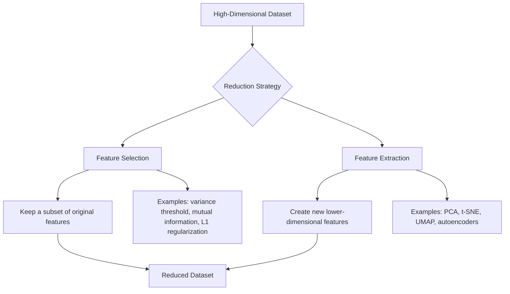
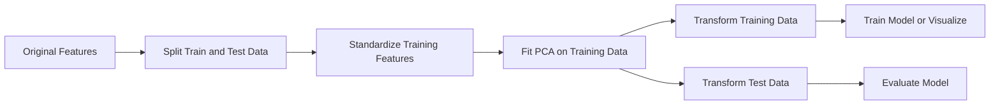
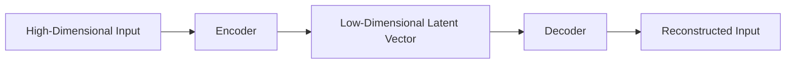
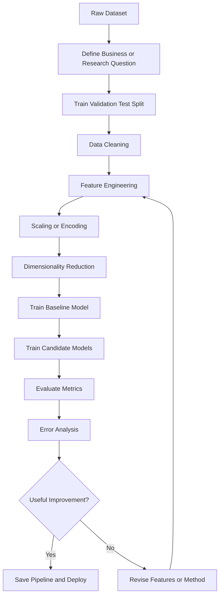
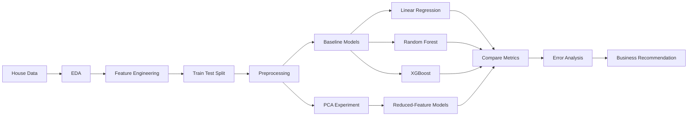

# 012 - Dimensionality Reduction

**Course:** 03 - Machine Learning and Deep Learning
**Module:** Module 06 - Machine Learning
**Content Group:** Unsupervised Learning
**Roadmap Source:** Machine Learning / Unsupervised Learning
**Lesson Type:** Machine Learning
**Order in Module:** 012
**Suggested Duration:** 26 minutes

---

## 1. Overview

**Dimensionality Reduction** is the process of reducing the number of input variables, or features, in a dataset while preserving as much useful information as possible.

A dataset may contain hundreds or thousands of features. However, many of these features may be:

* Redundant
* Highly correlated
* Noisy
* Irrelevant to the target problem
* Difficult to visualize
* Expensive to store or process

Dimensionality reduction transforms the original high-dimensional data into a smaller representation.

```text
Original data:

X = [x1, x2, x3, ..., xd]

Reduced data:

Z = [z1, z2, z3, ..., zk]

where:

k < d
```

The objective is to keep the most important structure of the data while reducing computational cost and complexity.

Dimensionality reduction is commonly used for:

* Data visualization
* Noise reduction
* Feature compression
* Faster model training
* Reducing multicollinearity
* Improving clustering performance
* Preparing embeddings for analysis
* Exploring high-dimensional datasets

---

## 2. Learning Objectives

After completing this lesson, you should be able to:

* Explain dimensionality reduction in your own words.
* Distinguish between feature selection and feature extraction.
* Explain why high-dimensional data can be difficult to model.
* Understand the basic ideas behind PCA, t-SNE, UMAP, and autoencoders.
* Apply dimensionality reduction to a real dataset.
* Select an appropriate dimensionality reduction method.
* Compare model performance before and after dimensionality reduction.
* Avoid data leakage when using dimensionality reduction.
* Create a visualization or notebook artifact for a portfolio.

---

## 3. Why Dimensionality Reduction Is Needed

### 3.1 High-Dimensional Data

A dataset is considered high-dimensional when it contains a large number of features relative to the number of observations.

Examples include:

| Dataset                   |                 Possible Dimensions |
| ------------------------- | ----------------------------------: |
| Customer transaction data |                Hundreds of features |
| Text TF-IDF vectors       |               Thousands of features |
| Image pixels              |   Thousands or millions of features |
| Gene expression data      |       Tens of thousands of features |
| Neural network embeddings | Hundreds or thousands of dimensions |
| Sensor data               |            Hundreds of measurements |

For example, a grayscale image with a resolution of `100 x 100` contains:

```text
100 x 100 = 10,000 features
```

Each pixel can be treated as one feature.

---

### 3.2 The Curse of Dimensionality

As the number of dimensions increases, the data space grows rapidly.

This creates several problems:

* Data points become sparse.
* Distance measurements become less meaningful.
* Models require more training data.
* Computation becomes more expensive.
* Overfitting becomes more likely.
* Visualization becomes difficult.
* Nearest-neighbor algorithms become less reliable.

For example, suppose each feature is divided into 10 intervals.

```text
1 dimension  -> 10 regions
2 dimensions -> 100 regions
3 dimensions -> 1,000 regions
10 dimensions -> 10,000,000,000 regions
```

The number of possible regions increases exponentially.

This phenomenon is known as the **curse of dimensionality**.

---

### 3.3 Redundant and Correlated Features

Some features may carry almost the same information.

Example:

```text
temperature_celsius
temperature_fahrenheit
```

These two features are perfectly correlated because one can be calculated from the other.

Another example:

```text
annual_income
monthly_income
```

Keeping both may not add much new information.

Dimensionality reduction can combine correlated features into a smaller set of informative components.

---

### 3.4 Noise Reduction

Some features may mostly contain random variation rather than useful signals.

Removing or compressing these features can:

* Improve generalization
* Reduce overfitting
* Stabilize model training
* Improve clustering structure
* Reduce storage requirements

However, excessive reduction may remove useful information.

---

## 4. Two Main Approaches

Dimensionality reduction can be divided into two main categories:

1. **Feature Selection**
2. **Feature Extraction**



---

## 5. Feature Selection

Feature selection keeps some original features and removes the others.

Suppose the original dataset contains:

```text
[age, income, height, weight, city, device, clicks]
```

A feature-selection method may retain:

```text
[age, income, device, clicks]
```

The retained features preserve their original meaning.

### Common Feature-Selection Methods

#### Filter Methods

Filter methods select features using statistical properties before model training.

Examples:

* Variance threshold
* Correlation analysis
* Chi-square test
* ANOVA
* Mutual information

#### Wrapper Methods

Wrapper methods evaluate subsets of features using a predictive model.

Examples:

* Forward selection
* Backward elimination
* Recursive Feature Elimination, or RFE

#### Embedded Methods

Embedded methods perform feature selection during model training.

Examples:

* Lasso regression
* L1-regularized logistic regression
* Decision-tree feature importance
* Random Forest feature importance

### Advantages

* Original feature meanings are preserved.
* Results are usually easier to explain.
* Useful for business and scientific interpretation.
* Can reduce training time.

### Limitations

* May discard features that are weak individually but valuable together.
* Feature selection does not create new representations.
* Statistical filters may not capture nonlinear relationships.

---

## 6. Feature Extraction

Feature extraction creates new features from combinations of the original variables.

For example:

```text
Original features:

x1 = mathematics score
x2 = physics score
x3 = programming score

Extracted feature:

z1 = overall technical ability
```

The new feature may summarize information from several original variables.

Common feature-extraction techniques include:

* Principal Component Analysis, or PCA
* Singular Value Decomposition, or SVD
* Linear Discriminant Analysis, or LDA
* t-Distributed Stochastic Neighbor Embedding, or t-SNE
* Uniform Manifold Approximation and Projection, or UMAP
* Autoencoders

---

## 7. Principal Component Analysis

**Principal Component Analysis**, or **PCA**, is one of the most widely used dimensionality reduction algorithms.

PCA creates new features called **principal components**.

Each principal component is a linear combination of the original features.

```text
PC1 = w11*x1 + w12*x2 + ... + w1d*xd

PC2 = w21*x1 + w22*x2 + ... + w2d*xd
```

Where:

* `x1, x2, ..., xd` are the original features.
* `w` values are learned component weights.
* `PC1` captures the largest possible variance.
* `PC2` captures the next-largest variance.
* Each principal component is orthogonal to the previous components.

### PCA Intuition

Imagine a two-dimensional dataset whose observations form a diagonal cloud.

Instead of describing each point using horizontal and vertical coordinates, PCA rotates the coordinate system to align it with the main direction of the data.

```text
Original axes:

x2
|
|       *  *
|    *  *
|  * *
| *
+---------------- x1

PCA axes:

PC2
  /
 /
/____________ PC1
```

The first principal component follows the direction where the data varies the most.

If most information lies along that direction, the second dimension may be removed with limited information loss.

---

### PCA Workflow



---

### Explained Variance

PCA orders components by the amount of variance they explain.

Example:

| Component | Explained Variance | Cumulative Variance |
| --------- | -----------------: | ------------------: |
| PC1       |                48% |                 48% |
| PC2       |                27% |                 75% |
| PC3       |                15% |                 90% |
| PC4       |                 7% |                 97% |
| PC5       |                 3% |                100% |

Keeping the first three components preserves approximately 90% of the total variance.

A common selection rule is:

```text
Choose the smallest number of components whose cumulative
explained variance reaches a chosen threshold.

Common thresholds:

90%
95%
99%
```

The correct threshold depends on the application.

---

## 8. t-SNE

**t-Distributed Stochastic Neighbor Embedding**, or **t-SNE**, is a nonlinear dimensionality reduction method commonly used for visualization.

It is especially useful for reducing data to:

* Two dimensions
* Three dimensions

t-SNE attempts to keep nearby observations close together in the reduced space.

It is commonly used to visualize:

* Image embeddings
* Text embeddings
* Biological data
* Customer segments
* Neural network representations

### Strengths

* Often reveals local clusters.
* Works well for nonlinear structures.
* Produces useful two-dimensional visualizations.
* Can reveal groups that PCA does not clearly separate.

### Limitations

* Computationally expensive on large datasets.
* Results depend on hyperparameters.
* Results may change between runs.
* Distances between far-away clusters may not be meaningful.
* Cluster sizes in the plot may be misleading.
* It is generally not the first choice for production feature transformation.
* It does not naturally transform new observations unless a compatible implementation is used.

### Important Hyperparameters

* `perplexity`
* `learning_rate`
* `max_iter`
* `random_state`

The perplexity parameter can be interpreted as an approximate neighborhood size.

Common values include:

```text
5 to 50
```

Different perplexity values should be tested before interpreting a visualization.

---

## 9. UMAP

**Uniform Manifold Approximation and Projection**, or **UMAP**, is another nonlinear dimensionality reduction method.

UMAP attempts to preserve both local structure and some global structure.

It is frequently used for:

* Embedding visualization
* Clustering preparation
* Image analysis
* Text analysis
* Single-cell biological data
* High-dimensional feature exploration

### Strengths

* Often faster than t-SNE.
* Scales better to large datasets.
* Can preserve more global structure.
* Can transform new observations after fitting.
* Can reduce data to more than two dimensions.

### Limitations

* Results depend on hyperparameters.
* Different random seeds may produce different layouts.
* Visual distances should still be interpreted carefully.
* It is not always available in the default Scikit-learn installation.

### Important Hyperparameters

* `n_neighbors`
* `min_dist`
* `n_components`
* `metric`
* `random_state`

Interpretation:

```text
Small n_neighbors:
Focuses more on local patterns.

Large n_neighbors:
Preserves broader structure.

Small min_dist:
Produces tighter clusters.

Large min_dist:
Produces more distributed representations.
```

---

## 10. Autoencoders

An **autoencoder** is a neural network trained to reconstruct its input.

It contains two main parts:

1. Encoder
2. Decoder



The encoder compresses the input into a lower-dimensional latent representation.

The decoder attempts to reconstruct the original input from that representation.

```text
Input x
   |
   v
Encoder
   |
   v
Latent representation z
   |
   v
Decoder
   |
   v
Reconstruction x_hat
```

The training objective is to minimize reconstruction error.

```text
Reconstruction error = difference between x and x_hat
```

For example, Mean Squared Error can be used:

```text
MSE = average of (x - x_hat)^2
```

### Strengths

* Can learn nonlinear representations.
* Useful for images, audio, and complex data.
* Can be customized for specific domains.
* Can be used for denoising and anomaly detection.

### Limitations

* Requires more data than PCA.
* Requires neural-network training.
* Sensitive to architecture and hyperparameters.
* Latent features may be difficult to interpret.
* May overfit without regularization.

---

## 11. Comparison of Common Methods

| Method                | Type                  |  Linear | Preserves Original Features | Main Use                     |
| --------------------- | --------------------- | ------: | --------------------------: | ---------------------------- |
| Variance Threshold    | Feature selection     |     Yes |                         Yes | Remove low-variance features |
| Correlation Filtering | Feature selection     |     Yes |                         Yes | Remove redundant features    |
| L1 Regularization     | Feature selection     | Usually |                         Yes | Predictive modeling          |
| PCA                   | Feature extraction    |     Yes |                          No | Compression and modeling     |
| Truncated SVD         | Feature extraction    |     Yes |                          No | Sparse text matrices         |
| LDA                   | Supervised extraction |     Yes |                          No | Class separation             |
| t-SNE                 | Feature extraction    |      No |                          No | Visualization                |
| UMAP                  | Feature extraction    |      No |                          No | Visualization and embeddings |
| Autoencoder           | Feature extraction    |      No |                          No | Complex nonlinear data       |

---

## 12. PCA, t-SNE, or UMAP?

Use **PCA** when:

* You need a fast baseline.
* Features are numeric.
* You want deterministic components.
* You need to transform new data.
* You want to reduce multicollinearity.
* You want to preserve global variance.
* You plan to use the reduced features in a model.

Use **t-SNE** when:

* The main objective is two-dimensional visualization.
* You want to inspect local groups.
* The dataset is not extremely large.
* You do not need to transform future observations.

Use **UMAP** when:

* You need visualization for a larger dataset.
* You want better scalability than t-SNE.
* You want to transform new observations.
* You want a nonlinear representation.
* You want to preserve local and partial global structure.

Use an **autoencoder** when:

* The data is highly nonlinear.
* You have a large dataset.
* The input contains images, audio, or complex signals.
* A neural representation is appropriate.
* You need a domain-specific compression model.

---

## 13. End-to-End Machine Learning Workflow

Dimensionality reduction should be treated as part of the machine learning pipeline.



A suitable experimental design is:

```text
Experiment A:
Original features -> Model -> Validation metric

Experiment B:
Reduced features -> Same model -> Validation metric

Compare:
- Predictive performance
- Training time
- Inference time
- Memory usage
- Interpretability
```

A reduced representation is useful only when it provides a meaningful benefit.

---

## 14. Practical Example with the Iris Dataset

The Iris dataset contains four numeric features:

* Sepal length
* Sepal width
* Petal length
* Petal width

PCA can reduce these four features to two principal components for visualization.

```python
from sklearn.datasets import load_iris
from sklearn.decomposition import PCA
from sklearn.preprocessing import StandardScaler
import matplotlib.pyplot as plt

# Load the dataset
iris = load_iris()
X = iris.data
y = iris.target

# Standardize the features
scaler = StandardScaler()
X_scaled = scaler.fit_transform(X)

# Reduce four dimensions to two dimensions
pca = PCA(n_components=2)
X_reduced = pca.fit_transform(X_scaled)

print("Original shape:", X.shape)
print("Reduced shape:", X_reduced.shape)
print("Explained variance ratio:", pca.explained_variance_ratio_)
print(
    "Total explained variance:",
    pca.explained_variance_ratio_.sum()
)

# Visualize the reduced data
plt.figure(figsize=(8, 6))
scatter = plt.scatter(
    X_reduced[:, 0],
    X_reduced[:, 1],
    c=y
)

plt.xlabel("Principal Component 1")
plt.ylabel("Principal Component 2")
plt.title("Iris Dataset after PCA")
plt.legend(
    handles=scatter.legend_elements()[0],
    labels=iris.target_names
)
plt.show()
```

Example output:

```text
Original shape: (150, 4)
Reduced shape: (150, 2)
```

The four original features are converted into two new principal components.

---

## 15. Selecting Components by Explained Variance

Instead of manually selecting the number of components, PCA can preserve a specified percentage of variance.

```python
from sklearn.decomposition import PCA

# Keep enough components to preserve 95% of the variance
pca = PCA(n_components=0.95)

X_train_reduced = pca.fit_transform(X_train)
X_test_reduced = pca.transform(X_test)

print("Selected components:", pca.n_components_)
print(
    "Preserved variance:",
    pca.explained_variance_ratio_.sum()
)
```

This approach is often more meaningful than selecting an arbitrary number of components.

---

## 16. Correct Pipeline to Prevent Data Leakage

Dimensionality reduction must be fitted only on the training data.

### Incorrect Approach

```python
# Incorrect: PCA sees information from the full dataset
X_reduced = pca.fit_transform(X)

X_train, X_test, y_train, y_test = train_test_split(
    X_reduced,
    y
)
```

This allows information from the test set to influence the PCA components.

### Correct Approach

```python
from sklearn.model_selection import train_test_split
from sklearn.preprocessing import StandardScaler
from sklearn.decomposition import PCA

X_train, X_test, y_train, y_test = train_test_split(
    X,
    y,
    test_size=0.2,
    random_state=42,
    stratify=y
)

scaler = StandardScaler()
X_train_scaled = scaler.fit_transform(X_train)
X_test_scaled = scaler.transform(X_test)

pca = PCA(n_components=0.95)
X_train_reduced = pca.fit_transform(X_train_scaled)
X_test_reduced = pca.transform(X_test_scaled)
```

Correct sequence:

```text
1. Split the data.
2. Fit the scaler on the training data.
3. Transform the training and test data.
4. Fit PCA on the transformed training data.
5. Apply PCA to the training and test data.
```

---

## 17. Using a Scikit-learn Pipeline

A pipeline combines preprocessing, dimensionality reduction, and modeling.

```python
from sklearn.datasets import load_breast_cancer
from sklearn.decomposition import PCA
from sklearn.linear_model import LogisticRegression
from sklearn.model_selection import train_test_split
from sklearn.pipeline import Pipeline
from sklearn.preprocessing import StandardScaler
from sklearn.metrics import accuracy_score, classification_report

data = load_breast_cancer()
X = data.data
y = data.target

X_train, X_test, y_train, y_test = train_test_split(
    X,
    y,
    test_size=0.2,
    random_state=42,
    stratify=y
)

pipeline = Pipeline(
    steps=[
        ("scaler", StandardScaler()),
        ("pca", PCA(n_components=0.95)),
        (
            "model",
            LogisticRegression(
                max_iter=2000,
                random_state=42
            )
        )
    ]
)

pipeline.fit(X_train, y_train)

y_pred = pipeline.predict(X_test)

print("Accuracy:", accuracy_score(y_test, y_pred))
print(classification_report(y_test, y_pred))
print(
    "Number of retained components:",
    pipeline.named_steps["pca"].n_components_
)
```

Benefits of using a pipeline:

* Reduces data-leakage risk.
* Keeps preprocessing consistent.
* Simplifies cross-validation.
* Makes deployment easier.
* Allows the entire workflow to be saved as one object.

---

## 18. Baseline Comparison

A dimensionality reduction experiment should include a baseline without reduction.

```python
from time import perf_counter

from sklearn.datasets import load_breast_cancer
from sklearn.decomposition import PCA
from sklearn.linear_model import LogisticRegression
from sklearn.metrics import accuracy_score
from sklearn.model_selection import train_test_split
from sklearn.pipeline import Pipeline
from sklearn.preprocessing import StandardScaler

data = load_breast_cancer()
X = data.data
y = data.target

X_train, X_test, y_train, y_test = train_test_split(
    X,
    y,
    test_size=0.2,
    random_state=42,
    stratify=y
)

baseline = Pipeline(
    steps=[
        ("scaler", StandardScaler()),
        (
            "model",
            LogisticRegression(
                max_iter=2000,
                random_state=42
            )
        )
    ]
)

reduced_model = Pipeline(
    steps=[
        ("scaler", StandardScaler()),
        ("pca", PCA(n_components=0.95)),
        (
            "model",
            LogisticRegression(
                max_iter=2000,
                random_state=42
            )
        )
    ]
)

start = perf_counter()
baseline.fit(X_train, y_train)
baseline_time = perf_counter() - start

start = perf_counter()
reduced_model.fit(X_train, y_train)
reduced_time = perf_counter() - start

baseline_pred = baseline.predict(X_test)
reduced_pred = reduced_model.predict(X_test)

print(
    "Baseline accuracy:",
    accuracy_score(y_test, baseline_pred)
)

print(
    "PCA accuracy:",
    accuracy_score(y_test, reduced_pred)
)

print("Baseline training time:", baseline_time)
print("PCA training time:", reduced_time)

print(
    "Retained PCA components:",
    reduced_model.named_steps["pca"].n_components_
)
```

A comparison table can be recorded as follows:

| Experiment                   | Features | Accuracy | Training Time | Notes                 |
| ---------------------------- | -------: | -------: | ------------: | --------------------- |
| Logistic Regression baseline |       30 |     0.97 |        0.12 s | Original features     |
| PCA + Logistic Regression    |       10 |     0.96 |        0.08 s | 95% variance retained |

A small loss in accuracy may be acceptable when the reduced model is significantly faster or easier to deploy.

---

## 19. Cross-Validation and Hyperparameter Search

The number of PCA components can be selected using cross-validation.

```python
from sklearn.decomposition import PCA
from sklearn.linear_model import LogisticRegression
from sklearn.model_selection import GridSearchCV
from sklearn.pipeline import Pipeline
from sklearn.preprocessing import StandardScaler

pipeline = Pipeline(
    steps=[
        ("scaler", StandardScaler()),
        ("pca", PCA()),
        (
            "model",
            LogisticRegression(
                max_iter=2000,
                random_state=42
            )
        )
    ]
)

param_grid = {
    "pca__n_components": [2, 5, 10, 15, 20, 0.95],
    "model__C": [0.1, 1.0, 10.0]
}

search = GridSearchCV(
    estimator=pipeline,
    param_grid=param_grid,
    scoring="accuracy",
    cv=5,
    n_jobs=-1
)

search.fit(X_train, y_train)

print("Best parameters:", search.best_params_)
print("Best cross-validation score:", search.best_score_)
```

This approach selects the dimensionality based on model performance rather than variance alone.

---

## 20. Visualization Example with t-SNE

```python
from sklearn.datasets import load_digits
from sklearn.manifold import TSNE
from sklearn.preprocessing import StandardScaler
import matplotlib.pyplot as plt

digits = load_digits()
X = digits.data
y = digits.target

X_scaled = StandardScaler().fit_transform(X)

tsne = TSNE(
    n_components=2,
    perplexity=30,
    learning_rate="auto",
    init="pca",
    max_iter=1000,
    random_state=42
)

X_embedded = tsne.fit_transform(X_scaled)

plt.figure(figsize=(10, 8))
scatter = plt.scatter(
    X_embedded[:, 0],
    X_embedded[:, 1],
    c=y,
    s=12
)

plt.xlabel("t-SNE Dimension 1")
plt.ylabel("t-SNE Dimension 2")
plt.title("Digits Dataset Visualized with t-SNE")
plt.colorbar(scatter, label="Digit Class")
plt.show()
```

The plot may reveal groups corresponding to different handwritten digits.

However, the plot should not automatically be interpreted as proof that the dataset contains perfectly separate clusters.

---

## 21. Sparse Text Data and Truncated SVD

Standard PCA is usually not suitable for large sparse matrices such as TF-IDF text representations because centering the matrix can destroy sparsity.

For sparse text features, use **Truncated SVD**.

```python
from sklearn.decomposition import TruncatedSVD
from sklearn.feature_extraction.text import TfidfVectorizer
from sklearn.pipeline import Pipeline
from sklearn.linear_model import LogisticRegression

text_pipeline = Pipeline(
    steps=[
        (
            "tfidf",
            TfidfVectorizer(
                max_features=20_000,
                stop_words="english"
            )
        ),
        (
            "svd",
            TruncatedSVD(
                n_components=200,
                random_state=42
            )
        ),
        (
            "model",
            LogisticRegression(
                max_iter=2000,
                random_state=42
            )
        )
    ]
)
```

This combination is sometimes called **Latent Semantic Analysis** when applied to text.

---

## 22. Reconstruction Error

When dimensionality reduction is used for compression, reconstruction error can measure how much information was lost.

For PCA:

```text
Original data:
X

Reduced representation:
Z

Reconstructed data:
X_reconstructed

Reconstruction error:
average of (X - X_reconstructed)^2
```

Example:

```python
from sklearn.decomposition import PCA
from sklearn.metrics import mean_squared_error

pca = PCA(n_components=2)

X_reduced = pca.fit_transform(X_scaled)
X_reconstructed = pca.inverse_transform(X_reduced)

error = mean_squared_error(
    X_scaled,
    X_reconstructed
)

print("Reconstruction MSE:", error)
```

A smaller reconstruction error means that the reduced representation retains more information.

However, low reconstruction error does not always guarantee better downstream model performance.

---

## 23. Evaluation Criteria

Dimensionality reduction should be evaluated according to the final objective.

### For Predictive Modeling

Evaluate:

* Accuracy
* Precision
* Recall
* F1-score
* ROC-AUC
* Mean Absolute Error
* Root Mean Squared Error
* Training time
* Inference latency
* Memory usage

### For Clustering

Evaluate:

* Silhouette score
* Davies-Bouldin index
* Calinski-Harabasz score
* Cluster stability
* Domain interpretability

### For Compression

Evaluate:

* Explained variance
* Reconstruction error
* Compression ratio
* Storage size
* Processing speed

### For Visualization

Evaluate:

* Whether local neighborhoods are preserved
* Whether known categories are visible
* Stability across random seeds
* Stability across hyperparameter choices
* Whether conclusions are supported by other analyses

---

## 24. Business Perspective

A technically successful reduction does not automatically create business value.

Suppose a customer dataset has 500 features.

After PCA:

```text
500 original features -> 40 principal components
```

Possible benefits:

* Faster model training
* Lower memory consumption
* Faster batch scoring
* Reduced storage cost
* Better numerical stability

Possible costs:

* Lower interpretability
* More difficult debugging
* Harder regulatory explanation
* Additional preprocessing complexity
* Potential information loss

The final decision should consider:

```text
Business value
+ Predictive performance
+ System performance
+ Interpretability
+ Maintenance cost
+ Deployment complexity
```

---

## 25. Common Mistakes

### 25.1 Applying Reduction Before Splitting the Data

Incorrect:

```text
Full dataset -> fit PCA -> split data
```

Correct:

```text
Split data -> fit PCA on training data -> transform validation/test data
```

Fitting PCA on the entire dataset creates data leakage.

---

### 25.2 Forgetting Feature Scaling

PCA is sensitive to feature scales.

Example:

```text
age: 18 to 80
annual_income: 10,000 to 500,000
```

Without scaling, income may dominate the components because its numeric range is much larger.

Use standardization before PCA when features have different units.

---

### 25.3 Assuming Reduced Dimensions Are Easy to Interpret

A principal component may combine many original variables.

Example:

```text
PC1 =
0.42 * income
+ 0.39 * spending
- 0.31 * debt
+ 0.28 * account_age
```

It may not have a simple business meaning.

Inspect component loadings before assigning interpretations.

---

### 25.4 Using t-SNE as Proof of Natural Clusters

t-SNE can visually create separated groups even when the original data does not contain strong clusters.

Always validate apparent groups using:

* Clustering metrics
* Original-space distances
* Multiple random seeds
* Multiple perplexity values
* Domain knowledge

---

### 25.5 Choosing Components Only by Explained Variance

High explained variance does not guarantee high predictive performance.

A low-variance feature may contain important information about the target.

Compare downstream performance using cross-validation.

---

### 25.6 Reducing Dimensions Without a Baseline

Always compare against a model trained with the original features.

Without a baseline, it is impossible to know whether dimensionality reduction helped.

---

### 25.7 Applying PCA to Encoded Categories Without Care

One-hot encoded categorical variables may have structures that are not ideal for standard PCA.

Depending on the data, consider:

* Feature selection
* Truncated SVD
* Multiple Correspondence Analysis
* Entity embeddings
* Models that directly handle categorical features

---

### 25.8 Fitting the Transformer Again During Inference

A production system must reuse the scaler and reduction model learned during training.

Incorrect:

```text
New request -> fit new scaler -> fit new PCA -> predict
```

Correct:

```text
New request
-> load saved scaler
-> apply saved scaler
-> apply saved PCA
-> load saved model
-> predict
```

---

## 26. Practical Exercise

Use one of the following datasets:

* Iris
* Wine
* Breast Cancer Wisconsin
* Digits
* Fashion-MNIST
* Customer segmentation data
* A text classification dataset

### Task 1: Inspect the Dataset

Record:

* Number of observations
* Number of features
* Feature types
* Missing values
* Feature scales
* Correlation patterns

### Task 2: Build a Baseline

Train a model using the original features.

For classification, possible models include:

* Logistic Regression
* K-Nearest Neighbors
* Random Forest
* Support Vector Machine

Record:

* Validation score
* Test score
* Training time
* Number of features

### Task 3: Apply Dimensionality Reduction

Apply PCA with:

```text
80% explained variance
90% explained variance
95% explained variance
99% explained variance
```

Record the number of retained components for each threshold.

### Task 4: Compare Results

Create a table:

| Method            | Dimensions | Variance Preserved | Validation Score | Test Score | Training Time |
| ----------------- | ---------: | -----------------: | ---------------: | ---------: | ------------: |
| Original features |            |               100% |                  |            |               |
| PCA 80%           |            |                80% |                  |            |               |
| PCA 90%           |            |                90% |                  |            |               |
| PCA 95%           |            |                95% |                  |            |               |
| PCA 99%           |            |                99% |                  |            |               |

### Task 5: Visualize the Data

Reduce the data to two dimensions using:

* PCA
* t-SNE
* UMAP, if available

Compare the visualizations.

### Task 6: Write an Error Analysis

Answer:

* Which classes are difficult to separate?
* Did dimensionality reduction improve or reduce performance?
* Did training become faster?
* How much information was lost?
* Are the new dimensions interpretable?
* Which method would you deploy?
* What experiment should be performed next?

---

## 27. Suggested Notebook Structure

```text
01_problem_definition.ipynb
02_data_inspection.ipynb
03_baseline_model.ipynb
04_pca_experiments.ipynb
05_tsne_umap_visualization.ipynb
06_model_comparison.ipynb
07_error_analysis.ipynb
```

Alternatively, use a single notebook with these sections:

```text
1. Problem Definition
2. Data Loading
3. Exploratory Data Analysis
4. Train-Test Split
5. Baseline Model
6. PCA Experiment
7. t-SNE or UMAP Visualization
8. Model Comparison
9. Error Analysis
10. Business Recommendation
```

---

## 28. Portfolio Artifact

A strong portfolio artifact could be:

### Project Title

**High-Dimensional Customer Segmentation with PCA and UMAP**

### Possible Deliverables

* Data-cleaning notebook
* Explained-variance chart
* PCA component analysis
* PCA versus UMAP visualization
* Clustering experiment
* Cluster profiles
* Business recommendations
* Saved Scikit-learn pipeline
* FastAPI prediction endpoint
* Dockerized application
* README with experiment results

### Example Repository Structure

```text
dimensionality-reduction-project/
|
|-- data/
|   |-- raw/
|   `-- processed/
|
|-- notebooks/
|   |-- 01_eda.ipynb
|   |-- 02_pca.ipynb
|   |-- 03_tsne_umap.ipynb
|   `-- 04_model_comparison.ipynb
|
|-- src/
|   |-- preprocessing.py
|   |-- dimensionality_reduction.py
|   |-- train.py
|   `-- evaluate.py
|
|-- models/
|   `-- pipeline.joblib
|
|-- reports/
|   |-- figures/
|   `-- experiment_report.md
|
|-- tests/
|-- requirements.txt
|-- Dockerfile
`-- README.md
```

---

## 29. Completion Checklist

* [ ] I can explain dimensionality reduction in one or two minutes.
* [ ] I understand the curse of dimensionality.
* [ ] I can distinguish feature selection from feature extraction.
* [ ] I understand the main intuition behind PCA.
* [ ] I know when to use PCA, t-SNE, UMAP, and autoencoders.
* [ ] I can standardize data before applying PCA.
* [ ] I fit preprocessing only on the training data.
* [ ] I can calculate and interpret cumulative explained variance.
* [ ] I compare reduced models against a baseline.
* [ ] I evaluate model performance on validation and test data.
* [ ] I record training time and the number of retained dimensions.
* [ ] I understand that t-SNE plots can be misleading.
* [ ] I have created a notebook, chart, model, API, or portfolio note.
* [ ] I have documented at least one caveat or assumption.
* [ ] I have written the next experiment to perform.

---

## 30. Related Outcome

Train, compare, and evaluate supervised and unsupervised machine learning models using thoughtful feature engineering and appropriate dimensionality reduction techniques.

---

## 31. Related Project

**Mini Project: House Price Prediction**

Possible workflow:



For tree-based models such as Random Forest and XGBoost, PCA may not always improve performance because these models can already handle many nonlinear feature relationships.

The experiment should therefore test rather than assume that dimensionality reduction is beneficial.

---

## 32. Summary

Dimensionality reduction converts high-dimensional data into a smaller representation while attempting to preserve useful information.

The two primary approaches are:

```text
Feature selection:
Keep a subset of original features.

Feature extraction:
Create new features from the original features.
```

Important methods include:

* PCA for linear compression and modeling
* Truncated SVD for sparse matrices
* t-SNE for local two-dimensional visualization
* UMAP for scalable nonlinear visualization
* Autoencoders for neural nonlinear representations

A correct workflow should:

```text
1. Define the problem.
2. Split the data.
3. Fit preprocessing on the training data.
4. Build an original-feature baseline.
5. Apply dimensionality reduction.
6. Train the same model on reduced features.
7. Compare predictive and system metrics.
8. Perform error analysis.
9. Document trade-offs.
10. Save the complete pipeline.
```

Dimensionality reduction is not automatically beneficial. It should be treated as an experiment whose value is measured through predictive performance, computational efficiency, interpretability, deployment requirements, and business impact.

Turn this lesson into a concrete artifact such as a notebook, visualization, experiment report, saved model pipeline, API, Docker service, or portfolio project.

---

# Bài luyện tập

## Mục tiêu


## Đề bài


## Yêu cầu hoàn thành

- [ ] 
- [ ] 
- [ ] 

## Kết quả / lời giải


## Ghi chú
