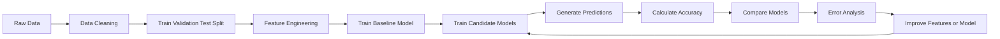
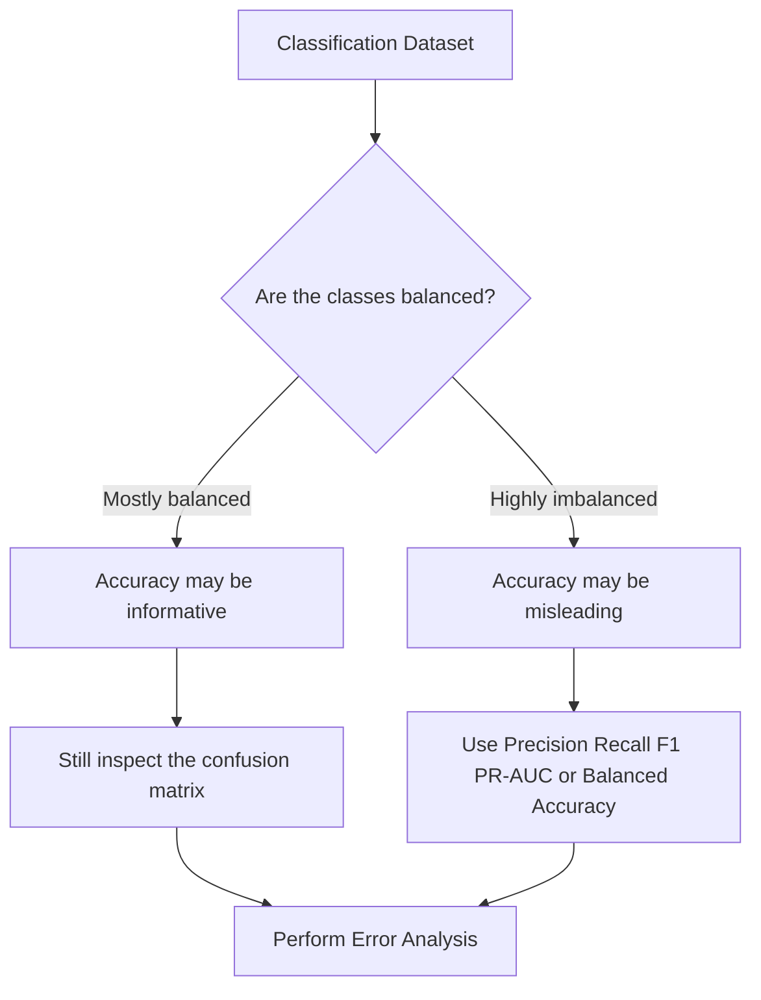
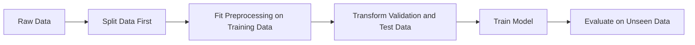
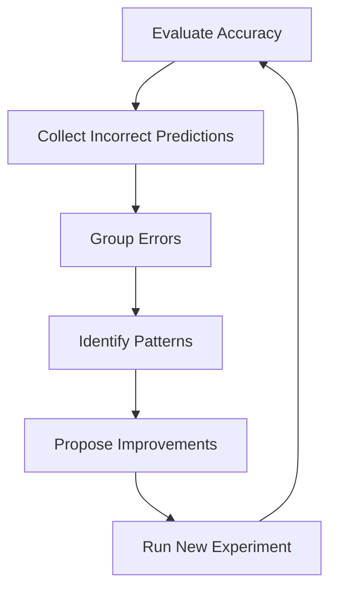
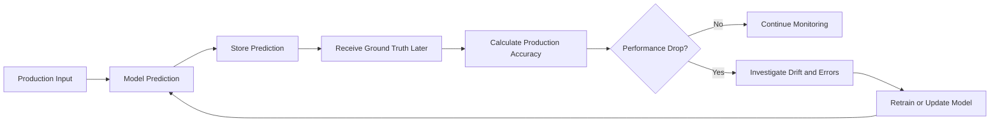

# 014 - Accuracy

**Course:** 03 - Machine Learning and Deep Learning
**Module:** Module 06 - Machine Learning
**Content Group:** Model Evaluation
**Roadmap Source:** Machine Learning / Model Evaluation
**Lesson Type:** Machine Learning
**Order in Module:** 014
**Suggested Duration:** 26 minutes

---

## 1. Summary

This lesson explains **Accuracy** in the context of Machine Learning and Data Science.

Accuracy measures the proportion of predictions that a classification model gets correct.

After completing this lesson, you should understand:

* How accuracy is calculated.
* How accuracy relates to the confusion matrix.
* When accuracy is an appropriate evaluation metric.
* Why accuracy can be misleading for imbalanced datasets.
* How to calculate accuracy using Python and Scikit-learn.
* How to compare model accuracy with a baseline.

---

## 2. Learning Objectives

By the end of this lesson, you should be able to:

* Explain accuracy in your own words.
* Calculate accuracy from model predictions.
* Calculate accuracy from a confusion matrix.
* Interpret the accuracy score of a classification model.
* Compare model accuracy with a baseline.
* Identify cases where accuracy is misleading.
* Use accuracy as part of a broader model-evaluation workflow.
* Create a notebook, chart, experiment, or portfolio artifact related to accuracy.

---

## 3. What Is Accuracy?

**Accuracy** is the fraction of predictions that a classification model predicts correctly.

In simple terms:

```text
Accuracy = Number of correct predictions / Total number of predictions
```

For example, suppose a model makes 100 predictions and 85 of them are correct.

```text
Accuracy = 85 / 100 = 0.85
```

The model has:

```text
Accuracy = 85%
```

Accuracy answers the following question:

> Out of all predictions made by the model, how many were correct?

Accuracy is mainly used for **classification problems**, such as:

* Spam versus non-spam classification.
* Fraud versus non-fraud detection.
* Customer churn prediction.
* Image classification.
* Disease classification.
* Sentiment classification.
* Product-category prediction.

---

## 4. Accuracy Formula

For a general classification problem:

$$
\text{Accuracy} = \frac{\text{Number of Correct Predictions}} {\text{Total Number of Predictions}}
$$

Markdown-safe plain-text version:

```text
Accuracy = Correct Predictions / Total Predictions
```

For binary classification, accuracy can be calculated using the confusion matrix:

$$
\text{Accuracy} = \frac{TP + TN} {TP + TN + FP + FN}
$$

Plain-text version:

```text
Accuracy = (TP + TN) / (TP + TN + FP + FN)
```

Where:

* `TP` = True Positives
* `TN` = True Negatives
* `FP` = False Positives
* `FN` = False Negatives

---

## 5. The Confusion Matrix

A confusion matrix summarizes the predictions made by a binary classification model.

| Actual class    |    Predicted Positive |    Predicted Negative |
| --------------- | --------------------: | --------------------: |
| Actual Positive |  True Positive (`TP`) | False Negative (`FN`) |
| Actual Negative | False Positive (`FP`) |  True Negative (`TN`) |

### 5.1 True Positive

The model predicts the positive class, and the actual class is positive.

Example:

```text
The model predicts that a transaction is fraudulent,
and the transaction is actually fraudulent.
```

### 5.2 True Negative

The model predicts the negative class, and the actual class is negative.

Example:

```text
The model predicts that a transaction is legitimate,
and the transaction is actually legitimate.
```

### 5.3 False Positive

The model predicts the positive class, but the actual class is negative.

This is also called a **Type I error**.

Example:

```text
The model marks a legitimate transaction as fraudulent.
```

### 5.4 False Negative

The model predicts the negative class, but the actual class is positive.

This is also called a **Type II error**.

Example:

```text
The model fails to detect a fraudulent transaction.
```

---

## 6. Accuracy Example

Suppose a model produces the following confusion matrix:

| Actual class    | Predicted Positive | Predicted Negative |
| --------------- | -----------------: | -----------------: |
| Actual Positive |                 40 |                 10 |
| Actual Negative |                  5 |                 45 |

Therefore:

```text
TP = 40
TN = 45
FP = 5
FN = 10
```

The total number of predictions is:

$$
40 + 45 + 5 + 10 = 100
$$

The number of correct predictions is:

$$
TP + TN = 40 + 45 = 85
$$

Therefore:

$$
\text{Accuracy} = \frac{40 + 45} {40 + 45 + 5 + 10} = # \frac{85}{100} 0.85
$$

The model has:

```text
Accuracy = 85%
```

---

## 7. Accuracy in the Machine Learning Workflow

Accuracy is normally calculated after the model has been trained and has generated predictions on validation or test data.



A simplified workflow is:

```text
data
  -> split
  -> features
  -> baseline
  -> model
  -> predictions
  -> accuracy
  -> error analysis
```

Accuracy should normally be evaluated on:

* A validation set during model development.
* A test set for the final unbiased evaluation.
* Production data after deployment.

Accuracy calculated only on the training set is usually not enough.

---

## 8. Accuracy for Binary Classification

Binary classification contains two possible classes.

Examples:

```text
Spam / Not Spam
Fraud / Not Fraud
Churn / Not Churn
Positive / Negative
Approved / Rejected
```

Suppose the true labels and predictions are:

```text
Actual:    [1, 0, 1, 1, 0, 0, 1, 0]
Predicted: [1, 0, 1, 0, 0, 1, 1, 0]
```

Compare each prediction:

| Sample | Actual | Predicted | Correct? |
| -----: | -----: | --------: | -------- |
|      1 |      1 |         1 | Yes      |
|      2 |      0 |         0 | Yes      |
|      3 |      1 |         1 | Yes      |
|      4 |      1 |         0 | No       |
|      5 |      0 |         0 | Yes      |
|      6 |      0 |         1 | No       |
|      7 |      1 |         1 | Yes      |
|      8 |      0 |         0 | Yes      |

The model has six correct predictions out of eight:

$$
\text{Accuracy} = \frac{6}{8} = 0.75
$$

```text
Accuracy = 75%
```

---

## 9. Accuracy for Multiclass Classification

Accuracy also works for classification problems with more than two classes.

Examples:

* Classifying images as cats, dogs, birds, or fish.
* Predicting product categories.
* Recognizing handwritten digits from `0` to `9`.
* Classifying customer-support tickets.
* Identifying plant or animal species.

For multiclass classification, accuracy is still:

```text
Accuracy = Correct Predictions / Total Predictions
```

Suppose an image classifier predicts 200 images and correctly classifies 170.

$$
\text{Accuracy} = # \frac{170}{200} 0.85
$$

```text
Accuracy = 85%
```

However, overall accuracy does not show which classes are difficult for the model.

A model may perform well on common classes but poorly on rare classes. Therefore, multiclass accuracy should often be used together with:

* A confusion matrix.
* Per-class precision.
* Per-class recall.
* Per-class F1-score.
* Macro-averaged metrics.
* Weighted-averaged metrics.

---

## 10. When Accuracy Is Useful

Accuracy is useful when:

* The classes are reasonably balanced.
* Every type of prediction error has a similar cost.
* The class distribution in the evaluation data is representative.
* The evaluation dataset is large enough.
* The target labels are reliable.
* The test set is separate from the training set.

Example:

Suppose an image dataset contains approximately the same number of images for each class:

```text
Cat: 1,000 images
Dog: 1,000 images
Bird: 1,000 images
Fish: 1,000 images
```

In this situation, accuracy can provide a useful overall summary of model performance.

---

## 11. When Accuracy Is Misleading

Accuracy can be misleading when the dataset is **imbalanced**.

An imbalanced dataset contains many samples from one class and only a small number from another class.

Consider a fraud-detection dataset:

```text
Legitimate transactions: 9,900
Fraudulent transactions:   100
Total transactions:      10,000
```

A model predicts every transaction as legitimate.

The model correctly predicts all 9,900 legitimate transactions but fails to detect every fraudulent transaction.

Its accuracy is:

$$
\text{Accuracy} = # \frac{9900}{10000} 0.99
$$

```text
Accuracy = 99%
```

The score appears excellent, but the model detects:

```text
0 out of 100 fraudulent transactions
```

The model is therefore useless for the main business objective.

### Important lesson

> High accuracy does not automatically mean that a model is useful.

For imbalanced classification, consider additional metrics such as:

* Precision.
* Recall.
* F1-score.
* Specificity.
* Balanced accuracy.
* ROC-AUC.
* PR-AUC.
* Per-class metrics.
* Cost-based metrics.

---

## 12. Accuracy and the Majority-Class Baseline

A model should be compared with a simple baseline.

For classification, a common baseline predicts the most frequent class for every sample.

Suppose the training data contains:

```text
Class A: 80%
Class B: 20%
```

A majority-class baseline predicts `Class A` for every input.

Its expected accuracy is approximately:

```text
Baseline accuracy = 80%
```

Suppose a machine learning model achieves:

```text
Model accuracy = 82%
```

Although `82%` may look high, the improvement over the baseline is only:

```text
82% - 80% = 2 percentage points
```

This may or may not be meaningful.

A useful model comparison should include:

| Model                   | Validation Accuracy | Test Accuracy |
| ----------------------- | ------------------: | ------------: |
| Majority-class baseline |                0.80 |          0.80 |
| Logistic Regression     |                0.84 |          0.83 |
| Random Forest           |                0.89 |          0.87 |
| XGBoost                 |                0.91 |          0.88 |

This table suggests that XGBoost has the highest validation accuracy, but its test accuracy is close to the Random Forest result.

Additional factors should also be considered:

* Model complexity.
* Training time.
* Inference time.
* Interpretability.
* Memory usage.
* Stability.
* Business value.

---

## 13. Accuracy and Class Imbalance

The effect of class imbalance can be illustrated with the following diagram:



Accuracy should not be selected automatically.

The evaluation metric must match:

* The class distribution.
* The business objective.
* The cost of false positives.
* The cost of false negatives.
* The model’s deployment environment.

---

## 14. Accuracy Versus Error Rate

The **error rate** is the proportion of predictions that are incorrect.

$$
\text{Error Rate} = \frac{\text{Incorrect Predictions}} {\text{Total Predictions}}
$$

Accuracy and error rate are related:

$$
\text{Error Rate} = 1 - \text{Accuracy}
$$

$$
\text{Accuracy} = 1 - \text{Error Rate}
$$

For example, when:

```text
Accuracy = 0.85
```

Then:

```text
Error Rate = 1 - 0.85 = 0.15
```

Therefore:

```text
Accuracy = 85%
Error Rate = 15%
```

---

## 15. Accuracy Versus Precision and Recall

Accuracy measures overall correctness, while precision and recall focus on the positive class.

### Accuracy

```text
Of all predictions, how many were correct?
```

### Precision

```text
Of all predicted positive samples, how many were actually positive?
```

$$
\text{Precision} = \frac{TP} {TP + FP}
$$

### Recall

```text
Of all actual positive samples, how many did the model detect?
```

$$
\text{Recall} = \frac{TP} {TP + FN}
$$

### Comparison

| Metric    | Main question                                 |
| --------- | --------------------------------------------- |
| Accuracy  | How often is the model correct overall?       |
| Precision | How reliable are positive predictions?        |
| Recall    | How many actual positive cases were detected? |
| F1-score  | How balanced are precision and recall?        |

The correct metric depends on the problem.

For example:

* In spam filtering, excessive false positives may be costly because legitimate email may be blocked.
* In disease detection, false negatives may be especially dangerous.
* In fraud detection, missing fraud may be much more expensive than reviewing legitimate transactions.

---

## 16. Balanced Accuracy

Balanced accuracy is useful when the classes are imbalanced.

For binary classification:

$$
\text{Balanced Accuracy} = \frac{\text{Sensitivity} + \text{Specificity}}{2}
$$

Where:

$$
\text{Sensitivity} = \frac{TP}{TP + FN}
$$

and:

$$
\text{Specificity} = \frac{TN}{TN + FP}
$$

Plain-text version:

```text
Balanced Accuracy = (Sensitivity + Specificity) / 2
```

Unlike standard accuracy, balanced accuracy gives equal importance to the positive and negative classes.

For multiclass classification, balanced accuracy is commonly calculated as the average recall across all classes.

---

## 17. Top-K Accuracy

In some multiclass problems, the model produces a ranked list of predicted classes.

**Top-1 accuracy** checks whether the class with the highest predicted probability is correct.

**Top-K accuracy** checks whether the correct class appears within the model’s top `K` predictions.

For example, an image model predicts:

```text
1. Tiger: 42%
2. Leopard: 31%
3. Jaguar: 16%
4. Lion: 7%
5. Cat: 4%
```

If the true class is `Leopard`:

```text
Top-1 prediction: Incorrect
Top-3 prediction: Correct
```

Top-K accuracy is useful when:

* There are many possible classes.
* Several classes look similar.
* A recommendation system presents multiple options.
* A human reviews the model’s top suggestions.

---

## 18. Python Example: Manual Accuracy Calculation

```python
from typing import Sequence


def calculate_accuracy(
    y_true: Sequence[int],
    y_pred: Sequence[int],
) -> float:
    """Calculate classification accuracy.

    Args:
        y_true: Ground-truth labels.
        y_pred: Predicted labels.

    Returns:
        Accuracy as a floating-point value between 0 and 1.

    Raises:
        ValueError: If the inputs have different lengths or are empty.
    """
    if len(y_true) != len(y_pred):
        raise ValueError("y_true and y_pred must have the same length.")

    if len(y_true) == 0:
        raise ValueError("The input sequences must not be empty.")

    correct_predictions = sum(
        actual == predicted
        for actual, predicted in zip(y_true, y_pred)
    )

    return correct_predictions / len(y_true)


y_true = [1, 0, 1, 1, 0, 0, 1, 0]
y_pred = [1, 0, 1, 0, 0, 1, 1, 0]

accuracy = calculate_accuracy(y_true, y_pred)

print(f"Accuracy: {accuracy:.2f}")
print(f"Accuracy percentage: {accuracy:.2%}")
```

Expected output:

```text
Accuracy: 0.75
Accuracy percentage: 75.00%
```

---

## 19. Python Example with Scikit-learn

```python
from sklearn.metrics import accuracy_score, confusion_matrix

y_true = [1, 0, 1, 1, 0, 0, 1, 0]
y_pred = [1, 0, 1, 0, 0, 1, 1, 0]

accuracy = accuracy_score(y_true, y_pred)
matrix = confusion_matrix(y_true, y_pred)

print(f"Accuracy: {accuracy:.2%}")
print("Confusion matrix:")
print(matrix)
```

Expected output:

```text
Accuracy: 75.00%

Confusion matrix:
[[3 1]
 [1 3]]
```

The Scikit-learn confusion matrix is arranged as:

```text
[[TN, FP],
 [FN, TP]]
```

Therefore:

```text
TN = 3
FP = 1
FN = 1
TP = 3
```

The accuracy is:

```text
Accuracy = (TP + TN) / Total
Accuracy = (3 + 3) / 8
Accuracy = 0.75
```

---

## 20. Complete Model Evaluation Example

The following example trains a baseline and a Logistic Regression model.

```python
from sklearn.datasets import load_breast_cancer
from sklearn.dummy import DummyClassifier
from sklearn.linear_model import LogisticRegression
from sklearn.metrics import (
    accuracy_score,
    classification_report,
    confusion_matrix,
)
from sklearn.model_selection import train_test_split
from sklearn.pipeline import Pipeline
from sklearn.preprocessing import StandardScaler


# Load a classification dataset.
dataset = load_breast_cancer()

X = dataset.data
y = dataset.target

# Create separate training and test sets.
X_train, X_test, y_train, y_test = train_test_split(
    X,
    y,
    test_size=0.2,
    random_state=42,
    stratify=y,
)

# Create a majority-class baseline.
baseline_model = DummyClassifier(strategy="most_frequent")
baseline_model.fit(X_train, y_train)

baseline_predictions = baseline_model.predict(X_test)
baseline_accuracy = accuracy_score(y_test, baseline_predictions)

# Create a machine learning pipeline.
model = Pipeline(
    steps=[
        ("scaler", StandardScaler()),
        (
            "classifier",
            LogisticRegression(
                max_iter=1_000,
                random_state=42,
            ),
        ),
    ]
)

model.fit(X_train, y_train)

predictions = model.predict(X_test)
model_accuracy = accuracy_score(y_test, predictions)

print(f"Baseline accuracy: {baseline_accuracy:.2%}")
print(f"Model accuracy: {model_accuracy:.2%}")

print("\nConfusion matrix:")
print(confusion_matrix(y_test, predictions))

print("\nClassification report:")
print(classification_report(y_test, predictions))
```

This example demonstrates several good practices:

* The dataset is divided into training and test sets.
* Stratification preserves the class distribution.
* A baseline is trained.
* Preprocessing is included inside a pipeline.
* Accuracy is calculated on unseen test data.
* The confusion matrix is inspected.
* Precision, recall, and F1-score are also reported.

---

## 21. Comparing Train, Validation, and Test Accuracy

Accuracy should be interpreted across different dataset splits.

| Training Accuracy | Validation Accuracy | Possible interpretation         |
| ----------------: | ------------------: | ------------------------------- |
|               Low |                 Low | Underfitting                    |
|              High |          Much lower | Overfitting                     |
|              High |                High | Potentially good generalization |
|         Very high |   Suspiciously high | Possible data leakage           |
|          Moderate |             Similar | Stable but may need improvement |

Example:

```text
Training accuracy:   99%
Validation accuracy: 82%
Test accuracy:       80%
```

This pattern suggests that the model may be overfitting.

Another example:

```text
Training accuracy:   88%
Validation accuracy: 87%
Test accuracy:       86%
```

This pattern suggests more stable generalization.

Accuracy differences should be investigated rather than interpreted in isolation.

---

## 22. Data Leakage and Accuracy

**Data leakage** occurs when information from outside the training process incorrectly influences the model.

Leakage can produce unrealistically high accuracy.

Common leakage examples include:

* Scaling the full dataset before splitting it.
* Using test data during feature selection.
* Including information created after the predicted event.
* Keeping duplicate records across train and test sets.
* Using the target column indirectly as a feature.
* Splitting time-series data randomly.
* Splitting data by row when multiple rows belong to the same customer.

A safer workflow is:



Use pipelines to reduce leakage risk.

```python
from sklearn.pipeline import Pipeline
from sklearn.preprocessing import StandardScaler
from sklearn.linear_model import LogisticRegression

pipeline = Pipeline(
    steps=[
        ("scaler", StandardScaler()),
        ("model", LogisticRegression(max_iter=1_000)),
    ]
)
```

---

## 23. Accuracy and Threshold Selection

Many binary classification models return probabilities rather than final class labels.

Example:

```text
Probability of positive class = 0.72
```

A threshold converts the probability into a class:

```text
If probability >= 0.50:
    Predict positive
Else:
    Predict negative
```

Changing the threshold can change:

* Accuracy.
* Precision.
* Recall.
* False-positive rate.
* False-negative rate.

The default threshold of `0.50` is not always optimal.

```python
import numpy as np
from sklearn.metrics import accuracy_score

probabilities = np.array([0.91, 0.67, 0.52, 0.48, 0.30, 0.12])
y_true = np.array([1, 1, 0, 1, 0, 0])

for threshold in [0.3, 0.5, 0.7]:
    predictions = (probabilities >= threshold).astype(int)
    accuracy = accuracy_score(y_true, predictions)

    print(
        f"Threshold: {threshold:.1f}, "
        f"Accuracy: {accuracy:.2%}"
    )
```

Threshold selection should be based on business costs, not accuracy alone.

---

## 24. Accuracy Confidence and Uncertainty

An accuracy score is an estimate based on a finite dataset.

Suppose two models achieve:

```text
Model A accuracy: 90.1%
Model B accuracy: 90.4%
```

The difference is only:

```text
0.3 percentage points
```

This small difference may be caused by random variation.

Useful techniques for evaluating uncertainty include:

* Cross-validation.
* Bootstrap confidence intervals.
* Repeated train-test splits.
* Statistical significance tests.
* Evaluation on a larger test set.

A model should not be selected based only on a tiny accuracy difference.

---

## 25. Error Analysis

After calculating accuracy, inspect the incorrect predictions.

Accuracy tells you **how many** predictions are correct, but error analysis helps explain **why** predictions are wrong.

A useful error-analysis table might contain:

| Sample ID | Actual Class | Predicted Class | Confidence | Error Category | Notes                   |
| --------- | ------------ | --------------- | ---------: | -------------- | ----------------------- |
| 102       | Fraud        | Legitimate      |       0.91 | False negative | Unusual payment pattern |
| 227       | Legitimate   | Fraud           |       0.76 | False positive | International purchase  |
| 315       | Fraud        | Legitimate      |       0.84 | False negative | Missing device feature  |

Possible error categories include:

* Missing features.
* Incorrect labels.
* Noisy data.
* Rare class.
* Ambiguous sample.
* Distribution shift.
* Inadequate preprocessing.
* Incorrect decision threshold.
* Model underfitting.
* Model overfitting.

The error-analysis workflow is:



---

## 26. Business Interpretation

A model with high accuracy is not automatically valuable.

Model evaluation should connect technical performance to business impact.

Ask the following questions:

1. What business decision uses this prediction?
2. What is the cost of a false positive?
3. What is the cost of a false negative?
4. Are the classes balanced?
5. How strong is the baseline?
6. Does the model perform well on important user groups?
7. Is the test dataset representative of production?
8. Is the model fast enough for deployment?
9. Is the model stable over time?
10. Does improved accuracy produce measurable business value?

For example:

```text
Model A accuracy: 95%
Model B accuracy: 93%
```

Model B may still be preferable when it:

* Has much higher recall for an important class.
* Runs ten times faster.
* Requires fewer features.
* Is easier to explain.
* Costs less to operate.
* Produces fewer harmful errors.

---

## 27. Deployment Monitoring

Accuracy should also be monitored after deployment when ground-truth labels become available.

Production accuracy may decrease because of:

* Data drift.
* Concept drift.
* New user behavior.
* Changes in class distribution.
* Missing or corrupted features.
* Changes in upstream systems.
* Delayed labels.
* Feedback loops.

A production monitoring workflow may look like this:



Useful monitoring fields include:

```text
timestamp
model_version
prediction
prediction_probability
actual_label
accuracy
data_segment
feature_version
```

---

## 28. Practical Exercise

### Task

Build a classification experiment that compares a baseline with at least one machine learning model.

You may use datasets such as:

* Iris classification.
* Titanic survival.
* Customer churn.
* Breast cancer classification.
* Loan approval.
* Spam detection.
* Handwritten digit classification.

### Requirements

1. Load and inspect the dataset.
2. Identify the target variable.
3. Examine the class distribution.
4. Split the data into training and test sets.
5. Create a majority-class baseline.
6. Train at least one classification model.
7. Calculate training and test accuracy.
8. Create a confusion matrix.
9. Calculate precision, recall, and F1-score.
10. Inspect at least five incorrect predictions.
11. Write a short business interpretation.
12. Propose the next feature or experiment to try.

### Suggested output table

| Model               | Train Accuracy | Validation Accuracy | Test Accuracy | Notes                      |
| ------------------- | -------------: | ------------------: | ------------: | -------------------------- |
| Majority baseline   |              — |                0.62 |          0.61 | Predicts the largest class |
| Logistic Regression |           0.83 |                0.80 |          0.79 | Stable baseline model      |
| Random Forest       |           0.98 |                0.84 |          0.82 | Possible overfitting       |
| XGBoost             |           0.92 |                0.86 |          0.85 | Best test result           |

### Suggested error-analysis questions

* Which class has the most errors?
* Are false positives or false negatives more common?
* Are errors concentrated in a specific group?
* Are some labels potentially incorrect?
* Does the model fail on rare cases?
* Would another feature help separate the classes?
* Would changing the classification threshold improve business value?

---

## 29. Common Mistakes

### 29.1 Evaluating on the Training Set

Training accuracy measures how well the model fits data it has already seen.

It does not reliably measure generalization.

Always evaluate on validation or test data.

---

### 29.2 Ignoring the Baseline

A model with `90%` accuracy may appear strong.

However, when the majority-class baseline has `91%` accuracy, the model is worse than a trivial rule.

---

### 29.3 Using Accuracy for Imbalanced Data

A model may achieve high accuracy by predicting only the majority class.

Inspect:

* Class distribution.
* Confusion matrix.
* Precision.
* Recall.
* F1-score.
* Balanced accuracy.
* PR-AUC.

---

### 29.4 Data Leakage

Leakage can create unrealistically high validation or test accuracy.

Split data before fitting preprocessing steps.

---

### 29.5 Selecting the Most Complex Model

A complex model should not be chosen only because it has slightly higher accuracy.

Compare:

* Generalization.
* Interpretability.
* Speed.
* Cost.
* Stability.
* Deployment requirements.

---

### 29.6 Ignoring Error Costs

False positives and false negatives may have very different business consequences.

Standard accuracy counts both errors equally.

---

### 29.7 Reporting Accuracy Without Context

Do not report only:

```text
The model achieved 92% accuracy.
```

A more informative report is:

```text
The model achieved 92% test accuracy compared with an 80%
majority-class baseline. However, recall for the minority class
was only 61%, indicating that many important positive cases
were still missed.
```

---

### 29.8 Tuning on the Test Set

Repeatedly checking test accuracy during development causes the test set to influence model selection.

Use:

```text
Training set -> model fitting
Validation set -> model and threshold selection
Test set -> final evaluation
```

---

## 30. Accuracy Evaluation Checklist

Before accepting an accuracy result, verify the following:

* [ ] The target is a classification target.
* [ ] The dataset was split before model training.
* [ ] The test data was not used for feature engineering.
* [ ] The class distribution was inspected.
* [ ] A majority-class baseline was calculated.
* [ ] Accuracy was evaluated on unseen data.
* [ ] The confusion matrix was inspected.
* [ ] Precision and recall were also considered.
* [ ] Important false positives were analyzed.
* [ ] Important false negatives were analyzed.
* [ ] Data leakage was checked.
* [ ] The model was compared with simpler models.
* [ ] The metric matches the business objective.
* [ ] Performance uncertainty was considered.
* [ ] The final result was documented.

---

## 31. Completion Checklist

* [ ] I can explain **Accuracy** in one or two minutes.
* [ ] I can write the accuracy formula.
* [ ] I can calculate accuracy from predictions.
* [ ] I can calculate accuracy from a confusion matrix.
* [ ] I understand `TP`, `TN`, `FP`, and `FN`.
* [ ] I can explain when accuracy is useful.
* [ ] I can explain why accuracy may fail on imbalanced data.
* [ ] I can compare a model against a majority-class baseline.
* [ ] I can calculate accuracy using Scikit-learn.
* [ ] I can perform basic error analysis.
* [ ] I have created a notebook, chart, model, API, or practical note for this lesson.
* [ ] I have documented at least one caveat, assumption, or next question.

---

## 32. Related Outcome

This lesson supports the following learning outcome:

> Train, compare, and evaluate supervised and unsupervised Machine Learning models using appropriate metrics, thoughtful feature engineering, reliable experiments, and business-aware interpretation.

Accuracy is especially relevant to supervised classification models.

For unsupervised models, evaluation usually requires different metrics, such as:

* Silhouette score.
* Davies-Bouldin index.
* Inertia.
* Reconstruction error.
* Cluster stability.
* Domain-specific validation.

---

## 33. Related Project

### Mini Project: Classification Model Comparison

Create a classification project that includes:

* Exploratory Data Analysis.
* Data preprocessing.
* Feature engineering.
* Majority-class baseline.
* Logistic Regression.
* Decision Tree.
* Random Forest.
* XGBoost or LightGBM.
* Accuracy comparison.
* Confusion matrices.
* Precision, recall, and F1-score.
* Error analysis.
* Business recommendation.

Possible project structure:

```text
classification-project/
|
|-- data/
|   |-- raw.csv
|   `-- processed.csv
|
|-- notebooks/
|   |-- 01_eda.ipynb
|   |-- 02_feature_engineering.ipynb
|   |-- 03_model_training.ipynb
|   `-- 04_model_evaluation.ipynb
|
|-- src/
|   |-- preprocessing.py
|   |-- train.py
|   `-- evaluate.py
|
|-- models/
|   `-- best_model.joblib
|
|-- reports/
|   |-- confusion_matrix.png
|   |-- model_comparison.csv
|   `-- error_analysis.csv
|
|-- requirements.txt
`-- README.md
```

A useful portfolio artifact could include:

```text
Problem definition
-> Dataset description
-> Class distribution
-> Baseline
-> Model comparison
-> Accuracy and other metrics
-> Confusion matrix
-> Error analysis
-> Business recommendation
-> Deployment considerations
```

---

## 34. Key Takeaways

1. Accuracy measures the proportion of correct predictions.

2. The general formula is:

```text
Accuracy = Correct Predictions / Total Predictions
```

3. For binary classification:

```text
Accuracy = (TP + TN) / (TP + TN + FP + FN)
```

4. Accuracy is most informative when classes are reasonably balanced and error costs are similar.

5. High accuracy can be misleading for imbalanced datasets.

6. Accuracy should be compared with a simple baseline.

7. Accuracy should be evaluated on unseen validation or test data.

8. A confusion matrix and error analysis provide more information than accuracy alone.

9. The correct evaluation metric depends on the business problem.

10. A good model must create practical value, not merely achieve a high score.

---

## 35. Final Summary

**Accuracy** is one of the simplest and most widely used classification metrics. It measures how frequently a model predicts the correct class.

However, accuracy must be interpreted carefully. A high score may hide poor minority-class performance, data leakage, overfitting, or errors with serious business consequences.

A reliable evaluation process should include:

```text
clean data
-> proper split
-> baseline
-> model training
-> unseen predictions
-> accuracy
-> confusion matrix
-> additional metrics
-> error analysis
-> business interpretation
```

Turn this lesson into a practical artifact such as:

* A classification notebook.
* A reusable evaluation function.
* A model-comparison table.
* A confusion-matrix chart.
* An error-analysis report.
* A model-evaluation API.
* A Dockerized prediction service.
* A portfolio case study.

The goal is not only to obtain a high accuracy score. The goal is to build a model that generalizes well, handles important cases correctly, and solves a meaningful real-world problem.
