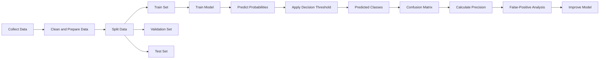
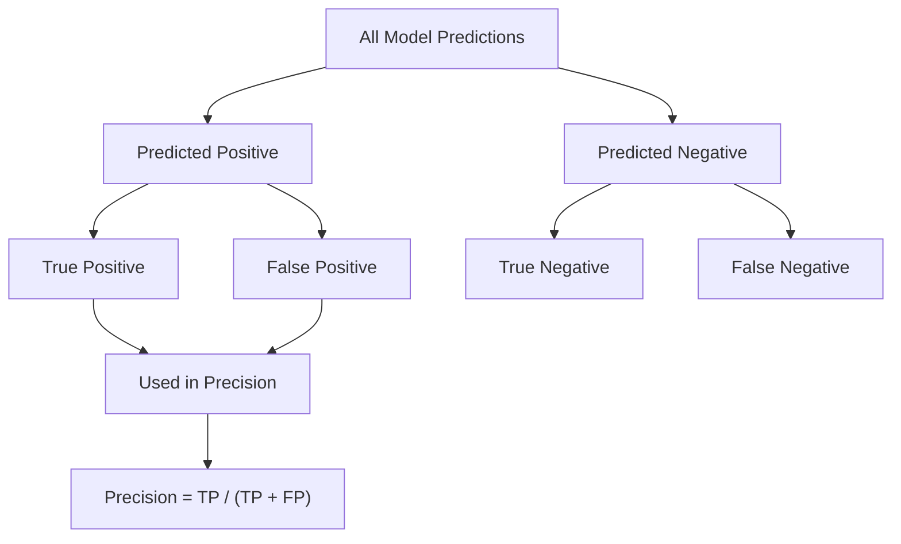
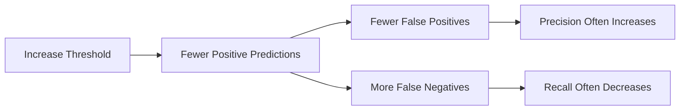
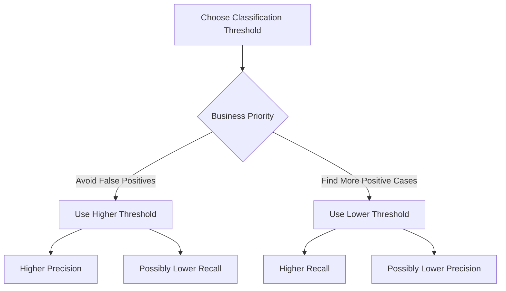
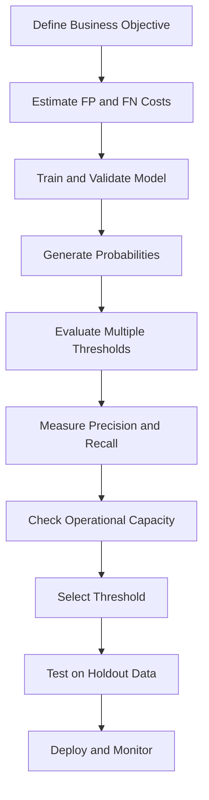
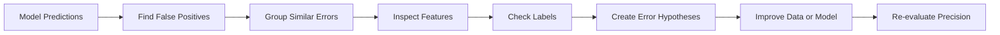
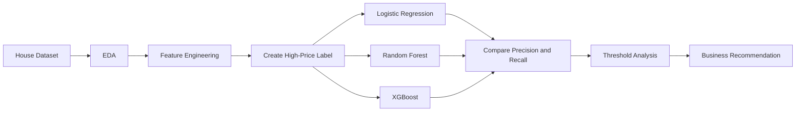

# 015 - Precision

**Course:** 03 - Machine Learning and Deep Learning
**Module:** Module 06 - Machine Learning
**Content Group:** Model Evaluation
**Roadmap Source:** Machine Learning / Model Evaluation
**Lesson Type:** Machine Learning
**Order in Module:** 015
**Suggested Duration:** 26 minutes

---

## 1. Overview

**Precision** is a classification evaluation metric that measures how reliable a model's positive predictions are.

It answers the question:

> Of all the samples predicted as positive, how many were actually positive?

Precision is especially important when **false positives are costly**.

Example applications include:

* Spam detection
* Fraud detection
* Medical screening
* Content moderation
* Product recommendation
* Search engines
* Defect detection
* Intrusion detection

After this lesson, you should understand how precision is calculated, when to use it, how decision thresholds affect it, and why it should usually be analyzed together with recall.

---

## 2. Learning Objectives

By the end of this lesson, you should be able to:

* Explain precision in your own words.
* Calculate precision from a confusion matrix.
* Identify true positives and false positives.
* Explain when precision is more important than recall.
* Understand how the classification threshold affects precision.
* Calculate precision using Python and scikit-learn.
* Compare precision across multiple models.
* Perform basic error analysis on false-positive predictions.
* Connect precision to real business costs.

---

## 3. Precision in the Machine Learning Workflow

Precision is normally calculated after a classification model produces predictions on validation or test data.



Precision should be calculated on data that was not used directly to train the model.

---

## 4. Binary Classification

Precision is most commonly introduced using binary classification.

A binary classifier predicts one of two classes:

* **Positive class**
* **Negative class**

Examples:

| Problem           | Positive Class         | Negative Class         |
| ----------------- | ---------------------- | ---------------------- |
| Spam detection    | Spam                   | Not spam               |
| Fraud detection   | Fraudulent transaction | Legitimate transaction |
| Disease detection | Disease present        | Disease absent         |
| Defect detection  | Defective product      | Normal product         |
| Customer churn    | Customer will churn    | Customer will stay     |

The meaning of the positive class depends on the business problem.

---

## 5. Confusion Matrix

Precision is calculated from a confusion matrix.

| Actual / Predicted  |    Predicted Positive |    Predicted Negative |
| ------------------- | --------------------: | --------------------: |
| **Actual Positive** |  True Positive, or TP | False Negative, or FN |
| **Actual Negative** | False Positive, or FP |  True Negative, or TN |

### 5.1 True Positive

A **True Positive**, or TP, occurs when:

* The model predicts positive.
* The actual class is positive.

Example:

> The model predicts that a transaction is fraudulent, and the transaction is actually fraudulent.

### 5.2 False Positive

A **False Positive**, or FP, occurs when:

* The model predicts positive.
* The actual class is negative.

Example:

> The model predicts that a legitimate transaction is fraudulent.

False positives are the main type of error measured by precision.

### 5.3 False Negative

A **False Negative**, or FN, occurs when:

* The model predicts negative.
* The actual class is positive.

Example:

> A fraudulent transaction is classified as legitimate.

### 5.4 True Negative

A **True Negative**, or TN, occurs when:

* The model predicts negative.
* The actual class is negative.

Example:

> A legitimate transaction is correctly classified as legitimate.

---

## 6. Precision Formula

The precision formula is:

```text
Precision = True Positives / (True Positives + False Positives)
```

Using abbreviations:

```text
Precision = TP / (TP + FP)
```

In mathematical notation:

$$
\text{Precision} =
\frac{\text{TP}}
{\text{TP} + \text{FP}}
$$

The denominator represents **all samples predicted as positive**.

The numerator represents the samples that were **correctly predicted as positive**.

---

## 7. Intuitive Interpretation

Suppose a spam detection model marks 100 emails as spam.

Among those emails:

* 90 are actually spam.
* 10 are legitimate emails.

The precision is:

```text
Precision = 90 / (90 + 10)
          = 90 / 100
          = 0.90
```

Therefore:

```text
Precision = 90%
```

Interpretation:

> When the model predicts that an email is spam, it is correct 90% of the time.

---

## 8. Worked Example

Consider the following confusion matrix:

| Actual / Predicted    | Predicted Fraud | Predicted Legitimate |
| --------------------- | --------------: | -------------------: |
| **Actual Fraud**      |              80 |                   20 |
| **Actual Legitimate** |              40 |                  860 |

From this matrix:

```text
TP = 80
FP = 40
FN = 20
TN = 860
```

Precision is:

```text
Precision = TP / (TP + FP)
          = 80 / (80 + 40)
          = 80 / 120
          = 0.6667
```

Therefore:

```text
Precision = 66.67%
```

Interpretation:

> Of all transactions predicted as fraudulent, approximately 66.67% were actually fraudulent.

The remaining 33.33% of fraud alerts were false alarms.

---

## 9. Precision Focuses on Positive Predictions

Precision only examines predictions classified as positive.



True negatives and false negatives do not appear directly in the precision formula.

---

## 10. When Precision Is Important

Precision is important when false positives create a high cost.

### 10.1 Spam Detection

A false positive means that a legitimate email is moved to the spam folder.

High precision reduces the risk of hiding important emails.

### 10.2 Fraud Investigation

A false positive means that a legitimate transaction is flagged for investigation.

Too many false alerts can:

* Annoy customers.
* Increase investigation costs.
* Overload fraud analysts.
* Delay legitimate payments.

### 10.3 Content Moderation

A false positive means that acceptable content is incorrectly removed.

High precision helps avoid unnecessary censorship.

### 10.4 Product Recommendation

A false positive means recommending an irrelevant product.

Low-precision recommendations may reduce user trust.

### 10.5 Hiring Systems

A false positive may mean selecting an unsuitable candidate for further review.

However, fairness, transparency, and legal requirements must also be considered.

---

## 11. Precision versus Recall

Precision and recall measure different aspects of model performance.

### Precision

> Of all predicted positives, how many were correct?

```text
Precision = TP / (TP + FP)
```

### Recall

> Of all actual positives, how many were found?

```text
Recall = TP / (TP + FN)
```

In mathematical notation:

$$
\text{Recall} =
\frac{\text{TP}}
{\text{TP} + \text{FN}}
$$

### Comparison

| Metric    | Main Question                             | Main Error      |
| --------- | ----------------------------------------- | --------------- |
| Precision | Are positive predictions reliable?        | False positives |
| Recall    | Did the model find most actual positives? | False negatives |

---

## 12. Precision and Recall Example

Suppose there are 100 fraudulent transactions.

A model predicts 50 transactions as fraudulent.

Among these 50 predictions:

* 40 are actual fraud cases.
* 10 are legitimate transactions.

The model misses 60 fraud cases.

Therefore:

```text
TP = 40
FP = 10
FN = 60
```

Precision:

```text
Precision = 40 / (40 + 10)
          = 0.80
```

Recall:

```text
Recall = 40 / (40 + 60)
       = 0.40
```

Interpretation:

* The model has **high precision** because most fraud predictions are correct.
* The model has **low recall** because it detects only 40% of all fraud cases.

A model can have high precision but low recall.

---

## 13. Precision versus Accuracy

Accuracy measures the proportion of all correct predictions.

```text
Accuracy = (TP + TN) / (TP + TN + FP + FN)
```

Precision only measures the reliability of positive predictions.

```text
Precision = TP / (TP + FP)
```

### Example

Suppose a dataset contains:

* 990 legitimate transactions.
* 10 fraudulent transactions.

A model predicts every transaction as legitimate.

The accuracy is:

```text
Accuracy = 990 / 1000
         = 99%
```

However, the model detects no fraud.

Because it makes no positive predictions, its fraud-detection precision is undefined and is often reported as `0` by software libraries when configured to handle zero division.

This demonstrates why accuracy can be misleading for imbalanced datasets.

---

## 14. Precision and the Decision Threshold

Many classification models output probabilities instead of final class labels.

Example:

```text
Probability of fraud = 0.82
```

A decision threshold converts the probability into a class prediction.

```text
If probability >= threshold:
    predict positive
Else:
    predict negative
```

The default threshold is often `0.50`, but it does not always produce the best business result.

### Threshold Effect

Increasing the threshold usually:

* Produces fewer positive predictions.
* Reduces false positives.
* Increases precision.
* May reduce recall.

Decreasing the threshold usually:

* Produces more positive predictions.
* Detects more actual positives.
* Increases recall.
* May reduce precision.



The exact behavior depends on the model and dataset.

---

## 15. Threshold Example

Suppose a model produces the following results:

| Threshold | TP | FP | FN | Precision | Recall |
| --------: | -: | -: | -: | --------: | -----: |
|      0.30 | 90 | 60 | 10 |      0.60 |   0.90 |
|      0.50 | 75 | 25 | 25 |      0.75 |   0.75 |
|      0.70 | 50 |  5 | 50 |      0.91 |   0.50 |
|      0.90 | 20 |  1 | 80 |      0.95 |   0.20 |

At a higher threshold:

* Precision improves.
* Recall decreases.

The best threshold should be selected according to business costs and operational constraints.

---

## 16. Precision-Recall Trade-Off

Precision and recall often move in opposite directions.



There is no universally correct balance.

The appropriate balance depends on questions such as:

* How expensive is a false positive?
* How expensive is a false negative?
* How many alerts can the team review?
* What minimum precision is acceptable?
* What minimum recall is required?
* Are some errors more harmful than others?

---

## 17. Precision in Python

### 17.1 Calculate Precision Manually

```python
true_positive = 80
false_positive = 40

precision = true_positive / (true_positive + false_positive)

print(f"Precision: {precision:.4f}")
```

Output:

```text
Precision: 0.6667
```

### 17.2 Using scikit-learn

```python
from sklearn.metrics import precision_score

y_true = [1, 0, 1, 1, 0, 0, 1, 0]
y_pred = [1, 1, 1, 0, 0, 0, 1, 1]

precision = precision_score(y_true, y_pred)

print(f"Precision: {precision:.4f}")
```

### 17.3 Display the Confusion Matrix

```python
from sklearn.metrics import confusion_matrix

matrix = confusion_matrix(y_true, y_pred)

print(matrix)
```

For binary classification, scikit-learn returns:

```text
[[TN FP]
 [FN TP]]
```

### 17.4 Full Evaluation Report

```python
from sklearn.metrics import classification_report

report = classification_report(y_true, y_pred)

print(report)
```

The report includes:

* Precision
* Recall
* F1-score
* Support

---

## 18. Precision with Predicted Probabilities

```python
import numpy as np
from sklearn.metrics import precision_score

y_true = np.array([1, 0, 1, 1, 0, 0, 1, 0])

y_probability = np.array([
    0.90,
    0.75,
    0.70,
    0.45,
    0.40,
    0.20,
    0.80,
    0.65,
])

threshold = 0.70

y_pred = (y_probability >= threshold).astype(int)

precision = precision_score(y_true, y_pred, zero_division=0)

print("Predictions:", y_pred)
print(f"Precision: {precision:.4f}")
```

This pattern allows you to compare precision at multiple thresholds.

---

## 19. Evaluate Multiple Thresholds

```python
import numpy as np
import pandas as pd
from sklearn.metrics import precision_score, recall_score

thresholds = np.arange(0.10, 1.00, 0.10)

results = []

for threshold in thresholds:
    y_pred = (y_probability >= threshold).astype(int)

    precision = precision_score(
        y_true,
        y_pred,
        zero_division=0,
    )

    recall = recall_score(
        y_true,
        y_pred,
        zero_division=0,
    )

    results.append(
        {
            "threshold": threshold,
            "precision": precision,
            "recall": recall,
            "predicted_positives": int(y_pred.sum()),
        }
    )

results_df = pd.DataFrame(results)

print(results_df)
```

This table can help identify a threshold that satisfies business requirements.

---

## 20. Precision-Recall Curve

A precision-recall curve shows the relationship between precision and recall across different thresholds.

```python
import matplotlib.pyplot as plt
from sklearn.metrics import precision_recall_curve

precision_values, recall_values, thresholds = precision_recall_curve(
    y_true,
    y_probability,
)

plt.figure(figsize=(8, 5))
plt.plot(recall_values, precision_values)
plt.xlabel("Recall")
plt.ylabel("Precision")
plt.title("Precision-Recall Curve")
plt.grid(True)
plt.show()
```

A strong model tends to maintain high precision while increasing recall.

Precision-recall curves are especially useful for imbalanced classification problems.

---

## 21. Precision at K

In recommendation and ranking systems, we may only care about the first `K` results.

**Precision at K**, written as `Precision@K`, measures how many of the top `K` results are relevant.

```text
Precision@K = Relevant items in the top K / K
```

In mathematical notation:

$$
\text{Precision@K} =
\frac{\text{Number of relevant items in the top }K}
{K}
$$

### Example

A recommendation system returns five products:

```text
[Relevant, Relevant, Not Relevant, Relevant, Not Relevant]
```

There are three relevant products in the top five results.

```text
Precision@5 = 3 / 5
            = 0.60
```

Therefore:

```text
Precision@5 = 60%
```

Precision@K is commonly used in:

* Search engines
* Recommendation systems
* Information retrieval
* Document ranking
* Image retrieval

---

## 22. Multiclass Precision

For multiclass classification, precision can be calculated separately for each class.

Suppose a model predicts three classes:

* Cat
* Dog
* Bird

The precision for the `Dog` class is:

```text
Dog Precision =
Correct Dog Predictions /
All Predictions Classified as Dog
```

Different averaging methods combine class-level precision scores.

---

## 23. Macro, Micro, and Weighted Precision

### 23.1 Macro Precision

Macro precision calculates precision for each class and then computes the unweighted average.

```text
Macro Precision =
Sum of Class Precision Scores /
Number of Classes
```

In mathematical notation:

$$
\text{Macro Precision} = \frac{1}{C} \sum_{i=1}^{C} \text{Precision}_i
$$

Use macro precision when every class should have equal importance.

### 23.2 Micro Precision

Micro precision combines the true positives and false positives from all classes before calculating precision.

```text
Micro Precision =
Total TP /
(Total TP + Total FP)
```

Use micro precision when each individual sample should have equal importance.

### 23.3 Weighted Precision

Weighted precision calculates class-level precision and weights each class by its number of actual samples.

```text
Weighted Precision =
Sum of Class Precision × Class Support /
Total Number of Samples
```

Use weighted precision when class imbalance should be reflected in the final metric.

### Comparison

| Averaging Method | Main Characteristic         |
| ---------------- | --------------------------- |
| Macro            | Treats every class equally  |
| Micro            | Treats every sample equally |
| Weighted         | Weights classes by support  |

---

## 24. Multiclass Precision in Python

```python
from sklearn.metrics import precision_score

y_true = [0, 1, 2, 0, 1, 2, 1, 2]
y_pred = [0, 2, 2, 0, 1, 1, 1, 2]

macro_precision = precision_score(
    y_true,
    y_pred,
    average="macro",
    zero_division=0,
)

micro_precision = precision_score(
    y_true,
    y_pred,
    average="micro",
    zero_division=0,
)

weighted_precision = precision_score(
    y_true,
    y_pred,
    average="weighted",
    zero_division=0,
)

print(f"Macro precision: {macro_precision:.4f}")
print(f"Micro precision: {micro_precision:.4f}")
print(f"Weighted precision: {weighted_precision:.4f}")
```

Always report which averaging method was used.

Writing only `precision = 0.84` is incomplete for a multiclass problem.

---

## 25. Precision and Class Imbalance

Precision can change significantly when the positive-class prevalence changes.

Suppose a model is deployed in two environments:

* Environment A has 20% positive cases.
* Environment B has 1% positive cases.

Even when the classifier's underlying behavior remains similar, precision may become lower in Environment B because there are many more negative cases that can become false positives.

Therefore, monitor:

* Class prevalence
* Precision
* Recall
* False-positive rate
* Threshold
* Data distribution

Production precision may differ from offline test precision.

---

## 26. Precision Is Not the Same as Average Precision

The terms **precision** and **average precision** are related but different.

### Precision

Precision is calculated for one set of class predictions, usually at one threshold.

### Average Precision

Average precision summarizes model performance across multiple recall levels.

It is commonly used as a summary score for a precision-recall curve.

```python
from sklearn.metrics import average_precision_score

average_precision = average_precision_score(
    y_true,
    y_probability,
)

print(f"Average precision: {average_precision:.4f}")
```

Do not use the terms interchangeably.

---

## 27. Precision and F1-Score

Precision may be combined with recall using the F1-score.

```text
F1 = 2 × Precision × Recall / (Precision + Recall)
```

In mathematical notation:

$$
F_1 =
2
\cdot
\frac{
\text{Precision} \cdot \text{Recall}
}{
\text{Precision} + \text{Recall}
}
$$

The F1-score is useful when:

* Both false positives and false negatives matter.
* The dataset is imbalanced.
* A single summary metric is needed.

However, F1 treats precision and recall equally. This may not match the actual business costs.

---

## 28. Business-Oriented Threshold Selection

A threshold should not be selected only because it gives the highest precision.

A better process is:



Example requirement:

```text
Select the threshold that produces:

Precision >= 90%
Recall >= 50%
No more than 500 alerts per day
```

This is more useful than maximizing one metric without constraints.

---

## 29. Error Analysis for Precision

To improve precision, inspect false-positive predictions.

For every false positive, ask:

* Why did the model predict positive?
* Is the label correct?
* Is the sample unusual?
* Is an important feature missing?
* Is the training data representative?
* Is there data leakage?
* Is the threshold too low?
* Does the model overfit a noisy pattern?
* Does a subgroup produce more false positives?
* Is the prediction caused by corrupted or incomplete data?

### False-Positive Analysis Workflow



Possible improvements include:

* Adding more representative negative examples.
* Improving label quality.
* Engineering stronger features.
* Increasing the decision threshold.
* Calibrating probabilities.
* Using class weights carefully.
* Training a second-stage verification model.
* Adding business rules after model prediction.

---

## 30. Practical Example: Email Spam Detection

### Problem

Build a model that predicts whether an email is spam.

### Business Risk

A false positive sends a legitimate email to the spam folder.

Therefore, precision may be prioritized.

### Evaluation Plan

1. Split the data into train, validation, and test sets.
2. Train a simple baseline.
3. Train one or more classification models.
4. Generate validation probabilities.
5. Compare precision at several thresholds.
6. Select a threshold with acceptable recall.
7. Evaluate once on the test set.
8. Analyze legitimate emails incorrectly marked as spam.

### Example Comparison

| Model               | Threshold | Precision | Recall |
| ------------------- | --------: | --------: | -----: |
| Logistic Regression |      0.50 |      0.91 |   0.78 |
| Random Forest       |      0.50 |      0.94 |   0.72 |
| XGBoost             |      0.50 |      0.93 |   0.84 |
| XGBoost             |      0.70 |      0.97 |   0.70 |

The best choice depends on the minimum acceptable recall and the cost of false positives.

---

## 31. Baseline Model

Always compare the trained model against a baseline.

Possible baselines include:

* Predicting the majority class.
* A simple keyword rule.
* Logistic Regression.
* A shallow Decision Tree.
* An existing production model.
* A manually selected probability threshold.

A complex model is not useful merely because it has a high precision score.

It should improve on a meaningful baseline and solve the business problem.

---

## 32. Common Mistakes

### 32.1 Evaluating on Training Data

Training precision is usually optimistic.

Use validation data for model and threshold selection, then use a separate test set for final evaluation.

### 32.2 Ignoring Recall

A model can achieve very high precision by making only a few positive predictions.

Example:

```text
The model predicts only one positive case.
That case is correct.

Precision = 100%
```

However, the model may miss hundreds of actual positive cases.

Always examine recall and prediction volume.

### 32.3 Using the Default Threshold Without Analysis

A threshold of `0.50` is a convention, not a universal optimum.

### 32.4 Comparing Precision at Different Recall Levels

Model A may have higher precision because it predicts far fewer positive cases.

A fair comparison should consider precision and recall together.

### 32.5 Ignoring Class Prevalence

Precision depends partly on how common the positive class is.

A model tested on a balanced dataset may have much lower precision in production.

### 32.6 Choosing the Wrong Positive Class

Precision is calculated for a chosen positive class.

Clearly define which label represents the positive class.

### 32.7 Data Leakage

Data leakage occurs when information unavailable at prediction time enters training or evaluation.

Leakage can create unrealistically high precision.

### 32.8 Reporting Only One Number

A complete evaluation should include:

* Precision
* Recall
* Confusion matrix
* Threshold
* Number of predicted positives
* Class prevalence
* Test-set definition

### 32.9 Ignoring Subgroup Performance

Overall precision may hide poor performance for certain:

* Locations
* Age groups
* Devices
* Product categories
* Customer segments
* Time periods

Evaluate relevant subgroups when appropriate.

---

## 33. Practical Exercise

Use a binary classification dataset such as:

* Breast Cancer Wisconsin
* Credit card fraud
* Customer churn
* Spam email
* Loan default
* Product defect detection

### Tasks

1. Load and inspect the dataset.
2. Identify the positive class.
3. Check class balance.
4. Split the data into train and test sets.
5. Train a baseline model.
6. Train at least one additional model.
7. Generate predicted probabilities.
8. Calculate precision at a threshold of `0.50`.
9. Calculate recall and F1-score.
10. Display the confusion matrix.
11. Evaluate at least five thresholds.
12. Plot the precision-recall curve.
13. Select a threshold based on a business requirement.
14. Inspect at least ten false positives.
15. Write down one possible model improvement.

---

## 34. Example Exercise Code

```python
import pandas as pd
from sklearn.datasets import load_breast_cancer
from sklearn.linear_model import LogisticRegression
from sklearn.metrics import (
    classification_report,
    confusion_matrix,
    precision_recall_curve,
    precision_score,
    recall_score,
)
from sklearn.model_selection import train_test_split
from sklearn.pipeline import Pipeline
from sklearn.preprocessing import StandardScaler

# Load data
dataset = load_breast_cancer(as_frame=True)

X = dataset.data
y = dataset.target

# Create train and test sets
X_train, X_test, y_train, y_test = train_test_split(
    X,
    y,
    test_size=0.20,
    random_state=42,
    stratify=y,
)

# Build model pipeline
model = Pipeline(
    steps=[
        ("scaler", StandardScaler()),
        (
            "classifier",
            LogisticRegression(
                max_iter=1000,
                random_state=42,
            ),
        ),
    ]
)

# Train model
model.fit(X_train, y_train)

# Generate probabilities
y_probability = model.predict_proba(X_test)[:, 1]

# Apply threshold
threshold = 0.50
y_pred = (y_probability >= threshold).astype(int)

# Calculate metrics
precision = precision_score(
    y_test,
    y_pred,
    zero_division=0,
)

recall = recall_score(
    y_test,
    y_pred,
    zero_division=0,
)

print(f"Threshold: {threshold:.2f}")
print(f"Precision: {precision:.4f}")
print(f"Recall: {recall:.4f}")

print("\nConfusion matrix:")
print(confusion_matrix(y_test, y_pred))

print("\nClassification report:")
print(classification_report(y_test, y_pred))
```

Before interpreting the result, verify how the dataset encodes the positive class. A positive label may not always represent the harmful or rare condition.

---

## 35. Suggested Portfolio Artifact

Create a notebook titled:

```text
Precision and Threshold Analysis for Binary Classification
```

Include:

* Problem definition
* Business context
* Positive-class definition
* Dataset overview
* Class distribution
* Baseline model
* Candidate models
* Confusion matrices
* Precision and recall scores
* Precision-recall curve
* Threshold comparison table
* False-positive examples
* Final threshold recommendation
* Limitations and next steps

A strong conclusion might state:

> At a threshold of 0.72, the model achieved 92% precision and 61% recall. This threshold was selected because the review team can process approximately 300 alerts per day and false investigations are expensive.

---

## 36. Completion Checklist

* [ ] I can explain precision in one or two minutes.
* [ ] I can identify true positives and false positives.
* [ ] I can write the precision formula.
* [ ] I understand that precision measures the reliability of positive predictions.
* [ ] I can explain the difference between precision and recall.
* [ ] I can explain how the decision threshold affects precision.
* [ ] I can calculate precision using Python.
* [ ] I can interpret a precision-recall curve.
* [ ] I can perform false-positive error analysis.
* [ ] I can select a threshold based on business requirements.
* [ ] I have created a notebook, chart, model, API, or portfolio note for this topic.
* [ ] I have documented at least one assumption, limitation, or next question.

---

## 37. Key Takeaways

1. Precision measures how many predicted positive cases are actually positive.

2. Its formula is:

```text
Precision = TP / (TP + FP)
```

3. Precision is especially important when false positives are expensive.

4. High precision does not necessarily mean that the model detects most positive cases.

5. Precision should normally be evaluated together with recall.

6. Increasing the classification threshold often increases precision but decreases recall.

7. Accuracy alone may be misleading for imbalanced datasets.

8. Multiclass precision requires a clearly stated averaging method.

9. The best threshold depends on business costs, operational capacity, and risk.

10. Model evaluation should include error analysis, not only a single score.

---

## 38. Related Outcome

Train, compare, and evaluate supervised and unsupervised machine learning models using appropriate metrics, thoughtful feature engineering, threshold analysis, and error analysis.

---

## 39. Related Project

**Mini Project: House Price Prediction**

Precision is not directly appropriate for standard house-price regression because the target is continuous.

However, precision becomes relevant when the project is converted into a classification problem, such as:

```text
Will the house sell above the median price?
```

Possible workflow:



For the original continuous house-price target, use regression metrics such as:

* MAE
* MSE
* RMSE
* R-squared

---

## 40. Summary

**Precision** is a core classification metric that evaluates the reliability of positive predictions.

It answers:

> When the model predicts positive, how often is it correct?

Precision is most useful when false positives create meaningful financial, operational, legal, or user-experience costs.

A complete evaluation should not stop at reporting one precision score. It should also examine recall, confusion matrices, decision thresholds, class prevalence, false-positive examples, subgroup performance, and business constraints.

Turn this lesson into a practical artifact such as a notebook, experiment report, threshold dashboard, model API, or portfolio case study.

---

# Bài luyện tập

## Mục tiêu


## Đề bài


## Yêu cầu hoàn thành

- [ ] 
- [ ] 
- [ ] 

## Kết quả / lời giải


## Ghi chú
