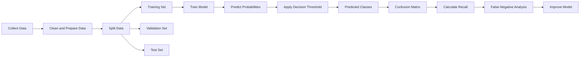
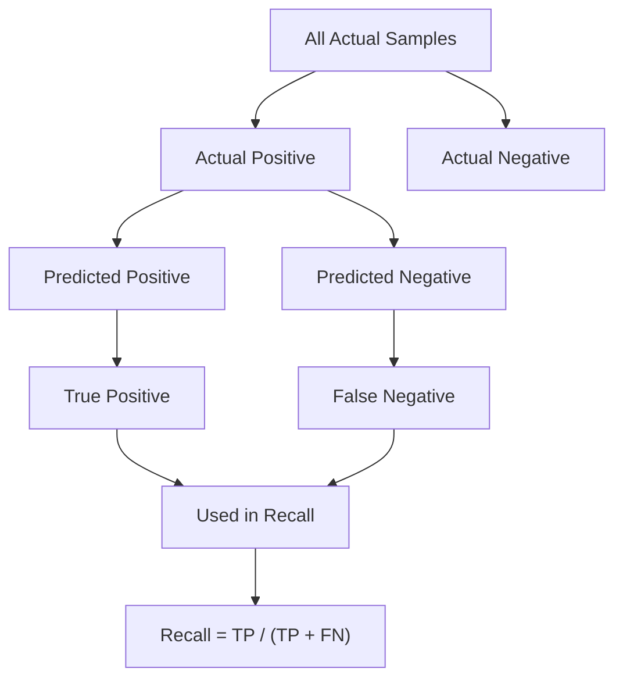
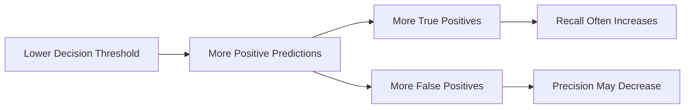
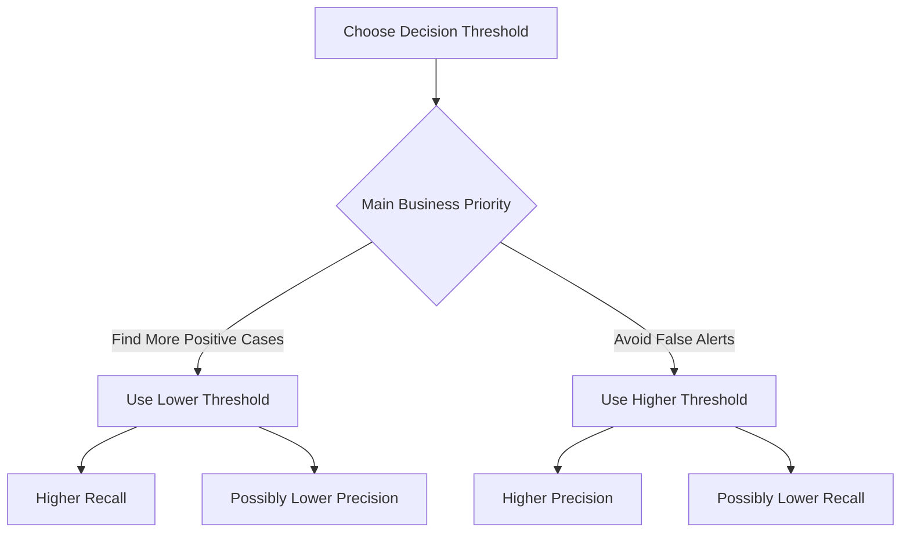
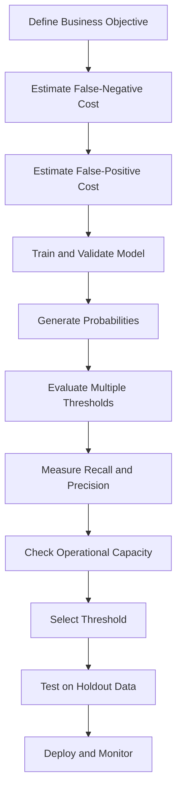
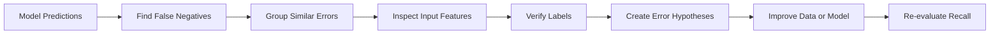
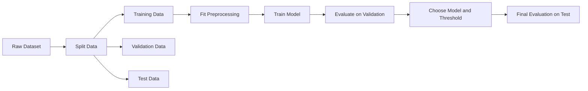
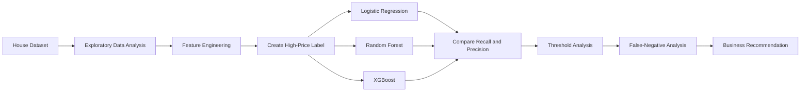

# 016 - Recall

**Course:** 03 - Machine Learning and Deep Learning
**Module:** Module 06 - Machine Learning
**Content Group:** Model Evaluation
**Roadmap Source:** Machine Learning / Model Evaluation
**Lesson Type:** Machine Learning
**Order in Module:** 016
**Suggested Duration:** 26 minutes

---

## 1. Overview

**Recall** is a classification evaluation metric that measures how many actual positive cases a model successfully identifies.

It answers the question:

> Of all the samples that were actually positive, how many did the model detect?

Recall is especially important when **false negatives are costly or dangerous**.

Common applications include:

* Disease screening
* Fraud detection
* Cybersecurity threat detection
* Defect detection
* Search and information retrieval
* Disaster warning systems
* Customer churn prediction
* Safety monitoring

After this lesson, you should understand how recall is calculated, when it should be prioritized, how classification thresholds affect it, and why it should usually be evaluated together with precision.

---

## 2. Learning Objectives

By the end of this lesson, you should be able to:

* Explain recall in your own words.
* Calculate recall from a confusion matrix.
* Identify true positives and false negatives.
* Explain when recall is more important than precision.
* Understand how the classification threshold affects recall.
* Calculate recall using Python and scikit-learn.
* Compare recall across multiple models.
* Perform error analysis on false-negative predictions.
* Connect recall to real business and operational costs.

---

## 3. Recall in the Machine Learning Workflow

Recall is normally calculated after a classification model generates predictions for validation or test data.



Recall should be measured on data that was not directly used to train the model.

---

## 4. Binary Classification

Recall is most commonly introduced in binary classification.

A binary classifier predicts one of two classes:

* **Positive class**
* **Negative class**

Examples:

| Problem           | Positive Class         | Negative Class         |
| ----------------- | ---------------------- | ---------------------- |
| Disease detection | Disease present        | Disease absent         |
| Fraud detection   | Fraudulent transaction | Legitimate transaction |
| Defect detection  | Defective product      | Normal product         |
| Cybersecurity     | Threat detected        | Normal activity        |
| Customer churn    | Customer will churn    | Customer will stay     |
| Spam detection    | Spam                   | Not spam               |

The positive class should be explicitly defined before calculating recall.

---

## 5. Confusion Matrix

Recall is calculated from the confusion matrix.

| Actual / Predicted  |    Predicted Positive |    Predicted Negative |
| ------------------- | --------------------: | --------------------: |
| **Actual Positive** |  True Positive, or TP | False Negative, or FN |
| **Actual Negative** | False Positive, or FP |  True Negative, or TN |

### 5.1 True Positive

A **True Positive**, or TP, occurs when:

* The actual class is positive.
* The model predicts positive.

Example:

> A patient has a disease, and the model correctly predicts that the disease is present.

### 5.2 False Negative

A **False Negative**, or FN, occurs when:

* The actual class is positive.
* The model predicts negative.

Example:

> A patient has a disease, but the model predicts that the patient is healthy.

False negatives are the main type of error measured by recall.

### 5.3 False Positive

A **False Positive**, or FP, occurs when:

* The actual class is negative.
* The model predicts positive.

Example:

> A healthy patient is incorrectly classified as having the disease.

### 5.4 True Negative

A **True Negative**, or TN, occurs when:

* The actual class is negative.
* The model predicts negative.

Example:

> A healthy patient is correctly classified as healthy.

---

## 6. Recall Formula

The recall formula is:

```text
Recall = True Positives / (True Positives + False Negatives)
```

Using abbreviations:

```text
Recall = TP / (TP + FN)
```

In mathematical notation:

$$
\text{Recall} = \frac{\text{TP}} {\text{TP} + \text{FN}}
$$

The denominator represents **all actual positive samples**.

The numerator represents the positive samples that the model successfully detected.

---

## 7. Alternative Names

Recall is also known as:

* **Sensitivity**
* **True Positive Rate**
* **Hit Rate**

These terms are often used in different domains.

For example:

| Domain                   | Common Term        |
| ------------------------ | ------------------ |
| General machine learning | Recall             |
| Medical testing          | Sensitivity        |
| Signal detection         | True Positive Rate |
| Information retrieval    | Recall             |

They usually refer to the same formula:

```text
TP / (TP + FN)
```

---

## 8. Intuitive Interpretation

Suppose a dataset contains 100 fraudulent transactions.

The model correctly identifies 85 of them but misses 15.

```text
TP = 85
FN = 15
```

The recall is:

```text
Recall = 85 / (85 + 15)
       = 85 / 100
       = 0.85
```

Therefore:

```text
Recall = 85%
```

Interpretation:

> The model detects 85% of all fraudulent transactions.

The model misses the remaining 15%.

---

## 9. Worked Example

Consider the following confusion matrix:

| Actual / Predicted    | Predicted Fraud | Predicted Legitimate |
| --------------------- | --------------: | -------------------: |
| **Actual Fraud**      |              90 |                   10 |
| **Actual Legitimate** |              45 |                  855 |

From this matrix:

```text
TP = 90
FN = 10
FP = 45
TN = 855
```

Recall is:

```text
Recall = TP / (TP + FN)
       = 90 / (90 + 10)
       = 90 / 100
       = 0.90
```

Therefore:

```text
Recall = 90%
```

Interpretation:

> The model successfully detects 90% of all fraudulent transactions.

However, it misses 10% of the actual fraud cases.

---

## 10. Recall Focuses on Actual Positive Cases

Recall starts with all actual positive samples and checks how many the model detected.



False positives and true negatives do not appear directly in the recall formula.

---

## 11. When Recall Is Important

Recall is important when missing a positive case creates a high cost.

### 11.1 Disease Screening

A false negative means that a patient with a disease is classified as healthy.

Possible consequences include:

* Delayed treatment
* Disease progression
* Increased transmission
* Severe health outcomes

Screening systems often prioritize recall because missing a disease case may be more harmful than requesting an additional test.

### 11.2 Fraud Detection

A false negative means that a fraudulent transaction is approved.

High recall helps detect more fraud cases.

However, extremely high recall may also create too many false alerts.

### 11.3 Cybersecurity

A false negative means that a real attack is not detected.

Possible consequences include:

* Data theft
* Unauthorized access
* System damage
* Financial loss

### 11.4 Manufacturing Defect Detection

A false negative means that a defective product passes quality control.

This may create:

* Product failures
* Safety risks
* Warranty costs
* Customer dissatisfaction

### 11.5 Disaster Warning Systems

A false negative may mean failing to warn people about a dangerous event.

In such systems, high recall may be critical.

---

## 12. Recall versus Precision

Recall and precision answer different questions.

### Recall

> Of all actual positive cases, how many did the model detect?

```text
Recall = TP / (TP + FN)
```

### Precision

> Of all predicted positive cases, how many were actually positive?

```text
Precision = TP / (TP + FP)
```

### Comparison

| Metric    | Main Question                           | Main Error      |
| --------- | --------------------------------------- | --------------- |
| Recall    | Did the model find most positive cases? | False negatives |
| Precision | Are positive predictions reliable?      | False positives |

---

## 13. Precision and Recall Example

Suppose there are 200 actual positive cases.

The model predicts 180 cases as positive.

Among those predictions:

* 150 are true positives.
* 30 are false positives.
* 50 actual positives are missed.

Therefore:

```text
TP = 150
FP = 30
FN = 50
```

Recall:

```text
Recall = 150 / (150 + 50)
       = 150 / 200
       = 0.75
```

Precision:

```text
Precision = 150 / (150 + 30)
          = 150 / 180
          = 0.8333
```

Results:

```text
Recall = 75%
Precision = 83.33%
```

Interpretation:

* The model finds 75% of all positive cases.
* About 83% of its positive predictions are correct.

---

## 14. High Recall but Low Precision

A model can achieve high recall by predicting many samples as positive.

Suppose a dataset contains:

* 100 actual positive cases.
* 900 actual negative cases.

The model predicts 600 cases as positive.

Among these:

* 95 are true positives.
* 505 are false positives.
* 5 are false negatives.

Recall:

```text
Recall = 95 / (95 + 5)
       = 0.95
```

Precision:

```text
Precision = 95 / (95 + 505)
          = 0.1583
```

The model has:

* High recall: `95%`
* Low precision: approximately `15.83%`

This model finds almost every positive case, but most of its positive predictions are incorrect.

---

## 15. Recall versus Accuracy

Accuracy measures the proportion of all predictions that are correct.

```text
Accuracy = (TP + TN) / (TP + TN + FP + FN)
```

Recall measures the proportion of actual positives that are correctly detected.

```text
Recall = TP / (TP + FN)
```

### Imbalanced Dataset Example

Suppose a dataset contains:

* 990 normal transactions.
* 10 fraudulent transactions.

A model predicts every transaction as normal.

The accuracy is:

```text
Accuracy = 990 / 1000
         = 99%
```

However:

```text
TP = 0
FN = 10
```

Recall is:

```text
Recall = 0 / (0 + 10)
       = 0
```

Therefore:

```text
Recall = 0%
```

The model has 99% accuracy but fails to detect any fraud.

This is why accuracy alone can be misleading for imbalanced datasets.

---

## 16. Recall and the Decision Threshold

Many classification models output probabilities.

Example:

```text
Probability of disease = 0.72
```

A decision threshold converts the probability into a class prediction.

```text
If probability >= threshold:
    predict positive
Else:
    predict negative
```

The default threshold is often `0.50`, but it may not be appropriate for every problem.

### Lowering the Threshold

Lowering the threshold usually:

* Produces more positive predictions.
* Detects more actual positives.
* Reduces false negatives.
* Increases recall.
* May reduce precision.

### Increasing the Threshold

Increasing the threshold usually:

* Produces fewer positive predictions.
* Misses more actual positives.
* Increases false negatives.
* Decreases recall.
* May increase precision.



The exact result depends on the model and dataset.

---

## 17. Threshold Example

Suppose a model produces the following results:

| Threshold | TP |  FP | FN | Recall | Precision |
| --------: | -: | --: | -: | -----: | --------: |
|      0.20 | 98 | 150 |  2 |   0.98 |      0.40 |
|      0.40 | 90 |  70 | 10 |   0.90 |      0.56 |
|      0.50 | 82 |  40 | 18 |   0.82 |      0.67 |
|      0.70 | 60 |  12 | 40 |   0.60 |      0.83 |
|      0.90 | 25 |   2 | 75 |   0.25 |      0.93 |

At lower thresholds:

* Recall increases.
* More positive cases are detected.
* False positives may increase.
* Precision may decrease.

The threshold should be selected according to business requirements.

---

## 18. Precision-Recall Trade-Off

Precision and recall often move in opposite directions.



There is no universally correct threshold.

The appropriate balance depends on:

* The cost of a false negative
* The cost of a false positive
* Review-team capacity
* Safety requirements
* Regulatory requirements
* User experience
* Minimum acceptable recall
* Minimum acceptable precision

---

## 19. Recall in Python

### 19.1 Calculate Recall Manually

```python
true_positive = 90
false_negative = 10

recall = true_positive / (
    true_positive + false_negative
)

print(f"Recall: {recall:.4f}")
```

Output:

```text
Recall: 0.9000
```

### 19.2 Using scikit-learn

```python
from sklearn.metrics import recall_score

y_true = [1, 0, 1, 1, 0, 0, 1, 0]
y_pred = [1, 1, 1, 0, 0, 0, 1, 0]

recall = recall_score(
    y_true,
    y_pred,
    zero_division=0,
)

print(f"Recall: {recall:.4f}")
```

### 19.3 Display the Confusion Matrix

```python
from sklearn.metrics import confusion_matrix

matrix = confusion_matrix(y_true, y_pred)

print(matrix)
```

For binary classification, scikit-learn returns:

```text
[[TN FP]
 [FN TP]]
```

### 19.4 Display a Classification Report

```python
from sklearn.metrics import classification_report

report = classification_report(
    y_true,
    y_pred,
    zero_division=0,
)

print(report)
```

The classification report includes:

* Precision
* Recall
* F1-score
* Support

---

## 20. Recall with Predicted Probabilities

```python
import numpy as np
from sklearn.metrics import recall_score

y_true = np.array([
    1,
    0,
    1,
    1,
    0,
    0,
    1,
    0,
])

y_probability = np.array([
    0.90,
    0.75,
    0.70,
    0.45,
    0.40,
    0.20,
    0.80,
    0.65,
])

threshold = 0.40

y_pred = (
    y_probability >= threshold
).astype(int)

recall = recall_score(
    y_true,
    y_pred,
    zero_division=0,
)

print("Predictions:", y_pred)
print(f"Recall: {recall:.4f}")
```

This pattern allows recall to be evaluated at different thresholds.

---

## 21. Evaluate Multiple Thresholds

```python
import numpy as np
import pandas as pd

from sklearn.metrics import (
    precision_score,
    recall_score,
)

thresholds = np.arange(
    0.10,
    1.00,
    0.10,
)

results = []

for threshold in thresholds:
    y_pred = (
        y_probability >= threshold
    ).astype(int)

    recall = recall_score(
        y_true,
        y_pred,
        zero_division=0,
    )

    precision = precision_score(
        y_true,
        y_pred,
        zero_division=0,
    )

    results.append(
        {
            "threshold": round(
                threshold,
                2,
            ),
            "recall": recall,
            "precision": precision,
            "predicted_positives": int(
                y_pred.sum()
            ),
        }
    )

results_df = pd.DataFrame(results)

print(results_df)
```

A threshold comparison table helps connect model performance to business constraints.

---

## 22. Precision-Recall Curve

A precision-recall curve shows how precision and recall change across multiple thresholds.

```python
import matplotlib.pyplot as plt

from sklearn.metrics import (
    precision_recall_curve,
)

precision_values, recall_values, thresholds = (
    precision_recall_curve(
        y_true,
        y_probability,
    )
)

plt.figure(figsize=(8, 5))

plt.plot(
    recall_values,
    precision_values,
)

plt.xlabel("Recall")
plt.ylabel("Precision")
plt.title("Precision-Recall Curve")
plt.grid(True)
plt.show()
```

A strong model should maintain relatively high precision while achieving high recall.

Precision-recall curves are especially useful when the positive class is rare.

---

## 23. Recall at K

In information retrieval and recommendation systems, recall may be calculated for the first `K` returned items.

**Recall at K**, written as `Recall@K`, measures how many relevant items are found in the top `K` results.

```text
Recall@K =
Relevant items in the top K /
Total number of relevant items
```

In mathematical notation:

$$
\text{Recall@K} = \frac{ \text{Relevant items retrieved in the top } K }{ \text{Total relevant items} }
$$

### Example

Suppose there are 10 relevant documents in the complete collection.

The search engine retrieves 5 relevant documents in its top 8 results.

```text
Recall@8 = 5 / 10
         = 0.50
```

Therefore:

```text
Recall@8 = 50%
```

Recall@K is commonly used in:

* Search engines
* Recommendation systems
* Document retrieval
* Candidate generation
* Image retrieval

---

## 24. Multiclass Recall

For multiclass classification, recall can be calculated separately for every class.

Suppose a model predicts three classes:

* Cat
* Dog
* Bird

Recall for the `Dog` class is:

```text
Dog Recall =
Correct Dog Predictions /
All Actual Dog Samples
```

This tells us how many actual dogs the model correctly identifies.

Different averaging methods can combine class-level recall values.

---

## 25. Macro, Micro, and Weighted Recall

### 25.1 Macro Recall

Macro recall calculates recall for each class and then takes the unweighted average.

```text
Macro Recall =
Sum of Class Recall Scores /
Number of Classes
```

In mathematical notation:

$$
\text{Macro Recall} = \frac{1}{C} \sum_{i=1}^{C} \text{Recall}_i
$$

Use macro recall when each class should have equal importance.

---

### 25.2 Micro Recall

Micro recall combines true positives and false negatives across all classes before calculating recall.

```text
Micro Recall =
Total TP /
(Total TP + Total FN)
```

Use micro recall when every sample should contribute equally.

---

### 25.3 Weighted Recall

Weighted recall calculates recall for each class and weights it by the number of actual samples in that class.

```text
Weighted Recall =
Sum of Class Recall × Class Support /
Total Number of Samples
```

Use weighted recall when class imbalance should affect the final result.

### Comparison

| Averaging Method | Main Characteristic         |
| ---------------- | --------------------------- |
| Macro            | Treats every class equally  |
| Micro            | Treats every sample equally |
| Weighted         | Weights classes by support  |

---

## 26. Multiclass Recall in Python

```python
from sklearn.metrics import recall_score

y_true = [
    0,
    1,
    2,
    0,
    1,
    2,
    1,
    2,
]

y_pred = [
    0,
    2,
    2,
    0,
    1,
    1,
    1,
    2,
]

macro_recall = recall_score(
    y_true,
    y_pred,
    average="macro",
    zero_division=0,
)

micro_recall = recall_score(
    y_true,
    y_pred,
    average="micro",
    zero_division=0,
)

weighted_recall = recall_score(
    y_true,
    y_pred,
    average="weighted",
    zero_division=0,
)

print(
    f"Macro recall: {macro_recall:.4f}"
)

print(
    f"Micro recall: {micro_recall:.4f}"
)

print(
    f"Weighted recall: {weighted_recall:.4f}"
)
```

Always state which averaging method was used.

Writing only the following is incomplete for a multiclass problem:

```text
Recall = 0.87
```

A better report is:

```text
Macro Recall = 0.87
```

---

## 27. Balanced Accuracy

For binary classification, balanced accuracy is the average of:

* Recall for the positive class
* Recall for the negative class

The recall of the negative class is also called **specificity**.

```text
Specificity = TN / (TN + FP)
```

Balanced accuracy is:

```text
Balanced Accuracy =
(Recall + Specificity) / 2
```

In mathematical notation:

$$
\text{Balanced Accuracy} = \frac{ \text{Recall} + \text{Specificity} }{2}
$$

Balanced accuracy can be useful when classes are imbalanced.

```python
from sklearn.metrics import balanced_accuracy_score

balanced_accuracy = balanced_accuracy_score(
    y_true,
    y_pred,
)

print(
    f"Balanced accuracy: "
    f"{balanced_accuracy:.4f}"
)
```

---

## 28. Recall and F1-Score

Recall can be combined with precision using the F1-score.

```text
F1 =
2 × Precision × Recall /
(Precision + Recall)
```

In mathematical notation:

$$
F_1 = 2 \cdot \frac{ \text{Precision} \cdot \text{Recall} }{ \text{Precision} + \text{Recall} }
$$

The F1-score is useful when:

* Both false positives and false negatives matter.
* The dataset is imbalanced.
* A single summary score is required.

However, F1 gives equal importance to precision and recall.

This may not match the real cost of errors.

---

## 29. F-Beta Score

When recall is more important than precision, the **F-beta score** can be used.

The general formula is:

$$
F_{\beta} = (1+\beta^2) \cdot \frac{ \text{Precision} \cdot \text{Recall} }{ \beta^2 \cdot \text{Precision} + \text{Recall} }
$$

Interpretation:

* `beta = 1`: precision and recall have equal weight.
* `beta > 1`: recall receives more weight.
* `beta < 1`: precision receives more weight.

For example, `F2-score` gives more importance to recall.

```python
from sklearn.metrics import fbeta_score

f2 = fbeta_score(
    y_true,
    y_pred,
    beta=2,
    zero_division=0,
)

print(f"F2-score: {f2:.4f}")
```

---

## 30. Business-Oriented Threshold Selection

The best threshold should not be selected only because it gives the highest recall.

A threshold of zero may classify almost every sample as positive and produce near-perfect recall, but the model may become operationally useless.

A better threshold-selection process is:



Example business requirement:

```text
Select the threshold that produces:

Recall >= 95%
Precision >= 40%
No more than 2,000 alerts per day
```

This is more useful than maximizing recall without considering other constraints.

---

## 31. Error Analysis for Recall

To improve recall, inspect false-negative predictions.

For every false negative, ask:

* Why did the model miss this positive sample?
* Is the label correct?
* Is the sample underrepresented in training data?
* Are important features missing?
* Is the threshold too high?
* Does this case belong to a particular subgroup?
* Is the input noisy or incomplete?
* Does the model fail on rare patterns?
* Was the data collected differently?
* Is there distribution shift?

### False-Negative Analysis Workflow



Possible improvements include:

* Lowering the classification threshold.
* Adding more positive training examples.
* Oversampling the minority class.
* Using class weights.
* Engineering stronger features.
* Correcting mislabeled data.
* Using data augmentation.
* Training a more suitable model.
* Creating a second-stage detector.
* Improving input-data quality.

---

## 32. Class Imbalance and Recall

Recall is often important in imbalanced classification problems.

Examples include:

* Fraud detection
* Rare disease detection
* Equipment failure prediction
* Intrusion detection
* Defect detection

However, recall alone is not enough.

A model can obtain perfect recall by predicting every sample as positive.

Example:

```text
Actual positives = 100
Model predicts all 1,000 samples as positive

TP = 100
FN = 0
FP = 900
```

Recall:

```text
Recall = 100 / (100 + 0)
       = 1.00
```

Precision:

```text
Precision = 100 / (100 + 900)
          = 0.10
```

The model has:

* Recall: `100%`
* Precision: `10%`

Therefore, recall should be evaluated together with precision and false-positive volume.

---

## 33. Practical Example: Disease Screening

### Problem

Build a model that predicts whether a patient may have a disease.

### Business Risk

A false negative means that a patient with the disease is classified as healthy.

Therefore, recall may be prioritized.

### Evaluation Plan

1. Split the data into training, validation, and test sets.
2. Train a simple baseline model.
3. Train one or more candidate models.
4. Generate predicted probabilities.
5. Evaluate recall at multiple thresholds.
6. Define a minimum acceptable precision.
7. Select a threshold on validation data.
8. Evaluate once on the test set.
9. Inspect false-negative patient cases.
10. Monitor recall after deployment.

### Example Comparison

| Model               | Threshold | Recall | Precision |
| ------------------- | --------: | -----: | --------: |
| Logistic Regression |      0.50 |   0.88 |      0.82 |
| Random Forest       |      0.50 |   0.84 |      0.90 |
| XGBoost             |      0.50 |   0.91 |      0.86 |
| XGBoost             |      0.35 |   0.97 |      0.71 |

The final model depends on:

* Minimum required recall
* Acceptable false-positive rate
* Follow-up testing cost
* Clinical safety requirements
* Population characteristics

A machine learning model should not replace qualified medical judgment without appropriate validation, oversight, and regulation.

---

## 34. Baseline Model

Always compare candidate models against a meaningful baseline.

Possible baselines include:

* Predicting the majority class
* Predicting every sample as positive
* A simple rule-based detector
* Logistic Regression
* A shallow Decision Tree
* An existing production model
* A manually selected threshold

A complex model is valuable only when it improves the relevant business outcome.

---

## 35. Data Leakage and Recall

Data leakage occurs when information unavailable at prediction time enters training or evaluation.

Examples include:

* Using future information
* Preprocessing the complete dataset before splitting
* Including target-derived features
* Using duplicate samples across train and test sets
* Selecting thresholds on the test set

Leakage can produce unrealistically high recall.

A correct workflow is:



The test set should not be repeatedly used for model or threshold selection.

---

## 36. Common Mistakes

### 36.1 Evaluating on Training Data

Training recall is often overly optimistic.

Use validation data for model selection and threshold tuning.

Use the test set only for final evaluation.

### 36.2 Reporting Recall Without Precision

A model can produce very high recall by predicting almost everything as positive.

Always inspect:

* Precision
* Number of positive predictions
* False-positive count
* Confusion matrix

### 36.3 Using the Default Threshold Without Analysis

A threshold of `0.50` is only a default convention.

It may not match the business objective.

### 36.4 Ignoring the Positive-Class Definition

Recall depends on which class is considered positive.

Always state the positive class clearly.

### 36.5 Ignoring Class-Level Recall

Overall metrics may hide a class with very poor recall.

For multiclass problems, calculate recall for each class.

### 36.6 Using the Test Set to Select the Threshold

This causes test-set leakage.

Select the threshold using validation data.

### 36.7 Ignoring Subgroup Performance

Overall recall may hide poor performance for certain:

* Age groups
* Locations
* Devices
* Customer segments
* Product categories
* Time periods
* Data sources

### 36.8 Comparing Models at Different Precision Levels

A model may have higher recall simply because it generates more positive predictions.

Compare precision and recall together.

### 36.9 Assuming High Recall Means a Good Model

High recall does not guarantee:

* Good precision
* Good probability calibration
* Fair subgroup performance
* Low operational cost
* Business usefulness

---

## 37. Practical Exercise

Use a binary classification dataset such as:

* Breast Cancer Wisconsin
* Credit card fraud
* Customer churn
* Spam detection
* Loan default
* Product defect detection

### Tasks

1. Load and inspect the dataset.
2. Identify the positive class.
3. Check the class distribution.
4. Split the data into training and test sets.
5. Train a baseline model.
6. Train at least one additional model.
7. Generate predicted probabilities.
8. Calculate recall at a threshold of `0.50`.
9. Calculate precision and F1-score.
10. Display the confusion matrix.
11. Evaluate at least five thresholds.
12. Plot the precision-recall curve.
13. Select a threshold based on a business requirement.
14. Inspect at least ten false negatives.
15. Document one possible model improvement.

---

## 38. Example Exercise Code

```python
from sklearn.datasets import load_breast_cancer
from sklearn.linear_model import LogisticRegression
from sklearn.metrics import (
    classification_report,
    confusion_matrix,
    precision_score,
    recall_score,
)
from sklearn.model_selection import train_test_split
from sklearn.pipeline import Pipeline
from sklearn.preprocessing import StandardScaler

# Load the dataset
dataset = load_breast_cancer(
    as_frame=True
)

X = dataset.data
y = dataset.target

# Split the data
X_train, X_test, y_train, y_test = (
    train_test_split(
        X,
        y,
        test_size=0.20,
        random_state=42,
        stratify=y,
    )
)

# Build the pipeline
model = Pipeline(
    steps=[
        (
            "scaler",
            StandardScaler(),
        ),
        (
            "classifier",
            LogisticRegression(
                max_iter=1000,
                random_state=42,
            ),
        ),
    ]
)

# Train the model
model.fit(
    X_train,
    y_train,
)

# Generate probabilities
y_probability = model.predict_proba(
    X_test
)[:, 1]

# Apply a decision threshold
threshold = 0.50

y_pred = (
    y_probability >= threshold
).astype(int)

# Calculate metrics
recall = recall_score(
    y_test,
    y_pred,
    zero_division=0,
)

precision = precision_score(
    y_test,
    y_pred,
    zero_division=0,
)

print(f"Threshold: {threshold:.2f}")
print(f"Recall: {recall:.4f}")
print(f"Precision: {precision:.4f}")

print("\nConfusion matrix:")
print(
    confusion_matrix(
        y_test,
        y_pred,
    )
)

print("\nClassification report:")
print(
    classification_report(
        y_test,
        y_pred,
        zero_division=0,
    )
)
```

Before interpreting the results, verify how the dataset encodes its target classes.

A label of `1` does not always represent the harmful, rare, or medically positive condition.

---

## 39. False-Negative Extraction

You can extract false-negative cases for error analysis.

```python
import pandas as pd

analysis_df = X_test.copy()

analysis_df["actual"] = y_test
analysis_df["probability"] = y_probability
analysis_df["prediction"] = y_pred

false_negatives = analysis_df[
    (analysis_df["actual"] == 1)
    & (analysis_df["prediction"] == 0)
]

false_negatives = false_negatives.sort_values(
    by="probability",
    ascending=False,
)

print(false_negatives.head(10))
```

Questions to investigate:

* Are these cases close to the threshold?
* Do they share similar feature values?
* Are they rare subtypes?
* Are any labels incorrect?
* Is the model missing an important feature?

---

## 40. Suggested Portfolio Artifact

Create a notebook titled:

```text
Recall and False-Negative Analysis
```

Include:

* Problem definition
* Business context
* Positive-class definition
* Dataset overview
* Class distribution
* Baseline model
* Candidate models
* Confusion matrices
* Recall and precision scores
* Precision-recall curve
* Threshold comparison table
* False-negative examples
* Final threshold recommendation
* Limitations
* Monitoring plan
* Next experiments

A strong conclusion might state:

> At a decision threshold of 0.34, the model achieved 96% recall and 68% precision. This threshold was selected because missing a positive case is significantly more expensive than reviewing an additional false alert.

---

## 41. Completion Checklist

* [ ] I can explain recall in one or two minutes.
* [ ] I can identify true positives and false negatives.
* [ ] I can write the recall formula.
* [ ] I understand that recall measures coverage of actual positive cases.
* [ ] I can explain the difference between recall and precision.
* [ ] I can explain how the decision threshold affects recall.
* [ ] I can calculate recall using Python.
* [ ] I can interpret a precision-recall curve.
* [ ] I can perform false-negative error analysis.
* [ ] I can select a threshold based on business requirements.
* [ ] I have compared the model with a baseline.
* [ ] I have documented at least one assumption, caveat, or next question.
* [ ] I have created a notebook, chart, model, API, or portfolio note for this topic.

---

## 42. Key Takeaways

1. Recall measures how many actual positive cases a model detects.

2. Its formula is:

```text
Recall = TP / (TP + FN)
```

3. Recall is especially important when false negatives are costly.

4. High recall does not guarantee high precision.

5. Lowering the classification threshold often increases recall but may reduce precision.

6. Accuracy can be misleading for imbalanced datasets.

7. Recall should be evaluated together with precision, prediction volume, and the confusion matrix.

8. Multiclass recall requires a clearly stated averaging method.

9. False-negative analysis is essential for improving recall.

10. The best threshold depends on business risks, operational capacity, and model limitations.

---

## 43. Related Outcome

Train, compare, and evaluate supervised and unsupervised machine learning models using appropriate metrics, thoughtful feature engineering, threshold analysis, and error analysis.

---

## 44. Related Project

**Mini Project: House Price Prediction**

Recall is not directly appropriate for standard house-price regression because the target is continuous.

For the original regression task, use metrics such as:

* MAE
* MSE
* RMSE
* R-squared

Recall becomes relevant when the project is converted into a classification problem.

Example question:

```text
Will this house sell above the median price?
```

In this version:

* Positive class: house sells above the median price
* False negative: an expensive house is predicted as not expensive
* Recall: proportion of actual high-price houses correctly identified



---

## 45. Summary

**Recall** is a core classification metric that evaluates how effectively a model finds actual positive cases.

It answers:

> Of all the cases that were actually positive, how many did the model detect?

Recall is especially useful when missing a positive case creates significant financial, operational, medical, or safety risks.

A complete evaluation should not stop at reporting one recall score. It should also examine:

* Precision
* Confusion matrix
* Classification threshold
* False-negative examples
* Class prevalence
* Subgroup performance
* Business costs
* Operational capacity
* Production-data changes

Turn this lesson into a practical artifact such as a notebook, threshold dashboard, experiment report, classification API, or portfolio case study.

---

# Bài luyện tập

## Mục tiêu


## Đề bài


## Yêu cầu hoàn thành

- [ ] 
- [ ] 
- [ ] 

## Kết quả / lời giải


## Ghi chú
