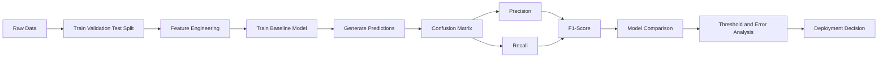
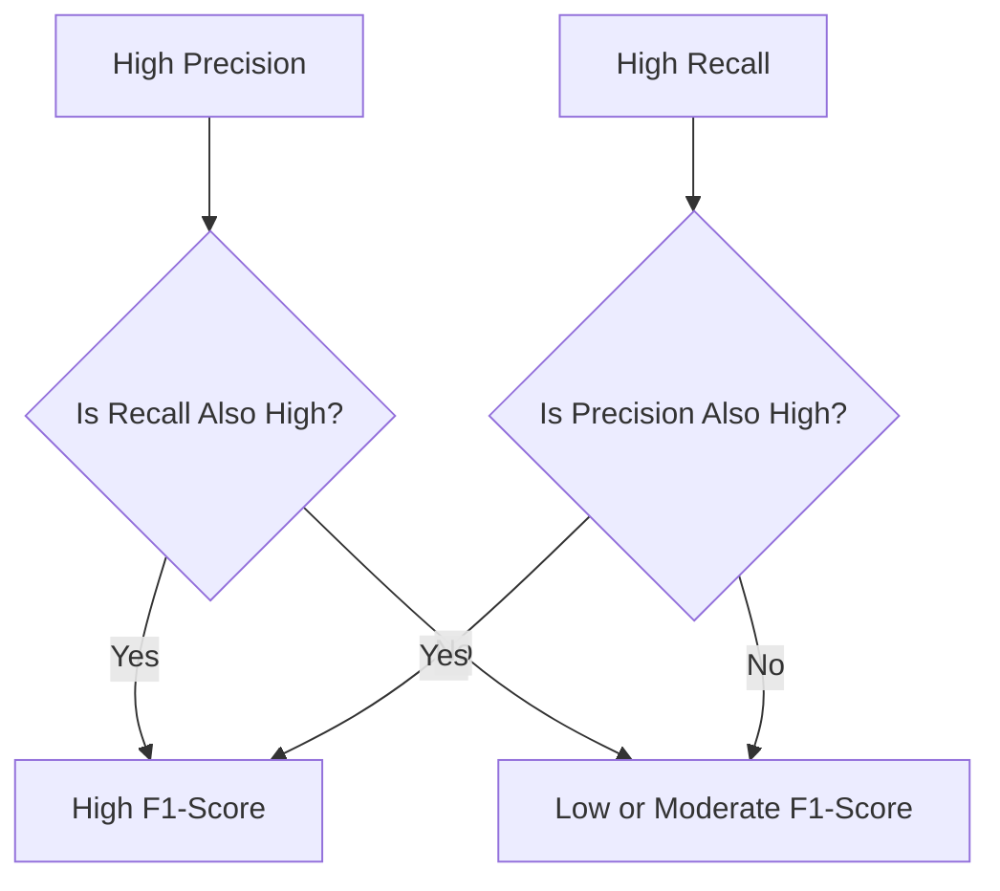
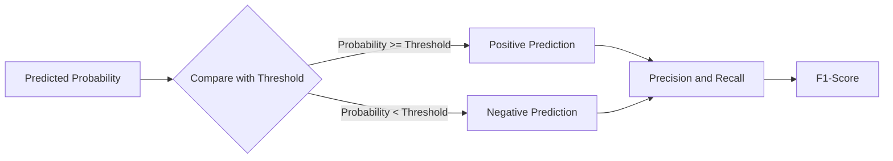
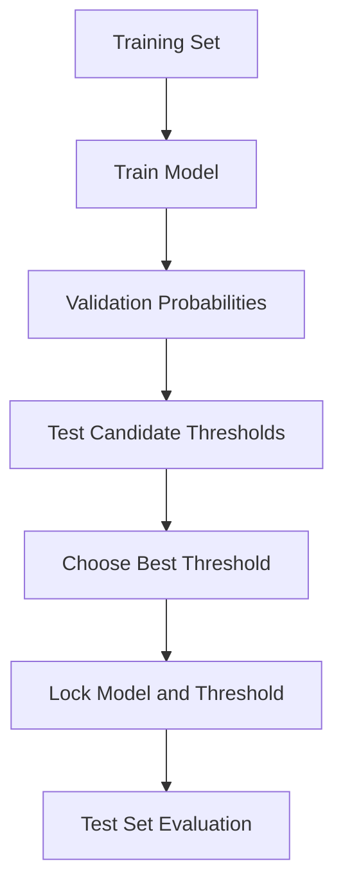
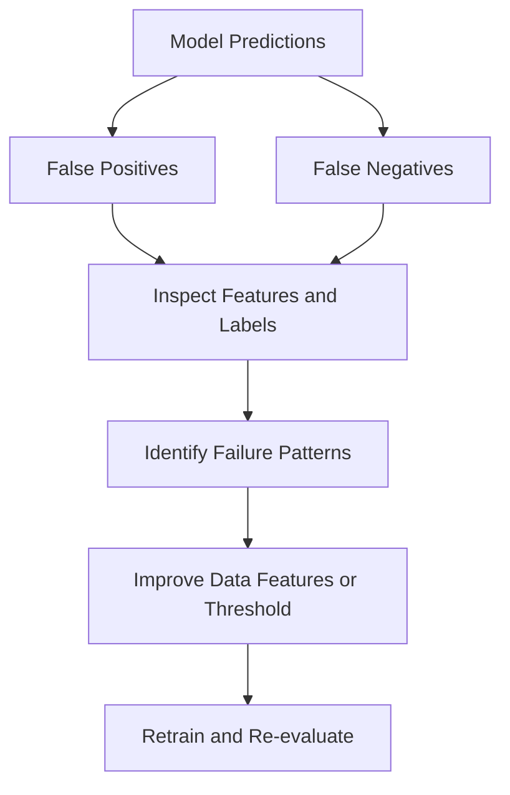

# 017 — F1-Score

**Course:** 03 — Machine Learning and Deep Learning
**Module:** Module 06 — Machine Learning
**Content Group:** Model Evaluation
**Roadmap Source:** Machine Learning / Model Evaluation
**Lesson Type:** Machine Learning
**Order in Module:** 017
**Suggested Duration:** 26 minutes

---

## 1. Summary

This lesson explains the **F1-score**, a classification metric that combines **precision** and **recall** into a single value.

The F1-score is especially useful when:

* The dataset is imbalanced.
* Both false positives and false negatives matter.
* Accuracy alone gives a misleading impression of model performance.
* You need one metric for comparing classification models.

After this lesson, you should understand:

* How the F1-score is calculated.
* How it relates to precision and recall.
* When the F1-score is more appropriate than accuracy.
* How to interpret binary and multiclass F1-scores.
* How to calculate and use it in a machine learning experiment.

---

## 2. Learning Objectives

By the end of this lesson, you should be able to:

* Explain the F1-score in your own words.
* Calculate the F1-score from precision and recall.
* Calculate it directly from a confusion matrix.
* Explain why the harmonic mean is used.
* Distinguish between binary, macro, micro, and weighted F1-scores.
* Choose an appropriate classification metric for a business problem.
* Evaluate a model without introducing data leakage.
* Perform basic threshold and error analysis.

---

## 3. Where F1-Score Fits in the Machine Learning Workflow

The F1-score is calculated after a classification model produces predictions.



The metric should normally be measured on:

* A **validation set** during model selection.
* A **test set** only after the final model and threshold have been selected.
* Production data after deployment to detect performance degradation.

---

## 4. Required Concepts

Before studying the F1-score, review the four outcomes in a binary confusion matrix.

| Actual Class    |  Predicted Positive |  Predicted Negative |
| --------------- | ------------------: | ------------------: |
| Actual Positive |  True Positive — TP | False Negative — FN |
| Actual Negative | False Positive — FP |  True Negative — TN |

### True Positive

The model predicts the positive class correctly.

Example: A fraudulent transaction is correctly identified as fraud.

### False Positive

The model predicts positive, but the actual class is negative.

Example: A legitimate transaction is incorrectly blocked as fraud.

### False Negative

The model predicts negative, but the actual class is positive.

Example: A fraudulent transaction is incorrectly allowed.

### True Negative

The model predicts the negative class correctly.

Example: A legitimate transaction is correctly approved.

---

## 5. Precision and Recall Review

The F1-score combines two metrics: precision and recall.

### 5.1 Precision

Precision measures how many predicted positive cases are actually positive.

$$
\text{Precision} = \frac{TP}{TP + FP}
$$

Precision answers:

> Of all observations predicted as positive, how many were truly positive?

High precision means the model produces relatively few false positives.

---

### 5.2 Recall

Recall measures how many actual positive cases the model successfully identifies.

$$
\text{Recall} = \frac{TP}{TP + FN}
$$

Recall answers:

> Of all actual positive observations, how many did the model find?

High recall means the model produces relatively few false negatives.

---

## 6. F1-Score Definition

The F1-score is the **harmonic mean** of precision and recall.

$$
F_1 = 2 \times \frac{\text{Precision} \times \text{Recall}} {\text{Precision} + \text{Recall}}
$$

It can also be written as:

$$
F_1 = \frac{2} { \frac{1}{\text{Precision}} + \frac{1}{\text{Recall}} }
$$

Using confusion-matrix values directly:

$$
F_1 = \frac{2TP} {2TP + FP + FN}
$$

The F1-score ranges from 0 to 1:

$$
0 \leq F_1 \leq 1
$$

Where:

* (F_1 = 1) represents perfect precision and recall.
* (F_1 = 0) represents the worst possible result.
* A higher F1-score generally indicates a better balance between precision and recall.

---

## 7. Why Use the Harmonic Mean?

A simple arithmetic average would be:

$$
\frac{\text{Precision} + \text{Recall}}{2}
$$

However, this average can remain relatively high even when one metric is poor.

Suppose:

$$
\text{Precision} = 1.00
$$

and:

$$
\text{Recall} = 0.10
$$

The arithmetic mean is:

$$
\frac{1.00 + 0.10}{2} = 0.55
$$

The F1-score is:

$$
F_1 = 2 \times \frac{1.00 \times 0.10} {1.00 + 0.10}
$$

$$
F_1 = \frac{0.20}{1.10} \approx 0.182
$$

The harmonic mean strongly penalizes an imbalance between precision and recall.



A model cannot achieve a high F1-score by performing well on only one of the two metrics.

---

## 8. Step-by-Step Example

Consider a fraud detection model with the following results:

| Metric Component | Value |
| ---------------- | ----: |
| True Positives   |    80 |
| False Positives  |    20 |
| False Negatives  |    40 |
| True Negatives   |   860 |

### Step 1: Calculate Precision

$$
\text{Precision} = \frac{TP}{TP + FP}
$$

$$
\text{Precision} = # \frac{80}{80 + 20} # \frac{80}{100} 0.80
$$

### Step 2: Calculate Recall

$$
\text{Recall} = \frac{TP}{TP + FN}
$$

$$
\text{Recall} = # \frac{80}{80 + 40} \frac{80}{120} \approx 0.667
$$

### Step 3: Calculate F1-Score

$$
F_1 = 2 \times \frac{0.80 \times 0.667} {0.80 + 0.667}
$$

$$
F_1
\approx
2
\times
\frac{0.5336}{1.467}
$$

$$
F_1
\approx
0.727
$$

The model’s F1-score is approximately:

$$
\boxed{F_1 \approx 0.73}
$$

---

## 9. Direct Calculation from the Confusion Matrix

The same result can be calculated directly:

$$
F_1 = \frac{2TP} {2TP + FP + FN}
$$

Substitute the values:

$$
F_1 = \frac{2 \times 80} {2 \times 80 + 20 + 40}
$$

$$
F_1 = \frac{160}{220} \approx 0.727
$$

This confirms the previous result.

---

## 10. Accuracy vs. F1-Score

Accuracy measures the proportion of all predictions that are correct.

$$
\text{Accuracy} = \frac{TP + TN} {TP + TN + FP + FN}
$$

Using the previous example:

$$
\text{Accuracy} = \frac{80 + 860} {80 + 860 + 20 + 40}
$$

$$
\text{Accuracy} = # \frac{940}{1000} 0.94
$$

The model has:

* Accuracy: (0.94)
* F1-score: (0.73)

The accuracy looks excellent, but the F1-score reveals weaker performance on the positive fraud class.

### Why the Difference Exists

There are many more legitimate transactions than fraudulent transactions. Correctly predicting the majority class produces high accuracy even when the model misses a significant number of fraud cases.

| Situation                          | Accuracy          | F1-Score                       |
| ---------------------------------- | ----------------- | ------------------------------ |
| Balanced classes                   | Often useful      | Also useful                    |
| Strong class imbalance             | Can be misleading | Usually more informative       |
| True negatives are important       | Includes them     | Does not directly include them |
| Positive-class performance matters | Limited insight   | Stronger insight               |
| Precision and recall both matter   | Not sufficient    | Appropriate                    |

---

## 11. Imbalanced Dataset Example

Suppose a dataset contains:

* 990 negative observations.
* 10 positive observations.

A model predicts every observation as negative.

Its accuracy is:

$$
\text{Accuracy} = # \frac{990}{1000} 0.99
$$

However:

$$
TP = 0
$$

$$
FP = 0
$$

$$
FN = 10
$$

The model identifies none of the positive cases.

Its recall is:

$$
\text{Recall} = # \frac{0}{0 + 10} 0
$$

Its F1-score is therefore:

$$
F_1 = 0
$$

The model has 99% accuracy but is completely useless for identifying the positive class.

---

## 12. When F1-Score Is Useful

The F1-score is appropriate when:

* The classes are imbalanced.
* The positive class is relatively rare.
* Both false positives and false negatives are costly.
* You want to balance precision and recall.
* True negatives are not the primary focus.
* You need one summary metric for model comparison.

Common applications include:

* Fraud detection.
* Spam detection.
* Intrusion detection.
* Defect detection.
* Medical screening.
* Content moderation.
* Rare-event classification.
* Customer churn prediction.
* Search and information retrieval.

---

## 13. When F1-Score May Not Be Enough

The F1-score should not automatically be used for every classification problem.

It may be insufficient when:

* False positives and false negatives have very different costs.
* True negatives are operationally important.
* Probability calibration matters.
* The classification threshold must reflect financial consequences.
* Performance must be understood across multiple classes.
* The business needs a specific minimum precision or recall.
* The positive-class prevalence changes substantially over time.

For example, in medical screening, missing a disease may be much more harmful than generating an additional test. In that situation, recall may deserve more weight than precision.

---

## 14. F-Beta Score

The F1-score gives equal importance to precision and recall.

The more general **F-beta score** allows one metric to receive greater weight.

$$
F_{\beta} = (1 + \beta^2) \times \frac{\text{Precision} \times \text{Recall}} {\beta^2 \times \text{Precision} + \text{Recall}}
$$

### Interpretation of Beta

* (\beta = 1): Precision and recall have equal weight.
* (\beta > 1): Recall receives more weight.
* (\beta < 1): Precision receives more weight.

### F2-Score

The F2-score emphasizes recall.

$$
F_2 = 5 \times \frac{\text{Precision} \times \text{Recall}} {4 \times \text{Precision} + \text{Recall}}
$$

Use it when false negatives are especially costly.

Examples:

* Disease screening.
* Fraud detection.
* Safety incident detection.

### F0.5-Score

The F0.5-score emphasizes precision.

$$
F_{0.5} = 1.25 \times \frac{\text{Precision} \times \text{Recall}} {0.25 \times \text{Precision} + \text{Recall}}
$$

Use it when false positives are especially costly.

Examples:

* Automatically blocking customer accounts.
* Automatically deleting content.
* Triggering expensive manual investigations.

---

## 15. Decision Threshold and F1-Score

Many classifiers output a probability rather than a final class.

For example:

$$
P(y = 1 \mid x) = 0.72
$$

A threshold converts the probability into a class prediction:

$$
\hat{y} = \begin{cases} 1, & \text{if } P(y = 1 \mid x) \geq t \ 0, & \text{otherwise} \end{cases}
$$

where (t) is the decision threshold.

The default threshold is often:

$$
t = 0.50
$$

However, changing the threshold changes precision, recall, and F1-score.



### Lower Threshold

A lower threshold usually:

* Predicts more positive cases.
* Increases recall.
* May reduce precision.
* Produces more false positives.

### Higher Threshold

A higher threshold usually:

* Predicts fewer positive cases.
* Increases precision.
* May reduce recall.
* Produces more false negatives.

The threshold that maximizes validation F1-score is not necessarily (0.50).

---

## 16. Threshold Selection Without Data Leakage

The correct process is:

1. Train the model on the training set.
2. Generate probabilities for the validation set.
3. Test candidate thresholds on the validation set.
4. Select a threshold using the chosen business metric.
5. Evaluate the final model and threshold once on the test set.



Do not repeatedly optimize the threshold on the test set. Doing so leaks test-set information into model selection.

---

## 17. Precision-Recall Trade-Off

Precision and recall often move in opposite directions.

| Threshold | Precision | Recall | F1-Score |
| --------: | --------: | -----: | -------: |
|      0.20 |      0.42 |   0.94 |     0.58 |
|      0.35 |      0.57 |   0.86 |     0.69 |
|      0.50 |      0.72 |   0.74 |     0.73 |
|      0.65 |      0.84 |   0.55 |     0.67 |
|      0.80 |      0.93 |   0.28 |     0.43 |

In this example, the highest F1-score occurs near a threshold of (0.50).

However, threshold selection should consider business costs, not only the highest F1-score.

---

## 18. Binary F1-Score

For binary classification, the F1-score is usually calculated for the positive class.

For example:

* Positive class: fraud.
* Negative class: legitimate transaction.

The result depends on which class is defined as positive.

Changing the positive label can produce a different F1-score because the confusion-matrix roles change.

Always document:

* Which class is considered positive.
* Why that class matters.
* Which averaging method is used.
* Which threshold is used.

---

## 19. Multiclass F1-Score

In multiclass classification, an F1-score can be calculated separately for every class using a one-vs-rest approach.

For class (k):

$$
F_{1,k} = \frac{2TP_k} {2TP_k + FP_k + FN_k}
$$

The class-level scores must then be combined using an averaging strategy.

---

## 20. Macro F1-Score

Macro F1 calculates the F1-score for every class and takes their unweighted average.

For (K) classes:

$$
F_{1,\text{macro}} = \frac{1}{K} \sum_{k=1}^{K} F_{1,k}
$$

Each class contributes equally, regardless of its size.

### Appropriate When

* Minority classes are important.
* You want equal treatment across classes.
* Class imbalance should not hide poor minority-class performance.

### Limitation

A very small class affects the final metric as much as a very large class.

---

## 21. Weighted F1-Score

Weighted F1 averages class-level F1-scores using class support.

Let (n_k) be the number of actual observations in class (k), and let (N) be the total number of observations.

$$
F_{1,\text{weighted}} = \sum_{k=1}^{K} \frac{n_k}{N} F_{1,k}
$$

Large classes contribute more to the final result.

### Appropriate When

* The dataset is imbalanced.
* You want a single score reflecting class prevalence.
* Performance on frequent classes should have more influence.

### Limitation

Poor performance on a small minority class may be hidden by strong performance on majority classes.

---

## 22. Micro F1-Score

Micro F1 first aggregates the confusion-matrix counts across all classes.

$$
F_{1,\text{micro}} = \frac{2\sum_k TP_k} {2\sum_k TP_k + \sum_k FP_k + \sum_k FN_k}
$$

In standard single-label multiclass classification, micro F1 is equal to accuracy because each observation receives exactly one predicted class.

### Appropriate When

* Every individual prediction should contribute equally.
* Overall instance-level performance matters more than equal class treatment.
* You are evaluating multilabel classification.

---

## 23. Multiclass Averaging Comparison

| Averaging Method | Main Idea                    | Best Used When                     |
| ---------------- | ---------------------------- | ---------------------------------- |
| Binary           | Evaluate one positive class  | Binary classification              |
| Macro            | Equal weight for every class | Minority classes matter            |
| Weighted         | Weight classes by support    | Overall performance with imbalance |
| Micro            | Aggregate all decisions      | Every prediction matters equally   |
| None             | Return one score per class   | Detailed error analysis            |

A report should often include:

* Per-class precision.
* Per-class recall.
* Per-class F1-score.
* Macro F1.
* Weighted F1.
* Confusion matrix.

---

## 24. Multiclass Example

Suppose a classifier has three classes:

| Class | Support | F1-Score |
| ----- | ------: | -------: |
| A     |      80 |     0.90 |
| B     |      15 |     0.60 |
| C     |       5 |     0.30 |

### Macro F1

$$
F_{1,\text{macro}} = \frac{0.90 + 0.60 + 0.30}{3}
$$

$$
F_{1,\text{macro}} = 0.60
$$

### Weighted F1

$$
F_{1,\text{weighted}} = \frac{80}{100}(0.90) + \frac{15}{100}(0.60) + \frac{5}{100}(0.30)
$$

$$
F_{1,\text{weighted}} = 0.72 + 0.09 + 0.015
$$

$$
F_{1,\text{weighted}} = 0.825
$$

The weighted F1-score is high because class A dominates the dataset. The macro F1-score reveals much weaker performance across classes.

---

## 25. Multilabel Classification

In multilabel classification, one observation can belong to multiple classes.

Example:

```text
Image labels: [ocean, coral, fish]
```

Common F1 averaging strategies include:

* Micro F1.
* Macro F1.
* Weighted F1.
* Samples F1.

### Samples F1

Samples F1 calculates an F1-score for each observation and averages across observations.

This is useful when the quality of each sample’s predicted label set is important.

---

## 26. Python Implementation with Scikit-Learn

```python
from sklearn.metrics import (
    confusion_matrix,
    precision_score,
    recall_score,
    f1_score,
    classification_report,
)

y_true = [1, 0, 1, 1, 0, 1, 0, 0]
y_pred = [1, 0, 0, 1, 0, 1, 1, 0]

precision = precision_score(y_true, y_pred)
recall = recall_score(y_true, y_pred)
f1 = f1_score(y_true, y_pred)
matrix = confusion_matrix(y_true, y_pred)

print(f"Precision: {precision:.3f}")
print(f"Recall:    {recall:.3f}")
print(f"F1-score:  {f1:.3f}")
print("Confusion matrix:")
print(matrix)

print("\nClassification report:")
print(classification_report(y_true, y_pred))
```

Possible output:

```text
Precision: 0.750
Recall:    0.750
F1-score:  0.750

Confusion matrix:
[[3 1]
 [1 3]]
```

---

## 27. Multiclass Python Example

```python
from sklearn.metrics import f1_score, classification_report

y_true = [0, 1, 2, 0, 1, 2, 0, 2, 1, 0]
y_pred = [0, 1, 1, 0, 1, 2, 2, 2, 0, 0]

macro_f1 = f1_score(y_true, y_pred, average="macro")
micro_f1 = f1_score(y_true, y_pred, average="micro")
weighted_f1 = f1_score(y_true, y_pred, average="weighted")
per_class_f1 = f1_score(y_true, y_pred, average=None)

print(f"Macro F1:    {macro_f1:.3f}")
print(f"Micro F1:    {micro_f1:.3f}")
print(f"Weighted F1: {weighted_f1:.3f}")
print(f"Per-class F1: {per_class_f1}")

print(classification_report(y_true, y_pred))
```

Do not report only `f1_score(...)` without specifying the averaging method for a multiclass problem.

---

## 28. Threshold Search Example

```python
import numpy as np
from sklearn.metrics import f1_score

def find_best_f1_threshold(
    y_true: np.ndarray,
    probabilities: np.ndarray,
) -> tuple[float, float]:
    """Return the threshold and F1-score that perform best on validation data."""

    thresholds = np.linspace(0.01, 0.99, 99)

    best_threshold = 0.50
    best_f1 = -1.0

    for threshold in thresholds:
        predictions = (probabilities >= threshold).astype(int)
        score = f1_score(y_true, predictions, zero_division=0)

        if score > best_f1:
            best_f1 = score
            best_threshold = float(threshold)

    return best_threshold, best_f1


y_validation = np.array([1, 0, 1, 1, 0, 0, 1, 0])
validation_probabilities = np.array(
    [0.91, 0.42, 0.61, 0.48, 0.20, 0.70, 0.83, 0.15]
)

threshold, score = find_best_f1_threshold(
    y_validation,
    validation_probabilities,
)

print(f"Best validation threshold: {threshold:.2f}")
print(f"Best validation F1-score:  {score:.3f}")
```

The selected threshold should later be evaluated on untouched test data.

---

## 29. Baseline Comparison Example

A classification experiment should compare the model against a baseline.

| Model                   | Precision | Recall | F1-Score |
| ----------------------- | --------: | -----: | -------: |
| Majority-class baseline |      0.00 |   0.00 |     0.00 |
| Logistic Regression     |      0.72 |   0.68 |     0.70 |
| Random Forest           |      0.79 |   0.71 |     0.75 |
| XGBoost                 |      0.76 |   0.79 |     0.77 |

The XGBoost model has the highest F1-score, but the final choice still depends on:

* Inference speed.
* Interpretability.
* Model complexity.
* Calibration.
* Operational cost.
* Stability over time.
* Business consequences of each error type.

A score improvement is valuable only if it improves the real decision process.

---

## 30. Business Interpretation

Suppose a customer churn model has:

$$
\text{Precision} = 0.70
$$

$$
\text{Recall} = 0.80
$$

$$
F_1 \approx 0.75
$$

A business interpretation might be:

> The model identifies 80% of customers who will churn. Among customers flagged as likely to churn, 70% actually churn. Its F1-score of 0.75 summarizes the balance between these two outcomes.

This interpretation is more useful than saying only:

> The model has an F1-score of 0.75.

Always connect the metric to:

* Who receives an action.
* Which cases are missed.
* Which unnecessary actions are triggered.
* What each error costs.
* Whether model performance is operationally acceptable.

---

## 31. Error Analysis

An F1-score summarizes performance but does not explain model failures.

After calculating the metric, inspect false positives and false negatives.

### False-Positive Analysis

Ask:

* Why did the model classify these cases as positive?
* Are there misleading features?
* Is the label incorrect?
* Is the decision threshold too low?
* Do these cases belong to a specific segment?
* Is the training distribution different from the validation distribution?

### False-Negative Analysis

Ask:

* What positive patterns did the model fail to learn?
* Are minority subgroups underrepresented?
* Are important features missing?
* Is the threshold too high?
* Are the labels noisy?
* Has the real-world process changed?



---

## 32. Common Mistakes

### 32.1 Reporting F1-Score Without Naming the Positive Class

An F1-score is difficult to interpret unless the positive class is documented.

Incorrect:

```text
F1-score = 0.82
```

Better:

```text
Positive class: fraudulent transaction
Validation F1-score: 0.82
Decision threshold: 0.41
```

---

### 32.2 Ignoring the Averaging Method

For multiclass problems, macro, micro, and weighted F1 can produce very different conclusions.

Always state the averaging strategy.

---

### 32.3 Optimizing on the Test Set

Selecting the model or threshold using test-set F1-score creates data leakage.

Use the validation set for selection and the test set for final evaluation.

---

### 32.4 Using Only One Aggregate Metric

A single F1-score can hide:

* Poor minority-class performance.
* Weak performance in a particular customer segment.
* Severe false-negative behavior.
* Changes in class distribution.
* Different costs across error types.

Include the confusion matrix and class-level metrics.

---

### 32.5 Assuming the Highest F1-Score Is Always Best

A small F1-score improvement may require:

* Much slower inference.
* More expensive infrastructure.
* Reduced interpretability.
* More maintenance.
* Greater sensitivity to data drift.

The best model should solve the business problem, not merely maximize one metric.

---

### 32.6 Calculating Metrics Before Separating Data

Feature engineering, oversampling, scaling, and imputation must be fitted using training data only.

Incorrect workflow:

```text
Full dataset
    -> oversampling
    -> scaling
    -> split
    -> evaluation
```

Correct workflow:

```text
Full dataset
    -> split
    -> fit preprocessing on training data
    -> transform validation and test data
    -> train
    -> evaluate
```

---

### 32.7 Comparing F1-Scores Across Different Test Sets

Two F1-scores are not directly comparable when they come from:

* Different datasets.
* Different time periods.
* Different class distributions.
* Different label definitions.
* Different positive classes.
* Different thresholds.

Use the same evaluation protocol for fair model comparison.

---

### 32.8 Ignoring Undefined Cases

If a model predicts no positive observations, precision may be undefined.

Scikit-learn can handle this with:

```python
f1_score(
    y_true,
    y_pred,
    zero_division=0,
)
```

However, do not hide the issue. A zero-positive prediction pattern may indicate that the model or threshold is unusable.

---

## 33. Practical Exercise

### Task

Build a binary classifier for a dataset such as:

* Customer churn.
* Credit-card fraud.
* Loan default.
* Employee attrition.
* Equipment failure.
* Spam detection.

### Requirements

1. Split the data into training, validation, and test sets.
2. Train a simple baseline.
3. Train at least one machine learning model.
4. Generate validation probabilities.
5. Calculate:

   * Accuracy.
   * Precision.
   * Recall.
   * F1-score.
   * Confusion matrix.
6. Search for a decision threshold using the validation set.
7. Lock the selected model and threshold.
8. Evaluate them once on the test set.
9. Inspect at least ten false positives.
10. Inspect at least ten false negatives.
11. Write a short business recommendation.

---

## 34. Suggested Notebook Structure

```text
01. Problem Definition
02. Business Cost of False Positives and False Negatives
03. Dataset Overview
04. Target Distribution
05. Train Validation Test Split
06. Preprocessing Pipeline
07. Baseline Model
08. Candidate Models
09. Validation Metrics
10. Threshold Analysis
11. Test Evaluation
12. Confusion Matrix
13. False-Positive Analysis
14. False-Negative Analysis
15. Business Recommendation
16. Limitations and Next Steps
```

---

## 35. Experiment Table Template

| Experiment | Model               | Threshold | Precision | Recall |   F1 | Notes                  |
| ---------- | ------------------- | --------: | --------: | -----: | ---: | ---------------------- |
| E01        | Majority baseline   |         — |      0.00 |   0.00 | 0.00 | Predicts only negative |
| E02        | Logistic Regression |      0.50 |      0.71 |   0.66 | 0.68 | Initial baseline       |
| E03        | Logistic Regression |      0.38 |      0.64 |   0.79 | 0.71 | Higher recall          |
| E04        | Random Forest       |      0.44 |      0.76 |   0.74 | 0.75 | Best validation F1     |
| E05        | XGBoost             |      0.47 |      0.78 |   0.73 | 0.75 | Similar score, slower  |

This table makes the model-selection process reproducible.

---

## 36. Questions for Error Analysis

For every model, document:

* Which class is positive?
* What is the class distribution?
* Which averaging method is used?
* What decision threshold is used?
* How was the threshold selected?
* What is the baseline F1-score?
* Which model has the highest validation F1-score?
* Is the difference statistically or operationally meaningful?
* Which errors are most expensive?
* Does performance vary across important subgroups?
* Is the model calibrated?
* Could data leakage have inflated the score?
* How might class prevalence change in production?

---

## 37. Completion Checklist

* [ ] I can explain the F1-score in one or two minutes.
* [ ] I know that it combines precision and recall.
* [ ] I can write the F1-score formula correctly.
* [ ] I understand why the harmonic mean is used.
* [ ] I can calculate F1 from a confusion matrix.
* [ ] I understand when accuracy may be misleading.
* [ ] I can distinguish macro, micro, and weighted F1.
* [ ] I can choose an appropriate averaging strategy.
* [ ] I can evaluate multiple classification models fairly.
* [ ] I can tune a decision threshold using validation data.
* [ ] I know not to optimize repeatedly on the test set.
* [ ] I have inspected false positives and false negatives.
* [ ] I can connect model errors to business consequences.
* [ ] I have documented at least one limitation or assumption.
* [ ] I have created a notebook, metric table, chart, API, or portfolio note for this lesson.

---

## 38. Related Outcome

Train, compare, and evaluate supervised and unsupervised machine learning models using appropriate metrics, thoughtful feature engineering, reproducible experiments, and business-aware error analysis.

---

## 39. Related Project

### Mini Project: House Price Prediction

The main house-price task is a regression problem, so F1-score is not directly appropriate for predicting the exact price.

However, the project can include an additional classification task:

> Predict whether a house belongs to the high-price segment.

For example, define:

$$
y = \begin{cases} 1, & \text{if price is above the selected threshold} \ 0, & \text{otherwise} \end{cases}
$$

Then compare:

* Logistic Regression.
* Random Forest.
* XGBoost.

Evaluate them using:

* Precision.
* Recall.
* F1-score.
* Confusion matrix.
* Precision-recall curve.
* Threshold analysis.

For the original continuous house-price target, use regression metrics such as:

* MAE.
* MSE.
* RMSE.
* (R^2).

---

## 40. Key Takeaways

1. The F1-score combines precision and recall using the harmonic mean.

2. Its formula is:

$$
F_1 = 2 \times \frac{\text{Precision} \times \text{Recall}} {\text{Precision} + \text{Recall}}
$$

3. It can also be calculated from confusion-matrix values:

$$
F_1 = \frac{2TP} {2TP + FP + FN}
$$

4. A high F1-score requires both precision and recall to be reasonably high.

5. It is especially useful for imbalanced classification problems.

6. It does not directly include true negatives.

7. For multiclass problems, always specify the averaging method.

8. The classification threshold affects precision, recall, and F1-score.

9. Model and threshold selection must use validation data, not test data.

10. The highest F1-score does not automatically identify the best production model.

---

## 41. Conclusion

The **F1-score** is an important classification metric for evaluating the balance between precision and recall.

It is most valuable when:

* The positive class is important.
* Classes are imbalanced.
* Both false positives and false negatives matter.
* Accuracy does not adequately describe model quality.

However, the F1-score should not be interpreted in isolation. A complete evaluation should also include the confusion matrix, class-level metrics, threshold analysis, baseline comparison, subgroup analysis, and the real-world cost of prediction errors.

Turn this lesson into a practical artifact such as:

* A classification notebook.
* A threshold-analysis chart.
* A reusable evaluation function.
* A model-comparison table.
* A monitoring dashboard.
* A prediction API.
* A portfolio case study.
