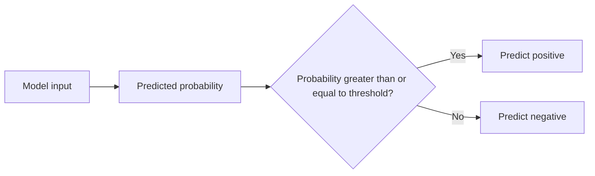
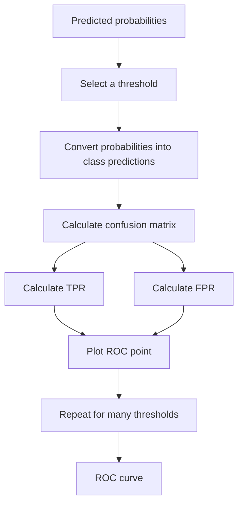
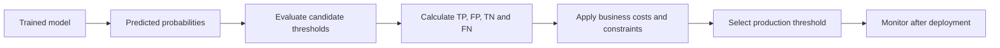
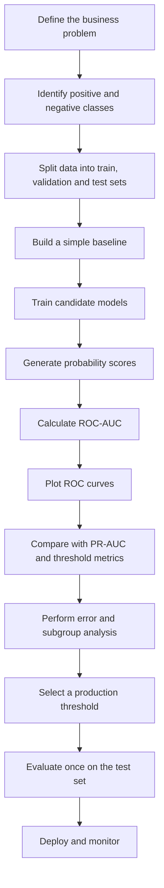
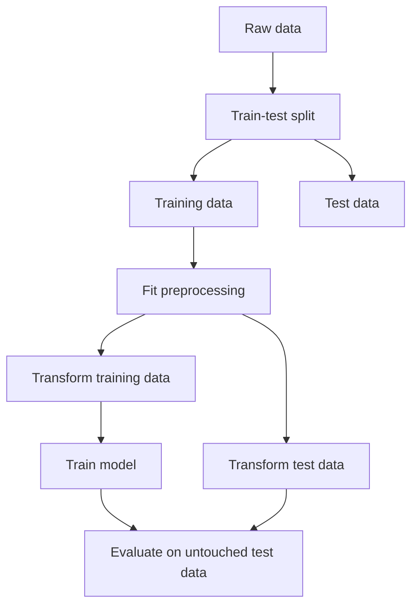

# 018 - ROC-AUC

**Course:** 03 - Machine Learning and Deep Learning
**Module:** Module 06 - Machine Learning
**Content Group:** Model Evaluation
**Roadmap Source:** Machine Learning / Model Evaluation
**Lesson Type:** Machine Learning
**Order in Module:** 018
**Suggested Duration:** 26 minutes

---

## 1. Summary

This lesson explains **ROC-AUC**, a widely used evaluation metric for binary classification models.

After completing this lesson, you should understand:

* What the ROC curve represents.
* How True Positive Rate and False Positive Rate are calculated.
* What the AUC score means.
* How ROC-AUC evaluates a model across different classification thresholds.
* When ROC-AUC is useful and when another metric may be more appropriate.
* How to calculate and visualize ROC-AUC using Python and scikit-learn.

ROC-AUC is particularly useful when a model produces a **probability score** rather than only a final class prediction.

---

## 2. Learning Objectives

By the end of this lesson, you should be able to:

* Explain ROC-AUC in your own words.
* Calculate True Positive Rate and False Positive Rate.
* Describe how a classification threshold changes model predictions.
* Interpret an ROC curve.
* Interpret common AUC values.
* Calculate ROC-AUC using scikit-learn.
* Compare multiple classification models using ROC-AUC.
* Identify cases where ROC-AUC can be misleading.
* Connect ROC-AUC to business decisions and model deployment.

---

## 3. Classification Probabilities and Thresholds

Many classification models return a probability rather than directly returning a class.

For example, a fraud detection model may return:

```text
Transaction A -> 0.92 probability of fraud
Transaction B -> 0.67 probability of fraud
Transaction C -> 0.31 probability of fraud
Transaction D -> 0.08 probability of fraud
```

A classification threshold converts probabilities into class predictions.

With a threshold of `0.50`:

```text
Probability >= 0.50 -> Positive class
Probability < 0.50  -> Negative class
```

Therefore:

```text
Transaction A -> Fraud
Transaction B -> Fraud
Transaction C -> Not fraud
Transaction D -> Not fraud
```

However, the threshold does not have to be `0.50`.



Changing the threshold changes the balance between:

* Detecting more positive examples.
* Producing more false alarms.

---

## 4. Confusion Matrix Review

ROC-AUC is based on values from the confusion matrix.

| Actual / Predicted | Predicted Positive | Predicted Negative |
| ------------------ | -----------------: | -----------------: |
| Actual Positive    |  True Positive, TP | False Negative, FN |
| Actual Negative    | False Positive, FP |  True Negative, TN |

### True Positive

The model correctly predicts the positive class.

Example:

```text
A fraudulent transaction is predicted as fraud.
```

### False Positive

The model incorrectly predicts the positive class.

Example:

```text
A legitimate transaction is predicted as fraud.
```

### True Negative

The model correctly predicts the negative class.

Example:

```text
A legitimate transaction is predicted as legitimate.
```

### False Negative

The model incorrectly predicts the negative class.

Example:

```text
A fraudulent transaction is predicted as legitimate.
```

---

## 5. True Positive Rate

The **True Positive Rate**, or **TPR**, measures the proportion of actual positive examples that the model correctly identifies.

It is also called:

* Recall
* Sensitivity
* Hit rate

The formula is:

$$
\text{TPR} = \frac{\text{TP}} {\text{TP}+\text{FN}}
$$

For example, suppose:

* True Positives = 80
* False Negatives = 20

Then:

$$
\text{TPR} = # \frac{80}{80+20} 0.80
$$

The model identifies 80% of all actual positive examples.

---

## 6. False Positive Rate

The **False Positive Rate**, or **FPR**, measures the proportion of actual negative examples that the model incorrectly predicts as positive.

The formula is:

$$
\text{FPR} = \frac{\text{FP}} {\text{FP}+\text{TN}}
$$

For example, suppose:

* False Positives = 30
* True Negatives = 70

Then:

$$
\text{FPR} = # \frac{30}{30+70} 0.30
$$

The model incorrectly flags 30% of actual negative examples as positive.

FPR can also be written using specificity:

$$
\text{FPR} = 1-\text{Specificity}
$$

where:

$$
\text{Specificity} = \frac{\text{TN}} {\text{TN}+\text{FP}}
$$

---

## 7. What Is the ROC Curve?

**ROC** stands for **Receiver Operating Characteristic**.

The ROC curve shows the relationship between:

* **True Positive Rate** on the vertical axis.
* **False Positive Rate** on the horizontal axis.

The model is evaluated using many different classification thresholds.

```text
Vertical axis:   True Positive Rate
Horizontal axis: False Positive Rate
```

Each point on the ROC curve represents the model's performance at one threshold.



---

## 8. How the Threshold Affects the ROC Curve

Consider the following predicted probabilities:

| Sample | Actual Class | Predicted Probability |
| ------ | -----------: | --------------------: |
| A      |            1 |                  0.95 |
| B      |            0 |                  0.85 |
| C      |            1 |                  0.70 |
| D      |            1 |                  0.60 |
| E      |            0 |                  0.40 |
| F      |            0 |                  0.10 |

### High Threshold

Suppose the threshold is `0.90`.

Only Sample A is predicted as positive.

This usually produces:

* A low False Positive Rate.
* A lower True Positive Rate.

### Lower Threshold

Suppose the threshold is `0.50`.

Samples A, B, C, and D are predicted as positive.

This usually produces:

* A higher True Positive Rate.
* A higher False Positive Rate.

### Very Low Threshold

Suppose the threshold is `0.05`.

Almost every sample is predicted as positive.

This produces:

* A True Positive Rate close to 1.
* A False Positive Rate close to 1.

The ROC curve records these trade-offs across all thresholds.

---

## 9. Interpreting the ROC Curve

A perfect classifier reaches the top-left corner:

$$
\text{FPR}=0
$$

and:

$$
\text{TPR}=1
$$

This means:

* All positive examples are detected.
* No negative examples are incorrectly classified as positive.

A random classifier usually follows the diagonal line:

$$
\text{TPR}=\text{FPR}
$$

Conceptually:

```text
TPR
1.0 |          Perfect model
    |         _________
    |       /
    |     /
    |   /
    | /   Better models move toward the top-left corner
0.0 +---------------------------- FPR
    0.0                         1.0
```

The closer the ROC curve is to the top-left corner, the better the model is at separating the two classes.

---

## 10. What Is AUC?

**AUC** stands for **Area Under the Curve**.

It measures the area under the ROC curve.

The value normally ranges from `0` to `1`.

$$
0 \leq \text{AUC} \leq 1
$$

A higher AUC generally indicates that the model is better at ranking positive examples above negative examples.

### Common Interpretation

|  AUC Value | General Interpretation       |
| ---------: | ---------------------------- |
|       1.00 | Perfect separation           |
|  0.90–0.99 | Excellent                    |
|  0.80–0.89 | Good                         |
|  0.70–0.79 | Fair                         |
|  0.60–0.69 | Weak                         |
|       0.50 | Equivalent to random ranking |
| Below 0.50 | Worse than random ranking    |

These ranges are only general guidelines. The required performance depends on the problem, dataset, risk, and business context.

---

## 11. Probabilistic Interpretation of AUC

AUC has a useful ranking interpretation.

An AUC of `0.85` approximately means:

> There is an 85% probability that the model assigns a higher score to a randomly selected positive example than to a randomly selected negative example.

Suppose:

```text
Positive sample score = 0.82
Negative sample score = 0.37
```

The model ranks the positive sample above the negative sample.

AUC evaluates this ranking behavior across many positive-negative pairs.

It does not directly measure whether the predicted probabilities are well calibrated.

---

## 12. ROC-AUC Calculation

Conceptually, AUC is the integral of the True Positive Rate over the False Positive Rate.

$$
\text{AUC} = \int_{0}^{1} \text{TPR}(\text{FPR}),d(\text{FPR})
$$

In practice, software usually approximates the area using the trapezoidal rule.

For two neighboring ROC points:

$$
(x_1,y_1)
$$

and:

$$
(x_2,y_2)
$$

the trapezoid area is:

$$
\text{Area} = (x_2-x_1) \frac{y_1+y_2}{2}
$$

The total AUC is the sum of the areas of all trapezoids under the ROC curve.

You usually do not calculate this manually because libraries such as scikit-learn provide reliable implementations.

---

## 13. Basic Python Example

```python
from sklearn.metrics import roc_auc_score

y_true = [0, 0, 1, 1]
y_score = [0.10, 0.40, 0.35, 0.80]

auc = roc_auc_score(y_true, y_score)

print(f"ROC-AUC: {auc:.3f}")
```

Expected output:

```text
ROC-AUC: 0.750
```

Notice that `roc_auc_score` receives probability scores, not thresholded class predictions.

Correct:

```python
roc_auc_score(y_test, y_probability)
```

Usually incorrect:

```python
roc_auc_score(y_test, y_prediction)
```

Using binary class predictions removes most of the ranking information that ROC-AUC is designed to evaluate.

---

## 14. Training a Model and Calculating ROC-AUC

```python
from sklearn.datasets import make_classification
from sklearn.linear_model import LogisticRegression
from sklearn.model_selection import train_test_split
from sklearn.metrics import roc_auc_score

# Create a binary classification dataset
X, y = make_classification(
    n_samples=2000,
    n_features=12,
    n_informative=7,
    n_redundant=2,
    weights=[0.75, 0.25],
    random_state=42,
)

# Split the data
X_train, X_test, y_train, y_test = train_test_split(
    X,
    y,
    test_size=0.2,
    stratify=y,
    random_state=42,
)

# Train the model
model = LogisticRegression(max_iter=1000)
model.fit(X_train, y_train)

# Get probabilities for the positive class
y_probability = model.predict_proba(X_test)[:, 1]

# Calculate ROC-AUC
auc = roc_auc_score(y_test, y_probability)

print(f"Test ROC-AUC: {auc:.3f}")
```

The expression:

```python
model.predict_proba(X_test)[:, 1]
```

selects the predicted probability of the positive class.

---

## 15. Plotting the ROC Curve

```python
import matplotlib.pyplot as plt

from sklearn.metrics import RocCurveDisplay

RocCurveDisplay.from_predictions(
    y_test,
    y_probability,
    name="Logistic Regression",
)

plt.plot(
    [0, 1],
    [0, 1],
    linestyle="--",
    label="Random classifier",
)

plt.xlabel("False Positive Rate")
plt.ylabel("True Positive Rate")
plt.title("ROC Curve")
plt.legend()
plt.show()
```

The diagonal line represents random ranking.

A useful model should generally produce an ROC curve above this line.

---

## 16. Comparing Multiple Models

ROC-AUC is commonly used to compare the ranking ability of several classification models.

```python
import matplotlib.pyplot as plt

from sklearn.ensemble import RandomForestClassifier
from sklearn.linear_model import LogisticRegression
from sklearn.metrics import RocCurveDisplay, roc_auc_score

models = {
    "Logistic Regression": LogisticRegression(max_iter=1000),
    "Random Forest": RandomForestClassifier(
        n_estimators=300,
        random_state=42,
    ),
}

for model_name, model in models.items():
    model.fit(X_train, y_train)

    y_probability = model.predict_proba(X_test)[:, 1]
    auc = roc_auc_score(y_test, y_probability)

    print(f"{model_name}: {auc:.3f}")

    RocCurveDisplay.from_predictions(
        y_test,
        y_probability,
        name=f"{model_name} (AUC={auc:.3f})",
    )

plt.plot(
    [0, 1],
    [0, 1],
    linestyle="--",
    label="Random classifier",
)

plt.xlabel("False Positive Rate")
plt.ylabel("True Positive Rate")
plt.title("ROC Curve Comparison")
plt.legend()
plt.show()
```

A model with a higher ROC-AUC usually has better overall ranking ability.

However, the model with the highest ROC-AUC is not automatically the best production model.

You should also consider:

* Precision.
* Recall.
* False-positive cost.
* False-negative cost.
* Prediction latency.
* Probability calibration.
* Explainability.
* Stability over time.
* Performance on important subgroups.

---

## 17. ROC-AUC Versus Accuracy

Accuracy measures the proportion of correct final predictions.

$$
\text{Accuracy} = \frac{\text{TP}+\text{TN}} {\text{TP}+\text{TN}+\text{FP}+\text{FN}}
$$

ROC-AUC evaluates ranking performance across multiple thresholds.

| Property                               | Accuracy | ROC-AUC    |
| -------------------------------------- | -------- | ---------- |
| Uses final class predictions           | Yes      | Usually no |
| Uses probability scores                | No       | Yes        |
| Depends on one threshold               | Yes      | No         |
| Evaluates ranking ability              | No       | Yes        |
| Can be misleading with imbalance       | Yes      | Sometimes  |
| Helps compare models across thresholds | Limited  | Yes        |

Example:

A model may have high accuracy because the negative class dominates the dataset, while still ranking positive examples poorly.

ROC-AUC gives additional information about class separation.

---

## 18. ROC-AUC Versus F1-Score

The F1-score is the harmonic mean of precision and recall.

$$
F_1 = 2 \cdot \frac{\text{Precision}\cdot\text{Recall}} {\text{Precision}+\text{Recall}}
$$

| Property                               | F1-Score | ROC-AUC |
| -------------------------------------- | -------- | ------- |
| Depends on a classification threshold  | Yes      | No      |
| Uses predicted probabilities directly  | No       | Yes     |
| Includes precision                     | Yes      | No      |
| Measures ranking ability               | No       | Yes     |
| Useful when the positive class matters | Yes      | Yes     |
| Sensitive to selected threshold        | Yes      | No      |

Use F1-score when:

* You already have a meaningful decision threshold.
* You care about balancing precision and recall.
* The positive class is especially important.

Use ROC-AUC when:

* You want to evaluate ranking quality.
* The final threshold has not been selected.
* You want to compare models across all thresholds.

---

## 19. ROC-AUC Versus PR-AUC

The Precision-Recall curve plots:

* Precision on one axis.
* Recall on the other axis.

PR-AUC is often more informative than ROC-AUC when the positive class is very rare.

For example:

```text
99,900 legitimate transactions
100 fraudulent transactions
```

A model may achieve a strong ROC-AUC while still producing too many false positives for operational use.

| Situation                                  | Recommended Metric               |
| ------------------------------------------ | -------------------------------- |
| Classes are reasonably balanced            | ROC-AUC can be appropriate       |
| Positive class is very rare                | Consider PR-AUC                  |
| False positives are expensive              | Examine precision and FPR        |
| False negatives are expensive              | Examine recall and TPR           |
| Threshold has not been chosen              | ROC-AUC or PR-AUC                |
| Production decisions use a fixed threshold | Evaluate threshold-based metrics |

ROC-AUC and PR-AUC answer different questions.

ROC-AUC asks:

> How well does the model rank positive examples above negative examples?

PR-AUC asks:

> How well does the model identify positive examples while maintaining precision?

---

## 20. Why ROC-AUC Can Be Misleading

### 20.1 Extreme Class Imbalance

When the negative class is very large, the False Positive Rate may remain small even when the absolute number of false positives is operationally unacceptable.

Suppose:

```text
Negative examples = 1,000,000
False positives = 5,000
```

Then:

$$
\text{FPR} = # \frac{5{,}000}{1{,}000{,}000} 0.005
$$

The FPR is only 0.5%, but 5,000 false alerts may still be too expensive.

### 20.2 AUC Does Not Select a Threshold

AUC evaluates all thresholds together.

It does not tell you which threshold should be used in production.

### 20.3 AUC Does Not Measure Calibration

A model can have excellent ranking performance but poorly calibrated probabilities.

For example:

```text
Model A predictions: 0.60, 0.55, 0.40, 0.35
Model B predictions: 0.95, 0.90, 0.10, 0.05
```

If both models rank the examples in the same order, they may have similar AUC values even though their probability estimates are very different.

Use metrics such as:

* Log loss.
* Brier score.
* Calibration curves.

to evaluate probability quality.

### 20.4 Business Costs Are Not Included

ROC-AUC treats ranking errors abstractly.

It does not automatically account for:

* The financial cost of false positives.
* The safety impact of false negatives.
* Customer experience.
* Investigation capacity.
* Legal or operational constraints.

### 20.5 Curves Can Cross

Two models may have similar AUC scores while performing differently in important FPR regions.

For example:

* Model A may be better when FPR must stay below 1%.
* Model B may be better when FPR up to 20% is acceptable.

Therefore, inspect the ROC curve instead of only comparing one summary number.

---

## 21. Choosing a Production Threshold

After selecting a model, you still need to choose a classification threshold.

Possible threshold strategies include:

### Maximize Youden's J Statistic

$$
J = \text{TPR}-\text{FPR}
$$

The selected threshold maximizes the distance between the ROC curve and the random-classifier line.

```python
import numpy as np

from sklearn.metrics import roc_curve

fpr, tpr, thresholds = roc_curve(y_test, y_probability)

j_scores = tpr - fpr
best_index = np.argmax(j_scores)

best_threshold = thresholds[best_index]

print(f"Best threshold: {best_threshold:.3f}")
print(f"TPR: {tpr[best_index]:.3f}")
print(f"FPR: {fpr[best_index]:.3f}")
```

However, this threshold is not always the best business threshold.

### Limit the False Positive Rate

For example:

```text
Choose the highest-recall threshold where FPR is below 2%.
```

### Achieve a Minimum Recall

For example:

```text
Choose a threshold that detects at least 95% of fraudulent transactions.
```

### Minimize Expected Business Cost

A simple cost function can be written as:

$$
\text{Total Cost} = C_{\text{FP}}\cdot \text{FP} + C_{\text{FN}}\cdot \text{FN}
$$

where:

* $C_{\text{FP}}$ is the cost of one false positive.
* $C_{\text{FN}}$ is the cost of one false negative.

The best threshold minimizes the total expected cost.



---

## 22. Partial ROC-AUC

Sometimes only a specific False Positive Rate region matters.

For example, a medical screening system may require:

$$
\text{FPR} \leq 0.05
$$

In this case, the full ROC-AUC may hide performance in the important low-FPR region.

Scikit-learn can calculate a standardized partial AUC:

```python
from sklearn.metrics import roc_auc_score

partial_auc = roc_auc_score(
    y_test,
    y_probability,
    max_fpr=0.05,
)

print(f"Partial ROC-AUC: {partial_auc:.3f}")
```

Partial AUC is useful when production constraints limit the acceptable False Positive Rate.

---

## 23. Multiclass ROC-AUC

ROC-AUC was originally designed for binary classification, but it can be extended to multiclass problems.

Common strategies are:

### One-vs-Rest

For each class:

```text
Current class -> Positive
All other classes -> Negative
```

An AUC score is calculated for every class.

### One-vs-One

AUC is calculated for every pair of classes and then aggregated.

Example:

```python
from sklearn.metrics import roc_auc_score

y_probability = model.predict_proba(X_test)

auc_ovr = roc_auc_score(
    y_test,
    y_probability,
    multi_class="ovr",
    average="macro",
)

print(f"Multiclass ROC-AUC: {auc_ovr:.3f}")
```

Possible averaging methods include:

* `macro`: gives every class equal importance.
* `weighted`: weights each class by its number of examples.
* `micro`: aggregates decisions across all classes where supported.

For imbalanced multiclass datasets, report per-class AUC values in addition to an overall average.

---

## 24. Macro and Weighted AUC

Suppose a dataset contains three classes:

| Class | Number of Samples | Class AUC |
| ----- | ----------------: | --------: |
| A     |               800 |      0.92 |
| B     |               150 |      0.78 |
| C     |                50 |      0.60 |

### Macro Average

The macro average gives each class equal weight.

$$
\text{Macro AUC} = # \frac{0.92+0.78+0.60}{3} 0.767
$$

### Weighted Average

The weighted average gives more influence to larger classes.

$$
\text{Weighted AUC} = \frac{ 800(0.92)+150(0.78)+50(0.60) }{ 800+150+50 }
$$

$$
\text{Weighted AUC} = 0.883
$$

The weighted score appears much stronger because the largest class performs well.

Therefore, macro AUC is often useful when minority classes are important.

---

## 25. Cross-Validated ROC-AUC

A single train-test split may produce an unstable estimate.

Cross-validation gives a more reliable evaluation.

```python
from sklearn.linear_model import LogisticRegression
from sklearn.model_selection import StratifiedKFold, cross_val_score

model = LogisticRegression(max_iter=1000)

cv = StratifiedKFold(
    n_splits=5,
    shuffle=True,
    random_state=42,
)

scores = cross_val_score(
    model,
    X,
    y,
    cv=cv,
    scoring="roc_auc",
)

print("Fold scores:", scores)
print(f"Mean ROC-AUC: {scores.mean():.3f}")
print(f"Standard deviation: {scores.std():.3f}")
```

Report both the mean and variability:

```text
ROC-AUC = 0.87 ± 0.02
```

This is more informative than reporting only one score.

---

## 26. End-to-End Evaluation Workflow



A strong evaluation should include more than one metric.

Example evaluation table:

| Model               | ROC-AUC | PR-AUC | Precision | Recall |   F1 | Inference Time |
| ------------------- | ------: | -----: | --------: | -----: | ---: | -------------: |
| Baseline            |    0.61 |   0.18 |      0.30 |   0.42 | 0.35 |           2 ms |
| Logistic Regression |    0.82 |   0.48 |      0.61 |   0.66 | 0.63 |           4 ms |
| Random Forest       |    0.88 |   0.57 |      0.70 |   0.63 | 0.66 |          25 ms |
| XGBoost             |    0.91 |   0.63 |      0.73 |   0.69 | 0.71 |          15 ms |

The final choice should reflect business requirements, not only the highest AUC.

---

## 27. Data Leakage Warning

Data leakage can produce an unrealistically high ROC-AUC.

Common leakage examples include:

* Scaling the entire dataset before splitting.
* Selecting features using the test set.
* Including information created after the prediction time.
* Including the target or a target-derived feature.
* Allowing the same customer to appear in both train and test sets.
* Using future observations to predict past events.
* Tuning the model repeatedly on the final test set.

Incorrect workflow:

```text
Full dataset
    |
Preprocessing and feature selection
    |
Train-test split
```

Correct workflow:



A very high ROC-AUC should be investigated carefully, especially when the task is expected to be difficult.

---

## 28. Error Analysis

ROC-AUC summarizes performance but does not explain model errors.

After calculating ROC-AUC, inspect:

* False positives.
* False negatives.
* Performance across important subgroups.
* Performance over time.
* Performance at the selected threshold.
* Features associated with large errors.
* Samples with uncertain probabilities.
* Samples with unexpectedly confident predictions.

Example questions:

```text
Are most false negatives from new customers?

Does performance decrease for a specific geographic region?

Does the model perform worse on recently collected data?

Are false positives concentrated in one product category?

Does the model fail when important input features are missing?
```

A model can have a strong overall ROC-AUC while performing poorly for an important subgroup.

---

## 29. Common Mistakes

### Mistake 1: Passing Class Predictions Instead of Probabilities

Incorrect:

```python
y_prediction = model.predict(X_test)
roc_auc_score(y_test, y_prediction)
```

Recommended:

```python
y_probability = model.predict_proba(X_test)[:, 1]
roc_auc_score(y_test, y_probability)
```

### Mistake 2: Evaluating on Training Data

A high training AUC does not prove that the model generalizes.

Always evaluate using validation or test data.

### Mistake 3: Using the Test Set for Model Selection

The test set should be used only after model and hyperparameter decisions are complete.

### Mistake 4: Ignoring Class Imbalance

For rare-event detection, inspect PR-AUC, precision, recall, and the number of false positives.

### Mistake 5: Assuming AUC Chooses the Best Threshold

AUC compares ranking performance across thresholds but does not identify the best business decision threshold.

### Mistake 6: Comparing AUC Scores from Different Test Sets

AUC scores should be compared on the same observations whenever possible.

### Mistake 7: Ignoring Uncertainty

A difference such as:

```text
Model A AUC = 0.884
Model B AUC = 0.887
```

may not be meaningful without confidence intervals or repeated cross-validation.

### Mistake 8: Selecting a Complex Model Without a Baseline

Always compare against a simple baseline such as:

* Random scores.
* Majority-class prediction.
* Logistic Regression.
* A simple rule-based model.

---

## 30. Practical Exercise

Use a binary classification dataset such as:

* Customer churn.
* Loan default.
* Fraud detection.
* Disease screening.
* Email spam detection.
* Employee attrition.

### Tasks

1. Load and inspect the dataset.
2. Identify the positive class.
3. Split the data into training and test sets.
4. Build a Logistic Regression baseline.
5. Train at least one additional model.
6. Generate predicted probabilities.
7. Calculate ROC-AUC for each model.
8. Plot the ROC curves.
9. Calculate Precision, Recall, F1-score, and PR-AUC.
10. Select a candidate production threshold.
11. Analyze false positives and false negatives.
12. Write a business recommendation.

### Suggested Experiment Table

| Experiment | Model               | Features   | ROC-AUC | PR-AUC | Threshold | Precision | Recall |
| ---------- | ------------------- | ---------- | ------: | -----: | --------: | --------: | -----: |
| E01        | Logistic Regression | Basic      |         |        |           |           |        |
| E02        | Random Forest       | Basic      |         |        |           |           |        |
| E03        | XGBoost             | Engineered |         |        |           |           |        |

---

## 31. Mini-Project Connection

### Project: Customer Churn Prediction

Build a model that predicts whether a customer will leave a subscription service.

### Possible Features

* Customer tenure.
* Monthly payment.
* Number of support requests.
* Product usage frequency.
* Contract type.
* Payment failures.
* Recent activity.
* Customer satisfaction score.

### Models

* Logistic Regression.
* Random Forest.
* Gradient Boosting.
* XGBoost or LightGBM.

### Evaluation Metrics

* ROC-AUC.
* PR-AUC.
* Precision.
* Recall.
* F1-score.
* Confusion matrix.
* Expected retention cost.

### Portfolio Artifacts

* Exploratory data analysis notebook.
* Model comparison table.
* ROC curve chart.
* Precision-Recall curve.
* Threshold analysis chart.
* Error analysis report.
* REST API returning churn probabilities.
* Dockerized prediction service.
* Monitoring dashboard.

---

## 32. Completion Checklist

* [ ] I can explain ROC-AUC in one or two minutes.
* [ ] I understand the difference between TPR and FPR.
* [ ] I understand how classification thresholds affect predictions.
* [ ] I can interpret an ROC curve.
* [ ] I can explain what an AUC of 0.50, 0.80, or 1.00 means.
* [ ] I can calculate ROC-AUC using scikit-learn.
* [ ] I use predicted probabilities rather than class predictions.
* [ ] I can compare ROC-AUC with Accuracy, F1-score, and PR-AUC.
* [ ] I understand why ROC-AUC may be misleading for highly imbalanced data.
* [ ] I can choose a threshold based on business constraints.
* [ ] I have recorded at least one caveat or assumption.
* [ ] I have created a notebook, chart, model, API, or portfolio note for this lesson.

---

## 33. Key Takeaways

1. The ROC curve plots True Positive Rate against False Positive Rate across classification thresholds.

2. True Positive Rate is calculated as:

$$
\text{TPR} = \frac{\text{TP}} {\text{TP}+\text{FN}}
$$

3. False Positive Rate is calculated as:

$$
\text{FPR} = \frac{\text{FP}} {\text{FP}+\text{TN}}
$$

4. AUC measures the area under the ROC curve.

5. ROC-AUC evaluates ranking ability rather than performance at one fixed threshold.

6. An AUC of `0.50` represents random ranking, while an AUC of `1.00` represents perfect separation.

7. ROC-AUC does not evaluate probability calibration.

8. ROC-AUC does not automatically choose a production threshold.

9. For highly imbalanced problems, PR-AUC may provide more useful information.

10. A good model must solve the business problem, not merely achieve a high evaluation score.

---

## 34. Related Outcome

Train, compare, and evaluate supervised and unsupervised machine learning models using appropriate metrics, careful feature engineering, and meaningful error analysis.

---

## 35. Related Project

**Mini Project:** House Price Prediction with exploratory data analysis, feature engineering, Linear Regression, Random Forest, and XGBoost comparison.

> Note: House price prediction is a regression problem, so ROC-AUC is not appropriate for its target variable. Use metrics such as MAE, RMSE, and $R^2$ instead.
>
> To practice ROC-AUC, use a classification project such as customer churn, fraud detection, loan default prediction, or disease screening.

---

## 36. Conclusion

**ROC-AUC** is an important metric for evaluating binary classification models.

It measures how effectively a model ranks positive examples above negative examples across many possible decision thresholds.

However, ROC-AUC should not be used alone. A complete evaluation should also consider:

* Class imbalance.
* Precision and recall.
* PR-AUC.
* Probability calibration.
* Threshold selection.
* Error analysis.
* Subgroup performance.
* Business costs.
* Deployment constraints.

Turn this lesson into a practical artifact such as a notebook, ROC curve, model comparison report, prediction API, Docker service, or portfolio project so that the concept becomes part of your applied machine learning workflow.

---

# Bài luyện tập

## Mục tiêu


## Đề bài


## Yêu cầu hoàn thành

- [ ] 
- [ ] 
- [ ] 

## Kết quả / lời giải


## Ghi chú
