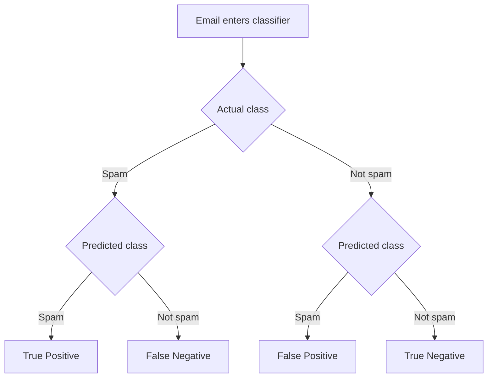
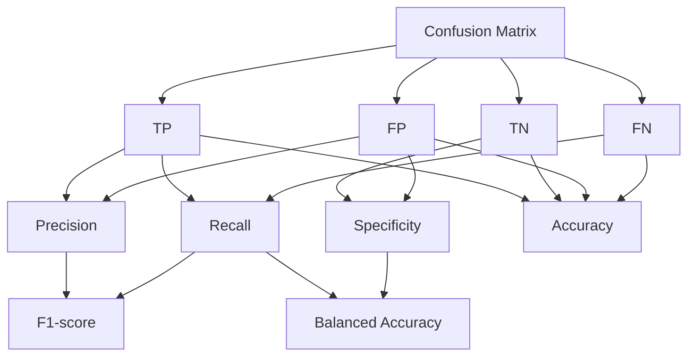
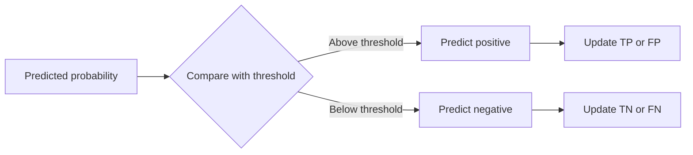
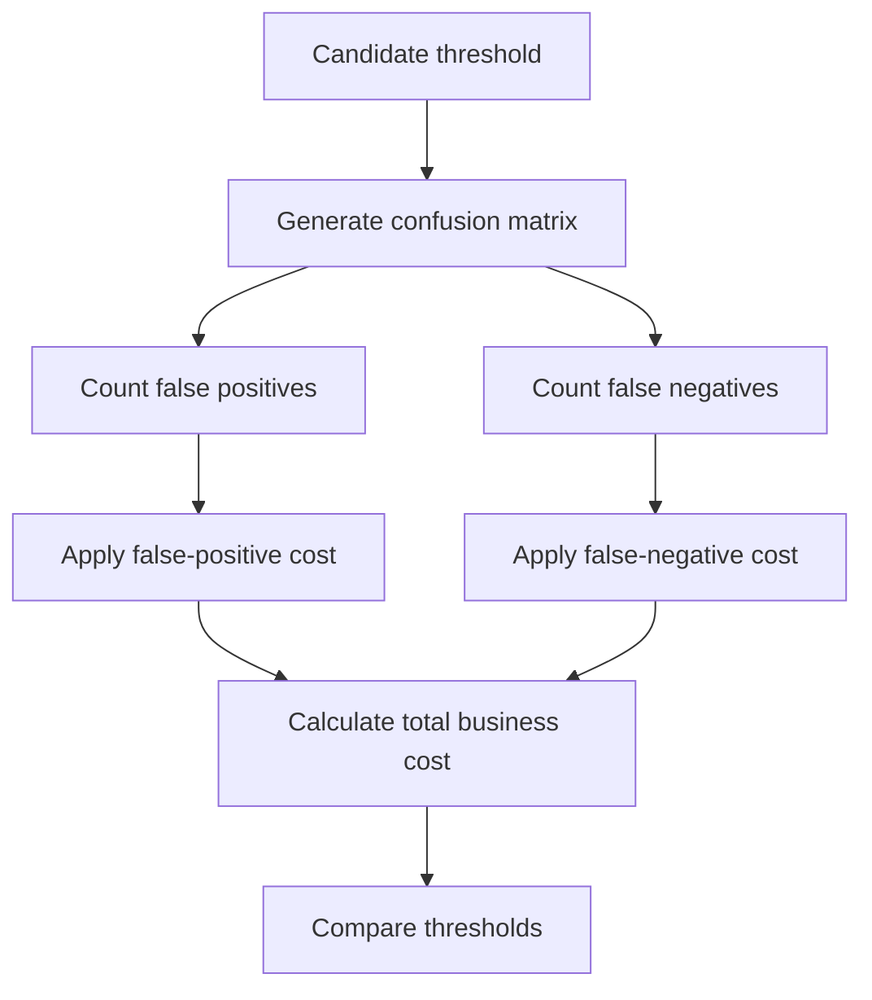
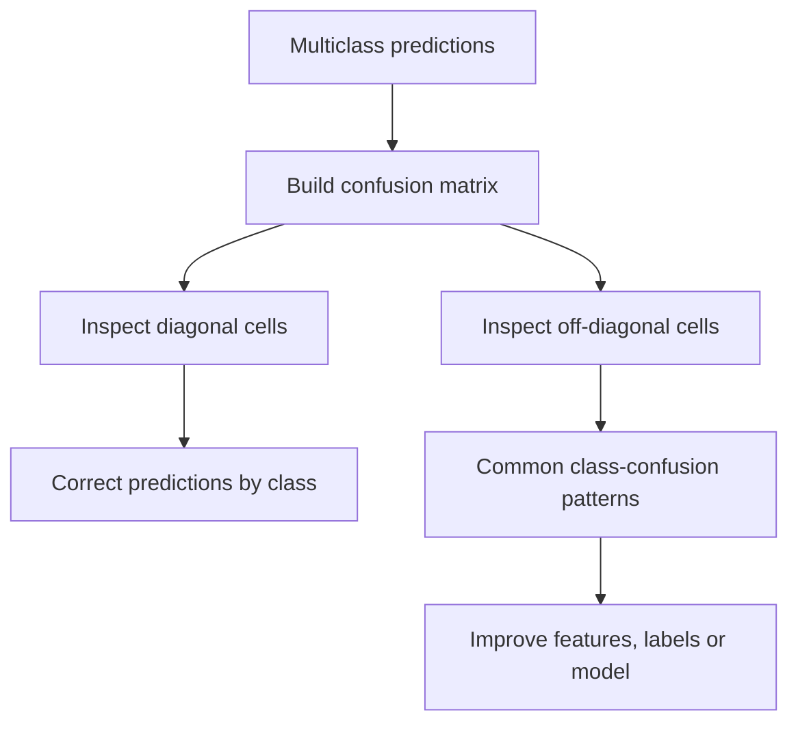
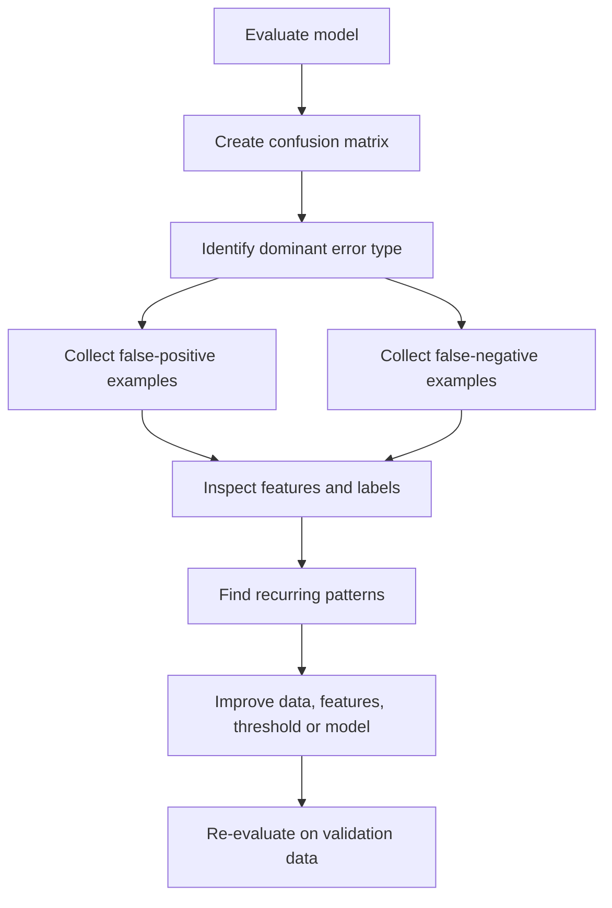
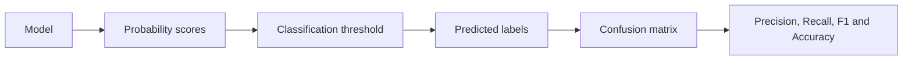
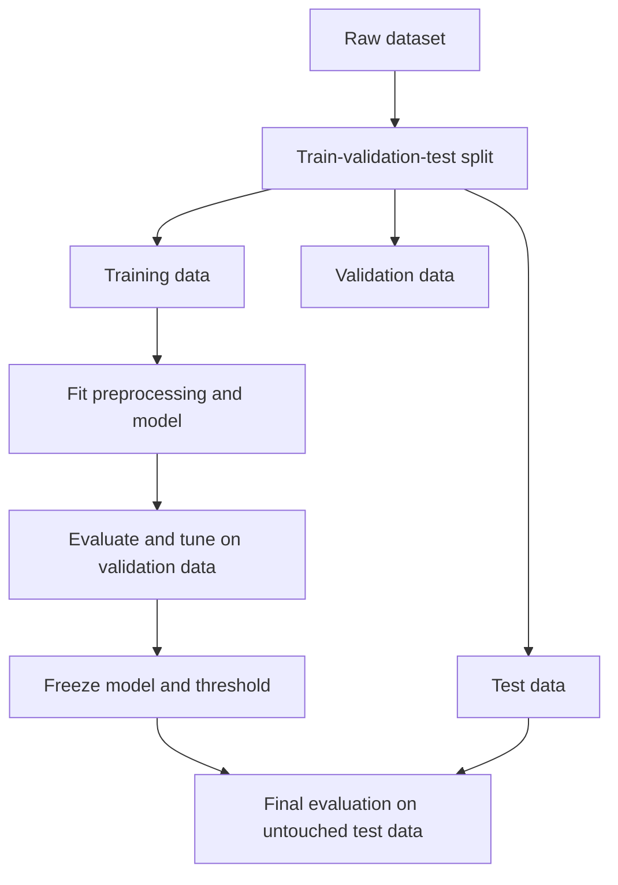
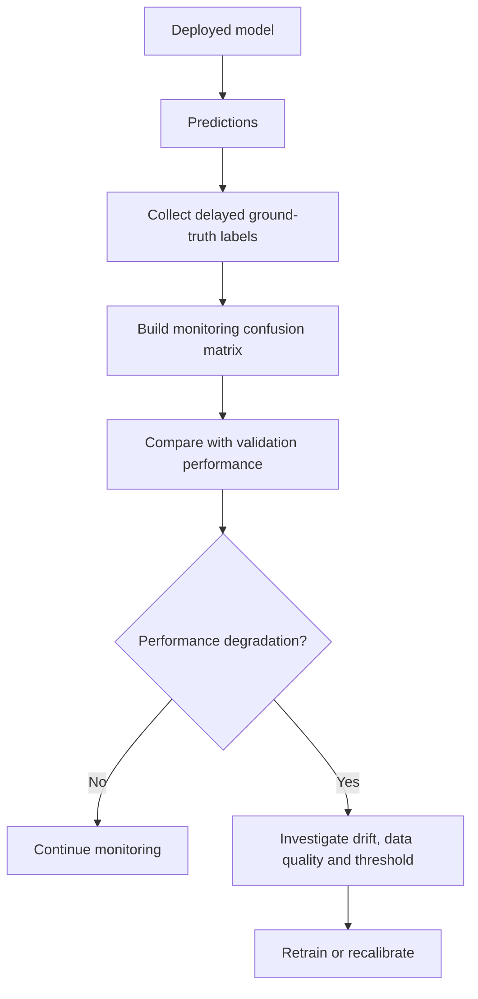
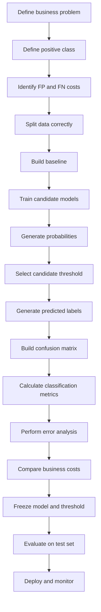

# 019 - Confusion Matrix

**Course:** 03 - Machine Learning and Deep Learning
**Module:** Module 06 - Machine Learning
**Content Group:** Model Evaluation
**Roadmap Source:** Machine Learning / Model Evaluation
**Lesson Type:** Machine Learning
**Order in Module:** 019
**Suggested Duration:** 26 minutes

---

## 1. Summary

This lesson explains the **Confusion Matrix**, one of the most important tools for evaluating classification models.

A confusion matrix shows how predicted classes compare with actual classes. Instead of presenting only one score, such as accuracy, it separates predictions into different types of correct and incorrect outcomes.

For binary classification, the four outcomes are:

* True Positive
* True Negative
* False Positive
* False Negative

Understanding these outcomes helps you choose appropriate metrics, analyze model errors, select decision thresholds, and connect model performance to business costs.

After completing this lesson, you should be able to create, interpret, visualize, and use a confusion matrix in a practical machine learning workflow.

---

## 2. Learning Objectives

By the end of this lesson, you should be able to:

* Explain a confusion matrix in your own words.
* Identify True Positives, True Negatives, False Positives, and False Negatives.
* Calculate Accuracy, Precision, Recall, Specificity, and F1-score from a confusion matrix.
* Interpret confusion matrices for binary and multiclass classification.
* Create a confusion matrix using Python and scikit-learn.
* Normalize a confusion matrix.
* Analyze model errors using confusion-matrix values.
* Select metrics based on business consequences.
* Recognize common mistakes such as label-order confusion and data leakage.

---

## 3. What Is a Confusion Matrix?

A **confusion matrix** is a table that compares:

* The actual class of each observation.
* The class predicted by the model.

It answers questions such as:

* How many positive examples were detected correctly?
* How many negative examples were classified correctly?
* How many false alarms did the model produce?
* How many positive examples did the model miss?

For a binary classification problem, the confusion matrix is:

| Actual / Predicted | Predicted Positive | Predicted Negative |
| ------------------ | -----------------: | -----------------: |
| Actual Positive    |  True Positive, TP | False Negative, FN |
| Actual Negative    | False Positive, FP |  True Negative, TN |

A confusion matrix provides more information than accuracy because it shows the types of mistakes made by the model.

---

## 4. Binary Classification Example

Suppose a model predicts whether an email is spam.

The positive class is:

```text
Spam
```

The negative class is:

```text
Not spam
```

Possible outcomes are:

| Actual Email | Prediction | Outcome        |
| ------------ | ---------- | -------------- |
| Spam         | Spam       | True Positive  |
| Spam         | Not spam   | False Negative |
| Not spam     | Spam       | False Positive |
| Not spam     | Not spam   | True Negative  |



---

## 5. True Positive

A **True Positive**, or **TP**, occurs when:

* The actual class is positive.
* The model predicts positive.

Example:

```text
A fraudulent transaction is correctly predicted as fraud.
```

Other examples include:

* A spam email classified as spam.
* A sick patient classified as sick.
* A customer who will churn predicted as likely to churn.
* A defective product correctly detected as defective.

True Positives represent positive cases detected successfully by the model.

---

## 6. True Negative

A **True Negative**, or **TN**, occurs when:

* The actual class is negative.
* The model predicts negative.

Example:

```text
A legitimate transaction is correctly predicted as legitimate.
```

Other examples include:

* A normal email classified as not spam.
* A healthy patient classified as healthy.
* A customer who stays predicted as not likely to churn.
* A non-defective product classified as acceptable.

True Negatives represent negative cases rejected correctly by the model.

---

## 7. False Positive

A **False Positive**, or **FP**, occurs when:

* The actual class is negative.
* The model predicts positive.

It is also called a **Type I error** in statistical testing.

Example:

```text
A legitimate transaction is incorrectly flagged as fraud.
```

Possible consequences include:

* A legitimate payment is blocked.
* A normal email is placed in the spam folder.
* A healthy patient is sent for unnecessary testing.
* A loyal customer receives an unnecessary retention discount.
* A safe product is removed from production.

False Positives are often described as **false alarms**.

---

## 8. False Negative

A **False Negative**, or **FN**, occurs when:

* The actual class is positive.
* The model predicts negative.

It is also called a **Type II error** in statistical testing.

Example:

```text
A fraudulent transaction is incorrectly predicted as legitimate.
```

Possible consequences include:

* Fraud is not detected.
* A spam email reaches the inbox.
* A disease is missed.
* A customer who will churn receives no intervention.
* A defective product reaches the customer.

False Negatives represent positive cases missed by the model.

---

## 9. Confusion Matrix Layout

A common confusion matrix layout is:

|                 | Predicted Negative | Predicted Positive |
| --------------- | -----------------: | -----------------: |
| Actual Negative |                 TN |                 FP |
| Actual Positive |                 FN |                 TP |

However, some libraries, books, and dashboards use different row and column orders.

For example, scikit-learn usually produces:

```text
[[TN, FP],
 [FN, TP]]
```

Therefore, always verify:

* Which axis represents actual labels.
* Which axis represents predicted labels.
* Which class is considered positive.
* What label order the library uses.

---

## 10. Worked Example

Suppose a fraud detection model evaluates 1,000 transactions.

The results are:

* True Positives = 70
* False Positives = 30
* False Negatives = 10
* True Negatives = 890

The confusion matrix is:

| Actual / Predicted | Predicted Fraud | Predicted Legitimate |
| ------------------ | --------------: | -------------------: |
| Actual Fraud       |              70 |                   10 |
| Actual Legitimate  |              30 |                  890 |

The total number of observations is:

$$
N = TP + TN + FP + FN
$$

$$
N = 70 + 890 + 30 + 10 = 1000
$$

From this table, we can observe:

* The model detected 70 fraudulent transactions.
* The model missed 10 fraudulent transactions.
* The model incorrectly blocked 30 legitimate transactions.
* The model correctly accepted 890 legitimate transactions.

---

## 11. Accuracy

**Accuracy** measures the proportion of all predictions that are correct.

$$
\text{Accuracy} = \frac{TP+TN} {TP+TN+FP+FN}
$$

Using the fraud example:

$$
\text{Accuracy} = \frac{70+890} {70+890+30+10}
$$

$$
\text{Accuracy} = # \frac{960}{1000} 0.96
$$

The model has an accuracy of 96%.

However, accuracy alone does not show whether the model detects fraud effectively.

---

## 12. Error Rate

The **Error Rate** measures the proportion of incorrect predictions.

$$
\text{Error Rate} = \frac{FP+FN} {TP+TN+FP+FN}
$$

It can also be written as:

$$
\text{Error Rate} = 1-\text{Accuracy}
$$

Using the example:

$$
\text{Error Rate} = # \frac{30+10}{1000} 0.04
$$

The model makes incorrect predictions for 4% of transactions.

---

## 13. Precision

**Precision** measures how many predicted positive cases are actually positive.

$$
\text{Precision} = \frac{TP} {TP+FP}
$$

Using the fraud example:

$$
\text{Precision} = \frac{70} {70+30} = 0.70
$$

The precision is 70%.

This means that 70% of transactions flagged as fraud are truly fraudulent.

Precision is important when False Positives are expensive.

Examples include:

* Blocking legitimate transactions.
* Sending unnecessary medical treatments.
* Suspending legitimate user accounts.
* Removing safe products from production.

---

## 14. Recall

**Recall** measures how many actual positive cases the model identifies correctly.

It is also called:

* Sensitivity
* True Positive Rate
* Hit rate

$$
\text{Recall} = \frac{TP} {TP+FN}
$$

Using the example:

$$
\text{Recall} = \frac{70} {70+10} = 0.875
$$

The recall is 87.5%.

This means that the model detects 87.5% of all fraudulent transactions.

Recall is important when False Negatives are expensive.

Examples include:

* Missing a serious disease.
* Allowing fraud to proceed.
* Failing to detect a dangerous defect.
* Missing a security attack.

---

## 15. Specificity

**Specificity** measures how many actual negative cases are correctly classified as negative.

It is also called the **True Negative Rate**.

$$
\text{Specificity} = \frac{TN} {TN+FP}
$$

Using the example:

$$
\text{Specificity} = \frac{890} {890+30}
$$

$$
\text{Specificity}
\approx
0.967
$$

The model correctly accepts approximately 96.7% of legitimate transactions.

---

## 16. False Positive Rate

The **False Positive Rate**, or **FPR**, measures the proportion of actual negative cases incorrectly classified as positive.

$$
\text{FPR} = \frac{FP} {FP+TN}
$$

Using the example:

$$
\text{FPR} = \frac{30} {30+890}
$$

$$
\text{FPR}
\approx
0.033
$$

The model incorrectly flags approximately 3.3% of legitimate transactions.

FPR is related to specificity:

$$
\text{FPR} = 1-\text{Specificity}
$$

---

## 17. False Negative Rate

The **False Negative Rate**, or **FNR**, measures the proportion of actual positive cases missed by the model.

$$
\text{FNR} = \frac{FN} {FN+TP}
$$

Using the example:

$$
\text{FNR} = \frac{10} {10+70} = 0.125
$$

The model misses 12.5% of fraudulent transactions.

FNR is related to recall:

$$
\text{FNR} = 1-\text{Recall}
$$

---

## 18. Negative Predictive Value

The **Negative Predictive Value**, or **NPV**, measures how many predicted negative cases are actually negative.

$$
\text{NPV} = \frac{TN} {TN+FN}
$$

Using the example:

$$
\text{NPV} = \frac{890} {890+10}
$$

$$
\text{NPV}
\approx
0.989
$$

Approximately 98.9% of transactions predicted as legitimate are actually legitimate.

---

## 19. F1-Score

The **F1-score** combines Precision and Recall using their harmonic mean.

$$
F_1 = 2 \cdot \frac{ \text{Precision}\cdot\text{Recall} }{ \text{Precision}+\text{Recall} }
$$

It can also be calculated directly from the confusion matrix:

$$
F_1 = \frac{2TP} {2TP+FP+FN}
$$

Using the fraud example:

$$
F_1 = \frac{2(70)} {2(70)+30+10}
$$

$$
F_1 = \frac{140}{180} \approx 0.778
$$

The F1-score is approximately 0.778.

F1-score is useful when:

* Both False Positives and False Negatives matter.
* The positive class is important.
* The class distribution is imbalanced.
* You need one score that balances Precision and Recall.

---

## 20. Balanced Accuracy

**Balanced Accuracy** gives equal importance to the positive and negative classes.

$$
\text{Balanced Accuracy} = \frac{ \text{Recall}+\text{Specificity} }{2}
$$

Using the example:

$$
\text{Balanced Accuracy} = \frac{0.875+0.967}{2}
$$

$$
\text{Balanced Accuracy}
\approx
0.921
$$

Balanced Accuracy is often more informative than ordinary Accuracy for imbalanced datasets.

---

## 21. Metric Relationships

The confusion matrix is the foundation of many classification metrics.



---

## 22. Why Accuracy Can Be Misleading

Consider a disease-screening dataset:

```text
Healthy patients: 9,900
Sick patients:      100
Total patients:  10,000
```

Suppose a model predicts every patient as healthy.

Its confusion matrix is:

| Actual / Predicted | Predicted Sick | Predicted Healthy |
| ------------------ | -------------: | ----------------: |
| Actual Sick        |              0 |               100 |
| Actual Healthy     |              0 |             9,900 |

The accuracy is:

$$
\text{Accuracy} = # \frac{9900}{10000} 0.99
$$

The model achieves 99% accuracy.

However:

$$
\text{Recall} = # \frac{0}{0+100} 0
$$

The model detects none of the sick patients.

This example shows why the confusion matrix must be inspected when classes are imbalanced.

---

## 23. Choosing the Positive Class

The meaning of TP, FP, TN, and FN depends on which class is defined as positive.

For fraud detection:

```text
Positive = Fraud
Negative = Legitimate
```

For disease detection:

```text
Positive = Disease
Negative = Healthy
```

For customer churn:

```text
Positive = Churn
Negative = Stay
```

For spam detection:

```text
Positive = Spam
Negative = Not spam
```

The positive class is usually the class that:

* Represents the event of interest.
* Requires intervention.
* Is rarer.
* Has higher business or safety importance.

Always document the positive class before interpreting a confusion matrix.

---

## 24. Decision Threshold and the Confusion Matrix

Many classification models return probabilities.

For example:

```text
Customer A -> 0.82 probability of churn
Customer B -> 0.61 probability of churn
Customer C -> 0.45 probability of churn
Customer D -> 0.12 probability of churn
```

A threshold converts probabilities into class labels.

At a threshold of `0.50`:

```text
Probability >= 0.50 -> Predict churn
Probability < 0.50  -> Predict stay
```

Changing the threshold changes the confusion matrix.



### Lower Threshold

A lower threshold usually:

* Increases True Positives.
* Decreases False Negatives.
* Increases Recall.
* Increases False Positives.
* May decrease Precision.

### Higher Threshold

A higher threshold usually:

* Decreases False Positives.
* Increases Precision.
* Increases False Negatives.
* May decrease Recall.

The appropriate threshold depends on business costs and constraints.

---

## 25. Confusion Matrix at Different Thresholds

Suppose a fraud model produces the following outcomes.

### Threshold = 0.30

| Actual / Predicted | Predicted Fraud | Predicted Legitimate |
| ------------------ | --------------: | -------------------: |
| Actual Fraud       |              76 |                    4 |
| Actual Legitimate  |              90 |                  830 |

This threshold detects most fraud but creates many false alarms.

### Threshold = 0.50

| Actual / Predicted | Predicted Fraud | Predicted Legitimate |
| ------------------ | --------------: | -------------------: |
| Actual Fraud       |              70 |                   10 |
| Actual Legitimate  |              30 |                  890 |

This provides a more balanced trade-off.

### Threshold = 0.80

| Actual / Predicted | Predicted Fraud | Predicted Legitimate |
| ------------------ | --------------: | -------------------: |
| Actual Fraud       |              45 |                   35 |
| Actual Legitimate  |               8 |                  912 |

This produces fewer false alarms but misses more fraud.

There is no universally best confusion matrix. The best threshold depends on the problem.

---

## 26. Business Cost Matrix

Different mistakes can have different costs.

Suppose:

* One False Positive costs `$5`.
* One False Negative costs `$500`.

A simple cost function is:

$$
\text{Total Cost} = C_{FP}\cdot FP + C_{FN}\cdot FN
$$

For the example:

$$
\text{Total Cost} = 5(30)+500(10)
$$

$$
\text{Total Cost} = # 150+5000 5150
$$

A model with slightly lower accuracy may still be better if it reduces expensive False Negatives.

Example cost matrix:

| Actual / Predicted |  Predicted Positive |  Predicted Negative |
| ------------------ | ------------------: | ------------------: |
| Actual Positive    |     Correct benefit | False Negative cost |
| Actual Negative    | False Positive cost |     Correct benefit |



---

## 27. Creating a Confusion Matrix with Python

```python
from sklearn.metrics import confusion_matrix

y_true = [1, 0, 1, 1, 0, 0, 1, 0]
y_pred = [1, 0, 0, 1, 0, 1, 1, 0]

cm = confusion_matrix(y_true, y_pred)

print(cm)
```

Expected structure:

```text
[[TN, FP],
 [FN, TP]]
```

Possible output:

```text
[[3 1]
 [1 3]]
```

This means:

* True Negatives = 3
* False Positives = 1
* False Negatives = 1
* True Positives = 3

---

## 28. Extracting TN, FP, FN, and TP

```python
from sklearn.metrics import confusion_matrix

tn, fp, fn, tp = confusion_matrix(
    y_true,
    y_pred,
).ravel()

print(f"True Negatives: {tn}")
print(f"False Positives: {fp}")
print(f"False Negatives: {fn}")
print(f"True Positives: {tp}")
```

The `.ravel()` approach works directly for a two-class confusion matrix.

For multiclass classification, the matrix contains more than four values, so you should not use this approach.

---

## 29. Visualizing a Confusion Matrix

```python
import matplotlib.pyplot as plt

from sklearn.metrics import ConfusionMatrixDisplay

ConfusionMatrixDisplay.from_predictions(
    y_true,
    y_pred,
    display_labels=["Negative", "Positive"],
    values_format="d",
)

plt.title("Confusion Matrix")
plt.show()
```

A heatmap-style visualization helps reveal:

* Dominant classes.
* Frequent error patterns.
* Minority-class failures.
* Confusion between similar classes.

---

## 30. Training a Model and Building the Matrix

```python
import matplotlib.pyplot as plt

from sklearn.datasets import make_classification
from sklearn.linear_model import LogisticRegression
from sklearn.metrics import (
    ConfusionMatrixDisplay,
    classification_report,
    confusion_matrix,
)
from sklearn.model_selection import train_test_split

# Create sample data
X, y = make_classification(
    n_samples=1500,
    n_features=10,
    n_informative=6,
    n_redundant=2,
    weights=[0.80, 0.20],
    random_state=42,
)

# Split data
X_train, X_test, y_train, y_test = train_test_split(
    X,
    y,
    test_size=0.2,
    stratify=y,
    random_state=42,
)

# Train model
model = LogisticRegression(max_iter=1000)
model.fit(X_train, y_train)

# Generate class predictions
y_pred = model.predict(X_test)

# Calculate confusion matrix
cm = confusion_matrix(y_test, y_pred)
print(cm)

# Display classification metrics
print(classification_report(y_test, y_pred))

# Plot confusion matrix
ConfusionMatrixDisplay.from_predictions(
    y_test,
    y_pred,
    display_labels=["Negative", "Positive"],
    values_format="d",
)

plt.title("Logistic Regression Confusion Matrix")
plt.show()
```

---

## 31. Normalized Confusion Matrix

Raw counts are useful, but they can be difficult to compare when class sizes differ.

A normalized confusion matrix displays proportions instead of counts.

### Normalize by Actual Class

```python
ConfusionMatrixDisplay.from_predictions(
    y_test,
    y_pred,
    display_labels=["Negative", "Positive"],
    normalize="true",
    values_format=".2f",
)
```

Each row sums approximately to 1.

This answers:

```text
For each actual class, how were its observations predicted?
```

It is useful for comparing class-specific Recall.

### Normalize by Predicted Class

```python
ConfusionMatrixDisplay.from_predictions(
    y_test,
    y_pred,
    display_labels=["Negative", "Positive"],
    normalize="pred",
    values_format=".2f",
)
```

Each column sums approximately to 1.

This answers:

```text
For each predicted class, what were the actual classes?
```

It is related to class-specific Precision.

### Normalize Over All Observations

```python
ConfusionMatrixDisplay.from_predictions(
    y_test,
    y_pred,
    display_labels=["Negative", "Positive"],
    normalize="all",
    values_format=".2f",
)
```

The complete matrix sums to 1.

---

## 32. Raw Versus Normalized Matrix

Suppose a binary confusion matrix is:

| Actual / Predicted | Negative | Positive |
| ------------------ | -------: | -------: |
| Negative           |      900 |      100 |
| Positive           |       20 |       80 |

The row-normalized matrix is:

| Actual / Predicted | Negative | Positive |
| ------------------ | -------: | -------: |
| Negative           |     0.90 |     0.10 |
| Positive           |     0.20 |     0.80 |

Interpretation:

* 90% of actual negatives are classified correctly.
* 10% of actual negatives become False Positives.
* 80% of actual positives are classified correctly.
* 20% of actual positives become False Negatives.

Raw counts show operational volume, while normalized values show relative performance.

A strong evaluation report often includes both.

---

## 33. Multiclass Confusion Matrix

A confusion matrix can also evaluate multiclass models.

Suppose an image classifier predicts:

* Cat
* Dog
* Rabbit

Example:

| Actual / Predicted | Cat | Dog | Rabbit |
| ------------------ | --: | --: | -----: |
| Cat                |  85 |  10 |      5 |
| Dog                |  12 |  76 |     12 |
| Rabbit             |   4 |  15 |     81 |

The diagonal values represent correct predictions:

```text
Cat predicted as Cat
Dog predicted as Dog
Rabbit predicted as Rabbit
```

Off-diagonal values represent errors:

```text
Actual Cat predicted as Dog
Actual Dog predicted as Rabbit
Actual Rabbit predicted as Dog
```



---

## 34. Multiclass Python Example

```python
import matplotlib.pyplot as plt

from sklearn.metrics import ConfusionMatrixDisplay

class_names = ["Cat", "Dog", "Rabbit"]

ConfusionMatrixDisplay.from_predictions(
    y_test,
    y_pred,
    display_labels=class_names,
    values_format="d",
    xticks_rotation=45,
)

plt.title("Multiclass Confusion Matrix")
plt.tight_layout()
plt.show()
```

For datasets with many classes, consider:

* Increasing the figure size.
* Rotating labels.
* Using a normalized matrix.
* Sorting classes by frequency.
* Displaying only the most confused class pairs.
* Reporting per-class Precision and Recall separately.

---

## 35. One-vs-Rest Interpretation

For multiclass problems, each class can be treated as the positive class while all other classes are treated as negative.

For class `Cat`:

```text
Positive = Cat
Negative = Dog or Rabbit
```

Then:

* TP: Cat predicted as Cat.
* FN: Cat predicted as Dog or Rabbit.
* FP: Dog or Rabbit predicted as Cat.
* TN: Dog or Rabbit predicted as another non-Cat class.

This one-vs-rest interpretation allows you to calculate per-class:

* Precision
* Recall
* F1-score
* Specificity

---

## 36. Classification Report

Scikit-learn can generate Precision, Recall, F1-score, and support for each class.

```python
from sklearn.metrics import classification_report

report = classification_report(
    y_test,
    y_pred,
    target_names=["Negative", "Positive"],
)

print(report)
```

Example output:

```text
              precision    recall  f1-score   support

    Negative       0.94      0.97      0.95       240
    Positive       0.84      0.73      0.78        60

    accuracy                           0.92       300
   macro avg       0.89      0.85      0.87       300
weighted avg       0.92      0.92      0.92       300
```

The confusion matrix explains where these metrics come from.

---

## 37. Macro, Micro, and Weighted Metrics

For multiclass classification, metrics may be averaged in different ways.

### Macro Average

Calculate the metric for each class and then take the unweighted mean.

$$
\text{Macro Metric} = \frac{1}{K} \sum_{k=1}^{K} \text{Metric}_k
$$

Every class receives equal importance.

Macro averaging is useful when minority classes matter.

### Weighted Average

Calculate the metric for each class and weight it by class frequency.

$$
\text{Weighted Metric} = \sum_{k=1}^{K} w_k\text{Metric}_k
$$

where:

$$
w_k = \frac{n_k}{N}
$$

Large classes have more influence.

### Micro Average

Aggregate TP, FP, and FN across all classes before calculating the metric.

Micro averaging gives every observation equal importance.

---

## 38. Comparing Models with Confusion Matrices

Suppose two models have the same accuracy.

### Model A

| Actual / Predicted | Positive | Negative |
| ------------------ | -------: | -------: |
| Actual Positive    |       80 |       20 |
| Actual Negative    |       80 |      820 |

### Model B

| Actual / Predicted | Positive | Negative |
| ------------------ | -------: | -------: |
| Actual Positive    |       50 |       50 |
| Actual Negative    |       50 |      850 |

Both models have:

$$
\text{Accuracy} = # \frac{900}{1000} 0.90
$$

However:

For Model A:

$$
\text{Recall} = # \frac{80}{80+20} 0.80
$$

For Model B:

$$
\text{Recall} = # \frac{50}{50+50} 0.50
$$

Model A detects more positive examples, while Model B produces fewer false positives.

The better model depends on the business objective.

---

## 39. Error Analysis with a Confusion Matrix

The confusion matrix tells you which errors occur, but you should also inspect the corresponding observations.

Recommended workflow:



Questions to investigate:

* Are False Negatives concentrated in one customer group?
* Are False Positives caused by missing features?
* Are some labels incorrect?
* Does model performance decrease for recent data?
* Are specific classes repeatedly confused?
* Are low-quality images causing classification errors?
* Are rare categories underrepresented in training?
* Is the decision threshold inappropriate?

---

## 40. Example Error-Analysis Code

```python
import pandas as pd

results = pd.DataFrame({
    "actual": y_test,
    "predicted": y_pred,
})

false_positives = results[
    (results["actual"] == 0)
    & (results["predicted"] == 1)
]

false_negatives = results[
    (results["actual"] == 1)
    & (results["predicted"] == 0)
]

print("False Positives:")
print(false_positives.head())

print("\nFalse Negatives:")
print(false_negatives.head())
```

When possible, include original features:

```python
test_results = X_test.copy()

test_results["actual"] = y_test
test_results["predicted"] = y_pred

false_negatives = test_results[
    (test_results["actual"] == 1)
    & (test_results["predicted"] == 0)
]
```

This helps identify patterns behind the mistakes.

---

## 41. Confusion Matrix and Probability Scores

A confusion matrix uses final class predictions, not raw probabilities.

Correct workflow:

```text
Predicted probabilities
        |
Apply classification threshold
        |
Predicted classes
        |
Confusion matrix
```



Because the matrix depends on a threshold, always record the threshold when reporting results.

Example:

```text
Confusion matrix at threshold = 0.65
```

---

## 42. Confusion Matrix Versus ROC-AUC

| Property                                 | Confusion Matrix | ROC-AUC |
| ---------------------------------------- | ---------------- | ------- |
| Uses final class labels                  | Yes              | No      |
| Uses probability ranking                 | No               | Yes     |
| Depends on one threshold                 | Yes              | No      |
| Shows TP, TN, FP, and FN                 | Yes              | No      |
| Helps analyze error types                | Yes              | Limited |
| Summarizes all thresholds                | No               | Yes     |
| Directly supports business-cost analysis | Yes              | Limited |

Use a confusion matrix when:

* A decision threshold has been selected.
* You need to understand exact error counts.
* False Positives and False Negatives have different costs.
* You need an operational evaluation.

Use ROC-AUC when:

* You want to compare ranking performance.
* The final threshold has not been selected.
* You want a threshold-independent summary.

A complete evaluation can include both.

---

## 43. Confusion Matrix Versus Precision-Recall Curve

A confusion matrix describes performance at one threshold.

A Precision-Recall curve describes Precision and Recall across many thresholds.

Use a confusion matrix to answer:

```text
What errors does the model make at the selected production threshold?
```

Use a Precision-Recall curve to answer:

```text
How does the Precision-Recall trade-off change as the threshold changes?
```

For imbalanced classification, both are valuable.

---

## 44. Data Leakage Warning

A confusion matrix is only meaningful when it is calculated on properly separated validation or test data.

Common forms of leakage include:

* Preprocessing the full dataset before splitting.
* Selecting features using test labels.
* Including future information.
* Including target-derived columns.
* Allowing duplicate users in both train and test sets.
* Repeatedly tuning the model on the final test set.
* Using post-event data to predict an earlier event.

Incorrect workflow:

```text
Full data
   |
Feature engineering using all observations
   |
Train-test split
   |
Evaluation
```

Correct workflow:



---

## 45. Common Mistakes

### Mistake 1: Reversing Rows and Columns

Some matrices display actual labels on rows, while others display them on columns.

Always label both axes clearly.

### Mistake 2: Using the Wrong Positive Class

A metric can change meaning completely when the positive label changes.

Document the positive class explicitly.

### Mistake 3: Looking Only at Accuracy

High accuracy can hide poor minority-class performance.

Inspect TP, FP, FN, and TN separately.

### Mistake 4: Reporting Only Normalized Values

Normalized values show rates but hide operational volume.

For production systems, include raw counts.

### Mistake 5: Reporting Only Raw Counts

Raw counts may be difficult to compare across classes or datasets.

Include normalized rates when class sizes differ.

### Mistake 6: Ignoring the Classification Threshold

A confusion matrix is valid only for a specific threshold.

Record the threshold used.

### Mistake 7: Evaluating on Training Data

Training performance is usually optimistic.

Use validation or test data.

### Mistake 8: Comparing Models on Different Test Sets

Models should be compared on the same observations.

### Mistake 9: Ignoring Label Quality

Incorrect labels can create apparent model errors that are actually annotation errors.

### Mistake 10: Using a Complex Model Without a Baseline

Always compare with a simple baseline.

Possible baselines include:

* Majority-class classifier.
* Random classifier.
* Logistic Regression.
* Simple rule-based system.

---

## 46. Baseline Confusion Matrix

A majority-class baseline predicts the most frequent class for every observation.

```python
from sklearn.dummy import DummyClassifier
from sklearn.metrics import ConfusionMatrixDisplay

baseline = DummyClassifier(
    strategy="most_frequent",
)

baseline.fit(X_train, y_train)
baseline_pred = baseline.predict(X_test)

ConfusionMatrixDisplay.from_predictions(
    y_test,
    baseline_pred,
    display_labels=["Negative", "Positive"],
)
```

For imbalanced data, the baseline may achieve high accuracy while producing zero True Positives.

Comparing the model against a baseline helps determine whether the model provides real value.

---

## 47. Threshold Evaluation Table

Instead of evaluating only one threshold, compare several thresholds.

```python
import pandas as pd

from sklearn.metrics import (
    accuracy_score,
    confusion_matrix,
    f1_score,
    precision_score,
    recall_score,
)

y_probability = model.predict_proba(X_test)[:, 1]

thresholds = [0.2, 0.3, 0.5, 0.7, 0.8]
rows = []

for threshold in thresholds:
    y_threshold_pred = (
        y_probability >= threshold
    ).astype(int)

    tn, fp, fn, tp = confusion_matrix(
        y_test,
        y_threshold_pred,
    ).ravel()

    rows.append({
        "threshold": threshold,
        "tp": tp,
        "fp": fp,
        "fn": fn,
        "tn": tn,
        "accuracy": accuracy_score(
            y_test,
            y_threshold_pred,
        ),
        "precision": precision_score(
            y_test,
            y_threshold_pred,
            zero_division=0,
        ),
        "recall": recall_score(
            y_test,
            y_threshold_pred,
            zero_division=0,
        ),
        "f1": f1_score(
            y_test,
            y_threshold_pred,
            zero_division=0,
        ),
    })

threshold_report = pd.DataFrame(rows)

print(threshold_report)
```

This table helps select a threshold based on business requirements.

---

## 48. Subgroup Confusion Matrices

An overall confusion matrix can hide poor performance for specific groups.

Possible subgroups include:

* Age range.
* Geographic region.
* Customer segment.
* Product category.
* Device type.
* Data source.
* Time period.
* Image quality level.

Example workflow:

```python
for region in test_data["region"].unique():
    region_data = test_data[
        test_data["region"] == region
    ]

    cm = confusion_matrix(
        region_data["actual"],
        region_data["predicted"],
    )

    print(f"Region: {region}")
    print(cm)
```

Subgroup analysis can reveal:

* Unequal False Negative Rates.
* Unequal False Positive Rates.
* Underrepresented groups.
* Data collection problems.
* Model drift.

---

## 49. Monitoring After Deployment

Confusion matrices should also be used after deployment when verified labels become available.

Monitor:

* True Positive count.
* False Positive count.
* False Negative count.
* True Negative count.
* Precision.
* Recall.
* Class prevalence.
* Threshold stability.
* Subgroup performance.
* Changes over time.



A production confusion matrix may differ from the test matrix because:

* Class prevalence changes.
* User behavior changes.
* Data quality changes.
* New categories appear.
* The model becomes outdated.

---

## 50. End-to-End Evaluation Workflow



---

## 51. Practical Exercise

Choose a binary classification dataset such as:

* Customer churn.
* Loan default.
* Fraud detection.
* Disease screening.
* Employee attrition.
* Email spam.
* Product defect detection.

### Tasks

1. Load and inspect the dataset.
2. Define the positive class.
3. Check class distribution.
4. Split the data into training, validation, and test sets.
5. Train a majority-class baseline.
6. Train a Logistic Regression model.
7. Train at least one additional model.
8. Generate predicted probabilities.
9. Select an initial threshold.
10. Build a confusion matrix.
11. Calculate Accuracy, Precision, Recall, Specificity, and F1-score.
12. Create raw and normalized confusion-matrix visualizations.
13. Compare multiple thresholds.
14. Analyze False Positives and False Negatives.
15. Write a business recommendation.

---

## 52. Suggested Experiment Table

| Experiment | Model               | Threshold | TP | FP | FN | TN | Precision | Recall | F1 |
| ---------- | ------------------- | --------: | -: | -: | -: | -: | --------: | -----: | -: |
| E01        | Majority Baseline   |      0.50 |    |    |    |    |           |        |    |
| E02        | Logistic Regression |      0.50 |    |    |    |    |           |        |    |
| E03        | Random Forest       |      0.50 |    |    |    |    |           |        |    |
| E04        | XGBoost             |      0.35 |    |    |    |    |           |        |    |

---

## 53. Mini-Project Connection

### Recommended Classification Project: Customer Churn Prediction

Build a model that predicts whether a customer will leave a service.

### Possible Features

* Customer tenure.
* Monthly payment.
* Contract type.
* Number of support requests.
* Product usage frequency.
* Payment failures.
* Recent activity.
* Customer satisfaction.
* Subscription plan.

### Candidate Models

* Logistic Regression.
* Decision Tree.
* Random Forest.
* Gradient Boosting.
* XGBoost.
* LightGBM.

### Evaluation Artifacts

* Class-distribution chart.
* Baseline confusion matrix.
* Model confusion matrices.
* Normalized confusion matrices.
* Threshold comparison table.
* ROC curve.
* Precision-Recall curve.
* Error-analysis report.
* Business-cost analysis.
* Prediction API.
* Monitoring dashboard.

---

## 54. Connection to the House Price Project

The proposed project:

```text
House Price Prediction with EDA, feature engineering,
Linear Regression, Random Forest and XGBoost comparison
```

is a **regression problem** when the target is a numerical house price.

A standard confusion matrix is not appropriate for continuous regression predictions.

For house-price regression, use metrics such as:

* Mean Absolute Error, MAE.
* Mean Squared Error, MSE.
* Root Mean Squared Error, RMSE.
* Mean Absolute Percentage Error, MAPE.
* Coefficient of Determination, R-squared.

A confusion matrix can be used only if the problem is converted into classification.

For example:

```text
Class 0: Low-price house
Class 1: Medium-price house
Class 2: High-price house
```

However, converting a continuous target into categories loses information and should be done only when the business problem requires categories.

For direct Confusion Matrix practice, use a classification project such as customer churn, fraud detection, loan default, spam detection, or disease screening.

---

## 55. Completion Checklist

* [ ] I can explain a confusion matrix in one or two minutes.
* [ ] I can identify TP, TN, FP, and FN.
* [ ] I have clearly defined the positive class.
* [ ] I can calculate Accuracy from a confusion matrix.
* [ ] I can calculate Precision and Recall.
* [ ] I can calculate Specificity and F1-score.
* [ ] I understand why Accuracy can be misleading.
* [ ] I can create a confusion matrix with scikit-learn.
* [ ] I can visualize raw and normalized matrices.
* [ ] I understand how the classification threshold changes the matrix.
* [ ] I can interpret a multiclass confusion matrix.
* [ ] I have compared the model against a baseline.
* [ ] I have analyzed False Positives and False Negatives.
* [ ] I have connected model errors to business costs.
* [ ] I have recorded at least one caveat or assumption.
* [ ] I have created a notebook, chart, model, API, or portfolio artifact.

---

## 56. Key Takeaways

1. A confusion matrix compares actual classes with predicted classes.

2. The four binary outcomes are:

```text
True Positive
True Negative
False Positive
False Negative
```

3. Accuracy is calculated as:

$$
\text{Accuracy} = \frac{TP+TN} {TP+TN+FP+FN}
$$

4. Precision is calculated as:

$$
\text{Precision} = \frac{TP} {TP+FP}
$$

5. Recall is calculated as:

$$
\text{Recall} = \frac{TP} {TP+FN}
$$

6. Specificity is calculated as:

$$
\text{Specificity} = \frac{TN} {TN+FP}
$$

7. F1-score balances Precision and Recall:

$$
F_1 = \frac{2TP} {2TP+FP+FN}
$$

8. Accuracy can be misleading when class distributions are imbalanced.

9. A confusion matrix depends on the selected classification threshold.

10. Raw counts show operational volume, while normalized values show relative performance.

11. False Positives and False Negatives often have different business costs.

12. The best model is not necessarily the model with the highest accuracy.

13. Confusion matrices should be calculated on validation or test data, not training data.

14. Error analysis should inspect the observations behind False Positives and False Negatives.

15. A good classification model must solve a real business problem, not only produce attractive metrics.

---

## 57. Related Outcome

Train, compare, and evaluate supervised and unsupervised machine learning models using appropriate metrics, thoughtful feature engineering, careful validation, and meaningful error analysis.

---

## 58. Related Project

**Recommended Mini Project:** Customer Churn Prediction with exploratory data analysis, feature engineering, Logistic Regression, Random Forest, and XGBoost comparison.

Create the following deliverables:

* Data analysis notebook.
* Baseline model.
* Model comparison table.
* Raw confusion matrix.
* Normalized confusion matrix.
* Precision, Recall, F1-score, and ROC-AUC report.
* Threshold analysis.
* False Positive and False Negative analysis.
* Business recommendation.
* Prediction API or Docker service.

---

## 59. Conclusion

The **Confusion Matrix** is a fundamental classification-evaluation tool.

It shows not only how many predictions are correct, but also how the model is wrong. This distinction is critical because False Positives and False Negatives may have very different consequences.

A complete evaluation should use the confusion matrix together with:

* Accuracy.
* Precision.
* Recall.
* Specificity.
* F1-score.
* ROC-AUC.
* PR-AUC.
* Threshold analysis.
* Business-cost analysis.
* Subgroup evaluation.
* Error analysis.

Turn this lesson into a practical artifact such as a notebook, confusion-matrix chart, model comparison report, threshold-analysis dashboard, API, Docker service, or portfolio project so that the concept becomes part of your applied machine learning workflow.
