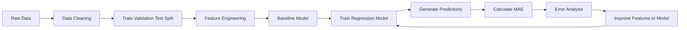
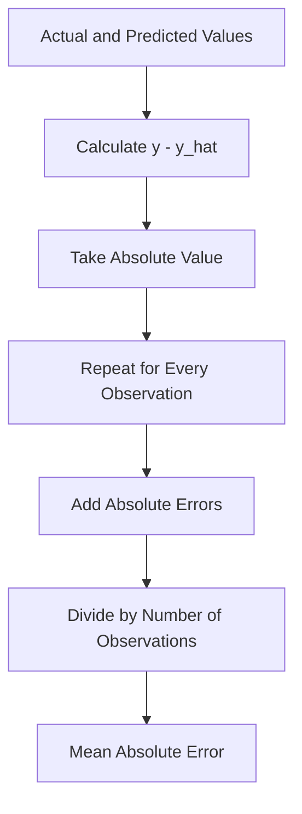
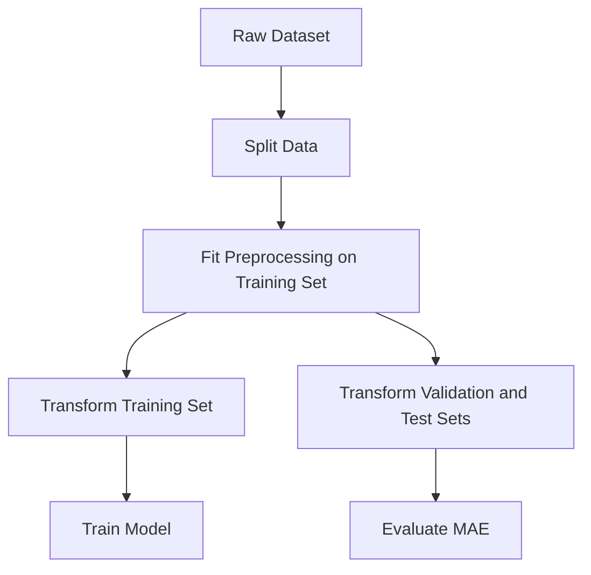
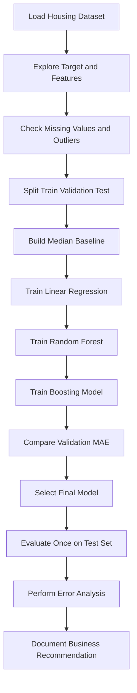

# 020 — Mean Absolute Error (MAE)

**Course:** 03 — Machine Learning and Deep Learning
**Module:** Module 06 — Machine Learning
**Content Group:** Model Evaluation
**Roadmap Source:** Machine Learning / Model Evaluation
**Lesson Type:** Machine Learning
**Order in Module:** 020
**Suggested Duration:** 26 minutes

---

## 1. Overview

**Mean Absolute Error (MAE)** is a regression evaluation metric that measures the average absolute difference between a model's predictions and the actual target values.

MAE answers the following question:

> On average, how far are the model's predictions from the true values?

Because MAE uses absolute differences, positive and negative errors do not cancel each other out.

For example, if a house price prediction model has:

```text
MAE = $18,000
```

the model's predictions are approximately **$18,000 away from the actual house prices on average**.

MAE is useful because:

* It is easy to calculate.
* It is easy to explain to non-technical stakeholders.
* It uses the same unit as the target variable.
* It treats every unit of error equally.
* It is less sensitive to extreme errors than Mean Squared Error.

---

## 2. Learning Objectives

After completing this lesson, you should be able to:

* Explain MAE in your own words.
* Calculate MAE manually from actual and predicted values.
* Interpret MAE in the original unit of the target variable.
* Use MAE to evaluate regression models.
* Compare MAE with MSE, RMSE, and MAPE.
* Recognize the advantages and limitations of MAE.
* Evaluate MAE against a meaningful baseline.
* Use error analysis to understand where a regression model performs poorly.
* Apply MAE to a practical machine learning project.

---

## 3. Where MAE Fits in the Machine Learning Workflow

MAE is mainly used for evaluating **regression models**, where the target is a continuous numerical value.

Common regression tasks include:

* Predicting house prices
* Forecasting product demand
* Estimating delivery time
* Predicting electricity consumption
* Forecasting sales revenue
* Estimating customer lifetime value
* Predicting temperature
* Predicting the number of website visits

A typical regression workflow is:



MAE should normally be calculated on data that was not used to train the model, such as:

* A validation set
* A test set
* A cross-validation fold
* Future production data

---

## 4. Core Concept

Suppose a regression model produces a prediction:

$$
\hat{y}_i
$$

while the actual value is:

$$
y_i
$$

The prediction error for observation (i) is:

$$
e_i = y_i - \hat{y}_i
$$

The error may be:

* Positive when the model underpredicts
* Negative when the model overpredicts
* Zero when the prediction is correct

However, averaging raw errors can be misleading because positive and negative values may cancel each other.

For example:

$$
\frac{10 + (-10)}{2} = 0
$$

The average error is zero, even though both predictions are wrong by 10 units.

MAE solves this problem by taking the absolute value of every error:

$$
|e_i| = |y_i - \hat{y}_i|
$$

It then calculates the average absolute error across all observations.

---

## 5. MAE Formula

For a dataset containing (n) observations, Mean Absolute Error is defined as:

$$
\text{MAE} = \frac{1}{n} \sum_{i=1}^{n} \left|y_i-\hat{y}_i\right|
$$

Where:

* (n) is the number of observations.
* (y_i) is the actual value of observation (i).
* (\hat{y}_i) is the predicted value of observation (i).
* (\left|y_i-\hat{y}_i\right|) is the absolute prediction error.

The calculation process is:

```text
Actual value
     ↓
Predicted value
     ↓
Prediction error
     ↓
Absolute error
     ↓
Average all absolute errors
     ↓
MAE
```

---

## 6. Manual Calculation Example

Suppose a model predicts apartment prices measured in thousands of dollars.

| Apartment | Actual Price | Predicted Price |
| --------: | -----------: | --------------: |
|         1 |          200 |             210 |
|         2 |          250 |             230 |
|         3 |          300 |             310 |
|         4 |          400 |             370 |

First, calculate each prediction error:

$$
e_i = y_i - \hat{y}_i
$$

Then calculate the absolute errors:

| Apartment | Actual | Predicted | Error | Absolute Error |
| --------: | -----: | --------: | ----: | -------------: |
|         1 |    200 |       210 | (-10) |             10 |
|         2 |    250 |       230 |    20 |             20 |
|         3 |    300 |       310 | (-10) |             10 |
|         4 |    400 |       370 |    30 |             30 |

The MAE is:

$$
\text{MAE} = \frac{10+20+10+30}{4}
$$

$$
\text{MAE} = # \frac{70}{4} 17.5
$$

Because the target is measured in thousands of dollars:

```text
MAE = $17,500
```

### Interpretation

The model's apartment price predictions are approximately **$17,500 away from the true prices on average**.

---

## 7. Visual Interpretation

Consider one data point:

```text
Actual value:       300
Predicted value:    270
Absolute error:      30
```

The absolute error is the distance between the prediction and the actual value:

```text
270                              300
 |--------------------------------|
          Absolute error = 30
```

MAE calculates this distance for every observation and then takes the average.



---

## 8. How to Interpret MAE

MAE has the same unit as the target variable.

| Prediction Task          | Target Unit     | MAE Interpretation               |
| ------------------------ | --------------- | -------------------------------- |
| House price prediction   | Dollars         | Average error in dollars         |
| Delivery time prediction | Minutes         | Average error in minutes         |
| Temperature prediction   | Degrees Celsius | Average error in degrees Celsius |
| Sales forecasting        | Products        | Average error in product units   |
| Energy forecasting       | Kilowatt-hours  | Average error in kilowatt-hours  |

For example:

```text
Target: delivery time in minutes
MAE: 6.4
```

Interpretation:

> The predicted delivery time differs from the actual delivery time by approximately 6.4 minutes on average.

### Important limitation

A MAE value is not inherently good or bad.

For example:

```text
MAE = 10
```

could mean:

* An excellent model when predicting values around 10,000
* A poor model when predicting values around 20

The metric must be interpreted relative to:

* The target scale
* Business requirements
* A baseline model
* Alternative models
* The cost of prediction errors

---

## 9. MAE Range

MAE is always non-negative:

$$
\text{MAE} \geq 0
$$

A perfect model has:

$$
\text{MAE} = 0
$$

This means:

$$
y_i = \hat{y}_i
$$

for every observation.

In general:

```text
Lower MAE = better predictions
Higher MAE = larger average prediction errors
```

However, MAE does not have a fixed upper limit. Its maximum value depends on the scale and distribution of the target variable.

---

## 10. MAE in Python

### 10.1 Manual implementation with NumPy

```python
import numpy as np

y_true = np.array([200, 250, 300, 400])
y_pred = np.array([210, 230, 310, 370])

absolute_errors = np.abs(y_true - y_pred)
mae = np.mean(absolute_errors)

print("Absolute errors:", absolute_errors)
print("MAE:", mae)
```

Expected output:

```text
Absolute errors: [10 20 10 30]
MAE: 17.5
```

---

### 10.2 Using scikit-learn

```python
from sklearn.metrics import mean_absolute_error

y_true = [200, 250, 300, 400]
y_pred = [210, 230, 310, 370]

mae = mean_absolute_error(y_true, y_pred)

print(f"MAE: {mae:.2f}")
```

Expected output:

```text
MAE: 17.50
```

---

## 11. Regression Model Example

The following example trains a Linear Regression model and evaluates it using MAE.

```python
from sklearn.datasets import fetch_california_housing
from sklearn.linear_model import LinearRegression
from sklearn.metrics import mean_absolute_error
from sklearn.model_selection import train_test_split

# Load data
dataset = fetch_california_housing(as_frame=True)

X = dataset.data
y = dataset.target

# Split data before training
X_train, X_test, y_train, y_test = train_test_split(
    X,
    y,
    test_size=0.2,
    random_state=42
)

# Train model
model = LinearRegression()
model.fit(X_train, y_train)

# Generate predictions
y_pred = model.predict(X_test)

# Evaluate model
mae = mean_absolute_error(y_test, y_pred)

print(f"Test MAE: {mae:.4f}")
```

The California Housing target is represented in units of $100,000.

Therefore, if:

```text
MAE = 0.53
```

the approximate average error in dollars is:

$$
0.53 \times 100{,}000 = 53{,}000
$$

The model is therefore wrong by approximately **$53,000 on average**.

---

## 12. MAE as a Loss Function

MAE can be used both as:

1. An evaluation metric
2. A training loss function

As a loss function, it is also called **L1 loss**:

$$
L_{\text{MAE}} = \frac{1}{n} \sum_{i=1}^{n} \left|y_i-\hat{y}_i\right|
$$

A model trained with MAE attempts to minimize the average absolute prediction error.

### MAE gradient behavior

For one prediction, the absolute-error loss is:

$$
L = |y-\hat{y}|
$$

Its derivative with respect to the prediction is:

$$
\frac{\partial L}{\partial \hat{y}} = \begin{cases} -1, & \hat{y} < y \ 1, & \hat{y} > y \end{cases}
$$

The derivative is not uniquely defined when:

$$
\hat{y} = y
$$

In practice, optimization libraries handle this using a subgradient or a smooth approximation.

Unlike squared error, the MAE gradient does not grow when the error becomes extremely large. This makes MAE less sensitive to outliers during training.

---

## 13. MAE and the Median

A model minimizing Mean Squared Error tends to estimate the conditional mean:

$$
\hat{y}(x)
\approx
\mathbb{E}[Y \mid X=x]
$$

A model minimizing Mean Absolute Error tends to estimate the conditional median:

$$
\hat{y}(x)
\approx
\text{Median}(Y \mid X=x)
$$

This difference matters when the target distribution is:

* Skewed
* Heavy-tailed
* Contaminated by outliers

For example, suppose the possible target values are:

```text
10, 11, 12, 13, 100
```

The mean is:

$$
\frac{10+11+12+13+100}{5} = 29.2
$$

The median is:

$$
12
$$

The extreme value (100) strongly affects the mean but has much less effect on the median.

This helps explain why MAE is more robust to outliers than squared-error metrics.

---

## 14. MAE vs. MSE

Mean Squared Error is:

$$
\text{MSE} = \frac{1}{n} \sum_{i=1}^{n} \left(y_i-\hat{y}_i\right)^2
$$

The main difference is how errors are penalized.

| Absolute Error | MAE Contribution | MSE Contribution |
| -------------: | ---------------: | ---------------: |
|              1 |                1 |                1 |
|              2 |                2 |                4 |
|              5 |                5 |               25 |
|             10 |               10 |              100 |
|             20 |               20 |              400 |

MAE increases linearly with the error:

$$
L_{\text{MAE}} = |e|
$$

MSE increases quadratically:

$$
L_{\text{MSE}} = e^2
$$

Therefore, MSE penalizes large errors much more heavily.

### Visual comparison

```text
Error size:     1     2     5     10
MAE penalty:    1     2     5     10
MSE penalty:    1     4     25    100
```

### When to prefer MAE

MAE may be appropriate when:

* Every unit of error has approximately equal business cost.
* Outliers exist but should not dominate evaluation.
* Interpretability is important.
* The median prediction is meaningful.
* Large errors should not receive an exaggerated penalty.

### When to prefer MSE

MSE may be appropriate when:

* Large errors are especially costly.
* You want the model to focus strongly on extreme mistakes.
* Smooth gradients are useful during optimization.
* The conditional mean is the desired prediction.

---

## 15. MAE vs. RMSE

Root Mean Squared Error is:

$$
\text{RMSE} = \sqrt{ \frac{1}{n} \sum_{i=1}^{n} \left(y_i-\hat{y}_i\right)^2 }
$$

Both MAE and RMSE use the same unit as the target variable.

| Property            |             MAE |                                   RMSE |
| ------------------- | --------------: | -------------------------------------: |
| Formula             | Absolute errors | Squared errors followed by square root |
| Unit                |  Same as target |                         Same as target |
| Outlier sensitivity |           Lower |                                 Higher |
| Large-error penalty |          Linear |                              Quadratic |
| Easy to explain     |       Very easy |                        Moderately easy |
| Perfect score       |               0 |                                      0 |

RMSE is always greater than or equal to MAE:

$$
\text{RMSE} \geq \text{MAE}
$$

A large difference between RMSE and MAE often indicates that the dataset contains a small number of very large errors.

For example:

```text
MAE  = 8
RMSE = 9
```

The errors may be relatively consistent.

However:

```text
MAE  = 8
RMSE = 25
```

Some predictions may have extremely large errors.

---

## 16. MAE vs. MAPE

Mean Absolute Percentage Error is:

$$
\text{MAPE} = \frac{100%}{n} \sum_{i=1}^{n} \left| \frac{y_i-\hat{y}_i}{y_i} \right|
$$

| Property                           |              MAE |           MAPE |
| ---------------------------------- | ---------------: | -------------: |
| Output unit                        |   Same as target |     Percentage |
| Easy to interpret                  |              Yes |            Yes |
| Works when target is zero          |              Yes |             No |
| Sensitive to small actual values   | No special issue | Very sensitive |
| Comparable across different scales |          Limited | Often possible |

MAPE can become undefined when:

$$
y_i = 0
$$

It can also become extremely large when the actual value is close to zero.

Therefore, MAE is usually safer when the target contains zero or near-zero values.

---

## 17. Metric Comparison Summary

| Metric | Formula                                    | Main Behavior                   | Typical Use                          |                              |                                        |
| ------ | ------------------------------------------ | ------------------------------- | ------------------------------------ | ---------------------------- | -------------------------------------- |
| MAE    | (\frac{1}{n}\sum                           | y_i-\hat{y}_i                   | )                                    | Equal penalty per error unit | Interpretable and robust evaluation    |
| MSE    | (\frac{1}{n}\sum (y_i-\hat{y}_i)^2)        | Strong penalty for large errors | Optimization and large-error control |                              |                                        |
| RMSE   | (\sqrt{\frac{1}{n}\sum (y_i-\hat{y}_i)^2}) | MSE behavior in original units  | Regression reporting                 |                              |                                        |
| MAPE   | (\frac{100%}{n}\sum \left                  | \frac{y_i-\hat{y}_i}{y_i}\right | )                                    | Percentage-based error       | Relative error when values are nonzero |

A strong regression evaluation usually reports more than one metric:

```python
from sklearn.metrics import (
    mean_absolute_error,
    mean_absolute_percentage_error,
    mean_squared_error,
    root_mean_squared_error,
)

mae = mean_absolute_error(y_test, y_pred)
mse = mean_squared_error(y_test, y_pred)
rmse = root_mean_squared_error(y_test, y_pred)
mape = mean_absolute_percentage_error(y_test, y_pred)

print(f"MAE:  {mae:.4f}")
print(f"MSE:  {mse:.4f}")
print(f"RMSE: {rmse:.4f}")
print(f"MAPE: {mape:.2%}")
```

---

## 18. Baseline Evaluation

A model's MAE should always be compared with a baseline.

For regression, a common baseline predicts the median of the training target for every observation.

Because MAE is minimized by the median, the median is a natural constant baseline.

```python
import numpy as np
from sklearn.dummy import DummyRegressor
from sklearn.metrics import mean_absolute_error

baseline = DummyRegressor(strategy="median")
baseline.fit(X_train, y_train)

baseline_predictions = baseline.predict(X_test)
baseline_mae = mean_absolute_error(y_test, baseline_predictions)

print(f"Baseline MAE: {baseline_mae:.4f}")
```

Then compare it with the trained model:

```python
model_mae = mean_absolute_error(y_test, y_pred)

improvement = baseline_mae - model_mae
relative_improvement = improvement / baseline_mae

print(f"Baseline MAE: {baseline_mae:.4f}")
print(f"Model MAE: {model_mae:.4f}")
print(f"Absolute improvement: {improvement:.4f}")
print(f"Relative improvement: {relative_improvement:.2%}")
```

For example:

```text
Baseline MAE: 50
Model MAE:    35
```

The absolute improvement is:

$$
50 - 35 = 15
$$

The relative improvement is:

$$
\frac{50-35}{50} = # 0.30 30%
$$

The model reduces average absolute error by **30% compared with the baseline**.

---

## 19. Error Analysis

A single MAE value summarizes overall performance, but it does not explain where the model fails.

Create a table containing:

* Actual values
* Predictions
* Signed errors
* Absolute errors
* Important feature values
* Business segments

```python
import pandas as pd
import numpy as np

error_analysis = pd.DataFrame({
    "actual": y_test,
    "predicted": y_pred,
})

error_analysis["error"] = (
    error_analysis["actual"]
    - error_analysis["predicted"]
)

error_analysis["absolute_error"] = np.abs(
    error_analysis["error"]
)

largest_errors = error_analysis.sort_values(
    by="absolute_error",
    ascending=False
)

print(largest_errors.head(10))
```

### Questions to investigate

* Which observations have the largest absolute errors?
* Does the model perform worse for high target values?
* Does the model underpredict expensive examples?
* Does it overpredict low-value examples?
* Are errors larger for specific geographic regions?
* Are missing values associated with larger errors?
* Are there rare categories that the model does not understand?
* Are the largest errors caused by bad data?
* Does performance change over time?

---

## 20. Signed Error and Bias

MAE ignores the direction of errors.

The signed residual is:

$$
e_i = y_i-\hat{y}_i
$$

Interpretation:

* (e_i > 0): the model underpredicted.
* (e_i < 0): the model overpredicted.
* (e_i = 0): the prediction was correct.

The mean signed error is:

$$
\text{Mean Error} = \frac{1}{n} \sum_{i=1}^{n} \left(y_i-\hat{y}_i\right)
$$

A positive mean error suggests systematic underprediction.

A negative mean error suggests systematic overprediction.

A model can have a reasonable MAE while still showing directional bias.

Therefore, it is useful to report both:

```text
MAE        → How large are the errors?
Mean error → In which direction is the model biased?
```

Example:

```python
import numpy as np
from sklearn.metrics import mean_absolute_error

errors = y_test - y_pred

mae = mean_absolute_error(y_test, y_pred)
mean_error = np.mean(errors)

print(f"MAE: {mae:.4f}")
print(f"Mean signed error: {mean_error:.4f}")
```

---

## 21. Segment-Level MAE

Overall MAE may hide poor performance for important subgroups.

For example, a house price model may perform differently across:

* Low-price houses
* Medium-price houses
* High-price houses
* Different cities
* Different property types
* Different time periods

Calculate MAE for each segment:

```python
from sklearn.metrics import mean_absolute_error

results = pd.DataFrame({
    "actual": y_test,
    "predicted": y_pred,
    "region": X_test["region"],
})

mae_by_region = (
    results.groupby("region")
    .apply(
        lambda group: mean_absolute_error(
            group["actual"],
            group["predicted"]
        ),
        include_groups=False
    )
    .sort_values()
)

print(mae_by_region)
```

You can also group observations by target range:

```python
results["price_group"] = pd.qcut(
    results["actual"],
    q=4,
    labels=["Low", "Medium-Low", "Medium-High", "High"]
)

mae_by_price_group = (
    results.groupby("price_group", observed=True)
    .apply(
        lambda group: mean_absolute_error(
            group["actual"],
            group["predicted"]
        ),
        include_groups=False
    )
)

print(mae_by_price_group)
```

Segment-level evaluation helps identify:

* Fairness issues
* Underrepresented groups
* Missing features
* Distribution shifts
* High-risk business cases

---

## 22. Weighted MAE

In some applications, not every observation has equal importance.

Weighted MAE is:

$$
\text{Weighted MAE} = \frac{ \sum_{i=1}^{n} w_i \left|y_i-\hat{y}_i\right| }{ \sum_{i=1}^{n} w_i }
$$

Where (w_i) represents the importance of observation (i).

For example:

* High-value customers may receive greater weight.
* Recent observations may receive greater weight.
* Critical equipment may receive greater weight.
* Large stores may receive greater weight in sales forecasting.

Using scikit-learn:

```python
from sklearn.metrics import mean_absolute_error

weights = [1.0, 1.0, 2.0, 3.0]

weighted_mae = mean_absolute_error(
    y_true,
    y_pred,
    sample_weight=weights
)

print(f"Weighted MAE: {weighted_mae:.2f}")
```

Weighted MAE should only be used when the weighting rule has a clear business justification.

---

## 23. MAE with Cross-Validation

A single train-test split may produce an unstable estimate.

Cross-validation evaluates the model across multiple data splits.

```python
from sklearn.linear_model import LinearRegression
from sklearn.model_selection import cross_val_score

model = LinearRegression()

scores = cross_val_score(
    model,
    X,
    y,
    cv=5,
    scoring="neg_mean_absolute_error"
)

mae_scores = -scores

print("MAE for each fold:", mae_scores)
print("Mean CV MAE:", mae_scores.mean())
print("MAE standard deviation:", mae_scores.std())
```

Scikit-learn returns negative MAE because its scoring system assumes that larger scores are better.

Therefore:

```python
mae_scores = -scores
```

converts the values back to positive MAE.

A useful report is:

$$
\text{CV MAE} = \text{Mean MAE} \pm \text{Standard Deviation}
$$

For example:

```text
Cross-validation MAE = 18.4 ± 1.7
```

This provides information about both:

* Average performance
* Performance stability

---

## 24. Time-Series Evaluation

For time-series forecasting, random splitting can create data leakage.

Incorrect approach:

```text
Randomly mix past and future observations
```

Correct approach:

```text
Train on the past
Validate on a later period
Test on an even later period
```


Example:

```python
from sklearn.metrics import mean_absolute_error

train = data.loc[:"2025-06-30"]
validation = data.loc["2025-07-01":"2025-08-31"]
test = data.loc["2025-09-01":"2025-10-31"]
```

For forecasting problems, compare the model against simple baselines such as:

* Last observed value
* Previous-day value
* Previous-week value
* Seasonal average
* Moving average

Example naive forecast:

```python
validation = validation.copy()

validation["naive_prediction"] = validation["target"].shift(1)

valid_rows = validation.dropna(
    subset=["target", "naive_prediction"]
)

naive_mae = mean_absolute_error(
    valid_rows["target"],
    valid_rows["naive_prediction"]
)

print(f"Naive forecast MAE: {naive_mae:.2f}")
```

---

## 25. Advantages of MAE

### 25.1 Easy to understand

MAE directly represents the average prediction error.

```text
MAE = 7 minutes
```

is easier to communicate than:

```text
MSE = 49 squared minutes
```

### 25.2 Same unit as the target

If the target is measured in dollars, MAE is also measured in dollars.

### 25.3 Less sensitive to outliers

Errors are not squared, so extreme observations have less influence than they have under MSE or RMSE.

### 25.4 Symmetric treatment

Overprediction and underprediction of the same size receive the same penalty:

$$
|10| = |-10| = 10
$$

### 25.5 Appropriate for linear error costs

MAE is useful when each additional unit of error has approximately the same business cost.

---

## 26. Limitations of MAE

### 26.1 It does not strongly penalize extreme mistakes

A few very large errors may be important in high-risk applications, but MAE can hide them inside the average.

For example:

```text
Errors: 2, 3, 4, 5, 100
```

The MAE is:

$$
\frac{2+3+4+5+100}{5} = 22.8
$$

The score does not directly reveal that one prediction had an error of 100.

Always inspect:

* Error distributions
* Maximum error
* Error percentiles
* RMSE
* Largest-error examples

### 26.2 It ignores error direction

MAE does not show whether the model systematically overpredicts or underpredicts.

### 26.3 It is scale-dependent

An MAE of 100 cannot be compared directly across datasets with different target units or scales.

### 26.4 It is not differentiable at zero

This can make direct gradient-based optimization less convenient, although modern machine learning libraries handle it.

### 26.5 It assumes symmetric error costs

MAE treats:

```text
Underprediction by 20
```

and:

```text
Overprediction by 20
```

as equally bad.

This may not match the business problem.

For example:

* Underestimating hospital demand may be more dangerous than overestimating it.
* Overestimating inventory demand may create waste.
* Underestimating delivery time may damage customer trust.

In such cases, consider:

* Asymmetric loss functions
* Quantile loss
* Custom business-cost functions

---

## 27. Common Mistakes

### 27.1 Evaluating on training data

A model may have a low training MAE because it has memorized the training data.

Always evaluate using unseen data.

```text
Wrong:
Train model → Calculate MAE on training data only

Better:
Train model → Calculate MAE on validation and test data
```

---

### 27.2 Data leakage

Leakage happens when training features contain information that would not be available when the model makes a real prediction.

Examples:

* Using future sales data to predict earlier sales
* Scaling the entire dataset before splitting
* Using a final transaction status to predict transaction success
* Filling missing values using information from the test set
* Including the target or a transformed target as a feature

Correct workflow:



---

### 27.3 Choosing MAE without considering business cost

MAE assumes a linear and symmetric error cost.

Before selecting MAE, ask:

* Are large mistakes especially dangerous?
* Are overpredictions and underpredictions equally costly?
* Is an average error meaningful to stakeholders?
* Are target values frequently zero?
* Do errors need to be interpreted as percentages?

---

### 27.4 Comparing MAE across different target scales

An MAE of 10 for a target around 1,000 may be excellent.

An MAE of 10 for a target around 12 may be poor.

Do not compare MAE values across unrelated datasets without normalization or additional context.

---

### 27.5 Reporting only one metric

MAE alone cannot reveal:

* Error direction
* Extreme errors
* Relative percentage errors
* Segment-level failures
* Model stability

A stronger evaluation may include:

```text
MAE
RMSE
Median absolute error
Mean signed error
Error percentiles
Segment-level MAE
Baseline comparison
```

---

### 27.6 Using a complex model without a baseline

A complex model should outperform a simple baseline meaningfully.

A lower MAE is not automatically worth:

* Higher infrastructure cost
* Slower inference
* Lower interpretability
* More difficult maintenance
* Greater monitoring complexity

---

## 28. Practical Exercise

### Project

Build a house price prediction system using:

* Exploratory Data Analysis
* Feature engineering
* Linear Regression
* Random Forest
* Gradient Boosting or XGBoost
* MAE-based evaluation

### Required workflow



### Suggested implementation

```python
import pandas as pd

from sklearn.compose import ColumnTransformer
from sklearn.dummy import DummyRegressor
from sklearn.ensemble import RandomForestRegressor
from sklearn.impute import SimpleImputer
from sklearn.linear_model import LinearRegression
from sklearn.metrics import mean_absolute_error
from sklearn.model_selection import train_test_split
from sklearn.pipeline import Pipeline
from sklearn.preprocessing import OneHotEncoder, StandardScaler

# Load data
data = pd.read_csv("housing.csv")

X = data.drop(columns=["price"])
y = data["price"]

# Split into training and temporary sets
X_train, X_temp, y_train, y_temp = train_test_split(
    X,
    y,
    test_size=0.30,
    random_state=42
)

# Split temporary data into validation and test sets
X_validation, X_test, y_validation, y_test = train_test_split(
    X_temp,
    y_temp,
    test_size=0.50,
    random_state=42
)

numeric_features = X.select_dtypes(
    include=["int64", "float64"]
).columns

categorical_features = X.select_dtypes(
    include=["object", "category"]
).columns

numeric_pipeline = Pipeline(
    steps=[
        ("imputer", SimpleImputer(strategy="median")),
        ("scaler", StandardScaler()),
    ]
)

categorical_pipeline = Pipeline(
    steps=[
        (
            "imputer",
            SimpleImputer(strategy="most_frequent")
        ),
        (
            "encoder",
            OneHotEncoder(
                handle_unknown="ignore"
            )
        ),
    ]
)

preprocessor = ColumnTransformer(
    transformers=[
        ("numeric", numeric_pipeline, numeric_features),
        (
            "categorical",
            categorical_pipeline,
            categorical_features
        ),
    ]
)

models = {
    "Baseline": DummyRegressor(strategy="median"),
    "Linear Regression": LinearRegression(),
    "Random Forest": RandomForestRegressor(
        n_estimators=300,
        random_state=42,
        n_jobs=-1
    ),
}

results = []

for name, estimator in models.items():
    pipeline = Pipeline(
        steps=[
            ("preprocessor", preprocessor),
            ("model", estimator),
        ]
    )

    pipeline.fit(X_train, y_train)

    validation_predictions = pipeline.predict(
        X_validation
    )

    validation_mae = mean_absolute_error(
        y_validation,
        validation_predictions
    )

    results.append({
        "model": name,
        "validation_mae": validation_mae,
        "pipeline": pipeline,
    })

results_table = pd.DataFrame([
    {
        "model": item["model"],
        "validation_mae": item["validation_mae"],
    }
    for item in results
]).sort_values("validation_mae")

print(results_table)
```

### Final test evaluation

```python
best_result = min(
    results,
    key=lambda item: item["validation_mae"]
)

best_model = best_result["pipeline"]

test_predictions = best_model.predict(X_test)

test_mae = mean_absolute_error(
    y_test,
    test_predictions
)

print(f"Selected model: {best_result['model']}")
print(f"Test MAE: {test_mae:,.2f}")
```

Do not repeatedly use the test set for model selection. The test set should be evaluated only after the final model and preprocessing decisions have been selected.

---

## 29. Suggested Error Charts

Useful visualizations include:

### 29.1 Actual vs. predicted values

```python
import matplotlib.pyplot as plt

plt.figure(figsize=(7, 6))
plt.scatter(y_test, test_predictions, alpha=0.5)

minimum = min(y_test.min(), test_predictions.min())
maximum = max(y_test.max(), test_predictions.max())

plt.plot(
    [minimum, maximum],
    [minimum, maximum],
    linestyle="--"
)

plt.xlabel("Actual Price")
plt.ylabel("Predicted Price")
plt.title("Actual vs. Predicted House Prices")
plt.show()
```

Points close to the diagonal line represent accurate predictions.

---

### 29.2 Absolute error distribution

```python
absolute_errors = abs(y_test - test_predictions)

plt.figure(figsize=(8, 5))
plt.hist(absolute_errors, bins=30)

plt.xlabel("Absolute Error")
plt.ylabel("Frequency")
plt.title("Distribution of Absolute Prediction Errors")
plt.show()
```

This chart helps answer:

* Are most errors small?
* Is the error distribution strongly skewed?
* Are there rare but extreme mistakes?

---

### 29.3 Residual plot

```python
residuals = y_test - test_predictions

plt.figure(figsize=(8, 5))
plt.scatter(test_predictions, residuals, alpha=0.5)
plt.axhline(0, linestyle="--")

plt.xlabel("Predicted Price")
plt.ylabel("Residual")
plt.title("Residuals vs. Predicted Values")
plt.show()
```

A useful residual plot should not show a strong systematic pattern.

---

## 30. Portfolio Artifact

Create a notebook or report containing:

1. Business problem definition
2. Dataset description
3. Target variable and unit
4. Data quality checks
5. Train-validation-test strategy
6. Leakage prevention
7. Median baseline
8. At least two regression models
9. Validation MAE comparison
10. Final test MAE
11. MAE interpretation in business units
12. MAE and RMSE comparison
13. Error distribution
14. Segment-level analysis
15. Largest-error examples
16. Business recommendation
17. Model limitations
18. Proposed next experiment

Example model comparison table:

| Model             | Validation MAE | Test MAE | Notes                            |
| ----------------- | -------------: | -------: | -------------------------------- |
| Median Baseline   |         52,400 |        — | Constant prediction              |
| Linear Regression |         38,100 |        — | Simple and interpretable         |
| Random Forest     |         29,700 |        — | Captures nonlinear relationships |
| XGBoost           |         27,900 |   28,600 | Best validation performance      |

Example conclusion:

> The XGBoost model achieved a test MAE of $28,600, meaning its predictions differed from actual house prices by approximately $28,600 on average. It reduced validation MAE by about 47% relative to the median baseline. However, errors remained substantially larger for luxury properties, suggesting that additional location, property-condition, and neighborhood-demand features should be investigated.

---

## 31. Practice Questions

### Question 1

Given:

```text
Actual:    [10, 20, 30]
Predicted: [12, 17, 35]
```

Calculate MAE.

Absolute errors:

$$
|10-12|=2
$$

$$
|20-17|=3
$$

$$
|30-35|=5
$$

Therefore:

$$
\text{MAE} = # \frac{2+3+5}{3} \frac{10}{3} \approx 3.33
$$

---

### Question 2

A delivery-time model has:

```text
MAE = 4.8 minutes
```

What does this mean?

> The model's predicted delivery times differ from the actual delivery times by approximately 4.8 minutes on average.

---

### Question 3

Model A has:

```text
MAE  = 8
RMSE = 9
```

Model B has:

```text
MAE  = 8
RMSE = 25
```

What can you infer?

Both models have the same average absolute error, but Model B probably produces some much larger individual errors.

---

### Question 4

Why should MAE be compared with a baseline?

A model may appear accurate without actually improving on a simple prediction rule. The baseline establishes the minimum useful performance level.

---

### Question 5

Why might MAE be preferred over MSE when the dataset contains outliers?

MAE penalizes errors linearly, while MSE squares errors. Therefore, extreme observations have less influence on MAE.

---

### Question 6

Does MAE reveal whether the model overpredicts or underpredicts?

No. MAE uses absolute errors and removes their direction. Signed residuals or mean error are needed to detect directional bias.

---

## 32. Common Interview Questions

### What is MAE?

MAE is the average absolute difference between actual and predicted values in a regression problem.

### What is the best possible MAE?

The best possible MAE is zero.

### Is a lower MAE better?

Yes, when models are evaluated on the same dataset, target, and data split.

### Why is MAE robust to outliers?

It grows linearly with error size instead of squaring large errors.

### What is the difference between MAE and RMSE?

MAE applies equal weight to each unit of error. RMSE penalizes large errors more strongly.

### Can MAE compare models trained on different targets?

Not directly, because MAE depends on the target's unit and scale.

### Why is the median a suitable baseline for MAE?

The constant value that minimizes the sum of absolute deviations is the median.

### Can MAE be used for classification?

MAE is mainly a regression metric. Classification usually uses metrics such as accuracy, precision, recall, F1-score, log loss, or ROC-AUC.

---

## 33. Completion Checklist

* [ ] I can explain MAE in one or two minutes.
* [ ] I can write the MAE formula correctly.
* [ ] I can calculate MAE manually.
* [ ] I understand why absolute values are necessary.
* [ ] I can interpret MAE in the target's original unit.
* [ ] I can calculate MAE using NumPy.
* [ ] I can calculate MAE using scikit-learn.
* [ ] I can compare MAE with MSE, RMSE, and MAPE.
* [ ] I understand how outliers affect MAE.
* [ ] I know that MAE does not show error direction.
* [ ] I can compare a model against a median baseline.
* [ ] I can evaluate MAE using cross-validation.
* [ ] I can calculate MAE for important business segments.
* [ ] I can identify data leakage risks.
* [ ] I have created a notebook, chart, model, API, or portfolio note for this lesson.
* [ ] I have documented at least one assumption, caveat, or next experiment.

---

## 34. Related Outcome

Train, compare, and evaluate supervised and unsupervised machine learning models using appropriate metrics, thoughtful feature engineering, reliable validation strategies, and business-aware error analysis.

---

## 35. Related Project

**Mini Project: House Price Prediction**

Recommended components:

* Exploratory Data Analysis
* Missing-value treatment
* Outlier investigation
* Numerical and categorical preprocessing
* Feature engineering
* Median baseline
* Linear Regression
* Random Forest
* XGBoost or LightGBM
* MAE and RMSE comparison
* Error analysis by price range
* Model interpretation
* Business recommendation
* Deployment as a prediction API

---

## 36. Summary

Mean Absolute Error measures the average absolute distance between predictions and actual values:

$$
\text{MAE} = \frac{1}{n} \sum_{i=1}^{n} \left|y_i-\hat{y}_i\right|
$$

The most important ideas are:

* MAE is primarily used for regression evaluation.
* A lower MAE indicates smaller average prediction errors.
* MAE uses the same unit as the target variable.
* It gives every unit of error the same penalty.
* It is less sensitive to outliers than MSE and RMSE.
* It does not reveal whether predictions are too high or too low.
* It should be compared with a meaningful baseline.
* Overall MAE should be supported by segment-level and error-distribution analysis.
* Metric selection must reflect the real business cost of errors.
* A good model must solve a useful problem, not merely produce a low score.

Turn this lesson into a practical artifact such as:

```text
Notebook
→ Regression pipeline
→ MAE comparison table
→ Error analysis charts
→ Business interpretation
→ Prediction API
→ Portfolio case study
```

---

# Bài luyện tập

## Mục tiêu


## Đề bài


## Yêu cầu hoàn thành

- [ ] 
- [ ] 
- [ ] 

## Kết quả / lời giải


## Ghi chú
