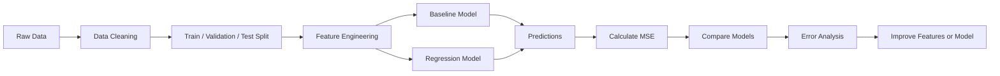
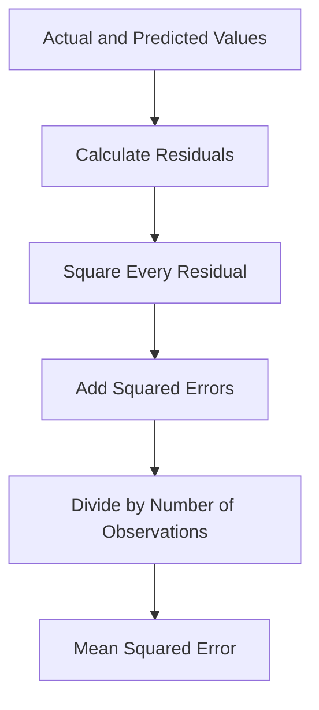
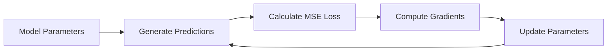

# 021 - Mean Squared Error (MSE)

**Course:** 03 - Machine Learning and Deep Learning
**Module:** Module 06 - Machine Learning
**Content Group:** Model Evaluation
**Roadmap Source:** Machine Learning / Model Evaluation
**Lesson Type:** Machine Learning
**Lesson Order:** 021
**Suggested Duration:** 26 minutes

---

## 1. Overview

**Mean Squared Error**, commonly abbreviated as **MSE**, is one of the most widely used evaluation metrics for regression models.

It measures the average squared difference between the actual target values and the values predicted by a model.

MSE answers the following question:

> On average, how large are the model's prediction errors after those errors have been squared?

Because errors are squared, large prediction mistakes receive a much greater penalty than small mistakes.

After completing this lesson, you should understand:

* What MSE measures.
* How MSE is calculated.
* Why large errors have a strong influence on MSE.
* When MSE is an appropriate regression metric.
* How MSE differs from MAE and RMSE.
* How to evaluate a regression model using MSE in Python.

---

## 2. Learning Objectives

By the end of this lesson, you should be able to:

* Explain MSE in your own words.
* Calculate MSE manually from actual and predicted values.
* Interpret whether an MSE value is good or bad in a specific context.
* Use MSE to compare regression models.
* Explain why MSE is sensitive to outliers.
* Compare MSE with MAE and RMSE.
* Apply MSE to a real dataset, notebook, experiment, dashboard, or deployment artifact.
* Identify common mistakes such as data leakage and incorrect metric selection.

---

## 3. Where MSE Fits in the Machine Learning Workflow

MSE is normally calculated after a regression model has generated predictions on validation or test data.



A typical evaluation workflow is:

```text
data
  -> split
  -> preprocessing
  -> feature engineering
  -> baseline model
  -> candidate models
  -> predictions
  -> MSE calculation
  -> model comparison
  -> error analysis
```

MSE should normally be calculated on unseen data rather than on the same data used to train the model.

---

## 4. Core Concept

Suppose a regression dataset contains:

* Actual values: (y_1, y_2, \ldots, y_n)
* Predicted values: (\hat{y}_1, \hat{y}_2, \ldots, \hat{y}_n)

The prediction error for observation (i) is:

$$
e_i = y_i - \hat{y}_i
$$

MSE squares each prediction error and calculates their average:

$$
\text{MSE} = \frac{1}{n} \sum_{i=1}^{n} \left(y_i-\hat{y}_i\right)^2
$$

Where:

* (n) is the number of observations.
* (y_i) is the actual value for observation (i).
* (\hat{y}_i) is the predicted value for observation (i).
* (y_i-\hat{y}_i) is the residual or prediction error.
* (\left(y_i-\hat{y}_i\right)^2) is the squared error.

---

## 5. How MSE Is Calculated

MSE can be calculated in four steps:

1. Calculate the difference between each actual value and predicted value.
2. Square each difference.
3. Add all squared errors.
4. Divide the result by the number of observations.



---

## 6. Manual Calculation Example

Suppose a house-price model produces the following predictions. The values are measured in thousands of dollars.

| House | Actual Price | Predicted Price | Error | Squared Error |
| ----: | -----------: | --------------: | ----: | ------------: |
|     1 |          200 |             210 |   -10 |           100 |
|     2 |          250 |             240 |    10 |           100 |
|     3 |          300 |             290 |    10 |           100 |
|     4 |          350 |             370 |   -20 |           400 |

The sum of squared errors is:

$$
100 + 100 + 100 + 400 = 700
$$

There are four observations, so:

$$
\text{MSE} = # \frac{700}{4} 175
$$

Therefore:

$$
\boxed{\text{MSE}=175}
$$

Because the prices were measured in thousands of dollars, the unit of MSE is:

```text
thousands of dollars squared
```

This squared unit makes MSE less intuitive to interpret directly than MAE or RMSE.

---

## 7. Why Errors Are Squared

Squaring prediction errors has several effects.

### 7.1 Positive and Negative Errors Cannot Cancel Out

Without an absolute value or square operation, positive and negative errors could cancel each other.

For example:

$$
-10 + 10 = 0
$$

A total error of zero would incorrectly suggest that the model made no mistakes.

Squaring solves this problem:

$$
(-10)^2 + 10^2 = 100 + 100 = 200
$$

---

### 7.2 Larger Errors Receive a Stronger Penalty

Consider two prediction errors:

$$
e_1 = 2
$$

$$
e_2 = 10
$$

Their absolute errors are:

$$
|e_1| = 2
$$

$$
|e_2| = 10
$$

The second error is five times larger than the first.

However, their squared errors are:

$$
e_1^2 = 4
$$

$$
e_2^2 = 100
$$

After squaring, the second error contributes 25 times as much as the first error.

This means that MSE strongly penalizes large mistakes.

---

## 8. Interpreting MSE

MSE is always greater than or equal to zero:

$$
\text{MSE} \geq 0
$$

A perfect model has:

$$
\text{MSE}=0
$$

In general:

* A lower MSE indicates better predictions.
* A higher MSE indicates larger prediction errors.
* MSE cannot be negative.
* MSE has no universal upper limit.

However, an MSE value cannot be interpreted without context.

For example:

* An MSE of `25` might be excellent when predicting annual revenue in millions.
* The same MSE might be unacceptable when predicting a medical measurement that normally ranges from `0` to `10`.

MSE should be interpreted relative to:

* The scale of the target variable.
* A simple baseline model.
* Previous model versions.
* Business costs and requirements.
* Other evaluation metrics.

---

## 9. MSE and the Target Unit

If the target is measured in dollars, the MSE is measured in dollars squared.

If the target is measured in kilograms, the MSE is measured in kilograms squared.

For example:

```text
Target unit: dollars
MSE unit: dollars²
```

This squared unit is mathematically useful but often difficult to explain to stakeholders.

For easier interpretation, MSE is often converted to **Root Mean Squared Error**:

$$
\text{RMSE} = \sqrt{\text{MSE}}
$$

RMSE returns the metric to the original unit of the target variable.

---

## 10. MSE as a Loss Function

MSE is not only an evaluation metric. It is also commonly used as a loss function during model training.

For a model with parameters (\theta), the MSE loss can be written as:

$$
L(\theta) = \frac{1}{n} \sum_{i=1}^{n} \left(y_i-\hat{y}_i(\theta)\right)^2
$$

The training algorithm attempts to find model parameters that minimize this loss:

$$
\theta^* = \arg\min_{\theta} L(\theta)
$$

In linear regression, minimizing the sum or mean of squared errors leads to the **Ordinary Least Squares** solution.



---

## 11. Why MSE Is Convenient for Optimization

The squared-error function is smooth and differentiable.

For a single observation, the squared-error loss is:

$$
L = \left(y-\hat{y}\right)^2
$$

The derivative with respect to the prediction is:

$$
\frac{\partial L}{\partial \hat{y}} = 2\left(\hat{y}-y\right)
$$

This derivative can be used efficiently by optimization algorithms such as gradient descent.

Because the function is smooth, small changes in predictions produce smooth changes in the loss.

---

## 12. MSE and Outliers

MSE is highly sensitive to outliers because it squares every prediction error.

Consider these errors:

$$
[1, 2, 2, 3, 20]
$$

Their squared values are:

$$
[1, 4, 4, 9, 400]
$$

The final error contributes much more to the total than all other observations combined.

The MSE is:

$$
\text{MSE} = # \frac{1+4+4+9+400}{5} 83.6
$$

Without the large error of `20`, the MSE would be:

$$
\text{MSE} = # \frac{1+4+4+9}{4} 4.5
$$

This example demonstrates how a single large error can dominate MSE.

MSE is useful when large errors are genuinely costly. However, it may be misleading when extreme values are caused by:

* Incorrect data.
* Measurement errors.
* Rare but unimportant cases.
* Unhandled data-quality problems.
* Naturally heavy-tailed target distributions.

---

## 13. MSE Versus MAE

**Mean Absolute Error** is calculated as:

$$
\text{MAE} = \frac{1}{n} \sum_{i=1}^{n} \left|y_i-\hat{y}_i\right|
$$

The main difference is how the metrics penalize errors.

| Property                 | MSE                                | MAE                                |
| ------------------------ | ---------------------------------- | ---------------------------------- |
| Error transformation     | Squared error                      | Absolute error                     |
| Penalty for large errors | Strong                             | Linear                             |
| Sensitivity to outliers  | High                               | Lower                              |
| Unit                     | Squared target unit                | Original target unit               |
| Optimization behavior    | Smooth and differentiable          | Not differentiable at zero         |
| Best when                | Large errors are especially costly | All errors have similar importance |

Consider two models with prediction errors:

```text
Model A: [2, 2, 2, 8]
Model B: [4, 4, 4, 4]
```

For Model A:

$$
\text{MAE}_A = # \frac{2+2+2+8}{4} 3.5
$$

$$
\text{MSE}_A = # \frac{2^2+2^2+2^2+8^2}{4} 19
$$

For Model B:

$$
\text{MAE}_B = # \frac{4+4+4+4}{4} 4
$$

$$
\text{MSE}_B = # \frac{4^2+4^2+4^2+4^2}{4} 16
$$

MAE prefers Model A because its average absolute error is smaller.

MSE prefers Model B because it avoids one very large error.

This shows that metric selection can change which model is considered better.

---

## 14. MSE Versus RMSE

Root Mean Squared Error is the square root of MSE:

$$
\text{RMSE} = \sqrt{ \frac{1}{n} \sum_{i=1}^{n} \left(y_i-\hat{y}_i\right)^2 }
$$

| Property                  | MSE                   | RMSE                     |
| ------------------------- | --------------------- | ------------------------ |
| Formula                   | Average squared error | Square root of MSE       |
| Unit                      | Squared target unit   | Original target unit     |
| Sensitive to large errors | Yes                   | Yes                      |
| Easy to optimize          | Yes                   | Usually MSE is optimized |
| Easy to explain           | Less intuitive        | More intuitive           |

If:

$$
\text{MSE}=175
$$

Then:

$$
\text{RMSE} = \sqrt{175} \approx 13.23
$$

If house prices are measured in thousands of dollars, the RMSE indicates a typical error magnitude of approximately:

```text
$13,230
```

RMSE is generally easier to communicate because it uses the same unit as the target variable.

---

## 15. Comparison of Common Regression Metrics

| Metric | Formula                          | Main Strength                                                   | Main Limitation                              |
| ------ | -------------------------------- | --------------------------------------------------------------- | -------------------------------------------- |
| MAE    | Average absolute error           | Easy to interpret and less sensitive to outliers                | Does not strongly penalize large errors      |
| MSE    | Average squared error            | Strongly penalizes large errors and works well for optimization | Sensitive to outliers and uses squared units |
| RMSE   | Square root of MSE               | Same target unit and penalizes large errors                     | Still sensitive to outliers                  |
| (R^2)  | Proportion of variance explained | Scale-independent model comparison                              | Can hide the real error magnitude            |
| MAPE   | Average percentage error         | Easy percentage interpretation                                  | Fails or becomes unstable near zero          |

A strong regression evaluation usually reports more than one metric.

For example:

```text
MAE  = 18,200 dollars
RMSE = 27,600 dollars
R²   = 0.84
```

---

## 16. Baseline Comparison

MSE is most useful when compared with a baseline.

A common regression baseline predicts the mean training target for every observation:

$$
\hat{y}_{\text{baseline}} = \frac{1}{n_{\text{train}}} \sum_{i=1}^{n_{\text{train}}}y_i
$$

The baseline MSE is then:

$$
\text{MSE}_{\text{baseline}} = \frac{1}{n_{\text{test}}} \sum_{i=1}^{n_{\text{test}}} \left( y_i-\hat{y}_{\text{baseline}} \right)^2
$$

A useful model should normally have a lower test MSE than this baseline.

Example:

| Model             | Validation MSE |
| ----------------- | -------------: |
| Mean baseline     |          920.4 |
| Linear Regression |          510.7 |
| Random Forest     |          360.2 |
| XGBoost           |          341.8 |

In this example, XGBoost has the lowest validation MSE.

However, the final decision should also consider:

* Test-set performance.
* Training and inference cost.
* Model complexity.
* Interpretability.
* Stability across data segments.
* Business consequences of errors.

---

## 17. Python Demo with NumPy

```python
import numpy as np

y_true = np.array([200, 250, 300, 350], dtype=float)
y_pred = np.array([210, 240, 290, 370], dtype=float)

errors = y_true - y_pred
squared_errors = errors ** 2
mse = np.mean(squared_errors)

print("Errors:", errors)
print("Squared errors:", squared_errors)
print("MSE:", mse)
```

Expected output:

```text
Errors: [-10.  10.  10. -20.]
Squared errors: [100. 100. 100. 400.]
MSE: 175.0
```

---

## 18. Python Demo with Scikit-Learn

```python
from sklearn.metrics import mean_squared_error

y_true = [200, 250, 300, 350]
y_pred = [210, 240, 290, 370]

mse = mean_squared_error(y_true, y_pred)

print(f"MSE: {mse:.2f}")
```

Expected output:

```text
MSE: 175.00
```

To calculate RMSE:

```python
import numpy as np
from sklearn.metrics import mean_squared_error

y_true = [200, 250, 300, 350]
y_pred = [210, 240, 290, 370]

mse = mean_squared_error(y_true, y_pred)
rmse = np.sqrt(mse)

print(f"MSE: {mse:.2f}")
print(f"RMSE: {rmse:.2f}")
```

---

## 19. Complete Regression Evaluation Example

```python
from sklearn.datasets import fetch_california_housing
from sklearn.dummy import DummyRegressor
from sklearn.ensemble import RandomForestRegressor
from sklearn.linear_model import LinearRegression
from sklearn.metrics import mean_absolute_error
from sklearn.metrics import mean_squared_error
from sklearn.metrics import r2_score
from sklearn.model_selection import train_test_split
from sklearn.pipeline import Pipeline
from sklearn.preprocessing import StandardScaler

# Load the dataset
dataset = fetch_california_housing(as_frame=True)

X = dataset.data
y = dataset.target

# Create train, validation, and test sets
X_train, X_temp, y_train, y_temp = train_test_split(
    X,
    y,
    test_size=0.30,
    random_state=42,
)

X_validation, X_test, y_validation, y_test = train_test_split(
    X_temp,
    y_temp,
    test_size=0.50,
    random_state=42,
)

# Define candidate models
models = {
    "Mean Baseline": DummyRegressor(strategy="mean"),
    "Linear Regression": Pipeline(
        steps=[
            ("scaler", StandardScaler()),
            ("model", LinearRegression()),
        ]
    ),
    "Random Forest": RandomForestRegressor(
        n_estimators=200,
        random_state=42,
        n_jobs=-1,
    ),
}

# Train and evaluate each model
for name, model in models.items():
    model.fit(X_train, y_train)

    predictions = model.predict(X_validation)

    mse = mean_squared_error(y_validation, predictions)
    rmse = mse ** 0.5
    mae = mean_absolute_error(y_validation, predictions)
    r2 = r2_score(y_validation, predictions)

    print(f"\n{name}")
    print(f"MSE:  {mse:.4f}")
    print(f"RMSE: {rmse:.4f}")
    print(f"MAE:  {mae:.4f}")
    print(f"R²:   {r2:.4f}")
```

This example demonstrates several important practices:

* Creating separate training, validation, and test sets.
* Comparing candidate models with a baseline.
* Reporting multiple regression metrics.
* Using a preprocessing pipeline.
* Keeping the final test set untouched during model selection.

---

## 20. Residual Analysis

MSE provides one summary number, but it does not explain where the model fails.

A residual is:

$$
r_i = y_i-\hat{y}_i
$$

After calculating MSE, inspect the residuals to answer questions such as:

* Does the model systematically overpredict?
* Does it systematically underpredict?
* Are errors larger for expensive houses?
* Are some geographic regions harder to predict?
* Are there extreme outliers?
* Does error variance increase with the predicted value?
* Are errors different across important user or product groups?

A residual plot can be created with:

```python
import matplotlib.pyplot as plt

residuals = y_validation - predictions

plt.figure(figsize=(8, 5))
plt.scatter(predictions, residuals, alpha=0.5)
plt.axhline(y=0, linestyle="--")
plt.xlabel("Predicted Value")
plt.ylabel("Residual")
plt.title("Residual Plot")
plt.show()
```

A healthy residual plot should generally show points scattered around zero without an obvious pattern.

---

## 21. Segment-Level MSE

Overall MSE can hide poor performance for important groups.

For example, a house-price model may perform well overall but poorly for luxury houses.

```python
import pandas as pd
from sklearn.metrics import mean_squared_error

results = pd.DataFrame(
    {
        "actual": y_validation.to_numpy(),
        "predicted": predictions,
    }
)

results["price_segment"] = pd.qcut(
    results["actual"],
    q=4,
    labels=["Low", "Medium", "High", "Very High"],
)

segment_mse = (
    results.groupby("price_segment", observed=True)
    .apply(
        lambda group: mean_squared_error(
            group["actual"],
            group["predicted"],
        )
    )
    .rename("mse")
)

print(segment_mse)
```

Useful evaluation segments may include:

* Target-value ranges.
* Customer groups.
* Geographic regions.
* Product categories.
* Time periods.
* Data sources.
* New versus existing users.
* Common versus rare observations.

---

## 22. Weighted MSE

Sometimes certain observations are more important than others.

Weighted MSE is:

$$
\text{Weighted MSE} = \frac{ \sum_{i=1}^{n} w_i \left(y_i-\hat{y}_i\right)^2 }{ \sum_{i=1}^{n}w_i }
$$

Where (w_i) represents the importance of observation (i).

Example:

```python
from sklearn.metrics import mean_squared_error

y_true = [100, 200, 300]
y_pred = [110, 190, 250]

weights = [1, 1, 5]

weighted_mse = mean_squared_error(
    y_true,
    y_pred,
    sample_weight=weights,
)

print(f"Weighted MSE: {weighted_mse:.2f}")
```

Weighted MSE may be useful when:

* High-value customers are more important.
* Recent observations should receive more weight.
* Some predictions have larger business consequences.
* The dataset contains unequal sampling probabilities.

Weights should be based on a clear business or statistical reason.

---

## 23. When to Use MSE

MSE is a good choice when:

* The task is a regression problem.
* Large prediction errors are especially costly.
* Outliers represent real and important cases.
* A smooth and differentiable training loss is needed.
* The data approximately follows a Gaussian error assumption.
* You want to compare models on the same target scale.
* You want a metric that strongly discourages extreme mistakes.

Examples include:

* House-price prediction.
* Energy-demand forecasting.
* Revenue forecasting.
* Temperature prediction.
* Manufacturing measurement prediction.
* Demand estimation.
* Travel-time prediction.

---

## 24. When MSE May Not Be Appropriate

MSE may not be the best metric when:

* The target contains many extreme outliers.
* Outliers are caused by data-quality problems.
* Every unit of error has approximately equal business cost.
* Stakeholders need an error measure in the original target unit.
* Percentage error is more important than absolute error.
* The target distribution is heavily skewed.
* Underprediction and overprediction have different costs.

Possible alternatives include:

* MAE for more robust evaluation.
* RMSE for interpretation in the original unit.
* MAPE or SMAPE for percentage-based evaluation.
* Median Absolute Error for strong outlier resistance.
* Quantile loss for asymmetric error costs.
* Huber loss as a compromise between MSE and MAE.

---

## 25. MSE and Statistical Assumptions

Minimizing MSE is closely related to assuming that residuals follow a Gaussian distribution with constant variance:

$$
\epsilon_i
\sim
\mathcal{N}(0,\sigma^2)
$$

Under this assumption:

$$
y_i = f(x_i)+\epsilon_i
$$

Minimizing squared error corresponds to maximizing the likelihood of the observed data.

This connection helps explain why MSE is widely used in classical regression.

However, real-world residuals may violate these assumptions because of:

* Heteroskedasticity.
* Outliers.
* Skewed target distributions.
* Missing nonlinear relationships.
* Time dependence.
* Incorrect feature engineering.

Therefore, residual analysis remains important even when MSE is low.

---

## 26. Common Mistakes

### 26.1 Evaluating MSE on Training Data Only

Training MSE measures how well the model fits known examples.

It does not reliably measure generalization.

Always evaluate the final model on unseen data.

---

### 26.2 Comparing MSE Across Different Target Scales

An MSE of `100` for a target ranging from `0` to `1,000,000` is not equivalent to an MSE of `100` for a target ranging from `0` to `10`.

Raw MSE values should generally be compared only when:

* The models use the same dataset.
* The target variable has the same unit.
* The preprocessing and evaluation split are consistent.

---

### 26.3 Ignoring the Squared Unit

MSE is not expressed in the original target unit.

When communicating results, include RMSE or MAE for a more intuitive interpretation.

---

### 26.4 Ignoring Outliers

A small number of extreme errors can dominate MSE.

Inspect:

* The largest residuals.
* Data quality.
* Target distribution.
* Segment-level performance.

---

### 26.5 Choosing the Model with the Lowest Training MSE

A highly complex model may achieve a very low training MSE while performing poorly on unseen data.

This is a sign of overfitting.

Compare:

```text
Training MSE
Validation MSE
Test MSE
```

---

### 26.6 Data Leakage

Data leakage occurs when training features contain information that would not be available at prediction time.

Examples include:

* Applying preprocessing to the full dataset before splitting.
* Using future information to predict the past.
* Including a feature derived directly from the target.
* Using test-set statistics during training.
* Selecting features based on test-set results.

Use pipelines and fit preprocessing only on the training set.

---

### 26.7 Selecting a Metric Without Considering Business Costs

MSE assumes that large errors deserve a disproportionately large penalty.

This may not match the real business cost.

For example:

* An error of `$20` may not be four times worse than an error of `$10`.
* Underestimating demand may be more expensive than overestimating it.
* Errors for premium customers may be more costly.

Metric selection should reflect the actual decision problem.

---

### 26.8 Using the Test Set Repeatedly

Repeatedly checking test MSE during model development indirectly tunes the model to the test set.

A better workflow is:

```text
Training set   -> fit the model
Validation set -> select features and hyperparameters
Test set       -> perform one final unbiased evaluation
```

---

## 27. Practical Exercise

### Task

Build a regression model to predict house prices.

### Dataset Options

* California Housing dataset.
* Ames Housing dataset.
* A local real-estate dataset.
* A synthetic regression dataset.

### Required Steps

1. Load and inspect the dataset.
2. Identify the target variable.
3. Split the data into training, validation, and test sets.
4. Build a mean-prediction baseline.
5. Train a Linear Regression model.
6. Train at least one tree-based model.
7. Calculate MSE, RMSE, MAE, and (R^2).
8. Compare validation performance.
9. Select the best candidate model.
10. Evaluate the selected model once on the test set.
11. Plot residuals.
12. Inspect the ten observations with the largest squared errors.
13. Write down at least one limitation and one next experiment.

---

## 28. Suggested Experiment Table

| Experiment | Features              | Model             | Validation MSE | Validation RMSE | Validation MAE | Notes                   |
| ---------- | --------------------- | ----------------- | -------------: | --------------: | -------------: | ----------------------- |
| 001        | Raw numeric features  | Mean baseline     |                |                 |                | Baseline                |
| 002        | Standardized features | Linear Regression |                |                 |                | Linear model            |
| 003        | Raw features          | Random Forest     |                |                 |                | Nonlinear               |
| 004        | Engineered features   | Random Forest     |                |                 |                | Added location features |
| 005        | Engineered features   | XGBoost           |                |                 |                | Tuned parameters        |

This table helps make model development reproducible.

---

## 29. Error Analysis Template

After evaluating the model, answer the following questions:

```text
1. Which observations have the largest squared errors?
2. Are those observations valid or caused by bad data?
3. Does the model overpredict or underpredict more often?
4. Which target ranges have the highest MSE?
5. Which features are missing for difficult examples?
6. Does model performance change across locations or time periods?
7. Would MAE lead to a different model choice?
8. Does the metric reflect the real business cost?
9. What is the next feature or model experiment?
```

---

## 30. Mini Project Connection

### House Price Prediction

Build a complete regression project containing:

* Exploratory Data Analysis.
* Missing-value handling.
* Categorical-variable encoding.
* Numerical-feature scaling.
* Feature engineering.
* Mean baseline.
* Linear Regression.
* Random Forest.
* Gradient Boosting or XGBoost.
* MSE, RMSE, MAE, and (R^2) comparison.
* Residual analysis.
* Segment-level evaluation.
* Final model selection.
* Saved preprocessing and model pipeline.
* Prediction API or interactive dashboard.

A possible project structure is:

```text
house-price-project/
├── data/
├── notebooks/
│   ├── 01_eda.ipynb
│   ├── 02_feature_engineering.ipynb
│   └── 03_model_evaluation.ipynb
├── src/
│   ├── preprocessing.py
│   ├── train.py
│   ├── evaluate.py
│   └── predict.py
├── models/
├── reports/
│   ├── metrics.csv
│   └── residual_analysis.md
├── app.py
├── requirements.txt
└── README.md
```

---

## 31. Completion Checklist

* [ ] I can explain MSE in one or two minutes.
* [ ] I can write the MSE formula correctly.
* [ ] I can calculate MSE manually.
* [ ] I understand why errors are squared.
* [ ] I know that MSE is always non-negative.
* [ ] I understand why MSE is sensitive to outliers.
* [ ] I can compare MSE with MAE and RMSE.
* [ ] I can calculate MSE using NumPy.
* [ ] I can calculate MSE using Scikit-Learn.
* [ ] I can compare a regression model with a baseline.
* [ ] I evaluate models on unseen validation or test data.
* [ ] I inspect residuals instead of relying on one metric.
* [ ] I understand that MSE uses squared target units.
* [ ] I have recorded at least one assumption, caveat, or next experiment.
* [ ] I have created a notebook, model, chart, API, or portfolio note for this lesson.

---

## 32. Key Takeaways

1. MSE measures the average squared difference between actual and predicted values.

2. Its formula is:

$$
\text{MSE} = \frac{1}{n} \sum_{i=1}^{n} \left(y_i-\hat{y}_i\right)^2
$$

3. Lower MSE generally indicates better regression performance.

4. Squaring prevents positive and negative errors from canceling each other.

5. Squaring also gives large errors a much stronger penalty.

6. MSE is sensitive to outliers.

7. MSE uses squared target units, so RMSE is often easier to interpret.

8. A model should be compared with a simple baseline.

9. The lowest MSE does not automatically identify the best production model.

10. Model evaluation should include residual analysis, segment-level analysis, business requirements, and data-leakage checks.

---

## 33. Related Outcome

Train, compare, and evaluate supervised and unsupervised machine learning models using thoughtful feature engineering, appropriate metrics, reproducible experiments, and business-aware error analysis.

---

## 34. Summary

**Mean Squared Error** is a fundamental regression metric and optimization objective.

It measures average squared prediction error:

$$
\text{MSE} = \frac{1}{n} \sum_{i=1}^{n} \left(y_i-\hat{y}_i\right)^2
$$

Its main advantage is that it strongly penalizes large errors and works well with gradient-based optimization. Its main limitation is its sensitivity to outliers and its squared unit.

MSE should not be used as an isolated score. A reliable regression evaluation should combine it with:

* A meaningful baseline.
* MAE or RMSE.
* Residual analysis.
* Segment-level metrics.
* Data-leakage prevention.
* Business-cost analysis.
* Validation and test-set discipline.

Turn this lesson into a practical artifact such as a regression notebook, experiment report, evaluation dashboard, prediction API, Docker service, or portfolio project.

---

# Bài luyện tập

## Mục tiêu


## Đề bài


## Yêu cầu hoàn thành

- [ ] 
- [ ] 
- [ ] 

## Kết quả / lời giải


## Ghi chú
