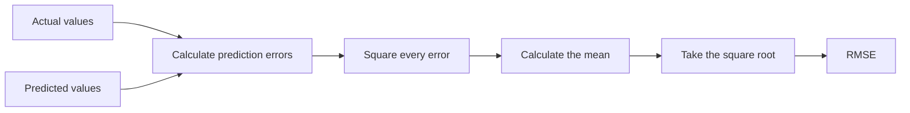
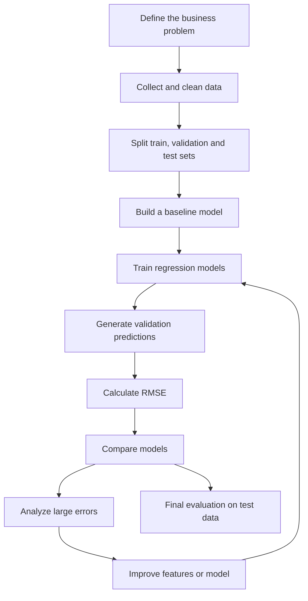
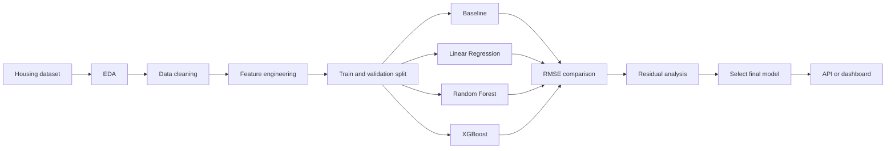

# 022 — Root Mean Squared Error (RMSE)

**Course:** 03 — Machine Learning and Deep Learning
**Module:** Module 06 — Machine Learning
**Content Group:** Model Evaluation
**Roadmap Source:** Machine Learning / Model Evaluation
**Lesson Type:** Machine Learning
**Order in Module:** 022
**Suggested Duration:** 26 minutes

---

## 1. Overview

**Root Mean Squared Error**, commonly called **RMSE**, is a regression evaluation metric that measures the average magnitude of a model's prediction errors.

RMSE is calculated by:

1. Finding the difference between each actual value and predicted value.
2. Squaring each error.
3. Calculating the average of the squared errors.
4. Taking the square root of that average.

Because RMSE squares the errors before averaging them, it gives more weight to large prediction errors.

After completing this lesson, you should understand:

* What RMSE measures.
* How RMSE is calculated.
* How to interpret an RMSE value.
* Why RMSE penalizes large errors.
* How RMSE differs from MAE and MSE.
* When RMSE is appropriate for a machine learning project.
* How to calculate RMSE using Python and scikit-learn.

---

## 2. Learning Objectives

By the end of this lesson, you should be able to:

* Explain RMSE in your own words.
* Write and understand the RMSE formula.
* Calculate RMSE manually for a small dataset.
* Calculate RMSE using Python.
* Interpret RMSE in the unit of the target variable.
* Compare RMSE with MAE and MSE.
* Recognize when RMSE may be affected by outliers.
* Use RMSE to compare regression models.
* Connect RMSE to a real machine learning workflow.

---

## 3. What Is RMSE?

RMSE measures how far a model's predictions are from the actual values.

It summarizes the model's prediction errors into a single number.

For example, suppose a house price model predicts prices in US dollars.

If the model has:

```text
RMSE = $20,000
```

then the model's prediction error has a typical magnitude of approximately `$20,000`.

However, RMSE should not be interpreted as the exact average absolute error because the errors are squared before averaging.

The most important properties of RMSE are:

* Lower RMSE values indicate better predictions.
* An RMSE of `0` represents perfect predictions.
* RMSE is always non-negative.
* RMSE has the same unit as the target variable.
* Large errors have a stronger effect on RMSE than small errors.

---

## 4. RMSE Formula

For a dataset containing (n) observations, RMSE is calculated as:

$$
\mathrm{RMSE} = \sqrt{ \frac{1}{n} \sum_{i=1}^{n} \left(y_i-\hat{y}_i\right)^2 }
$$

Where:

* (n) is the number of observations.
* (y_i) is the actual value of observation (i).
* (\hat{y}_i) is the predicted value of observation (i).
* (y_i-\hat{y}_i) is the prediction error, also called the residual.
* (\left(y_i-\hat{y}_i\right)^2) is the squared error.

RMSE is also the square root of Mean Squared Error:

$$
\mathrm{RMSE}=\sqrt{\mathrm{MSE}}
$$

---

## 5. RMSE Calculation Process

The complete calculation process can be represented as:



Mathematically:

```text
Actual and predicted values
            ↓
Prediction errors
            ↓
Squared errors
            ↓
Mean squared error
            ↓
Square root
            ↓
RMSE
```

---

## 6. Step-by-Step Example

Suppose a regression model produces the following predictions:

| Observation | Actual value (y_i) | Predicted value (\hat{y}_i) |
| ----------: | -----------------: | --------------------------: |
|           1 |                3.0 |                         2.5 |
|           2 |               -0.5 |                         0.0 |
|           3 |                2.0 |                         2.0 |
|           4 |                7.0 |                         8.0 |

### Step 1: Calculate the Errors

The prediction error is:

$$
e_i=y_i-\hat{y}_i
$$

| Observation | Actual | Predicted | Error |
| ----------: | -----: | --------: | ----: |
|           1 |    3.0 |       2.5 |   0.5 |
|           2 |   -0.5 |       0.0 |  -0.5 |
|           3 |    2.0 |       2.0 |   0.0 |
|           4 |    7.0 |       8.0 |  -1.0 |

### Step 2: Square the Errors

| Observation | Error | Squared error |
| ----------: | ----: | ------------: |
|           1 |   0.5 |          0.25 |
|           2 |  -0.5 |          0.25 |
|           3 |   0.0 |          0.00 |
|           4 |  -1.0 |          1.00 |

### Step 3: Calculate MSE

$$
\mathrm{MSE} = \frac{0.25+0.25+0+1}{4}
$$

$$
\mathrm{MSE} = = \frac{1.5}{4} 0.375
$$

### Step 4: Take the Square Root

$$
\mathrm{RMSE} = \sqrt{0.375}
$$

$$
\mathrm{RMSE}
\approx 0.612
$$

Therefore:

```text
RMSE ≈ 0.612
```

---

## 7. How to Interpret RMSE

RMSE is expressed in the same unit as the target variable.

### Example 1: House Prices

Suppose the target variable is measured in US dollars:

```text
RMSE = $25,000
```

This means that the model's prediction error has a typical magnitude of approximately `$25,000`.

### Example 2: Temperature Prediction

Suppose the target variable is measured in degrees Celsius:

```text
RMSE = 2.4°C
```

The model's predictions are typically a few degrees away from the actual temperatures.

### Example 3: Delivery Time

Suppose the target variable is measured in minutes:

```text
RMSE = 8.5 minutes
```

The model's delivery-time predictions have an error magnitude of approximately `8.5 minutes`.

However, whether an RMSE value is good or bad depends on:

* The scale of the target variable.
* The business problem.
* The cost of prediction mistakes.
* The baseline model.
* The performance of competing models.
* The distribution of errors.

An RMSE value should never be evaluated without context.

---

## 8. Why RMSE Penalizes Large Errors

RMSE squares each prediction error.

Therefore, a large error contributes much more to the final metric than a small error.

Consider the following errors:

```text
Error A = 2
Error B = 10
```

Their squared errors are:

$$
2^2=4
$$

$$
10^2=100
$$

Although Error B is only five times larger than Error A, its squared error is twenty-five times larger:

$$
\frac{100}{4}=25
$$

This makes RMSE useful when large mistakes are especially costly.

Examples include:

* Predicting hospital demand.
* Forecasting electricity consumption.
* Estimating financial risk.
* Predicting delivery delays.
* Predicting expensive property values.

---

## 9. RMSE and Outliers

RMSE is sensitive to outliers because extreme errors are squared.

Suppose a model produces these absolute errors:

```text
2, 3, 2, 4, 30
```

The first four errors are relatively small, but the final error is extremely large.

After squaring:

```text
4, 9, 4, 16, 900
```

The value `900` dominates the calculation.

As a result, RMSE may increase significantly because of only one unusual observation.

This behavior can be either useful or problematic.

### Useful When

* Large mistakes are dangerous or expensive.
* Extreme errors must be strongly penalized.
* Outliers represent valid and important cases.

### Problematic When

* Outliers are caused by measurement errors.
* The target distribution contains extreme noise.
* A small number of rare cases should not dominate model selection.

Always investigate large residuals before accepting the RMSE result.

---

## 10. RMSE vs. MSE vs. MAE

RMSE, MSE, and MAE are common regression metrics, but they behave differently.

| Metric | Formula             | Unit                | Sensitivity to large errors | Interpretation                                         |
| ------ | ------------------- | ------------------- | --------------------------- | ------------------------------------------------------ |
| MAE    | Mean absolute error | Same as target      | Moderate                    | Average absolute error                                 |
| MSE    | Mean squared error  | Squared target unit | High                        | Average squared error                                  |
| RMSE   | Square root of MSE  | Same as target      | High                        | Error magnitude with stronger penalty for large errors |

### Mean Absolute Error

$$
\mathrm{MAE} = \frac{1}{n} \sum_{i=1}^{n} \left|y_i-\hat{y}_i\right|
$$

MAE treats errors proportionally.

For example:

```text
An error of 10 contributes twice as much as an error of 5.
```

### Mean Squared Error

$$
\mathrm{MSE} = \frac{1}{n} \sum_{i=1}^{n} \left(y_i-\hat{y}_i\right)^2
$$

MSE strongly penalizes large errors but is expressed in squared units.

### Root Mean Squared Error

$$
\mathrm{RMSE} = \sqrt{ \frac{1}{n} \sum_{i=1}^{n} \left(y_i-\hat{y}_i\right)^2 }
$$

RMSE preserves the large-error penalty of MSE while returning the result to the original target unit.

---

## 11. Choosing Between MAE and RMSE

Choose **MAE** when:

* You want a direct average absolute error.
* You want a metric that is less sensitive to outliers.
* Errors should increase approximately linearly.
* Large errors are not disproportionately more expensive.

Choose **RMSE** when:

* Large prediction errors are particularly undesirable.
* You want to penalize extreme mistakes strongly.
* The target variable's unit is important for interpretation.
* The model is trained using a squared-error objective.
* The residual distribution is reasonably stable.

In practice, it is often useful to report both:

```text
MAE = 12.4
RMSE = 19.8
```

A large difference between RMSE and MAE may indicate the presence of several large prediction errors.

---

## 12. RMSE in the Machine Learning Workflow

RMSE is commonly used during regression model development.



A complete evaluation process should include:

1. Define the prediction target.
2. Create training, validation, and test datasets.
3. Build a simple baseline.
4. Train one or more regression models.
5. Generate predictions on unseen data.
6. Calculate RMSE.
7. Compare the models.
8. Analyze observations with the largest residuals.
9. Select the model based on both technical and business criteria.
10. Evaluate the selected model once on the test set.

---

## 13. Baseline Comparison

An RMSE value is meaningful only when it is compared with a baseline.

A simple regression baseline might always predict the mean target value:

$$
\hat{y}_i=\bar{y}_{\text{train}}
$$

For example:

| Model             | Validation RMSE |
| ----------------- | --------------: |
| Mean baseline     |          52,000 |
| Linear Regression |          38,000 |
| Random Forest     |          27,000 |
| XGBoost           |          24,500 |

In this example, XGBoost has the lowest validation RMSE.

However, the final model should not be selected using RMSE alone. You should also consider:

* Inference speed.
* Model complexity.
* Explainability.
* Memory requirements.
* Stability across data segments.
* Maintenance cost.
* Business constraints.

---

## 14. Calculating RMSE with Python

### Method 1: NumPy

```python
import numpy as np

y_true = np.array([3.0, -0.5, 2.0, 7.0])
y_pred = np.array([2.5, 0.0, 2.0, 8.0])

squared_errors = (y_true - y_pred) ** 2
mse = np.mean(squared_errors)
rmse = np.sqrt(mse)

print(f"MSE: {mse:.3f}")
print(f"RMSE: {rmse:.3f}")
```

Expected output:

```text
MSE: 0.375
RMSE: 0.612
```

### Method 2: scikit-learn

```python
import numpy as np
from sklearn.metrics import mean_squared_error

y_true = [3.0, -0.5, 2.0, 7.0]
y_pred = [2.5, 0.0, 2.0, 8.0]

mse = mean_squared_error(y_true, y_pred)
rmse = np.sqrt(mse)

print(f"RMSE: {rmse:.3f}")
```

Expected output:

```text
RMSE: 0.612
```

---

## 15. Regression Model Example

The following example trains a Linear Regression model and evaluates it using RMSE.

```python
import numpy as np
from sklearn.datasets import fetch_california_housing
from sklearn.linear_model import LinearRegression
from sklearn.metrics import mean_absolute_error, mean_squared_error
from sklearn.model_selection import train_test_split

# Load a regression dataset
dataset = fetch_california_housing()
X = dataset.data
y = dataset.target

# Split the dataset
X_train, X_test, y_train, y_test = train_test_split(
    X,
    y,
    test_size=0.2,
    random_state=42,
)

# Train the model
model = LinearRegression()
model.fit(X_train, y_train)

# Generate predictions
y_pred = model.predict(X_test)

# Calculate evaluation metrics
mae = mean_absolute_error(y_test, y_pred)
mse = mean_squared_error(y_test, y_pred)
rmse = np.sqrt(mse)

print(f"MAE:  {mae:.4f}")
print(f"MSE:  {mse:.4f}")
print(f"RMSE: {rmse:.4f}")
```

The evaluation flow is:

```text
Training data
     ↓
Train Linear Regression
     ↓
Predict test values
     ↓
Compare predictions with actual values
     ↓
Calculate MAE, MSE and RMSE
```

---

## 16. Comparing Multiple Models

RMSE is frequently used to compare regression models on the same validation set.

```python
import numpy as np
import pandas as pd

from sklearn.datasets import fetch_california_housing
from sklearn.ensemble import RandomForestRegressor
from sklearn.linear_model import LinearRegression
from sklearn.metrics import mean_squared_error
from sklearn.model_selection import train_test_split
from sklearn.tree import DecisionTreeRegressor

dataset = fetch_california_housing()
X = dataset.data
y = dataset.target

X_train, X_valid, y_train, y_valid = train_test_split(
    X,
    y,
    test_size=0.2,
    random_state=42,
)

models = {
    "Linear Regression": LinearRegression(),
    "Decision Tree": DecisionTreeRegressor(
        max_depth=8,
        random_state=42,
    ),
    "Random Forest": RandomForestRegressor(
        n_estimators=100,
        random_state=42,
        n_jobs=-1,
    ),
}

results = []

for model_name, model in models.items():
    model.fit(X_train, y_train)
    predictions = model.predict(X_valid)

    mse = mean_squared_error(y_valid, predictions)
    rmse = np.sqrt(mse)

    results.append({
        "Model": model_name,
        "Validation RMSE": rmse,
    })

results_df = pd.DataFrame(results)
results_df = results_df.sort_values("Validation RMSE")

print(results_df)
```

The model with the lowest validation RMSE performs best according to this metric.

However, the comparison is valid only when:

* Every model uses the same data split.
* Every model receives equivalent input information.
* Preprocessing does not leak validation data.
* Hyperparameters are not selected using the test set.
* The final test set remains untouched until model selection is complete.

---

## 17. RMSE Error Analysis

A single RMSE value does not explain where the model fails.

After calculating RMSE, inspect the residuals.

The residual for observation (i) is:

$$
e_i=y_i-\hat{y}_i
$$

You can create an error-analysis table:

```python
import pandas as pd

error_analysis = pd.DataFrame({
    "actual": y_valid,
    "predicted": predictions,
})

error_analysis["residual"] = (
    error_analysis["actual"]
    - error_analysis["predicted"]
)

error_analysis["absolute_error"] = (
    error_analysis["residual"].abs()
)

error_analysis["squared_error"] = (
    error_analysis["residual"] ** 2
)

largest_errors = error_analysis.sort_values(
    "absolute_error",
    ascending=False,
).head(10)

print(largest_errors)
```

Questions to investigate include:

* Which observations produce the largest errors?
* Are errors concentrated in a specific price range?
* Does the model underpredict high-value cases?
* Are important features missing?
* Are some records incorrect?
* Are there rare categories in the dataset?
* Does model performance differ across customer or geographic segments?

---

## 18. Residual Plot

A residual plot can reveal patterns that RMSE alone cannot show.

```python
import matplotlib.pyplot as plt

residuals = y_valid - predictions

plt.scatter(predictions, residuals, alpha=0.5)
plt.axhline(y=0, linestyle="--")

plt.xlabel("Predicted Values")
plt.ylabel("Residuals")
plt.title("Residual Plot")

plt.show()
```

A good residual plot usually has:

* Errors distributed around zero.
* No strong curve or systematic pattern.
* Similar error spread across prediction values.
* Few extreme residuals.

A visible pattern may indicate:

* Nonlinearity.
* Missing features.
* Heteroskedasticity.
* Outliers.
* Incorrect preprocessing.
* Model underfitting.

---

## 19. RMSE for Different Target Scales

RMSE cannot be directly compared across datasets with very different target scales.

For example:

```text
Model A: House-price RMSE = 20,000 dollars
Model B: Temperature RMSE = 2 degrees Celsius
```

The value `2` is not automatically better than `20,000` because the target variables use different units and scales.

Even within the same domain, consider the target range.

```text
Dataset A:
Target range = 0 to 100
RMSE = 10

Dataset B:
Target range = 0 to 1,000,000
RMSE = 10
```

An RMSE of `10` may be large for Dataset A but extremely small for Dataset B.

For cross-dataset comparison, a normalized RMSE may sometimes be used.

One possible definition is:

$$
\mathrm{NRMSE} = \frac{\mathrm{RMSE}}{y_{\max}-y_{\min}}
$$

Another possible definition is:

$$
\mathrm{NRMSE} = \frac{\mathrm{RMSE}}{\bar{y}}
$$

There is no single universal definition of normalized RMSE. Always state which denominator is being used.

---

## 20. RMSE and Target Transformation

Some regression problems use a transformed target, such as the logarithm of house prices:

$$
z=\log(1+y)
$$

If the model is evaluated directly on the transformed target, the metric is no longer expressed in the original target unit.

For example:

```python
import numpy as np

y_train_log = np.log1p(y_train)

model.fit(X_train, y_train_log)

log_predictions = model.predict(X_valid)
predictions = np.expm1(log_predictions)

rmse = np.sqrt(
    mean_squared_error(y_valid, predictions)
)
```

This calculates RMSE after converting the predictions back to the original scale.

Be explicit about whether RMSE is calculated:

* On the original target.
* On the logarithmic target.
* After applying an inverse transformation.

These metrics have different interpretations.

---

## 21. RMSE in Cross-Validation

Using a single validation split may produce an unstable estimate.

Cross-validation evaluates the model across multiple data splits.

```python
import numpy as np

from sklearn.ensemble import RandomForestRegressor
from sklearn.model_selection import cross_val_score

model = RandomForestRegressor(
    n_estimators=100,
    random_state=42,
    n_jobs=-1,
)

negative_mse_scores = cross_val_score(
    model,
    X,
    y,
    cv=5,
    scoring="neg_mean_squared_error",
)

rmse_scores = np.sqrt(-negative_mse_scores)

print("RMSE values:", rmse_scores)
print("Mean RMSE:", rmse_scores.mean())
print("RMSE standard deviation:", rmse_scores.std())
```

A useful report includes both the mean and variation:

```text
Cross-validation RMSE: 0.54 ± 0.03
```

The standard deviation indicates how stable model performance is across different splits.

---

## 22. Business Interpretation

A lower RMSE does not automatically mean that a model is useful.

Suppose two house-price models produce:

| Model             |    RMSE | Inference time | Explainability |
| ----------------- | ------: | -------------: | -------------- |
| Linear Regression | $31,000 |      Very fast | High           |
| XGBoost           | $27,500 |       Moderate | Medium         |

XGBoost improves RMSE by:

$$
31{,}000-27{,}500=3{,}500
$$

The relative improvement is:

$$
\frac{31{,}000-27{,}500}{31{,}000}
\times 100
\approx 11.29%
$$

The team must decide whether an improvement of approximately `11.29%` is worth:

* Greater implementation complexity.
* Longer inference time.
* More difficult explanations.
* Additional monitoring requirements.
* Higher maintenance cost.

Model selection is a technical and business decision.

---

## 23. Common Mistakes

### 23.1 Evaluating on Training Data

A model usually performs better on data it has already seen.

```text
Training RMSE = 5.2
Test RMSE = 18.7
```

The large difference may indicate overfitting.

Always evaluate on unseen validation or test data.

---

### 23.2 Data Leakage

Data leakage occurs when information from the validation or test set influences model training.

Examples include:

* Scaling the complete dataset before splitting.
* Filling missing values using statistics from all rows.
* Selecting features using the test set.
* Including information created after the prediction time.
* Using future observations in a time-series problem.

A safer pipeline is:

```text
Split data
    ↓
Fit preprocessing on training data
    ↓
Transform validation and test data
    ↓
Train model
    ↓
Evaluate RMSE
```

---

### 23.3 Comparing RMSE Across Different Scales

An RMSE value is meaningful only relative to the target's scale and unit.

Do not compare raw RMSE values from unrelated datasets without normalization or additional context.

---

### 23.4 Ignoring Outliers

A few extreme prediction errors can dominate RMSE.

Always inspect:

* The largest residuals.
* The target distribution.
* Potential data-quality problems.
* Performance across target ranges.

---

### 23.5 Selecting the Test Set Repeatedly

The test set should represent final unseen data.

If you repeatedly choose models based on test RMSE, the test set becomes part of the development process.

Use:

```text
Training set → Train models
Validation set → Select models
Test set → Final evaluation
```

---

### 23.6 Using Only One Metric

RMSE cannot describe every aspect of model quality.

A complete evaluation may include:

* RMSE.
* MAE.
* (R^2).
* Residual plots.
* Segment-level performance.
* Prediction latency.
* Model size.
* Business cost.

---

### 23.7 Using a Complex Model Without a Baseline

Always build a simple baseline first.

Possible baselines include:

* Predicting the mean.
* Predicting the median.
* Linear Regression.
* Predicting the previous value for time-series data.

A complex model is valuable only when it meaningfully improves the baseline.

---

## 24. Practical Exercise

Use a regression dataset such as:

* House prices.
* Car prices.
* Medical costs.
* Energy consumption.
* Delivery time.
* Sales revenue.

Complete the following steps:

1. Load and inspect the dataset.
2. Identify the target variable.
3. Split the data into training and test sets.
4. Create a mean-prediction baseline.
5. Train a Linear Regression model.
6. Train at least one tree-based model.
7. Calculate MAE, MSE, and RMSE.
8. Compare model performance.
9. Find the ten observations with the largest errors.
10. Create a residual plot.
11. Write down at least one possible model improvement.
12. Explain which model you would deploy and why.

A possible results table:

| Model             |    MAE |           MSE |   RMSE |
| ----------------- | -----: | ------------: | -----: |
| Mean baseline     | 41,200 | 3,100,000,000 | 55,678 |
| Linear Regression | 29,500 | 1,720,000,000 | 41,473 |
| Random Forest     | 20,800 |   940,000,000 | 30,659 |
| XGBoost           | 18,900 |   810,000,000 | 28,460 |

---

## 25. Mini Project Connection

### House Price Prediction

Build a house-price prediction project containing:

* Exploratory data analysis.
* Missing-value analysis.
* Numerical and categorical feature processing.
* Feature engineering.
* Mean or median baseline.
* Linear Regression.
* Random Forest.
* Gradient Boosting or XGBoost.
* MAE, MSE, RMSE, and (R^2) comparison.
* Residual analysis.
* Analysis of the largest prediction errors.
* A prediction API or small dashboard.

Suggested workflow:



Portfolio artifacts may include:

* A Jupyter notebook.
* A model-comparison table.
* A residual chart.
* An error-analysis report.
* A trained model file.
* A FastAPI prediction endpoint.
* A Streamlit dashboard.
* A Dockerized inference service.
* A README explaining the business interpretation of RMSE.

---

## 26. Completion Checklist

* [ ] I can explain RMSE in one or two minutes.
* [ ] I understand the RMSE formula.
* [ ] I can calculate RMSE manually.
* [ ] I can calculate RMSE using NumPy.
* [ ] I can calculate RMSE using scikit-learn.
* [ ] I know that lower RMSE values are better.
* [ ] I know that RMSE has the same unit as the target.
* [ ] I understand why RMSE penalizes large errors.
* [ ] I understand why RMSE is sensitive to outliers.
* [ ] I can compare RMSE with MAE and MSE.
* [ ] I can compare a model against a baseline.
* [ ] I can identify possible data leakage.
* [ ] I can analyze the observations with the largest errors.
* [ ] I have created a notebook, chart, model, API, or practical note for this lesson.
* [ ] I have recorded at least one caveat, assumption, or question for further analysis.

---

## 27. Related Outcome

Train, compare, and evaluate supervised machine learning models using appropriate metrics, thoughtful feature engineering, reliable validation strategies, and business-aware error analysis.

---

## 28. Key Takeaways

* RMSE measures the magnitude of regression prediction errors.
* RMSE is the square root of MSE.
* Lower RMSE values indicate better model performance.
* RMSE is expressed in the same unit as the target variable.
* Squaring the errors causes RMSE to penalize large mistakes strongly.
* RMSE is more sensitive to outliers than MAE.
* RMSE should be compared with a baseline and interpreted using business context.
* A single RMSE value is not enough; residual and segment-level analysis are also necessary.
* Data leakage can make RMSE appear unrealistically good.
* The best model is not always the model with the lowest RMSE.

---

## 29. Summary

**Root Mean Squared Error** is one of the most widely used metrics for evaluating regression models.

It calculates the square root of the average squared difference between actual and predicted values:

$$
\mathrm{RMSE} = \sqrt{ \frac{1}{n} \sum_{i=1}^{n} \left(y_i-\hat{y}_i\right)^2 }
$$

RMSE is especially useful when large prediction mistakes should receive a strong penalty. However, it is sensitive to outliers and must be interpreted relative to the target scale, baseline performance, data quality, and business requirements.

Turn this lesson into a practical artifact such as a regression notebook, model-comparison experiment, residual dashboard, prediction API, Docker service, or portfolio project.
