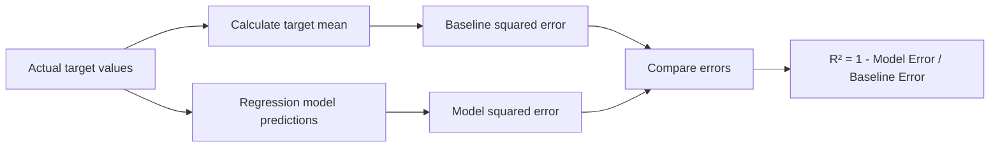

# 023 - R-squared Metric

**Course:** 03 - Machine Learning and Deep Learning
**Module:** Module 06 - Machine Learning
**Content Group:** Model Evaluation
**Roadmap Source:** Machine Learning / Model Evaluation
**Lesson Type:** Machine Learning
**Order in Module:** 023
**Suggested Duration:** 26 minutes

---

## 1. Summary

The **R-squared metric**, written as (R^2), evaluates how well a regression model explains the variation in a target variable.

It compares the model's predictions with a simple baseline that always predicts the mean of the target. A higher (R^2) usually indicates that the model explains more of the variation in the data.

After this lesson, you should understand:

* What (R^2) measures.
* How to calculate and interpret it.
* Why (R^2) can be zero or negative.
* How it differs from MAE, MSE, and RMSE.
* Why a high (R^2) does not automatically mean that a model is useful.
* How to use (R^2) in a regression model evaluation workflow.

---

## 2. Learning Objectives

By the end of this lesson, you should be able to:

* Explain the R-squared metric in your own words.
* Calculate (R^2) from actual and predicted values.
* Interpret positive, zero, and negative (R^2) values.
* Compare a regression model against a mean-based baseline.
* Evaluate (R^2) together with MAE, MSE, or RMSE.
* Identify situations where (R^2) may be misleading.
* Apply (R^2) to a dataset, notebook, experiment, dashboard, or API.

---

## 3. Main Concept

### 3.1 What Is R-squared?

R-squared measures the proportion of variation in the target variable that is explained by a regression model.

It answers the question:

> How much better is the model than simply predicting the average target value for every observation?

For example, an (R^2) value of (0.80) means that the model explains approximately 80% of the variation in the target variable relative to the mean-prediction baseline.

The remaining 20% is not explained by the model.

---

### 3.2 R-squared Formula

The R-squared metric is defined as:

$$
R^2 = 1- \frac{ \sum_{i=1}^{n}(y_i-\hat{y}_i)^2 }{ \sum_{i=1}^{n}(y_i-\bar{y})^2 }
$$

Where:

* (y_i) is the actual target value.
* (\hat{y}_i) is the predicted target value.
* (\bar{y}) is the mean of the actual target values.
* (n) is the number of observations.

The formula can also be written as:

$$
R^2 = 1 - \frac{SS_{\text{res}}}{SS_{\text{tot}}}
$$

Where:

$$
SS_{\text{res}} = \sum_{i=1}^{n}(y_i-\hat{y}_i)^2
$$

is the **residual sum of squares**, representing the model's prediction error.

$$
SS_{\text{tot}} = \sum_{i=1}^{n}(y_i-\bar{y})^2
$$

is the **total sum of squares**, representing the variation in the target around its mean.

---

### 3.3 Intuition Behind the Formula

R-squared compares two sources of squared error:

1. The error produced by the regression model.
2. The error produced by a baseline that predicts the target mean.



If the model error is much smaller than the baseline error, (R^2) will be close to 1.

If the model error is equal to the baseline error, (R^2) will be 0.

If the model error is larger than the baseline error, (R^2) will be negative.

---

## 4. Interpreting R-squared

### 4.1 Perfect Model: (R^2 = 1)

An (R^2) value of 1 means that every prediction exactly matches its actual value.

$$
SS_{\text{res}} = 0
$$

Therefore:

$$
R^2 = 1 - \frac{0}{SS_{\text{tot}}} = 1
$$

This represents perfect prediction on the evaluated dataset.

---

### 4.2 Mean Baseline Performance: (R^2 = 0)

An (R^2) value of 0 means that the model performs no better than predicting the mean target value for every observation.

$$
SS_{\text{res}} = SS_{\text{tot}}
$$

Therefore:

$$
R^2 = 1-\frac{SS_{\text{tot}}}{SS_{\text{tot}}}=0
$$

---

### 4.3 Poor Model: (R^2 < 0)

A negative (R^2) means that the model performs worse than the mean-prediction baseline.

For example:

$$
R^2=-0.40
$$

This indicates that the model's squared prediction error is greater than the baseline's squared error.

Negative (R^2) values may appear when:

* The model does not fit the data well.
* The training and test distributions are different.
* Important features are missing.
* The model overfits the training data.
* An inappropriate model is used.
* Evaluation is performed on unseen data.

---

### 4.4 Common Interpretation

| R-squared value | General interpretation                  |
| --------------: | --------------------------------------- |
|          (1.00) | Perfect predictions                     |
|          (0.80) | Model explains 80% of target variation  |
|          (0.50) | Model explains 50% of target variation  |
|          (0.00) | Same performance as predicting the mean |
|       Below (0) | Worse than predicting the mean          |

These interpretations are not universal quality standards.

An acceptable (R^2) depends on:

* The business problem.
* Data quality.
* Noise in the target.
* The prediction horizon.
* The field of application.
* The cost of prediction errors.

---

## 5. Worked Example

Suppose the actual house prices are:

$$
y = [200, 250, 300, 350]
$$

The model predicts:

$$
\hat{y} = [210, 240, 290, 360]
$$

### Step 1: Calculate the Target Mean

$$
\bar{y} = # \frac{200+250+300+350}{4} 275
$$

### Step 2: Calculate the Model's Squared Error

$$
SS_{\text{res}} = (200-210)^2 + (250-240)^2 + (300-290)^2 + (350-360)^2
$$

$$
SS_{\text{res}} = # 100+100+100+100 400
$$

### Step 3: Calculate the Baseline's Squared Error

$$
SS_{\text{tot}} = (200-275)^2 + (250-275)^2 + (300-275)^2 + (350-275)^2
$$

$$
SS_{\text{tot}} = # 5625+625+625+5625 12500
$$

### Step 4: Calculate R-squared

$$
R^2 = 1-\frac{400}{12500}
$$

$$
R^2 = 0.968
$$

The model explains approximately 96.8% of the variation in house prices relative to the mean baseline.

However, this value should still be evaluated together with an error metric such as MAE or RMSE.

---

## 6. R-squared in the Machine Learning Workflow

```text
Business problem
      ↓
Collect and clean data
      ↓
Define target and features
      ↓
Split train, validation, and test sets
      ↓
Create a mean baseline
      ↓
Train regression models
      ↓
Generate predictions
      ↓
Calculate R² and error metrics
      ↓
Analyze residuals and failure cases
      ↓
Improve features or model
      ↓
Final test evaluation
      ↓
Deployment and monitoring
```

R-squared is normally used for regression problems such as:

* House price prediction.
* Revenue forecasting.
* Demand estimation.
* Delivery-time prediction.
* Energy consumption forecasting.
* Customer lifetime value prediction.
* Temperature prediction.

It is not normally used for classification problems.

---

## 7. Python Demonstration

### 7.1 Calculate R-squared with Scikit-learn

```python
from sklearn.metrics import r2_score

y_true = [200, 250, 300, 350]
y_pred = [210, 240, 290, 360]

r2 = r2_score(y_true, y_pred)

print(f"R-squared: {r2:.3f}")
```

Expected output:

```text
R-squared: 0.968
```

---

### 7.2 Calculate R-squared Manually

```python
import numpy as np

y_true = np.array([200, 250, 300, 350])
y_pred = np.array([210, 240, 290, 360])

target_mean = np.mean(y_true)

ss_residual = np.sum((y_true - y_pred) ** 2)
ss_total = np.sum((y_true - target_mean) ** 2)

r2 = 1 - (ss_residual / ss_total)

print(f"Target mean: {target_mean}")
print(f"Residual sum of squares: {ss_residual}")
print(f"Total sum of squares: {ss_total}")
print(f"R-squared: {r2:.3f}")
```

---

### 7.3 Regression Model Example

```python
from sklearn.datasets import fetch_california_housing
from sklearn.linear_model import LinearRegression
from sklearn.metrics import mean_absolute_error, mean_squared_error, r2_score
from sklearn.model_selection import train_test_split

# Load regression dataset
dataset = fetch_california_housing()

X = dataset.data
y = dataset.target

# Split the data before training
X_train, X_test, y_train, y_test = train_test_split(
    X,
    y,
    test_size=0.20,
    random_state=42
)

# Train the model
model = LinearRegression()
model.fit(X_train, y_train)

# Generate predictions
y_pred = model.predict(X_test)

# Calculate evaluation metrics
mae = mean_absolute_error(y_test, y_pred)
mse = mean_squared_error(y_test, y_pred)
rmse = mse ** 0.5
r2 = r2_score(y_test, y_pred)

print(f"MAE:  {mae:.4f}")
print(f"MSE:  {mse:.4f}")
print(f"RMSE: {rmse:.4f}")
print(f"R²:   {r2:.4f}")
```

This example evaluates the model using both:

* A relative goodness-of-fit metric: (R^2).
* Absolute error metrics: MAE, MSE, and RMSE.

---

## 8. R-squared vs. MAE, MSE, and RMSE

| Metric | Main meaning                      | Unit                | Main characteristic                              |
| ------ | --------------------------------- | ------------------- | ------------------------------------------------ |
| MAE    | Average absolute prediction error | Same as target      | Easy to interpret                                |
| MSE    | Average squared prediction error  | Squared target unit | Strongly penalizes large errors                  |
| RMSE   | Square root of MSE                | Same as target      | Penalizes large errors and remains interpretable |
| (R^2)  | Improvement over mean baseline    | Unitless            | Measures explained variation                     |

Example:

```text
R² = 0.82
RMSE = $28,000
```

These values provide different information:

* (R^2 = 0.82) means the model explains 82% of the target variation.
* (\text{RMSE} = $28{,}000) describes the approximate error scale.

A business stakeholder may find RMSE or MAE easier to interpret because these metrics use the same unit as the target.

---

## 9. R-squared Is Not Accuracy

R-squared should not be interpreted as classification accuracy.

For example:

```text
R² = 0.80
```

does not mean:

```text
80% of predictions are correct.
```

Instead, it means:

```text
The model explains 80% of the target variation relative to
the mean-prediction baseline.
```

Regression predictions are usually continuous, so there is rarely a simple definition of an exactly correct prediction.

---

## 10. Adjusted R-squared

Standard (R^2) usually stays the same or increases when more features are added, even when those features provide little useful information.

Adjusted R-squared introduces a penalty for unnecessary predictors.

$$
R_{\text{adjusted}}^2 = 1- (1-R^2) \frac{n-1}{n-p-1}
$$

Where:

* (n) is the number of observations.
* (p) is the number of predictor variables.
* (R^2) is the standard R-squared value.

Adjusted (R^2) may decrease when a new feature does not improve the model enough to justify its inclusion.

It is especially useful for:

* Comparing linear regression models with different numbers of features.
* Statistical modeling.
* Feature selection.
* Interpreting explanatory models.

For general machine learning evaluation, cross-validation performance is often more useful than relying only on adjusted (R^2).

---

## 11. Residual Analysis

A good (R^2) score does not guarantee that the model behaves correctly.

Residuals should also be inspected.

A residual is:

$$
e_i = y_i-\hat{y}_i
$$

A residual plot can reveal:

* Nonlinear relationships.
* Heteroskedasticity.
* Outliers.
* Missing variables.
* Systematic underprediction.
* Systematic overprediction.

```python
import matplotlib.pyplot as plt

residuals = y_test - y_pred

plt.scatter(y_pred, residuals)
plt.axhline(y=0, linestyle="--")
plt.xlabel("Predicted values")
plt.ylabel("Residuals")
plt.title("Residual Plot")
plt.show()
```

A healthy residual plot generally shows points distributed around zero without a strong pattern.

---

## 12. Common Mistakes

### 12.1 Evaluating R-squared on Training Data Only

A high training (R^2) may indicate memorization rather than generalization.

Always evaluate on:

* Validation data during model development.
* Test data for the final unbiased estimate.

---

### 12.2 Ignoring the Baseline

Because (R^2) is defined relative to the target mean, you should understand the baseline explicitly.

```python
import numpy as np
from sklearn.metrics import r2_score

baseline_predictions = np.full_like(
    y_test,
    fill_value=np.mean(y_train),
    dtype=float
)

baseline_r2 = r2_score(y_test, baseline_predictions)

print(f"Baseline R²: {baseline_r2:.4f}")
```

For strict machine learning evaluation, the baseline prediction should use the training-set mean rather than information calculated from the test set.

---

### 12.3 Treating a High R-squared as Proof of Causality

A model may have a high (R^2) because variables are strongly associated.

This does not prove that one variable causes another.

Prediction, association, and causality are different concepts.

---

### 12.4 Comparing R-squared Across Unrelated Datasets

An (R^2) of 0.70 in one domain may be excellent, while the same score may be weak in another.

Dataset noise and target predictability strongly affect the expected value.

---

### 12.5 Ignoring Error Magnitude

Two models may have similar (R^2) values but different business consequences.

Always report at least one error metric in the original target unit, such as MAE or RMSE.

---

### 12.6 Data Leakage

Data leakage occurs when information unavailable at prediction time enters the training process.

Examples include:

* Scaling the full dataset before splitting it.
* Using future information to predict the past.
* Including a feature derived from the target.
* Performing feature selection with test data.
* Filling missing values using statistics from the complete dataset.

Leakage can produce an unrealistically high (R^2).

---

### 12.7 Assuming R-squared Must Be Between 0 and 1

On unseen data, (R^2) can be negative.

A negative value is valid and means that the model performs worse than the baseline used by the metric.

---

### 12.8 Using R-squared for Classification

R-squared is designed for continuous regression targets.

For classification, use metrics such as:

* Accuracy.
* Precision.
* Recall.
* F1-score.
* ROC-AUC.
* Log loss.

---

## 13. Model Comparison Example

Suppose three models produce these test results:

| Model             |    MAE |   RMSE | R-squared |
| ----------------- | -----: | -----: | --------: |
| Mean baseline     | 52,000 | 68,000 |     -0.01 |
| Linear Regression | 31,000 | 44,000 |      0.58 |
| Random Forest     | 22,000 | 34,000 |      0.76 |
| XGBoost           | 20,500 | 31,500 |      0.80 |

A reasonable interpretation is:

* The baseline provides a reference point.
* Linear Regression captures some useful patterns.
* Random Forest improves both error magnitude and explained variation.
* XGBoost achieves the strongest test performance.
* The final decision should also consider inference speed, complexity, interpretability, and deployment cost.

---

## 14. Practical Exercise

Use a regression dataset such as house prices, rental prices, sales, demand, or energy consumption.

### Tasks

1. Load and inspect the dataset.
2. Define the target variable and input features.
3. Split the dataset into training and test sets.
4. Create a baseline that predicts the training target mean.
5. Train a Linear Regression model.
6. Train at least one tree-based model.
7. Calculate MAE, RMSE, and (R^2).
8. Compare the models on the same test set.
9. Create an actual-versus-predicted chart.
10. Create a residual plot.
11. Identify the largest prediction errors.
12. Document one feature or model improvement to test next.

### Suggested Result Table

| Model             | Validation MAE | Validation RMSE | Validation (R^2) | Notes                        |
| ----------------- | -------------: | --------------: | ---------------: | ---------------------------- |
| Mean baseline     |                |                 |                  | Predicts training mean       |
| Linear Regression |                |                 |                  | Interpretable baseline model |
| Random Forest     |                |                 |                  | Captures nonlinear patterns  |
| XGBoost           |                |                 |                  | Tuned boosting model         |

---

## 15. Questions for Error Analysis

After calculating (R^2), investigate:

* Which observations have the largest residuals?
* Does the model perform poorly for expensive or rare cases?
* Are errors concentrated in a particular location or category?
* Does the model systematically underpredict high target values?
* Are there influential outliers?
* Are important features missing?
* Does performance change across time periods?
* Is the validation distribution similar to production data?
* Is the improvement meaningful for the business?

---

## 16. Completion Checklist

* [ ] I can explain the R-squared metric in one or two minutes.
* [ ] I understand the difference between model error and baseline error.
* [ ] I can calculate (R^2) manually.
* [ ] I can calculate (R^2) with Scikit-learn.
* [ ] I understand why (R^2) can be negative.
* [ ] I know that (R^2) is not classification accuracy.
* [ ] I can compare (R^2) with MAE, MSE, and RMSE.
* [ ] I evaluate the metric on validation or test data.
* [ ] I have inspected residuals or large prediction errors.
* [ ] I have documented at least one caveat, assumption, or next experiment.

---

## 17. Related Outcome

Train, compare, and evaluate supervised and unsupervised machine learning models using thoughtful feature engineering and appropriate evaluation metrics.

---

## 18. Related Project

### Mini Project: House Price Prediction

Build a house price prediction pipeline that includes:

* Exploratory data analysis.
* Missing-value handling.
* Categorical feature encoding.
* Feature engineering.
* Mean-prediction baseline.
* Linear Regression.
* Random Forest.
* XGBoost or LightGBM.
* MAE, RMSE, and (R^2) comparison.
* Residual analysis.
* Error analysis by price range or location.
* Model serialization.
* A small prediction API or dashboard.

Suggested portfolio artifacts:

```text
house-price-project/
├── data/
├── notebooks/
│   ├── 01_eda.ipynb
│   ├── 02_feature_engineering.ipynb
│   └── 03_model_evaluation.ipynb
├── src/
│   ├── train.py
│   ├── evaluate.py
│   └── predict.py
├── models/
├── reports/
│   ├── metrics.json
│   ├── residual_plot.png
│   └── model_comparison.csv
├── app.py
├── requirements.txt
└── README.md
```

---

## 19. Key Takeaways

* R-squared measures how much target variation a regression model explains relative to a mean-based baseline.
* (R^2=1) represents perfect predictions.
* (R^2=0) means the model performs like the mean baseline.
* A negative (R^2) means the model performs worse than the baseline.
* A high (R^2) does not guarantee small, acceptable, or unbiased errors.
* R-squared should be reported together with MAE or RMSE.
* Evaluation should be performed on unseen data.
* Residual analysis is necessary to understand how and where a model fails.
* The best model must solve the business problem, not merely produce the highest score.

---

## 20. Conclusion

The **R-squared metric** is an important tool for evaluating regression models. It provides a unitless measure of how much variation the model explains compared with a simple mean-prediction baseline.

However, (R^2) should never be used alone. A reliable evaluation should combine it with error metrics, residual analysis, baseline comparison, validation procedures, and business requirements.

Turn this lesson into a practical artifact such as a notebook, model comparison report, dashboard, prediction API, Docker service, or portfolio project so that the concept becomes part of a complete machine learning workflow.

---

# Bài luyện tập

## Mục tiêu


## Đề bài


## Yêu cầu hoàn thành

- [ ] 
- [ ] 
- [ ] 

## Kết quả / lời giải


## Ghi chú
