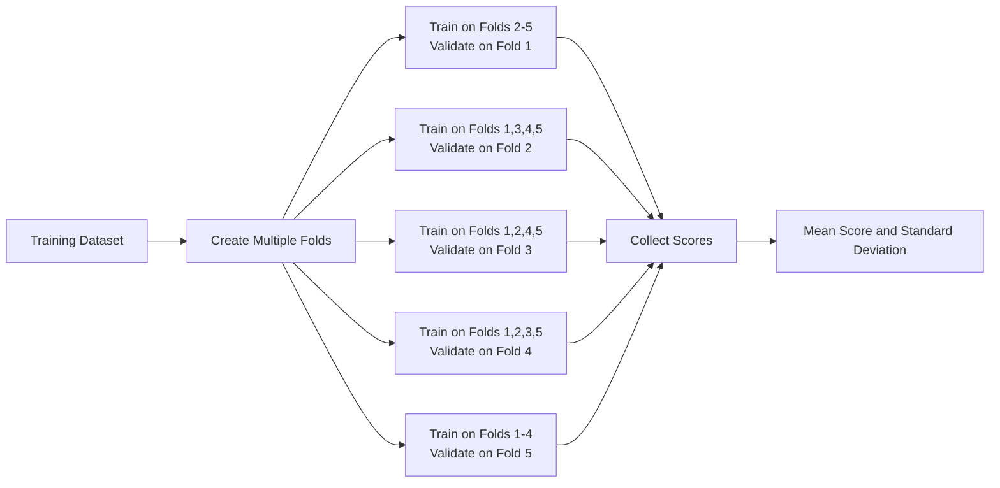
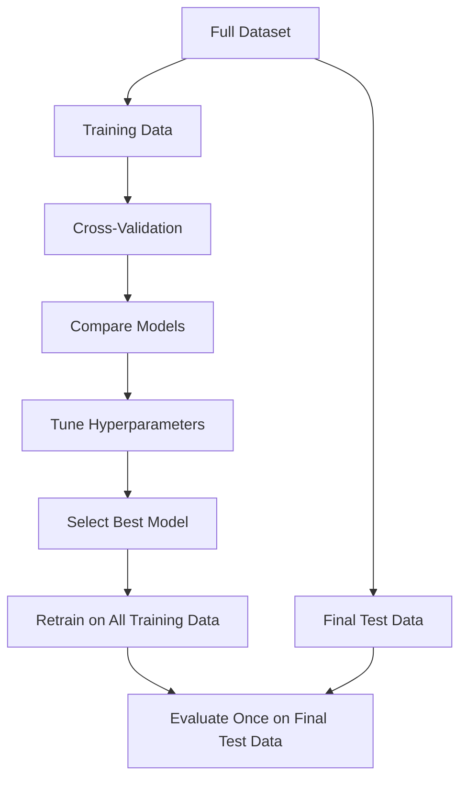
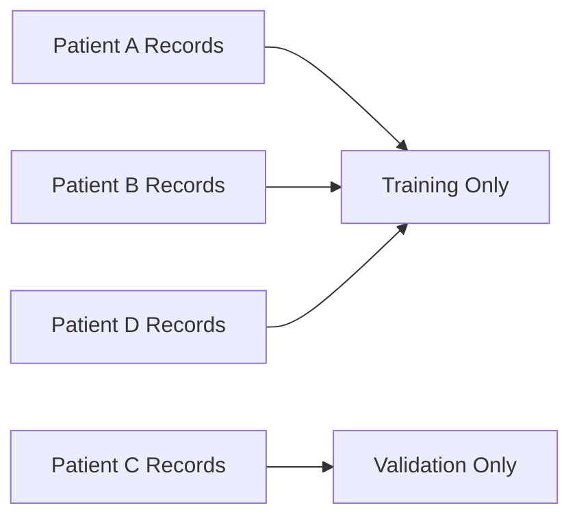
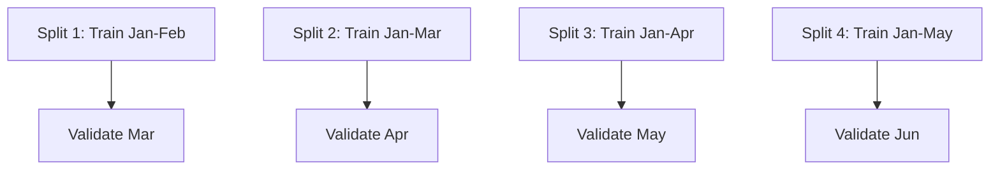
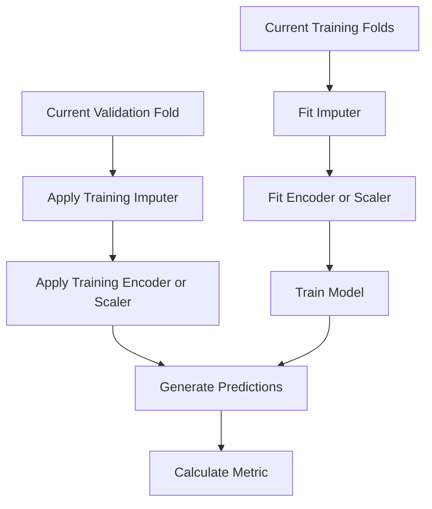
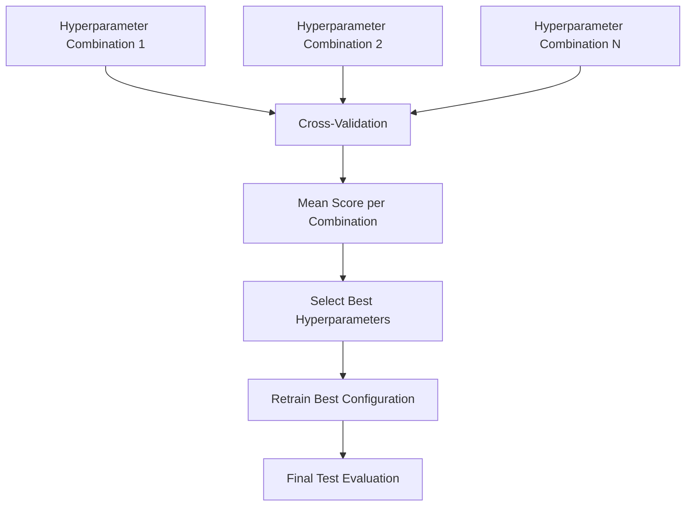
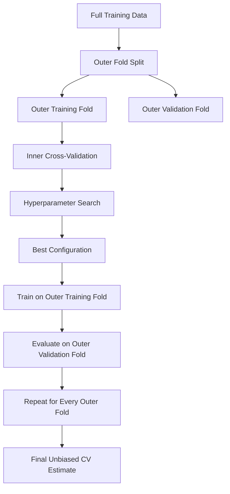
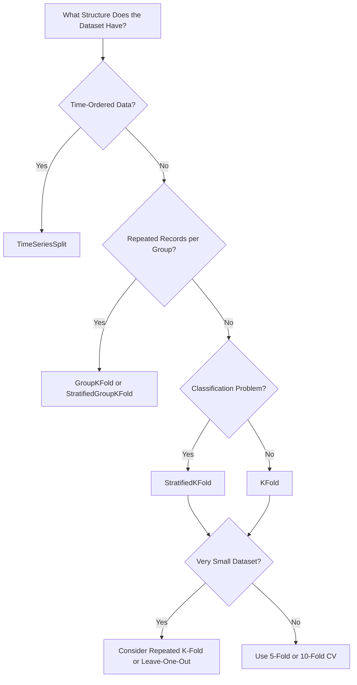
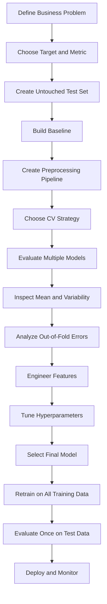

# 024 - Cross-Validation

**Course:** 03 - Machine Learning and Deep Learning
**Module:** Module 06 - Machine Learning
**Content Group:** Model Evaluation
**Roadmap Source:** Machine Learning / Model Evaluation
**Lesson Type:** Machine Learning
**Order in Module:** 024
**Suggested Duration:** 26 minutes

---

## 1. Summary

**Cross-validation** is a model evaluation technique used to estimate how well a machine learning model will perform on unseen data.

Instead of evaluating a model using only one train-validation split, cross-validation creates several different splits. The model is trained and evaluated multiple times, and the resulting scores are combined.

Cross-validation helps answer questions such as:

* Is the model performance stable across different subsets of data?
* Is one model consistently better than another?
* Are the selected hyperparameters likely to generalize?
* Is the validation score dependent on one lucky data split?
* Is the model overfitting the training data?

A proper cross-validation workflow must also:

* Prevent data leakage.
* Use an appropriate evaluation metric.
* Respect the structure of the data.
* Include preprocessing inside the validation process.
* Keep the final test set separate.

---

## 2. Learning Objectives

By the end of this lesson, you should be able to:

* Explain cross-validation in your own words.
* Describe why one train-validation split may be unreliable.
* Understand how K-Fold Cross-Validation works.
* Choose an appropriate cross-validation strategy.
* Apply cross-validation with scikit-learn.
* Use pipelines to prevent data leakage.
* Compare models using cross-validation scores.
* Distinguish validation data from final test data.
* Recognize when standard K-Fold Cross-Validation should not be used.
* Apply cross-validation to a house price prediction project.

---

## 3. Why Do We Need Cross-Validation?

A common machine learning workflow divides a dataset into:

* Training set
* Validation set
* Test set

```text
Full Dataset
    |
    +---- Training Set
    |
    +---- Validation Set
    |
    +---- Test Set
```

The training set is used to fit the model.

The validation set is used to:

* Compare models.
* Select features.
* Tune hyperparameters.
* Choose decision thresholds.

The test set is used only once for the final evaluation.

However, the result from a single validation split can be unstable.

For example, suppose two different random splits produce the following results:

| Split   | Validation RMSE |
| ------- | --------------: |
| Split A |          24,500 |
| Split B |          31,200 |

The model did not change, but its estimated performance changed significantly because the validation samples were different.

Cross-validation reduces this dependency on one particular split.

---

## 4. Core Idea

Cross-validation repeatedly divides the available training data into:

* A training portion.
* A validation portion.

The model is trained and evaluated several times.



The final cross-validation result is usually summarized using:

* Mean score.
* Standard deviation.
* Minimum and maximum scores.
* Scores for each fold.

---

## 5. K-Fold Cross-Validation

### 5.1 Definition

In **K-Fold Cross-Validation**, the dataset is divided into (K) approximately equal subsets called folds.

The process is repeated (K) times:

1. Select one fold as the validation set.
2. Use the remaining (K-1) folds as the training set.
3. Train the model.
4. Evaluate the model.
5. Select another fold as the validation set.
6. Repeat until every fold has been used for validation.

Each observation is:

* Used for training (K-1) times.
* Used for validation exactly once.

---

### 5.2 Five-Fold Example

Suppose a dataset is divided into five folds:

```text
Fold 1 | Fold 2 | Fold 3 | Fold 4 | Fold 5
```

The five training and validation rounds are:

```text
Round 1: [Validation] [Training]   [Training]   [Training]   [Training]
Round 2: [Training]   [Validation] [Training]   [Training]   [Training]
Round 3: [Training]   [Training]   [Validation] [Training]   [Training]
Round 4: [Training]   [Training]   [Training]   [Validation] [Training]
Round 5: [Training]   [Training]   [Training]   [Training]   [Validation]
```

A tabular representation:

| Round | Fold 1     | Fold 2     | Fold 3     | Fold 4     | Fold 5     |
| ----- | ---------- | ---------- | ---------- | ---------- | ---------- |
| 1     | Validation | Train      | Train      | Train      | Train      |
| 2     | Train      | Validation | Train      | Train      | Train      |
| 3     | Train      | Train      | Validation | Train      | Train      |
| 4     | Train      | Train      | Train      | Validation | Train      |
| 5     | Train      | Train      | Train      | Train      | Validation |

---

## 6. Calculating the Cross-Validation Score

Suppose five-fold cross-validation produces the following RMSE values:

$$
24{,}000,\ 25{,}500,\ 23{,}800,\ 27{,}200,\ 24{,}500
$$

The mean cross-validation score is:

$$
\overline{RMSE} = \frac{24{,}000 + 25{,}500 + 23{,}800 + 27{,}200 + 24{,}500}{5}
$$

$$
\overline{RMSE} = 25{,}000
$$

The result may be reported as:

$$
RMSE = 25{,}000 \pm 1{,}220
$$

where:

* (25{,}000) is the mean RMSE.
* (1{,}220) is approximately the standard deviation across folds.

A lower RMSE is better.

---

## 7. Mean Score and Standard Deviation

The mean score estimates average model performance:

$$
\bar{s} = \frac{1}{K} \sum_{i=1}^{K} s_i
$$

where:

* (K) is the number of folds.
* (s_i) is the score from fold (i).

The standard deviation measures performance variability:

$$
\sigma_s = \sqrt{ \frac{1}{K} \sum_{i=1}^{K} (s_i-\bar{s})^2 }
$$

A good model generally has:

* A strong average score.
* A relatively small standard deviation.
* Similar performance across folds.

For example:

| Model             | Mean RMSE | Standard Deviation |
| ----------------- | --------: | -----------------: |
| Linear Regression |    31,200 |              1,100 |
| Random Forest     |    25,300 |              5,800 |
| XGBoost           |    24,900 |              1,400 |

Random Forest has a good mean score, but its high variability may indicate that its performance depends heavily on the selected data split.

XGBoost has both:

* The lowest average RMSE.
* More stable performance.

---

## 8. Cross-Validation Does Not Replace the Test Set

Cross-validation is normally performed on the training portion of the dataset.

The test set must remain untouched until the final model has been selected.



Correct workflow:

```text
Full data
    |
    +-- Training data
    |      |
    |      +-- Cross-validation
    |      +-- Model comparison
    |      +-- Hyperparameter tuning
    |
    +-- Test data
           |
           +-- Final unbiased evaluation
```

Incorrect workflow:

```text
Use test set repeatedly
    -> change model
    -> evaluate again
    -> change features
    -> evaluate again
```

Repeatedly using the test set causes the test set to become part of the model development process.

The final test score is no longer an unbiased estimate.

---

## 9. Common Cross-Validation Strategies

### 9.1 K-Fold Cross-Validation

Use K-Fold Cross-Validation when:

* Observations are independent.
* The data does not have a strong temporal order.
* There are no important groups that must stay together.
* The dataset is reasonably balanced.

Common values are:

$$
K = 5
$$

or:

$$
K = 10
$$

Example:

```python
from sklearn.model_selection import KFold

cv = KFold(
    n_splits=5,
    shuffle=True,
    random_state=42
)
```

---

### 9.2 Stratified K-Fold

**Stratified K-Fold** preserves the class distribution in every fold.

It is commonly used for classification, especially when classes are imbalanced.

Suppose the full dataset contains:

```text
90% Negative
10% Positive
```

A normal random split may accidentally create a validation fold with very few positive examples.

Stratified splitting attempts to preserve the same ratio:

```text
Fold 1: 90% Negative, 10% Positive
Fold 2: 90% Negative, 10% Positive
Fold 3: 90% Negative, 10% Positive
...
```

Example:

```python
from sklearn.model_selection import StratifiedKFold

cv = StratifiedKFold(
    n_splits=5,
    shuffle=True,
    random_state=42
)
```

Use it for problems such as:

* Fraud detection.
* Disease classification.
* Customer churn prediction.
* Spam detection.
* Defect detection.

---

### 9.3 Group K-Fold

**Group K-Fold** ensures that observations belonging to the same group never appear in both training and validation sets.

Examples of groups include:

* Customer ID.
* Patient ID.
* Device ID.
* Store ID.
* School ID.
* Product ID.

Suppose each patient has several medical records.

A normal random split could put:

* Some records from Patient A in training.
* Other records from Patient A in validation.

This may cause leakage because the model can learn patient-specific characteristics.

Group-based splitting keeps all records from the same patient together.



Example:

```python
from sklearn.model_selection import GroupKFold

cv = GroupKFold(n_splits=5)

scores = cross_val_score(
    estimator=model,
    X=X,
    y=y,
    groups=patient_ids,
    cv=cv,
    scoring="roc_auc"
)
```

---

### 9.4 Time Series Cross-Validation

Standard K-Fold Cross-Validation should not normally be used for time series data.

Random shuffling can allow future observations to predict past observations.

That is a form of data leakage.

Time series validation must preserve chronological order.

```text
Round 1:
Train      Validation
[Jan-Feb]  [Mar]

Round 2:
Train          Validation
[Jan-Mar]      [Apr]

Round 3:
Train              Validation
[Jan-Apr]          [May]

Round 4:
Train                  Validation
[Jan-May]              [Jun]
```



Example:

```python
from sklearn.model_selection import TimeSeriesSplit

cv = TimeSeriesSplit(n_splits=5)
```

Use time series cross-validation for:

* Sales forecasting.
* Stock or financial data.
* Demand forecasting.
* Sensor monitoring.
* Website traffic prediction.
* Energy consumption forecasting.

---

### 9.5 Leave-One-Out Cross-Validation

In **Leave-One-Out Cross-Validation**, each validation set contains exactly one observation.

If there are (n) observations:

$$
K = n
$$

For each iteration:

* Train on (n-1) observations.
* Validate on one observation.

Advantages:

* Uses nearly all observations for training.
* Can be useful for very small datasets.

Disadvantages:

* Computationally expensive.
* Can have high variance.
* Usually unnecessary for medium or large datasets.

Example:

```python
from sklearn.model_selection import LeaveOneOut

cv = LeaveOneOut()
```

---

### 9.6 Repeated K-Fold

Repeated K-Fold performs K-Fold Cross-Validation several times using different random splits.

Example:

```python
from sklearn.model_selection import RepeatedKFold

cv = RepeatedKFold(
    n_splits=5,
    n_repeats=3,
    random_state=42
)
```

This configuration produces:

$$
5 \times 3 = 15
$$

training and validation evaluations.

Repeated cross-validation can provide a more stable performance estimate, but it requires more computation.

---

## 10. Choosing the Number of Folds

Common choices include:

* 5 folds.
* 10 folds.

### Five-Fold Cross-Validation

Advantages:

* Faster.
* Common for medium and large datasets.
* Each model trains on 80% of the data.

### Ten-Fold Cross-Validation

Advantages:

* Each model trains on 90% of the data.
* May provide a more detailed estimate.

Disadvantages:

* Approximately twice as expensive as five-fold cross-validation.
* Does not always provide meaningfully better model selection.

A practical default is:

```python
n_splits = 5
```

The best value depends on:

* Dataset size.
* Model training cost.
* Class balance.
* Number of groups.
* Required evaluation stability.

---

## 11. Basic Regression Example

The following example evaluates a linear regression model using five-fold cross-validation.

```python
import numpy as np
from sklearn.datasets import fetch_california_housing
from sklearn.linear_model import LinearRegression
from sklearn.model_selection import KFold, cross_val_score

# Load data
data = fetch_california_housing()
X = data.data
y = data.target

# Create model
model = LinearRegression()

# Configure cross-validation
cv = KFold(
    n_splits=5,
    shuffle=True,
    random_state=42
)

# scikit-learn returns negative MSE because higher scores are preferred
negative_mse_scores = cross_val_score(
    estimator=model,
    X=X,
    y=y,
    cv=cv,
    scoring="neg_mean_squared_error"
)

# Convert negative MSE to RMSE
rmse_scores = np.sqrt(-negative_mse_scores)

print("RMSE for each fold:", rmse_scores)
print("Mean RMSE:", rmse_scores.mean())
print("RMSE standard deviation:", rmse_scores.std())
```

Possible output:

```text
RMSE for each fold: [0.75 0.73 0.70 0.76 0.72]
Mean RMSE: 0.732
RMSE standard deviation: 0.021
```

---

## 12. Why Are Some scikit-learn Scores Negative?

Scikit-learn follows the convention that:

> Higher scoring values should represent better models.

However, metrics such as MSE and RMSE are losses:

* Lower MSE is better.
* Lower RMSE is better.

Therefore, scikit-learn exposes scoring names such as:

```python
"neg_mean_squared_error"
```

The returned values are negative:

```text
[-0.56, -0.49, -0.64, ...]
```

Convert them back using:

```python
mse_scores = -negative_mse_scores
```

For RMSE:

```python
rmse_scores = np.sqrt(-negative_mse_scores)
```

Some scikit-learn versions also support:

```python
scoring="neg_root_mean_squared_error"
```

Then use:

```python
rmse_scores = -scores
```

---

## 13. Classification Example

The following example evaluates logistic regression using stratified cross-validation.

```python
from sklearn.datasets import load_breast_cancer
from sklearn.linear_model import LogisticRegression
from sklearn.model_selection import StratifiedKFold, cross_val_score
from sklearn.preprocessing import StandardScaler
from sklearn.pipeline import Pipeline

# Load dataset
data = load_breast_cancer()
X = data.data
y = data.target

# Build preprocessing and model pipeline
pipeline = Pipeline(
    steps=[
        ("scaler", StandardScaler()),
        (
            "model",
            LogisticRegression(
                max_iter=2000,
                random_state=42
            )
        )
    ]
)

# Preserve class distribution in each fold
cv = StratifiedKFold(
    n_splits=5,
    shuffle=True,
    random_state=42
)

scores = cross_val_score(
    estimator=pipeline,
    X=X,
    y=y,
    cv=cv,
    scoring="roc_auc"
)

print("ROC-AUC for each fold:", scores)
print("Mean ROC-AUC:", scores.mean())
print("ROC-AUC standard deviation:", scores.std())
```

---

## 14. Data Leakage During Cross-Validation

Data leakage occurs when information from the validation set influences the model training process.

A common mistake is preprocessing the complete dataset before cross-validation.

### Incorrect Workflow

```python
from sklearn.preprocessing import StandardScaler
from sklearn.model_selection import cross_val_score

scaler = StandardScaler()

# Incorrect: the scaler learns from the complete dataset
X_scaled = scaler.fit_transform(X)

scores = cross_val_score(
    model,
    X_scaled,
    y,
    cv=5
)
```

The scaler calculates the mean and standard deviation using:

* Training observations.
* Validation observations.

This leaks information from validation into training.

---

### Correct Workflow with Pipeline

```python
from sklearn.pipeline import Pipeline
from sklearn.preprocessing import StandardScaler
from sklearn.linear_model import LinearRegression
from sklearn.model_selection import cross_val_score

pipeline = Pipeline(
    steps=[
        ("scaler", StandardScaler()),
        ("model", LinearRegression())
    ]
)

scores = cross_val_score(
    estimator=pipeline,
    X=X,
    y=y,
    cv=5,
    scoring="neg_mean_squared_error"
)
```

During every fold, the pipeline performs:

```text
Training fold
    |
    +-- Fit preprocessing
    |
    +-- Transform training fold
    |
    +-- Train model
    |
Validation fold
    |
    +-- Apply preprocessing learned from training fold
    |
    +-- Evaluate model
```



---

## 15. Operations That Must Be Inside the Pipeline

Any transformation that learns information from data should usually be fitted inside cross-validation.

Examples include:

* Missing-value imputation.
* Standardization.
* Normalization.
* Categorical encoding.
* Feature selection.
* PCA.
* Outlier thresholds.
* Target encoding.
* Text vectorization.
* Polynomial feature construction.
* Learned dimensionality reduction.

A pipeline ensures that each transformation is learned only from the current training folds.

---

## 16. House Price Pipeline Example

```python
import numpy as np
import pandas as pd

from sklearn.compose import ColumnTransformer
from sklearn.ensemble import RandomForestRegressor
from sklearn.impute import SimpleImputer
from sklearn.model_selection import KFold, cross_val_score
from sklearn.pipeline import Pipeline
from sklearn.preprocessing import OneHotEncoder, StandardScaler

# Example feature groups
numeric_features = [
    "area",
    "bedrooms",
    "bathrooms",
    "house_age"
]

categorical_features = [
    "district",
    "property_type"
]

numeric_pipeline = Pipeline(
    steps=[
        (
            "imputer",
            SimpleImputer(strategy="median")
        ),
        (
            "scaler",
            StandardScaler()
        )
    ]
)

categorical_pipeline = Pipeline(
    steps=[
        (
            "imputer",
            SimpleImputer(strategy="most_frequent")
        ),
        (
            "encoder",
            OneHotEncoder(
                handle_unknown="ignore"
            )
        )
    ]
)

preprocessor = ColumnTransformer(
    transformers=[
        (
            "numeric",
            numeric_pipeline,
            numeric_features
        ),
        (
            "categorical",
            categorical_pipeline,
            categorical_features
        )
    ]
)

model = RandomForestRegressor(
    n_estimators=300,
    random_state=42,
    n_jobs=-1
)

pipeline = Pipeline(
    steps=[
        ("preprocessor", preprocessor),
        ("model", model)
    ]
)

cv = KFold(
    n_splits=5,
    shuffle=True,
    random_state=42
)

negative_mse_scores = cross_val_score(
    estimator=pipeline,
    X=X,
    y=y,
    cv=cv,
    scoring="neg_mean_squared_error",
    n_jobs=-1
)

rmse_scores = np.sqrt(-negative_mse_scores)

print("Fold RMSE:", rmse_scores)
print(f"Mean RMSE: {rmse_scores.mean():,.2f}")
print(f"Standard deviation: {rmse_scores.std():,.2f}")
```

---

## 17. Evaluating Multiple Metrics

A model should not always be evaluated using only one metric.

For classification, useful metrics may include:

* Accuracy.
* Precision.
* Recall.
* F1-score.
* ROC-AUC.
* Average precision.

For regression:

* MAE.
* MSE.
* RMSE.
* (R^2).

Use `cross_validate` to calculate multiple metrics.

```python
from sklearn.model_selection import cross_validate

scoring = {
    "mae": "neg_mean_absolute_error",
    "rmse": "neg_root_mean_squared_error",
    "r2": "r2"
}

results = cross_validate(
    estimator=pipeline,
    X=X,
    y=y,
    cv=cv,
    scoring=scoring,
    return_train_score=True,
    n_jobs=-1
)

mean_train_r2 = results["train_r2"].mean()
mean_validation_r2 = results["test_r2"].mean()

mean_validation_mae = -results["test_mae"].mean()
mean_validation_rmse = -results["test_rmse"].mean()

print("Mean train R²:", mean_train_r2)
print("Mean validation R²:", mean_validation_r2)
print("Mean validation MAE:", mean_validation_mae)
print("Mean validation RMSE:", mean_validation_rmse)
```

---

## 18. Train Scores Versus Validation Scores

Cross-validation can return both training and validation scores.

These scores help diagnose:

* Underfitting.
* Overfitting.
* Stable generalization.

### Case 1: Underfitting

```text
Training score: poor
Validation score: poor
```

Possible causes:

* Model is too simple.
* Features are weak.
* Excessive regularization.
* Important relationships are missing.

### Case 2: Overfitting

```text
Training score: excellent
Validation score: poor
```

Possible causes:

* Model is too complex.
* Dataset is small.
* Too many irrelevant features.
* Weak regularization.
* Leakage may be present.

### Case 3: Good Generalization

```text
Training score: good
Validation score: good
Small gap between them
```

A simple diagnostic table:

| Train Performance    | Validation Performance | Interpretation            |
| -------------------- | ---------------------- | ------------------------- |
| Poor                 | Poor                   | Underfitting              |
| Excellent            | Poor                   | Overfitting               |
| Good                 | Good                   | Reasonable generalization |
| Suspiciously perfect | Suspiciously perfect   | Possible leakage          |

---

## 19. Comparing Multiple Models

Cross-validation is useful for comparing models under the same evaluation procedure.

```python
import numpy as np

from sklearn.ensemble import RandomForestRegressor, GradientBoostingRegressor
from sklearn.linear_model import LinearRegression
from sklearn.model_selection import cross_val_score
from sklearn.pipeline import Pipeline

models = {
    "Linear Regression": LinearRegression(),
    "Random Forest": RandomForestRegressor(
        n_estimators=300,
        random_state=42,
        n_jobs=-1
    ),
    "Gradient Boosting": GradientBoostingRegressor(
        random_state=42
    )
}

results = []

for model_name, model in models.items():
    pipeline = Pipeline(
        steps=[
            ("preprocessor", preprocessor),
            ("model", model)
        ]
    )

    scores = cross_val_score(
        estimator=pipeline,
        X=X,
        y=y,
        cv=cv,
        scoring="neg_root_mean_squared_error",
        n_jobs=-1
    )

    rmse_scores = -scores

    results.append(
        {
            "model": model_name,
            "mean_rmse": rmse_scores.mean(),
            "std_rmse": rmse_scores.std()
        }
    )

results_df = pd.DataFrame(results)
results_df = results_df.sort_values("mean_rmse")

print(results_df)
```

Example output:

| Model             | Mean RMSE | Standard Deviation |
| ----------------- | --------: | -----------------: |
| Gradient Boosting |    22,450 |              1,150 |
| Random Forest     |    23,100 |              1,380 |
| Linear Regression |    29,700 |              1,020 |

Do not choose a model only because its mean score is slightly better.

Also consider:

* Score variability.
* Training time.
* Inference speed.
* Interpretability.
* Memory usage.
* Operational complexity.
* Business requirements.

---

## 20. Cross-Validation for Hyperparameter Tuning

Cross-validation is often combined with hyperparameter search.

### Grid Search

```python
from sklearn.model_selection import GridSearchCV

pipeline = Pipeline(
    steps=[
        ("preprocessor", preprocessor),
        (
            "model",
            RandomForestRegressor(
                random_state=42,
                n_jobs=-1
            )
        )
    ]
)

parameter_grid = {
    "model__n_estimators": [100, 300],
    "model__max_depth": [None, 10, 20],
    "model__min_samples_leaf": [1, 3, 5]
}

search = GridSearchCV(
    estimator=pipeline,
    param_grid=parameter_grid,
    scoring="neg_root_mean_squared_error",
    cv=5,
    n_jobs=-1,
    return_train_score=True
)

search.fit(X_train, y_train)

print("Best parameters:", search.best_params_)
print("Best validation RMSE:", -search.best_score_)
```

The search process evaluates each hyperparameter combination across all folds.



---

## 21. Nested Cross-Validation

Using the same cross-validation results for both:

* Hyperparameter selection.
* Final performance reporting.

may produce an optimistic estimate.

**Nested Cross-Validation** separates model selection from model evaluation.

It contains:

* An outer cross-validation loop for performance estimation.
* An inner cross-validation loop for hyperparameter tuning.



Conceptually:

```text
Outer Fold 1:
    Inner CV selects hyperparameters
    Evaluate selected model on Outer Validation Fold 1

Outer Fold 2:
    Inner CV selects hyperparameters
    Evaluate selected model on Outer Validation Fold 2

...

Average all outer validation scores
```

Nested cross-validation is especially useful when:

* The dataset is small.
* Many hyperparameters are tested.
* A reliable model comparison is required.
* The reported score will support scientific or business decisions.

---

## 22. Out-of-Fold Predictions

Cross-validation can generate a prediction for every training observation using a model that was not trained on that observation.

These are called **out-of-fold predictions**.

```python
from sklearn.model_selection import cross_val_predict

oof_predictions = cross_val_predict(
    estimator=pipeline,
    X=X,
    y=y,
    cv=cv,
    method="predict",
    n_jobs=-1
)
```

Out-of-fold predictions are useful for:

* Error analysis.
* Residual plots.
* Threshold selection.
* Model stacking.
* Calibration analysis.
* Comparing predictions across subgroups.

Regression residuals can be calculated as:

$$
e_i = y_i - \hat{y}_i^{OOF}
$$

```python
residuals = y - oof_predictions
```

---

## 23. Cross-Validation Error Analysis

A mean score alone does not explain why the model fails.

After generating out-of-fold predictions, inspect errors by:

* Price range.
* Geographic region.
* Property type.
* Customer segment.
* Time period.
* Class label.
* Data quality level.

Example:

```python
analysis_df = X.copy()
analysis_df["actual_price"] = y
analysis_df["predicted_price"] = oof_predictions
analysis_df["absolute_error"] = (
    analysis_df["actual_price"]
    - analysis_df["predicted_price"]
).abs()

error_by_property_type = (
    analysis_df
    .groupby("property_type")["absolute_error"]
    .agg(["mean", "median", "count"])
    .sort_values("mean", ascending=False)
)

print(error_by_property_type)
```

This may reveal that the model performs poorly for:

* Luxury properties.
* Rare property types.
* Specific districts.
* Houses with missing renovation information.

That information can guide the next feature-engineering experiment.

---

## 24. Choosing the Correct Cross-Validation Strategy

Use the structure of the data to choose the validation strategy.



A practical guide:

| Data Situation                        | Recommended Strategy              |
| ------------------------------------- | --------------------------------- |
| Standard regression data              | K-Fold                            |
| Balanced classification               | Stratified K-Fold                 |
| Imbalanced classification             | Stratified K-Fold                 |
| Multiple rows per customer            | Group K-Fold                      |
| Multiple rows per patient             | Group K-Fold                      |
| Grouped and imbalanced classification | Stratified Group K-Fold           |
| Chronological data                    | Time Series Split                 |
| Very small independent dataset        | Repeated K-Fold or Leave-One-Out  |
| Geographic clusters                   | Group-based or spatial validation |
| Future deployment period              | Time-based holdout                |

---

## 25. Common Mistakes

### 25.1 Preprocessing Before Cross-Validation

Incorrect:

```python
X_scaled = scaler.fit_transform(X)
cross_val_score(model, X_scaled, y, cv=5)
```

Correct:

```python
pipeline = Pipeline([
    ("scaler", StandardScaler()),
    ("model", model)
])

cross_val_score(pipeline, X, y, cv=5)
```

---

### 25.2 Using the Test Set for Model Selection

Incorrect process:

```text
Train model
    -> check test score
    -> modify model
    -> check test score again
```

The test set must be used only after the final model has been selected.

---

### 25.3 Using Random K-Fold for Time Series

Random folds can allow future information into training.

Use chronological validation instead.

---

### 25.4 Splitting Related Observations Across Folds

Examples:

* Images from the same patient.
* Transactions from the same customer.
* Measurements from the same device.
* Multiple samples from the same subject.

Use group-based cross-validation.

---

### 25.5 Ignoring Class Imbalance

A classification fold may contain too few positive examples.

Use stratified cross-validation and an appropriate metric.

---

### 25.6 Using the Wrong Metric

Accuracy may be misleading for imbalanced classification.

For example:

```text
Negative class: 99%
Positive class: 1%
```

A model that always predicts negative obtains:

$$
Accuracy = 99%
$$

but has:

$$
Recall_{positive} = 0
$$

Better metrics may include:

* Recall.
* Precision.
* F1-score.
* ROC-AUC.
* Average precision.

---

### 25.7 Comparing Models with Different Folds

If models are evaluated using different splits, score differences may be caused by the split rather than the model.

Use the same cross-validation object:

```python
cv = KFold(
    n_splits=5,
    shuffle=True,
    random_state=42
)
```

Pass the same `cv` object to every model evaluation.

---

### 25.8 Selecting the Model with the Best Mean Only

A model with a slightly better mean but much higher variability may be less reliable.

Compare:

* Mean score.
* Standard deviation.
* Fold-level scores.
* Business performance.
* Computational requirements.

---

### 25.9 Creating Features from the Entire Dataset

Potential leakage examples include:

* Global target averages.
* Encoding categories using the full target column.
* Filling missing values with full-dataset statistics.
* Selecting features using the full target vector.
* Calculating future-aware rolling statistics.

These operations must be performed within the training fold.

---

### 25.10 Assuming Cross-Validation Guarantees Production Performance

Cross-validation estimates performance under the assumptions represented by the splitting strategy.

It may still fail to represent:

* Future distribution shifts.
* New customer populations.
* New geographic regions.
* Changes in user behavior.
* Changes in data collection.
* Production latency constraints.

The validation design should imitate the production environment as closely as possible.

---

## 26. Cross-Validation and Business Questions

A model is not valuable simply because it has a high score.

Cross-validation should support a business decision.

For a house price prediction system, business questions may include:

* Is the average pricing error small enough for property agents?
* Does the model work equally well across districts?
* Are luxury houses systematically underestimated?
* Is performance stable between older and newer properties?
* Is the improvement large enough to justify a more complex model?
* Can the model produce predictions within the required latency?
* How often must the model be retrained?

A model with slightly worse RMSE may still be preferred when it is:

* Faster.
* Easier to explain.
* Less expensive to operate.
* More stable.
* Easier to monitor.
* More reliable across important customer groups.

---

## 27. Suggested End-to-End Workflow



A practical implementation sequence:

```text
data
  -> define target
  -> create final test set
  -> identify numeric and categorical features
  -> build preprocessing pipeline
  -> train baseline
  -> choose cross-validation strategy
  -> compare models
  -> perform error analysis
  -> engineer new features
  -> tune hyperparameters
  -> select final model
  -> retrain
  -> final test evaluation
  -> deployment
```

---

## 28. Practical Exercise

### Dataset

Use a house price dataset containing features such as:

* Living area.
* Number of bedrooms.
* Number of bathrooms.
* Property age.
* District.
* Property type.
* Distance to city center.
* Renovation status.
* Sale price.

### Task 1: Prepare the Data

1. Load the dataset.
2. Define `X` and `y`.
3. Create an untouched test set.
4. Identify numeric and categorical columns.
5. Inspect missing values.

---

### Task 2: Create a Baseline

Create a baseline that predicts the median training price.

```python
from sklearn.dummy import DummyRegressor
from sklearn.model_selection import cross_val_score

baseline = DummyRegressor(strategy="median")

baseline_scores = cross_val_score(
    estimator=baseline,
    X=X_train,
    y=y_train,
    cv=cv,
    scoring="neg_root_mean_squared_error"
)

baseline_rmse = -baseline_scores

print("Baseline mean RMSE:", baseline_rmse.mean())
```

---

### Task 3: Train Multiple Models

Train and evaluate at least:

* Linear Regression.
* Random Forest.
* Gradient Boosting or XGBoost.

For each model, record:

* Mean MAE.
* Mean RMSE.
* Mean (R^2).
* Standard deviation.
* Training time.

Example experiment table:

| Model             | Mean MAE | Mean RMSE | Mean (R^2) | RMSE Std. | Training Time |
| ----------------- | -------: | --------: | ---------: | --------: | ------------: |
| Median Baseline   |   41,200 |    59,500 |      -0.02 |     2,100 |         0.1 s |
| Linear Regression |   28,300 |    40,100 |       0.62 |     1,800 |         0.4 s |
| Random Forest     |   19,600 |    29,200 |       0.80 |     1,500 |         8.4 s |
| Gradient Boosting |   18,900 |    28,400 |       0.82 |     1,200 |         3.1 s |

---

### Task 4: Perform Error Analysis

Generate out-of-fold predictions.

Investigate:

* The ten largest errors.
* Error by district.
* Error by property type.
* Error by price range.
* Underprediction versus overprediction.
* Performance for rare categories.

Example questions:

```text
Does the model underestimate expensive properties?

Does the model perform worse in districts with fewer examples?

Are missing renovation values associated with larger errors?

Would price per square meter improve performance?
```

---

### Task 5: Add One New Feature

Possible engineered features:

```python
price_related_area = total_area / max(number_of_rooms, 1)
property_age = sale_year - construction_year
total_rooms = bedrooms + bathrooms
is_renovated = renovation_year.notna()
distance_category = pd.cut(distance_to_center, bins=[0, 5, 10, 20, 100])
```

Evaluate whether the new feature improves cross-validation performance.

Do not evaluate the feature repeatedly on the final test set.

---

### Task 6: Final Evaluation

After selecting the final model:

1. Train it on all training data.
2. Evaluate it once on the untouched test set.
3. Compare test performance with cross-validation performance.
4. Document any difference.

```python
best_model.fit(X_train, y_train)

test_predictions = best_model.predict(X_test)
```

---

## 29. Experiment Record Template

```markdown
## Experiment Name

House Price Model Comparison

## Business Question

Can the model estimate sale prices accurately enough to support property agents?

## Dataset

- Number of rows:
- Number of features:
- Target:
- Time period:
- Geographic coverage:

## Validation Design

- Final test split:
- Cross-validation strategy:
- Number of folds:
- Random seed:
- Grouping or time constraints:

## Preprocessing

- Missing-value handling:
- Numeric scaling:
- Categorical encoding:
- Feature engineering:

## Models

1. Baseline
2. Linear Regression
3. Random Forest
4. Gradient Boosting

## Metrics

- MAE
- RMSE
- R-squared

## Results

| Model | Mean CV RMSE | CV Std. | Test RMSE |
|---|---:|---:|---:|
| Baseline | | | |
| Linear Regression | | | |
| Random Forest | | | |
| Gradient Boosting | | | |

## Error Analysis

- Largest error segment:
- Underprediction pattern:
- Overprediction pattern:
- Missing-data issue:
- Potential leakage checks:

## Decision

Selected model:

Reason:

## Next Experiment

New feature, model, or data improvement:
```

---

## 30. Completion Checklist

* [ ] I can explain cross-validation in one or two minutes.
* [ ] I understand why one validation split may be unreliable.
* [ ] I can explain how K-Fold Cross-Validation works.
* [ ] I know the difference between validation data and final test data.
* [ ] I can choose between K-Fold, Stratified K-Fold, Group K-Fold, and Time Series Split.
* [ ] I can calculate the mean and standard deviation of fold scores.
* [ ] I use the same folds when comparing models.
* [ ] I place preprocessing inside a pipeline.
* [ ] I avoid fitting transformations on the complete dataset.
* [ ] I use metrics that reflect the business problem.
* [ ] I have compared a baseline with at least one machine learning model.
* [ ] I have generated out-of-fold predictions for error analysis.
* [ ] I have documented at least one assumption, caveat, or next experiment.
* [ ] I have kept the final test set untouched during model development.
* [ ] I have created a notebook, chart, experiment report, model, API, or portfolio note for this lesson.

---

## 31. Key Takeaways

1. Cross-validation estimates how well a model may generalize to unseen data.

2. K-Fold Cross-Validation trains and evaluates the model across several different data splits.

3. The average score measures expected performance, while score variability measures stability.

4. The cross-validation strategy must match the structure of the data.

5. Stratified splitting is useful for classification problems.

6. Group-based splitting is required when related observations must remain together.

7. Time series data requires chronological validation.

8. Preprocessing must be fitted separately inside every training fold.

9. Pipelines are one of the most effective ways to prevent data leakage.

10. Cross-validation supports model selection, but it does not replace an untouched final test set.

11. A high score is not enough; the model must solve the business problem reliably.

12. Error analysis is necessary to understand where and why the model fails.

---

## 32. Related Outcome

Train, compare, and evaluate supervised and unsupervised machine learning models using:

* Appropriate validation strategies.
* Thoughtful feature engineering.
* Relevant evaluation metrics.
* Leakage-safe pipelines.
* Reproducible experiments.
* Business-oriented error analysis.

---

## 33. Related Project

### Mini Project: House Price Prediction

Build a complete regression workflow containing:

* Exploratory Data Analysis.
* Missing-value treatment.
* Numeric and categorical preprocessing.
* Feature engineering.
* Median prediction baseline.
* Linear Regression.
* Random Forest.
* Gradient Boosting or XGBoost.
* Five-fold cross-validation.
* MAE, RMSE, and (R^2) comparison.
* Out-of-fold error analysis.
* Hyperparameter tuning.
* Final test evaluation.
* Model report or small prediction API.

Suggested portfolio artifacts:

```text
house-price-project/
├── data/
├── notebooks/
│   ├── 01_eda.ipynb
│   ├── 02_feature_engineering.ipynb
│   ├── 03_cross_validation.ipynb
│   └── 04_error_analysis.ipynb
├── src/
│   ├── preprocessing.py
│   ├── train.py
│   └── predict.py
├── models/
├── reports/
│   ├── model_comparison.csv
│   └── experiment_report.md
├── app.py
├── requirements.txt
└── README.md
```

---

## 34. Conclusion

**Cross-validation** is a fundamental part of the machine learning model-selection workflow.

It provides a more reliable evaluation than a single train-validation split by testing the model across multiple subsets of the data. However, cross-validation is useful only when its splitting strategy matches the real structure of the problem.

A strong cross-validation workflow should include:

```text
appropriate data splitting
    + leakage-safe preprocessing
    + baseline comparison
    + relevant metrics
    + fold stability analysis
    + out-of-fold error analysis
    + untouched final test set
```

Turn this lesson into a practical artifact such as:

* A reproducible notebook.
* A model comparison table.
* A cross-validation chart.
* An error-analysis report.
* A trained model.
* A prediction API.
* A Docker service.
* A portfolio project.

The goal is not merely to obtain the highest cross-validation score. The goal is to select a model that generalizes reliably and creates value for the real business problem.
