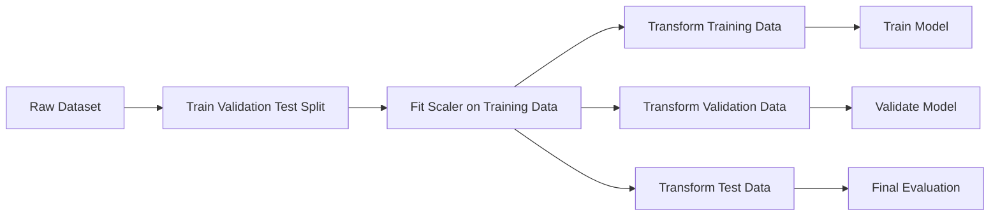
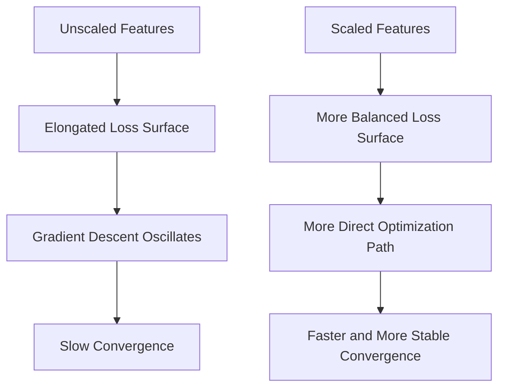
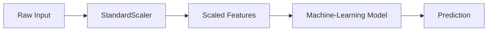
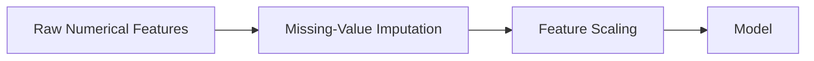
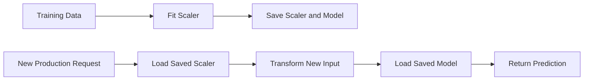

# 026 — Feature Scaling

**Course:** 03 — Machine Learning and Deep Learning
**Module:** Module 06 — Machine Learning
**Content Group:** Feature Engineering
**Roadmap Source:** Machine Learning / Feature Engineering
**Lesson Type:** Machine Learning
**Order in Module:** 026
**Suggested Duration:** 26 minutes

---

## 1. Overview

**Feature scaling** is the process of transforming numerical features so that they have comparable ranges or statistical properties.

For example, consider a house-price dataset:

| Feature                 |  Typical Range |
| ----------------------- | -------------: |
| Number of bedrooms      |            1–6 |
| House area              |      40–500 m² |
| Annual income           | 20,000–500,000 |
| Distance to city center |        0–50 km |

Without scaling, a feature such as annual income may numerically dominate a feature such as the number of bedrooms, even when both are important.

Scaling is especially important for models that depend on:

* Distance calculations
* Gradient-based optimization
* Feature magnitude
* Variance
* Regularization

Scaling does **not** automatically improve every model. Tree-based models such as Decision Trees, Random Forests, XGBoost, and LightGBM are usually much less sensitive to feature scale.

---

## 2. Learning Objectives

After completing this lesson, you should be able to:

* Explain feature scaling in your own words.
* Identify which machine-learning models require scaling.
* Distinguish between standardization and normalization.
* Apply `StandardScaler`, `MinMaxScaler`, and `RobustScaler`.
* Avoid data leakage when fitting a scaler.
* Use a pipeline to combine scaling and model training.
* Evaluate whether scaling improves model performance.
* Document scaling decisions in a notebook or machine-learning project.

---

## 3. Why Feature Scaling Matters

Suppose we have two observations:

| Sample | Age | Annual Income |
| ------ | --: | ------------: |
| A      |  25 |        30,000 |
| B      |  40 |        90,000 |

The Euclidean distance is:

$$
d(A,B) = \sqrt{(40-25)^2 + (90000-30000)^2}
$$

$$
d(A,B) = \sqrt{15^2 + 60000^2}
$$

The income difference completely dominates the age difference.

This does not necessarily mean income is more important. It only means income has a much larger numerical scale.

After scaling, the features may become:

| Sample | Scaled Age | Scaled Income |
| ------ | ---------: | ------------: |
| A      |       -0.8 |          -0.7 |
| B      |        0.9 |           1.1 |

Now both features can contribute more fairly to the distance calculation.

---

## 4. Scaling in the Machine-Learning Workflow



The most important rule is:

> Fit the scaler only on the training data.

The validation and test sets must be transformed using the parameters learned from the training set.

---

## 5. Standardization

Standardization transforms a feature so that it has approximately:

* Mean equal to 0
* Standard deviation equal to 1

The formula is:

$$
z = \frac{x-\mu}{\sigma}
$$

Where:

* (x) is the original value.
* (\mu) is the mean of the training feature.
* (\sigma) is the standard deviation of the training feature.
* (z) is the standardized value.

### Example

Suppose the house-area feature has:

$$
\mu = 150
$$

$$
\sigma = 50
$$

For a house with an area of 200 m²:

$$
z = \frac{200-150}{50}=1
$$

The value is one standard deviation above the mean.

### Python example

```python
from sklearn.preprocessing import StandardScaler

scaler = StandardScaler()

X_train_scaled = scaler.fit_transform(X_train)
X_validation_scaled = scaler.transform(X_validation)
X_test_scaled = scaler.transform(X_test)
```

### When to use StandardScaler

`StandardScaler` is a common choice for:

* Linear Regression
* Logistic Regression
* Support Vector Machines
* K-Nearest Neighbors
* K-Means
* Principal Component Analysis
* Neural Networks
* Models with L1 or L2 regularization

---

## 6. Min-Max Normalization

Min-max normalization transforms values into a fixed range, commonly:

$$
[0,1]
$$

The formula is:

$$
x' = \frac{x-x_{\min}} {x_{\max}-x_{\min}}
$$

Where:

* (x_{\min}) is the minimum training value.
* (x_{\max}) is the maximum training value.
* (x') is the scaled value.

### Example

Suppose house size ranges from 50 m² to 250 m².

For a house of 150 m²:

$$
x' = # \frac{150-50}{250-50} # \frac{100}{200} 0.5
$$

### Python example

```python
from sklearn.preprocessing import MinMaxScaler

scaler = MinMaxScaler(feature_range=(0, 1))

X_train_scaled = scaler.fit_transform(X_train)
X_validation_scaled = scaler.transform(X_validation)
X_test_scaled = scaler.transform(X_test)
```

### Advantages

* Produces values in a predictable range.
* Useful when a model expects bounded inputs.
* Preserves the relative ordering of values.
* Often useful for neural-network input features.

### Limitations

Min-max scaling is sensitive to outliers.

For example:

```text
Original values: 10, 12, 14, 16, 1000
```

The value `1000` makes the normal values appear extremely close together after scaling.

---

## 7. Robust Scaling

`RobustScaler` uses statistics that are less sensitive to extreme values.

It typically centers data using the median and scales it using the interquartile range:

$$
x' = \frac{x-\text{median}(x)} {Q_3-Q_1}
$$

Where:

* (Q_1) is the first quartile.
* (Q_3) is the third quartile.
* (Q_3-Q_1) is the interquartile range.

### Python example

```python
from sklearn.preprocessing import RobustScaler

scaler = RobustScaler()

X_train_scaled = scaler.fit_transform(X_train)
X_validation_scaled = scaler.transform(X_validation)
X_test_scaled = scaler.transform(X_test)
```

### When to use RobustScaler

Use robust scaling when:

* The dataset contains meaningful outliers.
* Removing outliers is not appropriate.
* Standard scaling is heavily affected by extreme values.
* Financial, transaction, or sensor features have long-tailed distributions.

---

## 8. Comparison of Common Scaling Methods

| Method         | Transformation                      | Best Used When                                                                    | Main Limitation                           |
| -------------- | ----------------------------------- | --------------------------------------------------------------------------------- | ----------------------------------------- |
| StandardScaler | Mean 0, standard deviation 1        | Features are approximately normally distributed or models use gradients/distances | Sensitive to outliers                     |
| MinMaxScaler   | Maps values into a fixed range      | Bounded input is useful                                                           | Highly sensitive to outliers              |
| RobustScaler   | Uses median and interquartile range | Data contains outliers                                                            | Output does not have a fixed range        |
| MaxAbsScaler   | Divides by maximum absolute value   | Sparse data should remain sparse                                                  | Sensitive to extreme values               |
| Normalizer     | Scales each row to unit length      | Text vectors or cosine-based analysis                                             | Operates on rows, not individual features |

---

## 9. Scaling vs. Normalization

The terms are sometimes used inconsistently.

In many machine-learning contexts:

* **Standardization** means transforming a feature to mean 0 and standard deviation 1.
* **Normalization** means transforming values into a fixed range such as ([0,1]).

However, scikit-learn also provides a `Normalizer` class that scales each individual sample rather than each feature.

### Feature scaling

```text
Column-wise operation
```

Each feature is scaled using statistics calculated from that feature.

### Vector normalization

```text
Row-wise operation
```

Each observation is transformed so that its vector has unit length.

For L2 normalization:

$$
x' = \frac{x}{\sqrt{x_1^2+x_2^2+\cdots+x_n^2}}
$$

This is often used for:

* Text embeddings
* TF-IDF vectors
* Cosine similarity
* Information retrieval

---

## 10. Which Models Need Scaling?

### Models that usually benefit from scaling

| Model                  | Why Scaling Matters                                             |
| ---------------------- | --------------------------------------------------------------- |
| K-Nearest Neighbors    | Uses distance between observations                              |
| K-Means                | Assigns clusters using distance                                 |
| Support Vector Machine | Margin and kernel calculations depend on scale                  |
| Logistic Regression    | Gradient optimization and regularization depend on coefficients |
| Linear Regression      | Improves numerical stability and coefficient comparison         |
| Ridge and Lasso        | Regularization penalizes coefficient sizes                      |
| PCA                    | Components are influenced by feature variance                   |
| Neural Networks        | Training is usually more stable with comparable feature scales  |

### Models that are usually less sensitive

| Model         | Reason                                                 |
| ------------- | ------------------------------------------------------ |
| Decision Tree | Splits values using thresholds                         |
| Random Forest | Built from decision-tree splits                        |
| XGBoost       | Uses tree-based partitioning                           |
| LightGBM      | Uses tree-based splits                                 |
| CatBoost      | Tree-based model with specialized categorical handling |

Scaling may still be included in a common pipeline, but it normally does not provide a large performance improvement for tree-based models.

---

## 11. Scaling and Gradient Descent

Consider a loss surface with two features:

* One feature ranges from 0 to 1.
* Another feature ranges from 0 to 100,000.

Without scaling, the loss surface may be highly elongated.



Scaling can help gradient descent reach a good solution more efficiently.

It may also make hyperparameters such as the learning rate easier to configure.

---

## 12. Scaling and Regularization

Regularized models penalize large coefficients.

For Ridge Regression:

$$
\text{Loss} = \text{MSE} + \lambda \sum_{j=1}^{p}\beta_j^2
$$

For Lasso Regression:

$$
\text{Loss} = \text{MSE} + \lambda \sum_{j=1}^{p}|\beta_j|
$$

When features have different scales, their coefficients naturally have different magnitudes.

Without scaling, regularization may penalize features unfairly.

Example:

```text
Feature A: values between 0 and 1
Feature B: values between 0 and 100,000
```

Feature A may require a much larger coefficient to produce an effect comparable to Feature B. Regularization may therefore penalize Feature A more strongly simply because of its unit of measurement.

---

## 13. The Correct Way to Prevent Data Leakage

### Incorrect approach

```python
from sklearn.preprocessing import StandardScaler
from sklearn.model_selection import train_test_split

scaler = StandardScaler()

X_scaled = scaler.fit_transform(X)

X_train, X_test, y_train, y_test = train_test_split(
    X_scaled,
    y,
    test_size=0.2,
    random_state=42
)
```

This is incorrect because the scaler uses information from the entire dataset, including the future test set.

The training process indirectly learns:

* The test-set mean
* The test-set variance
* The test-set minimum or maximum

This is a form of data leakage.

### Correct approach

```python
from sklearn.model_selection import train_test_split
from sklearn.preprocessing import StandardScaler

X_train, X_test, y_train, y_test = train_test_split(
    X,
    y,
    test_size=0.2,
    random_state=42
)

scaler = StandardScaler()

X_train_scaled = scaler.fit_transform(X_train)
X_test_scaled = scaler.transform(X_test)
```

The scaler learns parameters only from `X_train`.

---

## 14. Using a Pipeline

A pipeline is the safest and most reusable way to combine scaling with a model.

```python
from sklearn.pipeline import Pipeline
from sklearn.preprocessing import StandardScaler
from sklearn.linear_model import LinearRegression

pipeline = Pipeline(
    steps=[
        ("scaler", StandardScaler()),
        ("model", LinearRegression())
    ]
)

pipeline.fit(X_train, y_train)

predictions = pipeline.predict(X_test)
```

The pipeline automatically:

1. Fits the scaler on the training features.
2. Transforms the training features.
3. Trains the model.
4. Applies the same transformation during prediction.

### Pipeline workflow



---

## 15. Scaling with Cross-Validation

Scaling must happen separately inside each cross-validation fold.

A pipeline handles this correctly.

```python
from sklearn.model_selection import cross_val_score
from sklearn.pipeline import Pipeline
from sklearn.preprocessing import StandardScaler
from sklearn.linear_model import Ridge

pipeline = Pipeline(
    steps=[
        ("scaler", StandardScaler()),
        ("model", Ridge(alpha=1.0))
    ]
)

scores = cross_val_score(
    pipeline,
    X,
    y,
    cv=5,
    scoring="neg_mean_absolute_error"
)

mae_scores = -scores

print("Cross-validation MAE:", mae_scores)
print("Mean MAE:", mae_scores.mean())
```

For every fold:

```text
Training fold -> fit scaler -> train model
Validation fold -> transform using training scaler -> evaluate
```

The validation fold is never used to fit the scaler.

---

## 16. Scaling Numerical Features Only

Real datasets often contain both numerical and categorical columns.

Example:

| Column             | Type        |
| ------------------ | ----------- |
| area               | Numerical   |
| bedrooms           | Numerical   |
| distance_to_center | Numerical   |
| city               | Categorical |
| property_type      | Categorical |

Only the numerical features should normally be scaled.

```python
from sklearn.compose import ColumnTransformer
from sklearn.preprocessing import OneHotEncoder, StandardScaler
from sklearn.pipeline import Pipeline
from sklearn.linear_model import Ridge

numeric_features = [
    "area",
    "bedrooms",
    "distance_to_center"
]

categorical_features = [
    "city",
    "property_type"
]

preprocessor = ColumnTransformer(
    transformers=[
        (
            "numeric",
            StandardScaler(),
            numeric_features
        ),
        (
            "categorical",
            OneHotEncoder(handle_unknown="ignore"),
            categorical_features
        )
    ]
)

pipeline = Pipeline(
    steps=[
        ("preprocessor", preprocessor),
        ("model", Ridge(alpha=1.0))
    ]
)

pipeline.fit(X_train, y_train)
```

---

## 17. Should One-Hot Encoded Features Be Scaled?

One-hot encoded features usually contain:

$$
0 \text{ or } 1
$$

They often do not need standard scaling.

For example:

| City_Hanoi | City_Danang | City_HCMC |
| ---------: | ----------: | --------: |
|          1 |           0 |         0 |
|          0 |           1 |         0 |
|          0 |           0 |         1 |

Scaling these columns may make interpretation less intuitive and can destroy sparsity.

A typical preprocessing strategy is:

```text
Numerical features -> imputation -> scaling
Categorical features -> imputation -> one-hot encoding
```

---

## 18. Handling Missing Values Before Scaling

Most scalers require missing values to be handled appropriately.

A common pipeline is:



Python example:

```python
from sklearn.impute import SimpleImputer
from sklearn.pipeline import Pipeline
from sklearn.preprocessing import StandardScaler

numeric_pipeline = Pipeline(
    steps=[
        (
            "imputer",
            SimpleImputer(strategy="median")
        ),
        (
            "scaler",
            StandardScaler()
        )
    ]
)
```

The imputer must also be fitted only on the training data.

---

## 19. Example: House Price Prediction

### Dataset

Assume the following features:

* `area`
* `bedrooms`
* `house_age`
* `distance_to_center`
* `annual_local_income`

Target:

* `price`

### Complete example

```python
import pandas as pd

from sklearn.compose import ColumnTransformer
from sklearn.impute import SimpleImputer
from sklearn.linear_model import Ridge
from sklearn.metrics import mean_absolute_error, mean_squared_error, r2_score
from sklearn.model_selection import train_test_split
from sklearn.pipeline import Pipeline
from sklearn.preprocessing import OneHotEncoder, StandardScaler

data = pd.read_csv("house_prices.csv")

X = data.drop(columns=["price"])
y = data["price"]

X_train, X_test, y_train, y_test = train_test_split(
    X,
    y,
    test_size=0.2,
    random_state=42
)

numeric_features = [
    "area",
    "bedrooms",
    "house_age",
    "distance_to_center",
    "annual_local_income"
]

categorical_features = [
    "city",
    "property_type"
]

numeric_pipeline = Pipeline(
    steps=[
        (
            "imputer",
            SimpleImputer(strategy="median")
        ),
        (
            "scaler",
            StandardScaler()
        )
    ]
)

categorical_pipeline = Pipeline(
    steps=[
        (
            "imputer",
            SimpleImputer(strategy="most_frequent")
        ),
        (
            "encoder",
            OneHotEncoder(handle_unknown="ignore")
        )
    ]
)

preprocessor = ColumnTransformer(
    transformers=[
        (
            "numeric",
            numeric_pipeline,
            numeric_features
        ),
        (
            "categorical",
            categorical_pipeline,
            categorical_features
        )
    ]
)

model = Pipeline(
    steps=[
        ("preprocessor", preprocessor),
        ("regressor", Ridge(alpha=1.0))
    ]
)

model.fit(X_train, y_train)

predictions = model.predict(X_test)

mae = mean_absolute_error(y_test, predictions)
rmse = mean_squared_error(
    y_test,
    predictions
) ** 0.5
r2 = r2_score(y_test, predictions)

print(f"MAE: {mae:,.2f}")
print(f"RMSE: {rmse:,.2f}")
print(f"R²: {r2:.4f}")
```

---

## 20. Comparing a Model With and Without Scaling

Scaling should be treated as an experiment rather than an assumption.

```python
from sklearn.linear_model import Ridge
from sklearn.metrics import mean_absolute_error
from sklearn.pipeline import Pipeline
from sklearn.preprocessing import StandardScaler

model_without_scaling = Ridge(alpha=1.0)

model_without_scaling.fit(X_train, y_train)
predictions_unscaled = model_without_scaling.predict(X_test)

mae_unscaled = mean_absolute_error(
    y_test,
    predictions_unscaled
)

model_with_scaling = Pipeline(
    steps=[
        ("scaler", StandardScaler()),
        ("model", Ridge(alpha=1.0))
    ]
)

model_with_scaling.fit(X_train, y_train)
predictions_scaled = model_with_scaling.predict(X_test)

mae_scaled = mean_absolute_error(
    y_test,
    predictions_scaled
)

print("MAE without scaling:", mae_unscaled)
print("MAE with scaling:", mae_scaled)
```

Example experiment table:

| Experiment   | Scaler         | Model            | Validation MAE |
| ------------ | -------------- | ---------------- | -------------: |
| Baseline     | None           | Mean prediction  |         62,500 |
| Experiment 1 | None           | Ridge Regression |         31,800 |
| Experiment 2 | StandardScaler | Ridge Regression |         28,900 |
| Experiment 3 | RobustScaler   | Ridge Regression |         28,400 |
| Experiment 4 | None           | Random Forest    |         24,700 |

The best result depends on both the dataset and the model.

---

## 21. Interpreting Standardized Features

After standardization:

$$
z = 0
$$

means the value is equal to the training mean.

$$
z = 1
$$

means the value is one standard deviation above the mean.

$$
z = -2
$$

means the value is two standard deviations below the mean.

Example:

| Original Area | Standardized Area |
| ------------: | ----------------: |
|         80 m² |              -1.4 |
|        150 m² |               0.0 |
|        200 m² |               1.0 |
|        250 m² |               2.0 |

Standardized coefficients can also make linear-model coefficients more comparable, although interpretation still requires care.

---

## 22. Inverse Transformation

Sometimes predictions or transformed values must be converted back to their original scale.

```python
scaled_values = scaler.transform(original_values)

restored_values = scaler.inverse_transform(
    scaled_values
)
```

This is especially useful when the target variable has also been scaled.

Example:

```python
from sklearn.preprocessing import StandardScaler

target_scaler = StandardScaler()

y_train_scaled = target_scaler.fit_transform(
    y_train.to_numpy().reshape(-1, 1)
)

predictions_scaled = model.predict(X_test)

predictions_original = target_scaler.inverse_transform(
    predictions_scaled.reshape(-1, 1)
)
```

Metrics should usually be reported in the original business unit.

For house-price prediction:

```text
MAE = $18,500
```

is more interpretable than:

```text
Scaled MAE = 0.23
```

---

## 23. Scaling the Target Variable

Scaling the target variable may help when:

* Training a neural network
* Predicting values with extremely large magnitudes
* The target distribution is highly skewed
* Optimization is numerically unstable

However, remember to:

1. Fit the target scaler only on the training target.
2. Inverse-transform predictions.
3. Evaluate metrics in the original target unit.

Tree-based models usually do not require target scaling.

---

## 24. Scaling for Production Systems

The same scaler used during training must also be used during inference.



Never recompute scaling statistics independently in production.

Otherwise, training and production inputs may use different transformations.

### Saving the full pipeline

```python
import joblib

joblib.dump(
    model,
    "house_price_pipeline.joblib"
)
```

### Loading the pipeline

```python
import joblib

model = joblib.load(
    "house_price_pipeline.joblib"
)

prediction = model.predict(new_data)
```

Saving the complete pipeline is safer than saving the scaler and model separately.

---

## 25. Monitoring Data Drift

A scaler stores statistics from the training dataset.

For `StandardScaler`, these include:

* Feature mean
* Feature variance
* Feature standard deviation

If production data changes significantly, the stored scaling statistics may no longer represent current data.

Example:

```text
Training average income: 45,000
Production average income: 90,000
```

This may indicate:

* Inflation
* A new customer segment
* A change in data collection
* A unit conversion error
* Data drift

Useful monitoring statistics include:

* Mean
* Standard deviation
* Minimum and maximum
* Median
* Quantiles
* Missing-value percentage
* Population Stability Index
* Distribution distance

Do not automatically refit a scaler on production requests. Update preprocessing through a controlled retraining and deployment process.

---

## 26. Common Mistakes

### 26.1 Fitting the scaler before splitting the data

Incorrect:

```python
X_scaled = scaler.fit_transform(X)
X_train, X_test = train_test_split(X_scaled)
```

This leaks test-set information into training.

Correct:

```python
X_train, X_test = train_test_split(X)

X_train_scaled = scaler.fit_transform(X_train)
X_test_scaled = scaler.transform(X_test)
```

---

### 26.2 Calling `fit_transform` on the test set

Incorrect:

```python
X_test_scaled = scaler.fit_transform(X_test)
```

This creates a new transformation based on test statistics.

Correct:

```python
X_test_scaled = scaler.transform(X_test)
```

---

### 26.3 Scaling every column without checking its type

Identifiers, categories, and encoded labels should not automatically be scaled.

Examples of columns that normally should not be standardized:

* Customer ID
* Product code
* City name
* Boolean category
* Target label
* Record index

---

### 26.4 Assuming scaling removes outliers

Scaling changes the representation of data but does not remove unusual observations.

For example:

```text
Original value: 1,000,000
Scaled value: 12.7
```

The observation is still an outlier.

Outlier handling and scaling are separate decisions.

---

### 26.5 Scaling tree-based models without a reason

Scaling is not usually necessary for:

* Decision Trees
* Random Forests
* XGBoost
* LightGBM

It may add pipeline complexity without improving performance.

Always compare against a baseline.

---

### 26.6 Using a different scaler during deployment

Training with `StandardScaler` and serving with `MinMaxScaler` creates invalid model inputs.

The exact fitted preprocessing pipeline must be reused.

---

### 26.7 Choosing a scaler without inspecting distributions

The best scaler depends on the data.

Questions to examine:

* Are there extreme outliers?
* Is the feature highly skewed?
* Does the model depend on distance?
* Does the model use regularization?
* Must inputs remain in a fixed range?
* Is the feature matrix sparse?

---

## 27. Practical Exercise

Use the House Prices dataset or another regression dataset.

### Task 1 — Inspect feature ranges

Display descriptive statistics:

```python
print(X_train.describe().T)
```

Identify:

* Features with very different scales
* Features with extreme outliers
* Features with skewed distributions

---

### Task 2 — Build a baseline

Train a simple baseline without scaling.

Possible models:

* Mean prediction
* Linear Regression
* Ridge Regression
* K-Nearest Neighbors

Record:

* MAE
* RMSE
* R²
* Training time

---

### Task 3 — Compare scaling methods

Train the same model with:

* No scaling
* StandardScaler
* MinMaxScaler
* RobustScaler

Example structure:

```python
from sklearn.pipeline import Pipeline
from sklearn.preprocessing import (
    MinMaxScaler,
    RobustScaler,
    StandardScaler
)

scalers = {
    "none": "passthrough",
    "standard": StandardScaler(),
    "minmax": MinMaxScaler(),
    "robust": RobustScaler()
}
```

Store the results in a table.

| Scaling Method | Validation MAE | Validation RMSE | R² |
| -------------- | -------------: | --------------: | -: |
| None           |                |                 |    |
| StandardScaler |                |                 |    |
| MinMaxScaler   |                |                 |    |
| RobustScaler   |                |                 |    |

---

### Task 4 — Test a scale-sensitive model

Use one of the following:

* K-Nearest Neighbors
* Support Vector Machine
* Ridge Regression
* Lasso Regression
* Logistic Regression
* K-Means

Compare its performance before and after scaling.

---

### Task 5 — Test a tree-based model

Train a Random Forest with and without scaling.

Observe whether scaling significantly changes its performance.

Document why the result differs from a distance-based or regularized model.

---

### Task 6 — Perform error analysis

Investigate the largest prediction errors.

```python
results = X_test.copy()

results["actual"] = y_test
results["predicted"] = predictions
results["absolute_error"] = (
    results["actual"] - results["predicted"]
).abs()

largest_errors = results.sort_values(
    "absolute_error",
    ascending=False
).head(10)

print(largest_errors)
```

Ask:

* Are errors concentrated in expensive houses?
* Are some locations underrepresented?
* Are outliers affecting the scaler?
* Would a logarithmic transformation help?
* Would RobustScaler improve performance?
* Is the target distribution highly skewed?

---

## 28. Suggested Notebook Structure

```text
01. Problem Definition
02. Load Dataset
03. Inspect Feature Distributions
04. Train Validation Test Split
05. Baseline Model
06. StandardScaler Experiment
07. MinMaxScaler Experiment
08. RobustScaler Experiment
09. Model Comparison
10. Error Analysis
11. Final Pipeline
12. Save Model
13. Conclusions and Next Steps
```

---

## 29. Completion Checklist

* [ ] I can explain feature scaling in one or two minutes.
* [ ] I understand why feature magnitude affects some algorithms.
* [ ] I can distinguish standardization from min-max normalization.
* [ ] I know when to use `StandardScaler`.
* [ ] I know when to use `MinMaxScaler`.
* [ ] I know when to use `RobustScaler`.
* [ ] I fit the scaler only on the training data.
* [ ] I use `transform`, not `fit_transform`, on validation and test data.
* [ ] I can combine scaling and a model using a pipeline.
* [ ] I can scale only the relevant numerical columns.
* [ ] I can compare model performance before and after scaling.
* [ ] I understand that scaling does not remove outliers.
* [ ] I save preprocessing together with the trained model.
* [ ] I have recorded at least one caveat, assumption, or next experiment.

---

## 30. Related Outcome

Train, compare, and evaluate supervised and unsupervised machine-learning models using thoughtful feature engineering.

Scaling supports this outcome by ensuring that models receive features in an appropriate numerical representation.

It is particularly important when working with:

* Distance-based models
* Gradient-based optimization
* Regularized linear models
* Dimensionality reduction
* Neural networks

---

## 31. Related Project

### Mini Project: House Price Prediction

Build a complete regression workflow using:

* Exploratory Data Analysis
* Missing-value handling
* Feature engineering
* Feature scaling
* Linear Regression
* Ridge or Lasso Regression
* Random Forest
* XGBoost
* MAE, RMSE, and R² comparison
* Error analysis
* A reusable scikit-learn pipeline

Suggested experiment question:

> How much does feature scaling improve Ridge Regression and K-Nearest Neighbors compared with Random Forest and XGBoost?

Suggested portfolio artifacts:

* Jupyter Notebook
* Model-comparison chart
* Experiment table
* Saved pipeline
* Prediction API
* README explaining preprocessing decisions

---

## 32. Summary

Feature scaling transforms numerical features into comparable representations.

The most common techniques are:

$$
\text{Standardization} = \frac{x-\mu}{\sigma}
$$

$$
\text{Min-Max Scaling} = \frac{x-x_{\min}} {x_{\max}-x_{\min}}
$$

$$
\text{Robust Scaling} = \frac{x-\text{median}} {Q_3-Q_1}
$$

Scaling is especially useful for models based on distances, gradients, variance, or coefficient regularization.

The most important implementation rule is:

> Split the data first, fit preprocessing only on the training set, and reuse the same fitted transformation for validation, testing, and production.

A strong machine-learning solution does not apply scaling automatically. It selects a method based on the feature distributions, model behavior, validation metrics, business objective, and deployment requirements.
