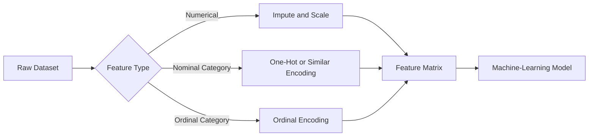
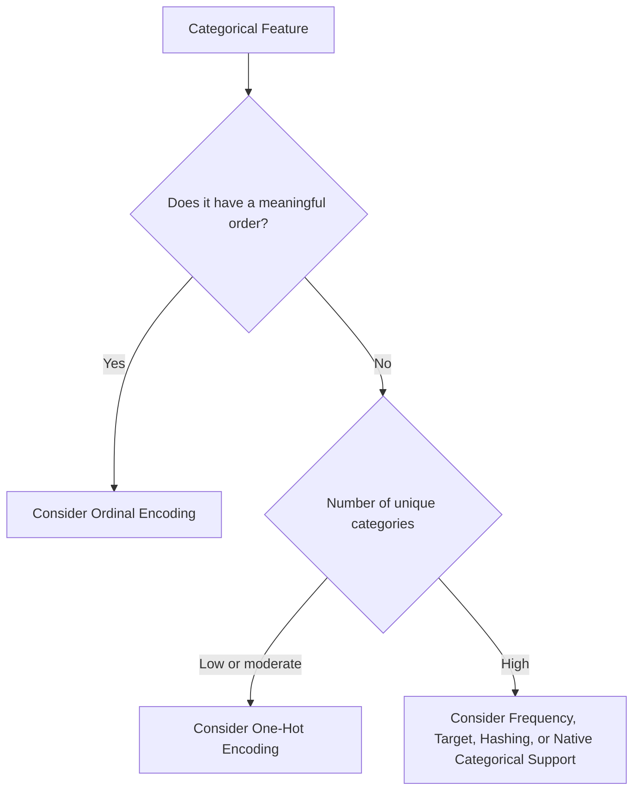
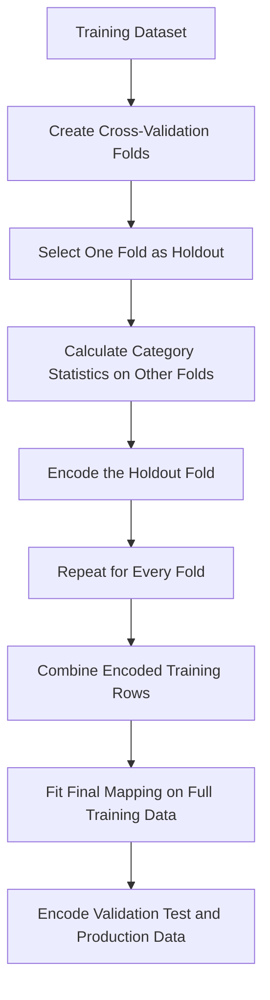
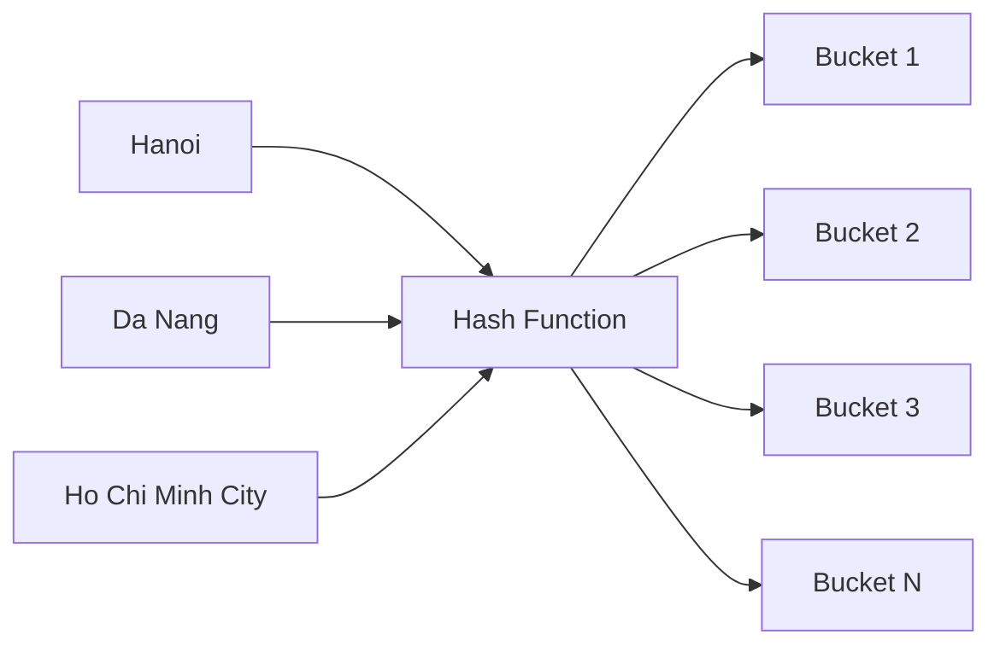
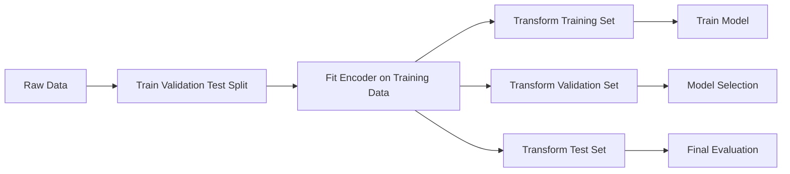
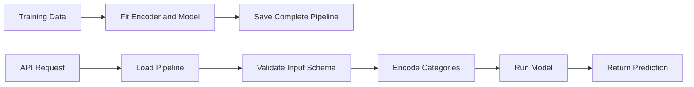

# 027 — Categorical Encoding

**Course:** 03 — Machine Learning and Deep Learning
**Module:** Module 06 — Machine Learning
**Content Group:** Feature Engineering
**Roadmap Source:** Machine Learning / Feature Engineering
**Lesson Type:** Machine Learning
**Order in Module:** 027
**Suggested Duration:** 26 minutes

---

## 1. Overview

**Encoding** is the process of converting categorical or textual values into numerical representations that machine-learning models can process.

A dataset may contain categories such as:

| Property Type | City             | Condition |
| ------------- | ---------------- | --------- |
| Apartment     | Hanoi            | New       |
| House         | Da Nang          | Good      |
| Villa         | Ho Chi Minh City | Old       |

Most machine-learning algorithms cannot directly use strings such as `"Apartment"` or `"Hanoi"`.

Encoding transforms these values into numbers while trying to preserve useful information.

For example:

```text
Apartment -> [1, 0, 0]
House     -> [0, 1, 0]
Villa     -> [0, 0, 1]
```

Choosing the correct encoding method matters because a poor representation can:

* Introduce false relationships between categories.
* Create too many features.
* Cause data leakage.
* Increase memory usage.
* Reduce model performance.
* Fail when new categories appear in production.

---

## 2. Learning Objectives

After completing this lesson, you should be able to:

* Explain categorical encoding in your own words.
* Distinguish nominal and ordinal variables.
* Apply one-hot encoding to nominal categories.
* Apply ordinal encoding to ordered categories.
* Understand label encoding and its limitations.
* Explain frequency and target encoding.
* Prevent data leakage during encoding.
* Handle unseen categories in validation, testing, and production.
* Combine encoding with numerical preprocessing in a pipeline.
* Compare encoding strategies using validation metrics.

---

## 3. Why Encoding Is Necessary

Machine-learning models generally operate on numerical matrices.

A raw dataset may contain mixed data types:

| Feature         | Example   | Type                |
| --------------- | --------- | ------------------- |
| `area`          | 120       | Numerical           |
| `bedrooms`      | 3         | Numerical           |
| `city`          | Hanoi     | Nominal categorical |
| `condition`     | Good      | Ordinal categorical |
| `property_type` | Apartment | Nominal categorical |

The numerical features can usually be passed directly to a model after preprocessing.

The categorical features must first be converted into numerical form.



---

## 4. Nominal vs. Ordinal Categories

Before selecting an encoder, identify whether a category has a meaningful order.

### 4.1 Nominal categories

Nominal categories have no natural ranking.

Examples:

* City
* Country
* Product type
* Department
* Color
* Payment method

For example:

```text
Hanoi, Da Nang, Ho Chi Minh City
```

There is no valid numerical statement such as:

```text
Hanoi < Da Nang < Ho Chi Minh City
```

Common encoders:

* One-hot encoding
* Binary encoding
* Hashing encoding
* Frequency encoding
* Target encoding

---

### 4.2 Ordinal categories

Ordinal categories have a meaningful order.

Examples:

```text
Low < Medium < High
```

```text
Poor < Fair < Good < Excellent
```

```text
Beginner < Intermediate < Advanced
```

Ordinal encoding can preserve this order:

| Condition | Encoded Value |
| --------- | ------------: |
| Poor      |             0 |
| Fair      |             1 |
| Good      |             2 |
| Excellent |             3 |

However, ordinal encoding also assumes that larger numbers represent higher levels.

---

## 5. One-Hot Encoding

One-hot encoding creates one binary column for each category.

Suppose `property_type` contains:

```text
Apartment
House
Villa
```

One-hot encoding produces:

| Property Type | type_Apartment | type_House | type_Villa |
| ------------- | -------------: | ---------: | ---------: |
| Apartment     |              1 |          0 |          0 |
| House         |              0 |          1 |          0 |
| Villa         |              0 |          0 |          1 |
| Apartment     |              1 |          0 |          0 |

### Advantages

* Does not create an artificial ranking.
* Easy to understand.
* Works well for low-cardinality categories.
* Compatible with many machine-learning algorithms.

### Limitations

* Creates many columns for high-cardinality features.
* Can increase memory and training time.
* May create sparse feature matrices.
* Requires careful handling of unseen categories.

---

## 6. One-Hot Encoding with pandas

```python
import pandas as pd

data = pd.DataFrame(
    {
        "property_type": [
            "Apartment",
            "House",
            "Villa",
            "Apartment",
        ]
    }
)

encoded = pd.get_dummies(
    data,
    columns=["property_type"],
    dtype=int,
)

print(encoded)
```

Possible output:

```text
   property_type_Apartment  property_type_House  property_type_Villa
0                        1                    0                    0
1                        0                    1                    0
2                        0                    0                    1
3                        1                    0                    0
```

`pd.get_dummies()` is useful for exploration, but a fitted scikit-learn encoder is usually safer for production pipelines.

---

## 7. One-Hot Encoding with scikit-learn

```python
from sklearn.preprocessing import OneHotEncoder

encoder = OneHotEncoder(
    handle_unknown="ignore",
    sparse_output=False,
)

X_train_encoded = encoder.fit_transform(
    X_train[["property_type"]]
)

X_test_encoded = encoder.transform(
    X_test[["property_type"]]
)
```

The encoder is fitted only on the training data.

The test set uses the categories learned from the training set.

### Inspecting category names

```python
feature_names = encoder.get_feature_names_out(
    ["property_type"]
)

print(feature_names)
```

Possible output:

```text
[
    'property_type_Apartment',
    'property_type_House',
    'property_type_Villa'
]
```

---

## 8. Handling Unknown Categories

Suppose the training set contains:

```text
Apartment
House
Villa
```

But a production request contains:

```text
Townhouse
```

Without proper configuration, the encoder may raise an error.

Use:

```python
OneHotEncoder(handle_unknown="ignore")
```

The unseen category is represented by zeros across the known category columns:

```text
Townhouse -> [0, 0, 0]
```

This prevents the application from crashing, but the model receives limited information about the new category.

Unknown-category frequency should therefore be monitored in production.

---

## 9. Dropping One One-Hot Column

For a feature with (k) categories, one-hot encoding normally creates (k) columns.

Some linear models may use (k-1) columns to avoid exact multicollinearity.

```python
encoder = OneHotEncoder(
    drop="first",
    handle_unknown="ignore",
)
```

For three property types:

| Property Type | type_House | type_Villa |
| ------------- | ---------: | ---------: |
| Apartment     |          0 |          0 |
| House         |          1 |          0 |
| Villa         |          0 |          1 |

`Apartment` becomes the reference category.

### Should one column always be dropped?

Not necessarily.

* Many regularized models can handle all one-hot columns.
* Tree-based models do not require a reference category.
* Dropping a category may make unknown categories harder to distinguish from the reference category.
* Interpretation may be simpler with a reference category in linear models.

The decision depends on the model and the objective.

---

## 10. Label Encoding

Label encoding assigns an integer to each category.

Example:

| Property Type | Encoded Value |
| ------------- | ------------: |
| Apartment     |             0 |
| House         |             1 |
| Villa         |             2 |

Python example:

```python
from sklearn.preprocessing import LabelEncoder

encoder = LabelEncoder()

y_encoded = encoder.fit_transform(y)
```

### Important limitation

`LabelEncoder` is mainly intended for encoding the **target variable**, not ordinary input features.

Using:

```text
Apartment = 0
House = 1
Villa = 2
```

may incorrectly imply:

$$
\text{Apartment} < \text{House} < \text{Villa}
$$

or:

$$
\text{Distance}(\text{Apartment}, \text{Villa}) > \text{Distance}(\text{Apartment}, \text{House})
$$

This artificial ordering can mislead many models.

---

## 11. Encoding the Target Variable

For a classification target:

```text
Approved
Rejected
Pending
```

`LabelEncoder` may be appropriate.

```python
from sklearn.preprocessing import LabelEncoder

target_encoder = LabelEncoder()

y_train_encoded = target_encoder.fit_transform(y_train)
y_test_encoded = target_encoder.transform(y_test)
```

Inspect the class mapping:

```python
for index, class_name in enumerate(
    target_encoder.classes_
):
    print(index, class_name)
```

Convert predictions back to original labels:

```python
predicted_labels = target_encoder.inverse_transform(
    predicted_class_ids
)
```

---

## 12. Ordinal Encoding

Ordinal encoding assigns numbers according to an explicit category order.

Suppose house condition contains:

```text
Poor < Fair < Good < Excellent
```

```python
from sklearn.preprocessing import OrdinalEncoder

condition_order = [
    ["Poor", "Fair", "Good", "Excellent"]
]

encoder = OrdinalEncoder(
    categories=condition_order,
    handle_unknown="use_encoded_value",
    unknown_value=-1,
)

X_train_encoded = encoder.fit_transform(
    X_train[["condition"]]
)

X_test_encoded = encoder.transform(
    X_test[["condition"]]
)
```

The mapping becomes:

| Condition | Encoded Value |
| --------- | ------------: |
| Unknown   |            -1 |
| Poor      |             0 |
| Fair      |             1 |
| Good      |             2 |
| Excellent |             3 |

### Important assumption

Ordinal encoding assumes that order is meaningful.

It may also suggest equal intervals:

$$
\text{Good} - \text{Fair} = \text{Excellent} - \text{Good}
$$

This equality may not be true in the real world.

---

## 13. One-Hot Encoding vs. Ordinal Encoding

| Property                      | One-Hot Encoding  | Ordinal Encoding |
| ----------------------------- | ----------------- | ---------------- |
| Preserves category order      | No                | Yes              |
| Introduces artificial order   | No                | Possible         |
| Number of output columns      | One per category  | Usually one      |
| Good for nominal categories   | Yes               | Usually no       |
| Good for ordinal categories   | Sometimes         | Yes              |
| Suitable for high cardinality | Often inefficient | More compact     |
| Easy to interpret             | Yes               | Yes              |

### Decision guide



---

## 14. Binary Encoding

Binary encoding first assigns an integer to each category and then converts that integer into binary digits.

Example categories:

```text
A, B, C, D, E, F, G, H
```

Integer representation:

| Category | Integer |
| -------- | ------: |
| A        |       0 |
| B        |       1 |
| C        |       2 |
| D        |       3 |
| E        |       4 |
| F        |       5 |
| G        |       6 |
| H        |       7 |

Binary representation:

| Category | Binary | b1 | b2 | b3 |
| -------- | ------ | -: | -: | -: |
| A        | 000    |  0 |  0 |  0 |
| B        | 001    |  0 |  0 |  1 |
| C        | 010    |  0 |  1 |  0 |
| D        | 011    |  0 |  1 |  1 |
| E        | 100    |  1 |  0 |  0 |
| F        | 101    |  1 |  0 |  1 |
| G        | 110    |  1 |  1 |  0 |
| H        | 111    |  1 |  1 |  1 |

For (k) categories, binary encoding needs approximately:

$$
\lceil \log_2(k) \rceil
$$

columns instead of (k) one-hot columns.

### Advantages

* More compact than one-hot encoding.
* Useful for medium- or high-cardinality features.
* Reduces dimensionality.

### Limitations

* Less interpretable.
* Binary patterns may introduce relationships that do not exist.
* Not directly available in the main scikit-learn preprocessing module.

---

## 15. Frequency Encoding

Frequency encoding replaces each category with its count or relative frequency.

Suppose the training data contains:

| City             | Count |
| ---------------- | ----: |
| Hanoi            |   500 |
| Da Nang          |   200 |
| Ho Chi Minh City |   300 |

Relative frequencies:

| City             | Frequency |
| ---------------- | --------: |
| Hanoi            |      0.50 |
| Da Nang          |      0.20 |
| Ho Chi Minh City |      0.30 |

Python example:

```python
frequency_map = (
    X_train["city"]
    .value_counts(normalize=True)
    .to_dict()
)

X_train["city_frequency"] = (
    X_train["city"]
    .map(frequency_map)
)

X_test["city_frequency"] = (
    X_test["city"]
    .map(frequency_map)
    .fillna(0)
)
```

### Advantages

* Produces only one numerical column.
* Works with high-cardinality features.
* Simple and efficient.
* Does not directly use the target.

### Limitations

Two categories with the same frequency receive the same value.

For example:

```text
City A -> 0.20
City B -> 0.20
```

The model cannot distinguish them using only the encoded feature.

Frequency may also change over time in production.

---

## 16. Count Encoding

Count encoding replaces a category with the number of times it appears.

```python
count_map = (
    X_train["city"]
    .value_counts()
    .to_dict()
)

X_train["city_count"] = (
    X_train["city"]
    .map(count_map)
)

X_test["city_count"] = (
    X_test["city"]
    .map(count_map)
    .fillna(0)
)
```

Count encoding and frequency encoding are similar.

The main difference is:

$$
\text{Frequency} = \frac{\text{Category Count}} {\text{Total Number of Rows}}
$$

Frequency values are easier to compare across datasets of different sizes.

---

## 17. Target Encoding

Target encoding replaces each category with a statistic calculated from the target.

For regression, this is often the mean target value.

Suppose the target is house price:

| City             | Average Training Price |
| ---------------- | ---------------------: |
| Hanoi            |            4.2 billion |
| Da Nang          |            3.1 billion |
| Ho Chi Minh City |            5.0 billion |

The encoded feature becomes:

```text
Hanoi -> 4.2
Da Nang -> 3.1
Ho Chi Minh City -> 5.0
```

For binary classification, target encoding may use the positive-class rate.

Example:

| Marketing Channel | Conversion Rate |
| ----------------- | --------------: |
| Search            |            0.12 |
| Social            |            0.07 |
| Referral          |            0.18 |

### Advantages

* Produces a compact representation.
* Can capture strong relationships with the target.
* Useful for high-cardinality features.

### Major risk

Target encoding can create severe data leakage.

If a row contributes to the statistic used to encode itself, the model may indirectly see its target value.

---

## 18. Target-Encoding Leakage

Consider a rare category appearing once:

| Category | Target |
| -------- | -----: |
| Rare_A   |      1 |

Its target-encoded value becomes:

```text
Rare_A -> 1.0
```

The feature now almost directly reveals the target.

This can produce:

* Unrealistically high training performance.
* Poor validation performance.
* Severe overfitting.
* Unstable predictions for rare categories.

### Incorrect workflow

```text
Entire dataset
    -> calculate category target means
    -> encode all rows
    -> split train and test
```

The test targets influence the encoded test features.

### Correct principle

```text
Split first
    -> calculate encoding statistics from training data
    -> transform validation and test data
```

For training rows, use out-of-fold target encoding.

---

## 19. Out-of-Fold Target Encoding

Out-of-fold encoding prevents each row from using its own target.



For each fold:

1. Exclude the fold.
2. Calculate category target means from the remaining folds.
3. Encode the excluded fold.
4. Repeat until every training row has an out-of-fold value.

This is safer than encoding the training data using full-training target statistics.

---

## 20. Smoothed Target Encoding

Rare categories have unreliable target averages.

Suppose:

```text
Category A: 1,000 rows, mean target = 0.70
Category B: 2 rows, mean target = 1.00
```

Category B's estimate is much less reliable.

Smoothed target encoding combines the category mean with the global mean.

A common formula is:

$$
\text{Encoded Value} = \frac{ n_c \mu_c + \alpha \mu }{ n_c + \alpha }
$$

Where:

* (n_c) is the number of rows in category (c).
* (\mu_c) is the target mean for category (c).
* (\mu) is the global target mean.
* (\alpha) controls the smoothing strength.

When a category has few rows, its encoded value stays closer to the global mean.

When it has many rows, its own category mean receives more weight.

---

## 21. Hashing Encoding

Hashing encoding maps categories into a fixed number of columns using a hash function.

Example:

```text
Category -> Hash Function -> One of N Buckets
```



### Advantages

* Fixed output dimension.
* Handles unseen categories naturally.
* Does not require storing a complete category vocabulary.
* Useful for very high-cardinality or streaming data.

### Limitations

* Different categories may collide in the same bucket.
* Encoded features are difficult to interpret.
* The original category cannot easily be recovered.
* The number of buckets must be chosen carefully.

Hashing is common in:

* Text processing
* Online learning
* Advertising systems
* Recommendation systems
* Large-scale event data

---

## 22. High-Cardinality Categories

A feature has high cardinality when it contains many unique values.

Examples:

* Postal code
* Product ID
* User ID
* Device ID
* Street name
* Merchant ID
* Job title

One-hot encoding a feature with 100,000 unique values may create up to 100,000 columns.

Possible strategies include:

* Group rare categories.
* Frequency encoding.
* Count encoding.
* Target encoding with cross-validation and smoothing.
* Binary encoding.
* Hashing encoding.
* Learned embeddings.
* Native categorical model support.
* Dropping identifier-like columns when they have no predictive meaning.

---

## 23. Grouping Rare Categories

Rare categories can be grouped into a shared `"Other"` category.

```python
category_frequency = (
    X_train["city"]
    .value_counts(normalize=True)
)

rare_categories = category_frequency[
    category_frequency < 0.01
].index

X_train["city_grouped"] = (
    X_train["city"]
    .replace(rare_categories, "Other")
)

X_test["city_grouped"] = (
    X_test["city"]
    .where(
        X_test["city"].isin(
            category_frequency.index
        ),
        "Other",
    )
    .replace(rare_categories, "Other")
)
```

### Benefits

* Reduces dimensionality.
* Makes rare-category estimates more stable.
* Improves robustness to infrequent labels.
* Reduces memory use.

### Risks

* Different categories may be merged even when they behave differently.
* The threshold becomes another hyperparameter.
* Production category frequencies may change.

---

## 24. Learned Embeddings

Embeddings map categories into dense numerical vectors.

For example:

```text
Hanoi -> [0.21, -0.84, 0.37]
Da Nang -> [0.44, -0.32, 0.15]
HCMC -> [0.17, -0.91, 0.42]
```

Unlike one-hot encoding, similar categories may learn similar vectors.

Embeddings are commonly used in:

* Neural networks
* Recommendation systems
* Natural-language processing
* Large categorical datasets
* User and product representations

### Advantages

* Compact representation.
* Can capture similarity between categories.
* Suitable for very high-cardinality features.

### Limitations

* Requires model training.
* Less interpretable.
* Needs enough observations per category.
* Unknown categories still require a policy.

---

## 25. Native Categorical Support

Some models can process categorical features with specialized algorithms.

Examples include:

* CatBoost
* LightGBM
* Some histogram-based gradient boosting implementations

Native categorical support may reduce the need for manual one-hot encoding.

However, you must still check:

* Required input format.
* Category type declarations.
* Unknown-category behavior.
* Leakage prevention.
* Compatibility with deployment systems.
* Whether category codes accidentally imply order.

Do not assume that converting categories to integer IDs automatically enables safe native categorical handling.

---

## 26. Choosing an Encoding Method

| Situation                               | Possible Encoding                               |
| --------------------------------------- | ----------------------------------------------- |
| Low-cardinality nominal feature         | One-hot encoding                                |
| Ordered category                        | Ordinal encoding                                |
| Classification target                   | Label encoding                                  |
| High-cardinality category               | Frequency, hashing, target encoding, embeddings |
| Rare categories                         | Grouping plus one-hot or another encoder        |
| Streaming data                          | Hashing encoding                                |
| Neural network with many categories     | Learned embeddings                              |
| Tree model with native category support | Native categorical handling                     |
| Category strongly related to target     | Out-of-fold target encoding                     |

The final decision should be validated experimentally.

---

## 27. Encoding and Model Type

### 27.1 Linear models

Linear and logistic regression usually work well with:

* One-hot encoding
* Properly defined ordinal encoding
* Carefully implemented target encoding

Integer encoding of nominal categories is usually inappropriate because it imposes a linear order.

---

### 27.2 Distance-based models

Models such as KNN and K-Means are sensitive to numerical distances.

Integer encoding can incorrectly imply:

$$
d(A,C) > d(A,B)
$$

One-hot encoding is usually safer for low-cardinality nominal categories.

Scaling may also be required after encoding numerical and ordinal features.

---

### 27.3 Tree-based models

Decision trees can split integer-encoded values, but arbitrary category IDs may create artificial ordered splits.

For example:

```text
Category ID <= 2
```

This groups categories according to their assigned numbers rather than semantic similarity.

One-hot encoding or native categorical handling is often safer.

---

### 27.4 Neural networks

Neural networks may use:

* One-hot encoding for small vocabularies.
* Embeddings for large categorical vocabularies.
* Ordinal values for genuinely ordered features.

Embeddings are especially useful for user, product, location, or content IDs.

---

## 28. The Correct Preprocessing Workflow

The order should usually be:

```text
raw data
    -> split data
    -> fit encoders on training data
    -> transform training data
    -> transform validation/test data
    -> train model
    -> evaluate
```



Any category statistics must come from the training data only.

---

## 29. Incorrect Encoding Workflow

```python
import pandas as pd
from sklearn.model_selection import train_test_split

encoded_data = pd.get_dummies(
    full_dataset,
    columns=["city"],
)

train_data, test_data = train_test_split(
    encoded_data,
    test_size=0.2,
    random_state=42,
)
```

This may not always leak target information because one-hot encoding does not use the target.

However, it still allows the training preprocessing stage to know the complete category vocabulary, including categories that appear only in the test set.

It is safer and more production-like to:

1. Split first.
2. Fit the encoder on training data.
3. Transform validation and test data.

For target encoding, splitting first is absolutely essential.

---

## 30. Using a ColumnTransformer

A real dataset often contains:

* Numerical features
* Nominal categories
* Ordinal categories

Example:

| Feature         | Type      | Transformation         |
| --------------- | --------- | ---------------------- |
| `area`          | Numerical | Imputation and scaling |
| `bedrooms`      | Numerical | Imputation and scaling |
| `city`          | Nominal   | One-hot encoding       |
| `property_type` | Nominal   | One-hot encoding       |
| `condition`     | Ordinal   | Ordinal encoding       |

```python
from sklearn.compose import ColumnTransformer
from sklearn.impute import SimpleImputer
from sklearn.pipeline import Pipeline
from sklearn.preprocessing import (
    OneHotEncoder,
    OrdinalEncoder,
    StandardScaler,
)

numeric_features = [
    "area",
    "bedrooms",
    "house_age",
]

nominal_features = [
    "city",
    "property_type",
]

ordinal_features = [
    "condition",
]

numeric_pipeline = Pipeline(
    steps=[
        (
            "imputer",
            SimpleImputer(strategy="median"),
        ),
        (
            "scaler",
            StandardScaler(),
        ),
    ]
)

nominal_pipeline = Pipeline(
    steps=[
        (
            "imputer",
            SimpleImputer(
                strategy="most_frequent"
            ),
        ),
        (
            "encoder",
            OneHotEncoder(
                handle_unknown="ignore"
            ),
        ),
    ]
)

ordinal_pipeline = Pipeline(
    steps=[
        (
            "imputer",
            SimpleImputer(
                strategy="most_frequent"
            ),
        ),
        (
            "encoder",
            OrdinalEncoder(
                categories=[
                    [
                        "Poor",
                        "Fair",
                        "Good",
                        "Excellent",
                    ]
                ],
                handle_unknown="use_encoded_value",
                unknown_value=-1,
            ),
        ),
    ]
)

preprocessor = ColumnTransformer(
    transformers=[
        (
            "numeric",
            numeric_pipeline,
            numeric_features,
        ),
        (
            "nominal",
            nominal_pipeline,
            nominal_features,
        ),
        (
            "ordinal",
            ordinal_pipeline,
            ordinal_features,
        ),
    ]
)
```

---

## 31. Complete Model Pipeline

```python
from sklearn.linear_model import Ridge
from sklearn.pipeline import Pipeline

model = Pipeline(
    steps=[
        (
            "preprocessor",
            preprocessor,
        ),
        (
            "regressor",
            Ridge(alpha=1.0),
        ),
    ]
)

model.fit(X_train, y_train)

predictions = model.predict(X_test)
```

The pipeline ensures that:

* Imputers are fitted only on training data.
* Encoders are fitted only on training data.
* Scalers are fitted only on training data.
* The same preprocessing is applied during prediction.
* Cross-validation handles preprocessing correctly.

---

## 32. Encoding with Cross-Validation

Use a pipeline when evaluating a model with cross-validation.

```python
from sklearn.model_selection import cross_val_score

scores = cross_val_score(
    model,
    X,
    y,
    cv=5,
    scoring="neg_mean_absolute_error",
)

mae_scores = -scores

print("Fold MAE:", mae_scores)
print("Mean MAE:", mae_scores.mean())
```

For each fold, the encoder is fitted only on that fold's training partition.

This prevents category-vocabulary leakage and keeps the evaluation realistic.

Target encoding requires additional care because ordinary pipelines may not automatically create out-of-fold encodings for the training partition.

---

## 33. House Price Prediction Example

Assume the dataset contains:

### Numerical features

* `area`
* `bedrooms`
* `house_age`
* `distance_to_center`

### Nominal features

* `city`
* `property_type`

### Ordinal feature

* `condition`

### Target

* `price`

```python
import pandas as pd

from sklearn.compose import ColumnTransformer
from sklearn.impute import SimpleImputer
from sklearn.linear_model import Ridge
from sklearn.metrics import (
    mean_absolute_error,
    mean_squared_error,
    r2_score,
)
from sklearn.model_selection import train_test_split
from sklearn.pipeline import Pipeline
from sklearn.preprocessing import (
    OneHotEncoder,
    OrdinalEncoder,
    StandardScaler,
)

data = pd.read_csv("house_prices.csv")

X = data.drop(columns=["price"])
y = data["price"]

X_train, X_test, y_train, y_test = train_test_split(
    X,
    y,
    test_size=0.2,
    random_state=42,
)

numeric_features = [
    "area",
    "bedrooms",
    "house_age",
    "distance_to_center",
]

nominal_features = [
    "city",
    "property_type",
]

ordinal_features = [
    "condition",
]

numeric_pipeline = Pipeline(
    steps=[
        (
            "imputer",
            SimpleImputer(strategy="median"),
        ),
        (
            "scaler",
            StandardScaler(),
        ),
    ]
)

nominal_pipeline = Pipeline(
    steps=[
        (
            "imputer",
            SimpleImputer(
                strategy="most_frequent"
            ),
        ),
        (
            "encoder",
            OneHotEncoder(
                handle_unknown="ignore"
            ),
        ),
    ]
)

ordinal_pipeline = Pipeline(
    steps=[
        (
            "imputer",
            SimpleImputer(
                strategy="most_frequent"
            ),
        ),
        (
            "encoder",
            OrdinalEncoder(
                categories=[
                    [
                        "Poor",
                        "Fair",
                        "Good",
                        "Excellent",
                    ]
                ],
                handle_unknown="use_encoded_value",
                unknown_value=-1,
            ),
        ),
    ]
)

preprocessor = ColumnTransformer(
    transformers=[
        (
            "numeric",
            numeric_pipeline,
            numeric_features,
        ),
        (
            "nominal",
            nominal_pipeline,
            nominal_features,
        ),
        (
            "ordinal",
            ordinal_pipeline,
            ordinal_features,
        ),
    ]
)

pipeline = Pipeline(
    steps=[
        (
            "preprocessor",
            preprocessor,
        ),
        (
            "model",
            Ridge(alpha=1.0),
        ),
    ]
)

pipeline.fit(X_train, y_train)

predictions = pipeline.predict(X_test)

mae = mean_absolute_error(
    y_test,
    predictions,
)

rmse = mean_squared_error(
    y_test,
    predictions,
) ** 0.5

r2 = r2_score(
    y_test,
    predictions,
)

print(f"MAE: {mae:,.2f}")
print(f"RMSE: {rmse:,.2f}")
print(f"R²: {r2:.4f}")
```

---

## 34. Comparing Encoding Strategies

Encoding should be evaluated as an experiment.

Example result table:

| Experiment   | Encoding                       | Model         | Validation MAE |
| ------------ | ------------------------------ | ------------- | -------------: |
| Baseline     | Drop categorical columns       | Ridge         |         43,500 |
| Experiment 1 | One-hot encoding               | Ridge         |         31,200 |
| Experiment 2 | Ordinal IDs for all categories | Ridge         |         38,900 |
| Experiment 3 | Frequency encoding             | Ridge         |         34,700 |
| Experiment 4 | One-hot encoding               | Random Forest |         27,600 |
| Experiment 5 | Native categorical support     | CatBoost      |         25,900 |

Do not select an encoding strategy only because it is popular.

Compare:

* Validation metric
* Training time
* Inference time
* Memory use
* Number of generated features
* Unknown-category behavior
* Interpretability
* Production complexity

---

## 35. Inspecting Encoded Feature Names

After fitting the pipeline:

```python
pipeline.fit(X_train, y_train)

feature_names = (
    pipeline
    .named_steps["preprocessor"]
    .get_feature_names_out()
)

print(feature_names)
```

Possible output:

```text
numeric__area
numeric__bedrooms
numeric__house_age
numeric__distance_to_center
nominal__city_Da Nang
nominal__city_Hanoi
nominal__city_Ho Chi Minh City
nominal__property_type_Apartment
nominal__property_type_House
nominal__property_type_Villa
ordinal__condition
```

Feature names are useful for:

* Model interpretation
* Feature importance analysis
* Debugging
* Documentation
* Production schema validation

---

## 36. Sparse vs. Dense Output

One-hot encoding often produces a sparse matrix because most values are zero.

Example:

```text
[0, 0, 0, 1, 0, 0, 0, 0]
```

Sparse matrices store only the non-zero values, saving memory.

```python
encoder = OneHotEncoder(
    sparse_output=True,
)
```

Dense output stores every zero explicitly.

```python
encoder = OneHotEncoder(
    sparse_output=False,
)
```

Use sparse output when:

* There are many categories.
* The selected model supports sparse input.
* Memory efficiency matters.

Use dense output when:

* The model requires dense arrays.
* The feature space is small.
* Easier debugging is needed.

---

## 37. Missing Categories

Missing categorical values require an explicit strategy.

Possible methods:

### Most-frequent imputation

```python
SimpleImputer(strategy="most_frequent")
```

### Constant category

```python
SimpleImputer(
    strategy="constant",
    fill_value="Missing",
)
```

Treating missingness as a category may be useful when missing values carry information.

For example:

```text
occupation = Missing
```

may indicate that the customer chose not to provide employment information.

The best strategy depends on why the data is missing.

---

## 38. Encoding Dates and Times

Dates should not normally be treated as arbitrary category strings.

Instead of one-hot encoding:

```text
2026-01-01
2026-01-02
2026-01-03
```

extract meaningful components:

* Year
* Month
* Day
* Day of week
* Weekend indicator
* Hour
* Quarter
* Days since reference date

For cyclical features such as month or hour, use sine and cosine encoding.

For hour (h):

$$
h_{\sin} = \sin\left( 2\pi \frac{h}{24} \right)
$$

$$
h_{\cos} = \cos\left( 2\pi \frac{h}{24} \right)
$$

This preserves the fact that hour 23 is close to hour 0.

---

## 39. Cyclical Encoding

Suppose month is encoded as integers:

```text
January = 1
December = 12
```

Numerically, the distance is:

$$
|12-1|=11
$$

But December and January are consecutive months.

Use:

$$
\text{month}_{\sin} = \sin\left( 2\pi \frac{\text{month}}{12} \right)
$$

$$
\text{month}_{\cos} = \cos\left( 2\pi \frac{\text{month}}{12} \right)
$$

Python example:

```python
import numpy as np

data["month_sin"] = np.sin(
    2 * np.pi * data["month"] / 12
)

data["month_cos"] = np.cos(
    2 * np.pi * data["month"] / 12
)
```

Common cyclical variables:

* Hour of day
* Day of week
* Month of year
* Direction in degrees
* Seasonal position

---

## 40. Encoding Geographic Features

Geographic variables require careful interpretation.

Examples:

* Country
* Province
* City
* Postal code
* Latitude
* Longitude

Possible strategies:

| Feature                | Possible Approach                                    |
| ---------------------- | ---------------------------------------------------- |
| Country                | One-hot encoding                                     |
| Province               | One-hot or target encoding                           |
| City                   | One-hot, frequency, target encoding                  |
| Postal code            | Grouping, target encoding, embeddings                |
| Latitude and longitude | Keep numerical, generate distance or region features |

Postal codes should not automatically be treated as numbers.

For example:

```text
10000 and 10001
```

being numerically close does not necessarily mean the locations are geographically similar.

---

## 41. Identifiers Are Not Always Features

Columns such as:

* Customer ID
* Transaction ID
* Row number
* UUID
* Order ID

often have extremely high cardinality and no reusable predictive meaning.

Encoding them may cause the model to memorize the training data.

Before encoding an identifier, ask:

* Does this ID represent a reusable entity?
* Will the same ID appear during inference?
* Is there enough history per entity?
* Could it cause privacy issues?
* Would aggregated behavioral features be better?

For example, instead of encoding `customer_id`, create:

* Number of previous purchases
* Average order value
* Days since last purchase
* Preferred product category

---

## 42. Common Mistakes

### 42.1 Using integer IDs for nominal categories

Incorrect:

```text
Red = 0
Blue = 1
Green = 2
```

This introduces a false order.

Use one-hot encoding or another nominal encoding method.

---

### 42.2 Fitting encoders before splitting

Preprocessing should be fitted on training data only.

This is especially critical for:

* Target encoding
* Frequency encoding
* Rare-category grouping
* Learned embeddings

---

### 42.3 Applying `fit_transform` to the test set

Incorrect:

```python
X_test_encoded = encoder.fit_transform(
    X_test
)
```

Correct:

```python
X_test_encoded = encoder.transform(
    X_test
)
```

---

### 42.4 Ignoring unseen categories

Production data may contain categories that were not present during training.

Use strategies such as:

* `handle_unknown="ignore"`
* An explicit `"Unknown"` category
* Hashing encoding
* Native unknown-category handling

---

### 42.5 Using target encoding without cross-validation

Direct target encoding can memorize labels, especially for rare categories.

Use:

* Out-of-fold encoding
* Smoothing
* Minimum category counts
* Regularization
* Proper validation

---

### 42.6 One-hot encoding extremely high-cardinality features

This may create:

* Huge feature matrices
* Slow training
* High memory consumption
* Unstable rare-category coefficients

Consider more compact encoders.

---

### 42.7 Assuming category numbers are quantities

A postal code, product code, or department code may contain digits but still be categorical.

Example:

```text
Department 100
Department 200
```

The numeric difference of 100 has no meaningful interpretation.

---

### 42.8 Encoding the target as an ordinary input feature

The target must never appear among the input features.

This would create direct target leakage and invalid performance estimates.

---

### 42.9 Forgetting production consistency

The same fitted encoder and category mapping must be reused during inference.

Never rebuild the encoding vocabulary independently in the API or production service.

---

## 43. Encoding in Production

The production system must use the exact preprocessing pipeline created during training.



Save the entire pipeline:

```python
import joblib

joblib.dump(
    pipeline,
    "house_price_pipeline.joblib",
)
```

Load it during inference:

```python
import joblib

pipeline = joblib.load(
    "house_price_pipeline.joblib"
)

prediction = pipeline.predict(new_data)
```

---

## 44. Monitoring Category Drift

Production categories may differ from training categories.

Examples:

* New product types
* New cities
* New marketing channels
* New device models
* New job titles

Useful monitoring metrics include:

* Unknown-category rate
* Number of new categories
* Category-frequency changes
* Most common categories
* Rare-category percentage
* Missing-category percentage
* Prediction performance by category

Example alert:

```text
Unknown property_type rate increased
from 0.4% to 8.7%.
```

This may indicate:

* New business categories
* A data-schema change
* A spelling inconsistency
* Upstream data corruption
* Model retraining needs

---

## 45. Practical Exercise

Use a house-price dataset or another tabular dataset containing categorical features.

### Task 1 — Identify categorical features

For every feature, record:

| Feature       | Data Type | Cardinality | Nominal or Ordinal | Proposed Encoding   |
| ------------- | --------- | ----------: | ------------------ | ------------------- |
| city          | Category  |          12 | Nominal            | One-hot             |
| condition     | Category  |           4 | Ordinal            | Ordinal encoding    |
| postal_code   | Category  |         850 | Nominal            | Frequency or target |
| property_type | Category  |           5 | Nominal            | One-hot             |

---

### Task 2 — Build a numerical-only baseline

Remove categorical features and train a baseline model.

Record:

* MAE
* RMSE
* R²
* Number of input features
* Training time

---

### Task 3 — Add one-hot encoding

Encode low-cardinality nominal features.

Compare the model against the numerical-only baseline.

Questions:

* Did validation performance improve?
* How many features were created?
* Did training time increase?
* Which categories appear important?

---

### Task 4 — Add ordinal encoding

Define a correct order for an ordinal feature.

Example:

```text
Poor < Fair < Good < Excellent
```

Compare:

* One-hot encoding
* Ordinal encoding

Determine which representation works better for the selected model.

---

### Task 5 — Compare high-cardinality strategies

For a feature such as postal code, compare:

* Group rare categories plus one-hot encoding
* Frequency encoding
* Target encoding with leakage prevention
* Hashing encoding

Record the results.

| Encoding  | Feature Count | Validation MAE | Training Time |
| --------- | ------------: | -------------: | ------------: |
| One-hot   |               |                |               |
| Frequency |               |                |               |
| Target    |               |                |               |
| Hashing   |               |                |               |

---

### Task 6 — Test unseen categories

Create a sample containing a category that does not appear in training.

```python
new_house = pd.DataFrame(
    {
        "area": [120],
        "bedrooms": [3],
        "house_age": [5],
        "distance_to_center": [7.5],
        "city": ["New City"],
        "property_type": ["Townhouse"],
        "condition": ["Good"],
    }
)
```

Verify that the pipeline:

* Does not crash.
* Produces a valid prediction.
* Applies a documented unknown-category policy.

---

### Task 7 — Perform error analysis by category

Create a table containing:

* Actual target
* Predicted target
* Absolute error
* City
* Property type
* Condition

```python
results = X_test.copy()

results["actual"] = y_test
results["predicted"] = predictions
results["absolute_error"] = (
    results["actual"]
    - results["predicted"]
).abs()
```

Analyze average error by category:

```python
error_by_city = (
    results
    .groupby("city")["absolute_error"]
    .agg(["mean", "median", "count"])
    .sort_values("mean", ascending=False)
)

print(error_by_city)
```

Ask:

* Does the model perform poorly on rare cities?
* Are unknown categories causing large errors?
* Are expensive property types underrepresented?
* Should categories be grouped differently?
* Is target encoding overfitting rare groups?

---

## 46. Suggested Notebook Structure

```text
01. Problem Definition
02. Load Dataset
03. Identify Numerical and Categorical Features
04. Inspect Category Cardinality
05. Train Validation Test Split
06. Numerical-Only Baseline
07. One-Hot Encoding Experiment
08. Ordinal Encoding Experiment
09. High-Cardinality Encoding Experiment
10. Model Comparison
11. Unknown-Category Test
12. Error Analysis by Category
13. Final Pipeline
14. Save Model and Encoder
15. Conclusions and Next Steps
```

---

## 47. Completion Checklist

* [ ] I can explain categorical encoding in one or two minutes.
* [ ] I understand why machine-learning models need numerical features.
* [ ] I can distinguish nominal and ordinal categories.
* [ ] I know when to use one-hot encoding.
* [ ] I know when ordinal encoding is appropriate.
* [ ] I understand why label encoding can be dangerous for input features.
* [ ] I can encode a classification target.
* [ ] I understand frequency and count encoding.
* [ ] I understand the purpose and risk of target encoding.
* [ ] I know why out-of-fold target encoding is necessary.
* [ ] I can handle unseen categories.
* [ ] I fit encoders only on training data.
* [ ] I use pipelines and `ColumnTransformer`.
* [ ] I can compare encoding strategies using validation metrics.
* [ ] I can identify high-cardinality features.
* [ ] I can monitor unknown categories in production.
* [ ] I have documented at least one caveat, assumption, or next experiment.

---

## 48. Related Outcome

Train, compare, and evaluate supervised and unsupervised machine-learning models using thoughtful feature engineering.

Encoding supports this outcome by converting categorical information into model-compatible features while preserving as much useful structure as possible.

A good encoding strategy should consider:

* Category meaning
* Cardinality
* Model type
* Leakage risk
* Validation performance
* Memory usage
* Interpretability
* Production behavior

---

## 49. Related Project

### Mini Project: House Price Prediction

Build a complete regression workflow using:

* Exploratory Data Analysis
* Missing-value handling
* Numerical feature scaling
* Nominal category encoding
* Ordinal category encoding
* Rare-category handling
* Linear Regression
* Ridge or Lasso Regression
* Random Forest
* XGBoost or another boosting model
* MAE, RMSE, and R² comparison
* Error analysis by city and property type
* A reusable preprocessing and model pipeline

Suggested experiment question:

> How do one-hot encoding, ordinal encoding, and frequency encoding affect Linear Regression, Random Forest, and XGBoost performance?

Suggested portfolio artifacts:

* Jupyter Notebook
* Category-cardinality chart
* Encoding comparison table
* Error analysis by category
* Saved preprocessing pipeline
* Prediction API
* README explaining encoding decisions

---

## 50. Summary

Categorical encoding converts non-numerical values into representations that machine-learning models can process.

The main encoding methods include:

* **One-hot encoding** for low-cardinality nominal categories.
* **Ordinal encoding** for categories with a meaningful order.
* **Label encoding** primarily for classification targets.
* **Frequency and count encoding** for compact category representations.
* **Target encoding** for high-cardinality features with strong leakage controls.
* **Hashing encoding** for large or streaming category vocabularies.
* **Embeddings** for dense learned representations.
* **Native categorical handling** for models that explicitly support categories.

The most important implementation principles are:

```text
split first
fit encoders on training data
transform validation and test data
handle unseen categories
evaluate against a baseline
reuse the same pipeline in production
```

A strong encoding strategy is not simply the method with the highest validation score. It must also be stable, leakage-free, efficient, interpretable enough for the use case, and reliable when new production categories appear.
