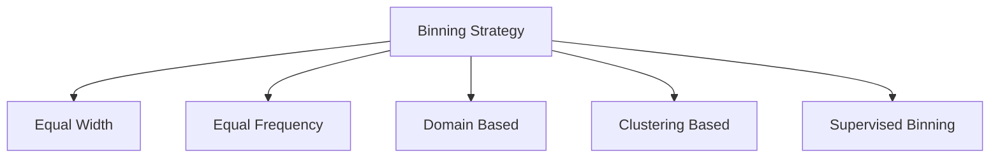
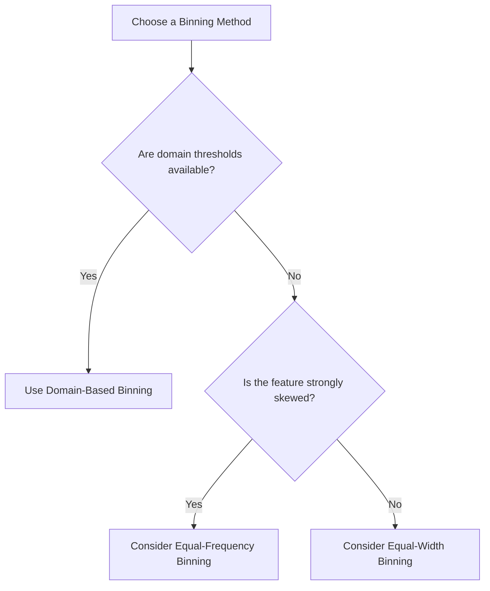
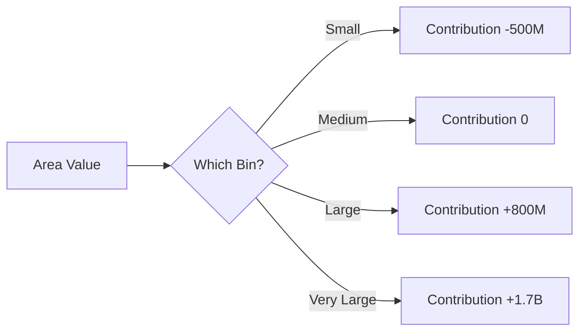
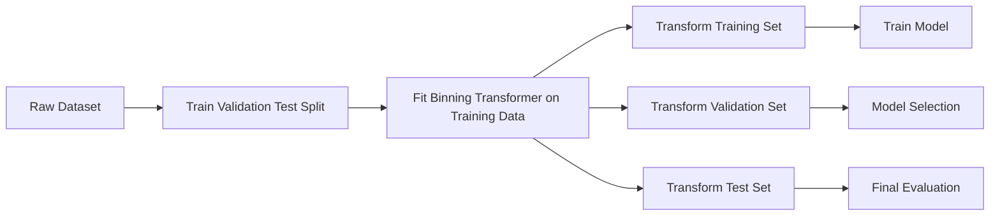
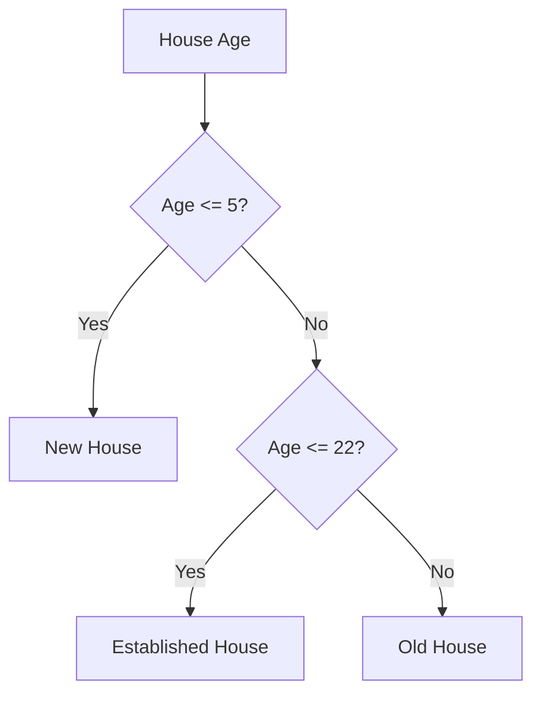
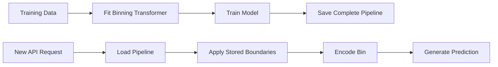

# 028 — Binning

**Course:** 03 — Machine Learning and Deep Learning
**Module:** Module 06 — Machine Learning
**Content Group:** Feature Engineering
**Roadmap Source:** Machine Learning / Feature Engineering
**Lesson Type:** Machine Learning
**Order in Module:** 028
**Suggested Duration:** 26 minutes

---

## 1. Overview

**Binning**, also called **discretization**, is the process of converting a continuous numerical feature into a limited number of intervals or categories called **bins**.

For example, a continuous age feature:

```text
18, 22, 27, 35, 46, 58, 71
```

can be transformed into age groups:

| Age | Age Group   |
| --: | ----------- |
|  18 | Young       |
|  22 | Young       |
|  27 | Young Adult |
|  35 | Adult       |
|  46 | Middle Age  |
|  58 | Senior      |
|  71 | Senior      |

Binning changes a feature from an exact numerical value into a broader category.

It can help a model:

* Capture non-linear relationships.
* Reduce the effect of noise.
* Reduce sensitivity to small measurement differences.
* Handle extreme values more robustly.
* Produce more interpretable features.
* Express business rules directly.

However, binning also removes information. Two values inside the same bin become indistinguishable to the model.

---

## 2. Learning Objectives

After completing this lesson, you should be able to:

* Explain binning in your own words.
* Understand why numerical features may be discretized.
* Distinguish equal-width and equal-frequency binning.
* Apply domain-based and custom binning.
* Use `pandas.cut()` and `pandas.qcut()`.
* Use scikit-learn's `KBinsDiscretizer`.
* Encode generated bins correctly.
* Prevent data leakage when learning bin boundaries.
* Compare models with and without binned features.
* Identify when binning improves or harms model performance.
* Reuse the same bin definitions during deployment.

---

## 3. What Is Binning?

Suppose a house-price dataset contains the feature:

```text
distance_to_city_center
```

with values from 0 to 50 kilometers.

Instead of using the exact distance, we can create categories:

|    Distance | Distance Group |
| ----------: | -------------- |
|      0–5 km | Very Near      |
|     5–10 km | Near           |
|    10–20 km | Moderate       |
|    20–35 km | Far            |
| Above 35 km | Very Far       |

The model now receives a categorical representation of distance.


---

## 4. Why Use Binning?

### 4.1 Capture non-linear relationships

Suppose age affects customer churn in the following way:

* Very young customers have high churn.
* Middle-aged customers have low churn.
* Older customers have moderate churn.

This relationship is not necessarily linear.

A linear model using raw age assumes:

$$
\hat{y} = \beta_0 + \beta_1 \cdot \text{age}
$$

This means every additional year has the same effect.

Binning allows different age ranges to have different effects.

```text
Age 18–25 -> high churn tendency
Age 26–45 -> low churn tendency
Age 46–65 -> medium churn tendency
Age 66+   -> high churn tendency
```

---

### 4.2 Reduce noise

Suppose a temperature sensor records:

```text
19.8, 20.1, 20.3, 20.0
```

These differences may not be meaningful.

Binning can transform them into:

```text
Moderate Temperature
```

This reduces sensitivity to small measurement errors.

---

### 4.3 Improve interpretability

A business stakeholder may understand:

```text
Income Group = High
```

more easily than:

```text
Annual Income = 87,426.35
```

Binned features can make:

* Reports easier to read.
* Model coefficients easier to explain.
* Risk policies easier to implement.
* Dashboard segmentation clearer.

---

### 4.4 Handle extreme values

A numerical feature may contain a few extremely large values.

For example:

```text
20, 25, 30, 35, 40, 5000
```

A final bin such as:

```text
Above 100
```

can reduce the influence of extreme magnitude.

However, binning does not remove the outlier. It only changes its representation.

---

### 4.5 Encode business rules

Business knowledge may define meaningful intervals.

Examples:

```text
Credit score:
Poor       -> below 580
Fair       -> 580–669
Good       -> 670–739
Very Good  -> 740–799
Excellent  -> 800+
```

```text
Delivery time:
Fast       -> below 2 days
Normal     -> 2–5 days
Slow       -> above 5 days
```

These boundaries may be more useful than automatically generated bins.

---

## 5. The Main Trade-Off

Binning creates a balance between simplicity and information loss.

Suppose two houses have areas:

```text
101 m²
149 m²
```

If the area bin is:

```text
100–150 m²
```

both houses receive the same encoded value.

The model no longer knows that one house is 48 m² larger.

### Too few bins

* Strong information loss
* Oversimplified relationships
* Different observations become identical

### Too many bins

* Little noise reduction
* Rare bins
* Increased dimensionality
* Greater risk of overfitting

The number of bins should be treated as a hyperparameter or domain decision.

---

## 6. Common Binning Strategies

The main binning strategies are:

1. Equal-width binning
2. Equal-frequency binning
3. Domain-based binning
4. Custom threshold binning
5. Clustering-based binning
6. Supervised or target-aware binning



---

## 7. Equal-Width Binning

Equal-width binning divides the full numerical range into intervals of equal size.

If the minimum value is (x_{\min}), the maximum is (x_{\max}), and the number of bins is (k), then the bin width is:

$$
\text{Bin Width} = \frac{x_{\max}-x_{\min}}{k}
$$

### Example

Suppose house area ranges from 50 m² to 250 m², and we create four bins.

$$
\text{Bin Width} = # \frac{250-50}{4} 50
$$

The intervals are:

| Bin | Range   |
| --- | ------- |
| 1   | 50–100  |
| 2   | 100–150 |
| 3   | 150–200 |
| 4   | 200–250 |

### Advantages

* Simple to calculate.
* Easy to explain.
* Useful when the numerical range has clear meaning.
* Preserves equal interval widths.

### Limitations

* Some bins may contain very few observations.
* Sensitive to extreme minimum and maximum values.
* Performs poorly for strongly skewed distributions.

---

## 8. Equal-Width Binning with pandas

Use `pandas.cut()`.

```python
import pandas as pd

data = pd.DataFrame(
    {
        "area": [
            55,
            80,
            115,
            140,
            175,
            210,
            245,
        ]
    }
)

data["area_bin"] = pd.cut(
    data["area"],
    bins=4,
)

print(data)
```

Possible output:

```text
   area        area_bin
0    55   (54.81, 102.5]
1    80   (54.81, 102.5]
2   115   (102.5, 150.0]
3   140   (102.5, 150.0]
4   175   (150.0, 197.5]
5   210   (197.5, 245.0]
6   245   (197.5, 245.0]
```

---

## 9. Equal-Width Binning with Custom Labels

```python
data["area_category"] = pd.cut(
    data["area"],
    bins=4,
    labels=[
        "Small",
        "Medium",
        "Large",
        "Very Large",
    ],
)

print(data)
```

The result may look like:

| Area | Area Category |
| ---: | ------------- |
|   55 | Small         |
|   80 | Small         |
|  115 | Medium        |
|  140 | Medium        |
|  175 | Large         |
|  210 | Very Large    |
|  245 | Very Large    |

---

## 10. Equal-Frequency Binning

Equal-frequency binning attempts to place approximately the same number of observations into each bin.

It is also called:

* Quantile binning
* Equal-depth binning
* Quantile discretization

For four bins, the boundaries are commonly based on:

* 25th percentile
* 50th percentile
* 75th percentile

### Example

Suppose the sorted income values are:

```text
20, 22, 24, 27, 30, 35, 45, 60, 90, 150
```

Four quantile bins may contain approximately:

| Bin | Values      |
| --- | ----------- |
| Q1  | 20, 22, 24  |
| Q2  | 27, 30      |
| Q3  | 35, 45      |
| Q4  | 60, 90, 150 |

The interval widths differ, but the number of observations is more balanced.

---

## 11. Equal-Frequency Binning with pandas

Use `pandas.qcut()`.

```python
data["income_quantile"] = pd.qcut(
    data["annual_income"],
    q=4,
    labels=[
        "Low",
        "Lower Middle",
        "Upper Middle",
        "High",
    ],
)
```

Here:

```text
q=4
```

creates quartile-based bins.

Other examples:

```python
# Three bins
pd.qcut(data["income"], q=3)

# Ten bins
pd.qcut(data["income"], q=10)
```

Ten quantile bins are often called **deciles**.

---

## 12. Equal-Width vs. Equal-Frequency Binning

| Property                          | Equal Width         | Equal Frequency     |
| --------------------------------- | ------------------- | ------------------- |
| Interval size                     | Equal               | Usually different   |
| Number of rows per bin            | May vary greatly    | Approximately equal |
| Sensitive to outliers             | Yes                 | Less sensitive      |
| Easy to explain                   | Yes                 | Sometimes           |
| Good for skewed data              | Often no            | Often better        |
| Preserves business units          | Yes                 | Not necessarily     |
| Boundaries depend on distribution | Minimum and maximum | Quantiles           |

### Decision guide



---

## 13. Domain-Based Binning

Domain-based binning uses thresholds defined by expert knowledge, regulations, or business rules.

### Example: house age

```text
New          -> 0–5 years
Recent       -> 6–15 years
Established  -> 16–30 years
Old          -> 31–50 years
Very Old     -> above 50 years
```

```python
bins = [
    float("-inf"),
    5,
    15,
    30,
    50,
    float("inf"),
]

labels = [
    "New",
    "Recent",
    "Established",
    "Old",
    "Very Old",
]

data["house_age_group"] = pd.cut(
    data["house_age"],
    bins=bins,
    labels=labels,
)
```

### Advantages

* Easy to explain.
* Aligns with business logic.
* Stable across datasets.
* May correspond to real-world behavior changes.

### Limitations

* Requires reliable domain knowledge.
* Boundaries may become outdated.
* Some bins may contain too few observations.
* Subjective thresholds may not maximize predictive performance.

---

## 14. Open and Closed Intervals

When defining bins, you must decide whether interval boundaries are included.

Mathematical notation:

```text
(a, b]
```

means:

$$
a < x \leq b
$$

```text
[a, b)
```

means:

$$
a \leq x < b
$$

In `pandas.cut()`:

```python
pd.cut(
    data["age"],
    bins=[0, 18, 35, 60, 100],
    right=True,
)
```

uses intervals closed on the right:

```text
(0, 18]
(18, 35]
(35, 60]
(60, 100]
```

Using:

```python
right=False
```

creates intervals closed on the left:

```text
[0, 18)
[18, 35)
[35, 60)
[60, 100)
```

Boundary rules must be documented to avoid inconsistent production behavior.

---

## 15. Including the Lowest Value

The minimum value may fall outside the first interval depending on the boundary settings.

Use:

```python
pd.cut(
    data["age"],
    bins=[0, 18, 35, 60, 100],
    include_lowest=True,
)
```

This ensures that the lowest boundary is included.

---

## 16. Binning with `KBinsDiscretizer`

Scikit-learn provides `KBinsDiscretizer`.

```python
from sklearn.preprocessing import KBinsDiscretizer

discretizer = KBinsDiscretizer(
    n_bins=5,
    encode="onehot-dense",
    strategy="quantile",
)

X_train_binned = discretizer.fit_transform(
    X_train[["area"]]
)

X_test_binned = discretizer.transform(
    X_test[["area"]]
)
```

### Important parameters

#### `n_bins`

The number of intervals.

```python
n_bins=5
```

#### `strategy`

Supported strategies include:

```text
uniform
quantile
kmeans
```

#### `encode`

Common encoding outputs:

```text
ordinal
onehot
onehot-dense
```

---

## 17. `KBinsDiscretizer` Strategies

### 17.1 Uniform

```python
strategy="uniform"
```

Creates equal-width bins.

### 17.2 Quantile

```python
strategy="quantile"
```

Creates bins containing approximately equal numbers of observations.

### 17.3 K-Means

```python
strategy="kmeans"
```

Uses one-dimensional K-Means clustering to find groups of similar values.


K-Means binning may adapt to natural groups in the data.

---

## 18. Ordinal vs. One-Hot Encoding of Bins

After creating bins, they must usually be encoded numerically.

### Ordinal encoding

```text
Small      -> 0
Medium     -> 1
Large      -> 2
Very Large -> 3
```

This preserves the order of bins.

It assumes higher categories correspond to larger values.

### One-hot encoding

| Category   | Small | Medium | Large | Very Large |
| ---------- | ----: | -----: | ----: | ---------: |
| Small      |     1 |      0 |     0 |          0 |
| Medium     |     0 |      1 |     0 |          0 |
| Large      |     0 |      0 |     1 |          0 |
| Very Large |     0 |      0 |     0 |          1 |

One-hot encoding allows each bin to have an independent effect.

---

## 19. When to Use Ordinal Bin Encoding

Ordinal encoding is reasonable when:

* The bins have a clear order.
* The model can benefit from the compact representation.
* A monotonic relationship is expected.
* The numerical distances between encoded bins are acceptable.

Example:

```text
Low < Medium < High
```

However, assigning:

```text
Low = 0
Medium = 1
High = 2
```

may imply that the step from Low to Medium equals the step from Medium to High.

This assumption may not always be valid.

---

## 20. When to Use One-Hot Bin Encoding

One-hot encoding is useful when:

* Each range may have a different effect.
* The relationship is non-linear.
* A linear model is used.
* Equal distances between bins should not be assumed.

Example:

Customer churn may behave as:

| Age Group   | Churn Risk |
| ----------- | ---------- |
| Young       | High       |
| Young Adult | Medium     |
| Middle Age  | Low        |
| Senior      | High       |

The relationship is not monotonic.

One-hot encoding lets the model learn a separate coefficient for every age group.

---

## 21. Binning and Linear Models

Linear models assume a linear relationship between a numerical feature and the prediction.

Without binning:

$$
\hat{y} = \beta_0+\beta_1x
$$

With one-hot encoded bins:

$$
\hat{y} = \beta_0 + \beta_1I(x \in B_1) + \beta_2I(x \in B_2) + \cdots + \beta_kI(x \in B_k)
$$

Where:

$$
I(x \in B_j)
$$

is 1 when (x) belongs to bin (B_j), and 0 otherwise.

This creates a piecewise constant relationship.

```text
Raw linear feature:
prediction changes continuously

Binned feature:
prediction changes when a bin boundary is crossed
```

---

## 22. Piecewise Constant Effect

Suppose area is divided into four bins:

| Area Range   | Learned Price Contribution |
| ------------ | -------------------------: |
| Below 70 m²  |               -500 million |
| 70–120 m²    |                          0 |
| 120–180 m²   |               +800 million |
| Above 180 m² |               +1.7 billion |

Within each bin, the model assigns the same contribution.



---

## 23. Keeping Both Raw and Binned Features

Binning does not always require removing the original feature.

You may keep:

```text
area
area_bin
```

The raw feature captures detailed variation, while the binned feature captures broader non-linear ranges.

Example:

```python
data["area_bin"] = pd.cut(
    data["area"],
    bins=[
        0,
        70,
        120,
        180,
        float("inf"),
    ],
    labels=[
        "Small",
        "Medium",
        "Large",
        "Very Large",
    ],
)
```

The final model may receive both:

| area | area_bin   |
| ---: | ---------- |
|   95 | Medium     |
|  165 | Large      |
|  240 | Very Large |

This approach can improve linear models but may also introduce redundancy.

Validate the result experimentally.

---

## 24. Binning and Tree-Based Models

Tree-based models automatically create threshold splits.

Example:

```text
area <= 82
area <= 137
area <= 195
```

Because trees already learn numerical boundaries, manual binning is often unnecessary for:

* Decision Trees
* Random Forests
* XGBoost
* LightGBM

Manual binning may even reduce useful information.

However, it may still help when:

* Domain boundaries are important.
* The feature is noisy.
* Extreme values need broad grouping.
* Interpretability is more important than fine precision.
* A stable business segmentation is required.

---

## 25. Binning and Distance-Based Models

Models such as K-Nearest Neighbors and K-Means use distances.

Replacing a continuous feature with ordinal bins can change the distance structure.

Example:

```text
Original values:
19, 20, 21

Binned values:
0, 0, 1
```

The distance between 19 and 20 becomes zero, while the distance between 20 and 21 suddenly becomes one.

This creates discontinuities.

Use binning carefully with distance-based models.

---

## 26. Binning and Neural Networks

Neural networks can model non-linear relationships directly, so binning is not always necessary.

However, binning may be useful for:

* Combining continuous and categorical embeddings.
* Handling noisy measurements.
* Creating interpretable auxiliary features.
* Representing very skewed numerical variables.
* Creating bucket embeddings in recommendation systems.

Large recommendation systems often convert continuous features such as age, price, or activity count into buckets.

---

## 27. Binning Skewed Features

Consider annual income:

```text
20,000
22,000
25,000
30,000
35,000
50,000
80,000
150,000
700,000
```

Equal-width bins may place most observations into the first bin.

Quantile binning can produce more balanced groups.

```python
data["income_bin"] = pd.qcut(
    data["annual_income"],
    q=4,
    labels=[
        "Low",
        "Medium",
        "High",
        "Very High",
    ],
)
```

Another option is to transform the feature first:

```python
import numpy as np

data["log_income"] = np.log1p(
    data["annual_income"]
)
```

Then compare:

* Raw income
* Log-transformed income
* Quantile-binned income
* Raw plus binned income

---

## 28. Handling Duplicate Quantile Boundaries

`qcut()` may fail when many observations have the same value.

Example:

```text
0, 0, 0, 0, 1, 1, 1, 2
```

Requested quantiles may create duplicate boundaries.

Use:

```python
pd.qcut(
    data["feature"],
    q=4,
    duplicates="drop",
)
```

This may produce fewer bins than requested.

Always inspect the actual number of generated bins.

---

## 29. Handling Missing Values

Missing values usually do not belong to a numerical interval.

Possible strategies include:

### Impute before binning

```text
Missing value
    -> median imputation
    -> bin assignment
```

### Create a separate missing category

```text
Low
Medium
High
Missing
```

Example:

```python
data["income_bin"] = pd.cut(
    data["income"],
    bins=[
        float("-inf"),
        30000,
        60000,
        100000,
        float("inf"),
    ],
    labels=[
        "Low",
        "Medium",
        "High",
        "Very High",
    ],
)

data["income_bin"] = (
    data["income_bin"]
    .cat.add_categories("Missing")
    .fillna("Missing")
)
```

A separate missing bin can be useful when missingness contains information.

---

## 30. Handling Values Outside Training Ranges

Suppose training area values range from:

```text
40 m² to 300 m²
```

A production request contains:

```text
450 m²
```

If the final boundary is exactly 300, the new value may not belong to any bin.

Use open-ended boundaries:

```python
bins = [
    float("-inf"),
    70,
    120,
    180,
    300,
    float("inf"),
]
```

This creates a final category for all sufficiently large values.

Open-ended boundaries improve production robustness.

---

## 31. Data Leakage in Binning

Some bin boundaries are learned from the feature distribution.

Examples:

* Quantile boundaries
* K-Means boundaries
* Automatically selected optimal thresholds

These boundaries must be learned from training data only.

### Incorrect workflow

```text
Full dataset
    -> calculate quantiles
    -> create bins
    -> split into train and test
```

The training process uses information about the test distribution.

### Correct workflow

```text
Raw dataset
    -> split
    -> learn bin boundaries from training set
    -> apply the same boundaries to validation and test sets
```

---

## 32. Correct Binning Workflow



With scikit-learn:

```python
from sklearn.preprocessing import KBinsDiscretizer

binning = KBinsDiscretizer(
    n_bins=5,
    strategy="quantile",
    encode="onehot",
)

X_train_binned = binning.fit_transform(
    X_train[["income"]]
)

X_test_binned = binning.transform(
    X_test[["income"]]
)
```

---

## 33. Using Binning in a Pipeline

```python
from sklearn.linear_model import Ridge
from sklearn.pipeline import Pipeline
from sklearn.preprocessing import KBinsDiscretizer

pipeline = Pipeline(
    steps=[
        (
            "binning",
            KBinsDiscretizer(
                n_bins=5,
                encode="onehot",
                strategy="quantile",
            ),
        ),
        (
            "model",
            Ridge(alpha=1.0),
        ),
    ]
)

pipeline.fit(X_train, y_train)

predictions = pipeline.predict(X_test)
```

The pipeline ensures that bin boundaries are fitted only on training data.

---

## 34. Applying Binning to Selected Columns

A dataset may contain numerical features that should remain continuous and other features that should be binned.

Example:

| Feature              | Transformation  |
| -------------------- | --------------- |
| `area`               | Keep continuous |
| `house_age`          | Bin             |
| `distance_to_center` | Bin             |
| `bedrooms`           | Keep continuous |
| `city`               | One-hot encode  |

Use `ColumnTransformer`.

```python
from sklearn.compose import ColumnTransformer
from sklearn.preprocessing import (
    KBinsDiscretizer,
    OneHotEncoder,
    StandardScaler,
)

continuous_features = [
    "area",
    "bedrooms",
]

binned_features = [
    "house_age",
    "distance_to_center",
]

categorical_features = [
    "city",
    "property_type",
]

preprocessor = ColumnTransformer(
    transformers=[
        (
            "continuous",
            StandardScaler(),
            continuous_features,
        ),
        (
            "binned",
            KBinsDiscretizer(
                n_bins=5,
                encode="onehot",
                strategy="quantile",
            ),
            binned_features,
        ),
        (
            "categorical",
            OneHotEncoder(
                handle_unknown="ignore"
            ),
            categorical_features,
        ),
    ]
)
```

---

## 35. Complete House Price Pipeline

```python
import pandas as pd

from sklearn.compose import ColumnTransformer
from sklearn.impute import SimpleImputer
from sklearn.linear_model import Ridge
from sklearn.metrics import (
    mean_absolute_error,
    mean_squared_error,
    r2_score,
)
from sklearn.model_selection import train_test_split
from sklearn.pipeline import Pipeline
from sklearn.preprocessing import (
    KBinsDiscretizer,
    OneHotEncoder,
    StandardScaler,
)

data = pd.read_csv("house_prices.csv")

X = data.drop(columns=["price"])
y = data["price"]

X_train, X_test, y_train, y_test = train_test_split(
    X,
    y,
    test_size=0.2,
    random_state=42,
)

continuous_features = [
    "area",
    "bedrooms",
]

binned_features = [
    "house_age",
    "distance_to_center",
]

categorical_features = [
    "city",
    "property_type",
]

continuous_pipeline = Pipeline(
    steps=[
        (
            "imputer",
            SimpleImputer(strategy="median"),
        ),
        (
            "scaler",
            StandardScaler(),
        ),
    ]
)

binned_pipeline = Pipeline(
    steps=[
        (
            "imputer",
            SimpleImputer(strategy="median"),
        ),
        (
            "binning",
            KBinsDiscretizer(
                n_bins=5,
                strategy="quantile",
                encode="onehot",
            ),
        ),
    ]
)

categorical_pipeline = Pipeline(
    steps=[
        (
            "imputer",
            SimpleImputer(
                strategy="most_frequent"
            ),
        ),
        (
            "encoder",
            OneHotEncoder(
                handle_unknown="ignore"
            ),
        ),
    ]
)

preprocessor = ColumnTransformer(
    transformers=[
        (
            "continuous",
            continuous_pipeline,
            continuous_features,
        ),
        (
            "binned",
            binned_pipeline,
            binned_features,
        ),
        (
            "categorical",
            categorical_pipeline,
            categorical_features,
        ),
    ]
)

model = Pipeline(
    steps=[
        (
            "preprocessor",
            preprocessor,
        ),
        (
            "regressor",
            Ridge(alpha=1.0),
        ),
    ]
)

model.fit(X_train, y_train)

predictions = model.predict(X_test)

mae = mean_absolute_error(
    y_test,
    predictions,
)

rmse = mean_squared_error(
    y_test,
    predictions,
) ** 0.5

r2 = r2_score(
    y_test,
    predictions,
)

print(f"MAE: {mae:,.2f}")
print(f"RMSE: {rmse:,.2f}")
print(f"R²: {r2:.4f}")
```

---

## 36. Comparing Models With and Without Binning

Binning should be evaluated as an experiment.

Suggested experiments:

| Experiment   | Feature Representation | Model             |
| ------------ | ---------------------- | ----------------- |
| Baseline     | Raw numerical features | Linear Regression |
| Experiment 1 | Equal-width bins       | Linear Regression |
| Experiment 2 | Quantile bins          | Linear Regression |
| Experiment 3 | Raw plus quantile bins | Ridge Regression  |
| Experiment 4 | Raw features           | Random Forest     |
| Experiment 5 | Binned features        | Random Forest     |

Example result table:

| Experiment | Binning        | Model             | Validation MAE |
| ---------- | -------------- | ----------------- | -------------: |
| Baseline   | None           | Linear Regression |         35,600 |
| 1          | Equal Width    | Linear Regression |         34,900 |
| 2          | Quantile       | Linear Regression |         32,400 |
| 3          | Raw + Quantile | Ridge             |         30,800 |
| 4          | None           | Random Forest     |         26,300 |
| 5          | Quantile       | Random Forest     |         28,100 |

In this example, binning helps the linear model but harms the Random Forest.

---

## 37. Choosing the Number of Bins

The number of bins affects the bias-variance trade-off.

### Few bins

```text
Low
Medium
High
```

Advantages:

* Simple
* Stable
* Easy to interpret
* Lower dimensionality

Disadvantages:

* Greater information loss
* May hide important patterns

### Many bins

```text
Bin 1
Bin 2
...
Bin 20
```

Advantages:

* Preserves more local variation
* Can model more complex relationships

Disadvantages:

* Rare bins
* More features
* Higher overfitting risk
* Less interpretability

Test multiple values such as:

```python
candidate_bins = [
    3,
    5,
    10,
    20,
]
```

Select the number using cross-validation and business requirements.

---

## 38. Binning as a Hyperparameter

Use grid search to choose the number of bins.

```python
from sklearn.model_selection import GridSearchCV
from sklearn.pipeline import Pipeline
from sklearn.preprocessing import KBinsDiscretizer
from sklearn.linear_model import Ridge

pipeline = Pipeline(
    steps=[
        (
            "binning",
            KBinsDiscretizer(
                encode="onehot",
                strategy="quantile",
            ),
        ),
        (
            "model",
            Ridge(),
        ),
    ]
)

parameter_grid = {
    "binning__n_bins": [
        3,
        5,
        10,
        15,
    ],
    "model__alpha": [
        0.1,
        1.0,
        10.0,
    ],
}

search = GridSearchCV(
    estimator=pipeline,
    param_grid=parameter_grid,
    scoring="neg_mean_absolute_error",
    cv=5,
)

search.fit(X_train, y_train)

print(search.best_params_)
print(-search.best_score_)
```

The complete pipeline is refitted inside every cross-validation fold.

---

## 39. Supervised Binning

Supervised binning uses the target variable to choose boundaries.

For example, in credit-risk modeling, bin boundaries may be chosen so that default rates differ clearly between groups.

```text
Feature values + target
    -> search for thresholds
    -> create bins with distinct target behavior
```

Possible approaches include:

* Decision-tree-based binning
* Chi-square binning
* Entropy-based binning
* Monotonic binning
* Weight of Evidence binning

### Main advantage

The boundaries are optimized for prediction.

### Main risk

Because the target is used, leakage and overfitting risks are high.

Supervised binning must be fitted only on training folds.

---

## 40. Decision-Tree-Based Binning

A shallow decision tree can identify useful split points.

```python
from sklearn.tree import DecisionTreeRegressor

tree = DecisionTreeRegressor(
    max_leaf_nodes=5,
    min_samples_leaf=50,
    random_state=42,
)

tree.fit(
    X_train[["house_age"]],
    y_train,
)
```

The tree thresholds can be extracted and used as bins.

Conceptually:



This creates target-aware boundaries.

However, the tree may overfit unless depth and minimum sample sizes are controlled.

---

## 41. Monotonic Binning

In some domains, the relationship between a feature and risk should be monotonic.

Example:

```text
As debt ratio increases,
default risk should not decrease unpredictably.
```

Monotonic bins may enforce:

$$
P(\text{default} \mid B_1) \leq P(\text{default} \mid B_2) \leq \cdots \leq P(\text{default} \mid B_k)
$$

This is common in:

* Credit scoring
* Insurance pricing
* Risk management
* Regulatory models

Monotonic binning improves interpretability but may reduce predictive flexibility.

---

## 42. Evaluating Bin Quality

Useful questions include:

* Does every bin contain enough observations?
* Are some bins nearly empty?
* Does the target differ meaningfully between bins?
* Are the boundaries stable across folds?
* Are missing and unknown values handled?
* Are production values covered?
* Does the feature improve validation performance?
* Is the representation easy to explain?

Example diagnostic table:

| Income Bin | Row Count | Mean House Price | Mean Absolute Error |
| ---------- | --------: | ---------------: | ------------------: |
| Low        |     1,200 |             2.1B |                310M |
| Medium     |     1,180 |             3.3B |                370M |
| High       |     1,190 |             5.6B |                520M |
| Very High  |     1,175 |             9.8B |                1.2B |

This may reveal that the model performs poorly in the highest-income group.

---

## 43. Visualizing Bins

A histogram helps inspect bin coverage.

```python
import matplotlib.pyplot as plt

data["house_age"].hist(
    bins=20,
)

plt.xlabel("House Age")
plt.ylabel("Count")
plt.title("Distribution of House Age")
plt.show()
```

You can add vertical lines for custom boundaries:

```python
boundaries = [
    5,
    15,
    30,
    50,
]

for boundary in boundaries:
    plt.axvline(
        boundary,
        linestyle="--",
    )
```

Useful charts include:

* Histogram with bin boundaries
* Count per bin
* Mean target per bin
* Error per bin
* Positive-class rate per bin

---

## 44. Error Analysis by Bin

After prediction, analyze model error for every bin.

```python
results = X_test.copy()

results["actual"] = y_test
results["predicted"] = predictions
results["absolute_error"] = (
    results["actual"]
    - results["predicted"]
).abs()

results["area_bin"] = pd.cut(
    results["area"],
    bins=[
        0,
        70,
        120,
        180,
        float("inf"),
    ],
    labels=[
        "Small",
        "Medium",
        "Large",
        "Very Large",
    ],
)

error_by_bin = (
    results
    .groupby(
        "area_bin",
        observed=True,
    )["absolute_error"]
    .agg([
        "mean",
        "median",
        "count",
    ])
)

print(error_by_bin)
```

Questions to investigate:

* Which bin has the highest error?
* Does the bin contain few observations?
* Are extreme values concentrated there?
* Should the bin be split?
* Should neighboring bins be merged?
* Is an important interaction feature missing?

---

## 45. Common Mistakes

### 45.1 Creating bins before splitting the data

Quantile and learned boundaries must come from training data only.

Incorrect:

```python
data["income_bin"] = pd.qcut(
    data["income"],
    q=5,
)

X_train, X_test = train_test_split(data)
```

Correct:

```text
split first
fit binning rules on training data
reuse boundaries for test data
```

---

### 45.2 Using too many bins

Too many bins can create:

* Sparse categories
* Unstable coefficients
* Overfitting
* High dimensionality
* Poor production stability

---

### 45.3 Using too few bins

Too few bins may remove meaningful variation.

Example:

```text
Age:
0–50
50+
```

This may be too broad for many problems.

---

### 45.4 Ignoring interval boundaries

You must know where an exact boundary value belongs.

For example:

```text
Is age 18 classified as child or adult?
```

Document whether intervals are:

```text
[0, 18)
```

or:

```text
(0, 18]
```

---

### 45.5 Using training and test quantiles separately

Incorrect:

```python
train_bins = pd.qcut(
    X_train["income"],
    q=4,
)

test_bins = pd.qcut(
    X_test["income"],
    q=4,
)
```

The training and test bins now have different boundaries.

A value may represent different groups in the two datasets.

---

### 45.6 Assuming binning always improves performance

Binning may harm:

* Tree-based models
* Models needing fine numerical precision
* Smooth relationships
* Small datasets with limited observations

Always compare with a raw-feature baseline.

---

### 45.7 Forgetting unknown or extreme production values

Fixed boundaries must cover:

* Values below the training minimum
* Values above the training maximum
* Missing values
* Invalid values

Use open-ended ranges and input validation.

---

### 45.8 Treating arbitrary bins as domain truth

Automatically generated bins are statistical artifacts.

A quantile bin called `"High Income"` does not necessarily match the business definition of high income.

Use descriptive names carefully.

---

### 45.9 Binning identifiers

Features such as:

* Customer ID
* Product ID
* Transaction ID

should not usually be numerically binned.

Even if the values are numbers, their numeric order may have no meaning.

---

### 45.10 Recomputing bins in production

Production inference must use the same boundaries learned during training.

Never recalculate quantiles separately for every request or deployment batch.

---

## 46. Production Considerations

The production system should store:

* Bin boundaries
* Interval inclusion rules
* Category labels
* Missing-value policy
* Out-of-range policy
* Encoder vocabulary
* Model version



Save the entire pipeline:

```python
import joblib

joblib.dump(
    model,
    "house_price_binning_pipeline.joblib",
)
```

Load it during inference:

```python
pipeline = joblib.load(
    "house_price_binning_pipeline.joblib"
)

prediction = pipeline.predict(
    new_house_data
)
```

---

## 47. Monitoring Bin Drift

Production distributions may change.

For example:

| Distance Bin | Training Share | Production Share |
| ------------ | -------------: | ---------------: |
| Very Near    |            20% |               8% |
| Near         |            25% |              14% |
| Moderate     |            30% |              26% |
| Far          |            20% |              32% |
| Very Far     |             5% |              20% |

This indicates a major distribution shift toward distant properties.

Monitor:

* Percentage of rows per bin
* Empty-bin rate
* Missing-bin rate
* Out-of-range rate
* Target performance per bin
* Changes in average prediction per bin
* Population Stability Index

Do not automatically recalculate boundaries without retraining and validation.

---

## 48. Practical Exercise

Use a house-price dataset containing continuous numerical features.

### Task 1 — Inspect distributions

Select features such as:

* `area`
* `house_age`
* `distance_to_center`
* `annual_local_income`

For each feature, inspect:

* Minimum
* Maximum
* Mean
* Median
* Quantiles
* Skewness
* Outliers

```python
print(
    X_train[
        [
            "area",
            "house_age",
            "distance_to_center",
            "annual_local_income",
        ]
    ].describe().T
)
```

---

### Task 2 — Build a raw-feature baseline

Train a baseline using the original continuous features.

Possible models:

* Linear Regression
* Ridge Regression
* Random Forest
* XGBoost

Record:

* MAE
* RMSE
* R²
* Training time

---

### Task 3 — Apply equal-width binning

Create five equal-width bins for one numerical feature.

```python
from sklearn.preprocessing import KBinsDiscretizer

uniform_binner = KBinsDiscretizer(
    n_bins=5,
    strategy="uniform",
    encode="onehot",
)
```

Evaluate the model.

---

### Task 4 — Apply quantile binning

```python
quantile_binner = KBinsDiscretizer(
    n_bins=5,
    strategy="quantile",
    encode="onehot",
)
```

Compare the result with equal-width binning.

---

### Task 5 — Apply domain-based binning

Create meaningful house-age categories:

```text
New          -> 0–5
Recent       -> 6–15
Established  -> 16–30
Old          -> 31–50
Very Old     -> 51+
```

Explain why these boundaries might be meaningful.

---

### Task 6 — Compare raw and binned features

Train models with:

1. Raw feature only
2. Binned feature only
3. Raw and binned features together

Record the results.

| Representation | Validation MAE | RMSE | R² |
| -------------- | -------------: | ---: | -: |
| Raw            |                |      |    |
| Binned         |                |      |    |
| Raw + Binned   |                |      |    |

---

### Task 7 — Compare model types

Test binning with:

* Ridge Regression
* K-Nearest Neighbors
* Random Forest
* XGBoost

Determine which model benefits most.

---

### Task 8 — Analyze performance by bin

Create an error table:

| Area Bin   | Count | Mean Price | Mean Absolute Error |
| ---------- | ----: | ---------: | ------------------: |
| Small      |       |            |                     |
| Medium     |       |            |                     |
| Large      |       |            |                     |
| Very Large |       |            |                     |

Record the bin with the largest error and propose a new feature or experiment.

---

## 49. Suggested Notebook Structure

```text
01. Problem Definition
02. Load Dataset
03. Inspect Numerical Distributions
04. Train Validation Test Split
05. Raw-Feature Baseline
06. Equal-Width Binning Experiment
07. Quantile Binning Experiment
08. Domain-Based Binning Experiment
09. Raw vs. Binned Feature Comparison
10. Model Comparison
11. Error Analysis by Bin
12. Production Boundary Test
13. Final Pipeline
14. Save Model
15. Conclusions and Next Steps
```

---

## 50. Completion Checklist

* [ ] I can explain binning in one or two minutes.
* [ ] I understand why continuous features may be discretized.
* [ ] I can distinguish equal-width and equal-frequency binning.
* [ ] I can create custom domain-based bins.
* [ ] I can use `pandas.cut()`.
* [ ] I can use `pandas.qcut()`.
* [ ] I can use `KBinsDiscretizer`.
* [ ] I understand ordinal and one-hot encoding of bins.
* [ ] I know that binning can capture non-linear relationships.
* [ ] I understand the information-loss trade-off.
* [ ] I fit learned bin boundaries only on training data.
* [ ] I apply the same boundaries to validation, test, and production data.
* [ ] I can handle missing and out-of-range values.
* [ ] I can compare raw and binned feature performance.
* [ ] I know that tree-based models may not need manual binning.
* [ ] I can analyze model error by bin.
* [ ] I have recorded at least one caveat, assumption, or next experiment.

---

## 51. Related Outcome

Train, compare, and evaluate supervised and unsupervised machine-learning models using thoughtful feature engineering.

Binning supports this outcome by transforming continuous features into ranges that may be:

* More interpretable
* Less sensitive to noise
* More suitable for linear models
* Better aligned with business rules
* Easier to monitor in production

A good binning strategy should consider:

* Feature distribution
* Domain meaning
* Model type
* Number of observations
* Information loss
* Leakage risk
* Validation metrics
* Deployment consistency

---

## 52. Related Project

### Mini Project: House Price Prediction

Build a complete regression workflow using:

* Exploratory Data Analysis
* Missing-value handling
* Feature scaling
* Categorical encoding
* Numerical feature binning
* Linear Regression
* Ridge Regression
* Random Forest
* XGBoost
* MAE, RMSE, and R² comparison
* Error analysis by price, area, and house-age bins
* A reusable preprocessing pipeline

Suggested experiment question:

> Does binning house age and distance to the city center improve Linear Regression performance, and does it provide the same benefit for Random Forest and XGBoost?

Suggested portfolio artifacts:

* Jupyter Notebook
* Histograms with bin boundaries
* Bin-distribution charts
* Target mean by bin
* Error analysis by bin
* Experiment comparison table
* Saved preprocessing pipeline
* Prediction API
* README explaining binning decisions

---

## 53. Summary

Binning converts a continuous numerical feature into a limited number of intervals.

Common approaches include:

* **Equal-width binning**, where every interval has the same numerical width.
* **Equal-frequency binning**, where every interval contains approximately the same number of observations.
* **Domain-based binning**, where thresholds come from business or expert knowledge.
* **K-Means binning**, where values are grouped by numerical similarity.
* **Supervised binning**, where boundaries are selected using the target.

The main workflow is:

```text
raw data
    -> split data
    -> learn bin boundaries from training data
    -> transform train, validation and test data
    -> encode bins
    -> train model
    -> compare with a raw-feature baseline
    -> perform error analysis
```

The most important principle is:

> Binning should simplify a feature without removing more useful information than it adds.

A strong machine-learning workflow does not apply binning automatically. It tests whether the transformation improves validation performance, interpretability, robustness, or business usefulness while remaining stable in production.

---

# Bài luyện tập

## Mục tiêu


## Đề bài


## Yêu cầu hoàn thành

- [ ] 
- [ ] 
- [ ] 

## Kết quả / lời giải


## Ghi chú
