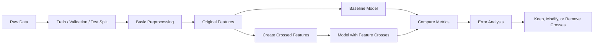
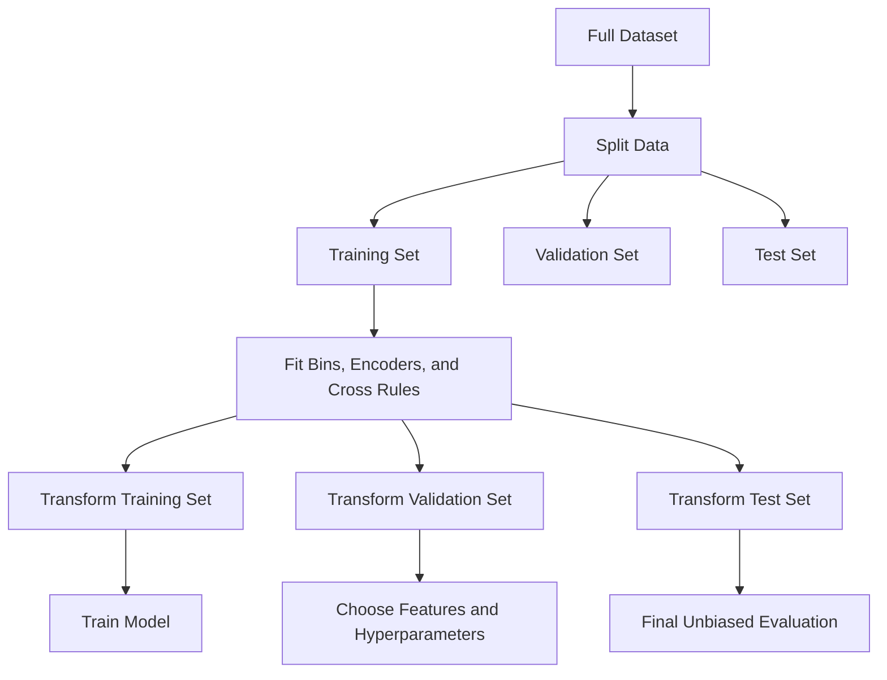
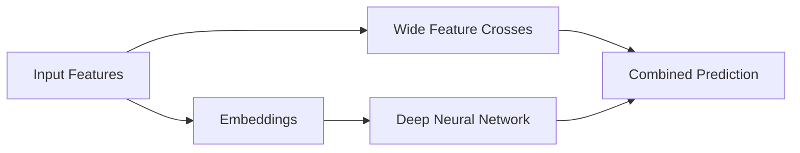

# 029 — Feature Crossing

**Course:** 03 — Machine Learning and Deep Learning
**Module:** Module 06 — Machine Learning
**Content Group:** Feature Engineering
**Roadmap Source:** Machine Learning / Feature Engineering
**Lesson Type:** Machine Learning
**Order in Module:** 029
**Suggested Duration:** 26 minutes

---

## 1. Overview

**Feature crossing** is a feature-engineering technique that combines two or more existing features to create a new feature representing their interaction.

A model may not learn an important relationship when features are considered independently. Feature crossing makes that relationship explicit.

For example, suppose a house-price dataset contains:

* `location`
* `property_type`
* `number_of_rooms`

Each feature may influence price independently, but their combinations may be even more informative:

```text
location = "city_center"
property_type = "apartment"

crossed feature = "city_center_apartment"
```

An apartment in the city center may behave differently from:

* an apartment in a rural area,
* a detached house in the city center,
* or a detached house in a rural area.

Feature crossing is especially useful for:

* linear models,
* recommendation systems,
* advertising models,
* fraud detection,
* customer behavior prediction,
* categorical data,
* sparse high-dimensional datasets.

The main idea is:

> A crossed feature allows a model to represent interactions between variables that may not be visible when each variable is used separately.

---

## 2. Learning Objectives

After completing this lesson, you should be able to:

* Explain feature crossing in your own words.
* Identify when feature interactions may improve a model.
* Create crosses between numerical and categorical features.
* Distinguish feature crossing from polynomial feature expansion.
* Use one-hot encoding and hashing for crossed categorical features.
* Evaluate crossed features against a baseline model.
* Recognize problems such as dimensionality explosion, overfitting, and data leakage.
* Apply feature crossing to a small machine-learning project.

---

## 3. Main Concept

### 3.1 What Is Feature Crossing?

Given two original features:

$$
x_1
$$

and

$$
x_2
$$

a simple numerical cross can be created as:

$$
x_{\text{cross}} = x_1 \times x_2
$$

For categorical features, the cross is usually represented as a combined category:

$$
x_{\text{cross}} = (x_1, x_2)
$$

For example:

```text
device_type = "mobile"
country = "Vietnam"
```

The crossed feature becomes:

```text
device_country = "mobile_Vietnam"
```

The model can now learn a separate effect for mobile users in Vietnam.

---

### 3.2 Why Feature Crossing Is Useful

Consider a model predicting whether a user will click an advertisement.

The dataset contains:

```text
device_type
time_of_day
```

The model may learn that:

* mobile users have a certain click rate,
* evening users have another click rate.

However, the important pattern may be:

> Mobile users are especially likely to click advertisements during the evening.

A crossed feature makes this pattern explicit:

```text
mobile_evening
desktop_evening
mobile_morning
desktop_morning
```

Without feature crossing, a simple linear model may not represent this interaction effectively.

---

## 4. Feature Crossing in the Machine-Learning Workflow



A recommended workflow is:

1. Split the data.
2. Build a baseline with the original features.
3. Identify possible feature interactions.
4. create a small number of meaningful crosses.
5. Train the model again.
6. Compare validation metrics.
7. Analyze errors and overfitting.
8. Keep only useful crossed features.

Feature crossing should not be performed blindly. Each cross should be motivated by:

* domain knowledge,
* exploratory analysis,
* model errors,
* or a clear hypothesis.

---

## 5. Types of Feature Crosses

### 5.1 Numerical × Numerical

Two numerical features can be multiplied together.

Suppose house price depends on:

* floor area,
* quality score.

A possible cross is:

$$
\text{area_quality} = \text{floor_area} \times \text{quality_score}
$$

Example:

```python
df["area_quality"] = df["floor_area"] * df["quality_score"]
```

This can help a linear model represent the idea that a large, high-quality house may be worth substantially more than either feature suggests independently.

---

### 5.2 Categorical × Categorical

Two categorical variables can be concatenated into a new category.

Example:

```python
df["location_property_type"] = (
    df["location"].astype(str)
    + "_"
    + df["property_type"].astype(str)
)
```

Possible values include:

```text
city_center_apartment
city_center_house
suburb_apartment
suburb_house
```

This crossed feature is usually followed by:

* one-hot encoding,
* target encoding,
* frequency encoding,
* or feature hashing.

---

### 5.3 Categorical × Numerical

A categorical feature can interact with a numerical feature.

For example:

```text
location × floor_area
```

A simple implementation uses one-hot encoding.

Suppose:

```text
location_city_center = 1
location_suburb = 0
floor_area = 80
```

The crossed numerical feature is:

$$
\text{city_center_area} = \text{location_city_center} \times \text{floor_area}
$$

The resulting value is:

```text
80
```

For a suburban property, the same feature would be:

```text
0
```

This allows a linear model to learn different area effects for different locations.

---

### 5.4 Higher-Order Crosses

Three or more features can be combined:

```text
country × device × time_of_day
```

Example:

```text
Vietnam_mobile_evening
Thailand_desktop_morning
```

Higher-order crosses can capture highly specific behavior, but they also create many possible combinations.

Use them carefully because they may cause:

* sparse data,
* overfitting,
* high memory usage,
* unseen categories in production.

---

## 6. Feature Crossing and Linear Models

Suppose a linear regression model uses two features:

$$
\hat{y} = \beta_0 + \beta_1x_1 + \beta_2x_2
$$

This model assumes that the contribution of (x_1) does not depend on (x_2).

By adding an interaction term:

$$
x_3 = x_1x_2
$$

the model becomes:

$$
\hat{y} = \beta_0 + \beta_1x_1 + \beta_2x_2 + \beta_3x_1x_2
$$

The coefficient (\beta_3) represents the interaction between the two features.

If:

$$
\beta_3 > 0
$$

the combined presence of large (x_1) and large (x_2) increases the prediction.

If:

$$
\beta_3 < 0
$$

the combined effect reduces the prediction.

---

## 7. Feature Crossing vs. Polynomial Features

Feature crossing is closely related to polynomial feature expansion.

Given two features:

$$
x_1, x_2
$$

a second-degree polynomial expansion may create:

$$
x_1,\quad x_2,\quad x_1^2,\quad x_1x_2,\quad x_2^2
$$

The term:

$$
x_1x_2
$$

is a feature cross.

### Comparison

| Technique                 | Typical output                       | Main use                        |
| ------------------------- | ------------------------------------ | ------------------------------- |
| Feature crossing          | Selected interactions                | Domain-driven interactions      |
| Polynomial features       | All interactions up to a degree      | Nonlinear regression boundaries |
| One-hot category crossing | Combined categorical values          | Sparse categorical interactions |
| Feature hashing           | Fixed-size representation of crosses | Large-scale sparse systems      |

Feature crossing is usually more selective than full polynomial expansion.

---

## 8. Worked Example: House Price Prediction

Suppose the original dataset contains:

| Location | Property Type | Area | Bedrooms |   Price |
| -------- | ------------- | ---: | -------: | ------: |
| Center   | Apartment     |   60 |        2 | 180,000 |
| Center   | House         |  120 |        4 | 500,000 |
| Suburb   | Apartment     |   60 |        2 | 110,000 |
| Suburb   | House         |  120 |        4 | 280,000 |

The relationship between property type and price depends strongly on location.

A useful crossed feature is:

```text
location_property_type
```

Result:

| Location | Property Type | Crossed Feature  |
| -------- | ------------- | ---------------- |
| Center   | Apartment     | Center_Apartment |
| Center   | House         | Center_House     |
| Suburb   | Apartment     | Suburb_Apartment |
| Suburb   | House         | Suburb_House     |

The model can learn a different coefficient for each combination.

---

## 9. Python Demo: Categorical Feature Crossing

```python
import pandas as pd
from sklearn.compose import ColumnTransformer
from sklearn.linear_model import LinearRegression
from sklearn.metrics import mean_absolute_error
from sklearn.model_selection import train_test_split
from sklearn.pipeline import Pipeline
from sklearn.preprocessing import OneHotEncoder

data = pd.DataFrame(
    {
        "location": [
            "center",
            "center",
            "suburb",
            "suburb",
            "center",
            "suburb",
            "center",
            "suburb",
        ],
        "property_type": [
            "apartment",
            "house",
            "apartment",
            "house",
            "apartment",
            "house",
            "house",
            "apartment",
        ],
        "area": [60, 120, 65, 130, 80, 100, 150, 75],
        "bedrooms": [2, 4, 2, 4, 3, 3, 5, 2],
        "price": [
            180_000,
            500_000,
            115_000,
            290_000,
            240_000,
            230_000,
            620_000,
            130_000,
        ],
    }
)

# Create a categorical feature cross
data["location_property_type"] = (
    data["location"] + "_" + data["property_type"]
)

X = data[
    [
        "location",
        "property_type",
        "location_property_type",
        "area",
        "bedrooms",
    ]
]
y = data["price"]

X_train, X_test, y_train, y_test = train_test_split(
    X,
    y,
    test_size=0.25,
    random_state=42,
)

categorical_features = [
    "location",
    "property_type",
    "location_property_type",
]

numerical_features = [
    "area",
    "bedrooms",
]

preprocessor = ColumnTransformer(
    transformers=[
        (
            "categorical",
            OneHotEncoder(handle_unknown="ignore"),
            categorical_features,
        ),
        (
            "numerical",
            "passthrough",
            numerical_features,
        ),
    ]
)

pipeline = Pipeline(
    steps=[
        ("preprocessor", preprocessor),
        ("model", LinearRegression()),
    ]
)

pipeline.fit(X_train, y_train)

predictions = pipeline.predict(X_test)

mae = mean_absolute_error(y_test, predictions)

print(f"MAE: {mae:,.2f}")
```

The option:

```python
handle_unknown="ignore"
```

helps the pipeline handle categories that appear in validation or test data but were not present during training.

However, unseen crossed categories still contain limited learned information. Therefore, production systems often retain both:

* the original individual features,
* and the crossed feature.

---

## 10. Comparing a Baseline with Crossed Features

A proper experiment should compare two versions.

### Baseline

```text
location
property_type
area
bedrooms
```

### Crossed-feature model

```text
location
property_type
area
bedrooms
location_property_type
area × bedrooms
```

Example experiment table:

| Model                       | Features                    | Validation MAE | Test MAE |
| --------------------------- | --------------------------- | -------------: | -------: |
| Linear Regression Baseline  | Original features           |         31,200 |   33,100 |
| Linear Regression + Crosses | Original + crossed features |         26,900 |   28,400 |
| Random Forest               | Original features           |         24,800 |   27,100 |

The crossed features improved the linear model, but the Random Forest still performed better.

This does not mean feature crossing failed. It means that:

* the linear model benefited from explicit interactions,
* while the tree model learned many interactions automatically.

---

## 11. Feature Crossing with `PolynomialFeatures`

Scikit-learn can generate numerical interaction terms automatically.

```python
import pandas as pd
from sklearn.preprocessing import PolynomialFeatures

X = pd.DataFrame(
    {
        "area": [60, 90, 120],
        "quality_score": [5, 7, 9],
    }
)

transformer = PolynomialFeatures(
    degree=2,
    interaction_only=True,
    include_bias=False,
)

X_crossed = transformer.fit_transform(X)

feature_names = transformer.get_feature_names_out(X.columns)

result = pd.DataFrame(
    X_crossed,
    columns=feature_names,
)

print(result)
```

Possible output:

```text
   area  quality_score  area quality_score
0  60.0            5.0               300.0
1  90.0            7.0               630.0
2 120.0            9.0              1080.0
```

The interaction term is:

$$
\text{area} \times \text{quality_score}
$$

The parameter:

```python
interaction_only=True
```

creates cross-products without squared terms such as:

$$
x_1^2
$$

and:

$$
x_2^2
$$

---

## 12. Crossed Features for Classification

Feature crossing can also improve classification models.

Suppose a fraud-detection dataset contains:

```text
transaction_country
card_country
transaction_hour
device_type
```

Useful feature crosses may include:

```text
transaction_country × card_country
device_type × transaction_hour_bin
merchant_category × transaction_amount_bin
```

A cross such as:

```text
foreign_country_night_transaction
```

may indicate higher fraud risk than any individual feature alone.

Example:

```python
df["country_mismatch"] = (
    df["transaction_country"] != df["card_country"]
).astype(int)

df["device_hour"] = (
    df["device_type"].astype(str)
    + "_"
    + df["hour_bin"].astype(str)
)
```

Notice that `country_mismatch` is not simply a concatenated category. It is a domain-informed interaction feature.

This is often more interpretable and compact than creating every possible category pair.

---

## 13. Binning Before Feature Crossing

Continuous features often produce too many combinations. Binning can reduce their cardinality before crossing.

Suppose the dataset contains:

```text
age
income
```

Instead of crossing exact values, create groups:

```python
df["age_group"] = pd.cut(
    df["age"],
    bins=[0, 18, 30, 45, 60, 100],
    labels=[
        "under_18",
        "18_30",
        "31_45",
        "46_60",
        "over_60",
    ],
)

df["income_group"] = pd.qcut(
    df["income"],
    q=4,
    labels=["low", "medium", "high", "very_high"],
)

df["age_income_cross"] = (
    df["age_group"].astype(str)
    + "_"
    + df["income_group"].astype(str)
)
```

Possible crossed values:

```text
18_30_low
31_45_high
46_60_very_high
```

This creates a manageable number of categories.

---

## 14. Feature Hashing

When categorical crosses create thousands or millions of combinations, storing every category explicitly may be impractical.

Feature hashing maps crossed values into a fixed number of numerical buckets.

Conceptually:

$$
\text{bucket} = \text{hash}(\text{crossed value}) \bmod B
$$

where (B) is the number of hash buckets.

Example:

```text
mobile_Vietnam_evening
```

may be mapped to:

```text
bucket 127
```

Another combination may occasionally map to the same bucket. This is called a **hash collision**.

### Advantages

* Fixed memory usage
* Works with unseen combinations
* Useful for high-cardinality features
* Suitable for online and large-scale learning systems

### Disadvantages

* Hash collisions
* Lower interpretability
* Harder to inspect individual learned categories

---

## 15. When Feature Crossing Is Most Useful

Feature crossing is particularly effective when:

### 15.1 The model is linear

Linear and logistic regression cannot naturally model interactions unless interaction features are added.

### 15.2 Domain knowledge suggests an interaction

Examples:

```text
location × property_type
device × operating_system
product × customer_segment
country × payment_method
age_group × subscription_plan
```

### 15.3 Error analysis reveals subgroup failures

Suppose the model performs well overall but poorly for:

```text
new users on mobile devices
```

A cross such as:

```text
user_status × device_type
```

may help.

### 15.4 The dataset contains sparse categorical data

Recommendation and advertising systems often use many categorical crosses.

Examples:

```text
user_id × product_category
search_query × device_type
publisher × advertisement_type
```

---

## 16. When Feature Crossing May Not Help

Feature crossing may provide little benefit when:

* The original features are unrelated.
* The dataset is too small for the number of combinations.
* The model already captures interactions effectively.
* The crossed feature creates mostly unique categories.
* The cross has no business or statistical justification.
* The crossed feature leaks information from the target.
* The model becomes too sparse or difficult to deploy.

Tree-based models such as:

* Decision Tree,
* Random Forest,
* XGBoost,
* LightGBM,

can often learn feature interactions automatically.

However, explicit crosses may still help when:

* the interaction is highly meaningful,
* the tree depth is limited,
* the dataset is sparse,
* or the interaction simplifies the learning problem.

---

## 17. Dimensionality Explosion

Suppose feature (A) has:

$$
m
$$

possible categories, and feature (B) has:

$$
n
$$

possible categories.

Their full cross may contain as many as:

$$
m \times n
$$

categories.

For example:

```text
city: 500 categories
product: 10,000 categories
```

The full cross can theoretically create:

$$
500 \times 10{,}000 = 5{,}000{,}000
$$

possible combinations.

This can cause:

* high memory usage,
* sparse matrices,
* slow training,
* poor generalization,
* many rare categories,
* unstable coefficients.

Possible solutions include:

* feature hashing,
* grouping rare categories,
* crossing only selected categories,
* regularization,
* target encoding with leakage-safe fitting,
* removing low-frequency combinations.

---

## 18. Rare-Category Handling

A useful approach is to combine rare crossed categories into an `"other"` group.

```python
cross_counts = df["location_property_type"].value_counts()

valid_categories = cross_counts[
    cross_counts >= 20
].index

df["location_property_type_reduced"] = (
    df["location_property_type"]
    .where(
        df["location_property_type"].isin(valid_categories),
        "other",
    )
)
```

Important:

The category frequency threshold must be learned using the training set only.

Do not calculate category frequencies using the complete dataset before splitting, because this exposes information from the validation and test sets.

---

## 19. Data Leakage Risk

Feature crossing itself does not automatically cause leakage. Leakage occurs when one or more crossed features contain information that would not be available at prediction time.

### Unsafe example

Suppose the target is:

```text
customer_churn
```

A feature cross is created using:

```text
cancellation_reason × customer_segment
```

If `cancellation_reason` is known only after a customer has churned, the cross leaks the target.

### Another unsafe example

```text
future_payment_status × current_plan
```

The future payment status is unavailable when making the prediction.

### Safe rule

For every crossed feature, ask:

> Would all components of this feature be available at the exact moment the model makes its prediction?

If the answer is no, the feature should not be used.

---

## 20. Training-Only Feature Engineering

All learned feature-engineering decisions should be fitted on training data only.

This includes:

* category frequency thresholds,
* target encoding values,
* bins learned from data,
* scaling parameters,
* rare-category rules,
* selected interactions.

A safe pipeline looks like this:



---

## 21. Feature Crossing and Different Models

| Model                 | Need for explicit feature crosses                           |
| --------------------- | ----------------------------------------------------------- |
| Linear Regression     | Often useful                                                |
| Logistic Regression   | Often useful                                                |
| Linear SVM            | Often useful                                                |
| Naive Bayes           | Depends on feature representation                           |
| Decision Tree         | Usually learns interactions automatically                   |
| Random Forest         | Often learns interactions automatically                     |
| Gradient Boosting     | Strong interaction-learning capability                      |
| Neural Network        | Can learn interactions, but explicit crosses may still help |
| Factorization Machine | Designed for sparse interactions                            |
| Wide and Deep Model   | Wide part often uses explicit crosses                       |

---

## 22. Wide and Deep Learning

Feature crossing is a major component of **wide and deep learning**.

### Wide Component

The wide component learns memorized rules using explicit crossed features.

Examples:

```text
user_country × product_category
device_type × advertisement_type
```

### Deep Component

The neural network learns generalized representations through embeddings and hidden layers.



The wide part memorizes specific combinations, while the deep part generalizes to similar but previously unseen combinations.

---

## 23. Practical Feature-Crossing Strategy

A useful strategy is to begin with pairs that have a clear interpretation.

### Step 1: Identify business relationships

Example questions:

* Does the effect of area depend on location?
* Does customer behavior depend on both device and time?
* Does fraud risk depend on country and payment method?
* Does product demand depend on season and category?

### Step 2: Create a small number of crosses

Start with two to five meaningful interactions.

Avoid generating every possible pair.

### Step 3: Retain original features

Use:

```text
feature_A
feature_B
feature_A × feature_B
```

Do not usually replace the original features with the cross.

### Step 4: Compare against the baseline

Use the same:

* train/validation split,
* model type,
* random seed,
* preprocessing,
* evaluation metric.

### Step 5: Inspect subgroup performance

A crossed feature may improve a specific business segment even when the global metric changes only slightly.

### Step 6: Check production feasibility

Verify:

* availability at inference time,
* unseen-category handling,
* memory usage,
* latency,
* monitoring,
* feature-definition consistency.

---

## 24. Evaluation Example

Suppose the business objective is to predict customer conversion.

Possible metrics include:

* ROC-AUC,
* PR-AUC,
* log loss,
* precision,
* recall,
* F1-score,
* conversion lift,
* profit per campaign.

Example experiment:

| Experiment   | Crossed Features | Validation ROC-AUC | Validation Log Loss |
| ------------ | ---------------- | -----------------: | ------------------: |
| Baseline     | None             |              0.781 |               0.492 |
| Experiment A | Device × Time    |              0.794 |               0.478 |
| Experiment B | Country × Plan   |              0.786 |               0.487 |
| Experiment C | Both crosses     |              0.801 |               0.469 |

Experiment C appears best on validation data.

However, before selecting it, also inspect:

* test-set performance,
* calibration,
* minority-group performance,
* latency,
* model size,
* production stability.

---

## 25. Error Analysis

Feature crosses should be guided by model errors.

Suppose a price model produces large errors for:

```text
luxury apartments in suburban areas
```

Inspect the relevant features:

```text
property_type = apartment
location = suburb
quality_level = luxury
```

Possible crosses include:

```text
location × property_type
property_type × quality_level
location × property_type × quality_level
```

A useful error-analysis table might be:

| Segment             | Sample Count |    MAE | Possible Cross           |
| ------------------- | -----------: | -----: | ------------------------ |
| Center apartments   |        1,200 | 18,000 | Already acceptable       |
| Suburban apartments |          450 | 31,000 | Location × Property Type |
| Luxury houses       |          170 | 42,000 | Quality × Property Type  |
| Old small houses    |          210 | 37,000 | Age Bin × Area Bin       |

This connects feature engineering directly to observed model weaknesses.

---

## 26. Common Mistakes

### 26.1 Creating Every Possible Cross

Generating all combinations leads to dimensionality explosion and overfitting.

Prefer hypothesis-driven feature crossing.

---

### 26.2 Crossing Unique Identifiers

A cross such as:

```text
user_id × timestamp
```

may create nearly one unique category per row.

This is unlikely to generalize.

---

### 26.3 Removing the Original Features

The model may need both individual and interaction effects.

Use:

```text
A
B
A × B
```

instead of only:

```text
A × B
```

---

### 26.4 Using Test Data to Select Crosses

Creating and selecting interactions based on test-set results causes test leakage.

Use:

* training data for fitting,
* validation data for selecting,
* test data only for final evaluation.

---

### 26.5 Ignoring Rare Combinations

A category appearing only once or twice may receive an unstable estimate.

Use:

* regularization,
* minimum-frequency thresholds,
* category grouping,
* hashing,
* or larger datasets.

---

### 26.6 Using a Complex Model Without a Baseline

Feature crosses should be compared with a simple baseline.

Otherwise, you cannot determine whether they provide real value.

---

### 26.7 Optimizing Only the Score

A crossed feature may improve a metric but create:

* unacceptable latency,
* unfair subgroup behavior,
* production instability,
* hard-to-maintain pipelines,
* privacy risks.

A good model must solve the business problem, not merely maximize an offline score.

---

## 27. Practical Exercise

Use a house-price dataset containing features such as:

```text
location
property_type
area
bedrooms
house_age
quality_score
price
```

### Task 1: Build a Baseline

Train a Linear Regression model using:

```text
location
property_type
area
bedrooms
house_age
quality_score
```

Evaluate:

* MAE,
* RMSE,
* (R^2).

---

### Task 2: Create Crossed Features

Try the following:

```text
location × property_type
area × quality_score
bedrooms × property_type
age_bin × location
```

Example implementation:

```python
df["location_property_type"] = (
    df["location"].astype(str)
    + "_"
    + df["property_type"].astype(str)
)

df["area_quality"] = (
    df["area"]
    * df["quality_score"]
)

df["house_age_bin"] = pd.cut(
    df["house_age"],
    bins=[0, 5, 15, 30, 60, float("inf")],
    labels=[
        "new",
        "recent",
        "middle_age",
        "old",
        "very_old",
    ],
)

df["age_location"] = (
    df["house_age_bin"].astype(str)
    + "_"
    + df["location"].astype(str)
)
```

---

### Task 3: Train Multiple Models

Compare:

1. Linear Regression baseline
2. Linear Regression with crossed features
3. Random Forest
4. XGBoost or LightGBM

---

### Task 4: Record Results

| Model             | Crosses Used     | Validation MAE | Test MAE | Notes                  |
| ----------------- | ---------------- | -------------: | -------: | ---------------------- |
| Linear Regression | None             |                |          | Baseline               |
| Linear Regression | Location × Type  |                |          |                        |
| Linear Regression | Multiple crosses |                |          |                        |
| Random Forest     | None             |                |          | Learns interactions    |
| XGBoost           | None             |                |          | Strong nonlinear model |

---

### Task 5: Perform Error Analysis

Answer:

* Which feature cross improved the model most?
* Which cross increased overfitting?
* Which property segments still have high errors?
* Did crossed features help the linear model more than the tree models?
* Were any crossed categories too rare?
* Would all features be available in production?

---

## 28. Mini Project Deliverable

Create a notebook named:

```text
feature_crossing_house_prices.ipynb
```

Recommended sections:

```text
1. Problem Definition
2. Dataset Overview
3. Train / Validation / Test Split
4. Baseline Features
5. Baseline Model
6. Feature-Crossing Hypotheses
7. Crossed Feature Implementation
8. Model Comparison
9. Error Analysis
10. Leakage and Production Checks
11. Final Recommendation
```

Possible portfolio artifacts:

* Jupyter notebook
* Feature-engineering pipeline
* Model-comparison chart
* Experiment-tracking table
* Feature-importance analysis
* Prediction API
* Dockerized inference service
* Technical project report

---

## 29. Completion Checklist

* [ ] I can explain feature crossing in one or two minutes.
* [ ] I understand why linear models often benefit from explicit interactions.
* [ ] I can create numerical and categorical feature crosses.
* [ ] I can distinguish feature crossing from polynomial expansion.
* [ ] I retain the original features when adding interaction terms.
* [ ] I compare crossed features against a baseline model.
* [ ] I fit data-dependent transformations using training data only.
* [ ] I check for dimensionality explosion and rare combinations.
* [ ] I check whether all crossed features are available at inference time.
* [ ] I have created a notebook, model, chart, API, or technical note for this lesson.
* [ ] I have documented at least one caveat, assumption, or future experiment.

---

## 30. Related Outcome

This lesson supports the following outcome:

> Train, compare, and evaluate supervised and unsupervised machine-learning models using thoughtful feature engineering.

Feature crossing is not only a preprocessing trick. It is a structured method for translating domain knowledge and model-error patterns into learnable signals.

---

## 31. Related Project

### Mini Project: House Price Prediction

Build and compare:

* Linear Regression
* Linear Regression with crossed features
* Random Forest
* XGBoost or LightGBM

Possible crossed features:

```text
location × property_type
area × quality_score
bedrooms × property_type
house_age_bin × location
```

Evaluate each model using:

* MAE,
* RMSE,
* (R^2),
* training time,
* inference time,
* model complexity,
* subgroup error analysis.

---

## 32. Summary

**Feature crossing** creates new features by combining two or more existing variables.

It is useful when the effect of one feature depends on another feature.

A simple numerical interaction is:

$$
x_{\text{cross}} = x_1x_2
$$

A categorical interaction can be represented as:

```text
feature_A_feature_B
```

Feature crossing is especially valuable for linear models because it allows them to represent interactions that would otherwise be missing.

However, crossed features must be used carefully because they can create:

* high dimensionality,
* sparse categories,
* overfitting,
* data leakage,
* production inconsistencies.

A strong workflow is:

```text
business hypothesis
    ↓
baseline model
    ↓
selected feature crosses
    ↓
validation comparison
    ↓
error analysis
    ↓
production and leakage checks
```

The goal is not to generate as many features as possible. The goal is to create a small number of meaningful interactions that improve the model and support the business objective.
