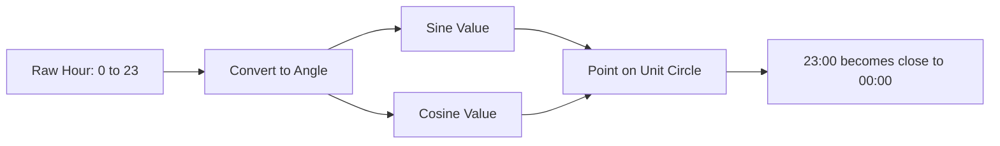
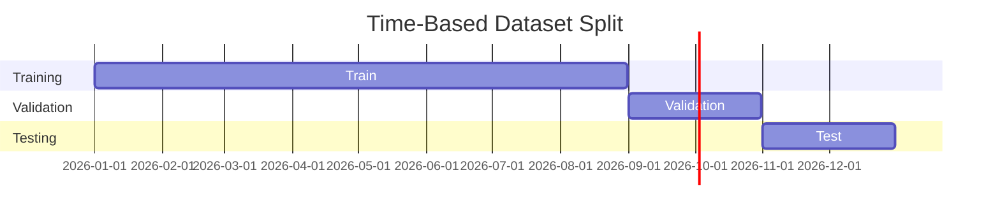
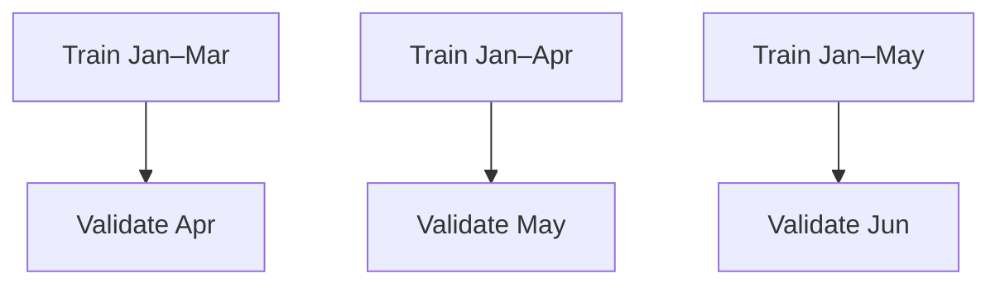
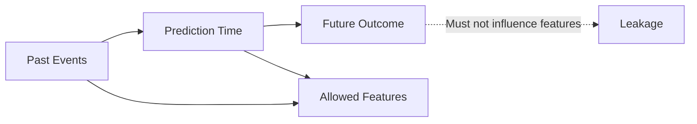
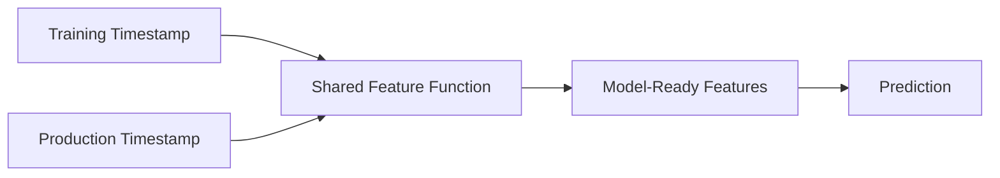

# 030 — Date / Time Features

**Course:** 03 — Machine Learning and Deep Learning
**Module:** Module 06 — Machine Learning
**Content Group:** Feature Engineering
**Roadmap Source:** Machine Learning / Feature Engineering
**Lesson Type:** Machine Learning
**Order in Module:** 030
**Suggested Duration:** 26 minutes

---

## 1. Overview

Many datasets contain timestamps, dates, or durations:

* Customer registration dates
* Transaction timestamps
* Delivery dates
* Website visit times
* Product release dates
* House construction years
* Sensor measurement timestamps

A raw timestamp such as:

```text
2026-07-12 14:35:20
```

is usually not directly useful to a machine learning model.

Instead, we transform it into meaningful **date and time features**, such as:

* Year
* Month
* Day of week
* Hour
* Weekend indicator
* Time since registration
* Days until an event
* Seasonal or cyclical encodings

These features help models recognize temporal patterns such as seasonality, trends, business hours, holidays, customer age, and event recency.

---

## 2. Learning Objectives

After completing this lesson, you should be able to:

* Explain date and time feature engineering in your own words.
* Convert raw timestamp columns into model-ready features.
* Distinguish calendar features, duration features, and cyclical features.
* Identify temporal patterns such as trends and seasonality.
* Prevent future information from leaking into training features.
* Build date and time transformations inside an ML pipeline.
* Evaluate whether temporal features improve validation performance.

---

## 3. What Are Date / Time Features?

**Date / time feature engineering** is the process of transforming raw dates and timestamps into numerical or categorical variables that help a machine learning model discover temporal patterns.

For example, suppose an e-commerce dataset contains:

```text
order_time = 2026-07-12 20:45:00
```

Possible derived features include:

```text
year             = 2026
month            = 7
day              = 12
day_of_week      = 6
hour             = 20
is_weekend       = 1
is_business_hour = 0
```

The raw timestamp contains the same information, but the derived features make its structure easier for models to use.

---

## 4. Why Date and Time Features Matter

Date and time often influence real-world behavior.

Examples:

| Business problem       | Useful temporal pattern             |
| ---------------------- | ----------------------------------- |
| Sales forecasting      | Month, season, holiday period       |
| Fraud detection        | Transaction hour, unusual frequency |
| Customer churn         | Days since last activity            |
| Delivery prediction    | Day of week, departure hour         |
| Energy demand          | Hour, weekday, season               |
| House price prediction | Property age, renovation recency    |
| Website traffic        | Hour, weekend, campaign period      |

A model may not understand that Monday and Tuesday are related unless the temporal structure is explicitly represented.

---

## 5. Position in the Machine Learning Workflow

```mermaid
flowchart LR
    A[Raw Dataset] --> B[Parse Date and Time]
    B --> C[Temporal Data Validation]
    C --> D[Train / Validation / Test Split]
    D --> E[Create Date and Time Features]
    E --> F[Train Baseline Model]
    F --> G[Train Improved Model]
    G --> H[Evaluate Metrics]
    H --> I[Error Analysis]
    I --> J[Deploy Feature Pipeline]
```



A safe workflow is:

```text
raw data
    -> parse timestamps
    -> inspect temporal coverage
    -> create a time-aware split
    -> build features using information available at prediction time
    -> train a baseline
    -> add temporal features
    -> compare metrics
    -> analyze errors
```

---

## 6. Parsing Dates Correctly

Before creating features, timestamps must be converted into a real datetime data type.

### Pandas example

```python
import pandas as pd

df = pd.DataFrame(
    {
        "order_time": [
            "2026-07-10 09:15:00",
            "2026-07-11 18:40:00",
            "2026-07-12 21:05:00",
        ]
    }
)

df["order_time"] = pd.to_datetime(
    df["order_time"],
    errors="coerce",
)

print(df.dtypes)
```

Output:

```text
order_time    datetime64[ns]
dtype: object
```

The option `errors="coerce"` converts invalid values into `NaT`, which is the datetime equivalent of a missing value.

### Inspect invalid timestamps

```python
invalid_rows = df[df["order_time"].isna()]
print(invalid_rows)
```

Never assume that every date string follows the same format.

---

## 7. Common Calendar Features

Calendar features describe where a timestamp appears on the calendar.

```python
df["year"] = df["order_time"].dt.year
df["quarter"] = df["order_time"].dt.quarter
df["month"] = df["order_time"].dt.month
df["day"] = df["order_time"].dt.day
df["day_of_week"] = df["order_time"].dt.dayofweek
df["day_of_year"] = df["order_time"].dt.dayofyear
df["week_of_year"] = df["order_time"].dt.isocalendar().week.astype("int")
df["hour"] = df["order_time"].dt.hour
df["minute"] = df["order_time"].dt.minute
```

In Pandas, `dayofweek` usually follows:

```text
Monday    = 0
Tuesday   = 1
Wednesday = 2
Thursday  = 3
Friday    = 4
Saturday  = 5
Sunday    = 6
```

### Example result

| order_time       | month | day_of_week | hour |
| ---------------- | ----: | ----------: | ---: |
| 2026-07-10 09:15 |     7 |           4 |    9 |
| 2026-07-11 18:40 |     7 |           5 |   18 |
| 2026-07-12 21:05 |     7 |           6 |   21 |

---

## 8. Boolean Date / Time Features

Boolean features answer simple temporal questions.

```python
df["is_weekend"] = df["order_time"].dt.dayofweek.isin([5, 6]).astype(int)

df["is_month_start"] = df["order_time"].dt.is_month_start.astype(int)
df["is_month_end"] = df["order_time"].dt.is_month_end.astype(int)

df["is_quarter_start"] = df["order_time"].dt.is_quarter_start.astype(int)
df["is_quarter_end"] = df["order_time"].dt.is_quarter_end.astype(int)

df["is_year_start"] = df["order_time"].dt.is_year_start.astype(int)
df["is_year_end"] = df["order_time"].dt.is_year_end.astype(int)
```

You can also define domain-specific indicators.

```python
df["is_business_hour"] = (
    (df["order_time"].dt.hour >= 9)
    & (df["order_time"].dt.hour < 17)
).astype(int)
```

These features are often more interpretable than raw numerical values.

---

## 9. Time-of-Day Categories

Hour can be converted into business-friendly categories.

```python
def get_time_period(hour: int) -> str:
    if 5 <= hour < 12:
        return "morning"
    if 12 <= hour < 17:
        return "afternoon"
    if 17 <= hour < 22:
        return "evening"
    return "night"


df["time_period"] = df["order_time"].dt.hour.map(get_time_period)
```

Example:

| hour | time_period |
| ---: | ----------- |
|    8 | morning     |
|   14 | afternoon   |
|   19 | evening     |
|    2 | night       |

This representation may work well when exact hours are less important than broader behavioral periods.

---

## 10. Duration and Elapsed-Time Features

Duration features measure the distance between two timestamps.

Suppose a dataset contains:

```text
registration_date
prediction_date
last_activity_date
```

You can create:

```python
df["customer_age_days"] = (
    df["prediction_date"] - df["registration_date"]
).dt.days

df["days_since_last_activity"] = (
    df["prediction_date"] - df["last_activity_date"]
).dt.days
```

Examples of duration features include:

* Customer account age
* Product age
* Property age
* Time since last purchase
* Time since last login
* Days until contract expiration
* Delivery duration
* Time between transactions

### Important principle

A duration should normally be calculated relative to the moment when the prediction is made.

```text
feature = prediction_time - past_event_time
```

Do not calculate it using information from the future.

---

## 11. Reference-Date Features

Some datasets contain a year but not a complete date.

For example, in house price prediction:

```text
year_built = 2005
year_sold  = 2026
```

A more useful feature may be:

$$
\text{Property Age} = \text{Year Sold} - \text{Year Built}
$$

```python
df["property_age"] = df["year_sold"] - df["year_built"]
```

For renovation data:

$$
\text{Years Since Renovation} = \text{Year Sold} - \text{Year Renovated}
$$

```python
df["years_since_renovation"] = (
    df["year_sold"] - df["year_renovated"]
)
```

These features often carry clearer business meaning than the original year columns.

---

## 12. Ordinal and Cyclical Time

Some time features have a natural order.

For example:

```text
1:00 < 2:00 < 3:00
```

However, time is also cyclical:

```text
23:00 is close to 00:00
December is close to January
Sunday is close to Monday
```

A model using the raw hour values sees:

$$
|23 - 0| = 23
$$

But in reality, 23:00 and 00:00 are only one hour apart.

This is why cyclical encoding is useful.

---

## 13. Cyclical Encoding

A cyclical feature can be represented using sine and cosine.

For a value (x) with cycle length (T):

$$
x_{\sin} = \sin\left(\frac{2\pi x}{T}\right)
$$

$$
x_{\cos} = \cos\left(\frac{2\pi x}{T}\right)
$$

For hour of day:

$$
T = 24
$$

```python
import numpy as np

df["hour_sin"] = np.sin(
    2 * np.pi * df["order_time"].dt.hour / 24
)

df["hour_cos"] = np.cos(
    2 * np.pi * df["order_time"].dt.hour / 24
)
```

For month:

```python
month = df["order_time"].dt.month

df["month_sin"] = np.sin(2 * np.pi * (month - 1) / 12)
df["month_cos"] = np.cos(2 * np.pi * (month - 1) / 12)
```

For day of week:

```python
day_of_week = df["order_time"].dt.dayofweek

df["dow_sin"] = np.sin(2 * np.pi * day_of_week / 7)
df["dow_cos"] = np.cos(2 * np.pi * day_of_week / 7)
```

---

## 14. Cyclical Feature Diagram



Conceptually, each timestamp is placed on a circle.

```text
                  00:00
                    ●
             21:00     03:00

        18:00               06:00

             15:00     09:00
                    ●
                  12:00
```

This preserves the circular relationship between time values.

---

## 15. Raw, Categorical, or Cyclical Encoding?

There is no single best representation for every model.

| Representation   | Example                 | Often useful for                      |
| ---------------- | ----------------------- | ------------------------------------- |
| Raw integer      | `hour = 21`             | Tree-based models                     |
| One-hot encoded  | `hour_21 = 1`           | Linear models                         |
| Cyclical         | `hour_sin`, `hour_cos`  | Linear, neural, distance-based models |
| Grouped category | `time_period = evening` | Interpretable business models         |

Tree models can often learn useful splits directly from raw calendar values.

Linear models usually benefit more from one-hot or cyclical encoding because linear relationships cannot naturally represent periodic boundaries.

The correct choice should be validated experimentally.

---

## 16. Seasonality Features

Seasonality is a repeating pattern over time.

Examples:

* Higher electricity use at certain hours
* Increased shopping during weekends
* Tourism demand during summer
* Sales peaks near major holidays
* Lower activity during nighttime

Common seasonal features include:

```python
df["month"] = df["timestamp"].dt.month
df["quarter"] = df["timestamp"].dt.quarter
df["day_of_week"] = df["timestamp"].dt.dayofweek
df["hour"] = df["timestamp"].dt.hour
df["is_weekend"] = df["timestamp"].dt.dayofweek.isin([5, 6]).astype(int)
```

Domain-specific seasons can also be created.

```python
def map_season(month: int) -> str:
    if month in [12, 1, 2]:
        return "winter"
    if month in [3, 4, 5]:
        return "spring"
    if month in [6, 7, 8]:
        return "summer"
    return "autumn"


df["season"] = df["timestamp"].dt.month.map(map_season)
```

Season definitions should match the geography and business context.

---

## 17. Holiday and Event Features

Business activity can change around special dates.

Potential features include:

* `is_holiday`
* `days_before_holiday`
* `days_after_holiday`
* `is_salary_day`
* `is_promotion_period`
* `is_school_break`
* `is_public_event_day`

Example:

```python
holiday_dates = pd.to_datetime(
    [
        "2026-01-01",
        "2026-04-30",
        "2026-05-01",
        "2026-09-02",
    ]
)

df["date"] = df["order_time"].dt.normalize()

df["is_holiday"] = df["date"].isin(holiday_dates).astype(int)
```

Holiday calendars must be appropriate for the country, region, and historical period represented by the data.

---

## 18. Time Since Previous Event

Event-history features are important in transaction, clickstream, sensor, and customer behavior datasets.

Example dataset:

| customer_id | event_time |
| ----------- | ---------- |
| A           | 09:00      |
| A           | 09:30      |
| A           | 12:00      |
| B           | 10:00      |

Calculate the time since the previous event:

```python
df = df.sort_values(["customer_id", "event_time"])

df["previous_event_time"] = (
    df.groupby("customer_id")["event_time"].shift(1)
)

df["minutes_since_previous_event"] = (
    df["event_time"] - df["previous_event_time"]
).dt.total_seconds() / 60
```

Result:

| customer_id | event_time | minutes_since_previous_event |
| ----------- | ---------- | ---------------------------: |
| A           | 09:00      |                          NaN |
| A           | 09:30      |                           30 |
| A           | 12:00      |                          150 |
| B           | 10:00      |                          NaN |

This feature can help detect:

* Rapid repeat purchases
* Suspicious transaction bursts
* User inactivity
* Machine failures
* Communication frequency

---

## 19. Rolling Time-Based Features

Rolling features summarize recent historical behavior.

Examples:

* Sales in the previous 7 days
* Number of transactions in the past hour
* Average demand over the previous 30 days
* Customer logins during the previous week

Example for daily sales:

```python
df = df.sort_values("date").set_index("date")

df["sales_last_7_days"] = (
    df["sales"]
    .shift(1)
    .rolling(window=7)
    .sum()
)
```

The `shift(1)` is critical.

Without it, the current target value may accidentally be included in the feature.

Unsafe:

```python
df["sales_last_7_days"] = df["sales"].rolling(7).sum()
```

Safer:

```python
df["sales_last_7_days"] = (
    df["sales"].shift(1).rolling(7).sum()
)
```

---

## 20. Temporal Interactions

Date and time variables may interact with other features.

Examples:

* Weekend × store type
* Hour × traffic condition
* Season × product category
* Property age × neighborhood
* Holiday × promotion status

```python
df["weekend_promotion"] = (
    df["is_weekend"] * df["is_promotion"]
)

df["property_age_squared"] = df["property_age"] ** 2
```

Tree-based models can often discover interactions automatically, but explicitly creating meaningful interactions may still improve performance and interpretability.

---

## 21. Time Zones

Time zones must be handled carefully.

A timestamp can be:

* Naive: no timezone information
* Timezone-aware: connected to a timezone
* Stored in UTC
* Displayed in local time

Example:

```python
df["timestamp"] = pd.to_datetime(
    df["timestamp"],
    utc=True,
)
```

Convert UTC to local time:

```python
df["local_timestamp"] = (
    df["timestamp"]
    .dt.tz_convert("Asia/Bangkok")
)
```

Then extract local temporal features:

```python
df["local_hour"] = df["local_timestamp"].dt.hour
df["local_day_of_week"] = df["local_timestamp"].dt.dayofweek
```

For customer behavior, local hour is often more meaningful than UTC hour.

A transaction at `02:00 UTC` may correspond to normal business hours in another timezone.

---

## 22. Daylight Saving Time

Some regions change clock offsets during the year.

This can create:

* Missing local hours
* Repeated local hours
* Incorrect duration calculations
* Duplicate timestamps

Prefer storing timestamps in UTC and converting to local time only when local calendar features are required.

```text
Store: UTC timestamp
Display: local timestamp
Model features: local or UTC depending on the problem
```

Document which timezone each feature uses.

---

## 23. Missing and Invalid Dates

Datetime columns may contain:

* Empty values
* Invalid formats
* Impossible dates
* Default placeholder dates
* Mixed time zones

Example:

```python
df["timestamp"] = pd.to_datetime(
    df["timestamp"],
    errors="coerce",
    utc=True,
)

df["timestamp_missing"] = df["timestamp"].isna().astype(int)
```

You may impute or preserve missingness depending on the business meaning.

For example, a missing renovation date may mean:

```text
The house was never renovated.
```

That should not necessarily be treated as a random missing value.

```python
df["was_renovated"] = df["year_renovated"].notna().astype(int)
```

---

## 24. Time-Based Data Splitting

For temporal datasets, random splitting may produce unrealistic evaluation.

Suppose data covers January to December.

A random split can place December observations in training and February observations in testing. This allows the model to learn from the future relative to some test records.

A time-based split is often safer:

```text
Training:   January to August
Validation: September to October
Testing:    November to December
```



Example:

```python
train = df[df["date"] < "2026-09-01"]

validation = df[
    (df["date"] >= "2026-09-01")
    & (df["date"] < "2026-11-01")
]

test = df[df["date"] >= "2026-11-01"]
```

The test set should represent the future period that the deployed model will face.

---

## 25. Walk-Forward Validation

Walk-forward validation evaluates the model over multiple future windows.

```text
Fold 1:
Train      Jan–Mar
Validation Apr

Fold 2:
Train      Jan–Apr
Validation May

Fold 3:
Train      Jan–May
Validation Jun
```



Scikit-learn provides `TimeSeriesSplit`.

```python
from sklearn.model_selection import TimeSeriesSplit

time_split = TimeSeriesSplit(n_splits=5)

for train_index, validation_index in time_split.split(df):
    train_df = df.iloc[train_index]
    validation_df = df.iloc[validation_index]
```

Walk-forward validation provides a more realistic estimate when model performance may change over time.

---

## 26. Data Leakage with Date / Time Features

Temporal leakage occurs when a feature contains information that would not be available at prediction time.

### Leakage example 1: using the final delivery date

Suppose the goal is to predict whether an order will be delivered late when it is created.

Unsafe feature:

```text
actual_delivery_date - order_date
```

The actual delivery date is unknown when the prediction is made.

### Leakage example 2: using future transactions

Suppose the goal is to predict churn on July 1.

Unsafe feature:

```text
number of purchases during July
```

Purchases after July 1 are future information.

### Leakage example 3: target-based rolling statistics

Unsafe:

```python
df["future_average"] = (
    df["target"]
    .rolling(window=7, center=True)
    .mean()
)
```

A centered rolling window uses both past and future values.

### Safe principle

For each feature, ask:

> Could this exact value be known at the moment the prediction is generated?

If the answer is no, the feature should not be used.

---

## 27. Leakage-Safe Feature Timeline



Allowed information:

```text
past events + current known information
```

Forbidden information:

```text
future events + finalized outcomes + post-prediction updates
```

---

## 28. Building a Reusable Feature Function

```python
import numpy as np
import pandas as pd


def create_datetime_features(
    data: pd.DataFrame,
    timestamp_column: str,
) -> pd.DataFrame:
    result = data.copy()

    timestamp = pd.to_datetime(
        result[timestamp_column],
        errors="coerce",
    )

    result["year"] = timestamp.dt.year
    result["quarter"] = timestamp.dt.quarter
    result["month"] = timestamp.dt.month
    result["day"] = timestamp.dt.day
    result["day_of_week"] = timestamp.dt.dayofweek
    result["hour"] = timestamp.dt.hour

    result["is_weekend"] = (
        timestamp.dt.dayofweek.isin([5, 6]).astype(int)
    )

    result["is_month_start"] = (
        timestamp.dt.is_month_start.astype(int)
    )

    result["is_month_end"] = (
        timestamp.dt.is_month_end.astype(int)
    )

    result["hour_sin"] = np.sin(
        2 * np.pi * timestamp.dt.hour / 24
    )

    result["hour_cos"] = np.cos(
        2 * np.pi * timestamp.dt.hour / 24
    )

    result["month_sin"] = np.sin(
        2 * np.pi * (timestamp.dt.month - 1) / 12
    )

    result["month_cos"] = np.cos(
        2 * np.pi * (timestamp.dt.month - 1) / 12
    )

    result["timestamp_missing"] = timestamp.isna().astype(int)

    return result
```

Usage:

```python
featured_df = create_datetime_features(
    data=df,
    timestamp_column="order_time",
)
```

---

## 29. Example: House Price Prediction

Suppose the dataset contains:

```text
YearBuilt
YearRemodAdd
YrSold
MoSold
SalePrice
```

Useful engineered features:

```python
df["property_age_at_sale"] = (
    df["YrSold"] - df["YearBuilt"]
)

df["years_since_remodel"] = (
    df["YrSold"] - df["YearRemodAdd"]
)

df["was_remodeled"] = (
    df["YearRemodAdd"] != df["YearBuilt"]
).astype(int)

df["sale_month_sin"] = np.sin(
    2 * np.pi * (df["MoSold"] - 1) / 12
)

df["sale_month_cos"] = np.cos(
    2 * np.pi * (df["MoSold"] - 1) / 12
)
```

These features express:

* How old the property was when sold
* How recent the renovation was
* Whether the property had been remodeled
* Seasonal position of the sale month

### Important validation

```python
assert (df["property_age_at_sale"] >= 0).all()
assert (df["years_since_remodel"] >= 0).all()
```

Negative values may reveal data-quality problems.

---

## 30. Example: Customer Churn

Suppose the prediction date is `2026-07-01`.

Available columns:

```text
registration_date
last_login_date
last_purchase_date
contract_end_date
```

Possible features:

```python
prediction_date = pd.Timestamp("2026-07-01")

df["account_age_days"] = (
    prediction_date - df["registration_date"]
).dt.days

df["days_since_last_login"] = (
    prediction_date - df["last_login_date"]
).dt.days

df["days_since_last_purchase"] = (
    prediction_date - df["last_purchase_date"]
).dt.days

df["days_until_contract_end"] = (
    df["contract_end_date"] - prediction_date
).dt.days
```

These features describe customer recency and lifecycle stage.

The dates must be filtered so that they do not include events after the prediction date.

---

## 31. Baseline Experiment

A good experiment compares model performance before and after date/time feature engineering.

### Baseline features

```python
baseline_features = [
    "price",
    "quantity",
    "customer_segment",
]
```

### Improved features

```python
temporal_features = [
    "month",
    "day_of_week",
    "hour",
    "is_weekend",
    "hour_sin",
    "hour_cos",
    "days_since_last_purchase",
]
```

Comparison:

| Experiment   | Features                       | Validation metric |
| ------------ | ------------------------------ | ----------------: |
| Baseline     | Original non-temporal features |             0.742 |
| Experiment 1 | Basic calendar features        |             0.768 |
| Experiment 2 | Calendar + cyclical features   |             0.774 |
| Experiment 3 | Calendar + recency features    |             0.801 |

The exact metric depends on the problem:

* Classification: F1-score, ROC-AUC, precision, recall
* Regression: MAE, RMSE, (R^2)
* Ranking: NDCG, MAP
* Forecasting: MAE, RMSE, MAPE, WAPE

---

## 32. Scikit-Learn Example

```python
import pandas as pd
from sklearn.compose import ColumnTransformer
from sklearn.ensemble import RandomForestRegressor
from sklearn.metrics import mean_absolute_error
from sklearn.pipeline import Pipeline
from sklearn.preprocessing import OneHotEncoder


df["sale_date"] = pd.to_datetime(df["sale_date"])

df["sale_year"] = df["sale_date"].dt.year
df["sale_month"] = df["sale_date"].dt.month
df["sale_day_of_week"] = df["sale_date"].dt.dayofweek
df["is_weekend"] = (
    df["sale_date"].dt.dayofweek.isin([5, 6]).astype(int)
)

train = df[df["sale_date"] < "2025-01-01"]
test = df[df["sale_date"] >= "2025-01-01"]

feature_columns = [
    "sale_year",
    "sale_month",
    "sale_day_of_week",
    "is_weekend",
    "property_type",
    "area",
]

X_train = train[feature_columns]
y_train = train["sale_price"]

X_test = test[feature_columns]
y_test = test["sale_price"]

categorical_features = ["property_type"]
numeric_features = [
    "sale_year",
    "sale_month",
    "sale_day_of_week",
    "is_weekend",
    "area",
]

preprocessor = ColumnTransformer(
    transformers=[
        (
            "categorical",
            OneHotEncoder(handle_unknown="ignore"),
            categorical_features,
        ),
        (
            "numeric",
            "passthrough",
            numeric_features,
        ),
    ]
)

pipeline = Pipeline(
    steps=[
        ("preprocessor", preprocessor),
        (
            "model",
            RandomForestRegressor(
                n_estimators=300,
                random_state=42,
                n_jobs=-1,
            ),
        ),
    ]
)

pipeline.fit(X_train, y_train)

predictions = pipeline.predict(X_test)

mae = mean_absolute_error(y_test, predictions)

print(f"Test MAE: {mae:,.2f}")
```

---

## 33. Error Analysis by Time Segment

A single global metric may hide important weaknesses.

Calculate metrics by:

* Month
* Weekday
* Weekend status
* Hour group
* Season
* Recent versus older observations

Example:

```python
evaluation = X_test.copy()
evaluation["actual"] = y_test.values
evaluation["prediction"] = predictions
evaluation["absolute_error"] = (
    evaluation["actual"] - evaluation["prediction"]
).abs()

monthly_error = (
    evaluation.groupby("sale_month")["absolute_error"]
    .mean()
    .sort_values(ascending=False)
)

print(monthly_error)
```

This may reveal that the model performs poorly during:

* Holiday periods
* Rare nighttime events
* New seasonal patterns
* Months with few training examples

---

## 34. Feature Importance Analysis

For tree-based models:

```python
model = pipeline.named_steps["model"]

feature_names = (
    pipeline.named_steps["preprocessor"]
    .get_feature_names_out()
)

importance = pd.Series(
    model.feature_importances_,
    index=feature_names,
).sort_values(ascending=False)

print(importance.head(15))
```

Feature importance can help answer:

* Does month affect the prediction?
* Is customer recency more useful than account age?
* Is weekend behavior different?
* Does the model rely too heavily on the year?

Be careful: standard feature importance does not prove causality.

---

## 35. Deployment Considerations

The same date/time logic must be used during training and inference.



The production system should use:

* The same timezone rules
* The same reference-date logic
* The same holiday calendar
* The same cyclical formulas
* The same missing-value handling
* The same feature names and data types

Avoid writing one transformation in a notebook and a different transformation in an API.

---

## 36. Example Prediction API Logic

```python
from datetime import datetime
import math


def create_request_time_features(
    request_time: datetime,
) -> dict[str, float | int]:
    hour = request_time.hour
    day_of_week = request_time.weekday()
    month = request_time.month

    return {
        "hour": hour,
        "day_of_week": day_of_week,
        "month": month,
        "is_weekend": int(day_of_week >= 5),
        "hour_sin": math.sin(2 * math.pi * hour / 24),
        "hour_cos": math.cos(2 * math.pi * hour / 24),
        "month_sin": math.sin(
            2 * math.pi * (month - 1) / 12
        ),
        "month_cos": math.cos(
            2 * math.pi * (month - 1) / 12
        ),
    }
```

This function can be unit-tested independently from the model.

---

## 37. Feature Validation Checks

Temporal features should be validated before training.

```python
assert df["month"].dropna().between(1, 12).all()
assert df["hour"].dropna().between(0, 23).all()
assert df["day_of_week"].dropna().between(0, 6).all()
```

Check duration features:

```python
negative_age_rate = (
    df["property_age_at_sale"] < 0
).mean()

print(f"Negative age rate: {negative_age_rate:.2%}")
```

Check temporal range:

```python
print(df["timestamp"].min())
print(df["timestamp"].max())
```

Check volume by time:

```python
print(
    df.groupby(df["timestamp"].dt.to_period("M"))
    .size()
)
```

These checks can reveal:

* Missing months
* Sudden data collection changes
* Invalid future timestamps
* Incorrect timezone conversion
* Unexpected negative durations

---

## 38. Common Mistakes

### 38.1 Treating timestamps as arbitrary integers

A Unix timestamp may introduce a strong linear trend without representing hour, weekday, or seasonality clearly.

Create interpretable temporal features instead.

---

### 38.2 Randomly splitting time-dependent data

Random splitting can let future patterns influence training.

Use chronological or walk-forward validation where appropriate.

---

### 38.3 Creating features before defining the prediction time

Without a clear prediction timestamp, it is difficult to determine whether a feature leaks future information.

Define:

```text
What is being predicted?
When is the prediction made?
What information is available at that moment?
```

---

### 38.4 Forgetting cyclical boundaries

Raw hour values make `23` and `0` appear far apart.

Use cyclical encoding when the model needs to understand periodic similarity.

---

### 38.5 Using the wrong timezone

UTC hour may not represent the customer's local behavior.

Choose the timezone according to the business question.

---

### 38.6 Using future rolling values

Rolling statistics must include only historical observations.

Use `shift()` before rolling calculations.

---

### 38.7 Ignoring concept drift

A relationship learned from old dates may no longer hold.

For example:

* Customer behavior changes
* Pricing rules change
* New products are introduced
* Economic conditions change

Evaluate performance on recent data.

---

### 38.8 Using complex temporal features without a baseline

Begin with a simple model and a small feature set.

Then test whether each additional feature improves validation performance.

---

### 38.9 Selecting metrics unrelated to the business objective

A high model score does not guarantee useful business performance.

For example:

* Fraud detection may prioritize recall.
* Delivery prediction may prioritize MAE.
* Inventory forecasting may prioritize weighted error during high-demand periods.

---

## 39. Practical Exercise

### Dataset

Choose one dataset containing at least one date or timestamp column.

Possible datasets:

* House sales
* Retail transactions
* Bike rentals
* Energy consumption
* Website traffic
* Customer activity
* Delivery records

### Task 1: Inspect the temporal data

Answer:

1. What is the earliest timestamp?
2. What is the latest timestamp?
3. Are timestamps missing?
4. Which timezone is used?
5. Are there duplicated timestamps?
6. Is the data volume stable over time?

---

### Task 2: Create basic features

Create at least:

```text
year
month
day_of_week
hour
is_weekend
```

Only create features that make sense for the dataset.

---

### Task 3: Create advanced features

Create at least two of:

```text
cyclical month encoding
cyclical hour encoding
days since previous event
account age
time until event
holiday indicator
rolling historical count
```

---

### Task 4: Build a baseline

Train a simple model without the new temporal features.

Record:

```text
model
features
validation split
metric
result
```

---

### Task 5: Train an improved model

Add the date/time features and retrain the model.

Compare:

| Experiment | Temporal features   | Metric |
| ---------- | ------------------- | -----: |
| Baseline   | None                |    ... |
| Model 1    | Calendar            |    ... |
| Model 2    | Calendar + cyclical |    ... |
| Model 3    | Calendar + duration |    ... |

---

### Task 6: Perform error analysis

Compare errors by:

* Month
* Weekday
* Weekend status
* Season
* Recent versus older periods

Record at least one observation.

Example:

```text
The model has higher MAE during December, possibly because
holiday demand patterns are underrepresented in training data.
```

---

## 40. Mini Notebook Structure

```text
01. Problem definition
02. Prediction timestamp definition
03. Dataset loading
04. Datetime parsing
05. Temporal data quality checks
06. Time-based train/validation/test split
07. Baseline model
08. Basic date features
09. Cyclical and duration features
10. Improved model
11. Metric comparison
12. Error analysis by time segment
13. Leakage review
14. Conclusions and next experiment
```

---

## 41. Recommended Experiment Log

```markdown
## Experiment: Date / Time Feature Engineering

### Hypothesis

Customer behavior changes by weekday, hour, and recency.

### Baseline

- Features: original numerical and categorical variables
- Model: Logistic Regression
- Validation method: chronological split
- Metric: F1-score
- Result: 0.68

### Temporal Features

- Day of week
- Weekend indicator
- Hour sine/cosine
- Days since last purchase

### Result

- Validation F1-score: 0.74
- Test F1-score: 0.72

### Error Analysis

- Recall remains low for users inactive for more than 90 days.
- Weekend predictions improved.
- Performance declined in the latest month.

### Next Experiment

- Add 7-day and 30-day historical activity counts.
- Test model retraining using a shorter recent-data window.
```

---

## 42. Completion Checklist

* [ ] I can explain date/time feature engineering in one or two minutes.
* [ ] I can parse a raw timestamp safely.
* [ ] I can extract calendar features such as month, weekday, and hour.
* [ ] I understand duration and recency features.
* [ ] I understand why some time variables are cyclical.
* [ ] I can apply sine and cosine encoding.
* [ ] I can define the prediction timestamp clearly.
* [ ] I can identify temporal data leakage.
* [ ] I can use a chronological or walk-forward split.
* [ ] I compared a baseline with a model using temporal features.
* [ ] I analyzed errors across at least one time segment.
* [ ] I documented a caveat, assumption, or next experiment.
* [ ] I created a notebook, chart, model, API, or portfolio note for this lesson.

---

## 43. Related Outcome

This lesson contributes to the following outcome:

> Train, compare, and evaluate supervised and unsupervised machine learning models using thoughtful feature engineering.

Date and time features help connect model inputs to real-world patterns such as:

* Trend
* Seasonality
* Recency
* Customer lifecycle
* Event frequency
* Periodic behavior

---

## 44. Related Project

### Mini Project: House Price Prediction

Build a house price prediction project using:

* Exploratory Data Analysis
* Data cleaning
* Date and time feature engineering
* Linear Regression
* Random Forest
* XGBoost
* MAE, RMSE, and (R^2) comparison

Suggested date-related features:

```text
property_age_at_sale
years_since_remodel
was_remodeled
sale_month
sale_season
sale_month_sin
sale_month_cos
```

Suggested experiment:

```text
Baseline:
Original numerical and categorical features

Experiment 1:
Add raw year and month features

Experiment 2:
Add property age and renovation recency

Experiment 3:
Add cyclical sale-month encoding
```

The final report should explain whether each feature group improved validation and test performance.

---

## 45. Key Takeaways

1. Raw timestamps are rarely the best direct model inputs.

2. Useful date/time features include calendar fields, duration variables, recency measures, event counts, and seasonal indicators.

3. Hours, weekdays, and months may require cyclical encoding because their endpoints are adjacent.

4. Every temporal feature must use only information available at prediction time.

5. Time-dependent datasets often require chronological or walk-forward validation rather than random splitting.

6. Timezone handling must match the business problem.

7. Temporal features should be compared against a clear baseline.

8. Error analysis should examine model performance across time segments.

9. A technically strong model must still solve the real business problem.

---

## 46. Final Summary

**Date / Time Features** transform timestamps into meaningful model inputs that describe calendar position, seasonality, recency, duration, and periodic behavior.

A strong temporal feature engineering workflow is:

```text
define prediction time
    -> parse and validate timestamps
    -> split data chronologically
    -> create leakage-safe features
    -> train a baseline
    -> add temporal features
    -> compare metrics
    -> analyze errors over time
    -> deploy the same transformation logic
```

Turn this lesson into a concrete artifact such as:

* A Jupyter notebook
* A temporal EDA dashboard
* A reusable feature engineering function
* A model experiment report
* A prediction API
* A portfolio case study

The objective is not simply to generate more columns. The objective is to represent time in a way that improves model performance, preserves real-world causality, and supports the business decision being made.
