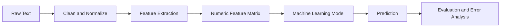
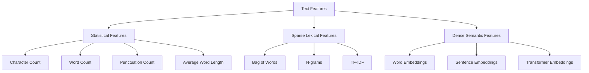
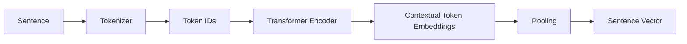
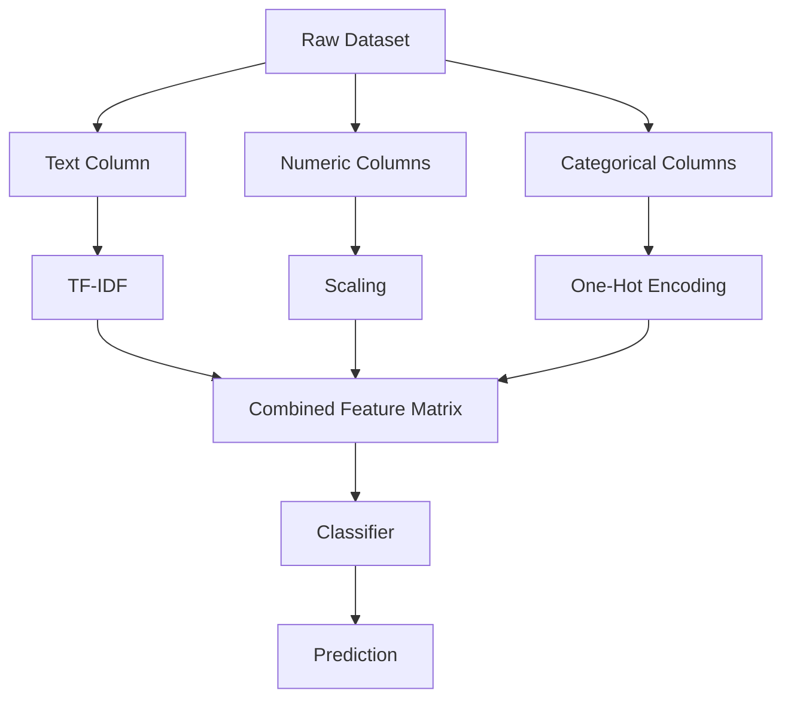
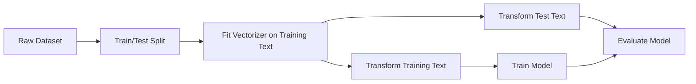
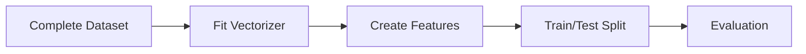
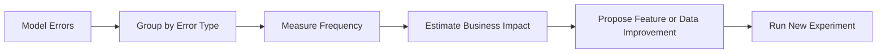
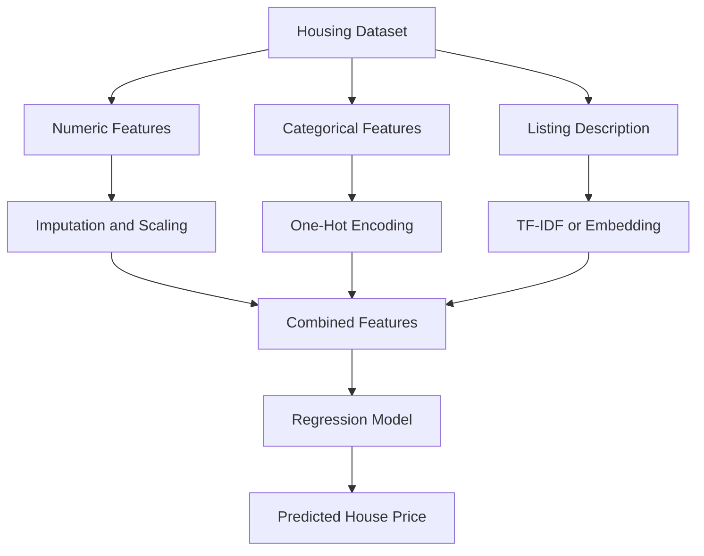
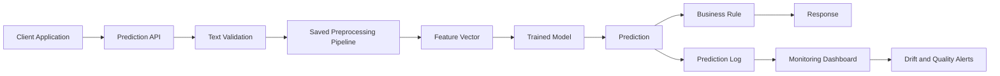

# 031 - Text Features

**Course:** 03 - Machine Learning and Deep Learning
**Module:** Module 06 - Machine Learning
**Content Group:** Feature Engineering
**Roadmap Source:** Machine Learning / Feature Engineering
**Lesson Type:** Machine Learning
**Order in Module:** 031
**Suggested Duration:** 26 minutes

---

## 1. Summary

This lesson explains **Text Features** in the context of AI and Data Science.

Machine learning models cannot directly process raw sentences, reviews, emails, or documents. Text must first be transformed into numerical representations called **text features**.

Common text feature techniques include:

* Text length and word-count features
* Bag of Words
* N-grams
* TF-IDF
* Word embeddings
* Sentence and document embeddings

After this lesson, you should understand:

* How raw text is converted into numerical features
* Which text representation works for different problems
* How to build a text-classification pipeline
* How to prevent data leakage during text preprocessing
* How to evaluate and improve text-based machine learning models

---

## 2. Learning Objectives

By the end of this lesson, you should be able to:

* Explain text features in your own words.
* Convert raw text into numerical features.
* Distinguish between Bag of Words, TF-IDF, n-grams, and embeddings.
* Build a baseline text-classification model.
* Use a machine learning pipeline to prevent leakage.
* Select appropriate metrics for a text-based business problem.
* Perform error analysis and propose new features.
* Produce a notebook, model, API, dashboard, or portfolio artifact using text data.

---

## 3. What Are Text Features?

**Text features** are numerical values extracted from raw text so that a machine learning model can process it.

For example, consider the following review:

```text
"The product is excellent and easy to use."
```

A machine learning model cannot directly interpret this sentence. It must be converted into a numeric vector:

```text
[0.0, 0.42, 0.31, 0.0, 0.56, ...]
```

Each value may represent:

* The presence of a word
* The frequency of a word
* The importance of a word
* The presence of a phrase
* A semantic property of the sentence
* A dense embedding dimension

### Basic Workflow



---

## 4. Why Text Feature Engineering Matters

The quality of text features strongly affects model performance.

Consider the following two customer messages:

```text
"The service was good."
"The service was not good."
```

A simple unigram model may treat the words independently:

```text
service
good
not
```

However, the phrase `"not good"` carries a meaning that differs from `"good"`.

An n-gram representation can preserve this local relationship:

```text
not good
```

Text feature engineering helps a model capture:

* Word occurrence
* Word importance
* Local context
* Negation
* Writing style
* Topic
* Sentiment
* Semantic similarity

However, better features must still improve the business objective rather than merely produce a higher offline score.

---

## 5. Types of Text Features

Text features can be divided into several categories.



---

## 6. Statistical Text Features

Before using complex representations, simple text statistics can provide useful signals.

Common statistical features include:

* Number of characters
* Number of words
* Number of unique words
* Number of sentences
* Average word length
* Number of uppercase characters
* Number of punctuation marks
* Number of question marks
* Number of exclamation marks
* Number of URLs
* Number of hashtags
* Number of mentions
* Percentage of numeric characters

### Example

```python
import pandas as pd

data = pd.DataFrame(
    {
        "text": [
            "Excellent product!",
            "Please contact me at example@email.com.",
            "THIS IS TERRIBLE!!!",
        ]
    }
)

data["character_count"] = data["text"].str.len()
data["word_count"] = data["text"].str.split().str.len()
data["unique_word_count"] = data["text"].apply(
    lambda text: len(set(text.lower().split()))
)
data["exclamation_count"] = data["text"].str.count("!")
data["uppercase_count"] = data["text"].apply(
    lambda text: sum(character.isupper() for character in text)
)

print(data)
```

These features may be useful for:

* Spam detection
* Toxic-comment classification
* Fake-review detection
* Customer-support routing
* Social-media analysis

### Important Limitation

Statistical features describe the form of the text, but they usually do not capture its complete meaning.

For example:

```text
"I love this product."
"I hate this product."
```

These sentences have similar lengths and structures but opposite meanings.

---

## 7. Text Preprocessing

Text preprocessing transforms raw text into a more consistent form.

Typical preprocessing operations include:

1. Converting text to lowercase
2. Removing unnecessary whitespace
3. Removing or replacing URLs
4. Removing HTML tags
5. Handling punctuation
6. Tokenization
7. Stop-word removal
8. Stemming
9. Lemmatization
10. Normalizing special symbols

### Example

```text
Raw text:
"This PRODUCT is amazing!!! Visit https://example.com"

Normalized text:
"this product is amazing visit URL"
```

### Basic Python Function

```python
import re


def normalize_text(text: str) -> str:
    """Apply basic normalization to a text string."""
    text = text.lower()
    text = re.sub(r"https?://\S+|www\.\S+", " URL ", text)
    text = re.sub(r"<.*?>", " ", text)
    text = re.sub(r"\s+", " ", text)
    return text.strip()


sample = "This PRODUCT is amazing!!! Visit https://example.com"
print(normalize_text(sample))
```

### Do Not Clean Text Blindly

Some information may be useful for the prediction task.

For example:

* Exclamation marks may signal strong sentiment.
* Uppercase text may indicate anger or spam.
* URLs may be important in phishing detection.
* Emojis may carry sentiment.
* Punctuation may help identify writing style.
* Stop words may help detect negation.

The preprocessing strategy should depend on the business problem.

---

## 8. Tokenization

**Tokenization** divides text into smaller units called tokens.

### Word Tokenization

```text
Input:
"Machine learning is useful."

Tokens:
["Machine", "learning", "is", "useful"]
```

### Character Tokenization

```text
Input:
"data"

Tokens:
["d", "a", "t", "a"]
```

### Subword Tokenization

```text
Input:
"unbelievable"

Possible subword tokens:
["un", "believ", "able"]
```

Subword tokenization is widely used by transformer models because it:

* Handles unknown words
* Represents rare words efficiently
* Supports multiple languages
* Reduces vocabulary size

---

## 9. Bag of Words

**Bag of Words**, or **BoW**, represents a document using the frequency or presence of words.

It ignores:

* Word order
* Grammar
* Long-range context

Consider three documents:

```text
D1: "machine learning"
D2: "deep learning"
D3: "machine learning model"
```

The vocabulary is:

```text
["deep", "learning", "machine", "model"]
```

The Bag-of-Words matrix becomes:

| Document | deep | learning | machine | model |
| -------- | ---: | -------: | ------: | ----: |
| D1       |    0 |        1 |       1 |     0 |
| D2       |    1 |        1 |       0 |     0 |
| D3       |    0 |        1 |       1 |     1 |

### Scikit-Learn Example

```python
from sklearn.feature_extraction.text import CountVectorizer

documents = [
    "machine learning",
    "deep learning",
    "machine learning model",
]

vectorizer = CountVectorizer()
feature_matrix = vectorizer.fit_transform(documents)

print(vectorizer.get_feature_names_out())
print(feature_matrix.toarray())
```

### Binary Bag of Words

Instead of storing word frequency, binary Bag of Words records only whether the word appears.

```python
vectorizer = CountVectorizer(binary=True)
```

### Advantages

* Simple and fast
* Easy to interpret
* Effective for many classification problems
* Works well with linear models
* Provides a strong baseline

### Limitations

* Produces high-dimensional sparse matrices
* Ignores semantic similarity
* Ignores most word order
* Gives common and rare words similar treatment
* Cannot naturally understand context

---

## 10. N-Grams

An **n-gram** is a sequence of (n) consecutive tokens.

### Unigrams

```text
"not good"

Unigrams:
["not", "good"]
```

### Bigrams

```text
Bigrams:
["not good"]
```

### Trigrams

```text
"the product is excellent"

Trigrams:
["the product is", "product is excellent"]
```

### Why N-Grams Are Useful

N-grams can capture short phrases and local context.

For sentiment analysis:

```text
"good"
"not good"
"very good"
```

These expressions should not always be treated as equivalent.

### Scikit-Learn Example

```python
from sklearn.feature_extraction.text import CountVectorizer

documents = [
    "the product is good",
    "the product is not good",
]

vectorizer = CountVectorizer(ngram_range=(1, 2))
feature_matrix = vectorizer.fit_transform(documents)

print(vectorizer.get_feature_names_out())
```

The parameter:

```python
ngram_range=(1, 2)
```

means that the vectorizer creates both:

* Unigrams
* Bigrams

### Character N-Grams

Character n-grams split text into sequences of characters.

For example:

```text
word: "model"
character trigrams:
["mod", "ode", "del"]
```

Character n-grams are useful for:

* Typo-resistant classification
* Language identification
* Author identification
* Spam detection
* Morphologically rich languages
* Product-name matching

```python
vectorizer = CountVectorizer(
    analyzer="char",
    ngram_range=(3, 5),
)
```

### N-Gram Trade-Off

Larger n-grams capture more context but create:

* More features
* Greater memory usage
* Increased sparsity
* Higher overfitting risk

---

## 11. TF-IDF

**TF-IDF** stands for:

> Term Frequency–Inverse Document Frequency

It gives high weight to words that:

* Appear frequently in a particular document
* Are relatively uncommon across the entire document collection

### Term Frequency

For a term (t) in document (d):

$$
TF(t,d) = \frac{\text{Number of occurrences of }t\text{ in }d} {\text{Total number of terms in }d}
$$

### Inverse Document Frequency

For (N) documents:

$$
IDF(t) = \log\left( \frac{N}{DF(t)} \right)
$$

where (DF(t)) is the number of documents containing term (t).

A smoothed implementation commonly uses:

$$
IDF(t) = \log\left( \frac{1 + N}{1 + DF(t)} \right) + 1
$$

### TF-IDF Score

$$
TFIDF(t,d) = TF(t,d) \times IDF(t)
$$

### Intuition

Suppose the word `"product"` appears in nearly every review. It provides limited information.

A rarer word such as `"defective"` may be much more useful for predicting a complaint.

TF-IDF reduces the influence of very common terms and highlights more distinctive terms.

### Scikit-Learn Example

```python
from sklearn.feature_extraction.text import TfidfVectorizer

documents = [
    "the product is excellent",
    "the product is defective",
    "the service is excellent",
]

vectorizer = TfidfVectorizer(
    ngram_range=(1, 2),
    min_df=1,
    max_df=0.95,
)

feature_matrix = vectorizer.fit_transform(documents)

print(vectorizer.get_feature_names_out())
print(feature_matrix.toarray())
```

### Important Parameters

| Parameter      | Meaning                                             |
| -------------- | --------------------------------------------------- |
| `ngram_range`  | Controls unigram, bigram, or larger phrase features |
| `min_df`       | Ignores terms that appear in too few documents      |
| `max_df`       | Ignores terms that appear in too many documents     |
| `max_features` | Limits vocabulary size                              |
| `sublinear_tf` | Replaces raw frequency with logarithmic frequency   |
| `stop_words`   | Removes selected common words                       |
| `analyzer`     | Chooses word or character features                  |

Example:

```python
vectorizer = TfidfVectorizer(
    ngram_range=(1, 2),
    min_df=3,
    max_df=0.90,
    max_features=20_000,
    sublinear_tf=True,
)
```

---

## 12. Sparse and Dense Text Features

Bag of Words and TF-IDF usually produce **sparse vectors**.

For example:

```text
[0, 0, 0.61, 0, 0, 0.42, 0, ...]
```

Most values are zero because each document uses only a small portion of the full vocabulary.

Embeddings produce **dense vectors**:

```text
[0.12, -0.34, 0.89, 0.07, -0.16, ...]
```

Most dimensions contain non-zero values.

### Comparison

| Representation             | Vector Type      | Captures Semantics | Interpretability | Typical Models                   |
| -------------------------- | ---------------- | -----------------: | ---------------: | -------------------------------- |
| Bag of Words               | Sparse           |                Low |             High | Naive Bayes, Logistic Regression |
| TF-IDF                     | Sparse           |            Limited |             High | Logistic Regression, Linear SVM  |
| Word Embedding             | Dense            |           Moderate |            Lower | Neural networks                  |
| Sentence Embedding         | Dense            |               High |            Lower | Similarity search, classifiers   |
| Transformer Representation | Dense/contextual |               High |              Low | Fine-tuned transformers          |

---

## 13. Word Embeddings

A **word embedding** represents each word as a dense vector.

Words with similar meanings are expected to have similar vectors.

Conceptually:

```text
vector("king")   ≈ [0.21, -0.41, 0.72, ...]
vector("queen")  ≈ [0.19, -0.38, 0.75, ...]
vector("banana") ≈ [-0.52, 0.11, -0.08, ...]
```

The vectors for `"king"` and `"queen"` may be closer than the vectors for `"king"` and `"banana"`.

Popular embedding approaches include:

* Word2Vec
* GloVe
* FastText

### Limitation of Static Word Embeddings

A static embedding gives one vector to each word, regardless of context.

For example, the word `"bank"` has different meanings in:

```text
"I deposited money at the bank."
"We sat beside the river bank."
```

A static embedding may use the same vector for both occurrences.

---

## 14. Contextual Embeddings

Transformer models generate representations based on surrounding words.

Therefore, `"bank"` can receive different vectors depending on context.

Examples of transformer-based models include:

* BERT
* RoBERTa
* DeBERTa
* DistilBERT
* Sentence Transformers

### Conceptual Workflow



Contextual embeddings are useful for:

* Semantic search
* Text similarity
* Duplicate detection
* Intent classification
* Clustering
* Recommendation systems
* Retrieval-augmented generation

### Trade-Off

Transformer embeddings often capture meaning better than TF-IDF, but they generally require:

* More computation
* More memory
* More complex deployment
* Careful model selection
* Monitoring for latency and model drift

A TF-IDF baseline should often be tested before adopting a transformer model.

---

## 15. Combining Text and Structured Features

Many real-world datasets contain both text and tabular data.

For example, a customer-support dataset may contain:

| Feature                    | Type        |
| -------------------------- | ----------- |
| Message text               | Text        |
| Customer plan              | Categorical |
| Account age                | Numeric     |
| Number of previous tickets | Numeric     |
| Country                    | Categorical |
| Ticket priority            | Target      |

A strong model can combine:

* TF-IDF features from the message
* One-hot encoded categorical features
* Scaled numerical features
* Statistical text features

### Conceptual Pipeline



### Scikit-Learn Example

```python
from sklearn.compose import ColumnTransformer
from sklearn.feature_extraction.text import TfidfVectorizer
from sklearn.linear_model import LogisticRegression
from sklearn.pipeline import Pipeline
from sklearn.preprocessing import OneHotEncoder, StandardScaler

preprocessor = ColumnTransformer(
    transformers=[
        ("text", TfidfVectorizer(ngram_range=(1, 2)), "message"),
        ("numeric", StandardScaler(), ["account_age", "previous_tickets"]),
        (
            "categorical",
            OneHotEncoder(handle_unknown="ignore"),
            ["customer_plan", "country"],
        ),
    ]
)

model = Pipeline(
    steps=[
        ("preprocessor", preprocessor),
        (
            "classifier",
            LogisticRegression(
                max_iter=1_000,
                class_weight="balanced",
            ),
        ),
    ]
)
```

---

## 16. End-to-End Text Classification Example

Suppose we want to classify reviews as:

* Positive
* Negative

### Step 1: Prepare the Dataset

```python
import pandas as pd

data = pd.DataFrame(
    {
        "text": [
            "I love this product",
            "Excellent quality and fast delivery",
            "This is terrible",
            "The item stopped working after one day",
            "Very useful and easy to use",
            "I want a refund",
        ],
        "label": [
            "positive",
            "positive",
            "negative",
            "negative",
            "positive",
            "negative",
        ],
    }
)
```

### Step 2: Split the Data

The split must happen **before fitting the vectorizer**.

```python
from sklearn.model_selection import train_test_split

X_train, X_test, y_train, y_test = train_test_split(
    data["text"],
    data["label"],
    test_size=0.33,
    random_state=42,
    stratify=data["label"],
)
```

### Step 3: Build a Pipeline

```python
from sklearn.feature_extraction.text import TfidfVectorizer
from sklearn.linear_model import LogisticRegression
from sklearn.pipeline import Pipeline

pipeline = Pipeline(
    steps=[
        (
            "tfidf",
            TfidfVectorizer(
                ngram_range=(1, 2),
                lowercase=True,
                min_df=1,
            ),
        ),
        (
            "classifier",
            LogisticRegression(
                max_iter=1_000,
            ),
        ),
    ]
)
```

### Step 4: Train the Model

```python
pipeline.fit(X_train, y_train)
```

### Step 5: Evaluate the Model

```python
from sklearn.metrics import classification_report

predictions = pipeline.predict(X_test)

print(classification_report(y_test, predictions))
```

### Step 6: Predict New Examples

```python
new_reviews = [
    "The product is fantastic",
    "It broke immediately",
]

predictions = pipeline.predict(new_reviews)

for review, prediction in zip(new_reviews, predictions):
    print(f"{review!r} -> {prediction}")
```

---

## 17. Why Pipelines Are Important

A machine learning pipeline ensures that the same transformations are applied during:

* Training
* Validation
* Testing
* Production inference

Without a pipeline, preprocessing inconsistencies can cause:

* Data leakage
* Incorrect evaluation
* Feature-order problems
* Missing-vocabulary errors
* Training-serving skew

### Correct Workflow



### Incorrect Workflow



The incorrect workflow allows the vocabulary and document statistics of the test set to influence feature creation.

---

## 18. Data Leakage in Text Features

Data leakage occurs when information unavailable at prediction time influences training.

### Leakage Example 1: Fitting TF-IDF Before Splitting

Incorrect:

```python
X_all = vectorizer.fit_transform(data["text"])
X_train, X_test, y_train, y_test = train_test_split(
    X_all,
    data["label"],
)
```

The vectorizer has already seen the test documents.

Correct:

```python
X_train, X_test, y_train, y_test = train_test_split(
    data["text"],
    data["label"],
)

pipeline.fit(X_train, y_train)
```

### Leakage Example 2: Duplicated Text

The same review may appear in both training and test sets.

This can produce unrealistically high evaluation scores.

### Leakage Example 3: Template or Source Leakage

Suppose complaint messages are generated by a template containing:

```text
"Complaint category:"
```

If only positive or negative examples use that template, the model may learn the template rather than the real meaning.

### Leakage Example 4: Future Information

A fraud-detection model may include text written after fraud was confirmed.

Such text is unavailable when the original prediction must be made.

### Leakage Example 5: User-Level Leakage

Messages from the same customer may appear in both training and test sets.

The model may memorize customer-specific language.

A group-based split may be more appropriate:

```python
from sklearn.model_selection import GroupShuffleSplit
```

---

## 19. Baseline Models for Text Data

Always establish a baseline before using a complex model.

Useful text-classification baselines include:

1. Majority-class prediction
2. Keyword rules
3. Bag of Words with Naive Bayes
4. TF-IDF with Logistic Regression
5. TF-IDF with Linear SVM

### Common Combinations

| Features           | Model                   | Typical Use                       |
| ------------------ | ----------------------- | --------------------------------- |
| Word counts        | Multinomial Naive Bayes | Fast baseline                     |
| TF-IDF             | Logistic Regression     | Interpretable classification      |
| TF-IDF             | Linear SVM              | Strong sparse-text baseline       |
| Character TF-IDF   | Logistic Regression     | Noisy text and spelling variation |
| Embeddings         | Logistic Regression     | Semantic baseline                 |
| Transformer tokens | Fine-tuned transformer  | Complex contextual tasks          |

### Naive Bayes Example

```python
from sklearn.feature_extraction.text import CountVectorizer
from sklearn.naive_bayes import MultinomialNB
from sklearn.pipeline import Pipeline

naive_bayes_model = Pipeline(
    steps=[
        ("vectorizer", CountVectorizer(ngram_range=(1, 2))),
        ("classifier", MultinomialNB()),
    ]
)
```

### Linear SVM Example

```python
from sklearn.feature_extraction.text import TfidfVectorizer
from sklearn.pipeline import Pipeline
from sklearn.svm import LinearSVC

svm_model = Pipeline(
    steps=[
        (
            "vectorizer",
            TfidfVectorizer(
                ngram_range=(1, 2),
                sublinear_tf=True,
            ),
        ),
        ("classifier", LinearSVC()),
    ]
)
```

---

## 20. Evaluation Metrics

The correct metric depends on the business problem.

### Accuracy

$$
Accuracy = \frac{\text{Number of Correct Predictions}} {\text{Total Number of Predictions}}
$$

Accuracy is useful when classes are relatively balanced and errors have similar costs.

### Precision

$$
Precision = \frac{TP}{TP + FP}
$$

Precision answers:

> Of all samples predicted as positive, how many were truly positive?

Use precision when false positives are expensive.

Example:

* Marking legitimate email as spam

### Recall

$$
Recall = \frac{TP}{TP + FN}
$$

Recall answers:

> Of all real positive samples, how many did the model detect?

Use recall when false negatives are expensive.

Example:

* Missing a dangerous customer complaint
* Missing a fraudulent message

### F1-Score

$$
F1 = 2 \times \frac{Precision \times Recall} {Precision + Recall}
$$

F1-score balances precision and recall.

### Additional Metrics

Depending on the task, also consider:

* Macro F1
* Weighted F1
* ROC-AUC
* PR-AUC
* Log loss
* Top-(k) accuracy
* Mean reciprocal rank
* Recall@(k)

### Business-Level Metrics

Offline model metrics should be connected to real outcomes.

Examples:

* Percentage of support tickets routed correctly
* Reduction in manual review time
* Number of urgent complaints detected
* Spam incorrectly blocked
* Customer response time
* Search click-through rate

---

## 21. Feature Selection and Vocabulary Control

Text representations can create hundreds of thousands of features.

Uncontrolled vocabulary size can increase:

* Memory usage
* Training time
* Inference latency
* Overfitting risk

Useful controls include:

### Minimum Document Frequency

Ignore terms appearing in too few documents:

```python
TfidfVectorizer(min_df=3)
```

### Maximum Document Frequency

Ignore terms appearing in too many documents:

```python
TfidfVectorizer(max_df=0.95)
```

### Maximum Number of Features

```python
TfidfVectorizer(max_features=20_000)
```

### Regularization

Linear models can reduce reliance on weak features.

```python
LogisticRegression(
    C=1.0,
    penalty="l2",
)
```

A smaller `C` applies stronger regularization.

### Explicit Feature Selection

```python
from sklearn.feature_selection import SelectKBest, chi2

selector = SelectKBest(
    score_func=chi2,
    k=10_000,
)
```

---

## 22. Word-Level vs. Character-Level Features

### Word-Level Features

Example:

```text
"machine learning"
```

Word features:

```text
machine
learning
machine learning
```

Advantages:

* More interpretable
* Better semantic meaning
* Strong for clean, well-written text

Limitations:

* Sensitive to spelling errors
* Weak for unseen words
* Vocabulary can become large

### Character-Level Features

Character trigrams for `"model"`:

```text
mod
ode
del
```

Advantages:

* Handles misspellings
* Handles prefixes and suffixes
* Works well with usernames, URLs, and product codes
* Useful for multilingual and noisy text

Limitations:

* Less interpretable
* Creates many features
* May require more computation

### Combining Both

A model can combine word-level and character-level TF-IDF features.

```python
from sklearn.pipeline import FeatureUnion, Pipeline
from sklearn.feature_extraction.text import TfidfVectorizer
from sklearn.linear_model import LogisticRegression

combined_features = FeatureUnion(
    transformer_list=[
        (
            "word_features",
            TfidfVectorizer(
                analyzer="word",
                ngram_range=(1, 2),
                min_df=2,
            ),
        ),
        (
            "character_features",
            TfidfVectorizer(
                analyzer="char_wb",
                ngram_range=(3, 5),
                min_df=2,
            ),
        ),
    ]
)

model = Pipeline(
    steps=[
        ("features", combined_features),
        ("classifier", LogisticRegression(max_iter=1_000)),
    ]
)
```

---

## 23. Handling Stop Words

Stop words are frequently occurring words such as:

```text
the
is
and
of
to
```

Removing stop words can reduce dimensionality, but it is not always beneficial.

For example:

```text
"This product is good."
"This product is not good."
```

Removing `"not"` would destroy an important sentiment signal.

Use stop-word removal only after validating its effect.

```python
vectorizer = TfidfVectorizer(
    stop_words="english",
)
```

For domain-specific applications, a custom stop-word list may be more appropriate.

---

## 24. Stemming and Lemmatization

### Stemming

Stemming removes word endings using simple rules.

```text
connected
connecting
connection
```

Possible stem:

```text
connect
```

Stemming is fast but may produce invalid words.

### Lemmatization

Lemmatization converts a word into its dictionary base form.

```text
running -> run
better  -> good
cars    -> car
```

Lemmatization is usually more linguistically accurate but more computationally expensive.

### When They Help

Stemming or lemmatization may help when:

* The dataset is small
* Vocabulary size is large
* Word forms contain similar meaning
* Interpretability matters

They may be unnecessary when using:

* Character n-grams
* Subword tokenization
* Transformer models

---

## 25. Error Analysis

A model score alone does not explain why a model fails.

Create an error-analysis table:

| Text                                 | True Label | Prediction | Confidence | Error Category    |
| ------------------------------------ | ---------- | ---------- | ---------: | ----------------- |
| "Great, another broken update."      | Negative   | Positive   |       0.81 | Sarcasm           |
| "Not bad at all."                    | Positive   | Negative   |       0.73 | Negation          |
| "Refund processed successfully."     | Neutral    | Positive   |       0.62 | Keyword confusion |
| "Works well but delivery was awful." | Mixed      | Positive   |       0.69 | Mixed sentiment   |

### Common Text Error Categories

* Negation
* Sarcasm
* Mixed sentiment
* Domain-specific vocabulary
* Rare words
* Misspellings
* Very short text
* Very long text
* Multiple languages
* Label noise
* Ambiguous examples
* Out-of-domain examples
* Duplicated templates
* Incorrect preprocessing

### Error-Analysis Workflow



---

## 26. Experiment Ideas

After building a baseline, compare controlled experiments.

| Experiment | Feature Representation  | Model                 | Purpose                  |
| ---------- | ----------------------- | --------------------- | ------------------------ |
| E1         | Unigrams                | Logistic Regression   | Baseline                 |
| E2         | Unigrams + Bigrams      | Logistic Regression   | Capture phrases          |
| E3         | Word TF-IDF             | Linear SVM            | Strong sparse model      |
| E4         | Character TF-IDF        | Logistic Regression   | Handle noisy text        |
| E5         | Word + Character TF-IDF | Linear SVM            | Combined representation  |
| E6         | Sentence Embeddings     | Logistic Regression   | Add semantic information |
| E7         | Transformer             | Fine-tuned classifier | Capture context          |

Change one major variable at a time so the experiment remains interpretable.

---

## 27. Common Mistakes

### 27.1 Fitting the Vectorizer on All Data

This leaks vocabulary and document-frequency information from the test set.

Use a pipeline and fit only on training data.

---

### 27.2 Using Only Accuracy on Imbalanced Data

A spam classifier may achieve 98% accuracy by predicting every message as legitimate.

Use precision, recall, F1-score, and PR-AUC when appropriate.

---

### 27.3 Removing Important Tokens

Blindly removing stop words, punctuation, or emojis may destroy useful information.

---

### 27.4 Ignoring Duplicates

Duplicated messages across training and test sets can produce misleading scores.

---

### 27.5 Using an Extremely Large Vocabulary

A massive vocabulary can increase memory usage and overfitting.

Use `min_df`, `max_df`, `max_features`, and regularization.

---

### 27.6 Using a Complex Model Without a Baseline

A transformer should be compared against a simpler baseline such as:

```text
TF-IDF + Logistic Regression
```

A simpler model may be:

* Faster
* Cheaper
* Easier to interpret
* Easier to deploy
* Sufficient for the business requirement

---

### 27.7 Ignoring Text Source Leakage

The model may learn:

* Author names
* Website templates
* Product identifiers
* Data-source formatting
* Label-specific boilerplate

instead of learning the real task.

---

### 27.8 Applying Random Splits to Time-Based Data

For news, support tickets, or social posts, a random split may mix past and future data.

A time-based split may better simulate production:

```text
Train: January–September
Validation: October
Test: November–December
```

---

### 27.9 Ignoring Production Constraints

A model with slightly higher F1-score may still be unsuitable if it has:

* High latency
* Excessive memory usage
* Expensive inference
* Difficult deployment requirements
* Poor interpretability

---

## 28. Practical Exercise

### Task: Customer Review Sentiment Classification

Build a classifier that predicts whether a customer review is positive or negative.

### Dataset Requirements

Your dataset should contain at least:

```text
review_text
sentiment_label
```

Optional columns:

```text
product_category
review_length
customer_region
review_date
```

### Steps

1. Load and inspect the dataset.
2. Check class balance.
3. Remove exact duplicates.
4. Split the data into training, validation, and test sets.
5. Build a majority-class baseline.
6. Train a Bag-of-Words model.
7. Train a TF-IDF model.
8. Compare Logistic Regression and Linear SVM.
9. Evaluate precision, recall, and F1-score.
10. Inspect at least 20 incorrect predictions.
11. Group errors into categories.
12. Propose one new feature or data improvement.
13. Record experiment settings and results.

### Suggested Experiment Table

| Experiment | Features                | Model               | Validation F1 | Test F1 | Notes                |
| ---------- | ----------------------- | ------------------- | ------------: | ------: | -------------------- |
| Baseline   | None                    | Majority class      |          0.00 |    0.00 | Reference            |
| E1         | Word counts             | Naive Bayes         |          0.00 |    0.00 | Fast baseline        |
| E2         | Word TF-IDF             | Logistic Regression |          0.00 |    0.00 | Interpretable        |
| E3         | Word TF-IDF             | Linear SVM          |          0.00 |    0.00 | Strong sparse model  |
| E4         | Character TF-IDF        | Logistic Regression |          0.00 |    0.00 | Handles misspellings |
| E5         | Word + Character TF-IDF | Linear SVM          |          0.00 |    0.00 | Combined features    |

---

## 29. Mini Project Extension

The related roadmap project is:

> **House Price Prediction with EDA, feature engineering, Linear Regression, Random Forest, and XGBoost comparison.**

Text features can extend this project when the housing dataset contains fields such as:

* Property description
* Neighborhood description
* Listing title
* Agent notes
* Amenity text

### Example Features

From this listing:

```text
"Modern two-bedroom apartment near the city center with a balcony."
```

You could extract:

* TF-IDF features
* Description length
* Number of rooms mentioned
* Presence of `"balcony"`
* Presence of `"city center"`
* Presence of luxury-related terms
* Sentence embedding

### Combined Prediction Workflow



For tree-based models, high-dimensional sparse TF-IDF features may require careful experimentation. Linear models often provide a useful baseline for combined text and structured data.

---

## 30. Deployment Considerations

A production text model must preserve the complete preprocessing pipeline.

Save the pipeline rather than saving only the classifier.

```python
import joblib

joblib.dump(
    pipeline,
    "sentiment_pipeline.joblib",
)
```

Load it for inference:

```python
loaded_pipeline = joblib.load(
    "sentiment_pipeline.joblib"
)

prediction = loaded_pipeline.predict(
    ["The product is easy to use."]
)

print(prediction)
```

### Example API

```python
from fastapi import FastAPI
from pydantic import BaseModel
import joblib

app = FastAPI()

model = joblib.load("sentiment_pipeline.joblib")


class PredictionRequest(BaseModel):
    text: str


@app.post("/predict")
def predict(request: PredictionRequest) -> dict[str, str]:
    prediction = model.predict([request.text])[0]

    return {
        "text": request.text,
        "prediction": str(prediction),
    }
```

### Monitor in Production

Track:

* Prediction distribution
* Class frequency
* Text length distribution
* Unknown or rare vocabulary
* Language distribution
* Latency
* Error rate
* User feedback
* Data drift
* Performance by customer segment

---

## 31. Production Architecture



The system should also handle:

* Empty text
* Extremely long text
* Unsupported languages
* HTML or script input
* Sensitive information
* Unexpected encodings
* Adversarial or spam input

---

## 32. Completion Checklist

* [ ] I can explain **Text Features** in one or two minutes.
* [ ] I understand why machine learning models require numerical text representations.
* [ ] I can create statistical text features.
* [ ] I can explain Bag of Words.
* [ ] I can explain TF-IDF and its intuition.
* [ ] I can use word and character n-grams.
* [ ] I understand the difference between sparse features and embeddings.
* [ ] I can build a text-classification pipeline.
* [ ] I fit the vectorizer only on training data.
* [ ] I have compared the model with a simple baseline.
* [ ] I have selected metrics based on the business objective.
* [ ] I have performed error analysis.
* [ ] I have recorded at least one caveat or assumption.
* [ ] I have created a notebook, model, API, chart, or portfolio note for this lesson.

---

## 33. Key Questions to Ask

Before finalizing a text model, ask:

1. What business question does the text model answer?
2. What information is available at prediction time?
3. Are duplicated texts present across dataset splits?
4. Should the split be random, grouped, or time-based?
5. Are word-level or character-level features more appropriate?
6. Does the model need semantic understanding?
7. Which error is more expensive: false positive or false negative?
8. Does the complex model outperform a TF-IDF baseline meaningfully?
9. Can the same preprocessing pipeline run in production?
10. How will data drift and model quality be monitored?

---

## 34. Related Outcome

This lesson supports the following outcome:

> Train, compare, and evaluate supervised and unsupervised machine learning models using thoughtful feature engineering.

Text features are especially relevant to:

* Sentiment analysis
* Spam detection
* Topic classification
* Intent detection
* Customer-support routing
* Document clustering
* Semantic search
* Recommendation systems
* Information retrieval
* Fraud and abuse detection

---

## 35. Summary

**Text Features** transform raw language into numerical representations that machine learning models can process.

The most important ideas are:

* Start with simple statistical features and a strong baseline.
* Use Bag of Words or TF-IDF for interpretable sparse representations.
* Use n-grams to capture short phrases and local context.
* Use character features for noisy text and spelling variation.
* Use embeddings when semantic similarity and contextual meaning are important.
* Split the data before fitting the vectorizer.
* Keep preprocessing and modeling inside a single pipeline.
* Select metrics according to the business cost of errors.
* Perform error analysis instead of relying only on a single score.
* Prefer the simplest model that satisfies performance, latency, cost, and deployment requirements.

A practical learning artifact could be:

* A sentiment-analysis notebook
* A spam-detection model
* A customer-support routing API
* A semantic-search demonstration
* A text-clustering dashboard
* A Dockerized text-classification service
* A portfolio report comparing TF-IDF and embedding-based models
