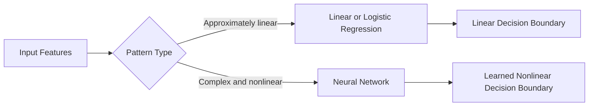
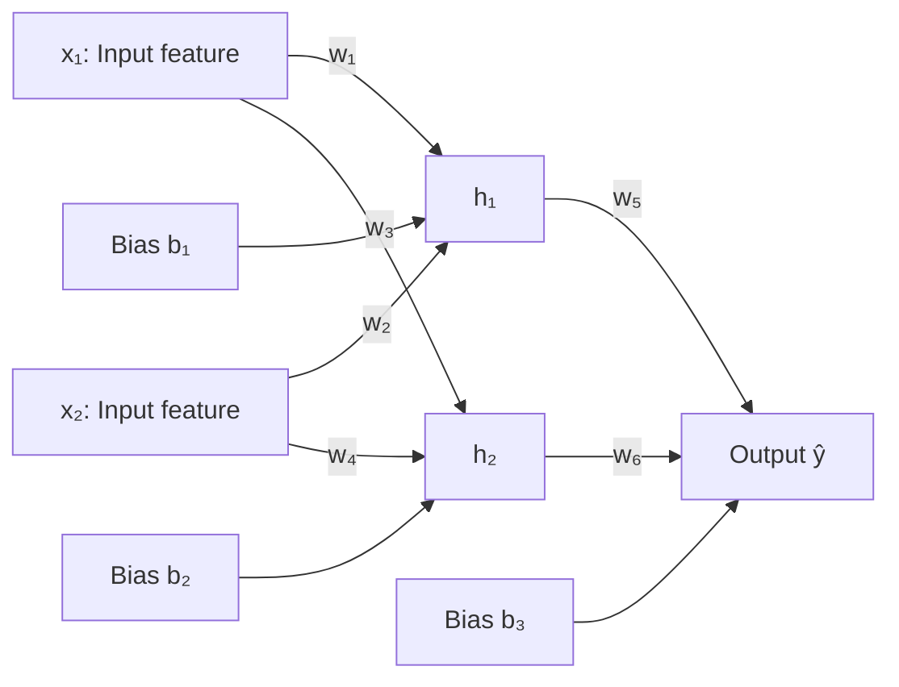
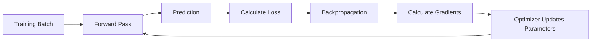
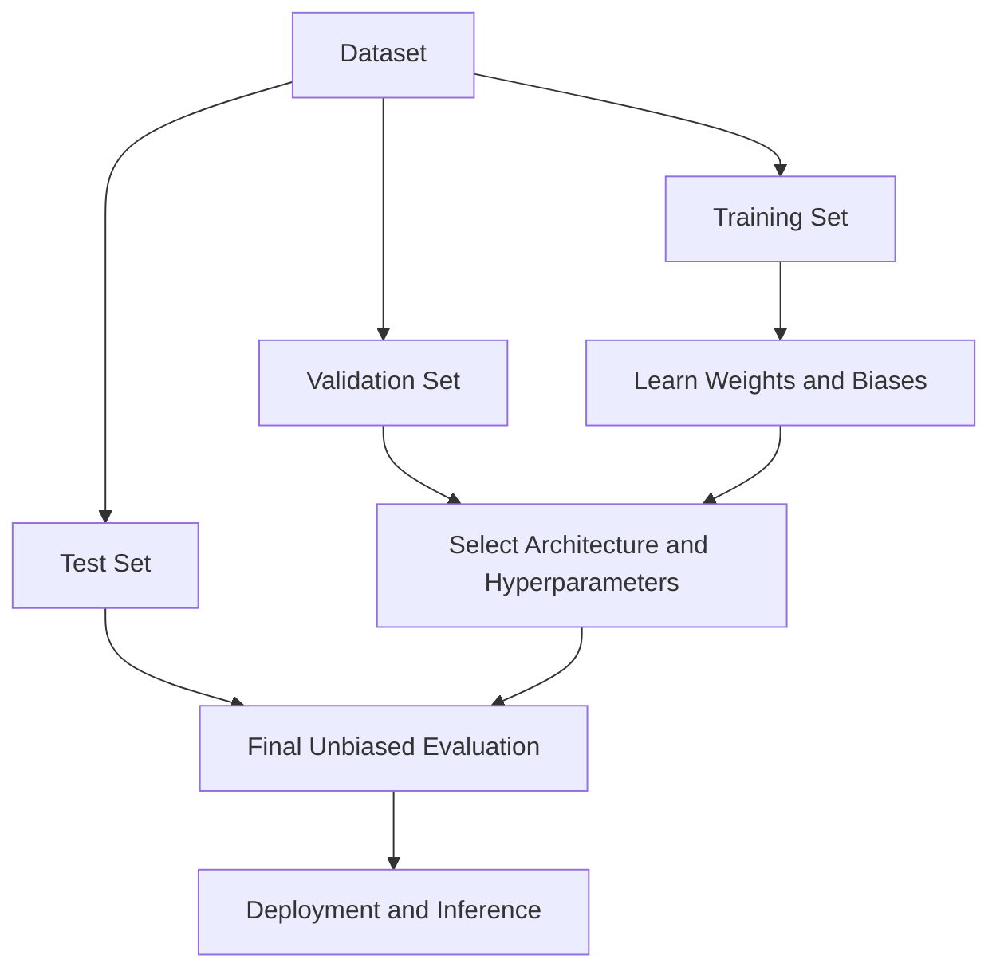
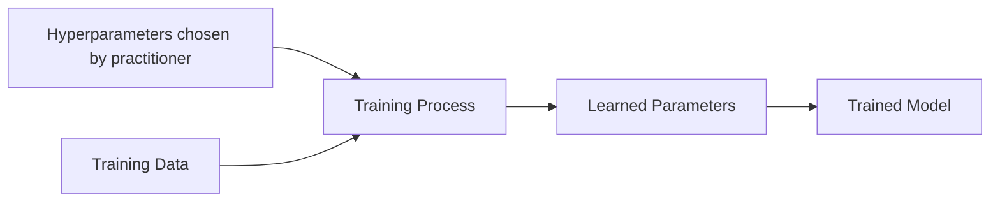

# 001 — Neural Network Basics

**Course:** 03 — Machine Learning and Deep Learning
**Module:** Module 07 — Deep Learning
**Content group:** Neural Network Basics
**Roadmap source:** Deep Learning / Neural Network Basics
**Lesson type:** Deep Learning
**Order in module:** 001
**Suggested duration:** 24 minutes

---

## 1. Summary

A **neural network** is a machine learning model made of interconnected computational units called **neurons** or **nodes**.

Each neuron:

1. Receives input values.
2. Multiplies them by learned weights.
3. Adds a bias.
4. Applies an activation function.
5. Passes the result to the next layer.

By stacking many neurons and layers, a neural network can learn complex, nonlinear relationships between inputs and outputs.

A neural network can be viewed as a parameterized function:

$$
\hat{y} = f(X; W, b)
$$

where:

* (X) is the input data.
* (W) represents the weights.
* (b) represents the biases.
* (\hat{y}) is the model prediction.

Neural networks are especially useful when the relationship between features and labels cannot be represented well by a simple linear function. 

---

## 2. Learning Objectives

After completing this lesson, you should be able to:

* Explain why neural networks are useful for nonlinear problems.
* Identify the input, hidden, and output layers of a neural network.
* Explain the roles of neurons, weights, biases, and activation functions.
* Perform a simple neural network forward pass.
* Describe how loss, backpropagation, and gradient descent train a network.
* Recognize common neural-network architectures.
* Understand how neural networks perform binary and multiclass classification.
* Identify overfitting from training and validation curves.
* Build and evaluate a small neural network.

---

## 3. Prerequisites

This lesson assumes familiarity with:

* Linear regression
* Logistic regression
* Classification
* Numerical and categorical features
* Training, validation, and test sets
* Loss functions
* Gradient descent
* Matrix multiplication
* Overfitting and generalization

---

## 4. Why Do We Need Neural Networks?

A linear model makes predictions using an expression such as:

$$
\hat{y} = w_1x_1 + w_2x_2 + b
$$

Its decision boundary is linear.

For some datasets, a straight line or plane is sufficient. However, many real-world patterns are nonlinear.

Examples include:

* Handwritten digit recognition
* Image classification
* Speech recognition
* Fraud detection
* Machine translation
* Medical-image analysis
* Time-series forecasting

### Linear versus nonlinear classification



Feature engineering can sometimes make nonlinear patterns easier for a linear model. For example, adding (x_1x_2) as a feature may help solve a particular nonlinear problem.

However, manually discovering all useful feature crosses becomes difficult when:

* There are many features.
* Interactions are complicated.
* Inputs are images, audio, or text.
* Important representations are not obvious.

Neural networks can learn useful transformations and feature interactions automatically during training.

---

## 5. Neural Network Architecture

A basic feedforward neural network contains three types of layers.

### 5.1 Input Layer

The input layer receives the original features.

For example:

$$
X = \begin{bmatrix} x_1 \ x_2 \end{bmatrix} = \begin{bmatrix} \text{weight} \ \text{height} \end{bmatrix}
$$

The input layer does not normally perform learning. It passes the feature values to the first hidden layer.

### 5.2 Hidden Layers

Hidden layers perform learned transformations.

Each hidden neuron receives information from the previous layer and produces a new representation.

Early hidden layers may detect simple patterns, while deeper layers can combine them into more abstract patterns.

For handwritten-digit recognition, a conceptual hierarchy might be:

```text
pixels → edges → curves → digit components → digit class
```

A classic digit-classification network can receive 784 pixel values from a (28 \times 28) image and produce 10 output values corresponding to digits (0) through (9). 

### 5.3 Output Layer

The output layer produces the final prediction.

The output structure depends on the task:

| Task                      |               Output layer | Common activation |
| ------------------------- | -------------------------: | ----------------- |
| Regression                | One or more numeric values | Linear            |
| Binary classification     |                  One value | Sigmoid           |
| Multiclass classification |        One value per class | Softmax           |
| Multilabel classification |        One value per label | Sigmoid           |

---

## 6. Basic Network Diagram



The network shown above contains:

* Two input features
* One hidden layer
* Two hidden neurons
* One output neuron
* Six connection weights
* Three biases

> The provided weight-and-height diagram predicts gender. It is useful for illustrating network connections, but it should not be treated as a valid real-world modeling task. Gender is a sensitive attribute and cannot be reliably determined from only height and weight.

---

## 7. How One Neuron Works

For a neuron with (n) inputs, the neuron first computes a weighted sum:

$$
z = \sum_{i=1}^{n} w_ix_i + b
$$

In vector form:

$$
z = W^TX + b
$$

The neuron then applies an activation function:

$$
a = \phi(z)
$$

where:

* (x_i): input value
* (w_i): weight associated with the input
* (b): bias
* (z): linear combination
* (\phi): activation function
* (a): neuron activation

### Numerical example

Suppose:

$$
x_1 = 2,\qquad x_2 = 3
$$

$$
w_1 = 0.5,\qquad w_2 = -0.2,\qquad b = 0.1
$$

The weighted sum is:

$$
z = (0.5)(2) + (-0.2)(3) + 0.1
$$

$$
z = 1 - 0.6 + 0.1 = 0.5
$$

Using ReLU:

$$
a = \max(0, z)
$$

$$
a = \max(0, 0.5) = 0.5
$$

The neuron outputs (0.5).

---

## 8. Weights and Biases

### 8.1 Weights

A weight controls how strongly one value affects a neuron.

* A large positive weight increases the neuron's activation.
* A large negative weight decreases the activation.
* A weight near zero means the input has little effect.

Weights are learned from data.

### 8.2 Biases

A bias shifts the neuron's activation threshold.

Without a bias:

$$
z = W^TX
$$

With a bias:

$$
z = W^TX + b
$$

The bias allows a neuron to activate even when all input values are zero and gives the model greater flexibility.

Weights can be interpreted as controlling the shape or importance of learned patterns, while biases shift where those patterns become active. 

---

## 9. Activation Functions

Without activation functions, stacking several layers would still produce only a linear transformation.

For example:

$$
W_3(W_2(W_1X)) = W_{\text{combined}}X
$$

Therefore, a deep network without nonlinear activation functions behaves like a single linear layer.

Activation functions introduce nonlinearity.

---

### 9.1 ReLU

The **Rectified Linear Unit** is:

$$
\text{ReLU}(z) = \max(0,z)
$$

```text
z < 0  →  0
z ≥ 0  →  z
```

Advantages:

* Simple to calculate
* Efficient
* Works well in many hidden layers
* Reduces some vanishing-gradient problems

Possible limitation:

* A neuron may become permanently inactive when it repeatedly receives negative inputs.

---

### 9.2 Sigmoid

The sigmoid function is:

$$
\sigma(z) = \frac{1}{1+e^{-z}}
$$

Its output is between 0 and 1:

$$
0 < \sigma(z) < 1
$$

It is commonly used for:

* Binary-classification output layers
* Independent probabilities in multilabel classification

It is less common in deep hidden layers because its gradients can become very small.

---

### 9.3 Hyperbolic Tangent

The tanh function is:

$$
\tanh(z) = \frac{e^z-e^{-z}} {e^z+e^{-z}}
$$

Its output range is:

$$
-1 < \tanh(z) < 1
$$

Unlike sigmoid, tanh is centered around zero.

---

### 9.4 Softmax

Softmax converts a vector of scores into class probabilities:

$$
P(y=k \mid X) = \frac{e^{z_k}} {\sum_{j=1}^{K}e^{z_j}}
$$

The probabilities sum to one:

$$
\sum_{k=1}^{K}P(y=k \mid X)=1
$$

Softmax is commonly used for single-label multiclass classification.

---

### 9.5 Activation Function Summary

| Activation |               Output range | Typical use                     |
| ---------- | -------------------------: | ------------------------------- |
| ReLU       |               ([0,\infty)) | Hidden layers                   |
| Sigmoid    |                    ((0,1)) | Binary output                   |
| Tanh       |                   ((-1,1)) | Some hidden or recurrent layers |
| Softmax    | Probabilities summing to 1 | Multiclass output               |
| Linear     |         ((-\infty,\infty)) | Regression output               |

---

## 10. Forward Propagation

**Forward propagation**, or a **forward pass**, is the process of moving data from the input layer to the output layer.

Consider a network with one hidden layer.

### Hidden layer

$$
Z^{[1]} = W^{[1]}X + b^{[1]}
$$

$$
A^{[1]} = \text{ReLU}(Z^{[1]})
$$

### Output layer

$$
Z^{[2]} = W^{[2]}A^{[1]} + b^{[2]}
$$

For binary classification:

$$
\hat{Y} = \sigma(Z^{[2]})
$$

The complete operation is:

$$
\hat{Y} = \sigma \left( W^{[2]} \text{ReLU} \left( W^{[1]}X+b^{[1]} \right) +b^{[2]} \right)
$$

This is the prediction process used during both training and inference.

---

## 11. Forward-Pass Example

Suppose the inputs are:

$$
X = \begin{bmatrix} 2 \ 1 \end{bmatrix}
$$

The hidden layer parameters are:

$$
W^{[1]} = \begin{bmatrix} 0.5 & 0.2 \ -0.3 & 0.8 \end{bmatrix}
$$

$$
b^{[1]} = \begin{bmatrix} 0.1 \ -0.1 \end{bmatrix}
$$

### Step 1: Hidden linear transformation

$$
Z^{[1]} = W^{[1]}X+b^{[1]}
$$

$$
Z^{[1]} = \begin{bmatrix} 0.5 & 0.2 \ -0.3 & 0.8 \end{bmatrix} \begin{bmatrix} 2 \ 1 \end{bmatrix} + \begin{bmatrix} 0.1 \ -0.1 \end{bmatrix}
$$

$$
Z^{[1]} = \begin{bmatrix} 1.3 \ 0.1 \end{bmatrix}
$$

### Step 2: Hidden activation

$$
A^{[1]} = \text{ReLU}(Z^{[1]})
$$

$$
A^{[1]} = \begin{bmatrix} 1.3 \ 0.1 \end{bmatrix}
$$

Suppose the output parameters are:

$$
W^{[2]} = \begin{bmatrix} 0.7 & -0.4 \end{bmatrix}
$$

$$
b^{[2]} = 0.2
$$

### Step 3: Output score

$$
Z^{[2]} = \begin{bmatrix} 0.7 & -0.4 \end{bmatrix} \begin{bmatrix} 1.3 \ 0.1 \end{bmatrix} +0.2
$$

$$
Z^{[2]} = 1.07
$$

### Step 4: Output probability

$$
\hat{y} = \sigma(1.07) \approx 0.745
$$

The network predicts a probability of approximately (74.5%) for the positive class.

---

## 12. Loss Functions

A loss function measures how different the prediction is from the true target.

$$
L(y,\hat{y})
$$

Training attempts to minimize the average loss over the dataset.

---

### 12.1 Mean Squared Error

Common for regression:

$$
L_{\text{MSE}} = \frac{1}{N} \sum_{i=1}^{N} (y_i-\hat{y}_i)^2
$$

---

### 12.2 Binary Cross-Entropy

Common for binary classification:

$$
L_{\text{BCE}} = -\frac{1}{N} \sum_{i=1}^{N} \left[ y_i\log(\hat{y}_i) + (1-y_i)\log(1-\hat{y}_i) \right]
$$

---

### 12.3 Categorical Cross-Entropy

Common for multiclass classification:

$$
L_{\text{CE}} = -\frac{1}{N} \sum_{i=1}^{N} \sum_{k=1}^{K} y_{ik}\log(\hat{y}_{ik})
$$

---

## 13. How Neural Networks Learn

Neural-network training contains four major steps:

1. **Forward pass:** calculate predictions.
2. **Loss calculation:** compare predictions with true labels.
3. **Backpropagation:** calculate gradients of the loss.
4. **Parameter update:** adjust weights and biases.



These steps are repeated over many batches and epochs. 

---

## 14. Backpropagation Intuition

Backpropagation answers the question:

> How much did each parameter contribute to the final error?

Suppose the network has loss:

$$
L(y,\hat{y})
$$

and a weight (w). Backpropagation calculates:

$$
\frac{\partial L}{\partial w}
$$

This derivative indicates:

* The direction in which the weight should move
* How sensitive the loss is to that weight

For a chain of operations:

$$
w \rightarrow z \rightarrow a \rightarrow \hat{y} \rightarrow L
$$

the chain rule gives:

$$
\frac{\partial L}{\partial w} = \frac{\partial L}{\partial \hat{y}} \cdot \frac{\partial \hat{y}}{\partial a} \cdot \frac{\partial a}{\partial z} \cdot \frac{\partial z}{\partial w}
$$

Modern frameworks such as PyTorch, TensorFlow, and JAX calculate these gradients automatically.

---

## 15. Gradient Descent and Optimizers

After calculating gradients, an optimizer updates the parameters.

The basic gradient-descent update is:

$$
w_{\text{new}} = w_{\text{old}} - \eta \frac{\partial L}{\partial w}
$$

where (\eta) is the **learning rate**.

### Learning-rate behavior

| Learning rate | Possible result             |
| ------------- | --------------------------- |
| Too small     | Training is very slow       |
| Appropriate   | Loss decreases steadily     |
| Too large     | Loss oscillates or diverges |

Common optimizers include:

* Stochastic Gradient Descent
* SGD with momentum
* RMSprop
* Adam
* AdamW

---

## 16. Important Training Terms

### Epoch

One complete pass through the training dataset.

### Batch

A subset of samples processed before one parameter update.

### Batch size

The number of samples in one batch.

### Iteration

One optimizer update.

If the dataset has 1,000 samples and the batch size is 100:

$$
\text{iterations per epoch} = # \frac{1000}{100} 10
$$

---

## 17. Training, Validation, and Inference

### Training

During training, the model:

* Calculates predictions
* Calculates loss
* Calculates gradients
* Updates parameters

### Validation

During validation, the model:

* Calculates predictions
* Calculates metrics
* Does not update parameters

### Inference

During inference, the trained model predicts outputs for new data.



---

## 18. Binary Classification

For binary classification, the output layer normally contains one neuron with sigmoid activation:

$$
\hat{y} = \sigma(z)
$$

Example:

```text
ŷ = 0.82
```

Using a threshold of (0.5):

```text
ŷ ≥ 0.5 → positive class
ŷ < 0.5 → negative class
```

The threshold should be selected according to the costs of false positives and false negatives.

---

## 19. Multiclass Classification

Suppose there are four classes:

```text
cat, dog, bird, fish
```

### Softmax approach

The output layer contains four neurons:

$$
\hat{Y} = \begin{bmatrix} 0.10 \ 0.70 \ 0.15 \ 0.05 \end{bmatrix}
$$

The largest probability corresponds to `dog`.

---

### 19.1 One-vs.-All

For (K) classes, train (K) binary classifiers.

Each classifier answers:

```text
Is this sample class k or not class k?
```

For three classes:

```text
Classifier 1: A versus not A
Classifier 2: B versus not B
Classifier 3: C versus not C
```

The class with the strongest score is selected.

---

### 19.2 One-vs.-One

Train one classifier for each pair of classes.

For (K) classes, the number of models is:

$$
\frac{K(K-1)}{2}
$$

For four classes:

$$
\frac{4(4-1)}{2}=6
$$

The classifiers are:

```text
A versus B
A versus C
A versus D
B versus C
B versus D
C versus D
```

A voting mechanism determines the final class.

---

### 19.3 Comparison

| Method      | Number of classifiers | Main advantage                 | Main limitation                         |
| ----------- | --------------------: | ------------------------------ | --------------------------------------- |
| Softmax     |           One network | End-to-end multiclass learning | Classes compete within one distribution |
| One-vs.-All |                   (K) | Simple and scalable            | Class scores may not be calibrated      |
| One-vs.-One |            (K(K-1)/2) | Each problem is smaller        | Many models for large (K)               |

Modern neural networks normally use a softmax output layer rather than manually training one-vs.-one models.

---

## 20. Why Hidden Layers Are Powerful

Each hidden neuron learns a transformed feature:

$$
h_j = \phi \left( \sum_i w_{ji}x_i+b_j \right)
$$

The next layer combines these learned features:

$$
h_k^{[2]} = \phi \left( \sum_j w_{kj}^{[2]}h_j^{[1]} + b_k^{[2]} \right)
$$

This creates a hierarchy of representations.

### Image example

```text
Raw pixels
    ↓
Edges and orientations
    ↓
Corners and textures
    ↓
Object parts
    ↓
Object class
```

### Text example

```text
Tokens
    ↓
Local phrases
    ↓
Syntactic relationships
    ↓
Semantic meaning
    ↓
Classification or generated text
```

This hierarchical representation is one reason neural networks work well for complex data.

---

## 21. Universal Function Approximation Intuition

A hidden neuron applies a transformed activation function.

By changing weights and biases, the network can:

* Shift activation functions
* Scale them
* Flip them
* Combine them

A collection of neurons can therefore construct complicated nonlinear shapes.

A simple network with only a few hidden neurons can already combine transformed activation curves into a flexible prediction function. Adding neurons and layers increases the set of patterns that the model can represent. 

However, the ability to fit a complex function does not guarantee that the model will generalize to unseen data.

---

## 22. Model Parameters and Hyperparameters

### Parameters

Parameters are learned from data:

* Weights
* Biases

### Hyperparameters

Hyperparameters are chosen by the practitioner:

* Number of hidden layers
* Number of neurons per layer
* Activation functions
* Learning rate
* Batch size
* Number of epochs
* Optimizer
* Dropout rate
* Weight-decay strength



---

## 23. Underfitting and Overfitting

### Underfitting

The model is too simple or insufficiently trained.

Symptoms:

* High training loss
* High validation loss
* Poor training and validation metrics

Possible solutions:

* Increase model capacity
* Train for more epochs
* Improve features
* Reduce excessive regularization
* Adjust the learning rate

### Overfitting

The model learns the training data too closely and performs poorly on unseen data.

Symptoms:

* Training loss continues decreasing
* Validation loss begins increasing
* Training accuracy is much higher than validation accuracy

```text
Loss
│\
│ \       Validation loss
│  \     /------
│   \___/
│
│    \____________ Training loss
└──────────────────────── Epoch
```

Possible solutions:

* Collect more data
* Use data augmentation
* Reduce network size
* Add dropout
* Add weight decay
* Use early stopping
* Improve label quality

---

## 24. Regularization Techniques

### 24.1 L2 Regularization

Add a penalty for large weights:

$$
L_{\text{total}} = L_{\text{data}} + \lambda \sum_i w_i^2
$$

In neural-network libraries, this is often implemented as **weight decay**.

### 24.2 Dropout

During training, randomly deactivate some neurons.

```text
Original hidden layer:
● ● ● ● ● ●

During one training step:
● × ● × ● ●
```

Dropout prevents neurons from depending too heavily on specific other neurons.

### 24.3 Early Stopping

Stop training when the validation metric no longer improves.

### 24.4 Data Augmentation

Create modified training examples.

For images:

* Rotation
* Cropping
* Flipping
* Brightness adjustment

For audio:

* Noise injection
* Time shifting
* Pitch adjustment

---

## 25. Data Preparation

Neural networks are sensitive to input scale.

### Standardization

$$
x' = \frac{x-\mu}{\sigma}
$$

### Min-max normalization

$$
x' = \frac{x-x_{\min}} {x_{\max}-x_{\min}}
$$

Benefits include:

* More stable optimization
* Faster convergence
* Better numerical behavior

The scaler must be fitted using only the training data to prevent leakage.

---

## 26. Evaluation Metrics

The training loss is not always the best business or scientific evaluation metric.

### Classification

Common metrics include:

* Accuracy
* Precision
* Recall
* F1-score
* ROC-AUC
* PR-AUC
* Confusion matrix

### Regression

Common metrics include:

* MAE
* MSE
* RMSE
* (R^2)

Metric selection should reflect the real cost of each type of error.

---

## 27. Confusion Matrix

For binary classification:

|                 | Predicted positive | Predicted negative |
| --------------- | -----------------: | -----------------: |
| Actual positive |      True Positive |     False Negative |
| Actual negative |     False Positive |      True Negative |

A confusion matrix helps answer questions such as:

* Which classes are often confused?
* Is the model ignoring a minority class?
* Are false positives more common than false negatives?
* Does high accuracy hide poor class-level performance?

---

## 28. Main Types of Neural Networks

### Multilayer Perceptron

Best suited for:

* Tabular data
* Basic classification
* Basic regression

### Convolutional Neural Network

Best suited for:

* Images
* Spatial data
* Object detection
* Medical imaging

CNNs use convolutional filters to detect spatial patterns.

### Recurrent Neural Network

Best suited for:

* Sequential data
* Time series
* Earlier language and speech systems

RNNs pass information across time steps.

### LSTM and GRU

Designed to improve long-term dependency learning in recurrent networks.

### Transformer

Best suited for:

* Natural-language processing
* Large language models
* Vision transformers
* Multimodal systems
* Long-range dependencies

Transformers use attention rather than recurrence.

Despite their architectural differences, modern networks still rely on learned weights, biases, nonlinear transformations, loss functions, and backpropagation. 

---

## 29. Practical Demo: Small Neural Network

The following example trains a small neural network on the Iris dataset.

```python
from __future__ import annotations

import matplotlib.pyplot as plt
from sklearn.datasets import load_iris
from sklearn.metrics import (
    ConfusionMatrixDisplay,
    accuracy_score,
    classification_report,
)
from sklearn.model_selection import train_test_split
from sklearn.neural_network import MLPClassifier
from sklearn.pipeline import Pipeline
from sklearn.preprocessing import StandardScaler


def main() -> None:
    iris = load_iris()
    X = iris.data
    y = iris.target

    X_train, X_test, y_train, y_test = train_test_split(
        X,
        y,
        test_size=0.20,
        random_state=42,
        stratify=y,
    )

    model = Pipeline(
        steps=[
            ("scaler", StandardScaler()),
            (
                "network",
                MLPClassifier(
                    hidden_layer_sizes=(16, 8),
                    activation="relu",
                    solver="adam",
                    learning_rate_init=0.001,
                    max_iter=1000,
                    random_state=42,
                    early_stopping=True,
                    validation_fraction=0.20,
                ),
            ),
        ]
    )

    model.fit(X_train, y_train)

    predictions = model.predict(X_test)

    print(f"Accuracy: {accuracy_score(y_test, predictions):.3f}")
    print(
        classification_report(
            y_test,
            predictions,
            target_names=iris.target_names,
            zero_division=0,
        )
    )

    ConfusionMatrixDisplay.from_predictions(
        y_test,
        predictions,
        display_labels=iris.target_names,
    )
    plt.title("Iris Neural Network Confusion Matrix")
    plt.tight_layout()
    plt.show()

    network = model.named_steps["network"]

    plt.figure()
    plt.plot(network.loss_curve_)
    plt.xlabel("Training Iteration")
    plt.ylabel("Loss")
    plt.title("Neural Network Training Loss")
    plt.tight_layout()
    plt.show()


if __name__ == "__main__":
    main()
```

### Workflow

```text
Iris dataset
    ↓
Train/test split
    ↓
Feature standardization
    ↓
MLP with hidden layers (16, 8)
    ↓
Adam optimization
    ↓
Predictions
    ↓
Accuracy + classification report + confusion matrix
```

---

## 30. NumPy Forward-Pass Demo

This example performs inference manually without a deep-learning framework.

```python
from __future__ import annotations

import numpy as np
from numpy.typing import NDArray


def relu(values: NDArray[np.float64]) -> NDArray[np.float64]:
    return np.maximum(0.0, values)


def sigmoid(values: NDArray[np.float64]) -> NDArray[np.float64]:
    clipped = np.clip(values, -500.0, 500.0)
    return 1.0 / (1.0 + np.exp(-clipped))


def forward_pass(
    inputs: NDArray[np.float64],
    hidden_weights: NDArray[np.float64],
    hidden_biases: NDArray[np.float64],
    output_weights: NDArray[np.float64],
    output_bias: NDArray[np.float64],
) -> NDArray[np.float64]:
    hidden_scores = hidden_weights @ inputs + hidden_biases
    hidden_activations = relu(hidden_scores)

    output_score = output_weights @ hidden_activations + output_bias
    return sigmoid(output_score)


X = np.array([2.0, 1.0], dtype=np.float64)

W1 = np.array(
    [
        [0.5, 0.2],
        [-0.3, 0.8],
    ],
    dtype=np.float64,
)

b1 = np.array([0.1, -0.1], dtype=np.float64)

W2 = np.array([[0.7, -0.4]], dtype=np.float64)
b2 = np.array([0.2], dtype=np.float64)

prediction = forward_pass(X, W1, b1, W2, b2)

print(f"Predicted probability: {prediction.item():.4f}")
```

Expected output:

```text
Predicted probability: 0.7446
```

---

## 31. Practical Exercise

### Task

Train a small neural network on one of the following datasets:

* Iris
* Breast Cancer Wisconsin
* Fashion-MNIST
* MNIST
* A small custom tabular dataset

### Requirements

1. Split the data into training, validation, and test sets.
2. Scale numerical input features.
3. Build a small baseline network.
4. Record training and validation loss.
5. Evaluate the final model on the test set.
6. Plot a confusion matrix.
7. Compare at least two architectures.
8. Record one limitation or failure case.

### Suggested experiments

| Experiment        | Hidden layers | Activation | Regularization          |
| ----------------- | ------------- | ---------- | ----------------------- |
| Baseline          | `(16,)`       | ReLU       | None                    |
| Deeper model      | `(32, 16)`    | ReLU       | None                    |
| Regularized model | `(32, 16)`    | ReLU       | Weight decay or dropout |
| Small model       | `(8,)`        | ReLU       | None                    |

---

## 32. Experiment Table

Record results in a table like this:

| Experiment  | Architecture | Validation accuracy | Test accuracy | Notes                 |
| ----------- | ------------ | ------------------: | ------------: | --------------------- |
| Baseline    | 16           |                0.91 |          0.90 | Stable                |
| Deeper      | 32–16        |                0.92 |          0.89 | Mild overfitting      |
| Regularized | 32–16        |                0.93 |          0.92 | Best generalization   |
| Small       | 8            |                0.88 |          0.87 | Possible underfitting |

Do not choose a model using test-set performance. Use validation results for model selection and report the test result only after the final configuration is selected.

---

## 33. Common Mistakes

### Using deep learning when classical ML is sufficient

For small tabular datasets, models such as logistic regression, random forests, or gradient-boosted trees may perform equally well or better.

### Not scaling input features

Features with very different ranges may make optimization unstable or slow.

### Evaluating only training performance

High training accuracy does not prove that the model generalizes.

### Using an unsuitable output activation

Examples:

* Regression with softmax
* Multiclass classification with one sigmoid output
* Binary classification with an unrestricted linear output

### Mismatching activation and loss

Typical combinations:

| Task                      | Output activation | Loss                      |
| ------------------------- | ----------------- | ------------------------- |
| Regression                | Linear            | MSE or MAE                |
| Binary classification     | Sigmoid           | Binary cross-entropy      |
| Multiclass classification | Softmax           | Categorical cross-entropy |
| Multilabel classification | Sigmoid per label | Binary cross-entropy      |

### Data leakage

Examples:

* Scaling before splitting
* Selecting features using test data
* Creating validation samples from the same person or entity as training samples
* Including future information in time-series features

### Ignoring label noise

A neural network cannot reliably learn a correct rule from inconsistent or incorrect labels.

### Increasing model complexity without a baseline

Always begin with a small, interpretable model and increase complexity only when validation evidence supports it.

---

## 34. Practical Checklist

* [ ] I can explain a neural network in one or two minutes.
* [ ] I can distinguish input, hidden, and output layers.
* [ ] I understand the roles of weights and biases.
* [ ] I can calculate the output of a simple neuron.
* [ ] I understand why activation functions are necessary.
* [ ] I can describe a forward pass.
* [ ] I can explain loss and backpropagation at a high level.
* [ ] I understand how gradient descent updates parameters.
* [ ] I can identify underfitting and overfitting.
* [ ] I can select a suitable output layer and loss function.
* [ ] I have trained a small neural network.
* [ ] I have plotted a loss curve and confusion matrix.
* [ ] I have recorded at least one limitation or assumption.

---

## 35. Key Terms

| Term                | Meaning                                                |
| ------------------- | ------------------------------------------------------ |
| Neural network      | A layered model composed of learned transformations    |
| Neuron              | A computational unit that produces an activation       |
| Node                | Another name for a neuron                              |
| Weight              | A learned multiplier applied to an input               |
| Bias                | A learned offset added before activation               |
| Activation          | The output value of a neuron                           |
| Activation function | A function that introduces nonlinearity                |
| Input layer         | The layer receiving raw features                       |
| Hidden layer        | An intermediate layer learning representations         |
| Output layer        | The layer producing predictions                        |
| Forward pass        | Calculating a prediction from inputs                   |
| Loss                | A measurement of prediction error                      |
| Backpropagation     | Calculating gradients from output to input             |
| Gradient            | The rate of change of loss with respect to a parameter |
| Optimizer           | An algorithm that updates parameters                   |
| Epoch               | One full pass through the training set                 |
| Batch               | A subset of training samples                           |
| Learning rate       | The size of parameter updates                          |
| Overfitting         | Learning training details that do not generalize       |
| Regularization      | Techniques for improving generalization                |
| Inference           | Making predictions with a trained model                |

---

## 36. Related Outcome

Understand neural networks, CNNs, RNNs, LSTMs, transformers, and transfer learning at a practical level.

This lesson provides the foundation for understanding:

```text
Basic neuron
    ↓
Multilayer perceptron
    ↓
Backpropagation
    ↓
Convolutional neural network
    ↓
RNN and LSTM
    ↓
Attention and transformers
    ↓
Transfer learning and foundation models
```

---

## 37. Related Project

### Mini Project: Image Classification

Compare:

1. A small convolutional neural network trained from scratch.
2. A pretrained model using transfer learning.

Possible datasets:

* CIFAR-10
* Fashion-MNIST
* Cats versus dogs
* A custom image dataset

Required outputs:

* Training and validation curves
* Test accuracy
* Precision, recall, and F1-score
* Confusion matrix
* Sample incorrect predictions
* Training-time comparison
* Model-size comparison
* Explanation of when transfer learning is beneficial

---

## 38. Final Summary

A neural network is a function built from layers of weighted transformations and nonlinear activation functions.

Its essential computation is:

$$
a = \phi(WX+b)
$$

During inference, information moves forward through the network:

```text
input → weighted transformations → activations → prediction
```

During training, the model repeatedly:

```text
performs a forward pass
→ calculates loss
→ propagates gradients backward
→ updates weights and biases
```

The power of neural networks comes from their ability to learn nonlinear, hierarchical representations directly from data. Their main risk is not a lack of expressive power, but learning patterns that do not generalize.

The best practical approach is:

```text
start small
→ establish a baseline
→ monitor validation performance
→ inspect errors
→ add complexity only when justified
```

---

# Bài luyện tập

## Mục tiêu


## Đề bài


## Yêu cầu hoàn thành

- [ ] 
- [ ] 
- [ ] 

## Kết quả / lời giải


## Ghi chú
