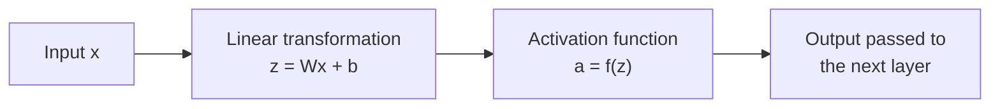
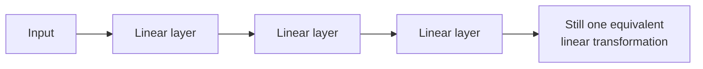
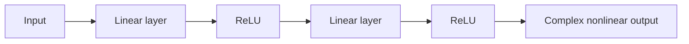
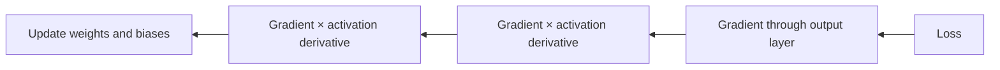

# 004 — Activation Functions

**Course:** 03 — Machine Learning and Deep Learning
**Module:** Module 07 — Deep Learning
**Content Group:** Neural Network Basics
**Roadmap Source:** Deep Learning / Neural Network Basics
**Lesson Type:** Deep Learning
**Order in Module:** 004
**Suggested Duration:** 24 minutes

---

## 1. Summary

An **activation function** transforms the weighted input of a neuron into its output.

For a neuron, the computation is usually divided into two steps:

$$
z = \mathbf{w}^{T}\mathbf{x} + b
$$

$$
a = f(z)
$$

Where:

* (\mathbf{x}) is the input vector.
* (\mathbf{w}) contains the trainable weights.
* (b) is the bias.
* (z) is the linear combination, also called the **pre-activation**.
* (f) is the activation function.
* (a) is the neuron’s output or **activation**.

Activation functions are important because they introduce **nonlinearity**. Without nonlinear activation functions, stacking many neural-network layers would still produce only a linear transformation.

---

## 2. Learning Objectives

After completing this lesson, you should be able to:

* Explain what an activation function does.
* Explain why neural networks require nonlinear activation functions.
* Calculate the output of ReLU, sigmoid, tanh, and softmax.
* Select an activation function for hidden and output layers.
* Explain vanishing gradients and dying ReLU neurons.
* Implement activation functions in PyTorch.
* Compare activation functions through visualization and experiments.

---

## 3. Where Activation Functions Appear

A neural-network layer normally performs the following computation:



For a network with multiple layers:

$$
\mathbf{a}^{(1)} = f^{(1)} \left( W^{(1)}\mathbf{x}+\mathbf{b}^{(1)} \right)
$$

$$
\mathbf{a}^{(2)} = f^{(2)} \left( W^{(2)}\mathbf{a}^{(1)}+\mathbf{b}^{(2)} \right)
$$

$$
\hat{\mathbf{y}} = f^{(L)} \left( W^{(L)}\mathbf{a}^{(L-1)}+\mathbf{b}^{(L)} \right)
$$

Each hidden layer transforms the representation learned by the previous layer.

---

## 4. Why Nonlinearity Is Necessary

Suppose a network contains two linear layers without activation functions:

$$
\mathbf{h} = W_1\mathbf{x}+\mathbf{b}_1
$$

$$
\mathbf{y} = W_2\mathbf{h}+\mathbf{b}_2
$$

Substituting the first equation into the second gives:

$$
\mathbf{y} = W_2(W_1\mathbf{x}+\mathbf{b}_1)+\mathbf{b}_2
$$

$$
\mathbf{y} = (W_2W_1)\mathbf{x} + (W_2\mathbf{b}_1+\mathbf{b}_2)
$$

Let:

$$
W' = W_2W_1
$$

$$
\mathbf{b}' = W_2\mathbf{b}_1+\mathbf{b}_2
$$

Then:

$$
\mathbf{y}=W'\mathbf{x}+\mathbf{b}'
$$

The two-layer network is mathematically equivalent to a single linear layer.

The same result applies to 10, 50, or 100 linear layers. Without nonlinear activation functions, depth does not give the network the ability to model nonlinear relationships.

### Linear-network limitation



### Nonlinear network



Nonlinearity allows neural networks to learn:

* Curved decision boundaries
* Object shapes and image features
* Complex interactions between variables
* Hierarchical representations
* Language patterns
* Audio and time-series structures

---

## 5. Common Activation Functions

## 5.1 Binary Step Function

The binary step function activates a neuron when the input exceeds a threshold.

$$
f(x)= \begin{cases} 1, & x \geq 0 \ 0, & x < 0 \end{cases}
$$

Example:

| Input (x) | Output |
| --------: | -----: |
|      (-2) |      0 |
|    (-0.1) |      0 |
|       (0) |      1 |
|       (3) |      1 |

### Limitation

Its derivative is zero almost everywhere and undefined at the threshold. Therefore, it is unsuitable for ordinary gradient-based neural-network training.

---

## 5.2 Sigmoid

The sigmoid function converts any real number into a value between 0 and 1.

$$
\sigma(x)=\frac{1}{1+e^{-x}}
$$

### Output range

$$
0 < \sigma(x) < 1
$$

### Derivative

$$
\sigma'(x)=\sigma(x)(1-\sigma(x))
$$

### Example values

| Input (x) |        Sigmoid output |
| --------: | --------------------: |
|      (-5) | approximately (0.007) |
|      (-1) | approximately (0.269) |
|       (0) |                 (0.5) |
|       (1) | approximately (0.731) |
|       (5) | approximately (0.993) |

### Advantages

* Smooth and differentiable
* Output can be interpreted as a probability
* Useful for binary classification outputs
* Useful for gates in LSTM and GRU architectures

### Limitations

* Saturates for large positive or negative inputs
* Gradients become very small in saturated regions
* Not zero-centered
* Usually performs poorly as a hidden-layer activation in deep feedforward networks

### Typical use

Use sigmoid for a **binary classification output**:

$$
P(y=1\mid x)=\sigma(z)
$$

For numerical stability, PyTorch training usually combines raw logits with:

```python
nn.BCEWithLogitsLoss()
```

This loss internally applies the sigmoid operation. Therefore, the model should normally return logits rather than manually applying sigmoid during training.

---

## 5.3 Hyperbolic Tangent — Tanh

The hyperbolic tangent function maps inputs to values between (-1) and (1).

$$
\tanh(x) = \frac{e^x-e^{-x}} {e^x+e^{-x}}
$$

### Output range

$$
-1 < \tanh(x) < 1
$$

### Derivative

$$
\frac{d}{dx}\tanh(x) = 1-\tanh^2(x)
$$

### Advantages

* Smooth and differentiable
* Zero-centered output
* Stronger negative and positive representation than sigmoid
* Common in recurrent neural-network states

### Limitations

* Still suffers from saturation
* Can produce vanishing gradients
* Usually not the default activation for modern feedforward hidden layers

### Typical use

Tanh is commonly found in:

* Traditional recurrent neural networks
* LSTM candidate states
* Outputs that must remain between (-1) and (1)

---

## 5.4 ReLU

The **Rectified Linear Unit**, or ReLU, is one of the most common activation functions for hidden layers.

$$
\text{ReLU}(x)=\max(0,x)
$$

Equivalently:

$$
\text{ReLU}(x) = \begin{cases} 0, & x \leq 0 \ x, & x > 0 \end{cases}
$$

### Derivative

$$
\text{ReLU}'(x) = \begin{cases} 0, & x < 0 \ 1, & x > 0 \end{cases}
$$

At (x=0), the mathematical derivative is undefined. Deep-learning libraries choose a practical subgradient, commonly (0).

### Example values

| Input (x) | ReLU output |
| --------: | ----------: |
|      (-5) |           0 |
|      (-1) |           0 |
|       (0) |           0 |
|       (1) |           1 |
|       (5) |           5 |

### Why ReLU works well

* Very inexpensive to calculate
* Does not saturate for positive values
* Preserves useful gradients when (x>0)
* Often trains faster than sigmoid or tanh
* Creates sparse activations because negative outputs become zero

### Dying ReLU problem

When a neuron continually receives negative pre-activation values:

$$
z=\mathbf{w}^{T}\mathbf{x}+b<0
$$

its output is always:

$$
\text{ReLU}(z)=0
$$

Its local gradient is also zero. As a result, its parameters may stop updating. This neuron is sometimes described as a **dead neuron**.

Possible causes include:

* An excessively high learning rate
* Poor weight initialization
* Large negative biases
* Unstable training
* An inappropriate input scale

Possible solutions include:

* Lowering the learning rate
* Using He initialization
* Applying normalization
* Using Leaky ReLU, PReLU, GELU, or SiLU

---

## 5.5 Leaky ReLU

Leaky ReLU keeps a small slope for negative inputs.

$$
f(x) = \begin{cases} x, & x>0 \ \alpha x, & x\leq0 \end{cases}
$$

A common value is:

$$
\alpha=0.01
$$

### Example

For (x=-4):

$$
f(-4)=0.01(-4)=-0.04
$$

Unlike standard ReLU, Leaky ReLU allows a small gradient when the input is negative.

### Advantages

* Reduces the risk of permanently dead neurons
* Computationally inexpensive
* Easy replacement for ReLU

### Limitation

The negative slope (\alpha) is a hyperparameter and may not be optimal for every problem.

---

## 5.6 Parametric ReLU — PReLU

PReLU has the same basic form as Leaky ReLU, but the negative slope is learned during training.

$$
f(x) = \begin{cases} x, & x>0 \ ax, & x\leq0 \end{cases}
$$

Here, (a) is a trainable parameter.

PReLU is more flexible than Leaky ReLU but introduces additional parameters and can overfit on small datasets.

---

## 5.7 ELU

The Exponential Linear Unit is defined as:

$$
\text{ELU}(x) = \begin{cases} x, & x>0 \ \alpha(e^x-1), & x\leq0 \end{cases}
$$

ELU produces negative outputs for negative inputs and has a smooth negative region.

### Advantages

* Reduces the dying ReLU problem
* Negative outputs can move the mean activation closer to zero
* Smooth for negative inputs

### Limitations

* More expensive than ReLU
* Contains an exponential operation
* Can saturate in the negative region

---

## 5.8 Softplus

Softplus is a smooth approximation of ReLU.

$$
\text{Softplus}(x) = \log(1+e^x)
$$

Its derivative is the sigmoid function:

$$
\frac{d}{dx}\text{Softplus}(x) = \sigma(x)
$$

### Advantages

* Smooth everywhere
* Never has an exactly zero derivative
* Useful when a strictly positive output is needed

### Limitations

* More computationally expensive than ReLU
* Does not create exact zero activations
* Usually trains more slowly than ReLU in standard deep networks

---

## 5.9 GELU

The **Gaussian Error Linear Unit** is commonly used in Transformer architectures.

$$
\text{GELU}(x) = x\Phi(x)
$$

Where (\Phi(x)) is the cumulative distribution function of the standard normal distribution.

A common approximation is:

$$
\text{GELU}(x) \approx \frac{x}{2} \left[ 1+ \tanh \left( \sqrt{\frac{2}{\pi}} \left( x+0.044715x^3 \right) \right) \right]
$$

Unlike ReLU, GELU smoothly scales negative and positive inputs instead of using a hard threshold.

### Typical use

GELU is widely used in:

* BERT
* Vision Transformers
* Transformer-based language models
* Modern attention architectures

---

## 5.10 SiLU / Swish

The Sigmoid Linear Unit is:

$$
\text{SiLU}(x) = x\sigma(x)
$$

It is also commonly called **Swish**.

### Properties

* Smooth
* Non-monotonic near zero
* Allows small negative outputs
* Often performs well in modern CNNs

### Typical use

SiLU appears in architectures such as:

* EfficientNet
* YOLO variants
* Modern convolutional networks

---

## 5.11 Softmax

Softmax converts a vector of logits into a probability distribution.

For class (i):

$$
\text{Softmax}(z_i) = \frac{e^{z_i}} {\sum_{j=1}^{K}e^{z_j}}
$$

The outputs satisfy:

$$
0 < p_i < 1
$$

and:

$$
\sum_{i=1}^{K}p_i=1
$$

### Example

Suppose the output logits are:

$$
\mathbf{z}=[2.0,1.0,0.1]
$$

After softmax, the probabilities are approximately:

$$
[0.659,\ 0.242,\ 0.099]
$$

The model therefore assigns the highest probability to the first class.

### Typical use

Softmax is normally used conceptually for **single-label multiclass classification**, where exactly one class is correct.

Examples:

* Cat, dog, or bird
* Digits from 0 to 9
* One sentiment category
* One document topic

In PyTorch, the model should normally return raw logits and use:

```python
nn.CrossEntropyLoss()
```

`CrossEntropyLoss` already combines log-softmax with negative log-likelihood. Applying softmax manually before this loss is usually incorrect.

---

## 6. Hidden-Layer and Output-Layer Selection

The correct activation depends on the layer’s purpose.

| Layer or task                    | Common choice          | Output interpretation                 |
| -------------------------------- | ---------------------- | ------------------------------------- |
| Hidden layers in an MLP          | ReLU, GELU, SiLU       | Learned nonlinear features            |
| Hidden layers in a CNN           | ReLU, Leaky ReLU, SiLU | Spatial feature activations           |
| Transformer feed-forward layer   | GELU or SiLU           | Smooth feature transformation         |
| Binary classification output     | Sigmoid conceptually   | Probability of positive class         |
| Multilabel classification output | One sigmoid per label  | Independent label probabilities       |
| Single-label multiclass output   | Softmax conceptually   | Probability distribution over classes |
| Regression output                | Linear / no activation | Any real number                       |
| Non-negative regression          | Softplus or ReLU       | Value greater than or equal to zero   |
| Output bounded to ([-1,1])       | Tanh                   | Bounded continuous value              |
| LSTM or GRU gates                | Sigmoid                | Gate values between 0 and 1           |
| LSTM candidate state             | Tanh                   | State values between (-1) and (1)     |

### Practical default

For a basic feedforward or convolutional network:

```text
Hidden layers: ReLU
Binary output: one logit + BCEWithLogitsLoss
Multiclass output: K logits + CrossEntropyLoss
Regression output: no activation
```

---

## 7. Activation Functions and Backpropagation

During backpropagation, gradients are calculated using the chain rule.

For a layer:

$$
\mathbf{a}=f(\mathbf{z})
$$

the gradient includes:

$$
\frac{\partial L}{\partial \mathbf{z}} = \frac{\partial L}{\partial \mathbf{a}} \odot f'(\mathbf{z})
$$

Where:

* (L) is the loss.
* (\odot) represents element-wise multiplication.
* (f'(\mathbf{z})) is the derivative of the activation function.

The derivative therefore directly controls how strongly the learning signal passes through the layer.



---

## 8. Vanishing and Exploding Gradients

## 8.1 Vanishing gradients

During backpropagation, gradients across many layers are multiplied together.

If many derivatives are smaller than 1:

$$
0 < |f'(x)| < 1
$$

then repeated multiplication may produce a value close to zero:

$$
0.2^{10} = 0.0000001024
$$

Earlier layers then receive almost no learning signal.

Sigmoid and tanh are vulnerable to this problem because their derivatives become small in saturated regions.

## 8.2 Exploding gradients

If repeated gradient factors are large, gradients may grow uncontrollably.

This can cause:

* Extremely large parameter updates
* Unstable loss values
* `NaN` values
* Training divergence

Possible solutions include:

* Proper initialization
* Batch normalization or layer normalization
* Residual connections
* Gradient clipping
* Suitable activation functions
* Lower learning rates

---

## 9. How ReLU Builds Complex Shapes

ReLU itself is simple:

$$
f(x)=\max(0,x)
$$

However, weights and biases can shift, scale, or flip its input:

$$
h_i(x)=\text{ReLU}(w_ix+b_i)
$$

A network can then combine many transformed ReLU functions:

$$
y(x)= \sum_{i=1}^{m}v_i \text{ReLU}(w_ix+b_i) +c
$$

Each hidden neuron creates a different piecewise-linear component. Adding many of these components produces a complex function.

```text
Input
  │
  ├── ReLU(w₁x + b₁) ── × v₁ ──┐
  ├── ReLU(w₂x + b₂) ── × v₂ ──┼── Sum + bias ── Output
  ├── ReLU(w₃x + b₃) ── × v₃ ──┤
  └── ReLU(w₄x + b₄) ── × v₄ ──┘
```

The expressive power does not come from one complicated activation function. It comes from combining many simple nonlinear transformations.

---

## 10. Comparison Table

| Function    | Range              | Zero-centered | Main advantage                 | Main limitation                    |
| ----------- | ------------------ | ------------: | ------------------------------ | ---------------------------------- |
| Binary step | (0) or (1)         |            No | Simple threshold               | Not useful for gradient descent    |
| Sigmoid     | ((0,1))            |            No | Probability interpretation     | Vanishing gradients                |
| Tanh        | ((-1,1))           |           Yes | Zero-centered output           | Saturation                         |
| ReLU        | ([0,\infty))       |            No | Fast and effective             | Dead neurons                       |
| Leaky ReLU  | ((-\infty,\infty)) |        Nearly | Gradient for negative inputs   | Negative slope must be selected    |
| PReLU       | ((-\infty,\infty)) |        Nearly | Learnable negative slope       | Extra parameters                   |
| ELU         | ((-\alpha,\infty)) |        Nearly | Smooth negative region         | More expensive than ReLU           |
| Softplus    | ((0,\infty))       |            No | Smooth ReLU approximation      | Slower and not sparse              |
| GELU        | ((-\infty,\infty)) |        Nearly | Strong Transformer performance | More expensive than ReLU           |
| SiLU        | ((-\infty,\infty)) |        Nearly | Smooth modern activation       | More expensive than ReLU           |
| Softmax     | ((0,1)) per class  |            No | Multiclass probabilities       | Primarily an output transformation |

---

## 11. PyTorch Implementation

## 11.1 Activation modules

```python
import torch
from torch import nn


class BinaryClassifier(nn.Module):
    def __init__(self, input_size: int) -> None:
        super().__init__()

        self.network = nn.Sequential(
            nn.Linear(input_size, 64),
            nn.ReLU(),

            nn.Linear(64, 32),
            nn.ReLU(),

            # Return one raw logit.
            nn.Linear(32, 1),
        )

    def forward(self, x: torch.Tensor) -> torch.Tensor:
        return self.network(x)
```

Use it with:

```python
model = BinaryClassifier(input_size=20)
criterion = nn.BCEWithLogitsLoss()

x = torch.randn(8, 20)
targets = torch.randint(0, 2, (8, 1)).float()

logits = model(x)
loss = criterion(logits, targets)

probabilities = torch.sigmoid(logits)
predictions = (probabilities >= 0.5).int()
```

---

## 11.2 Multiclass classifier

```python
import torch
from torch import nn


class DigitClassifier(nn.Module):
    def __init__(self) -> None:
        super().__init__()

        self.network = nn.Sequential(
            nn.Flatten(),
            nn.Linear(28 * 28, 128),
            nn.ReLU(),
            nn.Linear(128, 64),
            nn.ReLU(),

            # Ten raw logits for digits 0–9.
            nn.Linear(64, 10),
        )

    def forward(self, x: torch.Tensor) -> torch.Tensor:
        return self.network(x)
```

Training:

```python
model = DigitClassifier()
criterion = nn.CrossEntropyLoss()

images = torch.randn(32, 1, 28, 28)
labels = torch.randint(0, 10, (32,))

logits = model(images)
loss = criterion(logits, labels)

predicted_classes = logits.argmax(dim=1)
probabilities = torch.softmax(logits, dim=1)
```

---

## 11.3 Functional API

PyTorch also provides functional activation operations:

```python
import torch
import torch.nn.functional as F

x = torch.tensor([-2.0, -0.5, 0.0, 1.0, 3.0])

relu_output = F.relu(x)
leaky_relu_output = F.leaky_relu(x, negative_slope=0.01)
gelu_output = F.gelu(x)
silu_output = F.silu(x)
softplus_output = F.softplus(x)

print("ReLU:", relu_output)
print("Leaky ReLU:", leaky_relu_output)
print("GELU:", gelu_output)
print("SiLU:", silu_output)
print("Softplus:", softplus_output)
```

Use module objects such as `nn.ReLU()` when building `nn.Sequential`. Use the functional API when the activation must be applied conditionally or directly inside `forward()`.

---

## 12. Visualization Demo

```python
import matplotlib.pyplot as plt
import torch
import torch.nn.functional as F

x = torch.linspace(-6, 6, 500)

activation_functions = {
    "Sigmoid": torch.sigmoid(x),
    "Tanh": torch.tanh(x),
    "ReLU": F.relu(x),
    "Leaky ReLU": F.leaky_relu(x, negative_slope=0.1),
    "GELU": F.gelu(x),
    "SiLU": F.silu(x),
}

for name, values in activation_functions.items():
    plt.figure(figsize=(7, 4))
    plt.plot(x.numpy(), values.numpy())
    plt.axhline(0, linewidth=0.8)
    plt.axvline(0, linewidth=0.8)
    plt.title(name)
    plt.xlabel("Input")
    plt.ylabel("Output")
    plt.grid(True)
    plt.show()
```

When examining the plots, compare:

* Output range
* Smoothness
* Negative-region behavior
* Saturation
* Whether the function produces exact zeros
* Whether large positive inputs preserve their magnitude

---

## 13. Mini Experiment

Train the same small neural network several times, changing only the hidden-layer activation.

Recommended comparison:

```text
ReLU
Leaky ReLU
Tanh
Sigmoid
GELU
```

Track:

* Training loss
* Validation loss
* Training accuracy
* Validation accuracy
* Number of epochs required to converge
* Percentage of zero activations
* Gradient magnitude by layer

Example experiment table:

| Activation | Best validation accuracy | Epochs to converge | Training issue             |
| ---------- | -----------------------: | -----------------: | -------------------------- |
| ReLU       |                        — |                  — | Check for dead neurons     |
| Leaky ReLU |                        — |                  — | Check negative activations |
| Tanh       |                        — |                  — | Check saturation           |
| Sigmoid    |                        — |                  — | Check vanishing gradients  |
| GELU       |                        — |                  — | Compare computation time   |

---

## 14. Practical Exercise

### Task

Build a small image classifier for Fashion-MNIST or MNIST.

### Architecture

```text
28×28 image
    ↓
Flatten
    ↓
Linear(784, 128)
    ↓
Activation
    ↓
Linear(128, 64)
    ↓
Activation
    ↓
Linear(64, 10)
    ↓
Class logits
```

### Experiments

Train separate models using:

1. ReLU
2. Leaky ReLU
3. Tanh
4. GELU

Keep the following settings unchanged:

* Dataset split
* Random seed
* Optimizer
* Learning rate
* Batch size
* Number of epochs
* Network width
* Loss function

### Required outputs

* Training-loss curve
* Validation-loss curve
* Accuracy curve
* Confusion matrix
* Final comparison table
* One paragraph explaining the observed differences

---

## 15. Common Mistakes

### Mistake 1: Removing every activation function

A deep network without nonlinear activations collapses into an equivalent linear transformation.

### Mistake 2: Applying softmax before `CrossEntropyLoss`

Incorrect:

```python
probabilities = torch.softmax(model(x), dim=1)
loss = criterion(probabilities, labels)
```

Correct:

```python
logits = model(x)
loss = criterion(logits, labels)
```

### Mistake 3: Applying sigmoid before `BCEWithLogitsLoss`

Incorrect:

```python
probabilities = torch.sigmoid(model(x))
loss = criterion(probabilities, targets)
```

Correct:

```python
logits = model(x)
loss = criterion(logits, targets)
```

### Mistake 4: Using sigmoid in every hidden layer

This can produce saturation and vanishing gradients, especially in deep networks.

### Mistake 5: Using ReLU for an unrestricted regression output

ReLU prevents negative predictions. Use a linear output unless the target is guaranteed to be non-negative.

### Mistake 6: Assuming Leaky ReLU fixes vanishing gradients everywhere

Leaky ReLU mainly addresses zero gradients in ReLU’s negative region. Vanishing gradients can still occur because of network depth, poor initialization, recurrent multiplication, or other architectural choices.

### Mistake 7: Ignoring activation distributions

Monitor whether activations are:

* Almost all zero
* Extremely large
* Saturated near fixed boundaries
* Constant across samples
* Producing `NaN` or infinite values

### Mistake 8: Changing several variables in one experiment

When comparing activation functions, keep the architecture, optimizer, learning rate, dataset split, and random seed fixed.

---

## 16. Practical Rules of Thumb

* Start with **ReLU** for a standard MLP or CNN.
* Try **Leaky ReLU** when many ReLU neurons become inactive.
* Try **GELU** for Transformer-style architectures.
* Try **SiLU** for modern CNN architectures.
* Use one raw logit with `BCEWithLogitsLoss` for binary classification.
* Use one logit per label for multilabel classification.
* Use (K) raw logits with `CrossEntropyLoss` for (K)-class single-label classification.
* Use no output activation for unrestricted regression.
* Use Softplus when the regression output must remain positive.
* Always validate the choice experimentally.

---

## 17. Completion Checklist

* [ ] I can explain an activation function in one or two minutes.
* [ ] I can explain why a deep network needs nonlinearity.
* [ ] I can calculate ReLU, sigmoid, and tanh outputs manually.
* [ ] I understand why sigmoid and tanh can cause vanishing gradients.
* [ ] I understand the dying ReLU problem.
* [ ] I can distinguish binary, multilabel, and multiclass output layers.
* [ ] I know when not to apply sigmoid or softmax manually.
* [ ] I have visualized at least four activation functions.
* [ ] I have compared activation functions using the same model and dataset.
* [ ] I recorded at least one limitation, assumption, or unanswered question.

---

## 18. Related Outcome

Understand neural networks, CNNs, recurrent networks, LSTM models, Transformers, and transfer learning at a practical level.

Activation functions connect directly to:

* Forward propagation
* Backpropagation
* Gradient descent
* Weight initialization
* Vanishing gradients
* Residual networks
* CNN feature extraction
* Recurrent-network gates
* Transformer feed-forward blocks

---

## 19. Related Project

### Mini Project: Image Classification

Compare:

1. A small CNN trained from scratch
2. A transfer-learning model
3. Several hidden-layer activation functions

Evaluate the models using:

* Accuracy
* Precision
* Recall
* F1-score
* Confusion matrix
* Training time
* Validation-loss curves
* Error analysis

Suggested experiment question:

> How does the hidden-layer activation function affect convergence speed, gradient flow, validation accuracy, and training stability?

---

## 20. Key Takeaways

An activation function transforms a neuron’s weighted sum into a signal that can be passed to the next layer.

The most important ideas are:

1. **Nonlinearity gives neural networks their expressive power.**
2. **Without nonlinear activation functions, multiple linear layers collapse into one linear transformation.**
3. **ReLU is a strong default for hidden layers in basic MLPs and CNNs.**
4. **Sigmoid is mainly used for binary and multilabel outputs or neural-network gates.**
5. **Softmax represents a multiclass probability distribution, but training libraries normally expect raw logits.**
6. **Tanh and sigmoid may suffer from saturation and vanishing gradients.**
7. **ReLU can produce dead neurons when inputs remain negative.**
8. **GELU and SiLU are common in modern deep-learning architectures.**
9. **The activation function must match the task, output constraints, and loss function.**
10. **The best choice should be confirmed through controlled experiments.**

A single activation function is mathematically simple. The power of deep learning comes from combining millions or billions of simple nonlinear transformations into one trainable model.

---

# Bài luyện tập

## Mục tiêu


## Đề bài


## Yêu cầu hoàn thành

- [ ] 
- [ ] 
- [ ] 

## Kết quả / lời giải


## Ghi chú
