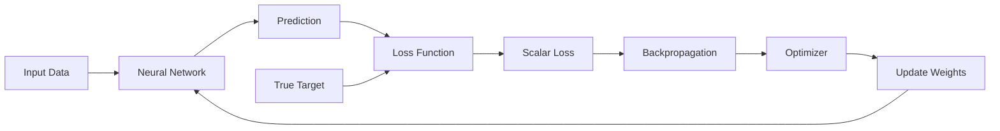
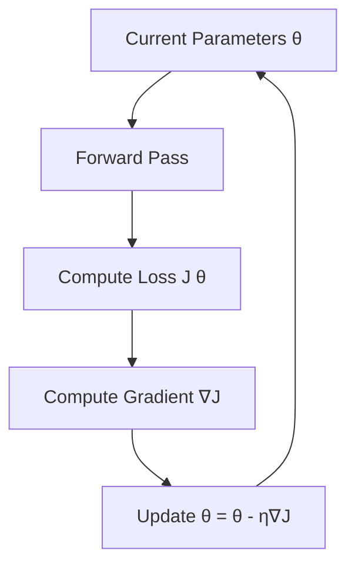
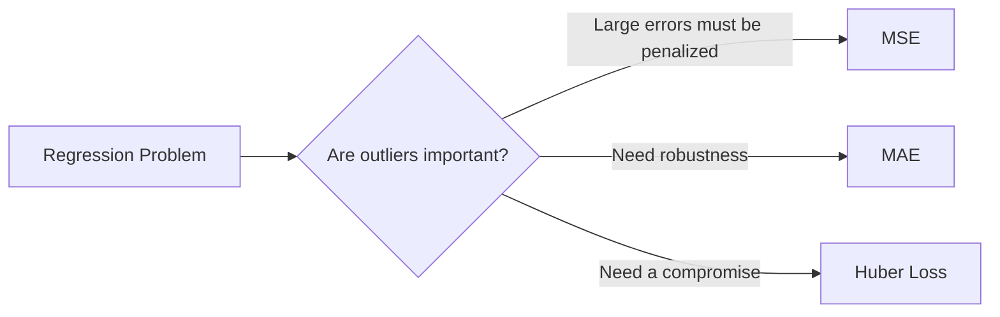
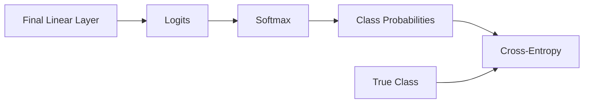
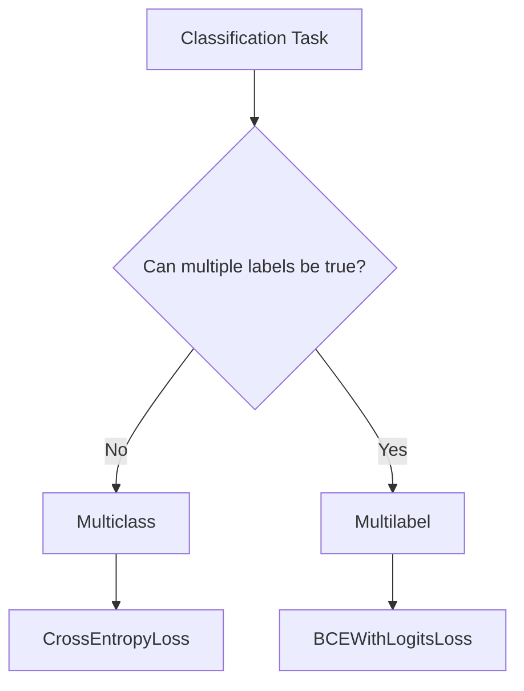
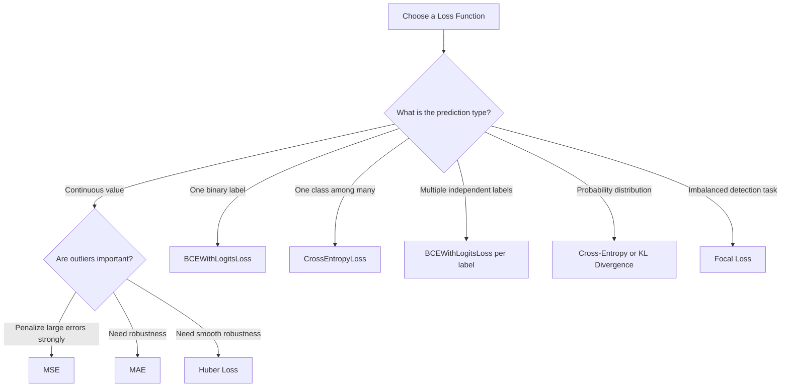
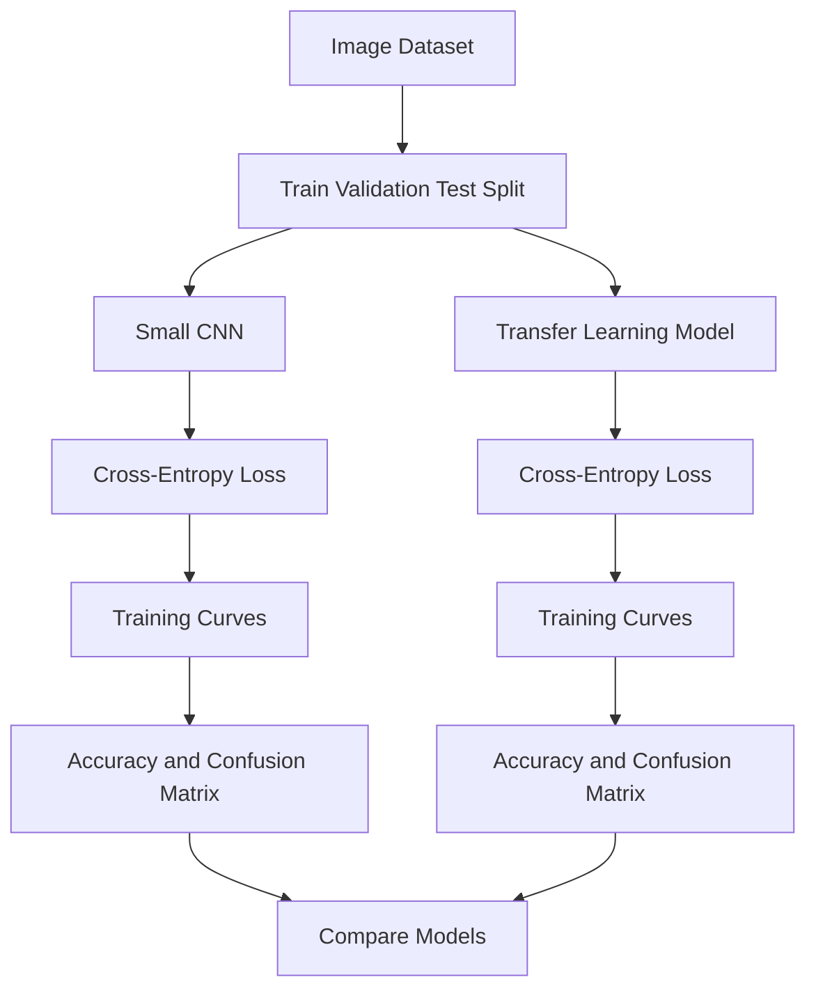

# 005 - Loss Function

**Course:** 03 - Machine Learning and Deep Learning
**Module:** Module 07 - Deep Learning
**Content Group:** Neural Network Basics
**Roadmap Source:** Deep Learning / Neural Network Basics
**Lesson Type:** Deep Learning
**Order in Module:** 005
**Suggested Duration:** 24 minutes

---

## 1. Summary

A **loss function** measures how far a model's predictions are from the correct targets.

During neural-network training, the model:

1. Produces a prediction.
2. Calculates the loss.
3. Computes gradients using backpropagation.
4. Updates its weights using an optimizer.
5. Repeats the process until the loss becomes sufficiently small.

A loss function converts the quality of a prediction into a numerical value:

* **Small loss:** the prediction is close to the target.
* **Large loss:** the prediction is far from the target.



There is no universally best loss function. The correct choice depends on:

* The type of task
* The output representation
* The probability distribution of the target
* The importance of outliers
* Class imbalance
* The business objective

Loss functions provide the quantitative signal that allows an optimization algorithm to search for better model parameters.

---

## 2. Learning Objectives

After completing this lesson, you should be able to:

* Explain what a loss function is in your own words.
* Distinguish between a **loss function**, an **evaluation metric**, and an **objective function**.
* Describe how loss functions interact with backpropagation and gradient descent.
* Select an appropriate loss function for regression or classification.
* Explain the behavior of MSE, MAE, Huber loss, binary cross-entropy, categorical cross-entropy, and hinge loss.
* Recognize common implementation mistakes involving logits, probabilities, and target formats.
* Plot and interpret training and validation loss curves.
* Implement common loss functions using PyTorch.

---

## 3. Main Concept

### 3.1 What Is a Loss Function?

Suppose a model receives an input (x) and produces a prediction:

$$
\hat{y} = f(x; \theta)
$$

where:

* (x) is the input.
* (f) is the model.
* (\theta) represents the model parameters.
* (\hat{y}) is the prediction.
* (y) is the true target.

A loss function compares the prediction with the target:

$$
L(y, \hat{y})
$$

For one training example, the result is usually a single number.

For a dataset containing (N) examples, the average empirical loss is:

$$
J(\theta) = \frac{1}{N} \sum_{i=1}^{N} L\left(y_i, f(x_i;\theta)\right)
$$

Training attempts to find the parameters that minimize this value:

$$
\theta^* = \arg\min_{\theta} J(\theta)
$$

---

### 3.2 Loss Function vs Cost Function vs Objective Function

These terms are sometimes used interchangeably, but they can have slightly different meanings.

| Term               | Typical Meaning                                |
| ------------------ | ---------------------------------------------- |
| Loss function      | Error for one example                          |
| Cost function      | Average or total loss over a dataset or batch  |
| Objective function | Complete value optimized during training       |
| Evaluation metric  | Measurement used to evaluate model performance |

An objective function may contain both data loss and regularization:

$$
J(\theta) = \underbrace{ \frac{1}{N} \sum_{i=1}^{N} L(y_i,\hat{y}_i) }_{\text{Data loss}} + \underbrace{ \lambda R(\theta) }_{\text{Regularization}}
$$

For example, L2 regularization adds a penalty for large weights:

$$
R(\theta) = |\theta|_2^2
$$

---

### 3.3 Why Not Optimize Accuracy Directly?

Accuracy returns a discrete result:

$$
\text{Accuracy} = \frac{\text{Number of correct predictions}} {\text{Total number of predictions}}
$$

It does not describe how confident the model is.

Consider two predictions for the correct class:

```text
Prediction A: [0.51, 0.49]
Prediction B: [0.99, 0.01]
```

Both predictions are classified correctly, so both receive the same accuracy result.

However, Prediction B is much more confident. A smooth loss function captures this difference and provides more useful gradients for optimization.

Operations such as `argmax` are also unsuitable for ordinary gradient-based training because their output changes discontinuously. Cross-entropy instead works with the model's continuous scores or probabilities.

---

## 4. Loss Function in the Training Process

The training process can be represented as:

```text
Input
  ↓
Forward pass
  ↓
Prediction
  ↓
Loss calculation
  ↓
Backpropagation
  ↓
Gradient calculation
  ↓
Parameter update
```

Mathematically, gradient descent updates a parameter using:

$$
\theta_{t+1} = \theta_t - \eta \nabla_{\theta}J(\theta_t)
$$

where:

* (\eta) is the learning rate.
* (\nabla_{\theta}J) is the gradient of the objective.
* (t) is the current optimization step.

The loss determines the surface that the optimizer attempts to navigate.



A useful loss function should normally:

* Reflect the real modeling objective.
* Produce useful gradients.
* Be numerically stable.
* Work with the model's output format.
* Behave sensibly around noisy labels and outliers.

---

# 5. Regression Loss Functions

Regression models predict continuous values such as:

* House prices
* Temperature
* Revenue
* Delivery duration
* Energy consumption

---

## 5.1 Mean Squared Error

Mean Squared Error, or MSE, is:

$$
\text{MSE} = \frac{1}{N} \sum_{i=1}^{N} (y_i-\hat{y}_i)^2
$$

For one example:

$$
L(y,\hat{y})=(y-\hat{y})^2
$$

### Example

Suppose:

$$
y=10,\qquad \hat{y}=7
$$

Then:

$$
L=(10-7)^2=9
$$

If the prediction is (2):

$$
L=(10-2)^2=64
$$

The squared term heavily penalizes large errors.

### Advantages

* Smooth and differentiable.
* Simple gradient calculation.
* Strongly penalizes large mistakes.
* Commonly associated with Gaussian residual assumptions.
* Works well when large errors are especially undesirable.

### Disadvantages

* Sensitive to outliers.
* Large residuals can dominate training.
* Reported loss is expressed in squared target units.

### Gradient

For one example:

$$
L=(y-\hat{y})^2
$$

$$
\frac{\partial L}{\partial \hat{y}} = 2(\hat{y}-y)
$$

A large error produces a large gradient.

---

## 5.2 Root Mean Squared Error

Root Mean Squared Error is:

$$
\text{RMSE} = \sqrt{ \frac{1}{N} \sum_{i=1}^{N} (y_i-\hat{y}_i)^2 }
$$

RMSE is often easier to interpret because it uses the same unit as the target.

However, neural networks are commonly trained with MSE and evaluated with RMSE because the square root is not necessary to identify the minimum.

---

## 5.3 Mean Absolute Error

Mean Absolute Error, or MAE, is:

$$
\text{MAE} = \frac{1}{N} \sum_{i=1}^{N} |y_i-\hat{y}_i|
$$

For one example:

$$
L(y,\hat{y})=|y-\hat{y}|
$$

### Advantages

* More robust to outliers than MSE.
* Easy to interpret.
* Expressed in the same unit as the target.
* Treats each error proportionally.

### Disadvantages

* Not differentiable at zero.
* Its gradient has constant magnitude away from zero.
* Optimization can be less smooth near the minimum.
* It may converge less smoothly than MSE.

A subgradient can be used:

$$
\frac{\partial L}{\partial \hat{y}} = \begin{cases} 1, & \hat{y}>y\ -1, & \hat{y}<y \end{cases}
$$

---

## 5.4 MSE vs MAE

| Property                  |              MSE |                MAE |
| ------------------------- | ---------------: | -----------------: |
| Error penalty             |        Quadratic |             Linear |
| Outlier sensitivity       |             High |              Lower |
| Differentiable everywhere |              Yes |        No, at zero |
| Typical estimate learned  | Conditional mean | Conditional median |
| Large-error penalty       |           Strong |           Moderate |
| Target units              |    Squared units |     Original units |

### Error comparison

| Absolute Error | MSE Contribution | MAE Contribution |
| -------------: | ---------------: | ---------------: |
|              1 |                1 |                1 |
|              2 |                4 |                2 |
|              5 |               25 |                5 |
|             10 |              100 |               10 |



---

## 5.5 Huber Loss

Huber loss combines the behavior of MSE and MAE.

$$
L_{\delta}(r) = \begin{cases} \frac{1}{2}r^2, & |r|\leq\delta[6pt] \delta\left(|r|-\frac{1}{2}\delta\right), & |r|>\delta \end{cases}
$$

where:

$$
r = y-\hat{y}
$$

It behaves like:

* MSE for small errors.
* MAE for large errors.

### Advantages

* Less sensitive to outliers than MSE.
* Smoother than MAE.
* Useful for noisy regression datasets.
* Frequently effective when most labels are reliable but a few are corrupted.

### Disadvantage

It introduces the hyperparameter (\delta), which determines when the function changes from quadratic to linear behavior.

---

## 5.6 Smooth L1 Loss

Smooth L1 loss is closely related to Huber loss and is frequently used in computer vision, especially for bounding-box regression.

It is less sensitive to outliers than MSE while remaining smooth around zero.

Typical applications include:

* Object detection
* Bounding-box localization
* Keypoint regression
* Robust coordinate prediction

---

## 5.7 Quantile Loss

Quantile loss is useful when the goal is to estimate a conditional quantile instead of the mean.

For quantile (q):

$$
L_q(y,\hat{y}) = \begin{cases} q(y-\hat{y}), & y\geq\hat{y}[4pt] (1-q)(\hat{y}-y), & y<\hat{y} \end{cases}
$$

Examples:

* (q=0.5): median prediction
* (q=0.9): 90th-percentile prediction
* (q=0.1): 10th-percentile prediction

Quantile loss can be used to produce prediction intervals:

```text
10th percentile prediction ─────┐
Median prediction ──────────────┼── Uncertainty interval
90th percentile prediction ─────┘
```

---

# 6. Classification Loss Functions

Classification models predict categories such as:

* Cat vs dog
* Spam vs not spam
* Fraud vs legitimate
* One of several image classes
* Multiple tags for one document

---

## 6.1 Binary Cross-Entropy

Binary cross-entropy is used for binary classification.

Let:

* (y\in{0,1})
* (p=P(y=1\mid x))

Then:

$$
L(y,p) = -\left[ y\log(p) + (1-y)\log(1-p) \right]
$$

### When (y=1)

$$
L=-\log(p)
$$

### When (y=0)

$$
L=-\log(1-p)
$$

### Example

For a positive sample:

$$
y=1
$$

If the model predicts:

$$
p=0.9
$$

then:

$$
L=-\log(0.9)\approx0.105
$$

If the model predicts:

$$
p=0.01
$$

then:

$$
L=-\log(0.01)\approx4.605
$$

A confident incorrect prediction receives a very large penalty.

---

## 6.2 Why Cross-Entropy Works Well

Cross-entropy considers both correctness and confidence.

For the correct class:

| Predicted Probability | Cross-Entropy Loss |
| --------------------: | -----------------: |
|                  0.99 |              0.010 |
|                  0.90 |              0.105 |
|                  0.70 |              0.357 |
|                  0.50 |              0.693 |
|                  0.10 |              2.303 |
|                  0.01 |              4.605 |

As the probability assigned to the true class approaches zero, the loss grows rapidly.

This gives the optimizer a strong signal when the model makes a confident but incorrect prediction. Cross-entropy is particularly convenient with softmax outputs and backpropagation.

---

## 6.3 Binary Cross-Entropy with Logits

In practical frameworks, it is usually better to supply raw logits directly.

A logit is the raw output before sigmoid:

$$
z=f(x;\theta)
$$

The corresponding probability is:

$$
p=\sigma(z)=\frac{1}{1+e^{-z}}
$$

Instead of manually computing:

```python
probabilities = torch.sigmoid(logits)
loss = binary_cross_entropy(probabilities, targets)
```

prefer:

```python
loss_fn = torch.nn.BCEWithLogitsLoss()
loss = loss_fn(logits, targets)
```

`BCEWithLogitsLoss` combines sigmoid and binary cross-entropy using a numerically stable calculation.

---

## 6.4 Categorical Cross-Entropy

For a multiclass problem with (C) classes:

$$
L = -\sum_{c=1}^{C}y_c\log(p_c)
$$

where:

* (y_c) is the true one-hot target.
* (p_c) is the predicted probability for class (c).

If the target is one-hot encoded, only the true-class term remains:

$$
L=-\log(p_{\text{true class}})
$$

### Example

True class:

```text
Class B
```

One-hot target:

$$
y=[0,1,0]
$$

Prediction:

$$
p=[0.10,0.80,0.10]
$$

Loss:

$$
L = -\left( 0\log(0.10) + 1\log(0.80) + 0\log(0.10) \right)
$$

$$
L=-\log(0.80)\approx0.223
$$

If the model predicts:

$$
p=[0.80,0.05,0.15]
$$

then:

$$
L=-\log(0.05)\approx2.996
$$

---

## 6.5 Softmax and Cross-Entropy

For logits (z_1,z_2,\ldots,z_C), softmax calculates:

$$
p_c = \frac{e^{z_c}} {\sum_{j=1}^{C}e^{z_j}}
$$

The probabilities satisfy:

$$
0\leq p_c\leq1
$$

and:

$$
\sum_{c=1}^{C}p_c=1
$$

The training flow is:



In PyTorch, `CrossEntropyLoss` already combines:

```text
LogSoftmax + Negative Log-Likelihood Loss
```

Therefore, do not manually apply softmax before passing logits to `CrossEntropyLoss`.

Correct:

```python
logits = model(inputs)
loss = torch.nn.CrossEntropyLoss()(logits, targets)
```

Usually incorrect:

```python
probabilities = torch.softmax(model(inputs), dim=1)
loss = torch.nn.CrossEntropyLoss()(probabilities, targets)
```

---

## 6.6 Sparse vs One-Hot Targets

A class can be represented as an integer:

```text
Class index: 2
```

or as a one-hot vector:

```text
One-hot vector: [0, 0, 1, 0]
```

In PyTorch, `CrossEntropyLoss` normally expects integer class indices:

```python
targets = torch.tensor([2, 0, 1])
```

For three examples, model output shape:

```text
logits.shape = [3, number_of_classes]
```

Target shape:

```text
targets.shape = [3]
```

---

## 6.7 Multiclass vs Multilabel Classification

These problems require different formulations.

### Multiclass Classification

Each example belongs to exactly one class.

Example:

```text
Image → cat, dog, or horse
```

Use:

* One output logit per class
* Softmax interpretation
* Categorical cross-entropy

### Multilabel Classification

Each example can belong to multiple classes.

Example:

```text
Image → beach, sunset, person, ocean
```

Use:

* One independent logit per label
* Sigmoid interpretation
* Binary cross-entropy for each label



---

## 6.8 Hinge Loss

Hinge loss is commonly associated with support vector machines.

For binary classification:

$$
L(y,s)=\max(0,1-ys)
$$

where:

* (y\in{-1,+1})
* (s) is the model score.

The model is not only encouraged to classify the example correctly but also to place it beyond a safety margin.

```text
Incorrect side     Margin region      Safe correct side
───────────────|─────────────────|────────────────────
               -1                +1
```

A prediction may be classified correctly but still receive a penalty if it lies inside the margin.

---

## 6.9 Focal Loss

Focal loss is useful for highly imbalanced classification tasks.

For the true-class probability (p_t):

$$
\text{FL}(p_t) = -\alpha_t(1-p_t)^\gamma\log(p_t)
$$

where:

* (\alpha_t) controls class weighting.
* (\gamma) reduces the contribution of easy examples.

When (p_t) is high, the factor:

$$
(1-p_t)^\gamma
$$

becomes small.

This allows training to focus more strongly on difficult examples.

Common applications include:

* Object detection
* Rare-event prediction
* Medical image classification
* Fraud detection
* Defect detection

---

## 6.10 Kullback-Leibler Divergence

KL divergence measures how one probability distribution differs from another:

$$
D_{\mathrm{KL}}(P|Q) = \sum_x P(x) \log \frac{P(x)}{Q(x)}
$$

It appears in:

* Variational autoencoders
* Knowledge distillation
* Distribution matching
* Bayesian models
* Probabilistic representation learning

Cross-entropy can be related to entropy and KL divergence:

$$
H(P,Q) = H(P) + D_{\mathrm{KL}}(P|Q)
$$

If the target distribution (P) is fixed, minimizing cross-entropy with respect to (Q) also minimizes KL divergence.

---

# 7. Choosing an Appropriate Loss Function

There is no single best loss function for every problem.

Use the structure of the task to choose one.

| Task                              | Common Loss                                    |
| --------------------------------- | ---------------------------------------------- |
| Standard regression               | MSE                                            |
| Regression with outliers          | MAE or Huber                                   |
| Bounding-box regression           | Smooth L1 or IoU-based loss                    |
| Binary classification             | Binary cross-entropy                           |
| Multiclass classification         | Categorical cross-entropy                      |
| Multilabel classification         | Binary cross-entropy per label                 |
| Highly imbalanced classification  | Weighted BCE or focal loss                     |
| Margin-based classification       | Hinge loss                                     |
| Probability distribution matching | KL divergence                                  |
| Quantile prediction               | Quantile loss                                  |
| Image segmentation                | Cross-entropy, Dice, focal, or combined loss   |
| Language modeling                 | Token-level cross-entropy                      |
| Autoencoder reconstruction        | MSE, BCE, or task-specific reconstruction loss |

---

## 7.1 Decision Diagram



---

## 7.2 Statistical Interpretation

Many common loss functions correspond to maximum-likelihood assumptions.

| Loss                            | Typical Residual or Target Assumption |
| ------------------------------- | ------------------------------------- |
| MSE                             | Gaussian noise                        |
| MAE                             | Laplace noise                         |
| Binary cross-entropy            | Bernoulli distribution                |
| Categorical cross-entropy       | Categorical distribution              |
| Poisson negative log-likelihood | Count data                            |
| Quantile loss                   | Conditional quantile estimation       |

This perspective helps explain why some losses are more appropriate for certain datasets.

---

## 7.3 Loss Must Match the Output Layer

| Task                      | Output Layer            | Training Loss           |
| ------------------------- | ----------------------- | ----------------------- |
| Regression                | Linear output           | MSE, MAE, or Huber      |
| Binary classification     | One logit               | BCE with logits         |
| Multiclass classification | (C) logits              | Cross-entropy           |
| Multilabel classification | (C) independent logits  | BCE with logits         |
| Distribution prediction   | Distribution parameters | Negative log-likelihood |

A mismatch can lead to:

* Incorrect gradients
* Poor numerical stability
* Invalid probability interpretation
* Slow or failed convergence

---

# 8. Loss Function and Evaluation Metric

The training loss and final evaluation metric do not need to be identical.

### Example: Classification

Train with:

$$
\text{Cross-Entropy Loss}
$$

Evaluate with:

* Accuracy
* Precision
* Recall
* F1-score
* ROC-AUC
* Calibration error

### Example: Regression

Train with:

$$
\text{Huber Loss}
$$

Evaluate with:

* MAE
* RMSE
* (R^2)
* Business cost

### Why Use Different Quantities?

The training objective must normally provide useful gradients.

The evaluation metric should represent real-world performance.

For example, F1-score is valuable for evaluation but difficult to optimize directly with ordinary gradient descent because it depends on discrete predictions and a threshold.

---

# 9. Loss Curves and Model Diagnosis

Training and validation loss curves reveal the model's learning behavior.

---

## 9.1 Healthy Training

```text
Loss
│\
│ \
│  \       Validation
│   \______
│
│\_________ Training
└────────────────── Epoch
```

Both losses decrease and eventually stabilize.

---

## 9.2 Overfitting

```text
Loss
│\
│ \        Validation
│  \____
│       \__
│          \__
│             \  ← Begins increasing
│\_____________ Training
└────────────────── Epoch
```

Typical interpretation:

* Training loss continues decreasing.
* Validation loss begins increasing.
* The model is memorizing training-specific patterns.

Possible solutions:

* Early stopping
* Data augmentation
* Weight decay
* Dropout
* Smaller architecture
* More training data
* Better label quality

---

## 9.3 Underfitting

```text
Loss
│──────── Validation
│
│─────── Training
│
└────────────────── Epoch
```

Both losses remain high.

Possible causes:

* Model is too simple.
* Learning rate is inappropriate.
* Features contain insufficient information.
* Training duration is too short.
* Optimization is failing.
* Data preprocessing is incorrect.

---

## 9.4 Validation Loss Lower Than Training Loss

This can happen when:

* Dropout is enabled during training.
* Data augmentation makes training examples harder.
* Regularization is added to training loss.
* Validation data is easier.
* Training and validation loss are calculated differently.

It is not automatically an error.

---

# 10. Practical PyTorch Demo

## 10.1 Regression with MSE

```python
import torch
from torch import nn

# Example regression data
features = torch.tensor(
    [[1.0], [2.0], [3.0], [4.0]],
    dtype=torch.float32,
)
targets = torch.tensor(
    [[3.0], [5.0], [7.0], [9.0]],
    dtype=torch.float32,
)

model = nn.Linear(in_features=1, out_features=1)
loss_fn = nn.MSELoss()
optimizer = torch.optim.SGD(model.parameters(), lr=0.01)

for epoch in range(500):
    predictions = model(features)
    loss = loss_fn(predictions, targets)

    optimizer.zero_grad()
    loss.backward()
    optimizer.step()

    if epoch % 100 == 0:
        print(f"Epoch {epoch:03d} | Loss: {loss.item():.6f}")

with torch.no_grad():
    test_input = torch.tensor([[5.0]])
    prediction = model(test_input)
    print("Prediction for x=5:", prediction.item())
```

---

## 10.2 Multiclass Classification with Cross-Entropy

```python
import torch
from torch import nn

torch.manual_seed(42)

# Five examples, four input features
features = torch.randn(5, 4)

# Three possible classes: 0, 1, and 2
targets = torch.tensor([0, 2, 1, 2, 0], dtype=torch.long)

model = nn.Linear(in_features=4, out_features=3)
loss_fn = nn.CrossEntropyLoss()

logits = model(features)
loss = loss_fn(logits, targets)

print("Logits shape:", logits.shape)
print("Loss:", loss.item())

probabilities = torch.softmax(logits, dim=1)
predicted_classes = torch.argmax(probabilities, dim=1)

print("Probabilities:")
print(probabilities)

print("Predicted classes:")
print(predicted_classes)
```

Important:

```text
CrossEntropyLoss receives raw logits.
Do not apply softmax before calculating the loss.
```

---

## 10.3 Binary Classification with Logits

```python
import torch
from torch import nn

features = torch.tensor(
    [
        [0.2, 1.1],
        [1.2, 0.1],
        [1.0, 1.3],
        [0.1, 0.2],
    ],
    dtype=torch.float32,
)

targets = torch.tensor(
    [[1.0], [0.0], [1.0], [0.0]],
    dtype=torch.float32,
)

model = nn.Linear(in_features=2, out_features=1)
loss_fn = nn.BCEWithLogitsLoss()
optimizer = torch.optim.Adam(model.parameters(), lr=0.01)

for epoch in range(300):
    logits = model(features)
    loss = loss_fn(logits, targets)

    optimizer.zero_grad()
    loss.backward()
    optimizer.step()

with torch.no_grad():
    logits = model(features)
    probabilities = torch.sigmoid(logits)
    predictions = (probabilities >= 0.5).int()

print("Probabilities:")
print(probabilities)

print("Predictions:")
print(predictions)
```

---

## 10.4 Plotting Training and Validation Loss

```python
import matplotlib.pyplot as plt

training_losses = [1.20, 0.92, 0.70, 0.55, 0.43, 0.34]
validation_losses = [1.25, 0.98, 0.78, 0.67, 0.69, 0.76]

epochs = range(1, len(training_losses) + 1)

plt.plot(epochs, training_losses, label="Training loss")
plt.plot(epochs, validation_losses, label="Validation loss")

plt.xlabel("Epoch")
plt.ylabel("Loss")
plt.title("Training and Validation Loss")
plt.legend()
plt.show()
```

The example suggests that overfitting begins after approximately the fourth epoch.

---

# 11. Mini Demonstration: Comparing MSE, MAE, and Huber Loss

Suppose the residuals are:

$$
r=[1,2,8]
$$

### MSE

$$
\text{MSE} = # \frac{1^2+2^2+8^2}{3} # \frac{69}{3} 23
$$

### MAE

$$
\text{MAE} = # \frac{|1|+|2|+|8|}{3} \frac{11}{3} \approx3.67
$$

The residual (8) contributes:

* (64) under squared error
* (8) under absolute error

This demonstrates why MSE reacts much more strongly to outliers.

---

# 12. Practical Exercise

## Exercise 1: Regression Loss Comparison

Use a small regression dataset such as:

* California Housing
* Diabetes
* A synthetic linear dataset

Train the same neural network using:

1. MSE loss
2. MAE loss
3. Huber loss

Compare:

* Final training loss
* Validation MAE
* Validation RMSE
* Sensitivity to artificial outliers
* Convergence speed

### Suggested experiment

```text
Clean dataset
    ↓
Train with MSE, MAE, and Huber
    ↓
Add 5% extreme target outliers
    ↓
Train again
    ↓
Compare performance changes
```

---

## Exercise 2: Cross-Entropy Confidence

For the true class (c=0), calculate the loss for:

```text
Prediction A: [0.90, 0.05, 0.05]
Prediction B: [0.60, 0.20, 0.20]
Prediction C: [0.10, 0.45, 0.45]
```

Use:

$$
L=-\log(p_{\text{true class}})
$$

Expected interpretation:

* Prediction A has low loss.
* Prediction B has moderate loss.
* Prediction C has high loss.

---

## Exercise 3: Loss-Curve Diagnosis

Train a small CNN on an image dataset such as:

* MNIST
* Fashion-MNIST
* CIFAR-10

Record:

* Training loss
* Validation loss
* Training accuracy
* Validation accuracy

Then answer:

1. At which epoch does overfitting begin?
2. Does the lowest validation loss occur at the final epoch?
3. Would early stopping improve the result?
4. Does class imbalance affect the loss?
5. Does the confusion matrix reveal a weakness hidden by accuracy?

---

# 13. Common Mistakes

## 13.1 Choosing a Loss Only Because It Is Popular

Cross-entropy is not appropriate for every task.

The loss must match:

* The target structure
* The model output
* The desired statistical behavior
* The importance of different errors

---

## 13.2 Applying Softmax Twice

Incorrect:

```python
probabilities = torch.softmax(logits, dim=1)
loss = torch.nn.CrossEntropyLoss()(probabilities, targets)
```

Correct:

```python
loss = torch.nn.CrossEntropyLoss()(logits, targets)
```

---

## 13.3 Applying Sigmoid Before `BCEWithLogitsLoss`

Incorrect:

```python
probabilities = torch.sigmoid(logits)
loss = torch.nn.BCEWithLogitsLoss()(probabilities, targets)
```

Correct:

```python
loss = torch.nn.BCEWithLogitsLoss()(logits, targets)
```

---

## 13.4 Using the Wrong Target Data Type

For PyTorch multiclass cross-entropy:

```python
targets.dtype == torch.long
```

For binary cross-entropy:

```python
targets.dtype == torch.float32
```

---

## 13.5 Confusing Multiclass and Multilabel Problems

Multiclass:

```text
Exactly one correct class
→ CrossEntropyLoss
```

Multilabel:

```text
Zero, one, or several labels can be correct
→ BCEWithLogitsLoss
```

---

## 13.6 Ignoring Class Imbalance

A model may minimize ordinary cross-entropy by focusing mostly on common classes.

Possible solutions include:

* Class weights
* Positive-class weights
* Focal loss
* Balanced sampling
* Threshold tuning

Example:

```python
class_weights = torch.tensor([1.0, 4.0, 2.0])
loss_fn = torch.nn.CrossEntropyLoss(weight=class_weights)
```

---

## 13.7 Comparing Raw Loss Values Across Different Loss Functions

A cross-entropy value of (0.5) and an MSE value of (0.5) do not have the same meaning.

Loss scales depend on:

* Formula
* Target units
* Reduction method
* Number of outputs
* Batch size
* Label smoothing
* Regularization

---

## 13.8 Ignoring Reduction Settings

Frameworks commonly support:

```python
reduction="mean"
reduction="sum"
reduction="none"
```

These produce different scales.

```python
loss_fn = torch.nn.CrossEntropyLoss(reduction="none")
per_example_loss = loss_fn(logits, targets)
```

Per-example loss is useful for:

* Debugging
* Hard-example mining
* Detecting noisy labels
* Custom weighting
* Curriculum learning

---

## 13.9 Ignoring Numerical Stability

Directly calculating:

$$
-\log(p)
$$

can become unstable when (p) is extremely close to zero.

Use framework implementations that combine operations safely:

* `CrossEntropyLoss`
* `BCEWithLogitsLoss`
* `log_softmax`
* `logsumexp`

---

## 13.10 Focusing Only on Training Loss

Low training loss does not guarantee good generalization.

Always monitor:

* Training loss
* Validation loss
* Relevant evaluation metrics
* Per-class performance
* Calibration
* Error examples
* Data leakage

---

# 14. Loss Function Checklist

Before training, verify the following:

* [ ] I know whether the task is regression, binary classification, multiclass classification, or multilabel classification.
* [ ] The model output shape matches the loss function.
* [ ] The target shape and data type are correct.
* [ ] I know whether the loss expects logits or probabilities.
* [ ] I have considered class imbalance.
* [ ] I have considered label noise and outliers.
* [ ] I understand the loss reduction method.
* [ ] I will record both training and validation loss.
* [ ] I have chosen separate evaluation metrics when necessary.
* [ ] I can explain why this loss represents the task objective.

---

# 15. Completion Checklist

* [ ] I can explain a loss function in one or two minutes.
* [ ] I can distinguish loss from an evaluation metric.
* [ ] I understand how loss is used during backpropagation.
* [ ] I can choose between MSE, MAE, and Huber loss.
* [ ] I understand binary and categorical cross-entropy.
* [ ] I know when to use cross-entropy versus binary cross-entropy.
* [ ] I know why logits are often preferred over manually calculated probabilities.
* [ ] I can plot and interpret training and validation loss.
* [ ] I have created a notebook, chart, model, API, or technical note for this topic.
* [ ] I have documented at least one caveat, assumption, or unanswered question.

---

# 16. Related Outcome

Understand neural networks, CNNs, RNNs, LSTMs, Transformers, and transfer learning at a practical level.

Loss functions are central to all these architectures:

| Architecture            | Typical Training Loss                   |
| ----------------------- | --------------------------------------- |
| CNN image classifier    | Cross-entropy                           |
| Object detector         | Classification plus localization losses |
| RNN/LSTM classifier     | Cross-entropy                           |
| Language model          | Token-level cross-entropy               |
| Autoencoder             | Reconstruction loss                     |
| Variational autoencoder | Reconstruction plus KL divergence       |
| GAN                     | Adversarial objectives                  |
| Transformer classifier  | Cross-entropy                           |
| Embedding model         | Contrastive or triplet loss             |

---

# 17. Related Project

## Mini Project: Image Classification

Compare:

1. A small CNN trained from scratch.
2. A transfer-learning model.

Suggested dataset:

* CIFAR-10
* Fashion-MNIST
* A small custom image dataset

Track:

* Training loss
* Validation loss
* Accuracy
* Precision
* Recall
* F1-score
* Confusion matrix
* Training duration

### Experiment structure



Questions to investigate:

1. Which model reaches the lowest validation loss?
2. Does the lowest loss correspond to the highest accuracy?
3. Which classes are most frequently confused?
4. Does transfer learning converge faster?
5. Does label smoothing improve validation performance?
6. Does class weighting improve minority-class recall?
7. Is overfitting visible in the loss curves?

---

# 18. Key Takeaways

1. A loss function measures how wrong a model's predictions are.

2. Neural-network training minimizes an average loss using backpropagation and an optimizer.

3. There is no universally best loss function.

4. MSE strongly penalizes large regression errors but is sensitive to outliers.

5. MAE is more robust to outliers but has less smooth optimization behavior.

6. Huber loss combines quadratic behavior near zero with linear behavior for large errors.

7. Binary cross-entropy is appropriate for binary and multilabel classification.

8. Categorical cross-entropy is the standard choice for single-label multiclass classification.

9. PyTorch's `CrossEntropyLoss` expects raw logits and usually integer class indices.

10. The training loss and evaluation metric can be different.

11. Validation loss is essential for detecting overfitting.

12. A good loss must match the output representation, data distribution, and real objective.

---

# 19. Final Summary

A **loss function** converts the difference between predictions and targets into a numerical training signal.

It connects the model's forward pass to backpropagation:

```text
Prediction
    ↓
Loss
    ↓
Gradient
    ↓
Weight update
    ↓
Better prediction
```

Choosing the correct loss function requires understanding:

* What the model predicts
* How the targets are represented
* Which errors matter most
* Whether the data contains outliers or imbalance
* Which metric represents real-world success

Do not treat loss selection as a purely mechanical step. It encodes what the model is being asked to optimize.

Turn this lesson into a concrete portfolio artifact by creating a notebook that compares several losses, visualizes training and validation curves, and explains why one loss performs better for the selected dataset.
