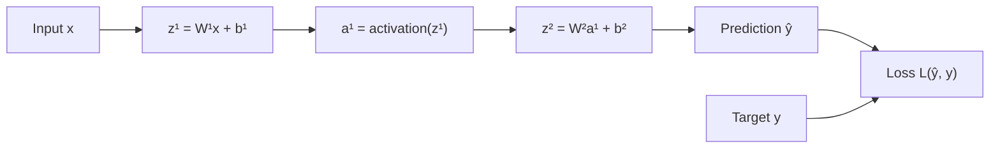
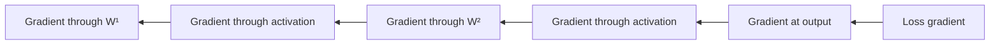
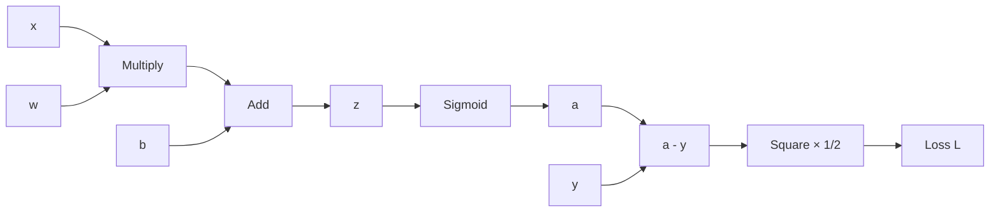
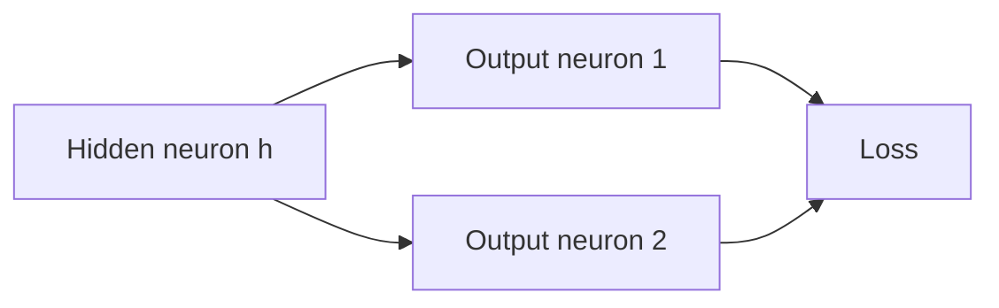
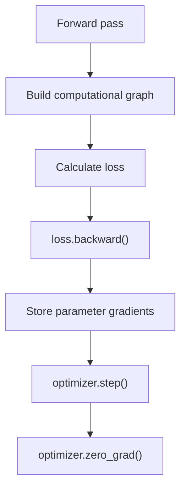
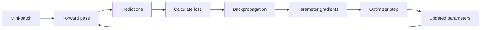

# 006 — Backpropagation

**Course:** 03 — Machine Learning and Deep Learning
**Module:** Module 07 — Deep Learning
**Content Group:** Neural Network Basics
**Roadmap Source:** Deep Learning / Neural Network Basics
**Lesson Type:** Deep Learning
**Order in Module:** 006
**Suggested Duration:** 24 minutes

---

## 1. Summary

**Backpropagation** is the algorithm used to calculate how much each weight and bias in a neural network contributes to the model's prediction error.

It works by:

1. Running data forward through the network.
2. Measuring the prediction error with a loss function.
3. Moving backward through the computational graph.
4. Applying the chain rule to calculate gradients.
5. Passing those gradients to an optimizer, which updates the parameters.

Backpropagation does **not** update the parameters by itself. It computes the gradients needed by optimization algorithms such as:

* Gradient Descent
* Stochastic Gradient Descent
* SGD with Momentum
* RMSProp
* Adam

Backpropagation is the mathematical engine behind the training of modern neural networks, including CNNs, RNNs, LSTMs, and Transformers.

---

## 2. Learning Objectives

After completing this lesson, you should be able to:

* Explain backpropagation in your own words.
* Distinguish between backpropagation and gradient descent.
* Describe the forward pass and backward pass.
* Explain why the chain rule is necessary.
* Calculate a simple gradient manually.
* Interpret a gradient as parameter sensitivity.
* Explain how gradients flow through a multilayer neural network.
* Implement a simple backward pass with NumPy.
* Use automatic differentiation in PyTorch.
* Identify vanishing gradients, exploding gradients, and other common training problems.

---

## 3. Prerequisite Knowledge

Before studying backpropagation, you should understand:

* Neurons and layers
* Weights and biases
* Activation functions
* Loss functions
* Derivatives and partial derivatives
* The chain rule
* Gradient descent

Backpropagation combines these concepts into one efficient training procedure.

---

## 4. Core Idea

A neural network makes predictions using a sequence of mathematical operations.

For one neuron:

$$
z = wx + b
$$

$$
a = \sigma(z)
$$

where:

* (x) is the input.
* (w) is the weight.
* (b) is the bias.
* (z) is the weighted input, also called the pre-activation.
* (\sigma) is an activation function.
* (a) is the neuron output.

The prediction is compared with the correct target (y) using a loss function:

$$
L = \frac{1}{2}(a-y)^2
$$

The training problem is:

> How should (w) and (b) change so that (L) becomes smaller?

Backpropagation answers this question by calculating:

$$
\frac{\partial L}{\partial w}
$$

and:

$$
\frac{\partial L}{\partial b}
$$

These quantities tell us how sensitive the loss is to small changes in each parameter.

A large gradient means that a small parameter change may strongly affect the loss. A small gradient means that the parameter currently has less influence on the loss. This sensitivity interpretation is central to understanding backpropagation.

---

## 5. Forward Pass and Backward Pass

Training a neural network has two major computational stages.

### 5.1 Forward Pass

During the forward pass, information moves from the input layer toward the output layer.



The forward pass produces:

* Intermediate weighted sums
* Activations
* A prediction
* A loss value

The network must save some intermediate values because they are needed during backpropagation.

### 5.2 Backward Pass

During the backward pass, gradient information moves from the loss toward the earlier layers.



At every operation, backpropagation:

1. Receives an upstream gradient.
2. Computes the local derivative of the operation.
3. Multiplies them using the chain rule.
4. Passes the resulting gradient to preceding operations.

---

## 6. Backpropagation and Gradient Descent Are Different

These concepts are closely related but perform different jobs.

| Concept             | Responsibility                                 |
| ------------------- | ---------------------------------------------- |
| Forward propagation | Computes predictions and loss                  |
| Backpropagation     | Computes gradients                             |
| Gradient descent    | Uses gradients to update parameters            |
| Optimizer           | Defines the specific parameter-update strategy |

Backpropagation calculates:

$$
\nabla_\theta L
$$

where (\theta) represents all trainable parameters.

Gradient descent then updates the parameters:

$$
\theta \leftarrow \theta-\eta\nabla_\theta L
$$

where:

* (\eta) is the learning rate.
* (\nabla_\theta L) is the gradient of the loss.

Therefore:

> Backpropagation tells us which direction the loss increases. The optimizer moves the parameters in the opposite direction.

---

## 7. The Chain Rule

The chain rule is the mathematical foundation of backpropagation.

Suppose:

$$
y=f(x)
$$

and:

$$
L=g(y)
$$

Then:

$$
\frac{dL}{dx} = \frac{dL}{dy} \frac{dy}{dx}
$$

For a neuron:

$$
x,w,b \rightarrow z \rightarrow a \rightarrow L
$$

The derivative of the loss with respect to the weight is:

$$
\frac{\partial L}{\partial w} = \frac{\partial L}{\partial a} \frac{\partial a}{\partial z} \frac{\partial z}{\partial w}
$$

This can be interpreted as:

$$
\text{Total sensitivity} = \text{loss sensitivity} \times \text{activation sensitivity} \times \text{weighted-sum sensitivity}
$$

The same chain-rule pattern is repeatedly applied from the output layer toward the input layer.

---

## 8. Derivation for a Single Neuron

Consider the following neuron:

$$
z=wx+b
$$

$$
a=\sigma(z)
$$

$$
L=\frac{1}{2}(a-y)^2
$$

We want to calculate:

$$
\frac{\partial L}{\partial w}
$$

Using the chain rule:

$$
\frac{\partial L}{\partial w} = \frac{\partial L}{\partial a} \frac{\partial a}{\partial z} \frac{\partial z}{\partial w}
$$

### Step 1: Derivative of the Loss

$$
L=\frac{1}{2}(a-y)^2
$$

Therefore:

$$
\frac{\partial L}{\partial a}=a-y
$$

The factor (\frac{1}{2}) is commonly used because it cancels the (2) produced by differentiating the square.

Without the factor (\frac{1}{2}):

$$
L=(a-y)^2
$$

and:

$$
\frac{\partial L}{\partial a}=2(a-y)
$$

### Step 2: Derivative of the Activation

For the sigmoid function:

$$
\sigma(z)=\frac{1}{1+e^{-z}}
$$

Its derivative is:

$$
\sigma'(z)=\sigma(z)(1-\sigma(z))
$$

Because (a=\sigma(z)):

$$
\frac{\partial a}{\partial z}=a(1-a)
$$

### Step 3: Derivative of the Weighted Sum

Because:

$$
z=wx+b
$$

we have:

$$
\frac{\partial z}{\partial w}=x
$$

and:

$$
\frac{\partial z}{\partial b}=1
$$

### Step 4: Combine the Derivatives

Therefore:

$$
\boxed{ \frac{\partial L}{\partial w} = (a-y)a(1-a)x }
$$

For the bias:

$$
\boxed{ \frac{\partial L}{\partial b} = (a-y)a(1-a) }
$$

The weight gradient contains (x), meaning that the influence of a weight depends partly on the activation entering that connection.

---

## 9. Numerical Example

Assume:

$$
x=2
$$

$$
w=0.5
$$

$$
b=0
$$

$$
y=1
$$

Use sigmoid activation and squared-error loss.

### 9.1 Forward Pass

Calculate the weighted input:

$$
z=wx+b
$$

$$
z=(0.5)(2)+0=1
$$

Apply sigmoid:

$$
a=\sigma(1)\approx 0.7311
$$

Calculate the loss:

$$
L=\frac{1}{2}(0.7311-1)^2
$$

$$
L\approx 0.0362
$$

### 9.2 Backward Pass

Loss derivative:

$$
\frac{\partial L}{\partial a} = # a-y # 0.7311-1 -0.2689
$$

Sigmoid derivative:

$$
\frac{\partial a}{\partial z} = a(1-a)
$$

$$
\frac{\partial a}{\partial z} \approx 0.7311(1-0.7311) \approx 0.1966
$$

Weighted-sum derivative:

$$
\frac{\partial z}{\partial w}=x=2
$$

Combine the derivatives:

$$
\frac{\partial L}{\partial w} = (-0.2689)(0.1966)(2)
$$

$$
\frac{\partial L}{\partial w} \approx -0.1058
$$

For the bias:

$$
\frac{\partial L}{\partial b} = (-0.2689)(0.1966) \approx -0.0529
$$

### 9.3 Parameter Update

Let the learning rate be:

$$
\eta=0.1
$$

Update the weight:

$$
w_{\text{new}} = w-\eta\frac{\partial L}{\partial w}
$$

$$
w_{\text{new}} = 0.5-0.1(-0.1058)
$$

$$
w_{\text{new}} \approx 0.5106
$$

Update the bias:

$$
b_{\text{new}} = 0-0.1(-0.0529)
$$

$$
b_{\text{new}} \approx 0.0053
$$

The weight and bias increase because the current prediction is below the target.

---

## 10. Computational Graph Interpretation

A neural network can be represented as a computational graph.

For the single-neuron example:



Each node:

* Performs a local mathematical operation.
* Stores its output during the forward pass.
* Knows how to calculate its local derivative.
* Receives a gradient during the backward pass.
* Passes gradients to its inputs.

This graph-based view is more practical than trying to differentiate one enormous symbolic expression. Real neural networks may contain thousands or millions of operations, but the same local-gradient principle still applies.

---

## 11. Local Gradients and Upstream Gradients

Suppose an operation produces:

$$
y=f(x)
$$

During backpropagation, the operation receives:

$$
\frac{\partial L}{\partial y}
$$

This is the **upstream gradient**.

The operation calculates its local derivative:

$$
\frac{\partial y}{\partial x}
$$

It then produces:

$$
\frac{\partial L}{\partial x} = \frac{\partial L}{\partial y} \frac{\partial y}{\partial x}
$$

Therefore:

$$
\boxed{ \text{downstream gradient} = \text{upstream gradient} \times \text{local gradient} }
$$

This is the basic rule implemented by automatic differentiation systems.

---

## 12. Gradients Through Common Operations

### Addition

If:

$$
z=x+y
$$

then:

$$
\frac{\partial z}{\partial x}=1
$$

$$
\frac{\partial z}{\partial y}=1
$$

The upstream gradient is copied to both inputs.

### Multiplication

If:

$$
z=xy
$$

then:

$$
\frac{\partial z}{\partial x}=y
$$

$$
\frac{\partial z}{\partial y}=x
$$

Each input receives the upstream gradient multiplied by the other input.

### ReLU

$$
\text{ReLU}(z)=\max(0,z)
$$

Its derivative is:

$$
\text{ReLU}'(z) = \begin{cases} 1, & z>0 \ 0, & z<0 \end{cases}
$$

When (z<0), the gradient is blocked.

### Sigmoid

$$
\sigma'(z)=\sigma(z)(1-\sigma(z))
$$

The maximum sigmoid derivative is (0.25). Repeated multiplication by small sigmoid derivatives can cause gradients to shrink in deep networks.

---

## 13. Backpropagation in a Multilayer Network

For layer (l):

$$
z^{[l]} = W^{[l]}a^{[l-1]}+b^{[l]}
$$

$$
a^{[l]} = g^{[l]}(z^{[l]})
$$

where:

* (W^{[l]}) is the weight matrix.
* (b^{[l]}) is the bias vector.
* (z^{[l]}) is the pre-activation vector.
* (a^{[l]}) is the activation vector.
* (g^{[l]}) is the activation function.

The forward pass is:

$$
a^{[0]}=x
$$

$$
z^{[1]}=W^{[1]}a^{[0]}+b^{[1]}
$$

$$
a^{[1]}=g^{[1]}(z^{[1]})
$$

$$
\cdots
$$

$$
a^{[L]}=\hat{y}
$$

---

## 14. The Error Term

The backward pass is often expressed using an error term:

$$
\delta^{[l]} = \frac{\partial L}{\partial z^{[l]}}
$$

For the output layer:

$$
\delta^{[L]} = \frac{\partial L}{\partial a^{[L]}} \odot g'^{[L]}(z^{[L]})
$$

where (\odot) represents element-wise multiplication.

For a hidden layer:

$$
\boxed{ \delta^{[l]} = \left(W^{[l+1]}\right)^T \delta^{[l+1]} \odot g'^{[l]}(z^{[l]}) }
$$

This equation contains two important ideas:

1. The error is propagated backward through the next layer's weights.
2. The propagated error is multiplied by the current activation derivative.

Once (\delta^{[l]}) is known:

$$
\boxed{ \frac{\partial L}{\partial W^{[l]}} = \delta^{[l]} \left(a^{[l-1]}\right)^T }
$$

and:

$$
\boxed{ \frac{\partial L}{\partial b^{[l]}} = \delta^{[l]} }
$$

For a mini-batch, gradients are normally summed or averaged across the examples.

---

## 15. Why Gradients from Multiple Paths Are Added

A hidden neuron may influence several neurons in the next layer.



The hidden neuron affects the loss through both paths.

Therefore:

$$
\frac{\partial L}{\partial h} = \frac{\partial L}{\partial o_1} \frac{\partial o_1}{\partial h} + \frac{\partial L}{\partial o_2} \frac{\partial o_2}{\partial h}
$$

Gradients from different downstream paths must be **summed**.

This is why a hidden-layer error contains a weighted sum of the errors from the following layer.

---

## 16. Vectorized Backpropagation

Suppose a mini-batch contains (m) examples.

For layer (l):

$$
Z^{[l]} = W^{[l]}A^{[l-1]}+b^{[l]}
$$

$$
A^{[l]} = g^{[l]}(Z^{[l]})
$$

The gradients are:

$$
dZ^{[l]} = dA^{[l]} \odot g'^{[l]}(Z^{[l]})
$$

$$
dW^{[l]} = \frac{1}{m} dZ^{[l]} \left(A^{[l-1]}\right)^T
$$

$$
db^{[l]} = \frac{1}{m} \sum_{i=1}^{m}dZ_i^{[l]}
$$

$$
dA^{[l-1]} = \left(W^{[l]}\right)^T dZ^{[l]}
$$

The same scalar mathematics is being used, but arrays and matrix multiplication allow many examples and neurons to be processed efficiently in parallel.

Modern deep-learning frameworks perform backpropagation on tensors rather than individual scalar values, but the mathematical principle is unchanged.

---

## 17. Automatic Differentiation

Libraries such as PyTorch automatically build a computational graph during the forward pass.

When you call:

```python
loss.backward()
```

PyTorch traverses the graph backward and applies the chain rule.



The gradients are stored in each parameter's `.grad` attribute.

Automatic differentiation does not remove the need to understand backpropagation. It automates the repetitive derivative calculations while using the same principles of local derivatives, chain-rule multiplication, and gradient accumulation.

---

## 18. NumPy Demo: Manual Backpropagation

The following example trains one sigmoid neuron on a single observation.

```python
import numpy as np


def sigmoid(z: float) -> float:
    return 1.0 / (1.0 + np.exp(-z))


def sigmoid_derivative_from_activation(a: float) -> float:
    return a * (1.0 - a)


# Training example
x = 2.0
target = 1.0

# Parameters
weight = 0.5
bias = 0.0
learning_rate = 0.1

for step in range(10):
    # -------------------------
    # Forward pass
    # -------------------------
    z = weight * x + bias
    prediction = sigmoid(z)

    # Half squared-error loss
    loss = 0.5 * (prediction - target) ** 2

    # -------------------------
    # Backward pass
    # -------------------------
    d_loss_d_prediction = prediction - target
    d_prediction_d_z = sigmoid_derivative_from_activation(prediction)

    d_loss_d_z = d_loss_d_prediction * d_prediction_d_z

    d_loss_d_weight = d_loss_d_z * x
    d_loss_d_bias = d_loss_d_z

    # -------------------------
    # Parameter update
    # -------------------------
    weight -= learning_rate * d_loss_d_weight
    bias -= learning_rate * d_loss_d_bias

    print(
        f"step={step:02d} "
        f"loss={loss:.6f} "
        f"prediction={prediction:.6f} "
        f"weight={weight:.6f} "
        f"bias={bias:.6f}"
    )
```

Expected behavior:

* The prediction gradually approaches (1).
* The loss gradually decreases.
* The weight and bias move in the direction suggested by their gradients.

---

## 19. PyTorch Demo: Automatic Backpropagation

```python
import torch

# Input and target
x = torch.tensor([2.0])
target = torch.tensor([1.0])

# Trainable parameters
weight = torch.tensor([0.5], requires_grad=True)
bias = torch.tensor([0.0], requires_grad=True)

learning_rate = 0.1

for step in range(10):
    # Forward pass
    z = weight * x + bias
    prediction = torch.sigmoid(z)
    loss = 0.5 * (prediction - target).pow(2).mean()

    # Backward pass
    loss.backward()

    # Disable gradient tracking during parameter updates
    with torch.no_grad():
        weight -= learning_rate * weight.grad
        bias -= learning_rate * bias.grad

    # Clear accumulated gradients
    weight.grad.zero_()
    bias.grad.zero_()

    print(
        f"step={step:02d} "
        f"loss={loss.item():.6f} "
        f"prediction={prediction.item():.6f}"
    )
```

Important details:

* `requires_grad=True` tells PyTorch to track operations involving the tensor.
* `loss.backward()` computes gradients.
* `torch.no_grad()` prevents the update operation from becoming part of the graph.
* Gradients must be cleared because PyTorch accumulates them by default.

---

## 20. Standard PyTorch Training Loop

In a real project, the training loop usually looks like this:

```python
for inputs, targets in train_loader:
    optimizer.zero_grad()

    predictions = model(inputs)
    loss = loss_function(predictions, targets)

    loss.backward()
    optimizer.step()
```

The order is important:

1. Clear old gradients.
2. Compute predictions.
3. Compute the loss.
4. Run backpropagation.
5. Update the parameters.

---

## 21. Why Backpropagation Is Efficient

A naive approach could calculate each derivative independently.

However, many derivatives share the same intermediate calculations.

Backpropagation reuses these intermediate results by applying **reverse-mode automatic differentiation**.

For a model with:

* Many parameters
* A scalar loss

reverse-mode differentiation calculates all parameter gradients at a computational cost that is typically only a small multiple of the forward pass.

This makes it suitable for neural networks containing millions or billions of parameters.

---

## 22. Vanishing Gradients

A vanishing gradient occurs when gradients become extremely small as they move backward through many layers.

For example, sigmoid derivatives satisfy:

$$
0 < \sigma'(z) \leq 0.25
$$

In a deep network, repeated multiplication may produce:

$$
0.2 \times 0.2 \times 0.2 \times \cdots \approx 0
$$

As a result:

* Early layers learn very slowly.
* Training may appear stuck.
* Long-range dependencies become difficult to learn.

Possible solutions include:

* ReLU or related activation functions
* Xavier or He initialization
* Batch normalization
* Residual connections
* LSTM or GRU architectures
* Appropriate learning-rate selection

---

## 23. Exploding Gradients

An exploding gradient occurs when gradients grow excessively large during backpropagation.

Possible symptoms include:

* Extremely large loss values
* Unstable parameter updates
* `NaN` values
* Training divergence

Possible solutions include:

* Gradient clipping
* Better weight initialization
* Normalization
* Residual connections
* A smaller learning rate
* Stable activation and loss functions

Example in PyTorch:

```python
torch.nn.utils.clip_grad_norm_(
    model.parameters(),
    max_norm=1.0,
)
```

---

## 24. Numerical and Analytical Gradients

There are two common ways to obtain gradients.

### Analytical Gradient

This gradient is calculated using differentiation and backpropagation.

Advantages:

* Fast
* Exact up to floating-point precision
* Suitable for model training

Disadvantages:

* Implementation errors are possible

### Numerical Gradient

A numerical derivative can be approximated using:

$$
\frac{\partial L}{\partial \theta} \approx \frac{L(\theta+\epsilon)-L(\theta-\epsilon)} {2\epsilon}
$$

Advantages:

* Simple
* Useful for verifying an implementation

Disadvantages:

* Very slow
* Sensitive to the choice of (\epsilon)
* Not suitable for training large models

Numerical gradients are commonly used for **gradient checking**, not for normal optimization.

---

## 25. Gradient Checking

Suppose backpropagation produces an analytical gradient:

$$
g_{\text{analytical}}
$$

and finite differences produce:

$$
g_{\text{numerical}}
$$

A relative error can be calculated as:

$$
\text{relative error} = \frac{ \left\lVert g_{\text{analytical}}-g_{\text{numerical}} \right\rVert }{ \left\lVert g_{\text{analytical}}\right\rVert + \left\lVert g_{\text{numerical}}\right\rVert + \epsilon }
$$

A small relative error suggests that the backward implementation is probably correct.

Gradient checking should normally be performed:

* On a small network
* With a small dataset
* Without stochastic layers
* Using double precision when possible
* Before full-scale training

---

## 26. Backpropagation Training Workflow



A complete experiment usually includes:

```text
dataset
→ preprocessing
→ model architecture
→ forward pass
→ loss calculation
→ backpropagation
→ optimizer update
→ validation metrics
→ train/validation curves
→ error analysis
```

For classification, error analysis may include:

* Accuracy
* Precision
* Recall
* F1-score
* Confusion matrix
* Per-class performance

---

## 27. Practical Exercise

### Exercise A: Manual Gradient

Given:

$$
x=3,\quad w=0.2,\quad b=0.1,\quad y=1
$$

and:

$$
a=\sigma(wx+b)
$$

$$
L=\frac{1}{2}(a-y)^2
$$

Calculate:

1. (z)
2. (a)
3. (L)
4. (\frac{\partial L}{\partial a})
5. (\frac{\partial a}{\partial z})
6. (\frac{\partial z}{\partial w})
7. (\frac{\partial L}{\partial w})
8. The new weight after one update with (\eta=0.1)

### Exercise B: Compare Manual and Automatic Gradients

Implement the same calculation with:

* NumPy
* PyTorch autograd

Compare the manually calculated gradient with:

```python
weight.grad
```

They should be approximately equal.

### Exercise C: Train a Small Classifier

Train a small neural network on one of the following datasets:

* Iris
* Two Moons
* MNIST subset
* Fashion-MNIST subset

Track:

* Training loss
* Validation loss
* Training accuracy
* Validation accuracy

Then plot the curves across epochs.

### Exercise D: Inspect Gradient Magnitudes

For each layer, record:

$$
\left\lVert \frac{\partial L}{\partial W^{[l]}} \right\rVert
$$

Investigate whether gradients:

* Become smaller in earlier layers
* Become excessively large
* Remain within a stable range

---

## 28. Suggested Mini Project

### Image Classification: Small CNN vs. Transfer Learning

Build two models:

1. A small CNN trained from scratch.
2. A pretrained model used with transfer learning.

Suggested datasets:

* CIFAR-10 subset
* Cats vs. Dogs
* Intel Image Classification
* A small custom image dataset

Compare:

* Training time
* Training loss
* Validation loss
* Accuracy
* Precision and recall
* Confusion matrix
* Gradient behavior
* Overfitting behavior

Document:

* Why backpropagation is still required for transfer learning
* Which layers are frozen
* Which layers receive gradients
* Whether fine-tuning improves performance
* Whether the dataset is large enough to justify deep learning

---

## 29. Common Mistakes

### 29.1 Confusing Backpropagation with Gradient Descent

Backpropagation computes gradients. Gradient descent uses them.

### 29.2 Forgetting to Clear Gradients

PyTorch accumulates gradients by default.

Incorrect:

```python
loss.backward()
optimizer.step()
```

Correct:

```python
optimizer.zero_grad()
loss.backward()
optimizer.step()
```

### 29.3 Updating Parameters While Tracking Gradients

Manual parameter updates should occur inside:

```python
with torch.no_grad():
    ...
```

### 29.4 Breaking the Computational Graph

Operations such as the following may detach values from the graph:

```python
tensor.detach()
tensor.item()
tensor.numpy()
```

This is useful in some situations but may accidentally prevent gradient calculation.

### 29.5 Using Incompatible Activation and Loss Functions

Examples:

* Multiclass classification commonly uses raw logits with cross-entropy loss.
* Binary classification commonly uses one logit with binary cross-entropy with logits.
* Applying softmax manually before a loss that already includes softmax can cause numerical and gradient problems.

### 29.6 Ignoring Gradient Scale

Very small gradients may indicate vanishing gradients.

Very large gradients may indicate exploding gradients.

### 29.7 Using Deep Learning When Classical ML Is Enough

Before selecting a deep model, consider:

* Dataset size
* Feature structure
* Training cost
* Interpretability requirements
* Baseline performance
* Deployment constraints

### 29.8 Ignoring Overfitting

A decreasing training loss does not guarantee generalization.

Always compare:

* Training loss
* Validation loss
* Training metrics
* Validation metrics

### 29.9 Ignoring Data and Label Quality

Backpropagation optimizes the objective it receives. It cannot automatically correct:

* Incorrect labels
* Biased sampling
* Data leakage
* Missing classes
* Poor preprocessing
* Inconsistent annotation

---

## 30. Completion Checklist

* [ ] I can explain backpropagation in one or two minutes.
* [ ] I understand the difference between backpropagation and gradient descent.
* [ ] I can describe the forward pass and backward pass.
* [ ] I can apply the chain rule to a simple neuron.
* [ ] I understand upstream and local gradients.
* [ ] I can explain why gradients from multiple paths are added.
* [ ] I can calculate a simple weight gradient manually.
* [ ] I can implement a small backward pass with NumPy.
* [ ] I can use `loss.backward()` in PyTorch.
* [ ] I remember to clear accumulated gradients.
* [ ] I can recognize vanishing and exploding gradients.
* [ ] I have created a notebook, model, chart, API, or portfolio note for this lesson.
* [ ] I have documented at least one assumption, limitation, or unanswered question.

---

## 31. Related Outcome

Understand neural networks, CNNs, RNNs, LSTMs, Transformers, and transfer learning at a practical level.

Backpropagation is the shared mathematical mechanism that allows these architectures to learn from prediction errors.

---

## 32. Key Takeaways

1. Backpropagation efficiently calculates the gradient of the loss with respect to every trainable parameter.
2. It works by applying the chain rule backward through a computational graph.
3. Every operation combines an upstream gradient with a local derivative.
4. Gradients measure how sensitive the loss is to small parameter changes.
5. Gradient descent or another optimizer uses the gradients to update parameters.
6. Hidden-layer gradients combine contributions from every downstream path.
7. Modern frameworks automate backpropagation through automatic differentiation.
8. Understanding gradient flow is essential for diagnosing unstable or ineffective training.
9. Lower training loss does not automatically mean better generalization.
10. Data quality, loss design, model architecture, initialization, and optimization all affect the learning process.

---

## 33. Final Summary

**Backpropagation** is the mechanism that converts a model's prediction error into useful gradient information.

The complete training cycle is:

```text
input data
→ forward pass
→ prediction
→ loss
→ backward pass
→ gradients
→ optimizer update
→ improved parameters
```

Although the notation can initially appear complicated, the central idea is consistent:

$$
\boxed{ \text{Gradient passed backward} = \text{upstream gradient} \times \text{local derivative} }
$$

Once this idea is understood, backpropagation becomes a repeated application of the chain rule across a computational graph rather than a mysterious neural-network procedure.

---

# Bài luyện tập

## Mục tiêu


## Đề bài


## Yêu cầu hoàn thành

- [ ] 
- [ ] 
- [ ] 

## Kết quả / lời giải


## Ghi chú
