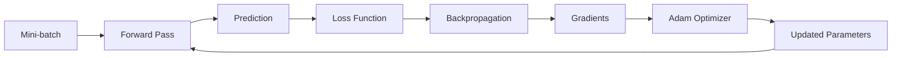
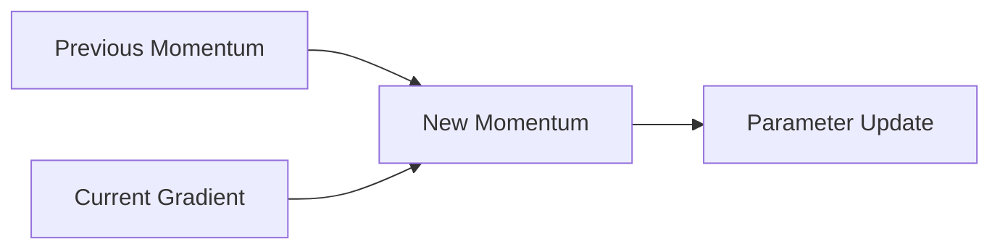
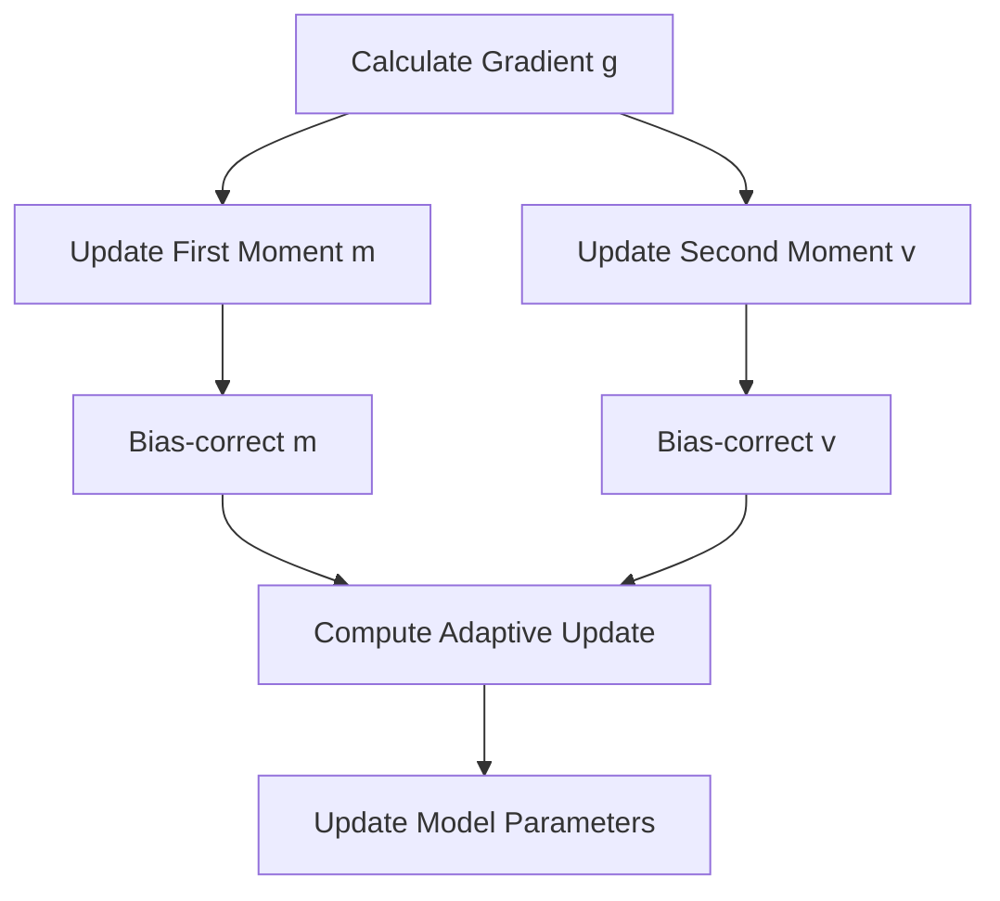
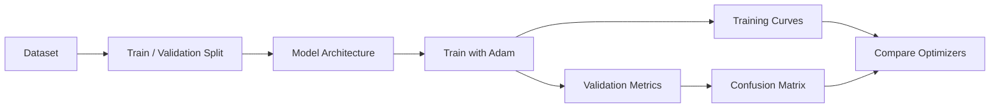
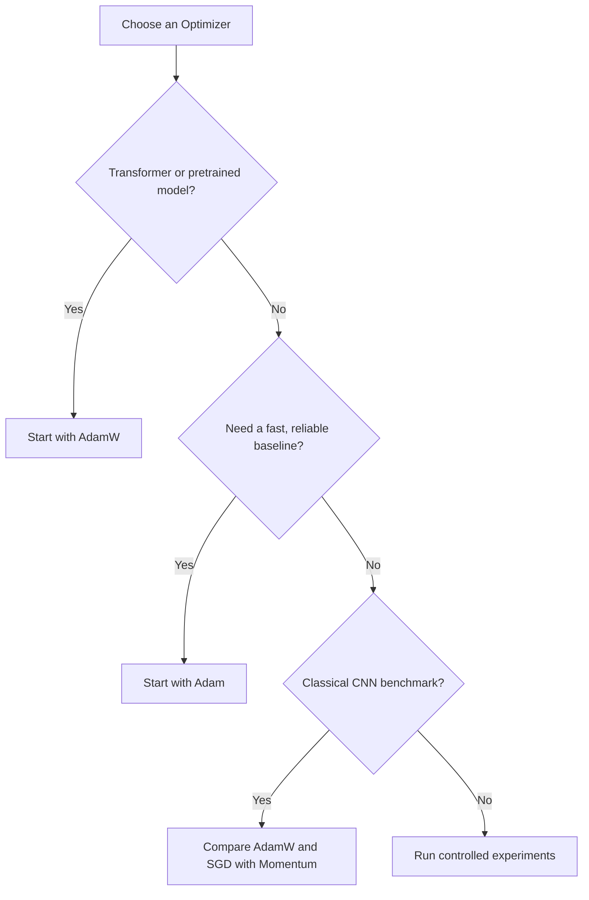

# 008 — Adam Optimizer

**Course:** 03 — Machine Learning and Deep Learning
**Module:** Module 07 — Deep Learning
**Content Group:** Neural Network Basics
**Roadmap Source:** Deep Learning / Neural Network Basics
**Lesson Type:** Deep Learning
**Lesson Order:** 008
**Suggested Duration:** 24 minutes

---

## 1. Summary

This lesson explains the **Adam optimizer**, one of the most widely used optimization algorithms in deep learning.

Adam combines two important ideas:

1. **Momentum** — smooths gradients and accelerates movement in useful directions.
2. **RMSProp** — adapts the learning rate separately for each parameter.

Adam also applies **bias correction** because its moving averages are initialized at zero.

After completing this lesson, you should understand:

* Where Adam appears in the neural-network training process.
* How Adam updates model parameters.
* Why Adam uses first- and second-moment estimates.
* How Adam differs from SGD, Momentum, and RMSProp.
* Which hyperparameters matter most.
* When Adam or AdamW is a reasonable choice.

---

## 2. Learning Objectives

By the end of this lesson, you should be able to:

* Explain Adam in your own words.
* Describe how Adam combines Momentum and RMSProp.
* Write the Adam update equations.
* Explain the purpose of bias correction.
* Configure Adam in PyTorch or TensorFlow.
* Compare Adam with SGD and SGD with Momentum.
* Diagnose common Adam training problems.
* Run a small experiment comparing multiple optimizers.

---

## 3. Adam in the Deep-Learning Workflow

A neural network is normally trained through the following loop:



Adam does not calculate the loss or perform backpropagation.

Its responsibility begins **after gradients have been calculated**.

```text
Input data
    ↓
Neural network
    ↓
Prediction
    ↓
Loss
    ↓
Backpropagation
    ↓
Gradients
    ↓
Adam parameter update
```

For each model parameter, Adam receives a gradient and decides how large the update should be.

---

## 4. Why Do We Need an Optimizer?

The objective of training is to find parameters that minimize a loss function:

$$
\theta^* = \arg\min_{\theta} L(\theta)
$$

where:

* (\theta) represents all model parameters.
* (L(\theta)) is the loss function.
* (\theta^*) is the parameter configuration that minimizes the loss.

The gradient indicates the direction of the steepest increase in loss:

$$
\nabla_{\theta}L(\theta)
$$

Therefore, moving in the opposite direction should reduce the loss.

The basic gradient-descent update is:

$$
\theta_t = \theta_{t-1} - \alpha g_t
$$

where:

* (t) is the current optimization step.
* (\alpha) is the learning rate.
* (g_t = \nabla_\theta L(\theta_{t-1})) is the current gradient.

This approach works, but it has several limitations:

* Gradients from mini-batches can be noisy.
* Training may oscillate across steep dimensions.
* One fixed learning rate is used for every parameter.
* Parameters with small or sparse gradients may learn slowly.
* A large learning rate can cause instability or divergence.

Adam addresses several of these limitations.

---

## 5. From SGD to Adam

### 5.1 Stochastic Gradient Descent

SGD updates parameters using the current mini-batch gradient:

$$
\theta_t = \theta_{t-1} - \alpha g_t
$$

SGD is simple and computationally efficient, but its path toward a minimum can be noisy.

```text
SGD path:

Start
  ↘
   ↙
    ↘
     ↙
      Minimum
```

---

### 5.2 Momentum

Momentum maintains an exponentially weighted moving average of previous gradients:

$$
m_t = \beta_1m_{t-1} + (1-\beta_1)g_t
$$

The parameter update becomes:

$$
\theta_t = \theta_{t-1} - \alpha m_t
$$

Momentum has two main effects:

* It reduces oscillation when gradients repeatedly change direction.
* It accelerates learning when gradients consistently point in the same direction.

A useful analogy is a ball rolling downhill. The ball builds velocity as it continues moving in a consistent direction.



---

### 5.3 RMSProp

RMSProp maintains an exponentially weighted average of squared gradients:

$$
v_t = \beta_2v_{t-1} + (1-\beta_2)g_t^2
$$

The square is applied element by element.

Parameters are updated using:

$$
\theta_t = \theta_{t-1} - \alpha \frac{g_t} {\sqrt{v_t}+\epsilon}
$$

RMSProp gives every parameter an adaptive update scale.

* A parameter with consistently large gradients receives smaller updates.
* A parameter with small gradients receives relatively larger updates.
* Directions with strong oscillation are dampened.

The value (\epsilon) prevents division by zero and improves numerical stability.

---

### 5.4 Adam

Adam combines both approaches:

```text
Momentum
    └── Tracks the moving average of gradients

RMSProp
    └── Tracks the moving average of squared gradients

Momentum + RMSProp + Bias Correction
    └── Adam
```

The name **Adam** comes from:

> **Adaptive Moment Estimation**

Adam estimates:

* The **first raw moment** of the gradients: the mean-like moving average.
* The **second raw moment** of the gradients: the moving average of squared gradients.

---

## 6. Adam Equations

Let the current gradient be:

$$
g_t = \nabla_{\theta}L(\theta_{t-1})
$$

### Step 1: Update the first-moment estimate

$$
m_t = \beta_1m_{t-1} + (1-\beta_1)g_t
$$

This is the Momentum component.

It estimates the average direction of recent gradients.

---

### Step 2: Update the second-moment estimate

$$
v_t = \beta_2v_{t-1} + (1-\beta_2)g_t^2
$$

This is the RMSProp component.

It estimates the recent magnitude of squared gradients.

---

### Step 3: Correct the initialization bias

Adam normally initializes:

$$
m_0 = 0
$$

$$
v_0 = 0
$$

During the first optimization steps, both estimates are biased toward zero. Adam corrects this bias:

$$
\hat{m}_t = \frac{m_t}{1-\beta_1^t}
$$

$$
\hat{v}_t = \frac{v_t}{1-\beta_2^t}
$$

The correction is especially important during the early training steps.

As (t) becomes large:

$$
\beta_1^t \rightarrow 0
$$

$$
\beta_2^t \rightarrow 0
$$

Therefore, the correction factors gradually approach 1.

---

### Step 4: Update the parameters

$$
\theta_t = \theta_{t-1} - \alpha \frac{\hat{m}_t} {\sqrt{\hat{v}_t}+\epsilon}
$$

This equation contains both key ideas:

* (\hat{m}_t) controls the update direction using Momentum.
* (\sqrt{\hat{v}_t}) scales the update separately for each parameter.

---

## 7. Complete Adam Algorithm

```text
Initialize:
    parameters θ
    first moment m = 0
    second moment v = 0
    step t = 0

For each mini-batch:
    1. Perform the forward pass
    2. Calculate the loss
    3. Calculate gradients using backpropagation
    4. Increase t by 1
    5. Update the first moment:
           m = β₁m + (1 - β₁)g
    6. Update the second moment:
           v = β₂v + (1 - β₂)g²
    7. Apply bias correction:
           m_hat = m / (1 - β₁ᵗ)
           v_hat = v / (1 - β₂ᵗ)
    8. Update parameters:
           θ = θ - α × m_hat / (sqrt(v_hat) + ε)
```

### Algorithm diagram



---

## 8. Understanding Each Hyperparameter

### 8.1 Learning rate (\alpha)

The learning rate controls the overall size of parameter updates.

A common starting value is:

$$
\alpha = 0.001
$$

The learning rate is usually the most important Adam hyperparameter to tune.

Possible symptoms:

| Learning rate   | Possible behavior              |
| --------------- | ------------------------------ |
| Too small       | Training is very slow          |
| Reasonable      | Loss decreases smoothly        |
| Too large       | Loss oscillates or diverges    |
| Extremely large | Loss becomes `NaN` or infinite |

Values worth testing may include:

```text
1e-2
3e-3
1e-3
3e-4
1e-4
```

The best value depends on the model, batch size, normalization, dataset, and learning-rate schedule.

---

### 8.2 First-moment decay (\beta_1)

A common default is:

$$
\beta_1 = 0.9
$$

This parameter controls how much Adam remembers previous gradients.

* Higher (\beta_1): smoother updates and more momentum.
* Lower (\beta_1): faster response to recent gradient changes.

The effective averaging window is approximately related to:

$$
\frac{1}{1-\beta_1}
$$

For (\beta_1=0.9), this corresponds roughly to the most recent 10 steps.

---

### 8.3 Second-moment decay (\beta_2)

A common default is:

$$
\beta_2 = 0.999
$$

This parameter controls the moving average of squared gradients.

A large value produces a stable estimate of gradient magnitude.

Lowering (\beta_2) makes Adam react faster to changes in gradient scale, but it may also make updates noisier.

---

### 8.4 Numerical-stability constant (\epsilon)

A common value is:

$$
\epsilon = 10^{-8}
$$

Its main purpose is to prevent division by zero or division by an extremely small value.

In most projects, (\epsilon) is left at the framework default.

---

## 9. Numerical Example

Suppose a model has one parameter with:

$$
\theta_0 = 2.0
$$

Assume:

$$
g_1 = 0.5
$$

and use:

$$
\alpha = 0.001
$$

$$
\beta_1 = 0.9
$$

$$
\beta_2 = 0.999
$$

$$
\epsilon = 10^{-8}
$$

Initialize:

$$
m_0 = 0
$$

$$
v_0 = 0
$$

### First-moment estimate

$$
m_1 = 0.9(0) + 0.1(0.5) = 0.05
$$

### Second-moment estimate

$$
v_1 = 0.999(0) + 0.001(0.5^2)
$$

$$
v_1 = 0.00025
$$

### Bias correction

$$
\hat{m}_1 = # \frac{0.05}{1-0.9} 0.5
$$

$$
\hat{v}_1 = # \frac{0.00025}{1-0.999} 0.25
$$

### Parameter update

$$
\theta_1 = 2.0 - 0.001 \frac{0.5} {\sqrt{0.25}+10^{-8}}
$$

Approximately:

$$
\theta_1 = # 2.0-0.001 1.999
$$

Without bias correction, the first update would be excessively influenced by the zero initialization.

---

## 10. Adam Compared with Other Optimizers

| Optimizer         | Momentum | Adaptive parameter-wise scaling |      Bias correction |
| ----------------- | -------: | ------------------------------: | -------------------: |
| SGD               |       No |                              No |                   No |
| SGD with Momentum |      Yes |                              No | Usually not required |
| AdaGrad           |       No |                             Yes |                   No |
| RMSProp           |       No |                             Yes |           Usually no |
| Adam              |      Yes |                             Yes |                  Yes |
| AdamW             |      Yes |                             Yes |                  Yes |

### General comparison

| Property                  | SGD with Momentum      | Adam                                       |
| ------------------------- | ---------------------- | ------------------------------------------ |
| Initial convergence       | Often slower           | Often faster                               |
| Learning-rate sensitivity | High                   | Usually more forgiving                     |
| Sparse gradients          | Can struggle           | Often works well                           |
| Memory usage              | Lower                  | Higher                                     |
| Parameter state           | One momentum buffer    | First and second moments                   |
| Final generalization      | Can be strong          | Depends on the problem                     |
| Common use                | Classical CNN training | Transformers, NLP, general experimentation |

Adam is not guaranteed to outperform SGD on every task.

A common practical pattern is:

```text
Fast baseline or Transformer training
    → AdamW

Some image-classification settings
    → SGD with Momentum may remain competitive

Final decision
    → Compare validation performance experimentally
```

---

## 11. Adam Versus AdamW

Adam is often used with regularization. However, directly adding L2 regularization to the loss does not produce exactly the same behavior as independently decaying the weights under an adaptive optimizer.

**AdamW** separates weight decay from the gradient-based Adam update.

Conceptually:

```text
Adam:
    gradient update may include the L2 penalty

AdamW:
    Adam gradient update
    +
    separate weight-decay update
```

A simplified AdamW-style update is:

$$
\theta_t = \theta_{t-1} - \alpha \frac{\hat{m}_t} {\sqrt{\hat{v}_t}+\epsilon} - \alpha\lambda\theta_{t-1}
$$

where (\lambda) is the weight-decay coefficient.

AdamW is commonly preferred for:

* Transformers.
* Large language models.
* Vision Transformers.
* Fine-tuning pretrained neural networks.
* Models where explicit weight decay is important.

---

## 12. PyTorch Example

```python
import torch
from torch import nn
from torch.optim import Adam

model = nn.Sequential(
    nn.Linear(20, 64),
    nn.ReLU(),
    nn.Linear(64, 2),
)

optimizer = Adam(
    model.parameters(),
    lr=1e-3,
    betas=(0.9, 0.999),
    eps=1e-8,
)

criterion = nn.CrossEntropyLoss()

for inputs, targets in train_loader:
    # Clear gradients from the previous iteration.
    optimizer.zero_grad()

    # Forward pass.
    predictions = model(inputs)

    # Calculate loss.
    loss = criterion(predictions, targets)

    # Backpropagation.
    loss.backward()

    # Adam parameter update.
    optimizer.step()
```

### Using AdamW

```python
from torch.optim import AdamW

optimizer = AdamW(
    model.parameters(),
    lr=3e-4,
    weight_decay=1e-2,
)
```

The standard training order is:

```text
optimizer.zero_grad()
        ↓
forward pass
        ↓
calculate loss
        ↓
loss.backward()
        ↓
optimizer.step()
```

---

## 13. TensorFlow/Keras Example

```python
import tensorflow as tf

model = tf.keras.Sequential([
    tf.keras.layers.Dense(64, activation="relu"),
    tf.keras.layers.Dense(2, activation="softmax"),
])

optimizer = tf.keras.optimizers.Adam(
    learning_rate=1e-3,
    beta_1=0.9,
    beta_2=0.999,
    epsilon=1e-7,
)

model.compile(
    optimizer=optimizer,
    loss="sparse_categorical_crossentropy",
    metrics=["accuracy"],
)
```

Framework defaults can differ slightly, especially for (\epsilon). Always check the implementation when reproducing experiments.

---

## 14. Minimal NumPy Implementation

```python
import numpy as np


class Adam:
    def __init__(
        self,
        learning_rate: float = 1e-3,
        beta1: float = 0.9,
        beta2: float = 0.999,
        epsilon: float = 1e-8,
    ) -> None:
        self.learning_rate = learning_rate
        self.beta1 = beta1
        self.beta2 = beta2
        self.epsilon = epsilon

        self.first_moment = None
        self.second_moment = None
        self.step_count = 0

    def update(
        self,
        parameters: np.ndarray,
        gradients: np.ndarray,
    ) -> np.ndarray:
        if self.first_moment is None:
            self.first_moment = np.zeros_like(parameters)

        if self.second_moment is None:
            self.second_moment = np.zeros_like(parameters)

        self.step_count += 1

        # First-moment estimate.
        self.first_moment = (
            self.beta1 * self.first_moment
            + (1.0 - self.beta1) * gradients
        )

        # Second-moment estimate.
        self.second_moment = (
            self.beta2 * self.second_moment
            + (1.0 - self.beta2) * np.square(gradients)
        )

        # Bias correction.
        corrected_first_moment = (
            self.first_moment
            / (1.0 - self.beta1 ** self.step_count)
        )

        corrected_second_moment = (
            self.second_moment
            / (1.0 - self.beta2 ** self.step_count)
        )

        update = (
            self.learning_rate
            * corrected_first_moment
            / (
                np.sqrt(corrected_second_moment)
                + self.epsilon
            )
        )

        return parameters - update
```

This implementation illustrates the core algorithm. A production optimizer must additionally handle:

* Multiple parameter tensors.
* Mixed precision.
* Distributed training.
* Weight decay.
* Gradient accumulation.
* Device placement.
* Optimizer-state serialization.

---

## 15. Training and Evaluation Workflow

A practical experiment should evaluate more than training loss.



Track at least:

* Training loss.
* Validation loss.
* Training accuracy.
* Validation accuracy.
* Number of epochs to reach a target metric.
* Best validation score.
* Final test score.
* Training time.
* Gradient norm, when debugging instability.

---

## 16. Practical Exercise

### Task

Train a small image classifier and compare:

1. SGD.
2. SGD with Momentum.
3. Adam.
4. AdamW.

A suitable dataset could be:

* MNIST.
* Fashion-MNIST.
* CIFAR-10.
* A small custom image dataset.

### Experimental controls

Keep the following fixed:

* Dataset split.
* Model architecture.
* Number of epochs.
* Batch size.
* Random seed.
* Data preprocessing.
* Evaluation metric.

Tune the learning rate separately for each optimizer.

Using the same learning rate for all optimizers is not necessarily a fair comparison.

### Suggested result table

| Optimizer      | Learning rate | Best validation accuracy | Final validation loss | Training time |
| -------------- | ------------: | -----------------------: | --------------------: | ------------: |
| SGD            |          0.01 |                        — |                     — |             — |
| SGD + Momentum |          0.01 |                        — |                     — |             — |
| Adam           |         0.001 |                        — |                     — |             — |
| AdamW          |        0.0003 |                        — |                     — |             — |

### Suggested visualizations

* Training-loss curve.
* Validation-loss curve.
* Training-accuracy curve.
* Validation-accuracy curve.
* Confusion matrix.
* Learning-rate curve, when a scheduler is used.

---

## 17. Common Mistakes

### Mistake 1: Treating Adam as universally optimal

Adam is a strong default, but optimizer performance depends on:

* Dataset.
* Model architecture.
* Batch size.
* Loss landscape.
* Learning-rate schedule.
* Regularization.
* Evaluation objective.

Always compare validation results.

---

### Mistake 2: Ignoring the learning rate

Adam adapts update sizes for individual parameters, but the global learning rate still matters.

Adam does not automatically remove the need for learning-rate tuning.

---

### Mistake 3: Using Adam when AdamW is intended

For many modern architectures, especially Transformers, AdamW is usually the clearer choice when weight decay is required.

---

### Mistake 4: Comparing optimizers with identical learning rates

Different optimizers operate on different effective update scales.

For example:

```text
SGD learning rate:       0.1 or 0.01
Adam learning rate:      0.001
AdamW learning rate:     0.0003 or 0.001
```

These are only starting points, not universal rules.

---

### Mistake 5: Forgetting to clear gradients

In PyTorch, gradients accumulate by default.

Incorrect:

```python
loss.backward()
optimizer.step()
```

Correct:

```python
optimizer.zero_grad()
loss.backward()
optimizer.step()
```

---

### Mistake 6: Updating parameters before backpropagation

The optimizer requires current gradients.

Correct order:

```text
Forward pass
    ↓
Loss
    ↓
Backward pass
    ↓
Optimizer step
```

---

### Mistake 7: Evaluating only training loss

A lower training loss does not guarantee better generalization.

Always inspect:

* Validation loss.
* Validation metrics.
* Overfitting.
* Test performance.

---

### Mistake 8: Ignoring unstable gradients

Adam does not automatically solve exploding gradients.

Possible solutions include:

* Lowering the learning rate.
* Applying gradient clipping.
* Checking input normalization.
* Inspecting the loss function.
* Using appropriate initialization.
* Checking for invalid labels or corrupted data.

Example:

```python
torch.nn.utils.clip_grad_norm_(
    model.parameters(),
    max_norm=1.0,
)
```

---

## 18. Practical Selection Guide



A reasonable practical strategy is:

1. Start with Adam or AdamW.
2. Tune the learning rate.
3. Monitor training and validation curves.
4. Add a learning-rate scheduler when appropriate.
5. Compare against SGD with Momentum when final generalization matters.
6. Select the optimizer using validation results rather than training speed alone.

---

## 19. Completion Checklist

* [ ] I can explain Adam in one or two minutes.
* [ ] I understand that Adam combines Momentum and RMSProp.
* [ ] I can write the first-moment equation.
* [ ] I can write the second-moment equation.
* [ ] I can explain why bias correction is required.
* [ ] I know the common default values for (\beta_1), (\beta_2), and (\epsilon).
* [ ] I understand that Adam still requires learning-rate tuning.
* [ ] I can implement Adam using PyTorch or TensorFlow.
* [ ] I know the conceptual difference between Adam and AdamW.
* [ ] I have compared at least two optimizers on the same model.
* [ ] I have plotted training and validation curves.
* [ ] I have recorded at least one limitation or open question.

---

## 20. Related Outcome

Understand neural networks, CNNs, RNNs, LSTMs, Transformers, optimization algorithms, and transfer learning at a practical level.

---

## 21. Related Project

### Mini Project: Image-Classification Optimizer Benchmark

Train a small CNN and compare:

* SGD.
* SGD with Momentum.
* Adam.
* AdamW.

Your portfolio artifact should contain:

* Dataset description.
* Model architecture.
* Optimizer configurations.
* Training and validation curves.
* Accuracy and loss comparison.
* Confusion matrix.
* Training-time comparison.
* Discussion of convergence and overfitting.
* Final optimizer recommendation.

---

## 22. Key Takeaways

Adam is an adaptive optimization algorithm that combines:

$$
\text{Adam} = \text{Momentum} + \text{RMSProp} + \text{Bias Correction}
$$

Its first-moment estimate tracks the average gradient direction:

$$
m_t = \beta_1m_{t-1} + (1-\beta_1)g_t
$$

Its second-moment estimate tracks squared-gradient magnitude:

$$
v_t = \beta_2v_{t-1} + (1-\beta_2)g_t^2
$$

The final update is:

$$
\theta_t = \theta_{t-1} - \alpha \frac{\hat{m}_t} {\sqrt{\hat{v}_t}+\epsilon}
$$

Adam often provides fast and stable initial training, but it is not automatically the best optimizer for every model.

The final choice should be based on:

* Validation performance.
* Convergence speed.
* Training stability.
* Generalization.
* Compute cost.
* Reproducible experiments.
