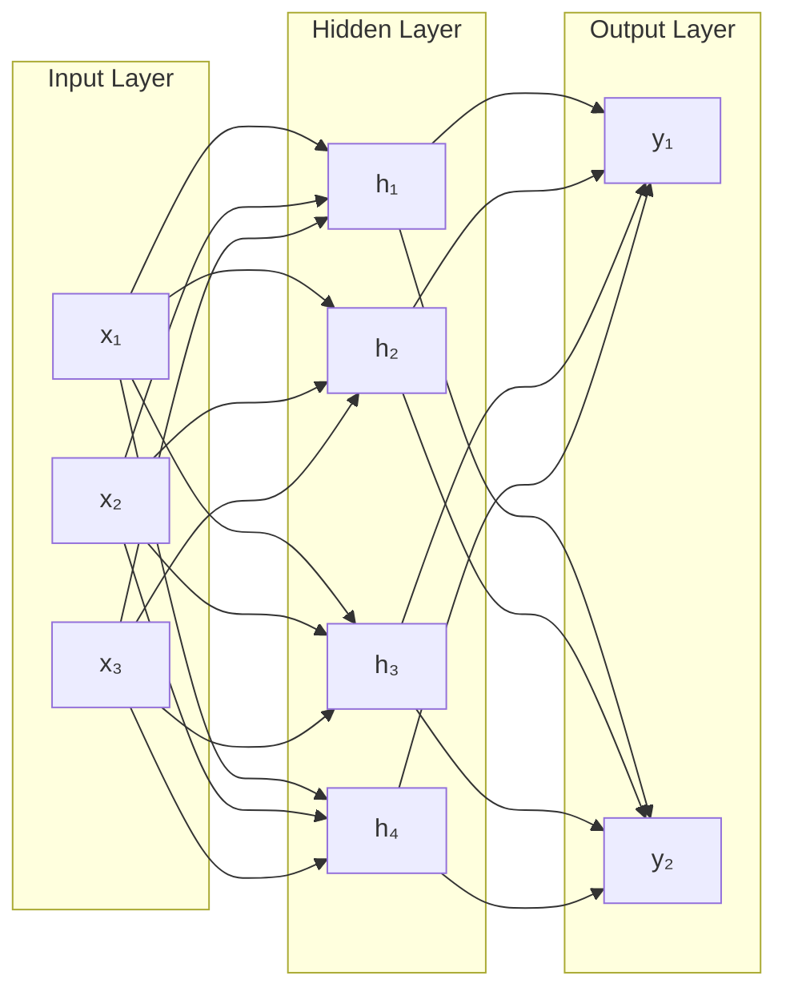
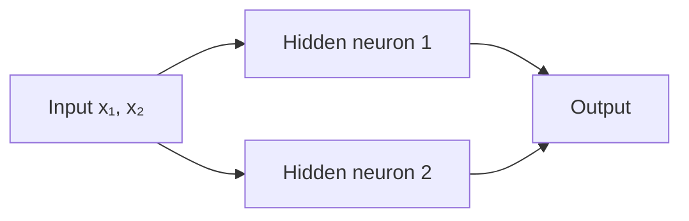
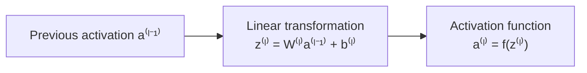
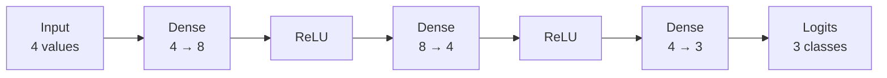
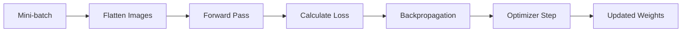
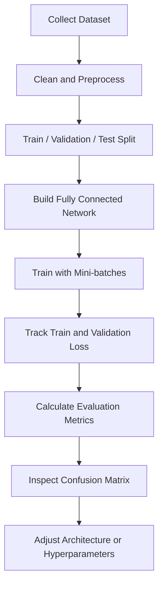

# 009 — Fully Connected Network

**Course:** 03 — Machine Learning and Deep Learning
**Module:** Module 07 — Deep Learning
**Content Group:** Architectures
**Roadmap Source:** Deep Learning / Architectures
**Lesson Type:** Deep Learning
**Lesson Order:** 009
**Suggested Duration:** 24 minutes

---

## 1. Summary

A **Fully Connected Network** is one of the simplest neural-network architectures. It is composed mainly of fully connected, or dense, layers.

A Fully Connected Network is also commonly called:

* **Dense Neural Network**
* **Feed-Forward Neural Network**
* **Multilayer Perceptron — MLP**

In a fully connected layer, every neuron receives information from every neuron in the previous layer.

For layer (l):

$$
z^{(l)} = W^{(l)}a^{(l-1)} + b^{(l)}
$$

$$
a^{(l)} = f^{(l)}\left(z^{(l)}\right)
$$

where:

* (a^{(l-1)}) is the input from the previous layer.
* (W^{(l)}) is the weight matrix.
* (b^{(l)}) is the bias vector.
* (z^{(l)}) is the linear transformation.
* (f^{(l)}) is the activation function.
* (a^{(l)}) is the output activation of the current layer.

Fully Connected Networks are useful for:

* Tabular-data classification.
* Tabular-data regression.
* Simple image-classification baselines.
* Learning nonlinear relationships.
* Understanding the foundations of deeper architectures.

---

## 2. Learning Objectives

By the end of this lesson, you should be able to:

* Explain a Fully Connected Network in your own words.
* Identify the input, hidden, and output layers.
* Describe how one dense layer transforms its input.
* Determine the shapes of weights, biases, inputs, and outputs.
* Calculate the number of trainable parameters.
* Explain why activation functions are necessary.
* Build and train a small MLP using PyTorch.
* Select an appropriate output layer and loss function.
* Compare a Fully Connected Network with a CNN.
* Diagnose overfitting, shape mismatches, and other common problems.

---

## 3. What Is a Fully Connected Network?

A Fully Connected Network is a neural network in which each neuron in one layer is connected to every neuron in the next layer.



Each connection has a trainable weight.

Each neuron usually also has a trainable bias.

The network learns by adjusting these weights and biases so that its predictions produce a lower loss.

---

## 4. Related Terminology

The following terms are closely related, although they are not always perfectly interchangeable.

### Dense Layer

A **dense layer** is one layer in which each output neuron is connected to every input value.

### Fully Connected Network

A **Fully Connected Network** is a network built primarily from dense layers.

### Feed-Forward Neural Network

A **feed-forward network** passes information from input to output without recurrent loops.

Fully Connected Networks are feed-forward networks, but not every feed-forward architecture must be fully connected. A CNN is also usually feed-forward, but it uses convolutional layers instead of connecting every input to every output.

### Multilayer Perceptron

An **MLP** normally refers to a feed-forward network with one or more hidden dense layers and nonlinear activation functions.

```text
Single linear layer
    → Linear model

Multiple dense layers without activation
    → Still equivalent to one linear transformation

Multiple dense layers with nonlinear activation
    → Multilayer Perceptron
```

---

## 5. Why One Perceptron Is Not Enough

A single perceptron can only represent a linear decision boundary.

For two input features, the decision boundary has the form:

$$
w_1x_1+w_2x_2+b=0
$$

This creates a straight line in two-dimensional space.

```text
Class A   Class A
    \     
     \  Linear boundary
      \
Class B   Class B
```

A single perceptron can solve linearly separable problems such as some forms of AND and OR.

However, it cannot solve a nonlinear problem such as XOR using only one linear boundary.

### XOR truth table

| (x_1) | (x_2) | XOR |
| ----: | ----: | --: |
|     0 |     0 |   0 |
|     0 |     1 |   1 |
|     1 |     0 |   1 |
|     1 |     1 |   0 |

No single line can separate both positive XOR points from both negative points.

Adding hidden layers and nonlinear activation functions allows the network to combine multiple linear boundaries into a nonlinear decision region.



This is one of the main reasons for using an MLP rather than a single perceptron.

---

## 6. Structure of an MLP

A typical MLP contains three types of layers.

### 6.1 Input Layer

The input layer receives feature values.

For tabular data:

$$
x= \begin{bmatrix} x_1\ x_2\ \vdots\ x_d \end{bmatrix}
$$

where (d) is the number of features.

For a (28\times28) grayscale image, the image may be flattened into:

$$
28\times28=784
$$

input values.

---

### 6.2 Hidden Layers

Hidden layers learn intermediate representations.

A hidden neuron may learn to react to:

* A combination of tabular features.
* A local intensity pattern in an image.
* A nonlinear threshold.
* An interaction between multiple variables.
* A higher-level pattern produced by earlier layers.

The term **hidden** means that these values are internal to the model. They are not directly supplied by the user and are not usually returned as the final prediction.

---

### 6.3 Output Layer

The output layer depends on the task.

| Task                      |      Output units | Typical output interpretation |
| ------------------------- | ----------------: | ----------------------------- |
| Regression                |         1 or more | Predicted numerical value     |
| Binary classification     |                 1 | Binary logit or probability   |
| Multiclass classification | Number of classes | One logit per class           |
| Multilabel classification |  Number of labels | Independent logit per label   |

---

## 7. Mathematics of One Fully Connected Layer

Suppose a layer receives:

$$
a^{(l-1)} \in \mathbb{R}^{n_{l-1}}
$$

and contains (n_l) neurons.

The weight matrix is:

$$
W^{(l)} \in \mathbb{R}^{n_l\times n_{l-1}}
$$

The bias vector is:

$$
b^{(l)} \in \mathbb{R}^{n_l}
$$

The linear transformation is:

$$
z^{(l)} = W^{(l)}a^{(l-1)} + b^{(l)}
$$

The activation is:

$$
a^{(l)} = f^{(l)}\left(z^{(l)}\right)
$$

Therefore:

$$
a^{(l)} \in \mathbb{R}^{n_l}
$$

### Transformation diagram



---

## 8. Neuron-Level View

For a single neuron (j) in layer (l):

$$
z_j^{(l)} = \sum_{i=1}^{n_{l-1}} W_{ji}^{(l)} a_i^{(l-1)} + b_j^{(l)}
$$

The neuron then applies an activation function:

$$
a_j^{(l)} = f\left(z_j^{(l)}\right)
$$

For example, with ReLU:

$$
a_j^{(l)} = \max\left(0,z_j^{(l)}\right)
$$

Each neuron learns a different combination of the previous layer's values because it has its own weights and bias.

---

## 9. Batch Form

Neural networks normally process a batch of samples simultaneously.

Suppose:

* (m) is the batch size.
* (n_{l-1}) is the number of input features.
* (n_l) is the number of output neurons.

Using samples as rows:

$$
A^{(l-1)} \in \mathbb{R}^{m\times n_{l-1}}
$$

$$
W^{(l)} \in \mathbb{R}^{n_{l-1}\times n_l}
$$

$$
b^{(l)} \in \mathbb{R}^{n_l}
$$

Then:

$$
Z^{(l)} = A^{(l-1)}W^{(l)} + b^{(l)}
$$

and:

$$
Z^{(l)} \in \mathbb{R}^{m\times n_l}
$$

The bias vector is automatically added to every row through **broadcasting**.

Conceptually:

$$
\begin{bmatrix} z_{11} & z_{12}\ z_{21} & z_{22}\ z_{31} & z_{32} \end{bmatrix} + \begin{bmatrix} b_1 & b_2 \end{bmatrix}
$$

means:

$$
\begin{bmatrix} z_{11}+b_1 & z_{12}+b_2\ z_{21}+b_1 & z_{22}+b_2\ z_{31}+b_1 & z_{32}+b_2 \end{bmatrix}
$$

The framework does not need to create multiple physical copies of the bias vector.

---

## 10. Why Activation Functions Are Necessary

Suppose two dense layers use no nonlinear activation:

$$
h=W_1x+b_1
$$

$$
y=W_2h+b_2
$$

Substituting the first equation:

$$
y = W_2(W_1x+b_1)+b_2
$$

$$
y = W_2W_1x+W_2b_1+b_2
$$

Define:

$$
W'=W_2W_1
$$

$$
b'=W_2b_1+b_2
$$

Then:

$$
y=W'x+b'
$$

Therefore, multiple linear layers without nonlinear activations are equivalent to one linear layer.

Nonlinear activation functions allow the network to learn nonlinear relationships.

### Common hidden-layer activations

#### ReLU

$$
\text{ReLU}(z)=\max(0,z)
$$

Advantages:

* Simple.
* Computationally efficient.
* Commonly effective in hidden layers.
* Helps reduce some vanishing-gradient problems.

#### Sigmoid

$$
\sigma(z)=\frac{1}{1+e^{-z}}
$$

Sigmoid maps values to ((0,1)), but it can saturate and produce small gradients.

#### Tanh

$$
\tanh(z)= \frac{e^z-e^{-z}} {e^z+e^{-z}}
$$

Tanh maps values to ((-1,1)), but it can also suffer from saturation.

For many basic MLPs, ReLU is a reasonable hidden-layer default.

---

## 11. Forward Pass Through a Complete Network

Consider the architecture:

```text
Input: 4 features
    ↓
Dense: 8 neurons
    ↓
ReLU
    ↓
Dense: 4 neurons
    ↓
ReLU
    ↓
Dense: 3 output neurons
```

The calculations are:

$$
z^{(1)}=W^{(1)}x+b^{(1)}
$$

$$
a^{(1)}=\text{ReLU}\left(z^{(1)}\right)
$$

$$
z^{(2)}=W^{(2)}a^{(1)}+b^{(2)}
$$

$$
a^{(2)}=\text{ReLU}\left(z^{(2)}\right)
$$

$$
z^{(3)}=W^{(3)}a^{(2)}+b^{(3)}
$$

For multiclass classification, (z^{(3)}) normally contains the **logits**.



---

## 12. Understanding Logits

A logit is a raw model score before conversion into a probability.

Example:

$$
z= \begin{bmatrix} 1.2 & -0.4 & 2.5 \end{bmatrix}
$$

The largest logit corresponds to class 2.

Softmax converts the logits into probabilities:

$$
P(y=k\mid x) = \frac{e^{z_k}} {\sum_j e^{z_j}}
$$

However, in PyTorch, `CrossEntropyLoss` expects raw logits and internally combines:

* Log-softmax.
* Negative log-likelihood loss.

Therefore, do not apply softmax inside the model when using `CrossEntropyLoss`.

Correct:

```python
logits = model(inputs)
loss = criterion(logits, labels)
```

Incorrect:

```python
probabilities = torch.softmax(model(inputs), dim=1)
loss = criterion(probabilities, labels)
```

---

## 13. Counting Trainable Parameters

For a dense layer with:

* (n_{\text{in}}) inputs.
* (n_{\text{out}}) output neurons.

The number of weights is:

$$
n_{\text{in}}\times n_{\text{out}}
$$

The number of biases is:

$$
n_{\text{out}}
$$

Therefore:

$$
\text{Parameters} = n_{\text{in}}n_{\text{out}} + n_{\text{out}}
$$

or:

$$
\text{Parameters} = (n_{\text{in}}+1)n_{\text{out}}
$$

### Example

For:

```text
784 → 128 → 64 → 10
```

Layer 1:

$$
784\times128+128 = 100{,}480
$$

Layer 2:

$$
128\times64+64 = 8{,}256
$$

Output layer:

$$
64\times10+10 = 650
$$

Total:

$$
100{,}480+8{,}256+650 = 109{,}386
$$

This demonstrates why fully connected layers can contain many parameters.

---

## 14. Example: MNIST Digit Classification

MNIST images have the shape:

$$
1\times28\times28
$$

where:

* 1 is the number of channels.
* 28 is the height.
* 28 is the width.

A Fully Connected Network requires a vector, so the image is flattened:

$$
1\times28\times28 \rightarrow 784
$$

A simple architecture is:

```text
784 input values
    ↓
128 hidden neurons
    ↓
ReLU
    ↓
64 hidden neurons
    ↓
ReLU
    ↓
10 output logits
```

Each output corresponds to one digit:

```text
0, 1, 2, 3, 4, 5, 6, 7, 8, 9
```

---

## 15. PyTorch Model Implementation

```python
import torch
from torch import nn


class FullyConnectedNetwork(nn.Module):
    def __init__(
        self,
        input_size: int = 784,
        hidden_size_1: int = 128,
        hidden_size_2: int = 64,
        number_of_classes: int = 10,
    ) -> None:
        super().__init__()

        self.network = nn.Sequential(
            nn.Linear(input_size, hidden_size_1),
            nn.ReLU(),
            nn.Linear(hidden_size_1, hidden_size_2),
            nn.ReLU(),
            nn.Linear(hidden_size_2, number_of_classes),
        )

    def forward(self, inputs: torch.Tensor) -> torch.Tensor:
        # Convert images from [batch, channel, height, width]
        # to [batch, input_size].
        flattened_inputs = torch.flatten(inputs, start_dim=1)

        # Return raw logits.
        return self.network(flattened_inputs)
```

Create the model:

```python
device = torch.device(
    "cuda" if torch.cuda.is_available() else "cpu"
)

model = FullyConnectedNetwork().to(device)
```

---

## 16. Training Configuration

```python
from torch import nn
from torch.optim import Adam

criterion = nn.CrossEntropyLoss()

optimizer = Adam(
    model.parameters(),
    lr=1e-3,
)
```

The complete training flow is:



---

## 17. PyTorch Training Loop

```python
def train_one_epoch(
    model: nn.Module,
    data_loader,
    criterion: nn.Module,
    optimizer: torch.optim.Optimizer,
    device: torch.device,
) -> tuple[float, float]:
    model.train()

    total_loss = 0.0
    total_correct = 0
    total_samples = 0

    for images, labels in data_loader:
        images = images.to(device)
        labels = labels.to(device)

        # Clear gradients from the previous mini-batch.
        optimizer.zero_grad()

        # Forward pass.
        logits = model(images)

        # Calculate loss.
        loss = criterion(logits, labels)

        # Backpropagation.
        loss.backward()

        # Update weights and biases.
        optimizer.step()

        batch_size = labels.size(0)

        total_loss += loss.item() * batch_size
        total_correct += (
            logits.argmax(dim=1) == labels
        ).sum().item()
        total_samples += batch_size

    average_loss = total_loss / total_samples
    accuracy = total_correct / total_samples

    return average_loss, accuracy
```

---

## 18. Validation Loop

```python
@torch.no_grad()
def evaluate(
    model: nn.Module,
    data_loader,
    criterion: nn.Module,
    device: torch.device,
) -> tuple[float, float]:
    model.eval()

    total_loss = 0.0
    total_correct = 0
    total_samples = 0

    for images, labels in data_loader:
        images = images.to(device)
        labels = labels.to(device)

        logits = model(images)
        loss = criterion(logits, labels)

        batch_size = labels.size(0)

        total_loss += loss.item() * batch_size
        total_correct += (
            logits.argmax(dim=1) == labels
        ).sum().item()
        total_samples += batch_size

    average_loss = total_loss / total_samples
    accuracy = total_correct / total_samples

    return average_loss, accuracy
```

---

## 19. Complete Training Process

```python
number_of_epochs = 10

for epoch in range(number_of_epochs):
    train_loss, train_accuracy = train_one_epoch(
        model=model,
        data_loader=train_loader,
        criterion=criterion,
        optimizer=optimizer,
        device=device,
    )

    validation_loss, validation_accuracy = evaluate(
        model=model,
        data_loader=validation_loader,
        criterion=criterion,
        device=device,
    )

    print(
        f"Epoch {epoch + 1:02d} | "
        f"Train Loss: {train_loss:.4f} | "
        f"Train Accuracy: {train_accuracy:.4f} | "
        f"Validation Loss: {validation_loss:.4f} | "
        f"Validation Accuracy: {validation_accuracy:.4f}"
    )
```

---

## 20. Choosing the Output Layer

### Regression

For one numerical prediction:

```python
nn.Linear(hidden_size, 1)
```

A common loss is:

```python
nn.MSELoss()
```

Usually, no output activation is needed for unrestricted regression.

---

### Binary Classification

Output one logit:

```python
nn.Linear(hidden_size, 1)
```

Use:

```python
nn.BCEWithLogitsLoss()
```

Do not place sigmoid in the model because `BCEWithLogitsLoss` already applies a numerically stable sigmoid operation.

---

### Multiclass Classification

Output one logit for each class:

```python
nn.Linear(hidden_size, number_of_classes)
```

Use:

```python
nn.CrossEntropyLoss()
```

Do not apply softmax before this loss.

---

### Multilabel Classification

Output one independent logit per label:

```python
nn.Linear(hidden_size, number_of_labels)
```

Use:

```python
nn.BCEWithLogitsLoss()
```

---

## 21. Fully Connected Networks for Tabular Data

Fully Connected Networks are often more naturally suited to tabular features than raw images.

Example input:

```text
age
income
account_age
number_of_transactions
average_order_value
support_ticket_count
```

These features can be represented as a vector:

$$
x\in\mathbb{R}^d
$$

A network might be:

```text
d input features
    ↓
Dense 128
    ↓
ReLU
    ↓
Dropout
    ↓
Dense 64
    ↓
ReLU
    ↓
Dense output
```

Important preprocessing steps include:

* Handling missing values.
* Scaling numerical features.
* Encoding categorical variables.
* Preventing data leakage.
* Separating train, validation, and test data correctly.

For small or medium tabular datasets, tree-based models such as XGBoost, LightGBM, or CatBoost may outperform a basic MLP. The choice should be evaluated experimentally.

---

## 22. Why MLPs Are Limited for Images

An MLP can classify images, but flattening an image removes its explicit spatial structure.

For example:

$$
28\times28 \rightarrow 784
$$

After flattening, the network no longer directly knows that:

* Two pixels are adjacent.
* A pattern appears in the top-left corner.
* A group of pixels forms an edge.
* The same shape can appear in different positions.

A CNN preserves spatial structure and uses shared filters.

### Parameter comparison

A dense layer from a (224\times224\times3) image to 1,000 neurons requires:

$$
224\times224\times3\times1000 = 150{,}528{,}000
$$

weights, before counting biases.

This is extremely expensive.

A convolutional layer can detect local patterns with far fewer parameters.

```text
Raw image
    ├── MLP: flatten all pixels
    │       └── loses explicit spatial structure
    │
    └── CNN: process local regions
            └── preserves spatial relationships
```

Therefore:

* MLPs are useful as simple image baselines.
* CNNs are normally better for image understanding.
* Dense layers are still often used near the output of CNN architectures.

---

## 23. Advantages

A Fully Connected Network has several advantages:

* Simple architecture.
* Easy to implement.
* Easy to understand mathematically.
* Flexible input and output dimensions.
* Capable of learning nonlinear relationships.
* Useful as a baseline model.
* Works well with vectorized or tabular data.
* Forms the foundation of many advanced architectures.

Dense transformations also appear inside:

* CNN classifiers.
* Transformer feed-forward blocks.
* Autoencoders.
* Recommendation systems.
* Reinforcement-learning policies.
* Embedding projection layers.

---

## 24. Limitations

### Large Parameter Count

Every input connects to every output.

This can create millions of parameters.

### Overfitting

A large MLP can memorize a small dataset.

### Loss of Spatial Structure

Flattened images do not preserve explicit neighborhood relationships.

### Computational and Memory Cost

Large weight matrices require significant memory and computation.

### Architecture Selection

The number of layers and neurons is not automatically known.

### Feature Scaling Sensitivity

Training can be unstable when input features have very different numerical scales.

### Limited Interpretability

Individual hidden neurons are not always easy to interpret.

---

## 25. Regularization Techniques

### Dropout

Dropout randomly disables some activations during training:

```python
self.network = nn.Sequential(
    nn.Linear(784, 128),
    nn.ReLU(),
    nn.Dropout(p=0.3),
    nn.Linear(128, 64),
    nn.ReLU(),
    nn.Linear(64, 10),
)
```

### Weight Decay

```python
optimizer = torch.optim.AdamW(
    model.parameters(),
    lr=1e-3,
    weight_decay=1e-4,
)
```

### Early Stopping

Stop training when validation performance no longer improves.

### Smaller Architecture

Reduce the number of layers or neurons when the model is unnecessarily large.

### More Training Data

More representative data often reduces overfitting.

---

## 26. Training and Evaluation Workflow



For classification, useful metrics include:

* Accuracy.
* Precision.
* Recall.
* F1-score.
* ROC-AUC for appropriate binary tasks.
* Confusion matrix.

For regression, useful metrics include:

* MAE.
* MSE.
* RMSE.
* (R^2).

---

## 27. Practical Exercise

### Exercise: MNIST MLP Classifier

Build a Fully Connected Network with:

```text
Input: 784
Hidden layer 1: 128
Hidden layer 2: 64
Output: 10
```

Use:

* ReLU activation.
* Cross-entropy loss.
* Adam optimizer.
* Batch size of 64 or 128.
* Five to ten epochs.

### Required outputs

1. Training-loss curve.
2. Validation-loss curve.
3. Training-accuracy curve.
4. Validation-accuracy curve.
5. Confusion matrix.
6. Test accuracy.
7. Parameter count.
8. Several incorrect predictions.

### Experiment

Compare:

```text
Model A: 784 → 32 → 10
Model B: 784 → 128 → 64 → 10
Model C: 784 → 256 → 128 → 64 → 10
```

Record:

| Model   | Parameters | Best validation accuracy | Test accuracy | Training time |
| ------- | ---------: | -----------------------: | ------------: | ------------: |
| Model A |          — |                        — |             — |             — |
| Model B |          — |                        — |             — |             — |
| Model C |          — |                        — |             — |             — |

Then answer:

* Does a larger model always perform better?
* Which model overfits most?
* Which model provides the best performance-to-compute trade-off?

---

## 28. Common Mistakes

### Mistake 1: Forgetting to Flatten an Image

Incorrect input:

```text
[batch, 1, 28, 28]
```

Expected by a dense layer:

```text
[batch, 784]
```

Fix:

```python
images = torch.flatten(images, start_dim=1)
```

---

### Mistake 2: Incorrect Layer Dimensions

Incorrect:

```python
nn.Linear(128, 64)
nn.Linear(32, 10)
```

The second layer outputs 64 values, but the next layer expects 32.

Correct:

```python
nn.Linear(128, 64)
nn.Linear(64, 10)
```

---

### Mistake 3: No Activation Between Dense Layers

This:

```python
nn.Linear(784, 128)
nn.Linear(128, 64)
nn.Linear(64, 10)
```

is effectively one linear transformation.

Add nonlinear activations:

```python
nn.Linear(784, 128)
nn.ReLU()
nn.Linear(128, 64)
nn.ReLU()
nn.Linear(64, 10)
```

---

### Mistake 4: Applying Softmax Before Cross-Entropy Loss

`CrossEntropyLoss` expects raw logits.

Do not add softmax to the training model output.

---

### Mistake 5: Ignoring Feature Scaling

For tabular data, features such as age, income, and transaction count may use very different scales.

Standardization is often useful:

$$
x'=\frac{x-\mu}{\sigma}
$$

Fit the scaler only on the training data to avoid leakage.

---

### Mistake 6: Building an Unnecessarily Large Network

More layers and neurons increase:

* Training time.
* Memory usage.
* Overfitting risk.
* Hyperparameter complexity.

Begin with a small architecture and increase capacity only when needed.

---

### Mistake 7: Monitoring Only Training Accuracy

A model may reach very high training accuracy while performing poorly on validation data.

Always compare:

```text
Training loss      vs. Validation loss
Training accuracy  vs. Validation accuracy
```

---

### Mistake 8: Using an MLP When a Simpler Model Is Enough

For some tabular datasets, logistic regression, random forest, or gradient-boosted trees may be simpler and more effective.

Deep learning should be selected based on evidence, not only because it is more complex.

---

## 29. Debugging Tensor Shapes

A useful debugging pattern is to print tensor shapes:

```python
def forward(self, inputs: torch.Tensor) -> torch.Tensor:
    print("Input:", inputs.shape)

    inputs = torch.flatten(inputs, start_dim=1)
    print("Flattened:", inputs.shape)

    outputs = self.network(inputs)
    print("Output:", outputs.shape)

    return outputs
```

Expected MNIST shapes:

```text
Input:      [64, 1, 28, 28]
Flattened:  [64, 784]
Output:     [64, 10]
```

A more production-friendly method is to use assertions:

```python
assert inputs.ndim == 4
assert inputs.shape[1:] == (1, 28, 28)
```

---

## 30. Completion Checklist

* [ ] I can explain what a Fully Connected Network is.
* [ ] I understand the terms Dense Network, Feed-Forward Network, and MLP.
* [ ] I can identify the input, hidden, and output layers.
* [ ] I can write the dense-layer equation.
* [ ] I can determine the shapes of (W), (b), input, and output.
* [ ] I understand bias broadcasting.
* [ ] I can explain why nonlinear activation functions are required.
* [ ] I can calculate the number of trainable parameters.
* [ ] I can build an MLP in PyTorch.
* [ ] I know when to use logits, sigmoid, and softmax.
* [ ] I can train and evaluate an MLP.
* [ ] I understand why CNNs are usually better for image data.
* [ ] I have plotted training and validation curves.
* [ ] I have created a confusion matrix.
* [ ] I have recorded at least one limitation or open question.

---

## 31. Related Outcome

Understand neural networks, Fully Connected Networks, CNNs, RNNs, LSTMs, Transformers, and transfer learning at a practical level.

---

## 32. Related Project

### Mini Project: MLP Versus CNN for Image Classification

Train two models on Fashion-MNIST or MNIST:

1. A Fully Connected Network.
2. A small Convolutional Neural Network.

Compare:

* Number of parameters.
* Training time.
* Training accuracy.
* Validation accuracy.
* Test accuracy.
* Confusion matrix.
* Common classification errors.

The project should explain why the CNN can use image structure more effectively than the MLP.

---

## 33. Key Takeaways

A Fully Connected Network applies a sequence of dense transformations:

$$
z^{(l)} = W^{(l)}a^{(l-1)} + b^{(l)}
$$

$$
a^{(l)} = f^{(l)}\left(z^{(l)}\right)
$$

Every neuron connects to every value in the previous layer.

A complete MLP follows this pattern:

```text
Input
    ↓
Linear transformation
    ↓
Nonlinear activation
    ↓
Linear transformation
    ↓
Nonlinear activation
    ↓
Output logits or prediction
```

The activation functions are essential. Without them, multiple dense layers collapse into one linear transformation.

Fully Connected Networks are:

* Excellent for learning neural-network fundamentals.
* Useful for vectorized and tabular data.
* Reasonable as simple image baselines.
* Less suitable than CNNs for exploiting image structure.
* Important building blocks inside modern deep-learning systems.

The most important practical habits are:

* Track tensor shapes.
* Count model parameters.
* Match the output layer to the task.
* Use the correct loss function.
* Monitor both training and validation results.
* Compare the MLP with simpler and more specialized models.

---

# Bài luyện tập

## Mục tiêu


## Đề bài


## Yêu cầu hoàn thành

- [ ] 
- [ ] 
- [ ] 

## Kết quả / lời giải


## Ghi chú
