# 011 — Recurrent Neural Networks

**Course:** 03 — Machine Learning and Deep Learning
**Module:** Module 07 — Deep Learning
**Content Group:** Architectures
**Roadmap Source:** Deep Learning / Architectures
**Lesson Type:** Deep Learning
**Order in Module:** 011
**Suggested Duration:** 24 minutes

---

## 1. Summary

A **Recurrent Neural Network**, or **RNN**, is a neural-network architecture designed for **sequential data**.

Unlike a standard feedforward neural network, an RNN maintains a hidden state that carries information from previous time steps. This allows the model to process data in which order and context matter.

Common examples of sequential data include:

* Text and natural language
* Time-series measurements
* Audio signals
* Sensor readings
* Financial data
* User activity sequences
* DNA and biological sequences

An RNN processes a sequence one element at a time:

```text
current input + previous hidden state
                    |
                    v
             new hidden state
                    |
                    v
              current output
```

The same RNN parameters are reused at every time step. This parameter sharing allows the model to process sequences of different lengths and recognize similar patterns at different positions in a sequence.

---

## 2. Learning Objectives

After completing this lesson, you should be able to:

* Explain the main idea of an RNN in your own words.
* Describe why ordinary feedforward networks are limited for sequential data.
* Explain the roles of the input, hidden state and output.
* Write the basic forward-pass equations of a vanilla RNN.
* Distinguish common RNN input-output architectures.
* Prepare time-series or text data for an RNN.
* Train a small RNN model and evaluate its performance.
* Explain vanishing and exploding gradients.
* Describe when LSTM, GRU or Transformers may be better choices.

---

## 3. Why Do We Need RNNs?

### 3.1 Order matters in sequential data

Consider the following sentences:

```text
The dog chased the cat.
The cat chased the dog.
```

They contain nearly the same words, but their meanings are different because the order is different.

Similarly, in a temperature sequence:

```text
20, 21, 22, 23, 24
```

the model should understand that the values form an increasing pattern.

A standard dense neural network usually treats all features as one fixed vector. It does not naturally represent temporal order or maintain a memory of previous observations.

---

### 3.2 Variable-length sequences

Different sequences may have different lengths:

```text
"I liked it."

"The movie was visually impressive but the story was too predictable."
```

A standard dense network normally expects a fixed-size input. Sequences can be padded to the same length, but the model still needs a mechanism for understanding order and context.

RNNs process a sequence step by step and reuse the same parameters at every position.

---

### 3.3 Shared parameters across time

Suppose a model learns that the word `Harry` may represent a person’s name.

It should recognize that pattern whether `Harry` appears at the beginning, middle or end of a sentence.

An RNN uses the same input and recurrent weights at every time step:

```text
Time 1: use Wxh and Whh
Time 2: use Wxh and Whh
Time 3: use Wxh and Whh
...
```

This parameter sharing reduces the number of parameters and helps the model generalize across sequence positions.

---

## 4. Core RNN Concept

At time step $t$, an RNN receives:

* The current input $x_t$
* The previous hidden state $h_{t-1}$

It produces:

* A new hidden state $h_t$
* An optional output $\hat{y}_t$

### 4.1 Hidden-state equation

$$
h_t = \tanh \left(W_{xh}x_t + W_{hh}h_{t-1} + b_h\right)
$$

Where:

* $x_t$ is the input at time step $t$
* $h_{t-1}$ is the previous hidden state
* $h_t$ is the current hidden state
* $W_{xh}$ maps the input to the hidden state
* $W_{hh}$ maps the previous hidden state to the new hidden state
* $b_h$ is the hidden-state bias
* $\tanh$ is the activation function

The initial hidden state is commonly initialized as a vector of zeros:

$$
h_0 = \mathbf{0}
$$

---

### 4.2 Output equation

$$
\hat{y}_t = g\left(W_{hy}h_t + b_y\right)
$$

The output activation $g$ depends on the task:

| Task                       | Output activation |
| -------------------------- | ----------------- |
| Binary classification      | Sigmoid           |
| Multi-class classification | Softmax           |
| Regression                 | Linear            |
| Multi-label classification | Sigmoid           |

---

### 4.3 Compact equation

The input and previous hidden state can also be concatenated:

$$
h_t =
\tanh
\left(
W_h
\begin{bmatrix}
h_{t-1} \\
x_t
\end{bmatrix}
+
b_h
\right)
$$

This is mathematically equivalent to applying separate weight matrices to $x_t$ and $h_{t-1}$.

---

## 5. Folded and Unfolded RNN

An RNN is often represented as a cell with a recurrent loop.

### Folded representation

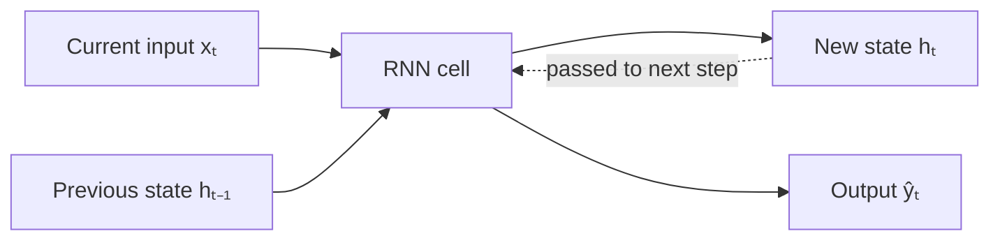

### Unfolded representation

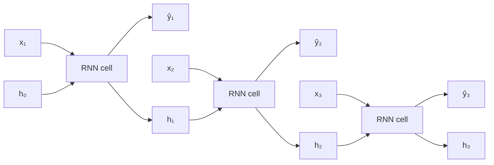

Although the diagram contains several cells, they represent the **same RNN cell reused over time**.

The weights are shared:

$$
W_{xh}^{(1)} = W_{xh}^{(2)} = W_{xh}^{(3)}
$$

$$
W_{hh}^{(1)} = W_{hh}^{(2)} = W_{hh}^{(3)}
$$

---

## 6. Understanding the Hidden State

The hidden state acts as a learned summary of the sequence processed so far.

For the sentence:

```text
Vietnam is very beautiful
```

the processing may be interpreted as:

```text
h₀ = no previous information

"Vietnam" + h₀
    -> h₁ summarizes "Vietnam"

"is" + h₁
    -> h₂ summarizes "Vietnam is"

"very" + h₂
    -> h₃ summarizes "Vietnam is very"

"beautiful" + h₃
    -> h₄ summarizes the full sequence
```

For a language model, the hidden state can be used to predict the next word:

```text
Vietnam  -> predict "is"
Vietnam is -> predict "very"
Vietnam is very -> predict "beautiful"
```

RNN-based language models estimate the probability of the next token based on the previous tokens.

However, the hidden state is a fixed-size vector. It is not a perfect memory of every previous input. Information may weaken or disappear as the sequence becomes longer.

---

## 7. Common RNN Architectures

The number of input time steps $T_x$ does not always equal the number of output time steps $T_y$.

### 7.1 One-to-One

```text
one input -> one output
```

Example:

```text
tabular features -> customer category
```

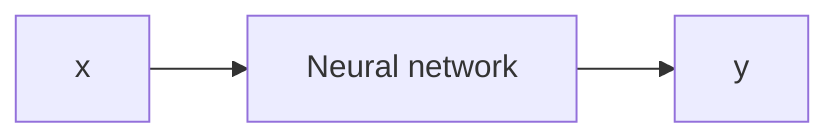

This is normally a standard feedforward neural network rather than a true sequence application.

---

### 7.2 One-to-Many

```text
one input -> output sequence
```

Examples:

* Music generation
* Caption generation from an image
* Sequence generation from a category
* Text generation from a prompt representation

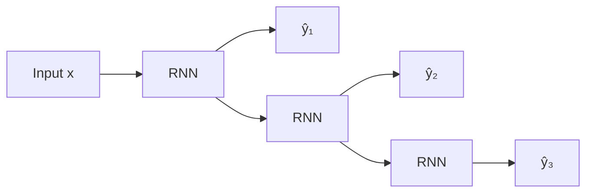

During generation, the output from one step may be used as the input to the next step.

---

### 7.3 Many-to-One

```text
input sequence -> one output
```

Examples:

* Sentiment classification
* Spam detection
* Activity recognition
* Sequence-level fraud detection
* Movie rating prediction

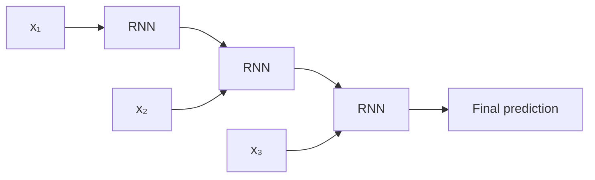

For sentiment analysis, the RNN reads the complete review and uses the final hidden state to predict whether the review is positive or negative.

---

### 7.4 Many-to-Many with Equal Lengths

```text
input sequence -> output sequence
Tₓ = Tᵧ
```

Examples:

* Named-entity recognition
* Part-of-speech tagging
* Frame-level activity recognition
* Sequence labeling

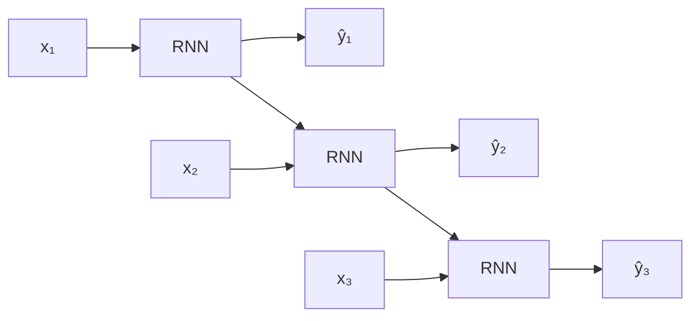

Each input element has a corresponding output element.

---

### 7.5 Many-to-Many with Different Lengths

```text
input sequence -> output sequence
Tₓ may differ from Tᵧ
```

Examples:

* Machine translation
* Text summarization
* Speech recognition
* Question answering

This architecture commonly contains two parts:

1. **Encoder:** reads the input sequence.
2. **Decoder:** generates the output sequence.

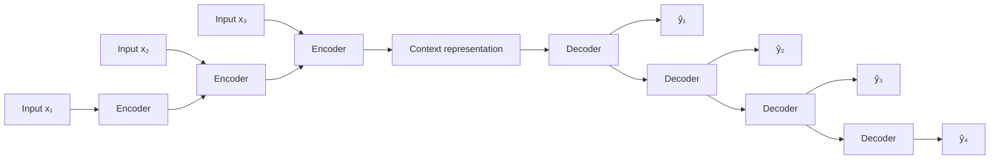

The input and output sequences do not need to contain the same number of elements.

---

### 7.6 Architecture Summary

| Architecture          | Input       | Output                    | Example                  |
| --------------------- | ----------- | ------------------------- | ------------------------ |
| One-to-one            | Single item | Single item               | Standard classification  |
| One-to-many           | Single item | Sequence                  | Music generation         |
| Many-to-one           | Sequence    | Single label              | Sentiment analysis       |
| Many-to-many, aligned | Sequence    | Same-length sequence      | Named-entity recognition |
| Encoder-decoder       | Sequence    | Different-length sequence | Machine translation      |

---

## 8. Input Shapes

Deep-learning libraries usually expect an RNN input with three dimensions:

```text
(batch size, time steps, features)
```

For example:

```text
(32, 30, 1)
```

means:

* 32 sequences in one batch
* 30 time steps per sequence
* 1 feature at each time step

For weather forecasting with three features:

```text
temperature
humidity
wind speed
```

the input shape may be:

```text
(32, 30, 3)
```

---

## 9. Preparing Time-Series Data

Suppose the temperature sequence is:

```text
20, 21, 22, 23, 24, 25, 26
```

Using a window size of three:

| Input sequence | Target |
| -------------- | -----: |
| 20, 21, 22     |     23 |
| 21, 22, 23     |     24 |
| 22, 23, 24     |     25 |
| 23, 24, 25     |     26 |

This creates a many-to-one forecasting problem.

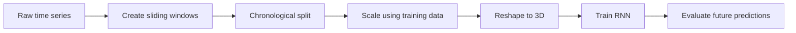

### Important rule

Time-series data should normally be split chronologically:

```text
Past data     -> training
Later data    -> validation
Newest data   -> testing
```

Randomly shuffling observations before splitting may leak future information into the training data.

---

## 10. Training an RNN

RNNs are trained using **Backpropagation Through Time**, or **BPTT**.

### 10.1 Forward pass

The network is unfolded across time:

```text
x₁ -> h₁ -> x₂ -> h₂ -> x₃ -> h₃ -> prediction
```

### 10.2 Loss calculation

For a sequence-to-sequence problem, the total loss may be:

$$
\mathcal{L} = \sum_{t=1}^{T} \mathcal{L}_t
$$

For classification:

$$
\mathcal{L}_t = -\sum_k y_{t,k}\log \hat{y}_{t,k}
$$

For regression:

$$
\mathcal{L} = \frac{1}{N} \sum_{i=1}^{N} \left(y_i-\hat{y}_i\right)^2
$$

### 10.3 Backward pass

Gradients flow backward through all unfolded time steps:

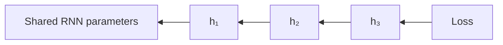

Because the same parameters are reused at every step, gradient contributions from all time steps update the same weight matrices.

---

## 11. Vanishing and Exploding Gradients

During BPTT, gradients are repeatedly multiplied through the recurrent connections.

### Vanishing gradients

If the repeated derivatives are mostly smaller than one:

$$
\frac{\partial h_t}{\partial h_{t-1}} < 1
$$

the gradient may become extremely small:

```text
0.5 × 0.5 × 0.5 × 0.5 × ... -> approximately 0
```

Consequences:

* Early time steps receive almost no learning signal.
* The model struggles with long-term dependencies.
* Important old information may be forgotten.

---

### Exploding gradients

If the repeated derivatives are mostly larger than one:

```text
2 × 2 × 2 × 2 × ... -> extremely large
```

Consequences:

* Training becomes unstable.
* Loss values may suddenly increase.
* Weights may become extremely large.
* The model may produce `NaN` values.

---

### Common solutions

| Problem               | Possible solution          |
| --------------------- | -------------------------- |
| Exploding gradients   | Gradient clipping          |
| Unstable optimization | Lower learning rate        |
| Long dependencies     | LSTM or GRU                |
| Very long sequences   | Truncated BPTT             |
| Overfitting           | Dropout and early stopping |
| Poor scaling          | Normalize numerical inputs |

---

## 12. Vanilla RNN, LSTM and GRU

### Vanilla RNN

Advantages:

* Simple architecture
* Fast to prototype
* Useful for short sequences
* Good for understanding recurrent models

Limitations:

* Weak long-term memory
* Vulnerable to vanishing gradients
* Sequential computation limits parallelism

---

### LSTM

An **LSTM**, or Long Short-Term Memory network, introduces a cell state and several gates:

* Forget gate
* Input gate
* Output gate

These gates help control which information should be remembered, updated or removed.

---

### GRU

A **Gated Recurrent Unit** uses fewer gates than an LSTM:

* Update gate
* Reset gate

GRUs are often simpler and may train faster while still handling longer dependencies better than a vanilla RNN.

---

### Comparison

| Model       | Complexity |       Long-term dependencies | Typical use                        |
| ----------- | ---------: | ---------------------------: | ---------------------------------- |
| Vanilla RNN |        Low |                         Weak | Short and simple sequences         |
| GRU         |     Medium |                         Good | General sequence modeling          |
| LSTM        |     Higher |                         Good | Longer or more complex sequences   |
| Transformer |       High | Very strong context modeling | Large-scale NLP and sequence tasks |

---

## 13. Bidirectional RNN

A normal forward RNN uses only past context:

$$
x_1, x_2, \ldots, x_t
$$

A bidirectional RNN processes the sequence in both directions:

```text
Forward:  x₁ -> x₂ -> x₃ -> x₄
Backward: x₄ -> x₃ -> x₂ -> x₁
```

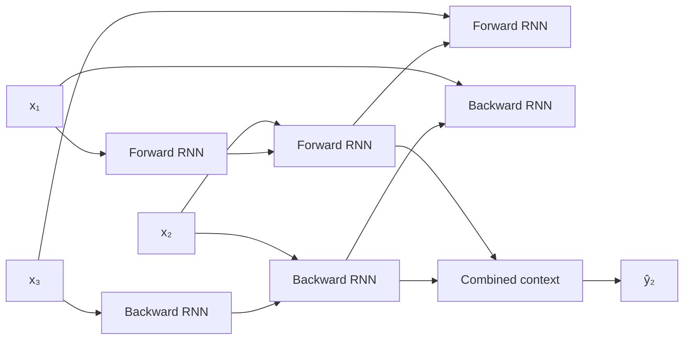

This is useful when both earlier and later context are available.

Examples:

* Named-entity recognition
* Text classification
* Speech analysis
* Part-of-speech tagging

A bidirectional RNN is usually inappropriate for strict real-time forecasting because future observations are unavailable at prediction time.

---

## 14. Practical Demo: Next-Day Temperature Forecasting

### 14.1 Problem definition

Given the temperatures of the previous 30 days, predict the temperature of the next day.

```text
Previous 30 temperatures -> RNN -> next temperature
```

This is a:

```text
many-to-one regression problem
```

---

### 14.2 Dataset preparation

```python
import numpy as np


def create_windows(
    values: np.ndarray,
    window_size: int
) -> tuple[np.ndarray, np.ndarray]:
    """Create input windows and one-step-ahead targets."""
    features: list[np.ndarray] = []
    targets: list[float] = []

    for start in range(len(values) - window_size):
        end = start + window_size
        features.append(values[start:end])
        targets.append(values[end])

    x = np.asarray(features, dtype=np.float32)
    y = np.asarray(targets, dtype=np.float32)

    # Shape: (samples, time_steps, features)
    return x[..., np.newaxis], y
```

Example:

```python
temperatures = np.array(
    [20.1, 20.4, 21.0, 21.5, 22.2, 22.0, 23.1],
    dtype=np.float32
)

x, y = create_windows(temperatures, window_size=3)

print(x.shape)
print(y.shape)
```

Expected structure:

```text
X:
[[20.1, 20.4, 21.0],
 [20.4, 21.0, 21.5],
 [21.0, 21.5, 22.2],
 ...]

y:
[21.5, 22.2, 22.0, ...]
```

---

### 14.3 Build a small RNN

```python
import tensorflow as tf

window_size = 30

model = tf.keras.Sequential(
    [
        tf.keras.layers.Input(shape=(window_size, 1)),
        tf.keras.layers.SimpleRNN(
            units=32,
            activation="tanh"
        ),
        tf.keras.layers.Dense(16, activation="relu"),
        tf.keras.layers.Dense(1)
    ]
)

model.compile(
    optimizer=tf.keras.optimizers.Adam(learning_rate=0.001),
    loss="mse",
    metrics=["mae"]
)

model.summary()
```

---

### 14.4 Train the model

```python
callbacks = [
    tf.keras.callbacks.EarlyStopping(
        monitor="val_loss",
        patience=10,
        restore_best_weights=True
    )
]

history = model.fit(
    x_train,
    y_train,
    validation_data=(x_validation, y_validation),
    epochs=100,
    batch_size=32,
    shuffle=False,
    callbacks=callbacks,
    verbose=1
)
```

For time-series tasks, `shuffle=False` helps preserve sequence ordering during training.

---

### 14.5 Evaluate predictions

```python
predictions = model.predict(x_test, verbose=0).reshape(-1)

mae = np.mean(np.abs(y_test - predictions))

rmse = np.sqrt(
    np.mean((y_test - predictions) ** 2)
)

print(f"Test MAE:  {mae:.3f}")
print(f"Test RMSE: {rmse:.3f}")
```

Interpretation:

```text
MAE = 1.2
```

means the prediction differs from the actual temperature by approximately 1.2 degrees on average.

---

## 15. Recommended Visualizations

### 15.1 Training and validation loss

```python
import matplotlib.pyplot as plt

plt.figure(figsize=(10, 5))
plt.plot(history.history["loss"], label="Training loss")
plt.plot(history.history["val_loss"], label="Validation loss")
plt.xlabel("Epoch")
plt.ylabel("MSE")
plt.title("RNN Training and Validation Loss")
plt.legend()
plt.show()
```

Interpretation:

```text
Training loss decreases
Validation loss decreases
    -> model is learning

Training loss decreases
Validation loss begins increasing
    -> possible overfitting
```

---

### 15.2 Actual versus predicted values over time

```python
plt.figure(figsize=(12, 5))
plt.plot(y_test, label="Actual")
plt.plot(predictions, label="Predicted")
plt.xlabel("Time step")
plt.ylabel("Temperature")
plt.title("Actual vs Predicted Temperature")
plt.legend()
plt.show()
```

This chart shows whether the model follows:

* The overall trend
* Seasonal patterns
* Sudden changes
* Peaks and valleys

---

### 15.3 Predicted versus actual scatter plot

```python
plt.figure(figsize=(6, 6))
plt.scatter(y_test, predictions, alpha=0.6)

minimum = min(y_test.min(), predictions.min())
maximum = max(y_test.max(), predictions.max())

plt.plot(
    [minimum, maximum],
    [minimum, maximum],
    linestyle="--"
)

plt.xlabel("Actual")
plt.ylabel("Predicted")
plt.title("Predicted vs Actual")
plt.show()
```

Points close to the diagonal line represent accurate predictions.

---

### 15.4 Residual plot

A residual is:

$$
e_i = y_i-\hat{y}_i
$$

```python
residuals = y_test - predictions

plt.figure(figsize=(10, 5))
plt.scatter(predictions, residuals, alpha=0.6)
plt.axhline(0, linestyle="--")
plt.xlabel("Predicted value")
plt.ylabel("Residual")
plt.title("Residual Plot")
plt.show()
```

A healthy residual plot should usually show errors distributed around zero without a strong systematic pattern.

---

## 16. Baselines and Model Comparison

An RNN should not be accepted simply because it is a deep-learning model.

Compare it with simple baselines.

### Naive baseline

For one-step forecasting:

$$
\hat{y}_{t+1}=y_t
$$

```python
naive_predictions = x_test[:, -1, 0]

naive_mae = np.mean(
    np.abs(y_test - naive_predictions)
)

print(f"Naive baseline MAE: {naive_mae:.3f}")
```

### Recommended comparison

| Model               | MAE | RMSE | Training cost |
| ------------------- | --: | ---: | ------------: |
| Last-value baseline | ... |  ... |      Very low |
| Linear regression   | ... |  ... |           Low |
| Dense network       | ... |  ... |        Medium |
| Simple RNN          | ... |  ... |        Medium |
| GRU                 | ... |  ... |        Higher |
| LSTM                | ... |  ... |        Higher |

A more complex model is useful only when it produces a meaningful improvement.

---

## 17. Text Classification Example

For sentiment classification:

```text
"The film was surprisingly good"
```

The workflow is:

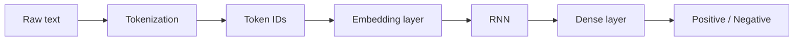

A simple model may look like:

```python
text_model = tf.keras.Sequential(
    [
        tf.keras.layers.Embedding(
            input_dim=vocabulary_size,
            output_dim=64,
            mask_zero=True
        ),
        tf.keras.layers.SimpleRNN(64),
        tf.keras.layers.Dense(1, activation="sigmoid")
    ]
)
```

The embedding layer converts each token ID into a dense vector.

The RNN processes the vectors in sequence and uses the final hidden state for classification.

---

## 18. Practical Exercise

### Exercise: Temperature Forecasting

Build an RNN that predicts the next temperature from the previous 14 or 30 observations.

#### Step 1: Prepare the dataset

* Sort observations by date.
* Select the target variable.
* Handle missing values.
* Split data chronologically.
* Scale using training data only.
* Create sliding windows.

#### Step 2: Build a baseline

Use the final temperature in each input window as the prediction:

```text
next temperature ≈ most recent temperature
```

#### Step 3: Build an RNN

Suggested architecture:

```text
Input
  -> SimpleRNN(32)
  -> Dense(16, ReLU)
  -> Dense(1)
```

#### Step 4: Train

Monitor:

* Training loss
* Validation loss
* Training MAE
* Validation MAE

#### Step 5: Evaluate

Calculate:

* MAE
* RMSE
* $R^2$, when appropriate

Create:

* Training curves
* Actual-versus-predicted plot
* Scatter plot
* Residual plot

#### Step 6: Compare architectures

Compare:

```text
Naive baseline
vs
Dense neural network
vs
Simple RNN
vs
GRU
vs
LSTM
```

---

## 19. Common Mistakes

### Mistake 1: Using an RNN when a simpler model is sufficient

Deep learning is not automatically better than linear regression, tree-based models or naive forecasting baselines.

Always compare against simple alternatives.

---

### Mistake 2: Randomly splitting time-series data

A random split may allow future observations to influence training.

Prefer chronological splitting:

```text
train -> validation -> test
```

---

### Mistake 3: Fitting the scaler on all data

This leaks information from validation or test data.

Correct procedure:

```text
Fit scaler on training data
Transform training data
Transform validation data
Transform test data
```

---

### Mistake 4: Using the wrong input shape

An RNN usually expects:

```text
(samples, time steps, features)
```

Not:

```text
(samples, time steps)
```

For one feature, add the final dimension:

```python
x = x[..., np.newaxis]
```

---

### Mistake 5: Ignoring padding

Text sequences often have different lengths.

Use:

* Padding
* Masking
* Packed sequences where supported

Padding values should not be interpreted as real tokens.

---

### Mistake 6: Ignoring overfitting

Monitor both training and validation curves.

```text
Training loss decreases
Validation loss increases
```

This is a common sign of overfitting.

Possible solutions:

* Reduce model size
* Add dropout
* Use early stopping
* Collect more data
* Shorten or reconsider the input window

---

### Mistake 7: Using vanilla RNNs for very long dependencies

A vanilla RNN may struggle to preserve information over long sequences.

Try:

* GRU
* LSTM
* Attention
* Transformer-based models

---

### Mistake 8: Evaluating only with a single metric

For forecasting, combine:

* MAE
* RMSE
* $R^2$, when appropriate
* Visual inspection
* Residual analysis
* Comparison against a baseline

---

### Mistake 9: Confusing hidden states with exact memory

The hidden state is a learned compressed representation.

It does not store all previous observations exactly.

---

### Mistake 10: Using a bidirectional model for future forecasting

A bidirectional RNN uses information from both sides of a sequence.

For real-time forecasting, future observations are unavailable, so using backward context may create leakage.

---

## 20. Practical Workflow

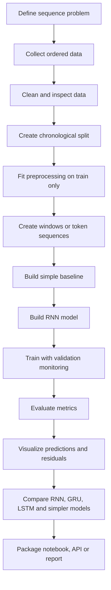

---

## 21. Completion Checklist

* [ ] I can explain why sequence order matters.
* [ ] I can explain the roles of $x_t$, $h_{t-1}$, $h_t$ and $\hat{y}_t$.
* [ ] I can write the basic RNN forward equations.
* [ ] I understand that RNN parameters are shared across time steps.
* [ ] I can distinguish many-to-one, one-to-many and many-to-many architectures.
* [ ] I understand the expected three-dimensional input shape.
* [ ] I can create sliding windows from time-series data.
* [ ] I can split time-series data without future leakage.
* [ ] I can train a small RNN model.
* [ ] I can visualize training and validation curves.
* [ ] I can compare predictions with actual values.
* [ ] I can explain vanishing and exploding gradients.
* [ ] I know when LSTM, GRU or Transformers may be more appropriate.
* [ ] I have recorded at least one limitation, assumption or open question.

---

## 22. Related Outcome

Understand neural networks, CNNs, RNNs, LSTMs, GRUs, Transformers and transfer learning at a practical level.

After this lesson, you should understand how neural networks can process ordered data and maintain a learned state across time.

---

## 23. Related Mini Project

### Mini Project: Daily Temperature Forecasting

Build and compare:

1. Last-value baseline
2. Linear regression
3. Dense neural network
4. Vanilla RNN
5. GRU or LSTM

Use:

* Historical weather data
* A 14-day or 30-day input window
* One-step-ahead forecasting

Evaluate with:

* MAE
* RMSE
* Training and validation curves
* Actual-versus-predicted chart
* Residual analysis

Suggested final artifacts:

```text
weather-rnn/
├── data/
├── notebooks/
│   └── rnn_temperature_forecasting.ipynb
├── models/
│   └── temperature_rnn.keras
├── src/
│   ├── preprocessing.py
│   ├── train.py
│   └── predict.py
├── reports/
│   ├── training_curves.png
│   ├── predictions.png
│   └── residuals.png
├── requirements.txt
└── README.md
```

The original image-classification project is better suited to the CNN lesson. A sequence-classification or time-series forecasting project is more directly related to RNNs.

---

## 24. Final Summary

A Recurrent Neural Network processes sequential data by combining the current input with a hidden state from the previous time step:

$$
h_t =
\tanh
\left(
W_{xh}x_t
+
W_{hh}h_{t-1}
+
b_h
\right)
$$

The hidden state provides a learned summary of previous inputs.

RNNs support several architectures:

```text
one-to-one
one-to-many
many-to-one
many-to-many
encoder-decoder
```

They can be applied to text, time series, audio and other ordered data. However, vanilla RNNs often struggle with long-term dependencies because of vanishing or exploding gradients.

For longer sequences, common alternatives include:

```text
LSTM
GRU
Bidirectional RNN
Attention
Transformer
```

The most valuable next step is to build a small forecasting or text-classification notebook, compare the RNN with a simple baseline and analyze both the numerical metrics and prediction charts.

---

# Bài luyện tập

## Mục tiêu


## Đề bài


## Yêu cầu hoàn thành

- [ ] 
- [ ] 
- [ ] 

## Kết quả / lời giải


## Ghi chú
