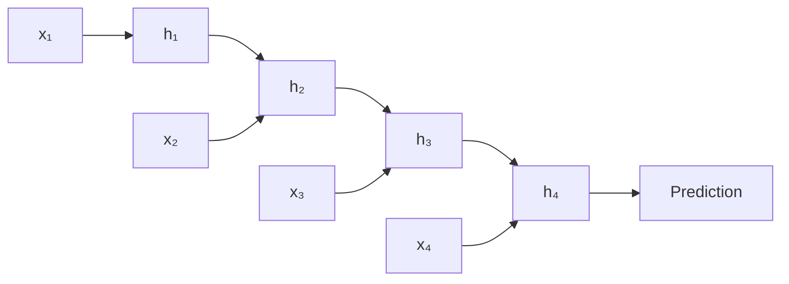
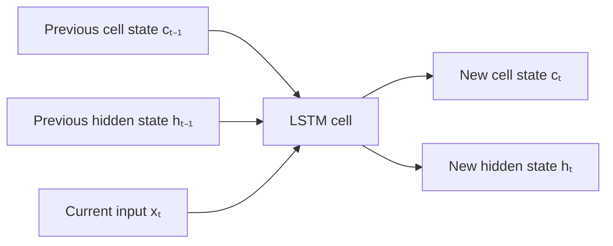
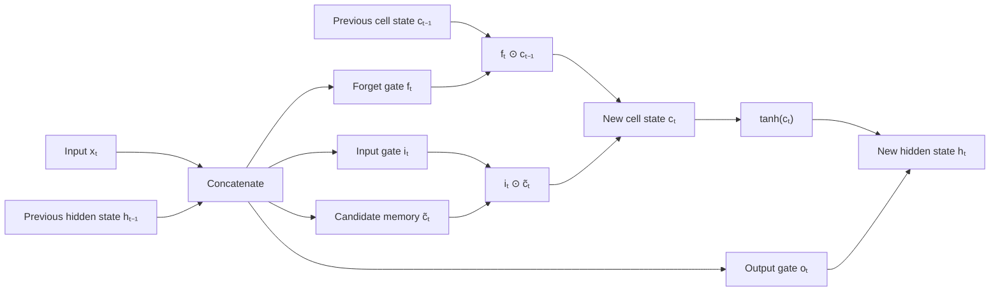
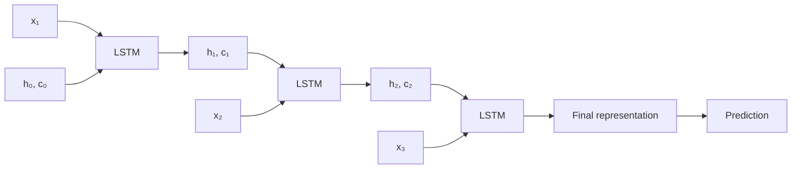
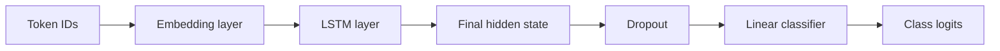
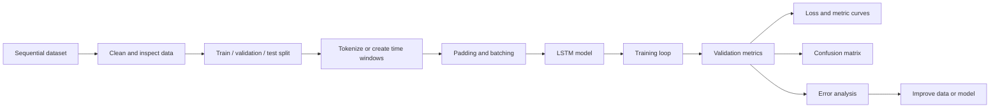
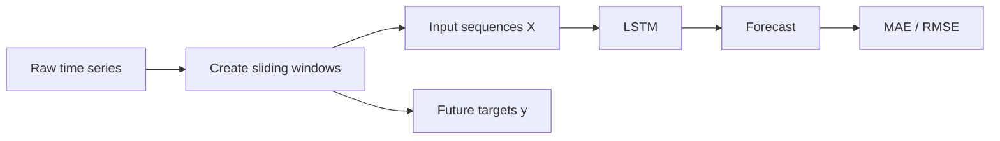
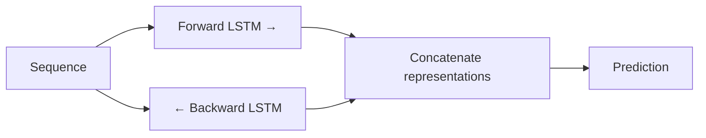

# 012 — Long Short-Term Memory Networks

**Course:** 03 — Machine Learning and Deep Learning
**Module:** Module 07 — Deep Learning
**Content Group:** Architectures
**Roadmap Source:** Deep Learning / Architectures
**Lesson Type:** Deep Learning
**Order in Module:** 012
**Suggested Duration:** 24 minutes

---

## 1. Summary

This lesson explains **Long Short-Term Memory networks**, commonly called **LSTMs**, in the context of AI and Data Science.

LSTM is a specialized type of **Recurrent Neural Network** designed to process sequential data while preserving important information across longer time intervals.

LSTMs are commonly used for:

* Time-series forecasting
* Text classification
* Sentiment analysis
* Speech recognition
* Sequence labeling
* Anomaly detection
* Event prediction
* Natural language processing

After completing this lesson, you should understand:

* Why ordinary RNNs struggle with long sequences
* How an LSTM stores and removes information
* The roles of the forget, input, and output gates
* How hidden states and cell states move through a sequence
* How to build and evaluate a small LSTM model

---

## 2. Learning Objectives

By the end of this lesson, you should be able to:

* Explain LSTM using your own words.
* Describe the vanishing-gradient problem in a standard RNN.
* Distinguish between the hidden state and the cell state.
* Explain the purpose of each LSTM gate.
* Identify suitable datasets and tasks for LSTM models.
* Implement a small LSTM model using PyTorch or TensorFlow.
* Evaluate an LSTM using appropriate validation metrics.
* Compare an LSTM with a vanilla RNN, GRU, and Transformer.

---

## 3. Why Do We Need LSTM?

A standard RNN processes a sequence one element at a time.

At time step $t$, the hidden state is typically calculated as:

$$
h_t = \tanh(W_x x_t + W_h h_{t-1} + b)
$$

where:

* $x_t$ is the current input.
* $h_{t-1}$ is the previous hidden state.
* $h_t$ is the new hidden state.
* $W_x$ and $W_h$ are learned weight matrices.
* $b$ is the bias vector.

The hidden state acts as a compressed summary of everything the network has processed so far.



In theory, the final hidden state can contain information from every previous time step.

In practice, information from early time steps may become too weak by the time the model reaches the end of a long sequence.

### Example

Consider the sentence:

> The dog, which had been waiting beside the old house for several hours, was hungry.

To predict the word **hungry**, the model should remember that the subject is **dog**, even though many words appear between them.

A standard RNN may have difficulty preserving this long-range dependency.

---

## 4. The Vanishing-Gradient Problem

RNNs are trained using **Backpropagation Through Time**.

During backpropagation, gradients pass backward through every time step.

```text
Loss
  ↓
Time step T
  ↓
Time step T - 1
  ↓
Time step T - 2
  ↓
...
  ↓
Time step 1
```

The same recurrent weight matrix is multiplied repeatedly.

A simplified gradient contains a product similar to:

$$
\frac{\partial h_T}{\partial h_1}
\approx
\prod_{t=2}^{T}
\frac{\partial h_t}{\partial h_{t-1}}
$$

When the multiplied values are smaller than $1$, the gradient can approach zero:

$$
0.5^{20} \approx 0.00000095
$$

This is called the **vanishing-gradient problem**.

When values are greater than $1$, the gradient may grow extremely large. This is called the **exploding-gradient problem**.

### Consequences

A model affected by vanishing gradients may:

* Forget information from early time steps.
* Learn mostly short-term patterns.
* Train very slowly.
* Fail to model long-range dependencies.

LSTM introduces a controlled memory path that allows information and gradients to move more easily across time.

---

## 5. Main Components of an LSTM

An LSTM maintains two states:

### Hidden state

$$
h_t
$$

The hidden state represents the model's **short-term working information**.

It is also commonly used as the output of the LSTM at the current time step.

### Cell state

$$
c_t
$$

The cell state represents the model's **long-term memory**.

It provides a relatively direct path through the sequence, allowing important information to remain available for many time steps.



The model controls its memory using several learned gates.

---

## 6. The LSTM Gates

An LSTM usually contains three main gates:

1. Forget gate
2. Input gate
3. Output gate

It also creates a candidate memory value.

Each gate uses the current input $x_t$ and the previous hidden state $h_{t-1}$.

---

### 6.1 Forget Gate

The forget gate decides which information should be removed from the previous cell state.

$$
f_t =
\sigma
\left(
W_f[h_{t-1},x_t] + b_f
\right)
$$

where:

* $\sigma$ is the sigmoid function.
* $f_t$ contains values between $0$ and $1$.
* $0$ means “completely forget.”
* $1$ means “completely preserve.”

The previous cell state is filtered using element-wise multiplication:

$$
f_t \odot c_{t-1}
$$

For example:

```text
Previous memory: [0.9, 0.4, 0.8]
Forget gate:     [1.0, 0.0, 0.5]
Result:          [0.9, 0.0, 0.4]
```

The second memory element is removed, while the first is preserved.

---

### 6.2 Input Gate

The input gate determines how much new information should be stored.

$$
i_t =
\sigma
\left(
W_i[h_{t-1},x_t] + b_i
\right)
$$

The LSTM also generates candidate information:

$$
\tilde{c}_t =
\tanh
\left(
W_c[h_{t-1},x_t] + b_c
\right)
$$

The input gate controls how much candidate information is added:

$$
i_t \odot \tilde{c}_t
$$

---

### 6.3 Cell-State Update

The new cell state combines:

* Information preserved from the previous memory
* New information selected by the input gate

$$
c_t =
f_t \odot c_{t-1}
+
i_t \odot \tilde{c}_t
$$

This equation is the central memory-update operation of an LSTM.

```text
New cell state
    =
Old information to keep
    +
New information to store
```

---

### 6.4 Output Gate

The output gate decides which parts of the cell state should become the new hidden state.

$$
o_t =
\sigma
\left(
W_o[h_{t-1},x_t] + b_o
\right)
$$

The hidden state is calculated as:

$$
h_t =
o_t \odot \tanh(c_t)
$$

The cell state may preserve more information than the model exposes at the current time step.

---

## 7. Complete LSTM Computation

At every time step, the LSTM performs the following operations:

$$
f_t =
\sigma(W_f[h_{t-1},x_t] + b_f)
$$

$$
i_t =
\sigma(W_i[h_{t-1},x_t] + b_i)
$$

$$
\tilde{c}_t =
\tanh(W_c[h_{t-1},x_t] + b_c)
$$

$$
c_t =
f_t \odot c_{t-1}
+
i_t \odot \tilde{c}_t
$$

$$
o_t =
\sigma(W_o[h_{t-1},x_t] + b_o)
$$

$$
h_t =
o_t \odot \tanh(c_t)
$$

The same parameters are reused at every time step.

---

## 8. LSTM Cell Diagram



Conceptually, the model learns to answer four questions:

```text
What should I forget?
What new information should I consider?
What should I store in long-term memory?
What information should I expose as output?
```

---

## 9. Sequence Processing

Given a sequence:

$$
X = (x_1,x_2,\ldots,x_T)
$$

the LSTM processes one input at a time:



The same LSTM cell is reused across all positions.

---

## 10. Common LSTM Input and Output Patterns

### Many-to-one

Multiple sequence elements produce one prediction.

Examples:

* Sentiment classification
* Spam detection
* Patient-risk prediction
* Sequence-level anomaly detection

```text
"This movie was surprisingly good"
                ↓
          Positive sentiment
```

---

### Many-to-many

Each input position produces an output.

Examples:

* Named-entity recognition
* Part-of-speech tagging
* Activity recognition
* Sequence labeling

```text
John     lives      in      London
 ↓         ↓         ↓         ↓
PERSON   OTHER     OTHER    LOCATION
```

---

### Sequence-to-sequence

One sequence is transformed into another sequence.

Examples:

* Machine translation
* Text generation
* Speech recognition
* Sequence reconstruction

Modern sequence-to-sequence systems frequently use Transformers, but LSTMs remain useful for learning the underlying sequence-modeling concepts.

---

## 11. Tensor Shapes in PyTorch

With `batch_first=True`, an LSTM usually receives:

```text
Input shape:
[batch_size, sequence_length, input_size]
```

It returns:

```text
output:
[batch_size, sequence_length, hidden_size]

h_n:
[num_layers × num_directions, batch_size, hidden_size]

c_n:
[num_layers × num_directions, batch_size, hidden_size]
```

Example:

```python
import torch
from torch import nn

lstm = nn.LSTM(
    input_size=32,
    hidden_size=64,
    num_layers=1,
    batch_first=True,
)

x = torch.randn(16, 20, 32)

output, (h_n, c_n) = lstm(x)

print(output.shape)  # torch.Size([16, 20, 64])
print(h_n.shape)     # torch.Size([1, 16, 64])
print(c_n.shape)     # torch.Size([1, 16, 64])
```

Here:

* Batch size is `16`.
* Sequence length is `20`.
* Each sequence element has `32` features.
* The hidden state contains `64` features.

---

## 12. Minimal Sentiment-Classification Model

The following model receives token IDs and predicts a sentiment class.

```python
import torch
from torch import nn


class LSTMClassifier(nn.Module):
    def __init__(
        self,
        vocabulary_size: int,
        embedding_dim: int,
        hidden_size: int,
        number_of_classes: int,
        padding_index: int = 0,
    ) -> None:
        super().__init__()

        self.embedding = nn.Embedding(
            num_embeddings=vocabulary_size,
            embedding_dim=embedding_dim,
            padding_idx=padding_index,
        )

        self.lstm = nn.LSTM(
            input_size=embedding_dim,
            hidden_size=hidden_size,
            num_layers=1,
            batch_first=True,
        )

        self.dropout = nn.Dropout(p=0.3)

        self.classifier = nn.Linear(
            hidden_size,
            number_of_classes,
        )

    def forward(self, token_ids: torch.Tensor) -> torch.Tensor:
        # token_ids:
        # [batch_size, sequence_length]

        embedded = self.embedding(token_ids)

        # embedded:
        # [batch_size, sequence_length, embedding_dim]

        _, (hidden_state, _) = self.lstm(embedded)

        # Last layer's final hidden state:
        final_hidden_state = hidden_state[-1]

        logits = self.classifier(
            self.dropout(final_hidden_state)
        )

        return logits
```

### Data flow



---

## 13. Minimal Training Loop

```python
from collections.abc import Iterable

import torch
from torch import nn


def train_one_epoch(
    model: nn.Module,
    data_loader: Iterable,
    optimizer: torch.optim.Optimizer,
    loss_function: nn.Module,
    device: torch.device,
) -> float:
    model.train()

    total_loss = 0.0
    number_of_batches = 0

    for token_ids, labels in data_loader:
        token_ids = token_ids.to(device)
        labels = labels.to(device)

        optimizer.zero_grad()

        logits = model(token_ids)
        loss = loss_function(logits, labels)

        loss.backward()

        # Helps control exploding gradients.
        nn.utils.clip_grad_norm_(
            model.parameters(),
            max_norm=1.0,
        )

        optimizer.step()

        total_loss += loss.item()
        number_of_batches += 1

    if number_of_batches == 0:
        raise ValueError("The training data loader is empty.")

    return total_loss / number_of_batches
```

A typical configuration is:

```python
device = torch.device(
    "cuda" if torch.cuda.is_available() else "cpu"
)

model = LSTMClassifier(
    vocabulary_size=10_000,
    embedding_dim=128,
    hidden_size=128,
    number_of_classes=3,
).to(device)

loss_function = nn.CrossEntropyLoss()

optimizer = torch.optim.Adam(
    model.parameters(),
    lr=1e-3,
)
```

---

## 14. Training Workflow



A practical workflow should include:

1. Define the prediction target.
2. Determine the correct sequence unit.
3. Split data without leakage.
4. Encode sequence elements.
5. Pad or truncate variable-length sequences.
6. Train a simple baseline.
7. Train the LSTM.
8. Track training and validation metrics.
9. Inspect mistakes.
10. Compare the model with simpler alternatives.

---

## 15. Evaluation Metrics

The correct metric depends on the task.

### Classification

Useful metrics include:

* Accuracy
* Precision
* Recall
* F1 score
* ROC-AUC
* PR-AUC
* Confusion matrix

For imbalanced datasets, accuracy alone may be misleading.

### Time-Series Regression

Useful metrics include:

* Mean Absolute Error
* Mean Squared Error
* Root Mean Squared Error
* Mean Absolute Percentage Error
* Symmetric Mean Absolute Percentage Error

### Sequence Labeling

Useful metrics include:

* Token-level accuracy
* Macro F1
* Entity-level F1
* Sequence-level exact match

---

## 16. Time-Series Data Preparation

For time-series forecasting, raw observations are often transformed into sliding windows.

Given:

```text
[10, 12, 14, 15, 18, 20]
```

Using a window size of three:

```text
Input                 Target
[10, 12, 14]    ->      15
[12, 14, 15]    ->      18
[14, 15, 18]    ->      20
```



The train-validation-test split must follow chronological order.

Incorrect:

```text
Randomly shuffle every time-series row before splitting
```

Preferred:

```text
Past data       → Training
More recent data → Validation
Newest data      → Testing
```

This prevents future information from leaking into the training set.

---

## 17. Important Hyperparameters

### Hidden size

Controls the capacity of the hidden and cell states.

A larger hidden size can learn more complex patterns but requires more computation and may overfit.

### Number of layers

A stacked LSTM contains multiple recurrent layers.

```python
nn.LSTM(
    input_size=128,
    hidden_size=256,
    num_layers=2,
    dropout=0.3,
    batch_first=True,
)
```

PyTorch applies the built-in recurrent dropout between LSTM layers when `num_layers > 1`.

### Sequence length

Longer sequences provide more context but:

* Consume more memory.
* Increase training cost.
* May contain irrelevant information.
* Make optimization more difficult.

### Learning rate

A learning rate that is too high may cause unstable training.

A learning rate that is too low may make training unnecessarily slow.

### Batch size

Larger batches may improve hardware utilization but require more memory.

### Dropout

Dropout can reduce overfitting, especially in stacked LSTM models or the final classification layers.

---

## 18. LSTM Variants

### Stacked LSTM

Multiple LSTM layers are placed on top of one another.

```text
Input
  ↓
LSTM layer 1
  ↓
LSTM layer 2
  ↓
Prediction layer
```

### Bidirectional LSTM

A bidirectional LSTM processes the sequence in both directions.



It is useful when the complete sequence is available before prediction.

It should generally not be used for strictly causal forecasting because the backward direction can access future information.

### Encoder-decoder LSTM

An encoder converts the input sequence into a representation, and a decoder generates an output sequence.

This architecture was historically important in machine translation and sequence generation.

---

## 19. LSTM Compared with Other Architectures

| Architecture | Main Strength                                    | Main Limitation                          |
| ------------ | ------------------------------------------------ | ---------------------------------------- |
| Vanilla RNN  | Simple and lightweight                           | Struggles with long dependencies         |
| LSTM         | Better long-term memory control                  | More parameters and slower training      |
| GRU          | Simpler gated recurrent architecture             | Slightly less explicit memory structure  |
| 1D CNN       | Parallel and efficient for local patterns        | Long context may require many layers     |
| Transformer  | Strong long-range modeling and parallel training | Often requires more data and computation |

LSTM is still useful when:

* The dataset is small or medium-sized.
* Sequences are processed incrementally.
* Memory or latency is limited.
* A recurrent inductive bias matches the problem.
* The goal is to understand sequence modeling fundamentals.

---

## 20. Practical Demo

### Task

Build a three-class sentiment classifier:

```text
Negative
Neutral
Positive
```

### Suggested pipeline

```text
Raw text
   ↓
Text normalization
   ↓
Tokenization
   ↓
Vocabulary construction
   ↓
Integer token IDs
   ↓
Padding and truncation
   ↓
Embedding layer
   ↓
LSTM
   ↓
Linear classifier
   ↓
Sentiment prediction
```

### Experiments

Train and compare:

1. Majority-class baseline
2. Bag-of-words logistic regression
3. Vanilla RNN
4. LSTM

Record:

* Validation loss
* Accuracy
* Macro F1
* Training time
* Number of parameters
* Confusion matrix

The LSTM should not automatically be considered the best model. Its value must be demonstrated through evaluation.

---

## 21. Practical Exercises

### Exercise 1 — Explain the Gates

Explain the following components using your own words:

* Forget gate
* Input gate
* Candidate memory
* Cell state
* Output gate
* Hidden state

### Exercise 2 — Tensor Shapes

Given:

```text
batch_size = 32
sequence_length = 50
embedding_dimension = 100
hidden_size = 128
```

Determine the shapes of:

* LSTM input
* LSTM output
* Final hidden state
* Final cell state

Assume:

```python
num_layers = 1
bidirectional = False
batch_first = True
```

### Exercise 3 — Sentiment Classification

Train a small LSTM on a sentiment dataset.

Required outputs:

* Training-loss curve
* Validation-loss curve
* Validation F1 score
* Test confusion matrix
* Five incorrectly classified examples

### Exercise 4 — Compare RNN and LSTM

Train a vanilla RNN and an LSTM using approximately the same hidden size.

Compare:

* Parameter count
* Training time
* Validation performance
* Performance on long sequences
* Stability of the training curves

### Exercise 5 — Time-Series Forecasting

Create sliding windows from a time-series dataset and predict the next value.

Compare the LSTM with:

* Naive last-value prediction
* Moving average
* Linear regression
* A small multilayer perceptron

---

## 22. Common Mistakes

### Using LSTM when a simpler model is sufficient

An LSTM adds complexity. Always compare it with a simple baseline.

For text classification, a TF-IDF model with logistic regression may already perform well.

For time-series forecasting, a naive forecast or tree-based model may be competitive.

---

### Randomly splitting time-series data

Random splitting can introduce temporal leakage.

Use chronological splitting for forecasting tasks.

---

### Using the final padded time step

When sequences have different lengths, the last tensor position may contain padding rather than real data.

Possible solutions include:

* Packing padded sequences
* Using the true sequence lengths
* Applying an attention mask
* Selecting the last valid output

---

### Ignoring class imbalance

A model may achieve high accuracy by predicting the majority class.

Track macro F1, per-class recall, and the confusion matrix.

---

### Using sequences that are unnecessarily long

Longer sequences increase cost and may introduce noise.

Inspect sequence-length distributions before choosing a maximum length.

---

### Ignoring exploding gradients

LSTMs reduce the vanishing-gradient problem but do not guarantee perfectly stable gradients.

Gradient clipping is often helpful:

```python
nn.utils.clip_grad_norm_(
    model.parameters(),
    max_norm=1.0,
)
```

---

### Evaluating only training performance

A low training loss does not guarantee generalization.

Always track both training and validation curves.

```text
Training loss decreases
Validation loss increases
        ↓
Possible overfitting
```

---

### Treating hidden states as unlimited memory

The hidden state and cell state have fixed dimensions.

They cannot preserve every detail from an arbitrarily long sequence.

The model still has limited capacity and may forget important information.

---

## 23. Completion Checklist

* [ ] I can explain LSTM in one or two minutes.
* [ ] I understand why vanilla RNNs suffer from vanishing gradients.
* [ ] I can distinguish between the cell state and hidden state.
* [ ] I can explain the forget, input, and output gates.
* [ ] I understand the main LSTM equations.
* [ ] I can describe the input and output tensor shapes.
* [ ] I have trained a small LSTM model.
* [ ] I have plotted training and validation curves.
* [ ] I have evaluated the model using appropriate metrics.
* [ ] I have compared the LSTM with at least one simple baseline.
* [ ] I have inspected incorrect predictions.
* [ ] I have recorded at least one limitation or assumption.

---

## 24. Related Outcome

Understand neural networks, CNNs, RNNs, LSTMs, Transformers, and transfer learning at a practical level.

You should be able to connect LSTM concepts to:

* Sequential datasets
* Model architecture
* Training experiments
* Evaluation metrics
* Error analysis
* Deployment constraints

---

## 25. Related Mini Project

### Sequence Classification: Vanilla RNN vs LSTM

Build a sentiment-classification system and compare:

```text
TF-IDF + Logistic Regression
            vs
        Vanilla RNN
            vs
           LSTM
```

### Required deliverables

* Data exploration notebook
* Sequence-length distribution
* Preprocessing pipeline
* Reproducible train-validation-test split
* Training and validation curves
* Accuracy and macro F1
* Confusion matrix
* Error-analysis table
* Saved model
* Small prediction API
* README explaining the results

### Example API

```text
POST /predict

Request:
{
  "text": "The product works better than I expected."
}

Response:
{
  "label": "positive",
  "confidence": 0.94
}
```

---

## 26. Key Takeaways

* LSTM is a gated recurrent architecture for sequential data.
* It was designed to preserve useful information over longer time intervals.
* Its cell state acts as a controlled long-term memory path.
* The forget gate removes outdated information.
* The input gate controls new information.
* The output gate controls the current hidden representation.
* LSTMs reduce, but do not completely eliminate, gradient problems.
* Proper baselines, validation, and error analysis remain essential.
* Modern Transformers often outperform LSTMs on large-scale language tasks, but LSTMs remain practical for many smaller sequential problems.

---

## 27. Final Summary

**Long Short-Term Memory** is an important milestone in the AI and Data Scientist roadmap.

It extends the standard RNN by introducing a cell state and learned gates that control how information is forgotten, stored, and exposed.

Do not learn LSTM only as a diagram or collection of equations. Turn the concept into a concrete artifact:

```text
Sequential dataset
        ↓
Preprocessing pipeline
        ↓
Baseline model
        ↓
LSTM experiment
        ↓
Validation metrics
        ↓
Learning curves
        ↓
Confusion matrix or forecast chart
        ↓
Error analysis
        ↓
Notebook, API, or portfolio project
```

The goal is not merely to train a complex neural network. The goal is to determine whether the LSTM captures useful sequential patterns better than simpler alternatives.
