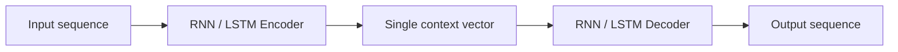
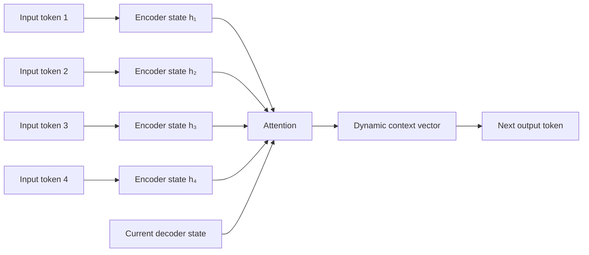
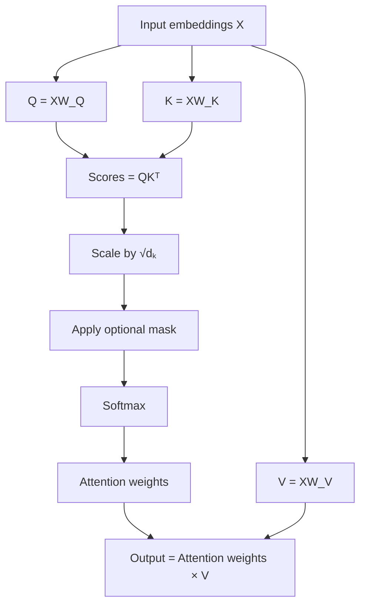
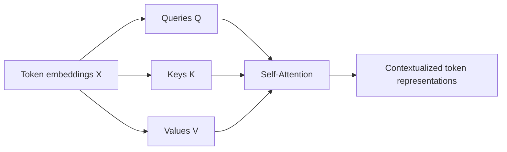
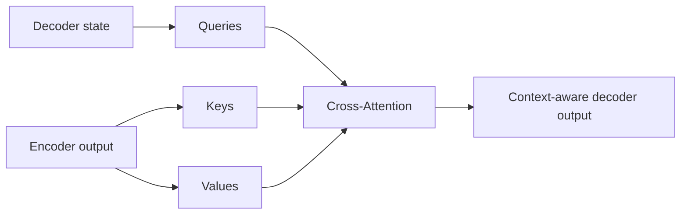
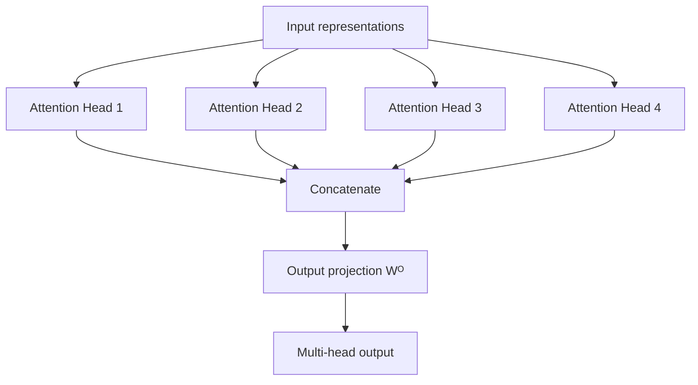
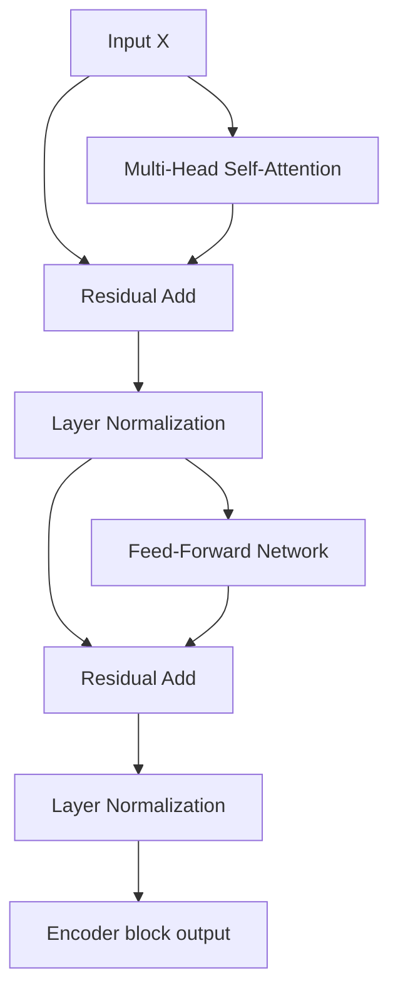
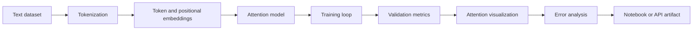

# 014 — Attention

**Course:** 03 — Machine Learning and Deep Learning
**Module:** Module 07 — Deep Learning
**Content Group:** Transformer Concepts
**Roadmap Source:** Deep Learning / Transformer Concepts
**Lesson Type:** Deep Learning
**Order in Module:** 014
**Suggested Duration:** 24 minutes

---

## 1. Summary

This lesson explains the **Attention mechanism** in the context of AI and Data Science.

Attention allows a neural network to dynamically decide which parts of the input are most relevant when producing an output. Instead of compressing an entire sequence into a single fixed-size vector, the model can directly retrieve information from different positions in the sequence.

Attention was originally introduced to improve sequence-to-sequence tasks such as machine translation. It later became the central component of the Transformer architecture and modern large language models.

After this lesson, you should understand:

* Why Attention was introduced.
* How Query, Key, and Value vectors work.
* How attention scores and attention weights are calculated.
* The difference between self-attention and cross-attention.
* Why multi-head attention is more powerful than a single attention head.
* How Attention can be implemented and visualized in a notebook.

In encoder–decoder models, Attention creates direct information paths between encoder states and each decoder step, reducing the limitations of compressing a long sequence into one context vector.

---

## 2. Learning Objectives

By the end of this lesson, you should be able to:

* Explain Attention in your own words.
* Describe the limitation of the fixed context vector in traditional sequence-to-sequence models.
* Explain the roles of **Query**, **Key**, and **Value**.
* Calculate scaled dot-product attention.
* Distinguish between self-attention, cross-attention, and masked self-attention.
* Explain why Transformers use multiple attention heads.
* Interpret an attention matrix or attention heatmap.
* Implement a basic Attention layer using NumPy or PyTorch.
* Identify common mistakes when using or interpreting Attention.

---

## 3. Prerequisites

Before studying Attention, you should understand:

* Vectors and matrices
* Dot products
* Matrix multiplication
* Softmax
* Word embeddings
* RNNs and LSTMs
* Encoder–decoder architectures
* Basic PyTorch tensor operations

---

## 4. Why Do We Need Attention?

### 4.1 The Fixed Context Vector Problem

A traditional sequence-to-sequence model usually contains:

1. An **encoder** that reads the input sequence.
2. A **decoder** that generates the output sequence.

The encoder compresses the entire input into one fixed-size context vector.



For a short input, this may work reasonably well.

For a long input, however, the context vector must represent:

* Every important word
* Word order
* Grammar
* Long-distance dependencies
* Semantic relationships
* Negations and modifiers

This creates an information bottleneck.

For example:

```text
Do not eat the pizza that looks and smells delicious.
```

If the model forgets the word `not`, the meaning of the sentence changes completely.

Even LSTMs may lose important early information when processing long and complex sequences. Attention addresses this problem by allowing each decoder step to access all encoder outputs directly.

---

### 4.2 The Attention Solution

Instead of using only the final encoder state, Attention allows the decoder to examine all encoder states.



At every output step, the model calculates:

* Which input positions are relevant.
* How much attention should be assigned to each position.
* What information should be retrieved from those positions.

The context vector is therefore **dynamic**, not fixed.

---

## 5. Intuition Behind Attention

Attention can be understood as a differentiable information-retrieval system.

Imagine a database containing key–value pairs:

```text
Key: information used for matching
Value: information returned when the key matches
```

A query searches the database.

```text
Query → compare with Keys → obtain relevance scores → combine Values
```

This produces the three main components of Attention:

* **Query:** What information am I looking for?
* **Key:** What type of information do I contain?
* **Value:** What information should I provide?

---

## 6. Query, Key, and Value

Assume the input sequence contains $n$ tokens.

Each token is initially represented by an embedding vector:

$$
x_i \in \mathbb{R}^{d_{\text{model}}}
$$

The model transforms each embedding into three vectors:

$$
q_i = x_i W_Q
$$

$$
k_i = x_i W_K
$$

$$
v_i = x_i W_V
$$

where:

* $W_Q$ is the Query projection matrix.
* $W_K$ is the Key projection matrix.
* $W_V$ is the Value projection matrix.
* These matrices are trainable parameters.

For the entire sequence:

$$
Q = XW_Q
$$

$$
K = XW_K
$$

$$
V = XW_V
$$

The same input embeddings can therefore produce different Query, Key, and Value representations.

---

### 6.1 Query

The Query represents what the current token wants to find.

For example, in the sentence:

```text
The animal did not cross the road because it was tired.
```

When updating the representation of `it`, the Query may search for the noun to which `it` refers.

---

### 6.2 Key

The Key describes what each token can match against.

The Query of `it` is compared with the Keys of:

```text
The
animal
did
not
cross
the
road
because
it
was
tired
```

A well-trained Attention mechanism may assign a high compatibility score between `it` and `animal`.

---

### 6.3 Value

The Value contains the actual information retrieved from a token.

The Key determines whether a token is relevant. The corresponding Value provides the information that contributes to the output.

A useful analogy is:

```text
Query = search request
Key   = document title or index
Value = document content
```

---

## 7. Scaled Dot-Product Attention

The standard Attention operation used in Transformers is:

$$
\text{Attention}(Q,K,V) =
\text{softmax}
\left(
\frac{QK^\top}{\sqrt{d_k}}
\right)V
$$

This operation contains four main steps.

---

### Step 1: Calculate Compatibility Scores

The Query vectors are compared with the Key vectors using dot products:

$$
S = QK^\top
$$

The result $S$ is an attention-score matrix.

If the input contains $n$ tokens:

$$
S \in \mathbb{R}^{n \times n}
$$

Each element $S_{ij}$ measures how relevant token $j$ is to token $i$.

```text
                  Key token
              k₁    k₂    k₃
Query token q₁  s₁₁   s₁₂   s₁₃
            q₂  s₂₁   s₂₂   s₂₃
            q₃  s₃₁   s₃₂   s₃₃
```

---

### Step 2: Scale the Scores

The scores are divided by:

$$
\sqrt{d_k}
$$

Therefore:

$$
\hat{S} = \frac{QK^\top}{\sqrt{d_k}}
$$

Without scaling, dot products can become large when the Key dimension $d_k$ is large.

Large values may push Softmax into saturated regions, producing extremely small gradients.

Scaling improves numerical stability and training behavior.

---

### Step 3: Apply Softmax

Softmax converts the scores into normalized attention weights:

$$
A =
\text{softmax}
\left(
\frac{QK^\top}{\sqrt{d_k}}
\right)
$$

Each row of $A$ sums to 1:

$$
\sum_j A_{ij} = 1
$$

The values can be interpreted as the proportion of attention that token $i$ assigns to other tokens.

Example:

```text
Token "it" attends to:

animal   → 0.62
road     → 0.17
tired    → 0.13
others   → 0.08
```

---

### Step 4: Combine the Values

The final output is a weighted sum of the Value vectors:

$$
Z = AV
$$

For one token:

$$
z_i = \sum_{j=1}^{n} A_{ij}v_j
$$

The output representation $z_i$ contains information collected from the entire sequence.

Self-attention therefore transforms a token's initial semantic embedding into a context-dependent representation.

---

## 8. Complete Attention Flow



---

## 9. A Small Numerical Example

Suppose there are two tokens with one-dimensional Query, Key, and Value vectors:

$$
Q =
\begin{bmatrix}
1 \\
2
\end{bmatrix}
$$

$$
K =
\begin{bmatrix}
1 \\
3
\end{bmatrix}
$$

$$
V =
\begin{bmatrix}
10 \\
20
\end{bmatrix}
$$

Assume $d_k = 1$.

### 9.1 Calculate the Scores

$$
QK^\top =
\begin{bmatrix}
1 \\
2
\end{bmatrix}
\begin{bmatrix}
1 & 3
\end{bmatrix}
=
\begin{bmatrix}
1 & 3 \\
2 & 6
\end{bmatrix}
$$

Because $\sqrt{1}=1$, scaling does not change the values.

---

### 9.2 Apply Softmax Row-Wise

For the first token:

$$
\text{softmax}([1,3])
\approx
[0.119,0.881]
$$

For the second token:

$$
\text{softmax}([2,6])
\approx
[0.018,0.982]
$$

Therefore:

$$
A \approx
\begin{bmatrix}
0.119 & 0.881 \\
0.018 & 0.982
\end{bmatrix}
$$

---

### 9.3 Combine the Values

$$
Z = AV
$$

$$
Z \approx
\begin{bmatrix}
0.119 & 0.881 \\
0.018 & 0.982
\end{bmatrix}
\begin{bmatrix}
10 \\
20
\end{bmatrix}
$$

$$
Z \approx
\begin{bmatrix}
18.81 \\
19.82
\end{bmatrix}
$$

Both output representations are influenced more strongly by the second Value because the corresponding attention weights are larger.

---

## 10. Self-Attention

In self-attention, Query, Key, and Value are generated from the same input sequence:

$$
Q = XW_Q
$$

$$
K = XW_K
$$

$$
V = XW_V
$$

This allows every token to interact with every other token.



---

### 10.1 Contextual Meaning

Consider the word `bank`:

```text
She deposited money at the bank.
```

```text
They sat on the river bank.
```

The initial embedding for `bank` may be identical in both sentences.

After self-attention:

* In the first sentence, `bank` can attend to `money` and `deposited`.
* In the second sentence, `bank` can attend to `river` and `sat`.

The resulting contextual representations become different.

Attention gradually updates token embeddings so that they contain richer context instead of representing isolated words only.

---

## 11. Cross-Attention

In cross-attention, Query comes from one sequence, while Key and Value come from another sequence.

In an encoder–decoder Transformer:

$$
Q = X_{\text{decoder}}W_Q
$$

$$
K = X_{\text{encoder}}W_K
$$

$$
V = X_{\text{encoder}}W_V
$$

The decoder uses its current representation to retrieve relevant information from the encoder output.



Cross-attention is commonly used in:

* Machine translation
* Image captioning
* Speech recognition
* Multimodal models
* Retrieval-augmented architectures
* Text-to-image systems

---

## 12. Masked Self-Attention

Autoregressive language models predict the next token using only previous tokens.

When predicting token $t$, the model must not access tokens after position $t$.

A causal mask is added to the attention scores:

$$
\text{MaskedAttention}(Q,K,V) =
\text{softmax}
\left(
\frac{QK^\top + M}{\sqrt{d_k}}
\right)V
$$

The mask matrix contains:

$$
M_{ij} =
\begin{cases}
0, & j \leq i \\
-\infty, & j > i
\end{cases}
$$

Example mask:

$$
M =
\begin{bmatrix}
0 & -\infty & -\infty \\
0 & 0 & -\infty \\
0 & 0 & 0
\end{bmatrix}
$$

After Softmax, masked positions receive approximately zero probability.

```text
Token 1 can see: Token 1
Token 2 can see: Token 1, Token 2
Token 3 can see: Token 1, Token 2, Token 3
```

This prevents future-token information leakage during training.

---

## 13. Padding Masks

Sequences in the same batch are often padded to the same length.

Example:

```text
Sentence 1: I enjoy machine learning
Sentence 2: Attention is useful [PAD]
```

The model should not attend to `[PAD]` tokens.

A padding mask assigns a very negative score to padded positions before Softmax.

```text
Original scores: [1.4, 2.1, 0.8, 1.7]
Padding mask:    [0,   0,   0,   -∞ ]

Masked scores:   [1.4, 2.1, 0.8, -∞ ]
```

After Softmax, the padding position receives zero attention weight.

---

## 14. Multi-Head Attention

A single attention head produces one set of Query, Key, and Value projections.

However, one relationship pattern may not be sufficient.

Different heads can learn different types of relationships, such as:

* Subject–verb relationships
* Pronoun references
* Negation
* Long-distance dependencies
* Entity relationships
* Local syntactic patterns
* Semantic similarity
* Positional patterns

For head $i$:

$$
\text{head}_i =
\text{Attention}
\left(
QW_i^Q,
KW_i^K,
VW_i^V
\right)
$$

The heads are concatenated:

$$
\text{MultiHead}(Q,K,V) =
\text{Concat}
\left(
\text{head}_1,
\dots,
\text{head}_h
\right)W^O
$$

where:

* $h$ is the number of attention heads.
* $W_i^Q$, $W_i^K$, and $W_i^V$ are head-specific projections.
* $W^O$ combines the outputs.



Each head receives the complete sequence but usually operates on a smaller representation dimension.

A common configuration is:

$$
d_k = d_v = \frac{d_{\text{model}}}{h}
$$

For example:

```text
d_model = 512
number of heads = 8
dimension per head = 512 / 8 = 64
```

---

## 15. Attention Tensor Shapes

Assume:

```text
batch_size  = B
seq_length  = L
d_model     = D
num_heads   = H
head_dim    = D / H
```

Initial input:

$$
X \in \mathbb{R}^{B \times L \times D}
$$

Projected Query, Key, and Value:

$$
Q,K,V \in \mathbb{R}^{B \times L \times D}
$$

After splitting into heads:

$$
Q,K,V
\in
\mathbb{R}^{B \times H \times L \times d_k}
$$

Attention-score matrix:

$$
QK^\top
\in
\mathbb{R}^{B \times H \times L \times L}
$$

Output of each head:

$$
Z
\in
\mathbb{R}^{B \times H \times L \times d_v}
$$

After concatenating heads:

$$
Z_{\text{concat}}
\in
\mathbb{R}^{B \times L \times D}
$$

Tracking these shapes is one of the most important skills when implementing Attention.

---

## 16. Attention Inside a Transformer Block

Attention is usually combined with:

* Residual connections
* Layer normalization
* Feed-forward networks
* Dropout

A simplified encoder block is:



A common conceptual representation is:

$$
X' =
\text{LayerNorm}
\left(
X + \text{MultiHeadAttention}(X)
\right)
$$

$$
Y =
\text{LayerNorm}
\left(
X' + \text{FFN}(X')
\right)
$$

Some modern architectures use pre-normalization instead:

$$
X' =
X +
\text{MultiHeadAttention}
\left(
\text{LayerNorm}(X)
\right)
$$

---

## 17. NumPy Implementation

The following example implements basic scaled dot-product Attention:

```python
import numpy as np


def softmax(x: np.ndarray, axis: int = -1) -> np.ndarray:
    """Compute a numerically stable softmax."""
    shifted = x - np.max(x, axis=axis, keepdims=True)
    exp_values = np.exp(shifted)
    return exp_values / np.sum(exp_values, axis=axis, keepdims=True)


def scaled_dot_product_attention(
    query: np.ndarray,
    key: np.ndarray,
    value: np.ndarray,
    mask: np.ndarray | None = None,
) -> tuple[np.ndarray, np.ndarray]:
    """
    Compute scaled dot-product attention.

    Args:
        query: Array with shape (..., query_length, d_k).
        key: Array with shape (..., key_length, d_k).
        value: Array with shape (..., key_length, d_v).
        mask: Optional Boolean mask broadcastable to the score matrix.
              True means the position is allowed.

    Returns:
        output: Weighted sum of Value vectors.
        weights: Normalized attention weights.
    """
    d_k = query.shape[-1]

    scores = query @ np.swapaxes(key, -2, -1)
    scores = scores / np.sqrt(d_k)

    if mask is not None:
        scores = np.where(mask, scores, -1e9)

    weights = softmax(scores, axis=-1)
    output = weights @ value

    return output, weights


query = np.array([
    [1.0, 0.0],
    [0.0, 1.0],
])

key = np.array([
    [1.0, 0.0],
    [0.5, 0.5],
])

value = np.array([
    [10.0, 0.0],
    [0.0, 20.0],
])

output, attention_weights = scaled_dot_product_attention(
    query,
    key,
    value,
)

print("Attention weights:")
print(attention_weights)

print("\nOutput:")
print(output)
```

---

## 18. PyTorch Implementation

```python
import math

import torch
from torch import Tensor
from torch import nn


class ScaledDotProductAttention(nn.Module):
    """Basic scaled dot-product Attention."""

    def __init__(self, dropout: float = 0.0) -> None:
        super().__init__()
        self.dropout = nn.Dropout(dropout)

    def forward(
        self,
        query: Tensor,
        key: Tensor,
        value: Tensor,
        mask: Tensor | None = None,
    ) -> tuple[Tensor, Tensor]:
        """
        Args:
            query: (..., query_length, d_k)
            key: (..., key_length, d_k)
            value: (..., key_length, d_v)
            mask: Boolean tensor broadcastable to attention scores.
                  True means the position is allowed.
        """
        d_k = query.size(-1)

        scores = torch.matmul(
            query,
            key.transpose(-2, -1),
        ) / math.sqrt(d_k)

        if mask is not None:
            scores = scores.masked_fill(~mask, float("-inf"))

        weights = torch.softmax(scores, dim=-1)
        weights = self.dropout(weights)

        output = torch.matmul(weights, value)

        return output, weights
```

---

## 19. Using PyTorch Multi-Head Attention

PyTorch provides a built-in implementation:

```python
import torch
from torch import nn


batch_size = 4
sequence_length = 10
d_model = 128
num_heads = 8

attention = nn.MultiheadAttention(
    embed_dim=d_model,
    num_heads=num_heads,
    dropout=0.1,
    batch_first=True,
)

x = torch.randn(
    batch_size,
    sequence_length,
    d_model,
)

output, attention_weights = attention(
    query=x,
    key=x,
    value=x,
    need_weights=True,
)

print("Input shape:", x.shape)
print("Output shape:", output.shape)
print("Attention shape:", attention_weights.shape)
```

Expected shapes:

```text
Input shape:     [4, 10, 128]
Output shape:    [4, 10, 128]
Attention shape: [4, 10, 10]
```

Depending on the configuration, PyTorch may average attention weights across heads.

To retain separate weights for each head:

```python
output, attention_weights = attention(
    query=x,
    key=x,
    value=x,
    need_weights=True,
    average_attn_weights=False,
)

print(attention_weights.shape)
```

Expected shape:

```text
[batch_size, num_heads, target_length, source_length]
```

---

## 20. Visualizing Attention

Attention weights can be displayed as a heatmap.

Example tokens:

```python
tokens = [
    "The",
    "animal",
    "did",
    "not",
    "cross",
    "the",
    "road",
]
```

Example visualization:

```python
import matplotlib.pyplot as plt
import numpy as np


weights = np.array([
    [0.50, 0.10, 0.05, 0.05, 0.10, 0.10, 0.10],
    [0.05, 0.45, 0.10, 0.05, 0.10, 0.10, 0.15],
    [0.05, 0.10, 0.40, 0.20, 0.10, 0.05, 0.10],
    [0.03, 0.05, 0.20, 0.30, 0.30, 0.02, 0.10],
    [0.05, 0.15, 0.10, 0.35, 0.20, 0.05, 0.10],
    [0.10, 0.10, 0.05, 0.05, 0.10, 0.45, 0.15],
    [0.05, 0.15, 0.05, 0.10, 0.15, 0.10, 0.40],
])

fig, ax = plt.subplots(figsize=(8, 6))

image = ax.imshow(weights)

ax.set_xticks(range(len(tokens)))
ax.set_yticks(range(len(tokens)))
ax.set_xticklabels(tokens, rotation=45, ha="right")
ax.set_yticklabels(tokens)

ax.set_xlabel("Key tokens")
ax.set_ylabel("Query tokens")
ax.set_title("Self-Attention Weights")

fig.colorbar(image, ax=ax)
fig.tight_layout()
plt.show()
```

In the heatmap:

* Each row represents a Query token.
* Each column represents a Key token.
* A larger value indicates stronger attention.

---

## 21. Attention Is Not Automatically an Explanation

Attention heatmaps are useful diagnostic tools, but they must be interpreted carefully.

A high attention weight does not always mean:

* The token caused the prediction.
* The token is the only important feature.
* The model follows a human-understandable reasoning process.
* Removing the token will necessarily change the output.

Reasons include:

* Information is distributed across layers.
* Multiple heads interact.
* Residual connections preserve earlier representations.
* Feed-forward layers transform the attention output.
* Similar outputs may be produced using different attention patterns.

Attention should therefore be treated as one interpretability signal, not complete proof of model reasoning.

---

## 22. Computational Complexity

For a sequence of length $n$, standard self-attention creates an $n \times n$ score matrix.

Its approximate time and memory complexity is:

$$
O(n^2)
$$

This becomes expensive for long sequences.

Examples:

| Sequence length | Number of pairwise scores |
| --------------: | ------------------------: |
|             128 |                    16,384 |
|             512 |                   262,144 |
|           2,048 |                 4,194,304 |
|           8,192 |                67,108,864 |

Long-context models may use optimized alternatives such as:

* Sparse Attention
* Sliding-window Attention
* Local Attention
* Linear Attention
* FlashAttention
* Block-sparse Attention
* Memory compression
* Retrieval mechanisms

However, these approaches may introduce trade-offs in implementation complexity, memory use, or approximation quality.

---

## 23. Attention Compared with RNNs

| Property                    | RNN / LSTM              | Self-Attention        |
| --------------------------- | ----------------------- | --------------------- |
| Sequence processing         | Sequential              | Highly parallelizable |
| Long-range interaction      | Indirect                | Direct                |
| Path between distant tokens | Long                    | Short                 |
| Position information        | Naturally sequential    | Must be encoded       |
| Long-sequence cost          | Usually linear per step | Usually quadratic     |
| Training parallelism        | Limited                 | Strong                |
| Context representation      | Hidden-state chain      | Pairwise interactions |

Self-attention directly connects distant tokens, but unlike an RNN, it does not inherently understand token order.

Therefore, Transformers require positional information.

---

## 24. Positional Information

Self-attention alone treats the input as a collection of tokens.

Without positional information, these sequences would contain the same token set:

```text
dog bites man
```

```text
man bites dog
```

Transformers therefore add or learn positional representations:

$$
X_{\text{input}} =
X_{\text{token}}
+
X_{\text{position}}
$$

Common approaches include:

* Sinusoidal positional encoding
* Learned positional embeddings
* Relative positional embeddings
* Rotary positional embeddings
* Attention biases based on distance

Positional encoding is studied separately, but it is essential for meaningful self-attention.

---

## 25. Common Attention Types

### 25.1 Encoder Self-Attention

```text
Q = encoder states
K = encoder states
V = encoder states
```

Each input token can attend to other input tokens.

---

### 25.2 Decoder Masked Self-Attention

```text
Q = decoder states
K = decoder states
V = decoder states
```

A causal mask prevents access to future tokens.

---

### 25.3 Encoder–Decoder Cross-Attention

```text
Q = decoder states
K = encoder states
V = encoder states
```

The decoder retrieves relevant information from the encoded input.

---

### 25.4 Bidirectional Self-Attention

Every token can attend to tokens before and after it.

This is commonly used for representation-learning tasks such as:

* Text classification
* Named entity recognition
* Sentence similarity
* Masked-language modeling

---

### 25.5 Causal Self-Attention

Each token can attend only to itself and previous tokens.

This is commonly used for:

* Autoregressive text generation
* Code generation
* Next-token prediction
* Decoder-only language models

---

## 26. Practical Workflow

A practical Attention experiment can follow this pipeline:



For a classification task:

```text
raw text
→ tokenizer
→ token IDs
→ embeddings
→ self-attention
→ pooled representation
→ classification layer
→ class probabilities
```

---

## 27. Suggested Demo

### Task

Build a small text-classification model using self-attention.

Possible datasets:

* IMDb sentiment classification
* AG News classification
* SMS spam classification
* A small custom intent-classification dataset

### Models to Compare

1. Average embedding classifier
2. BiLSTM classifier
3. BiLSTM with Attention
4. Small Transformer encoder

### Metrics

For balanced classes:

* Accuracy
* Macro F1-score
* Confusion matrix

For imbalanced classes:

* Precision
* Recall
* Macro F1-score
* PR-AUC

### Visualizations

* Training and validation loss
* Training and validation F1-score
* Confusion matrix
* Attention heatmap
* Sequence-length distribution
* Error examples by class

---

## 28. Practice Exercises

### Exercise 1 — Explain Attention

Explain Attention in one or two minutes without using mathematical notation.

Your explanation should mention:

* The fixed context-vector problem
* Dynamic relevance weights
* Query, Key, and Value
* Weighted combinations of information

---

### Exercise 2 — Calculate Attention by Hand

Given:

$$
Q =
\begin{bmatrix}
1 & 0
\end{bmatrix}
$$

$$
K =
\begin{bmatrix}
1 & 0 \\
0 & 1
\end{bmatrix}
$$

$$
V =
\begin{bmatrix}
2 & 1 \\
0 & 3
\end{bmatrix}
$$

Calculate:

1. $QK^\top$
2. The scaled scores
3. Softmax weights
4. The weighted Value output

Use:

$$
d_k = 2
$$

---

### Exercise 3 — Implement Attention

Implement scaled dot-product Attention using NumPy.

The function should accept:

```python
query
key
value
mask
```

It should return:

```python
output
attention_weights
```

Add assertions that validate the tensor dimensions.

---

### Exercise 4 — Add a Causal Mask

Create a causal mask for a sequence of length 5.

Expected visible positions:

```text
Token 1: 1
Token 2: 1 1
Token 3: 1 1 1
Token 4: 1 1 1 1
Token 5: 1 1 1 1 1
```

Verify that future positions receive zero probability after Softmax.

---

### Exercise 5 — Visualize Attention

Train a small attention-based text classifier and visualize one attention head for:

* A correctly classified example
* An incorrectly classified example
* A sentence containing negation
* A sentence containing repeated words
* A long sentence

Write down what patterns you observe.

---

### Exercise 6 — Compare Architectures

Compare:

```text
BiLSTM
BiLSTM + Attention
Transformer Encoder
```

Record:

* Validation F1-score
* Training time
* Inference time
* Number of parameters
* Peak GPU or CPU memory
* Performance on long sequences

---

## 29. Common Mistakes

### 29.1 Forgetting the Scaling Factor

Incorrect:

$$
\text{softmax}(QK^\top)V
$$

Standard scaled Attention:

$$
\text{softmax}
\left(
\frac{QK^\top}{\sqrt{d_k}}
\right)V
$$

Without scaling, Softmax may become overly sharp.

---

### 29.2 Applying Softmax Along the Wrong Dimension

Softmax should normally be applied across Key positions:

```python
weights = torch.softmax(scores, dim=-1)
```

Applying Softmax across another dimension changes the meaning of the weights.

---

### 29.3 Using the Wrong Transpose

The score matrix requires:

```python
scores = query @ key.transpose(-2, -1)
```

Not:

```python
scores = query @ key
```

---

### 29.4 Incorrect Mask Semantics

Some implementations use:

```text
True = visible
False = masked
```

Other APIs use the reverse convention.

Always verify the framework documentation and inspect a small test case.

---

### 29.5 Masking After Softmax

The mask should normally be applied before Softmax.

Incorrect:

```python
weights = torch.softmax(scores, dim=-1)
weights = weights * mask
```

This may cause rows not to sum to 1.

Preferred:

```python
scores = scores.masked_fill(~mask, float("-inf"))
weights = torch.softmax(scores, dim=-1)
```

---

### 29.6 Ignoring Padding Tokens

Without a padding mask, the model may assign attention to meaningless `[PAD]` positions.

---

### 29.7 Confusing Attention Scores and Weights

Attention scores:

$$
S = \frac{QK^\top}{\sqrt{d_k}}
$$

Attention weights:

$$
A = \text{softmax}(S)
$$

The scores are unnormalized. The weights are normalized.

---

### 29.8 Confusing Keys and Values

Keys are used for relevance matching.

Values contain the information that is combined.

A token can have a Key that strongly matches a Query while providing a separately transformed Value representation.

---

### 29.9 Assuming Every Attention Head Is Interpretable

Some heads may specialize in clear patterns, but others may be redundant, noisy, distributed, or difficult to interpret.

---

### 29.10 Ignoring Quadratic Complexity

Standard self-attention may become expensive for very long sequences.

Always monitor:

* Sequence length
* Batch size
* Number of heads
* Model dimension
* GPU memory
* Attention-matrix size

---

### 29.11 Comparing Models Unfairly

When comparing an RNN with an Attention model, control:

* Tokenizer
* Dataset split
* Embedding dimension
* Parameter count
* Training budget
* Early-stopping rules
* Evaluation metrics

---

### 29.12 Treating Attention as Complete Causal Evidence

Attention visualization can help generate hypotheses, but it does not fully explain why a model produced a prediction.

Use additional methods when necessary:

* Input ablation
* Gradient-based attribution
* Integrated gradients
* Counterfactual testing
* Feature perturbation
* Error analysis

---

## 30. Completion Checklist

* [ ] I can explain Attention in one or two minutes.
* [ ] I understand the limitation of a fixed context vector.
* [ ] I can explain Query, Key, and Value.
* [ ] I can write the scaled dot-product Attention formula.
* [ ] I understand why scores are divided by $\sqrt{d_k}$.
* [ ] I know which dimension Softmax should use.
* [ ] I can distinguish self-attention from cross-attention.
* [ ] I can explain masked self-attention.
* [ ] I understand padding masks and causal masks.
* [ ] I can explain multi-head attention.
* [ ] I can track the main tensor shapes.
* [ ] I can implement basic Attention in NumPy or PyTorch.
* [ ] I can visualize an attention matrix.
* [ ] I understand that Attention is not automatically a complete explanation.
* [ ] I have recorded at least one caveat, assumption, or open question.

---

## 31. Related Outcome

Understand neural networks, CNNs, RNNs, LSTMs, Attention, Transformers, and transfer learning at a practical level.

After completing this lesson, you should be prepared to study:

* Self-Attention in more depth
* Multi-Head Attention
* Positional Encoding
* Transformer Encoder
* Transformer Decoder
* BERT-style models
* GPT-style models
* Vision Transformers
* Cross-modal Attention

---

## 32. Related Mini Project

### Attention-Based Text Classification

Build a text-classification system that compares:

1. Average word embeddings
2. BiLSTM
3. BiLSTM with Attention
4. Small Transformer encoder

The project should include:

* Data preprocessing
* Tokenization
* Padding masks
* Model architecture diagrams
* Training and validation curves
* Accuracy and Macro F1-score
* Confusion matrix
* Attention heatmaps
* Long-sequence error analysis
* Inference examples
* A small API or interactive notebook

Suggested portfolio artifacts:

```text
attention_text_classifier.ipynb
attention.py
train.py
evaluate.py
attention_heatmap.png
confusion_matrix.png
model_comparison.csv
README.md
```

---

## 33. Key Takeaways

1. Attention allows a model to retrieve information directly from different sequence positions.

2. It reduces the fixed-vector bottleneck found in traditional encoder–decoder models.

3. Queries represent information requests.

4. Keys determine relevance.

5. Values provide the information that is combined.

6. Scaled dot-product Attention is defined as:

$$
\text{Attention}(Q,K,V) =
\text{softmax}
\left(
\frac{QK^\top}{\sqrt{d_k}}
\right)V
$$

7. Self-attention uses the same sequence to generate Query, Key, and Value.

8. Cross-attention retrieves information from another sequence or modality.

9. Causal masks prevent autoregressive models from viewing future tokens.

10. Multi-head attention allows the model to learn several relationship patterns in parallel.

11. Standard self-attention has quadratic complexity with respect to sequence length.

12. Attention matrices are useful for analysis but should not be treated as complete explanations.

---

## 34. Final Summary

**Attention** is one of the most important mechanisms in modern deep learning.

It enables a model to assign different relevance weights to different pieces of information and construct context-aware representations. Instead of depending on a single compressed context vector, the model can directly compare tokens and retrieve useful information from the entire sequence.

Attention became the foundation of the Transformer architecture and now appears in:

* Large language models
* Machine translation
* Text classification
* Speech recognition
* Computer vision
* Image generation
* Multimodal systems
* Retrieval and recommendation systems

To make this knowledge practical, convert it into a small artifact:

```text
dataset
→ tokenizer
→ embeddings
→ attention layer
→ training
→ evaluation
→ attention visualization
→ error analysis
→ notebook or API
```

Understanding Attention prepares you to understand how Transformers convert isolated token embeddings into rich, context-sensitive representations.

---

# Bài luyện tập

## Mục tiêu


## Đề bài


## Yêu cầu hoàn thành

- [ ] 
- [ ] 
- [ ] 

## Kết quả / lời giải


## Ghi chú
